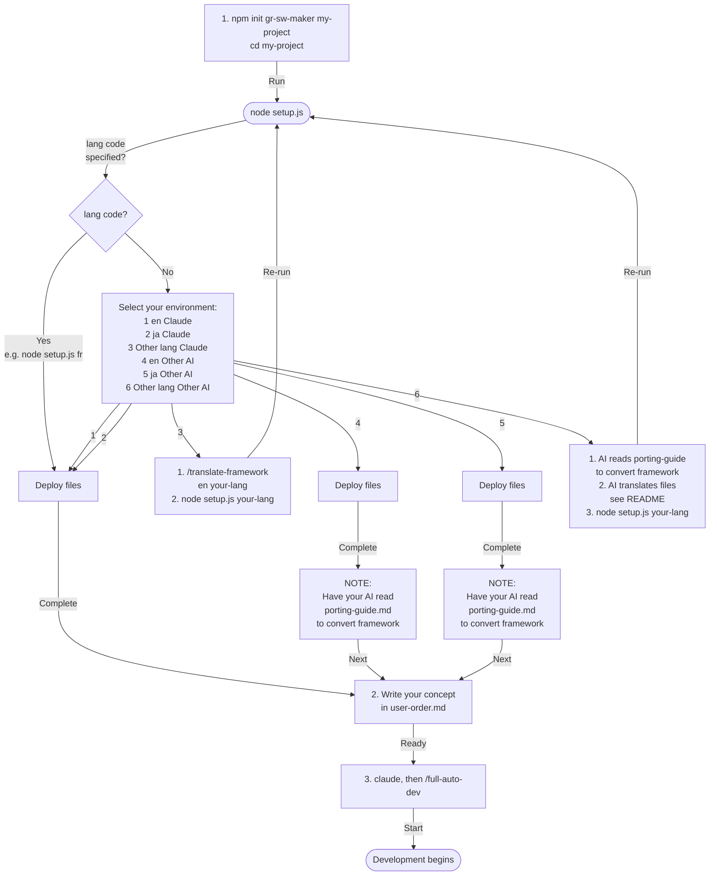

# gr-sw-maker — ほぼ全自動ソフトウェア開発フレームワーク

[English](README.md)

AIコーディングエージェントのマルチエージェント機能を活用して、ソフトウェア開発プロセスを**ほぼ全自動化**するフレームワークです。

**ユーザーがやること:** コンセプトを書く → インタビューに答える → モックを見て方向を直す → 仕様と外部依存の選定を承認する → 受入テストする。その間は自動で進みます。ただしこれらは形式的な確認ではありません。**ここで決めたものが、そのまま出来上がります。**

---

## 動作要件

| | |
| --- | --- |
| Node.js | 18 以上 |
| `tar` | PATH 上にあること。Windows 10 以降・macOS・Linux には標準で同梱 |
| git | clone とフレームワーク自身のフックに使用 |
| AI エージェント | Claude Code。長時間のマルチエージェント実行ができるアカウントが必要。トークン消費は大きい（[コスト](#コスト)を参照） |

---

## クイックスタート

> 全体の流れは[セットアップフロー](#セットアップフロー)を参照。

### 1. 入手

```bash
npm init gr-sw-maker my-project
cd my-project
```

> このリポジトリを clone すると、プロジェクトの雛形ではなく**フレームワーク自身の開発ツリー**が手に入ります。gr-sw-maker 本体を触る場合のみ使ってください（[フレームワーク開発者向け](#フレームワーク開発者向け)を参照）。

### 2. 言語を選ぶ

```bash
node setup.js
```

メニューから言語を選択してください。他の言語を使いたい場合は[言語の選択](#言語の選択)を参照。

### 3. AIプラットフォームを選ぶ（Claude Code ならスキップ）

Claude Code 以外の AI を使う場合、[移植ガイド](framework-src/ja/process-rules/porting-guide.md)を AI に読ませて自動変換を指示してください。

> 詳細は[AIプラットフォームの切り替え](#aiプラットフォームの切り替え)を参照。

### 4. 作りたいものを書く

`user-order.md` に3つの質問に答えるだけ:

```markdown
## 何を作りたい？
チームのタスクを管理できるWebアプリ。タスクの作成・担当者割当・期限設定ができて、
ダッシュボードで進捗が見えるようにしたい。

## それはどうして？
チームの作業が属人化しており、誰が何をしているかわからない。
Excelでの管理が限界。

## その他の希望
Webで使いたい。スマホからも確認できるとうれしい。
```

### 5. Claude Code を起動する

```bash
claude
```

プロジェクトディレクトリで実行してください。`setup.js` が展開したエージェント定義とコマンドは、この位置から読み込まれます。

### 6. 起動

```
/full-auto-dev
```

AI がプロジェクト構成（`CLAUDE.md`）を自動生成し、あなたに確認を求めます。承認すれば、仕様書作成 → 設計 → 実装 → テスト → 納品まで進行します。

---

## 実際に作られたもの

本フレームワークで作成したプロジェクトは
[gr-sw-maker-examples](https://github.com/GoodRelax/gr-sw-maker-examples) にまとめてあります。

---

## 開発の流れ

起動後、AI は 9 フェーズを進行します（`0 install` はフレームワークの配置で、`/full-auto-dev` の前に済んでいます）。うち 2 つは条件に該当する場合のみ実行されます。

| # | フェーズ | 条件付き | AI がやること | ユーザーがやること |
|:-:|---------|:-------:|-------------|-----------------|
| 1 | setup | — | 条件付きプロセス 13 項目を評価し、プロジェクト構成（`CLAUDE.md`）を提案 | 構成を確認・承認 |
| 2 | planning | — | 構造化インタビュー、モック／PoC 作成、仕様書 Ch1-4 | インタビューに答える、**イメージ通りになるまでモックを直させる**、仕様書を承認 |
| 3 | dependency-selection | あり | HW / AI / フレームワーク依存の評価・選定、Adapter 層の設計 | 選定を承認 |
| 4 | design | — | 仕様書 Ch5-7、OpenAPI、脅威モデル、可観測性設計、デプロイ設計、WBS、リスク台帳 | — |
| 5 | implementation | — | コード実装、単体テスト、IaC、依存脆弱性スキャン、ライセンス確認 | — |
| 6 | testing | — | 結合テスト、システムテスト、性能テスト、（有効時）実機テスト | 実機テスト（有効時） |
| 7 | delivery | — | 最終レビュー、デプロイ、ユーザーマニュアル、運用手順書、総括レポート | IaC を承認、受入テストを実施 |
| 8 | operation | あり | インシデント報告、パッチ適用、SLA 監視 | — |

`dependency-selection` は HW 連携・AI/LLM 連携・フレームワーク要求定義のいずれかが有効なとき、`operation` はリリース後に運用する場合に実行されます。どちらもフェーズ 1 で判断します。

各フェーズの境界で品質ゲート（AI レビュー）を通過しないと次に進めません。同一ゲートが 3 回失敗した場合はループせず、ユーザーにエスカレーションされます（厳格では 2 回目）。

---

## 適用範囲と限界

- **グリーンフィールド専用。** 空のプロジェクトから始めるプロセスです。既存コードベースへ導入する経路は定義されていません。
- **ANGS は選択できません。** 三段階の仕様体系（ANMS / ANPS / ANGS）はエッセイで論じていますが、ANGS は研究段階であり、本バージョンでは選択可能な値域から外してあります。
- **検証済みは Claude Code のみ。** 他プラットフォームには移植ガイドがありますが、実機で動作を確認したものはありません（[AIプラットフォーム対応](#aiプラットフォーム対応)を参照）。
- **成果物の受入判断は人間が行います。** 品質ゲートは AI によるレビューです。下限を引き上げ、Critical / High の指摘があれば進行を止めますが、受け入れるかどうかの判断は人間に残ります。

---

## コスト

**金額は載せません。** 消費量は何を作るかでほぼ決まり、あるプロジェクトでの実測値は別のプロジェクトでは誤った期待値になるためです。以下は構成だけを示します。

**何が消費量を決めるか**

- 8 フェーズそれぞれで複数のエージェントが起動する。各エージェントは定義に書かれた規則の節だけを読む（規則全文は読まない）
- 仕様書の規模。設計・実装・テストの分量にそのまま波及する
- ゲートの失敗回数。修正後にレビューを再実行するため

**どこに記録されるか**

- `tools/otel-sink.mjs` が OpenTelemetry の受け口として動き、コストとトークンを `project-management/progress/session-state.json` に書く
- progress-monitor がフェーズ境界でそれを読み、フェーズ別の実績を `project-management/progress/cost-log.json` に追記する
- **受け口を起動していなければテレメトリは黙って捨てられます。** そのためファイルには鮮度マーカーがあり、プロセスは推測で埋めずに欠測として記録します

**ユーザーが設定するもの**

`CLAUDE.md`「品質目標」のコスト予算とアラート閾値。**どちらも記入必須です。** プレースホルダのまま放置すると比較対象が存在せず、アラートは永久に発火しません。

---

## AIプラットフォーム対応

デフォルトは **Claude Code** 向けですが、他の AI コーディングエージェントにも移植可能です。

| 対応状況 | プラットフォーム |
|---------|----------------|
| 検証済み | Claude Code |
| 移植ガイドのみ・**未検証** | OpenAI Codex CLI, Gemini CLI, Cursor, Windsurf, Cline, Roo Code, Aider |

### AIプラットフォームの切り替え

対象 AI で [`framework-src/ja/process-rules/porting-guide.md`](framework-src/ja/process-rules/porting-guide.md) を読み込み、自動変換を指示してください。

1 言語分として同梱される 40 ファイル（約 11,300 行）で実測した内訳:

- **約 93% の行はフォーマット変換が不要です。** 作業は 3 箇所に集中します。エージェント定義 22 本の frontmatter（247 行）、コマンド 5 本（589 行）、`CLAUDE.md` のヘッダ
- **ベンダー固有の語は 197 箇所**（製品名・モデル名・`.claude/` パス）。移植ガイド自身を除く 39 ファイル中 32 ファイルに散在しており、一括置換で対応します
- **プラットフォーム固有の記述を一切含まない文書が 4 つあります:** defect 分類、実機テスト フィードバック管理規則、仕様テンプレート、`user-order.md`

大半のファイルは書き直しではなく局所的な修正で済みます。ただし数字に表れないものが 2 つあります。

- **サブエージェントの並列実行を持たないプラットフォーム**では、並列実装（Agent Teams + git worktree）を逐次実行に再構成する必要があります
- **`tools/gate-guard.mjs`・`tools/otel-sink.mjs`・`tools/session-meter.mjs` は Claude Code 固有です。** 省略してもプロセスは成立しますが、ゲート強制とコストアラートは手動確認に置き換わります

**上記はいずれも Claude Code 以外での動作を確認したものではありません。** 数値はファイルの構成を示すものであり、移植が完了した実績ではありません。

**この変換ができない AI に本フレームワークを使う能力はありません。**

> 言語選択とプラットフォーム変換の両方が必要な場合は、**言語選択 → プラットフォーム変換** の順で実行してください。

---

## 言語の選択

### 日本語 / 英語で使う場合

セットアップスクリプトを実行してメニューから選択するだけです:

```bash
node setup.js
```

エージェント定義とコマンドが自動でデプロイされます。

### 他の言語で使う場合

1. AI に翻訳を指示:

```
/translate-framework ja fr
```

2. 翻訳されたファイルをデプロイ:

```bash
node setup.js fr
```

翻訳ルール（何を翻訳し、何を英語のまま残すか）はコマンド内に定義済みです。

---

## フレームワーク開発者向け

gr-sw-maker フレームワーク自体のメンテナンスを行う場合、以下のファイル規約に注意:

- **原本は `framework-src/{lang}/` 配下**にサフィックスなしで置く — `agents/`、`commands/`、`process-rules/`、`CLAUDE.md`、`user-order.md`。git が追跡するのはこちら。
- **`node setup.js <lang>`** が選択した言語をツールの読み取り位置へ複製する（`.claude/agents/`、`.claude/commands/`、`process-rules/`、ルート 2 ファイル）。本リポジトリではこの複製は `.gitignore` 対象でコミットしてはならない。ユーザープロジェクトでは逆に、それが作業ファイルになる。
- **clone 後は `node setup.js ja`（または `en`）を実行する。** 実行するまで `CLAUDE.md` もエージェント定義も存在しない。
- **`README.md` / `README-ja.md`** は GitHub の表示に必要なため直接 tracked しており、`setup.js` では生成しない。
- **`essays/research/*.md`** は単一言語の調査レポート — `setup.js` の生成物ではなく、通常通り tracked。
- **どちらが走らせるかをディレクトリ名が表す。** `maintenance-tools/` は本リポジトリを守るもので、ユーザープロジェクトへは配られない。`check-parity` / `check-roster` / `check-links` / `check-tagnames` / `check-terms` / `check-setup` の 6 本を CI が実行し、`split-work-table` / `context-census` / `jsonl2md` は手で走らせる。`tools/` は `create.js` が配布するもので、`gate-guard` / `otel-sink` / `session-meter` / `start-otel-sink.bat` / `spec-query/` の 5 つである。各々の中身は[道具の目録](maintenance-tools/README.md)にある。
- **`maintenance/` と `maintenance-tools/` は別物である。** `maintenance/` は改善作業の記録で、プロセス規則の生成元になる作業表の正本もここに在る。`maintenance-tools/` はスクリプトである。一覧では隣り合うが、実行できるのは後者だけである。
- **clone ごとに 1 度フックを有効化する:** `git config core.hooksPath maintenance-tools/hooks`。片方の言語だけを変更したコミットを拒否する。
- 詳細な規約と検査の手元実行は[フレームワーク開発ガイド](framework-src/ja/process-rules/framework-development.md)を参照。

---

## ドキュメント

| 文書 | 内容 |
|------|------|
| [プロセス規則](framework-src/ja/process-rules/full-auto-dev-process-rules.md) | フェーズ定義、品質ゲート、条件付きプロセス |
| [文書管理規則](framework-src/ja/process-rules/full-auto-dev-document-rules.md) | 命名、ブロック構造、バージョニング |
| [エージェント一覧](framework-src/ja/process-rules/agent-list.md) | 全エージェントの名簿、オーナーシップ、データフロー |
| [レビュー基準](framework-src/ja/process-rules/review-standards.md) | R1-R7 レビュー観点とチェックリスト |
| [プロンプト構造規約](framework-src/ja/process-rules/prompt-structure.md) | S0-S6 エージェント定義規約 |
| [仕様テンプレート](framework-src/ja/process-rules/spec-template.md) | ANMS 仕様テンプレート（STFB 構造） |
| [用語集](framework-src/ja/process-rules/glossary.md) | フレームワーク用語の定義と選定理由 |
| [defect 分類](framework-src/ja/process-rules/defect-taxonomy.md) | error / fault / failure / defect / incident 因果連鎖 |
| [実機テスト フィードバック管理規則](framework-src/ja/process-rules/field-issue-handling-rules.md) | 実機テストのフィードバック管理（条件付き） |
| [移植ガイド](framework-src/ja/process-rules/porting-guide.md) | 他 AI プラットフォームへの変換仕様 |
| [フレームワーク開発ガイド](framework-src/ja/process-rules/framework-development.md) | リポジトリ規約、検査、npm publish 手順 |
| [論文](essays/) | ANMS / ANPS / ANGS 三段階仕様体系の設計根拠 |

---

## セットアップフロー



---

## ライセンス

© 2026 GoodRelax. MIT License. [LICENSE](LICENSE) を参照。
