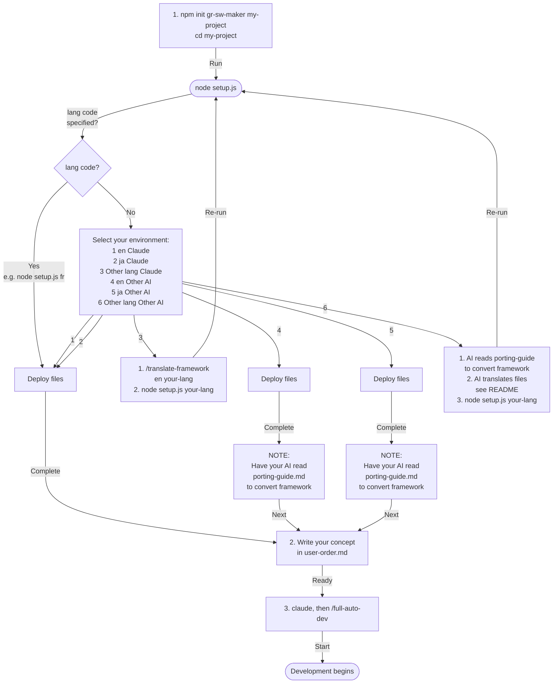

# gr-sw-maker — Nearly Fully Automated Software Development Framework

[Japanese Version](README-ja.md)

A framework that **nearly fully automates** the software development process using AI coding agent multi-agent capabilities.

**What you do:** write the concept → answer the interview → steer the mock until it looks right → approve the specification and the dependency choices → run the acceptance tests. Everything between those points is automated. Those points are not formalities: what you decide there is what you get.

---

## Requirements

| | |
| --- | --- |
| Node.js | 18 or newer |
| `tar` | On PATH. Bundled with Windows 10+, macOS and Linux |
| git | For cloning and for the framework's own hooks |
| AI agent | Claude Code, on an account that can run long multi-agent sessions. The framework is token-heavy; see [Cost](#cost) |

---

## Quick Start

> See [Setup Flow](#setup-flow) for the full picture.

### 1. Get it

```bash
npm init gr-sw-maker my-project
cd my-project
```

> Cloning this repository instead gives you the framework's own development tree, not a project scaffold. Do that only when working on gr-sw-maker itself — see [For Framework Developers](#for-framework-developers).

### 2. Choose a language

```bash
node setup.js
```

Select your language from the menu. For other languages, see [Language Selection](#language-selection).

### 3. Choose an AI platform (skip for Claude Code)

If using an AI other than Claude Code, have your AI read the [Porting Guide](framework-src/en/process-rules/porting-guide.md) and auto-convert.

> See [Switching AI Platform](#switching-ai-platform) for details.

### 4. Describe what you want to build

Answer three questions in `user-order.md`:

```markdown
## What do you want to build?

A web app for managing team tasks — create tasks, assign members, set deadlines,
and view progress on a dashboard.

## Why?

Work is siloed across individuals and no one knows who is doing what.
Excel-based tracking has hit its limits.

## Other preferences

Web-based. Mobile-friendly would be nice.
```

### 5. Start Claude Code

```bash
claude
```

Run it in the project directory. The agent definitions and commands deployed by `setup.js` are picked up from there.

### 6. Launch

```
/full-auto-dev
```

The AI auto-generates the project configuration (`CLAUDE.md`), then asks for your review. Once approved, it proceeds through spec writing → design → implementation → testing → delivery.

---

## See it in Action

Projects built with this framework are collected in
[gr-sw-maker-examples](https://github.com/GoodRelax/gr-sw-maker-examples).

---

## Development Flow

After launch, the AI progresses through 8 phases. Two of them run only when the conditions apply.

|  #  | Phase                | Conditional | What the AI does                                                                            | What you do                                    |
| :-: | -------------------- | :---------: | ------------------------------------------------------------------------------------------- | ---------------------------------------------- |
|  0  | setup                |      —      | Evaluate the 13 conditional processes, propose the project configuration (`CLAUDE.md`)      | Review and approve the configuration           |
|  1  | planning             |      —      | Structured interview, mocks and PoCs, specification Ch1-2                                    | Answer the interview, **iterate on the mock until it matches what you had in mind**, approve the spec |
|  2  | dependency-selection |     Yes     | Evaluate and select HW / AI / framework dependencies, design the Adapter layer                | Approve the selection                          |
|  3  | design               |      —      | Specification Ch3-6, OpenAPI, threat model, observability and deployment design, WBS, risks | —                                              |
|  4  | implementation       |      —      | Code, unit tests, IaC, dependency vulnerability scan, license check                          | —                                              |
|  5  | testing              |      —      | Integration, system and performance tests; field testing when enabled                        | Field testing, when enabled                    |
|  6  | delivery             |      —      | Final review, deployment, user manual, runbook, final report                                 | Approve the IaC, run the acceptance tests      |
|  7  | operation            |     Yes     | Incident reports, patching, SLA monitoring                                                   | —                                              |

`dependency-selection` runs when HW, AI/LLM or framework integration is enabled; `operation` runs when the project is operated after release. Both are decided in phase 0.

Quality gates (AI reviews) must pass at each phase boundary before proceeding. A gate that fails three times escalates to you rather than looping.

---

## Scope and Limitations

- **Greenfield only.** The process starts from an empty project. There is no defined path for introducing it into an existing codebase.
- **ANGS is not selectable.** The three-tier specification system (ANMS / ANPS / ANGS) is described in the essays, but ANGS is at research stage and is excluded from the selectable range in this version.
- **Only Claude Code is verified.** Other platforms have a porting guide; none of them has a verified run. See [AI Platform Support](#ai-platform-support).
- **The output still needs you.** The quality gates are AI reviews. They raise the floor and they block progress on Critical and High findings, but accepting the result remains a human decision.

---

## Cost

No figures appear here on purpose: consumption depends almost entirely on what you are building, and a number measured on one project would set the wrong expectation for another. What follows is the shape of it.

**What drives consumption**

- Eight phases, each launching several agents; each agent reads the rule sections its definition names, not the whole rule set
- Specification size, which propagates into design, implementation and test volume
- Gate failures, since a failed review is re-run after the fix

**Where it is recorded**

- `tools/session-meter.mjs` runs as the status line and writes context usage and cost to `project-management/progress/session-state.json` after every response
- progress-monitor reads that at each phase boundary and appends the per-phase figures to `project-management/progress/cost-log.json`
- **The status line runs only where Claude Code draws one.** Where it does not, `session-state.json` is never written, and the process records the gap rather than estimating around it

**What you have to set**

`CLAUDE.md` "Quality Targets" holds the cost budget alert threshold and the context handoff threshold. Both are required entries. Left as placeholders, the alert has nothing to compare against and never fires.

---

## AI Platform Support

Default target is **Claude Code**, but the framework is portable to other AI coding agents.

| Status                                | Platform                                                               |
| ------------------------------------- | ---------------------------------------------------------------------- |
| Verified                              | Claude Code                                                            |
| Porting guide only — **not verified** | OpenAI Codex CLI, Gemini CLI, Cursor, Windsurf, Cline, Roo Code, Aider |

### Switching AI Platform

Have your AI read [`framework-src/en/process-rules/porting-guide.md`](framework-src/en/process-rules/porting-guide.md) and auto-convert.

Measured over the 40 Markdown files (~11,300 lines) that ship for one language:

- **~93% of the lines need no format conversion.** The work concentrates in three places: 22 agent frontmatter blocks (247 lines), 5 command files (589 lines), and the `CLAUDE.md` header
- **197 vendor-specific tokens** — product names, model names, `.claude/` paths — are spread across 32 of the other 39 files (the porting guide itself aside) and are a find-and-replace
- **Four documents contain nothing platform-specific at all:** the defect taxonomy, the field issue handling rules, the specification template and `user-order.md`

Most files need a small localized change rather than a rewrite. Two things the numbers do not cover:

- **Platforms without parallel sub-agents** must restructure the parallel implementation step (Agent Teams over git worktrees) into sequential execution
- **`tools/gate-guard.mjs` and `tools/session-meter.mjs` are Claude Code specific.** Dropping them is supported; gate enforcement and cost alerting then rely on manual checks

**None of this has been verified on any platform other than Claude Code.** The figures describe the shape of the files, not a completed port.

**If your AI can't handle this conversion, it can't handle this framework.**

> If you need both language selection and platform conversion, run **language selection → platform conversion** in that order.

---

## Language Selection

### English / Japanese

Just run the setup script and select from the menu:

```bash
node setup.js
```

Agent definitions and commands are deployed automatically.

### Other languages

1. Have the AI translate:

```
/translate-framework en fr
```

2. Deploy the translated files:

```bash
node setup.js fr
```

Translation rules (what to translate and what to keep in English) are defined in the command.

---

## For Framework Developers

If you are contributing to the gr-sw-maker framework itself (not using it for a project), note the following file conventions:

- **The originals live in `framework-src/{lang}/`** with no language suffix — `agents/`, `commands/`, `process-rules/`, `CLAUDE.md` and `user-order.md`. These are what git tracks.
- **`node setup.js <lang>`** copies the selected language into the places the tooling reads: `.claude/agents/`, `.claude/commands/`, `process-rules/`, and the two root files. In this repository those copies are gitignored and must not be committed; in a user project they are the working files.
- **After cloning, run `node setup.js ja` (or `en`).** Until you do, `CLAUDE.md` and the agent definitions do not exist here.
- **`README.md` and `README-ja.md`** are tracked directly (required by GitHub) and are not generated by `setup.js`.
- **`essays/research/*.md`** are single-language research documents — not generated by `setup.js`, tracked normally.
- **`tools/` holds two different kinds of script.** `check-parity`, `check-roster`, `check-links`, `check-tagnames`, `check-setup` and `jsonl2md` exist to guard this repository and run in CI. `gate-guard` and `session-meter` run inside a user project, and are the only two that `create.js` ships.
- **Enable the hook once per clone:** `git config core.hooksPath tools/hooks`. It rejects a commit that changes one language tree without the other.
- See the [Framework Development Guide](framework-src/en/process-rules/framework-development.md) for detailed conventions and for running the checks locally.

---

## Documentation

| Document                                                                       | Contents                                                           |
| ------------------------------------------------------------------------------ | ------------------------------------------------------------------ |
| [Process Rules](framework-src/en/process-rules/full-auto-dev-process-rules.md)               | Phase definitions, quality gates, conditional processes            |
| [Document Rules](framework-src/en/process-rules/full-auto-dev-document-rules.md)             | Naming, block structure, versioning                                |
| [Agent List](framework-src/en/process-rules/agent-list.md)                                   | All agents, ownership, data flow                                   |
| [Review Standards](framework-src/en/process-rules/review-standards.md)                       | R1-R7 review perspectives and checklists                           |
| [Prompt Structure](framework-src/en/process-rules/prompt-structure.md)                       | S0-S6 agent definition convention                                  |
| [Spec Template](framework-src/en/process-rules/spec-template.md)                             | ANMS specification template (STFB structure)                       |
| [Glossary](framework-src/en/process-rules/glossary.md)                                       | Term definitions and rationale                                     |
| [Defect Taxonomy](framework-src/en/process-rules/defect-taxonomy.md)                         | error / fault / failure / defect / incident causal chain           |
| [Field Issue Handling Rules](framework-src/en/process-rules/field-issue-handling-rules.md)    | Field testing feedback management (conditional)                    |
| [Porting Guide](framework-src/en/process-rules/porting-guide.md)                             | Conversion specs for other AI platforms                            |
| [Framework Development Guide](framework-src/en/process-rules/framework-development.md)        | Repository conventions, the checks, npm publish                    |
| [Essays](essays/)                                                              | Design rationale for the ANMS / ANPS / ANGS three-tier spec system |

---

## Setup Flow



---

## License

© 2026 GoodRelax. MIT License. See [LICENSE](LICENSE).
