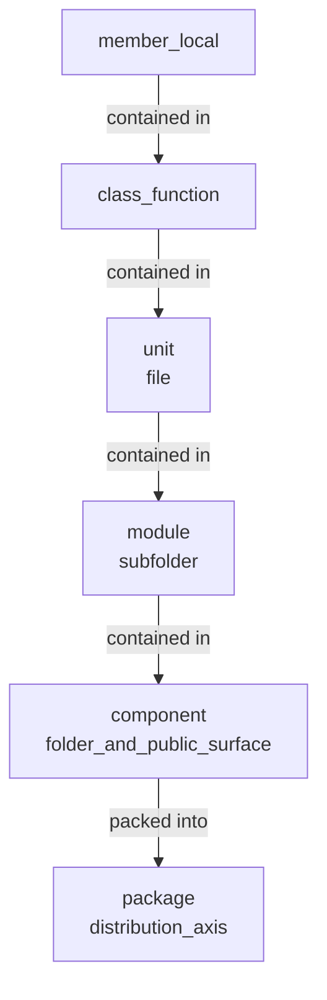

# Glossary

> **Purpose of this document:** Definitions of terms used in the full-auto-dev framework. General dictionary terms are not included. This document records framework-specific meanings, selection rationale, and non-adopted alternatives.
> **Related documents:** [Process Rules](full-auto-dev-process-rules.md), [Document Management Rules](full-auto-dev-document-rules.md), [Agent List](agent-list.md), [Defect Taxonomy](defect-taxonomy.md)

---

## 1. Intentionally Selected Terms

Terms where one synonym was intentionally chosen from multiple alternatives. Non-adopted alternatives and reasons are recorded.

| Term | English | Definition | Not Adopted | Reason |
|------|---------|------------|-------------|--------|
| requirement | requirement | A condition the system must satisfy. Formalized using EARS syntax | 要件 (yoken) | "requirement" is the root concept (what is demanded). 要件 is a derivative (conditions to be met). Unified to "requirement" |
| interview | interview | Structured questioning of users for requirement elicitation | ヒアリング (hearing) | "hearing" is Japanese-English (wasei-eigo). In English, "hearing" means a court proceeding or the sense of hearing |
| status | status | A value indicating the current position in a workflow | state | The distinction between state (mode of existence) and status (progress position) is unnecessary in practice. Unified to status |
| error | error | A mistake in human cognition, judgment, or operation. The cause of a fault (IEEE 1044). See [defect-taxonomy](defect-taxonomy.md) for details | 誤り (ayamari) | Unified to English term. The Japanese word "誤り" is an everyday word with low technical precision |
| fault | fault | An incorrect condition latent in code, design, or specification resulting from an error. Does not manifest until discovered (IEEE 1044, IEC 61508) | フォールト, 欠陥 | Unified to English term. Katakana form also not adopted |
| failure | failure | An event where a fault manifests at runtime and the system no longer satisfies requirements (IEEE 1044, IEC 61508) | フェイラー, 故障, 障害 | "故障" (koshou) is hardware-oriented, "障害" (shougai) is ambiguous. Unified to English term |
| defect | defect | A formal record (file_type) of a failure (or fault) discovered during testing or operations. Causal chain: error → fault → failure → defect | 障害, bug, バグ, 不具合 | "障害" is deprecated due to confusion with failure/incident. Unified to English term |
| incident | incident | An unplanned event affecting services in a production environment (ITIL, ISO 20000). file_type: incident-report | 障害, インシデント | Unified to English term. Katakana form also not adopted |
| hazard | hazard | A danger source where a failure could cause harm to life, property, or environment (IEC 61508). Used when the conditional process "Functional Safety" is enabled | ハザード | Unified to English term |
| fault origin | fault origin | The phase where a fault was introduced. Three classifications: requirements fault / design fault / implementation fault (IEEE 1044). Used in root cause analysis of defect | — | A classification axis for identifying the origin of a fault in the causal chain |
| HARA | HARA | Hazard Analysis and Risk Assessment (ISO 26262). An analysis method to identify hazard at the system level and derive safety goals. Required when Functional Safety is enabled | — | Top-down analysis. See [defect-taxonomy §7](defect-taxonomy.md) for details |
| FMEA | FMEA | Failure Mode and Effects Analysis (IEC 60812). A method to comprehensively analyze fault modes and effects at the component level | — | Bottom-up analysis. Performed after Ch5 is finalized |
| FTA | FTA | Fault Tree Analysis (IEC 61025). An analysis method that traces causes from a specific top event using AND/OR gates in reverse | — | Top-down analysis. Used for root cause analysis of high-risk hazard or critical incident |
| interview-record | interview-record | A structured record of user interviews (file_type) | hearing-record | Linked to the selection of interview above |
| disaster-recovery-plan | disaster-recovery-plan | Definition of recovery procedures based on RPO/RTO (file_type) | dr-plan | Follows the namespace abbreviation prohibition rule |

## 2. Framework-Specific Concepts

Concepts defined by this framework that are not found in dictionaries.

| Term | Definition |
|------|------------|
| STFB | Stable Top, Flexible Bottom. A specification chapter structure based on the Stable Dependencies Principle. Upper chapters are stable and abstract; lower chapters are variable and concrete |
| ANMS | AI-Native Minimal Spec. A specification kept in one file. **The notation is the same as ANPS, but StrictDoc is not run.** For projects that fit within one context window |
| ANPS-part | AI-Native Plural Spec split by part. Three files (Requirements / Design / Test). StrictDoc is run |
| ANPS-chapter | AI-Native Plural Spec split by chapter. Fourteen files. StrictDoc is run |
| ANGS | **Abolished.** Making a GraphDB tier its own format only ever describes a unit of splitting, since the notation is the same. ANPS-chapter suffices |
| device | The physical entity Chapter 2 deals with: PC, smartphone, server, vehicle, embedded hardware. **Carries no UID; referenced by name** |
| route | The one-way path Chapter 2 deals with, between devices and between a person and a device. **One entry per direction** — the trust judgement changes with direction |
| node | The unit of a specification that StrictDoc parses. Declared by a heading plus `**Type**:`. **Distinct from the `ND` prefix that v0.35 gave to devices, which is abolished** |
| SW_SPEC / SWS | Software specification. A requirement (FR / NFR) made concrete as an implementable statement. Written as one EARS sentence |
| domain model | The concepts and relations Chapter 5 deals with. Expressed as a class diagram, an ER diagram or a table |
| data schema | The concrete structure Chapter 6 deals with, verifiable by machine. JSON Schema / DDL / type definitions |
| component diagram | The diagram in Chapter 5.2 showing how the software is divided. **Distinct from the overview diagram of Chapter 2** |
| reduction candidate | The list of nodes that fell off the chain (they do not reach `GL`). Kept in Chapter 4.3. **The user decides what to drop** |
| mechanism-independence test | The procedure for judging abstraction. **If the sentence survives a change of mechanism, the abstraction is right** |
| precision level | The degree of detail in a Cockburn use case description (Level 1 to 4). This framework defaults to Level 3 |
| goal level | The granularity of a Cockburn use case (kite / sea / fish). This framework writes only `sea` |
| descriptive sentence | A sentence stating how something is. **Its subject and object must never be omitted (MUST NOT)** |
| prescriptive sentence | A rule in the form "do X (MUST)". **Its subject is the reader and therefore obvious, so it may be omitted** |
| given | A premise that cannot be changed at our discretion. Chapter 2 deals with these |
| review | **Someone other than the author** reading for quality against the conventions and perspectives. Done before change becomes expensive. Output is findings with severity |
| check | **The author or a machine** verifying that defined items are satisfied. Little room for judgement. Done immediately before releasing a deliverable |
| audit | **Someone uninvolved in the work** confirming afterwards that records exist and that the rules were followed. **Used only in the strict process mode (MUST)** |
| test-designer | The agent that writes acceptance criteria and test code. Owner of Chapter 9.1 / 10.1 / 11.1 |
| tester | The agent that runs tests and records results. Owner of Chapter 9.2 / 10.2 / 11.2 |
| main-agent | The only actor that exchanges with the user in both directions and launches subagents. It is the main Claude Code conversation itself and **carries no definition file, so it is absent from the roster (agent-list section 1)**. It holds the conversation history |
| project-manager | The subagent that records progress state and consolidates and reports PM information. **It never exchanges with the user directly** (formerly `orchestrator`, retired because an orchestrator elsewhere doubles as the user's entry point) |
| Common Block | Metadata common to all file_type. Identity proof of the file (identification, state, workflow, context, provenance). **Sits at the top level of the YAML frontmatter** |
| Form Block | Structured fields specific to each file_type. Parsed by agents for decisions and actions. **Nested under a namespace key in the frontmatter, one per file** |
| Detail Block | The detailed description zone. The body of domain knowledge. Read by both humans and agents for understanding. **Outside the frontmatter, in the markdown body** |
| OKF | Open Knowledge Format, a standard container format for knowledge documents. This framework follows v0.2 and uses `type`, `description`, `generated` and `sources` |
| actor | The notation for an acting party: `{agent-name}`, `human:{id}` or `process:{id}`. **Introduced so that human approval and machine generation can be told apart mechanically** |
| Footer | The update history block. Append-only. For auditing |
| In | Agent input. Files that exist at the start of work. Immutable (read-only) |
| Out | Agent output. The final deliverable at the end of work. Corresponds to End Conditions. Becomes the In for the next agent |
| Work | Agent temporary working files. Deleted after Out is completed. Not reused |
| pure function | No mutable internal state, no side effects, reads no external state. Output depends only on arguments (referentially transparent) |
| semi-pure function | No mutable state, no side effects, but reads external state itself. Not referentially transparent. semi-pure-a = reads immutable values (deterministic); semi-pure-b = reads mutable/nondeterministic (clock, RNG, DB/file read) |
| non-pure function | Has mutable internal state, OR any side effect (global/argument mutation, I/O, log, lock/mutex, throw, HW/OS/env change) |
| immutable class | Fields never change after construction; methods return new instances and are pure (this is fixed = an extra argument). E.g. LocalDate, record |
| value object | Immutable object compared by value, not identity. Pure methods. E.g. Money, Coordinate |
| stateless class | Holds no state; only pure methods/utilities. E.g. Math |
| stateful class | Holds mutable state or has side-effecting methods (contains non-pure methods). E.g. write repository, cache |

## 3. Abbreviation Permission Decisions

Records of abbreviation usage decisions in namespaces (file_type names). Principle: abbreviations are prohibited (document-rules §7).

| Abbreviation | Full Name | Decision | Reason |
|--------------|-----------|:--------:|--------|
| WBS | Work Breakdown Structure | Permitted | A common PM term. Nobody writes "Work Breakdown Structure" in full |
| SRS | Software Requirements Specification | Permitted for agent name only | `srs-writer` is an agent name (not subject to namespace rules). Cannot be used in namespaces |
| DR | Disaster Recovery | Not permitted | Renamed to `disaster-recovery-plan`. Within the 3-word limit |
| CR | Change Request | Not permitted | Renamed to field name `change_request_status` |
| HW | Hardware | Permitted | Used in file_type `hw-requirement-spec`. `hardware-requirement-spec` exceeds the 4-word limit |
| AI | Artificial Intelligence | Permitted | A common term. Used in `ai-requirement-spec` |
| FW | Framework | Not permitted | `framework-requirement-spec` is within the 3-word limit. Abbreviation unnecessary |

## 4. Distinguishing Confusable Pairs

Clarifying distinctions between concepts that are similar but different.

| Pair | Distinction |
|------|-------------|
| gr-sw-maker vs full-auto-dev | gr-sw-maker = tool name / repository name / npm package name. full-auto-dev = methodology name (a higher-level concept independent of the tool). They must never be interchanged. Use gr-sw-maker for tool-specific topics and full-auto-dev for methodology/process topics |
| requirement vs change request | requirement = a condition the system must satisfy. change request = a user-initiated change request after specification approval. Both contain "request" but in English they are distinct words: requirement vs request |
| specification vs template | specification = a project-specific deliverable (docs/spec/). template = a boilerplate provided by the framework (process-rules/spec-template.md) |
| agent vs sub-agent | agent = one of the role definitions registered in agent-list §1. sub-agent = a child process spawned by Claude Code (which may include agents) |
| project-manager vs organizer | project-manager = the project-manager agent defined in the process rules. organizer = a graph-traversal agent proposed in the ANGS paper. Currently the same role referred to by different names in different contexts |
| document_status vs {type}_status | Both are status. document_status = Common Block (document lifecycle: draft/in-review/approved/archived). {type}_status = Form Block (domain-specific workflow position) |
| fault vs defect | fault = an incorrect condition latent in code (undiscovered). defect = a formal issue ticket recorded after discovery (file_type). A fault is discovered and filed as a defect |
| failure vs incident | failure = a technical event where requirements are no longer satisfied (including during testing). incident = an operational event where a failure affects services in production. A failure during testing is not an incident |
| defect vs incident | defect = a discovery record during testing/development (file_type: defect, owner: test-engineer). incident = an occurrence record in production (file_type: incident-report, owner: incident-reporter). They differ by phase |
| hazard vs risk | hazard = a danger source to life and property (IEC 61508). risk = an impact on project objectives (file_type: risk). hazard is specific to functional safety; risk is common to all projects |
| actor vs the Chapter 3 actor | actor = the Common Block field recording who generated and who approved a document (`{agent-name}` / `human:{id}` / `process:{id}`). The Chapter 3 actor = a party that holds a goal. **They are different. Write "the Chapter 3 actor" when you mean the latter (MUST)** |
| Use Case vs use case | Use Case = the name of a Clean Architecture layer (a layer of code). use case = the goal of a Chapter 3 actor. **They are different. Write "the Chapter 3 use case" or `UC-xxx` when you mean the latter (MUST)** |
| device vs machine | device = the physical entity of Chapter 2. machine = as in machine-readable, machine-verifiable (processed by a computer rather than a person). **In Japanese the two are near-homographs (機器 / 機械); Chapter 2 must never write 機械 (MUST NOT)** |
| node vs ND | node = the unit of a specification that StrictDoc parses. `ND` = the prefix v0.35 gave to devices, **now abolished.** The same word named two different things |
| route vs connection | route = the one-way path of Chapter 2, one entry per direction. connection = the general word for a resource handle. **Chapter 2 uses route** |
| domain model vs data schema | domain model = the concepts and relations of Chapter 5. data schema = the machine-verifiable concrete structure of Chapter 6. Different layers. **"Data model" settles on neither, so it must never be used (MUST NOT)** |
| review vs check vs audit | review = someone else reads for quality. check = the author or a machine verifies items. audit = someone uninvolved confirms records and conduct afterwards. **audit is used only in the strict process mode** |

## 5. Code Unit Hierarchy (containment)

Purity is judged at the class/function level; physical separation is done at the unit/module/component level. The layer axis (Entity/UseCase/Adapter/Framework) is orthogonal to this containment and is defined in spec-template Ch5.1 and the CA perspective of review-standards.

**The hierarchy carries no numbers.** Containment is expressed by the chain of "contained in" and "contains". Adjacent rows agreeing is the evidence that containment closes, so a row added without being wired up shows up inside the table. Numbers drift whenever a conditional row is added, and serve no self-check.

### 5.1 Structural Axis -- Physical Nesting of Code

| Unit (EN) | Maps to | Contained in | Contains |
|-----------|---------|--------------|----------|
| member / local (property, method, local var/func, nested class) | — | class / function | statements, expressions |
| class / function | — | unit | members, locals, nested classes |
| unit | file (in C, the `.c` and `.h` pair) | module | classes, functions |
| module | subfolder, or a set of files sharing a prefix | component | units |
| component | folder + public surface | package (5.2) | modules, units |

**The unit is what a unit test targets.** Never read the module as the target of a unit test (MUST NOT). Reading it that way piles mocks onto a grain that cannot be verified independently.

**Containment of the structural axis:**



### 5.2 Distribution Axis -- the Unit of Handover

**Do not chain it onto the structural axis.** The container of distribution and the form of execution are different axes, and chaining them turns distributed systems into an afterthought insertion.

| Unit (EN) | Kind | Definition | Contains |
|-----------|------|------------|----------|
| package | container | Carries a version and dependencies; handed over through a registry or a file | components |
| library | execution form | Does not start on its own; embedded into other software | the contents of a package |
| application | execution form | Started directly by a user. Has an entry point | its own package + external libraries |
| service | execution form | Resident, receives requests across a boundary. Also the unit of deployment | its own package + external libraries |

In a distributed system an application (the whole system) consists of several services. **A service is not a row inserted under a condition; it is an execution form defined in parallel from the start.**

### 5.3 The Public Surface of a Component

> **A component declares a public surface (MUST). Other components may depend on the public surface only; depending on the internal implementation is forbidden (MUST NOT).** Break this and it stops being a unit of replacement, which was the reason for putting it in its own folder.
>
> **Prefer the visibility mechanism the language provides (SHOULD).** A directory convention holds only while someone checks it, whereas a language mechanism is enforced by the compiler. Use a directory only where no mechanism exists or the one that exists is weak.

| Language | How the public surface is expressed |
|----------|-------------------------------------|
| Rust | `pub` / `mod`. Enforced by the language |
| TypeScript / JavaScript | Only what `index.ts` exports is the public surface |
| Python | `__all__` in `__init__.py`. Internal units take a `_` prefix |
| Java / C# | package-private / `internal` |
| Go | Capitalized names are public. Enforced by the language |
| C / C++ | The mechanism is weak, so a directory expresses it (below) |

**Layout when a directory expresses it:**

```text
src/components/bms/
  include/
    bms_api.hpp
  private/
    cell_monitor/
      ltc6811.hpp
      ltc6811.cpp
      voltage_cal.hpp
      voltage_cal.cpp
    fault_detect/
      over_volt.hpp
      over_volt.cpp
```

`include/` is the public surface and the only place another component may reference. A reference into `private/` is raised as a violation. Enforce it in the build configuration where that is possible (`PUBLIC` and `PRIVATE` in CMake's `target_include_directories`). The subdirectories inside `private/` are modules, not components. **Only what carries a public surface may call itself a component.**

**Choosing by scale:** with one component, put units directly under `src/` and create no `components/`. With two or a few, use `src/{component}/` and express the public surface with the language mechanism. Use the layout above only when there are many, or when the public surface has to be governed. **A default is provided, not required.** Forcing it at small scale reproduces over-design from the side of the rules.
