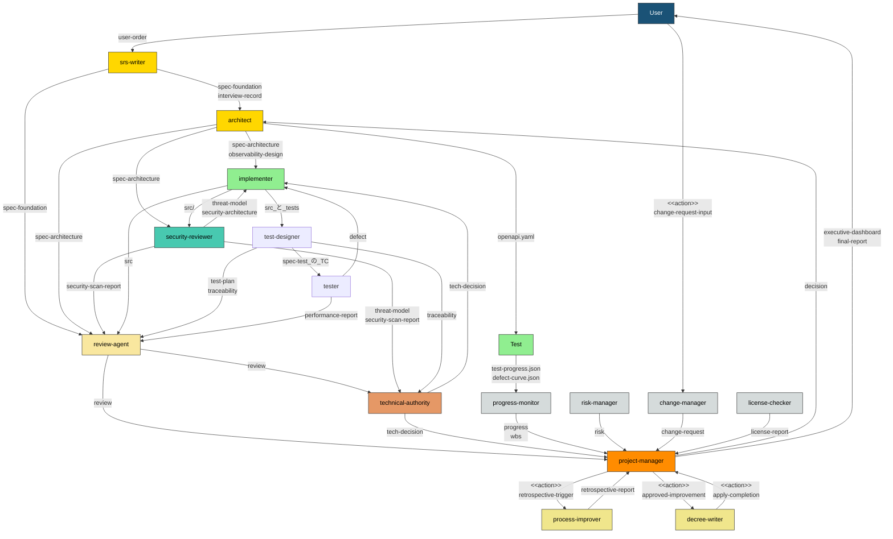
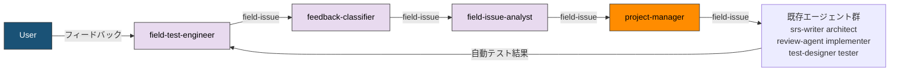
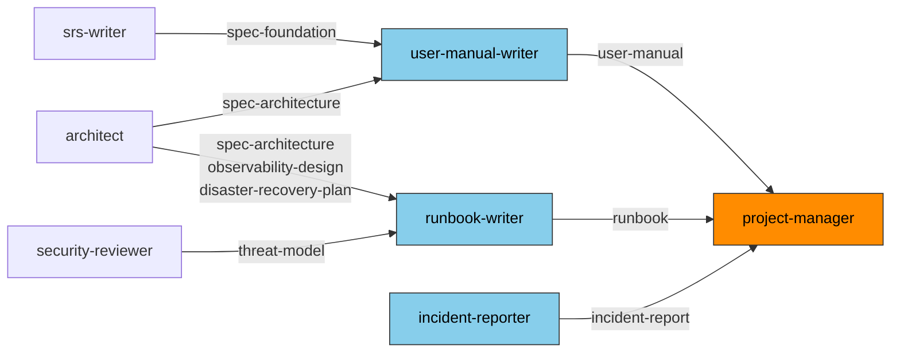
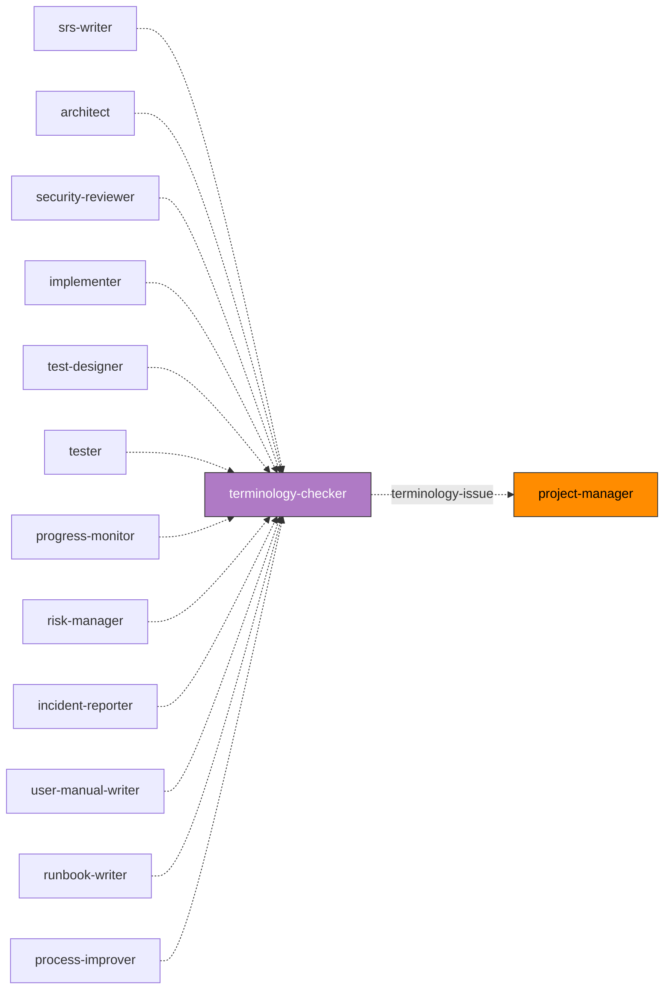

# エージェント一覧

> **本文書の位置づけ:** full-auto-dev フレームワークに登録された全**サブエージェント**の一覧（Single Source of Truth）。サブエージェントの追加・変更・削除時に本文書を更新する。
> **`main-agent` は本一覧に含まれない。** 定義ファイルを持たないためである（§0）。
> **導出元:** [プロセス規則](full-auto-dev-process-rules.md) §2-4, §7, §9 / [文書管理規則](full-auto-dev-document-rules.md) §7, §7.1, §11
> **関連文書:** [プロンプト構造規約](prompt-structure.md)、各エージェントプロンプト（`.claude/agents/*.md`）

---

## 0. 3 つの統括主体

**統括は 1 つではなく 3 つに分かれている。** 誰がユーザーと話すのかは、ここでしか読めない。

| 主体 | 責務 | ユーザーとのやりとり | 定義ファイル |
|---|---|---|---|
| **`main-agent`** | 進行統括。サブエージェントの起動 | **双方向。** 質問・承認・判断の受領はここだけ | **持たない**（Claude Code のメインの会話そのもの） |
| **`technical-authority`** | 技術裁定と品質ゲート判定 | なし（`main-agent` 経由） | `agents/technical-authority.md` |
| **`project-manager`** | 進行状態の記録、PM 情報の統合と報告 | **一方向の報告のみ** | `agents/project-manager.md` |

**サブエージェントはユーザーと双方向にやりとりできない。** 出力はユーザーに見えるため一方向の報告は成立するが、**質問への回答も承認も受け取れない。** 受け取れるのは `main-agent` だけである。

**なぜ分けたか:** 一般的な多エージェントフレームワーク（LangGraph の supervisor、CrewAI の hierarchical manager）では進行役がユーザー入口を兼ねる。本フレームワークは兼ねない。**兼ねられないからである** — サブエージェントは会話を継続できない。名前がその期待を呼ぶことが `orchestrator` を退役させた理由でもある。

---

## 1. サブエージェント一覧

| # | name | 役割 | model | 主要フェーズ |
|:-:|------|------|:-----:|------------|
| 1 | project-manager | 進行状態の記録、PM 情報（進捗・コスト・リスク・変更要求）の統合、**`main-agent` 経由での報告** | opus | 全フェーズ |
| 2 | srs-writer | ユーザーコンセプトの構造化、インタビュー、仕様書 Ch1-4 作成 | opus | planning |
| 3 | architect | 仕様書 Ch5-7 詳細化、OpenAPI・可観測性・外部依存要求の設計 | opus | design |
| 4 | security-reviewer | 脅威モデリング、セキュリティ設計、脆弱性スキャン | opus | design, implementation |
| 5 | implementer | ソースコード実装、単体テスト作成 | opus | implementation |
| 6 | review-agent | R1-R7 観点での品質レビュー、重大度付き指摘の起票 | opus | 全フェーズ（ゲート時） |
| 7 | progress-monitor | WBS管理、進捗追跡、品質メトリクス監視、異常検知 | sonnet | design 以降 |
| 8 | change-manager | ユーザー起点の変更要求の受付・影響分析・記録 | sonnet | planning 以降（仕様承認後） |
| 9 | risk-manager | リスク特定・評価・監視、リスク台帳管理 | sonnet | planning 以降 |
| 10 | license-checker | OSS ライセンス互換性確認、帰属表示管理 | haiku | implementation, delivery |
| 11 | terminology-checker | 用語・命名の整合性チェック（フレームワーク用語集 + プロジェクト用語集） | sonnet | 全フェーズ（Out 生成時） |
| 12 | user-manual-writer | ユーザーマニュアルの作成 | sonnet | delivery |
| 13 | runbook-writer | 運用手順書（Runbook）の作成 | sonnet | delivery |
| 14 | incident-reporter | incident 報告書の作成 | sonnet | operation |
| 15 | process-improver | ふりかえり・根本原因分析・プロセス改善策の提案 | sonnet | 全フェーズ（フェーズ完了時） |
| 16 | decree-writer | 承認済み改善策のガバナンスファイルへの安全な適用 | sonnet | 全フェーズ（フェーズ完了時） |
| 17 | field-test-engineer | ユーザーとの実機テスト、フィードバック記録、修正後の実機検証 | sonnet | testing（条件付き: 実機テスト有効時） |
| 18 | feedback-classifier | フィードバックを仕様書と照合し defect / CR / 質問に分類、チケット起票 | sonnet | testing（条件付き: 実機テスト有効時） |
| 19 | field-issue-analyst | 原因分析（defect）、対策立案（defect / CR）、影響範囲・副作用・代替案比較 | opus | testing（条件付き: 実機テスト有効時） |
| 20 | technical-authority | 技術判断の裁定、仕様・設計・実装・テストの整合保証、品質ゲート判定 | opus | planning 以降（ゲート時） |
| 21 | test-designer | テストの受入基準とテストケースを設計し、仕様書のテストの章に書く | opus | planning・design・testing・delivery |
| 22 | tester | テストを実行し、結果を仕様書のテスト結果の節に記録する | sonnet | testing |

> **model 割当の根拠（terminology-checker）:** 和製英語の判定と文書横断の同義語検出を行う。**いずれも意味理解を要するため道具では代替できず**（`agent-orchestration-rules.md` §4.6 の規約 5）、かつ全エージェントの Out 生成時に呼ばれるため呼出頻度が最も高い。誤検出と見逃しの双方がフレームワーク全体に波及するため sonnet を割り当てる。**haiku では観点 B と D の判定が落ちる。**

---

## 2. file_type オーナーシップマトリクス

文書管理規則 §11 から導出。**各 file_type には唯一の owner が存在する。**

### project-manager

| file_type | ディレクトリ | 単/連 | 主要フェーズ |
|-----------|------------|:-----:|------------|
| pipeline-state | project-management/ | 単 | 全フェーズ |
| executive-dashboard | ルート | 単 | setup 以降 |
| final-report | ルート | 単 | delivery |
| decision | project-records/decisions/ | 連 | 全フェーズ |
| handoff | project-management/handoff/ | 連 | 全フェーズ |
| stakeholder-register | project-management/ | 単 | setup |

### srs-writer

| file_type | ディレクトリ | 単/連 | 主要フェーズ |
|-----------|------------|:-----:|------------|
| user-order | ルート | 単 | planning（バリデーション） |
| interview-record | project-management/ | 単 | planning |
| spec-foundation | docs/spec/ | 単 | planning |
| spec | docs/spec/ | 単 | planning 以降 |
| spec-test | docs/spec/ | 単 | testing（オーナー: test-designer） |

> srs-writer は user-order のバリデーションのみを担当し、user-order 自体は修正しない。初期作成はユーザーが行う。バリデーションで発見された不足はインタビューで解消し、spec-foundation に反映する。

### architect

| file_type | ディレクトリ | 単/連 | 主要フェーズ |
|-----------|------------|:-----:|------------|
| spec-architecture | docs/spec/ | 単 | design |
| observability-design | docs/observability/ | 単 | design |
| hw-requirement-spec | docs/hardware/ | 単 | design（条件付き） |
| ai-requirement-spec | docs/ai/ | 単 | design（条件付き） |
| framework-requirement-spec | docs/framework/ | 単 | design（条件付き） |
| disaster-recovery-plan | docs/operations/ | 単 | design |
| deployment-design | docs/operations/ | 単 | design |
> **`spec` は ANMS（簡易）の 1 枚である。** 第 1 部を srs-writer、第 2 部を architect、第 3 部を test-designer が書くため、**この file_type だけは章ごとにオーナーが変わる（唯一の例外）。** Common Block と Form Block を触れるのは srs-writer である。
>
> **ANPS では 3 つに割れる。** `spec-foundation` が第 1 部（目的・概要・UC・要求）、`spec-architecture` が第 2 部（設計・SW仕様・テスト戦略）、`spec-test` が第 3 部（UC テスト・SW仕様テスト・非機能テスト）である。

> architect は上記 file_type に加え、openapi.yaml（docs/api/）を生成・管理する。openapi.yaml は外部ツール規定形式（文書管理規則 §13）であり file_type ではないが、implementer と test-designer が消費する。

### security-reviewer

| file_type | ディレクトリ | 単/連 | 主要フェーズ |
|-----------|------------|:-----:|------------|
| threat-model | docs/security/ | 単 | design |
| security-architecture | docs/security/ | 単 | design |
| security-scan-report | project-records/security/ | 連 | implementation 以降 |

### implementer

| file_type | ディレクトリ | 単/連 | 主要フェーズ |
|-----------|------------|:-----:|------------|
| （ソースコード） | src/ | — | implementation |
| （単体テスト） | tests/ | — | implementation |
| （IaC コード） | infra/ | — | implementation |

> implementer はコード（src/, tests/）を生成するが、これらは Common Block 管理対象外。トレーサビリティは traceability-matrix で管理する。

### review-agent

| file_type | ディレクトリ | 単/連 | 主要フェーズ |
|-----------|------------|:-----:|------------|
| review | project-records/reviews/ | 連 | 全フェーズ（ゲート時） |

> review は指摘の起票までを担う。ゲートの合否判定と戻し先の確定は technical-authority が tech-decision に記録する。

### progress-monitor

| file_type | ディレクトリ | 単/連 | 主要フェーズ |
|-----------|------------|:-----:|------------|
| progress | project-management/progress/ | 連 | design 以降 |
| wbs | project-management/progress/ | 単 | design 以降 |

### change-manager

| file_type | ディレクトリ | 単/連 | 主要フェーズ |
|-----------|------------|:-----:|------------|
| change-request | project-records/change-requests/ | 連 | planning 以降（仕様承認後） |

### risk-manager

| file_type | ディレクトリ | 単/連 | 主要フェーズ |
|-----------|------------|:-----:|------------|
| risk | project-records/risks/ | 連 | planning 以降 |
| risk-register | project-records/risks/ | 単 | planning 以降 |

### license-checker

| file_type | ディレクトリ | 単/連 | 主要フェーズ |
|-----------|------------|:-----:|------------|
| license-report | project-records/licenses/ | 単 | implementation, delivery |

### terminology-checker

> terminology-checker は file_type を所有せず、ファイルも出力しない。チェック報告は呼び出し元への構造化テキストとして返し、記録の要否と記録先は呼び出し元が判断する。他エージェントの file_type を借用しない。

| 入力 | 提供元 | 用途 |
|------|--------|------|
| （チェック対象の成果物） | 各エージェント | 用語・命名チェック対象 |
| glossary.md | framework | フレームワーク用語集との照合 |
| spec-foundation (Ch1.8 Glossary) | srs-writer | プロジェクト用語集との照合 |
| full-auto-dev-document-rules.md §7 | framework | file_type 名・名前空間の正式定義 |

### user-manual-writer

| file_type | ディレクトリ | 単/連 | 主要フェーズ |
|-----------|------------|:-----:|------------|
| user-manual | docs/ | 単 | delivery |

### runbook-writer

| file_type | ディレクトリ | 単/連 | 主要フェーズ |
|-----------|------------|:-----:|------------|
| runbook | docs/operations/ | 単 | delivery |

### incident-reporter

| file_type | ディレクトリ | 単/連 | 主要フェーズ |
|-----------|------------|:-----:|------------|
| incident-report | project-records/incidents/ | 連 | operation |

### process-improver

| file_type | ディレクトリ | 単/連 | 主要フェーズ |
|-----------|------------|:-----:|------------|
| retrospective-report | project-records/improvement/ | 連 | 全フェーズ（フェーズ完了時） |

### decree-writer

| file_type | ディレクトリ | 単/連 | 主要フェーズ |
|-----------|------------|:-----:|------------|
| governance-change-log | project-records/governance/ | 連 | 全フェーズ（フェーズ完了時） |

> 適用結果の before/after diff は governance-change-log に記録する。project-records/improvement/ は process-improver の所有であり、そこへは書き込まない。

| 入力 | 提供元 | 用途 |
|------|--------|------|
| retrospective-report | process-improver | 適用すべき改善策の参照 |
| decision | project-manager | 承認記録の確認 |

### field-test-engineer（条件付き: 実機テスト有効時）

| file_type | ディレクトリ | 単/連 | 主要フェーズ |
|-----------|------------|:-----:|------------|
| field-issue | project-records/field-issues/ | 連 | testing |

> field-test-engineer は field-issue の owner。feedback-classifier と field-issue-analyst はチケットに追記する形で情報を蓄積する。詳細は [実機テスト フィードバック管理規則](field-issue-handling-rules.md) を参照。

### feedback-classifier（条件付き: 実機テスト有効時）

> feedback-classifier は file_type を所有しない。field-test-engineer が作成した field-issue チケットに分類結果（`field-issue:type`）を追記する。

| 入力 | 提供元 | 用途 |
|------|--------|------|
| field-issue（reported） | field-test-engineer | 分類対象のフィードバック |
| spec-foundation | srs-writer | 仕様照合（Ch1-4: 要求定義） |
| spec-architecture | architect | 仕様照合（Ch5-7: 設計仕様） |

### field-issue-analyst（条件付き: 実機テスト有効時）

> field-issue-analyst は file_type を所有しない。field-test-engineer が作成した field-issue チケットに原因分析・対策立案の結果を追記する。

| 入力 | 提供元 | 用途 |
|------|--------|------|
| field-issue（classified） | feedback-classifier | 分類済みのフィードバック |
| src/ | implementer | 原因分析対象のソースコード |
| spec-foundation, spec-architecture | srs-writer, architect | 影響分析・仕様書更新要否の判定 |

### technical-authority

| file_type | ディレクトリ | 単/連 | 主要フェーズ |
|-----------|------------|:-----:|------------|
| tech-decision | project-records/tech-decisions/ | 連 | planning 以降 |

> technical-authority は成果物を作成せず、裁定と記録のみを行う。decision（project-manager 所有）とは管轄が異なる。技術的整合とゲート可否は tech-decision、コスト・スケジュール・リスクを理由とする判断は decision に記録する。

### test-designer

| file_type | 場所 | 何を書くか |
|---|---|---|
| `spec-test` | `docs/spec/` | 仕様書 Ch8-10 のケース節（8.1 / 9.1 / 10.1）。**ANMS では `spec` の同じ節を書く** |
| `traceability` | `project-records/traceability/` | 要求からテストへの対応 |
| `test-plan` | `project-management/` | 受入基準を利用者が実行できる手順に落としたもの（`7j`） |

> **受入基準を書く側であって、走らせる側ではない。** 結果を書くのは tester である。

### tester

| file_type | 場所 | 何を書くか |
|---|---|---|
| `defect` | `project-records/defects/` | 実行して観測した failure から起票する |
| `performance-report` | `project-records/performance/` | 数値目標との差 |

> **仕様書 Ch8-10 の結果節（8.2 / 9.2 / 10.2）も書く。** ただし `spec` の file_type オーナーは srs-writer であり、tester は節の書き手である（Common Block と Form Block には触れない）。

---

## 3. エージェント間データフロー

file_type およびアクションの流れでエージェント間の依存関係を示す。

**エージェント間データフロー:**

上図はプロセス規約から導出したエージェント間のメインデータフローを示す。矢印のラベルは受け渡される file_type またはアクションを示す。DocWriter系（文書作成エージェント）、terminology-checker（用語チェック）、実機テスト系は別図を参照。

**実機テスト系（条件付き: 実機テスト有効時）:**

紫色のノードが実機テスト系の新規エージェント。条件付きプロセス「実機テスト」が有効な場合にのみアクティベートされる。ステータス遷移の詳細（13 ステータス・12 ゲート）は [実機テスト フィードバック管理規則](field-issue-handling-rules.md) を参照。

**DocWriter系（文書作成エージェント）:**

delivery フェーズで user-manual-writer と runbook-writer が起動される。入力として上流エージェントの設計文書を参照し、成果物を project-manager に納品する。incident-reporter は operation フェーズで起動される。

**terminology-checker（用語チェック）:**

Out を生成する全エージェントが受け渡し前に terminology-checker へ用語チェックを依頼する。重大な用語不整合は review file_type として project-manager に報告される。詳細は各エージェント定義の Procedure を参照。

**ラベルの区別:**

| ラベル形式 | 意味 | 例 |
|-----------|------|-----|
| `file_type名` | file_type の受け渡し（ファイル成果物） | `spec-foundation`, `review`, `retrospective-report` |
| `<<action>> 名前` | ファイル成果物を伴わないアクション/トリガー | `<<action>> retrospective-trigger`, `<<action>> approved-improvement` |

**アクション一覧:**

| アクションラベル | 発信元 | 受信先 | 説明 |
|----------------|--------|--------|------|
| change-request-input | User | change-manager | ユーザー起点の変更要求（受付後 change-request file_type として記録） |
| retrospective-trigger | project-manager | process-improver | フェーズ完了時のふりかえり起動指示 |
| approved-improvement | project-manager | decree-writer | 承認済み改善策の適用指示（decision 記録が根拠） |
| apply-completion | decree-writer | project-manager | 改善策の適用完了報告（before/after diff は project-records/improvement/ に記録） |

**terminology-checker（用語チェック）について:**

terminology-checker は図中に矢印を持たないが、Out を生成する全エージェントが受け渡し前に用語チェックを依頼する。詳細は各エージェント定義の Procedure を参照。重大な用語不整合は review file_type として project-manager に報告される。

terminology-checker を**使用しない**エージェント:

| エージェント | 理由 |
|------------|------|
| project-manager | 自身は file_type の内容を生成しない（管理・転送のみ） |
| review-agent | 他エージェントの成果物を評価する側 |
| change-manager | ユーザー起点の変更要求を記録するだけで用語創出が少ない |
| license-checker | 外部ライセンス名をそのまま記録 |
| decree-writer | 承認済み改善策を適用するだけで新規用語を生成しない |
| feedback-classifier | 仕様書との照合・分類判定のみで用語創出が少ない |
| field-issue-analyst | 原因分析・対策立案で既存用語を使用するのみ |
| field-test-engineer | 実機テストの速報的なチケットを記録するのみで用語創出が少ない |

---

## 4. フェーズ別アクティベーションマップ

どのエージェントがどのフェーズで起動されるか。

| フェーズ | 起動されるエージェント | 品質ゲート |
|---------|---------------------|-----------|
| setup | project-manager, srs-writer, architect, technical-authority | CLAUDE.md 承認 |
| planning | project-manager, srs-writer, test-designer, terminology-checker, review-agent, technical-authority, process-improver, decree-writer | R1 PASS → 仕様書承認 |
| dependency-selection | project-manager, architect, terminology-checker, technical-authority | ユーザー選定承認 |
| design | project-manager, architect, test-designer, security-reviewer, terminology-checker, progress-monitor, risk-manager, review-agent, technical-authority, process-improver, decree-writer | R2/R4/R5/R7 PASS |
| implementation | project-manager, implementer(単体テストも), test-designer(観点出し), security-reviewer(SCA), terminology-checker, license-checker, review-agent, technical-authority, progress-monitor, process-improver, decree-writer | R2/R3/R4/R5/R7 PASS, SCA クリア |
| testing | project-manager, test-designer, tester, architect(設計意図), terminology-checker, review-agent, technical-authority, progress-monitor, process-improver, decree-writer, field-test-engineer(条件付き), feedback-classifier(条件付き), field-issue-analyst(条件付き) | R6 PASS, 全テスト PASS |
| delivery | project-manager, test-designer, implementer(条件付き), terminology-checker, review-agent, technical-authority, user-manual-writer, runbook-writer(条件付き), process-improver, decree-writer | R1-R7 全 PASS, 受入テスト合格, ユーザー受入 |
| operation | project-manager, security-reviewer(パッチ), progress-monitor, incident-reporter, process-improver, decree-writer | SLA 達成 |

---

## 5. file_type の総数

| 分類 | 件数 |
|---|---:|
| Common Block 管理対象の file_type（文書管理規則 §7） | 42 |
| うち条件付き（該当プロセス有効時のみ） | field-issue, hw-requirement-spec, ai-requirement-spec, framework-requirement-spec, disaster-recovery-plan, stakeholder-register, safety（計 7） |
| file_type ではない生成物 | openapi.yaml, src/, tests/, infra/, cost-log.json, progress-log.json, test-progress.json, defect-curve.json |

件数の正は文書管理規則 §7 のテーブルであり、本節はその要約である。齟齬があれば §7 を正とする。

---

## 6. 新規エージェント追加手順

1. 本名簿の §1 にエージェントを追加する
2. 担当する file_type を §2 に追加する（既存エージェントとの重複がないことを確認）
3. §3 のデータフロー図を更新する
4. §4 のアクティベーションマップを更新する
5. [プロンプト構造規約](prompt-structure.md) に従い `.claude/agents/{name}.md` を作成する
6. 文書管理規則 §7（file_type テーブル）、§7.1（ワークフロー参照テーブル）、§11（オーナーシップモデル）を更新する
