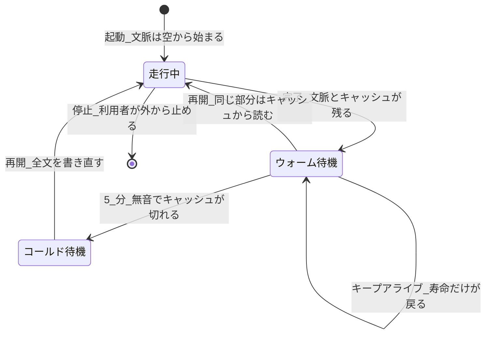
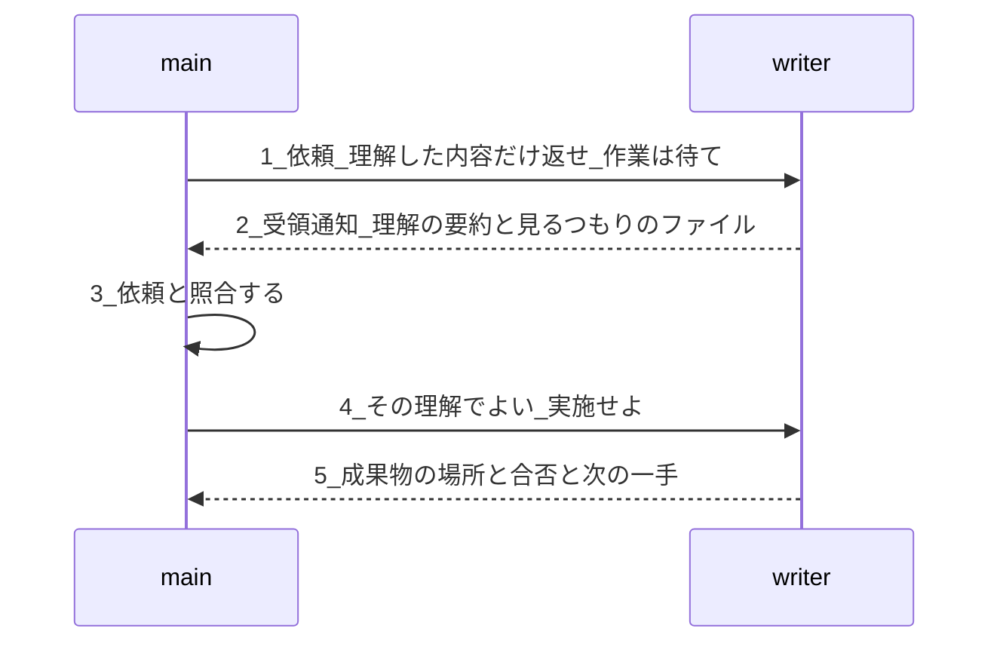
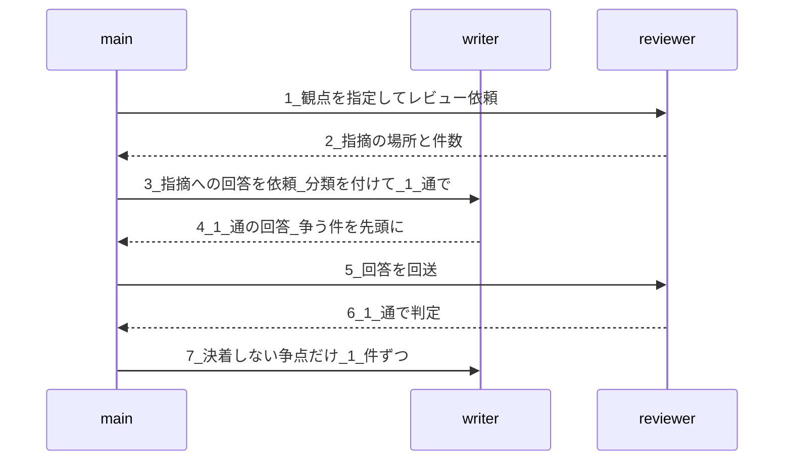
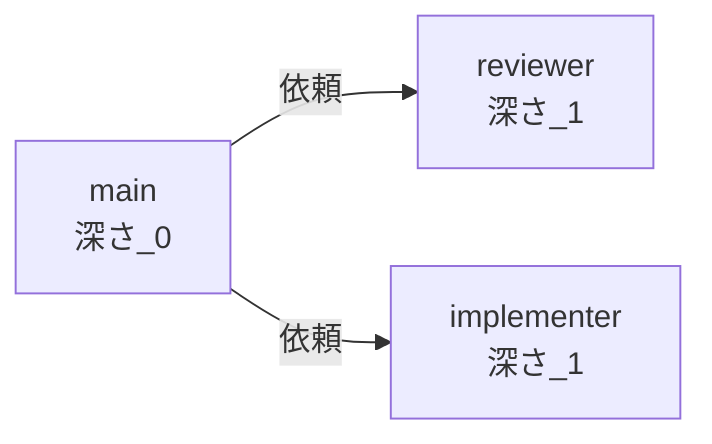
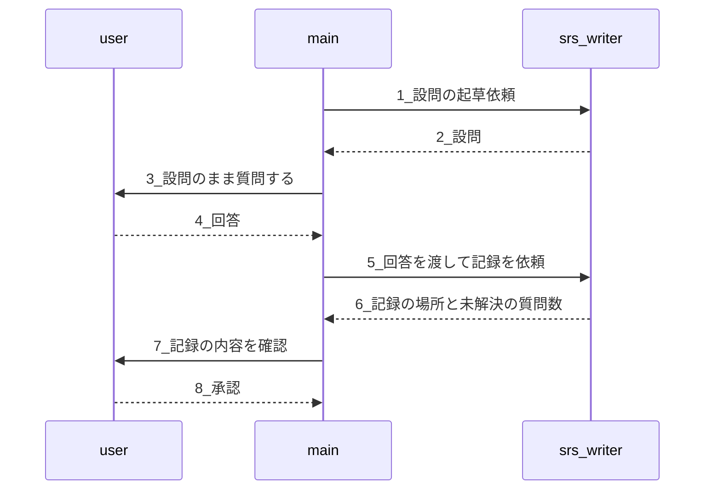
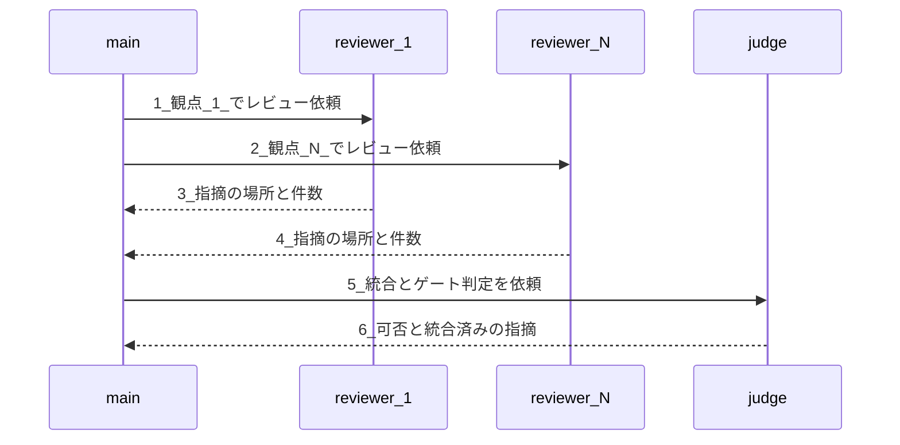
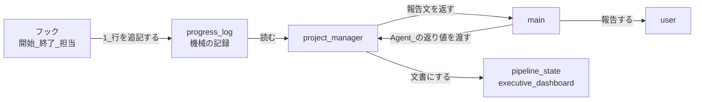

# エージェント連携規則

> **本文書の位置づけ:** エージェント間の受け渡しを決める規則の唯一の正（Single Source of Truth）。連携の形・往復の作法・エージェントを使わない境界を持つ。
> **本書は結論と、その根拠になる数値だけを持つ。「かもしれない」を書かない（MUST NOT）。**
> **数値の出どころ:** 2026-08-10 時点、Claude Code 2.1.222 / Windows での実測、および同日に確認した公式ドキュメント。
> **関連文書:** [プロセス規則](full-auto-dev-process-rules.md)、[エージェント一覧](agent-list.md)、[レビュー観点規約](review-standards.md)、[開発方式と作業表の読み方](development-mode.md)

**章立てと差し替えの単位:**

| 章 | 何を持つか | 道具が変わったとき |
|---|---|---|
| §1 背景 | **本書が使う語**、エージェントの性質、生存状態とキャッシュ。規則で縛らなければならない理由 | **測り直す**（§5 の 4 項目） |
| §2 目的 | 本書が決めること・決めないこと | 変わらない |
| §3 対応方針（考え方） | 道具に依存しない判断の筋 | **変わらない。出発点として使う** |
| §4 具体的運用 | Claude Code 固有の手段と規約 | **ここだけを差し替える** |
| §5 注記 | 適用の限界。差し替えるときに測ること | — |

---

## 1. 背景

**全自動開発は 1 エージェントでは回らない。** 名簿にある 24 体のエージェント（`agent-list.md`）が同じ成果物を順に触り、**書いたエージェントと見るエージェントは必ず別である。** したがって受け渡しの費用と正確さが、そのまま開発の費用と品質になる。

### 1.1 本書が使う語

**本書は以下の語を、以下の意味だけで使う（MUST）。** 同じものを別の語で呼んではならない（MUST NOT）。**英語版は「英語」列の語を使う（MUST）** —— 訳語が揺れると、日英で別の規則に読める。

**誰が働くか:**

| 日本語 | 英語 | 定義 |
|---|---|---|
| **エージェント** | agent | 独立した文脈を持つ実行単位。**会話履歴・呼んだスキル・読んだファイルを引き継がない** |
| **`main-agent`** | main agent | 利用者と話す唯一のエージェント。主会話そのものである |
| **役** | role | 図の中での立場（main / writer / reviewer / judge）。**誰が務めるかは作業表が決める**（§4 冒頭） |

**エージェントがどうなるか（生存状態）:**

| 日本語 | 英語 | 定義 |
|---|---|---|
| **起動** | start | 新しいエージェントを立て、依頼を渡す。**文脈は空から始まり、下限のぶんの費用が必ず出る** |
| **背景起動 / 前景起動** | background start / foreground start | 起動のしかたの別。**再開は必ず背景実行になる**ため、前景で起動するとキャッシュが繋がらない。**実測では、背景で起動したエージェントの再開はキャッシュから 29,554 を読んだが、前景で起動したものは読みが 0 で 30,162 を書き直した** |
| **完了** | finish | 依頼に答えて走行を終える。**文脈は残り、識別子で呼び戻せる** |
| **待機** | standby | 完了して次の依頼を待っている状態。**走っていないので何も消費しない** |
| **再開** | resume | 待機中のエージェントへ次の依頼を送り、**同じ文脈の続きから**走らせる |
| **停止** | stop | 走行中のエージェントを利用者が外から止めること。**待機に落ちるのではなく、そこで終わる** |

**何にいくらかかるか（費用）:**

| 日本語 | 英語 | 定義 |
|---|---|---|
| **依頼 / 返答** | request / reply | 1 通のやり取り。**メッセージ**（message）と呼ぶこともある。手段は §4.1 |
| **往復** | round trip | 依頼と返答の 1 組。**費用を数える単位はこれである** |
| **文脈** | context | そのエージェントが持つ全文（基盤層＋会話層）。**往復のたびに全部を送り直す。** 実測で n 回目の読みは 1〜n-1 回目の書きの総和と厳密に一致した（34,927 → 60,715 → 72,147） |
| **基盤層** | base layer | 役割の定義・道具の一覧・プロジェクトの決まりごと。**起動のときに必ず載る** |
| **会話層** | conversation layer | それまでの依頼・返答・読んだファイルの中身 |
| **下限** | floor | 基盤層のぶんの費用。**どれだけ指示文を絞ってもここより下に行かない**（実測 8 エージェントで 27k〜35k） |
| **キャッシュ** | cache | 送り直した文脈のうち、前回と同じ先頭部分を安く読ませる仕組み |
| **キャッシュの寿命** | cache TTL | キャッシュが有効な時間。**サブエージェントは 5 分、主会話は 1 時間。読むたびに戻る**（公式）。**エージェント自身の寿命とは別物である** |
| **ウォーム待機** | warm standby | **キャッシュが生きている**待機。再開が安い |
| **コールド待機** | cold standby | **キャッシュが切れた**待機。再開で全文を書き直す |
| **キープアライブ** | keep-alive | 待機中のエージェントへ空の依頼を送り、**キャッシュの寿命だけを戻す**こと（§4.4） |

**使わない語:**

| 使わない語 | なぜ |
|---|---|
| **中断 / suspend**（状態の名前として） | 走行を途中で凍らせて後から続ける仕組みは無い。**走行中・待機・停止の 3 つしか状態が無い。** 一般語としての「作業が中断する」は別であり、そちらは使ってよい |
| **中止 / quit / abort** | 停止と区別する実益が無い。**1 語にする** |
| **保温** | 何を保つのかが語に現れない。**キープアライブを使う** |
| **生きている / 死んでいる** | 待機はそのどちらでもない。**ウォーム待機とコールド待機で言い分ける** |

### 1.2 エージェントの性質

**エージェントは人の担当者と違う性質を 6 つ持つ。** 人の組織図をそのまま写すと、費用が桁で変わるか、手戻りが出る。

| # | エージェントの性質 | そこから何が決まるか |
|:-:|---|---|
| 1 | **文脈が独立している。** 会話履歴・呼んだスキル・読んだファイルを見ない | **依頼文が、そのエージェントの知る世界のほぼ全部になる。** 渡さなかったものは存在しない |
| 2 | **状態を持たない。** 往復のたびにそれまでの全文を送り直している | **往復の回数がそのまま費用である**（§3.2） |
| 3 | **親にしか返せない。** エージェントから利用者へは何も届かない | 利用者との往復はすべて `main-agent` を通る。**設計判断ではなく構造上の制約である** |
| 4 | **起動するだけで下限の費用が出る**（実測 27k〜35k） | 軽い作業をエージェントでやると、下限を毎回払う（§3.4・§3.8） |
| 5 | **キャッシュの寿命が短く、放っておくと冷える**（サブエージェントは 5 分） | ウォーム待機を保つか作り直すかを、あらかじめ決めておく必要がある（§3.1・§4.4） |
| 6 | **入れ子には上限があり**（公式で 3 層）、**達しても失敗しない。起動の権限が黙って取り上げられる** | **気づけない。構造で縛るしかない**（§4.5 規約 5） |

### 1.3 生存状態とキャッシュ —— 起動と再開の費用はここで決まる

**費用は「文脈の大きさ × 往復の数 × キャッシュが当たったか」で決まる。** 3 つとも下の遷移の上にある。

**エージェントの生存状態:**



遷移ごとに何が起きて、いくらかかるかを下に置く。

| 遷移 | 何が起きるか | 費用 |
|---|---|---|
| **起動** | 文脈が空から作られ、基盤層が必ず載る | **下限を払う**（27k〜35k） |
| **完了 → ウォーム待機** | 文脈もキャッシュも残る | **0**（走っていない） |
| **ウォーム待機のまま 5 分** | **キャッシュだけが切れる。文脈は消えない** | 0 |
| **ウォーム待機から再開** | 前回と同じ先頭部分をキャッシュから読む | **安い**（読みは書きの約 1/10。公式） |
| **コールド待機から再開** | 全文を書き直す | **高い**（書きは通常の 1.25 倍。公式） |
| **キープアライブ** | 空の依頼でキャッシュの寿命が戻る | 1 回あたり数十トークン。**ただし往復ごとに積む**（§4.4） |

**待機そのものは無料である。値段が付くのは再開のしかたである。** 文脈はエージェントが在るかぎり残るので、**「忘れられる」ことは起きない。切れるのはキャッシュだけである。**

> **ただし 1 回目の再開だけは、ウォーム待機でも会話層が書き直される。** 文脈 87,769 のエージェントを 4 分間隔で 2 回再開した実測では、**1 回目は基盤層 34,998 しか読めず、会話層 52,771 を書き直して 64,049 相当**、**2 回目は 83,437 を読んで 8,391 相当**であった。**時間ではなく要求の形の遷移である。** だから **1 往復で終わる作業に再開を当てても得しない**（§4.1 規約 4）。

**本書は数値を本文に持つ。** 下限が何トークンか、寿命が何分か、再開がいくらかは、上の表と各章の「なぜ」列に書いてある。**本書が持つのは「だからこうする」であり、数値はその根拠として添えてある。**

---

## 2. 目的

**本書は、エージェント間の受け渡しを決める。** 決めるのは次の 3 つである。

| # | 決めること | どこが持つか |
|:-:|---|---|
| 1 | **連携の形。** 誰が誰を起動し、何を渡し、何を返すか | §3.5〜§3.7 ／ §4.5 |
| 2 | **往復の作法。** 何通で、どの順で、何を先頭に置くか | §3.1〜§3.3 ／ §4.1〜§4.4 |
| 3 | **エージェントを使わない境界。** 道具で回すもの | §3.8 ／ §4.6 |

**守るべきことは 3 つあり、この順に優先する。**

| # | 守ること | なぜ |
|:-:|---|---|
| 1 | **手戻りを出さない** | 誤解を止める費用はほぼゼロ、誤解したまま進んだ作業の費用は全額である（§3.3） |
| 2 | **利用者と話すエージェントの容量を空けておく** | ここが埋まると仕事全体が中断して引き継ぎになる。**下位のエージェントのトークンは払えば済むが、上位のエージェントの容量は買えない**（§3.5） |
| 3 | **道具が変わっても考え方が残る** | 手段は版で動く。§3 と §4 を分けている理由がこれである（§5） |

**本書が決めないもの:**

| 決めないこと | どこが持つか |
|---|---|
| どの手順を誰が担当し、どの経路で受け渡すか | 作業表（`work-table-0-install.md`〜`work-table-8-operation.md`、`work-table-common.md`） |
| 作業表の列の意味と、方式ごとの実施・免除 | `development-mode.md` |
| レビューの観点（R1〜R7）と、どの観点がどの章を見るか | `review-standards.md` |

> **経路の規則の正本は本書である（MUST）。** 作業表の `備考` 列が本書と食い違ったら、作業表の側を直す。

---

## 3. 対応方針（考え方）

**本章は道具に依存しない。** 別の AI・別のツールでも、ここを出発点にして §4 を組み直せる（§5）。

### 3.1 何度も連携する作業は、相手を作り直さず再開する

> **エージェント間で何度も連携して行う作業は、相手のエージェントを作り直さず、同じエージェントへ戻す（SHOULD）。**

**再開で節約されるのは「読み直し」ではなく「考え直し」である。** 同じエージェントへ戻せば、前回の理解・根拠・判断がそのエージェントに残っている。差分だけを見れば足りる。新しいエージェントを立てると、成果物を読み直し、同じ結論を導き直すところからになる。

**再開するかどうかは、作業の名前ではなく次の 2 条件で決まる。**

| # | 条件 |
|:-:|---|
| 1 | **往復が複数回見込まれる。** 一度渡して終わりではない |
| 2 | **結論に至るまでの読解と判断が重い。** 相手が何かを読み、何かを判断する |

**両方を満たすときだけ再開する。片方でも欠けたら作り直す。**

| 作業の型 | 往復するか | 判断が重いか | どうするか |
|---|:-:|:-:|---|
| 成果物への指摘と、その回答の突き合わせ | ● | ● | **再開する** |
| ゲートの判定と、修正後の再判定 | ● | ● | **再開する** |
| 仕様の書き手への差し戻しと書き直し | ● | ● | **再開する** |
| 実機での再現確認と、修正後の再試験 | ● | ● | **再開する** |
| 記録・転記・場所の報告 | — | — | 作り直す（そもそも往復しない） |
| 答えが一意に決まる検査 | — | — | **エージェントを使わない**（§3.8） |

**レビューはこの型のいちばん分かりやすい 1 例にすぎない。** 型で見れば、ゲート判定・実機テスト・書き直しにも同じ規則が効く。**用途の名前で規則を書くと、同じ型の他の作業に当てられない。**

**再開するには「どのエージェントか」を残さなければならない。** 手段は §4.1 が持つ。

### 3.2 往復のたびに全部を送り直している

**言語モデルは要求と要求のあいだで何も覚えていない。** 「会話の続き」に見えるものは、毎回それまでの全文を送り直して作られている。

したがって **往復の回数は、そのまま文脈を送り直した回数である。** 10 回聞けば 10 回送り直す。**まとめて 1 回聞けば 1 回で済む。**

### 3.3 誤解は始まる前に止める

**誤解を止める費用はほぼゼロ、誤解したまま進んだ作業の費用は全額である。**

重い依頼では、受け手に「何を求められたと理解したか」「どこを見るつもりか」だけを先に言わせる。ずれていればそこで正す。**始まってから気づくと、やり直しは作業まるごとになる。**

### 3.4 効くのは「入れる量」

**渡す情報を絞るほうが、キャッシュの小細工より桁で効く。**

ただし **エージェントには下限がある。** 指示文をどれだけ削っても、基盤層（役割の定義・使える道具の一覧・プロジェクトの決まりごと）は必ず載る。**下限に近いエージェントをさらに絞っても、ほとんど何も変わらない。**

絞る価値は **「いまの文脈 ÷ 下限」** で決まる。大きく膨らんだエージェントを絞るのは効く。最初から小さいエージェントを絞るのは徒労である。

### 3.5 長生きするエージェントほど、作業をさせない

**文脈は消えない。あるエージェントに作業をさせると、その結果はそのエージェントに残り続ける。**

したがって **長く在り続けるエージェントほど、作業から遠ざける。**

| 在り続ける長さ | エージェント | させること |
|---|---|---|
| 最長 | **利用者と話すエージェント** | **聞く・伝える・次を選ぶ。それだけ** |
| 長 | 統括するエージェント | 記録と判定。**成果物そのものは作らない** |
| 短 | 作るエージェント・調べるエージェント | 実際の作業 |

**利用者と話すエージェントは、その工程でいちばん希少な資源である。** ここが埋まると仕事全体が中断して引き継ぎになる。**下位のエージェントのトークンは払えば済むが、上位のエージェントの容量は買えない。希少な側を払って潤沢な側を節約してはならない。**

**ただしこれは「何も読むな」ではない。何を持つかの話である。**

| 種類 | 例 | 利用者と話すエージェントは |
|---|---|---|
| **前提** | 何を作るのか、誰のためか、守るべき制約 | **必ず持つ。** 小さく、変わらず、**すべての判断の入力になる** |
| **状態** | いまどの段か、何が通ったか、何が残っているか | **要約で持つ** |
| **成果物の中身** | 仕様書・コード・レビュー報告・試験結果 | **持たない。場所だけ持つ**（§3.6） |

**前提を渡さずに「次を選べ」と言うことはできない。** 目的を知らないエージェントは、返ってきたものが筋に合っているかを判断できず、利用者の問いにも答えられない。**節約してよいのは成果物であって、前提ではない。**

**管理するエージェントに作業をさせると、この規則を二重に破る。** 長生きするエージェントの文脈が埋まり、しかもそこが一本道の詰まりになる。

### 3.6 親には結論だけ返す

**深くするより、返す量を絞るほうが効く。**

成果物は文書に書かせる。親へ返すのは **「どこに書いたか」「合否」「次の一手」** の三つだけにする。**全文を返させない。**

これができていれば、階層は浅いままで上位のエージェントは膨らまない。**階層を深くしたくなったときは、たいてい返す量が多すぎるのが原因である。**

### 3.7 管理するエージェントは「間」ではなく「隣」に置く

**「管理するエージェントに作業をさせない」は、「管理するエージェントを置くな」ではない。置く場所の話である。**

| 置き方 | 形 | 何が起きるか |
|---|---|---|
| **間に置く**（禁止） | `利用者と話すエージェント → 管理するエージェント → 作るエージェント` | 管理するエージェントが全部の結果を抱える。**膨張を下へ移すだけで消えない。**階層も 1 つ食う |
| **隣に置く**（採る） | `利用者と話すエージェント → 管理するエージェント`／`利用者と話すエージェント → 作るエージェント` | 管理するエージェントは**管理の成果物を作って返すだけ**。作るエージェントを起動しない。階層は増えない |

**現実の開発と同じ形である。** 客の窓口に立つ担当と、計画・進捗を持つ担当は別人だが、**技術者は窓口の部下であって、管理担当の部下ではない。** 管理担当は計画表と報告書を作るのであって、技術者を内包しない。

**したがって管理するエージェントも「作るエージェント」の一種である。** ただし作るものが計画・記録・報告文であって、製品ではない。

### 3.8 機械で決まる検査に、エージェントを使わない

**答えが一意に決まる検査は、道具で回す。**

用語の照合、書式の検査、参照の切れ、番号の欠番 —— これらは判断を要しない。**エージェントを起動すると、起動のたびに土台の文脈を積み直す**（§3.4 の下限）。**同じ検査を道具で回せば、その費用はゼロである。**

エージェントを使うのは、**判断が要るときだけ**にする。「この新語は妥当か」「この対は紛らわしいか」は判断であり、「非採用の語が出ていないか」は判断ではない。

---

## 4. 具体的運用（Claude Code、2026-08-10 時点）

**本章の図は、エージェントの名前ではなく役で書く。** 同じ形が成果物の種類を問わず成り立つからである。**誰がその役を務めるかは作業表（`work-table-*.md`）の `担当者` 列が持つ。**

| 役 | 誰が務めるか |
|---|---|
| **main** | 利用者と話すエージェント（`main-agent`）。**利用者と話せるのはここだけである** |
| **writer** | その成果物のオーナー。仕様なら `srs-writer` / `architect`、テストなら `test-designer`、コードなら `implementer` |
| **reviewer** | `review-agent` |
| **judge** | ゲートを判定するエージェント（`technical-authority`） |

**図の記法（全図に共通）:**

| 記法 | 意味 |
|---|---|
| 実線の矢印 | **依頼。ここで費用が出る** |
| 破線の矢印 | 依頼への返答 |
| 自分へ向かう矢印 | そのエージェントの内側の判断。往復しない |

> **すべての系列は依頼（実線）から始める（MUST）。** 返答から始まる図を書いてはならない（MUST NOT）。**誰が起こした往復かが読めなくなる。**

**本章の規約表は「なぜ」列を持つ（MUST）。** 規約だけを写した文書は、環境が変わったときに**何を守るために書かれた規約なのかを判断できない。** §5 の差し替え手順は、この列が残っていることを前提にしている。

### 4.1 起動と再開

| # | 規約 | なぜ |
|:-:|---|---|
| 1 | **再開する見込みのあるエージェントは、最初から背景で起動する（SHOULD）。** §3.1 の 2 条件を満たす作業が該当する | 前景で起動すると、再開時にツール一覧が変わってキャッシュが全部無効になる。**実測では、前景で起動したエージェントの再開は診断が `cache_miss_reason` = `tools_changed` となり、読みが 0 で 30,162 を書き直した。背景なら再開の書きは 241、読みは 29,554 である** |
| 2 | **完了時に返る識別子を記録する** | 残さなければ再開できない。**そのとき捨てた識別子は後から作れない** |
| 3 | **再開の宛先は名前ではなく識別子とする（SHOULD）** | 名前は後から起動した別のエージェントに奪われうる。**別人に話しかけても気づけない** |
| 4 | **1 往復で終わる作業は再開を前提にしない。3 往復以上する見込みなら償却される** | 1 回目の再開は会話層を書き直すため、ウォーム待機でも安くならない。**実測で 1 回目は 64,049 相当、2 回目は 8,391 相当である** |
| 5 | **利用者が止めたエージェントは自動で再開しない。** 再起動せず利用者に知らせる | 止めたことは利用者の判断であり、機械が覆してはならない |
| 6 | **再開できない種類のエージェントを、往復する作業に使ってはならない（MUST NOT）** | 一度きりで識別子を返さないものがある。**往復の途中で戻れなくなり、やり直しになる** |

### 4.2 依頼の作法 —— 受領通知を挟む

**重い依頼（レビュー・仕様の詳細化・実機テスト）に適用する。1 往復で終わる軽い依頼には挟まない。**

**受領通知を挟む往復:**



**同じ形を reviewer にも実機テストのエージェントにも当てる。** 役が変わっても手順は変わらない。**手順 5 が返すのは場所と合否と次の一手だけである**（§3.6）。

| # | 規約 | なぜ |
|:-:|---|---|
| 1 | **受領通知で作業を始めさせてはならない（MUST NOT）** | 始まると照合の前に費用が出て、手順の意味が消える |
| 2 | **受領通知に「見るつもりのファイル」を含める** | 参照先の取り違えはここでしか捕まらない。**成果物を見てからでは、丸ごとやり直しになる** |
| 3 | **受領通知は費用を下げない。** わずかに上げる | 目的は費用ではなく手戻りの防止である（§3.3）。**数十トークンで、誤解したまま始まる長い作業を止められる** |

### 4.3 指摘への回答 —— まとめて 1 通

**指摘が複数返ってきたとき、1 件ずつ答えてはならない（MUST NOT）。**

**指摘への回答をまとめる往復:**



**分類するのは writer である。** 指摘の当否は成果物を書いたエージェントしか判断できない。**`main` がするのは回送と、決着したかの判断だけである**（§3.5）。**reviewer は指摘を返すが直さない**（§4.7 規約 3）。

**なぜ `main` を必ず通すのか。** writer に reviewer を直接叩かせ、writer が「終わりました」だけ返す形（作者がレビューを依頼し、作者が指摘に答える形）は、**費用では `main` の 2 往復ぶんしか得しない。** 失うものは 4 つある。

| 失うもの | どう困るか |
|---|---|
| **観測** | `main` を通らない往復は計測に出ない。**writer の内側で 10 往復してもコストログには 1 件に見える。** モデルへ確実に届く計測値は Agent の返り値（識別子と使用トークン）だけである |
| **計数** | ゲート FAIL が何回目かを数えられない。エスカレーションの規則（`development-mode.md` §8 の表 E-2）が発火しない |
| **介入** | 暴走したときに止める点が無い。**利用者が止めたエージェントは自動で再開しない**（§4.1 規約 5）が、見えない往復は止める対象にできない |
| **裁定** | writer と reviewer が合意しないまま「終わりました」と言える。**決着しない争点が judge へ上がらない**（§4.5.2） |

**払えば済むもの（トークン）を節約して、買えないもの（観測・計数・介入・裁定）を捨てる交換になる。** 現実の PR がこの形で成立しているのは、**記録が第三者に読める場所にあり、ゲートが記録を独立に読むから**である。エージェントでそれを再現するには、下の規約 4 と `judge` の独立検算が要る。

> **判断が要らない差し戻しは、すでに `main` を通していない**（§4.6 のフック）。**境界は「判断が要るか」である。** レビューは判断が要り、しかもゲートの根拠になるので、`main` を通す。

| # | 規約 | なぜ |
|:-:|---|---|
| 1 | **既定はまとめて 1 通（SHOULD）** | 往復のたびに文脈を丸ごと送り直す（§3.2）。**実測（文脈 87,769 のエージェントに指摘 10 件）では、1 件ずつが 139,568〜1,043,490、まとめて 1 通が 64,049〜104,349。まとめた最悪が 1 件ずつの最良より安い** |
| 2 | **分類を付ける。** 争う / 直した / 保留。**争う件を先頭に置く** | 判断が要るのは「争う」だけである。**先頭にあれば、読み手が最初にそこへ当たる** |
| 3 | **分類は被レビュー側が行う（MUST）。`main` に分類させてはならない（MUST NOT）** | 指摘の当否は書いたエージェントしか判断できない。`main` に判断させると §3.5 を破る |
| 4 | **`main` が回送するのは、指摘の場所・件数・重大度の内訳だけとする（MUST）。指摘の本文を `main` へ通してはならない（MUST NOT）** | **中継の費用はここでしか出ない。** 本文を通すと 1 往復あたり数千トークンが `main` に積まれ、場所だけなら数十トークンで済む（§3.6）。**「① 中継か ② writer 主導か」ではなく「全文を通すか場所を通すか」が本当の分岐である** |
| 5 | **1 件ずつに落とすのは、1 通目で決着しなかった争点だけ** | 決着した件を 1 件ずつ運ぶのは往復の無駄である |
| 6 | **Critical / High は 1 件ずつでよい** | 品質ゲートを止める指摘は、費用より正確さを採る |
| 7 | **切る単位は件数ではなく宛先。** 指摘が複数の担当に分かれるなら担当ごとに 1 通 | 担当が違えば直す者が違う。**1 通に混ぜると誰の宿題か決まらない** |

### 4.4 キープアライブするか、作り直すか

**キープアライブとは、待機中のエージェントへ「何もするな」という空の依頼を送り、キャッシュの寿命だけを戻すことである**（§1.1）。**目的は次の再開を安くすることだけであり、作業は 1 歩も進まない。**

**なぜ選ぶ必要があるのか。** 指摘を受けた側が直しているあいだ、レビュアーは待機に落ちる。**5 分でコールド待機になり、再開で全文を書き直す**（§1.3）。キープアライブはそれを防ぐが、**1 往復あたり数十トークンを積み、しかもその往復は `main` の文脈にも積まれる。** どちらが安いかは**待機がどれだけ長く続くか**だけで決まる。

**既定はキープアライブしない。** 分岐点は実機検証で約 20 分（キープアライブ約 5 回ぶん）であり、**修正がそれより長引く見込みなら、コールド待機から作り直したほうが安い。**

| # | 規約 | なぜ |
|:-:|---|---|
| 1 | **修正が短時間で終わると分かっている場合にかぎり、キープアライブしてよい。** 長引く見込みならコールド待機のまま作り直す | 分岐点は実機検証で約 20 分（キープアライブ約 5 回ぶん）。**それを超えると、キープアライブの積み上げが再開の書き直しより高くつく** |
| 2 | **キープアライブを既定にしてはならない（MUST NOT）** | 空の依頼と返事が `main` にも積まれ、**利用者と話すエージェントの文脈を食う**（§3.5） |
| 3 | **キープアライブの文面は、作業を明示的に禁じる（MUST）** | 緩い文面だとエージェントが作業を始め、**1 往復まるごと無駄になる。** 最も安いはずの往復が最も高くなる |

**キープアライブの文面:**

```text
KEEPALIVE。作業を開始しないこと。ツールを使わないこと。
`WAIT` とだけ返せ。
```

**この文面はキープアライブだけに使う。** 作業を含む依頼と混ぜてはならない（MUST NOT）。**混ぜた時点で、それはキープアライブではなく再開である。**

> **`ENABLE_PROMPT_CACHING_1H=1` がサブエージェントにも効くなら、寿命が 5 分から 1 時間になり、本節の選択そのものが要らなくなる。** 公式はこの設定を「cache writes に 1 時間を要求する」と定義するだけで、サブエージェントに及ぶかを書いていない。**効くかは未確認である（2026-08-10 時点）。未確認のものを規則にしない。**

### 4.5 階層と役割分担

**入れ子は「主会話の下に何層か」で数える。既定は 3 層である。**

| # | 規約 | なぜ |
|:-:|---|---|
| 1 | **利用者と話すエージェント（`main-agent`）に、記録・調査・判定・文書の起草をさせない（MUST NOT）。** させるのは「聞く・伝える・次を選ぶ・エージェントを起動する」だけである | ここが埋まると仕事全体が中断して引き継ぎになり、**その容量は買えない**（§3.5）。**利用者と話せるのが `main-agent` だけなのは、エージェントが親にしか返せないからであって、設計判断ではない** |
| 2 | **管理するエージェントを `main-agent` と作るエージェントの「間」に置いてはならない（MUST NOT）。隣に置く。** 管理するエージェントは他のエージェントを起動しない | 間に置くと**膨張が下へ移るだけで消えず、階層も 1 つ食う**（§3.7） |
| 3 | **扇形に広げるときは、親に再委託させず `main-agent` が並べて起動する（MUST）** | 親に持たせると起動の権限に例外ができ、統合が**いちばん大きな文脈で 1 往復増える**（§4.5.1） |
| 4 | **広げた結果の統合は、ゲートを判定するエージェントに担わせる（SHOULD）** | 判定はもともとその本務であり、**新しい役も新しい階層も要らない**（§4.5.2） |
| 5 | **上限に達しても失敗しない。** 起動の権限が黙って取り上げられ、そのエージェントが自分で作業して 1 つの要約を返す | **気づけない。** レビューが自己レビューに化けても報告は同じ形で返る。**だから文面ではなく構造で縛る** |
| 6 | **入れ子を使わない（MUST NOT）。層数を設定で 1 に固定する** | 既定は版によって 5 → 1 → 3 と動いた。**版の既定に依存した構造は、更新のたびに黙って壊れる** |
| 7 | **どのエージェントも起動の権限（`Agent`）を持たない（MUST NOT）。** 例外を作らない | 例外を 1 つ作ると、規約 5 の**検出できない失敗**がそこから入り込む |

**設定:**

```json
{
  "env": {
    "CLAUDE_CODE_MAX_SUBAGENT_SPAWN_DEPTH": "1"
  }
}
```

**この 1 行が規約 6 と 7 を強制する。** 文面で禁じるだけでは、上限に達したことに気づけない（規約 5）。

**深さ 1 の兄弟:**



**すべてのエージェントは深さ 1 の兄弟である。** エージェントがエージェントを起動する経路は存在しない。

**利用者を挟む往復（構造化インタビュー）:**



**`srs-writer` が利用者へ直接聞くことはできない。** エージェントは親にしか返せないため、利用者との往復はすべて `main` を通る（規約 1）。**`main` は設問を作らず、回答を書き換えない。運ぶだけである。**

**ただしインタビューの回答そのものは `main` に残る。** これは §3.5 の表でいう **「前提」にあたり、要約せず持ってよい唯一の種類である** —— 以降のすべての判断の入力になる。**記録の全文は `srs-writer` が文書へ書き、`main` は場所だけを持つ**（§3.6）。

### 4.5.1 扇形は入れ子ではなく兄弟で作る

**同じ作業を複数の視点や対象へ広げるとき、親に再委託させない。`main-agent` が並べて起動する。**

| | 入れ子（採らない） | **兄弟（採る）** |
|---|---|---|
| 形 | `main-agent → 親 → 子 × N` | **`main-agent → エージェント × N`** |
| 深さ | 2 | **1** |
| 起動の権限 | 親だけが持つ **← 例外になる** | **誰も持たない** |
| 統合 | 親が N 件を突き合わせる **← 大きな文脈で 1 往復増える** | **判定するエージェントが担う**（§4.5.2） |
| 失敗の波及 | 子が 1 つ落ちると親ごと止まりうる | **1 エージェントだけが落ちる** |
| `main-agent` が受け取る量 | 1 件 | N 件。**ただし §3.6 のとおり結論だけなので、N が数エージェントなら無視できる** |

**入れ子の唯一の利点は「中間の出力が上位に届かない」ことだが、§3.6 を守っていれば届く量はもともと結論だけである。** 利点が消えるので、**単純な兄弟を採る。**

### 4.5.2 束ねるのは判定するエージェント

**兄弟に広げると、同じ指摘が複数のエージェントから重複して返る。** 突き合わせは `main-agent` にさせない（§3.5）。

**ゲートを判定するエージェントが、統合と重複の除去を担う。** 判定はもともとそのエージェントの本務であり、**新しい役も新しい階層も要らない。**

**扇形を束ねる往復:**



**手順 1 と 2 は並べて起動する。** 待ってから次を出すのではない。**judge が受け取るのは指摘の場所であって全文ではない**（§3.6）。

### 4.5.3 進捗は材料ごとに経路を分ける

**進捗を文書にするのは `project-manager` である。** ただし **伝える経路と頻度を材料ごとに分ける。** 判断が要らない材料をエージェントで運ぶと、起動の下限を毎回払うことになる（§3.8）。

| 材料 | 判断が要るか | 取り方 | なぜ |
|---|---|---|---|
| **開始・終了・担当・所要時間** | 要らない | **フックで機械的に追記する** | エージェントを起動しないので費用がゼロである（§3.8・§4.6 と同じ形） |
| **トークンとコスト** | 要らない | **Agent の返り値を `main` が受け取り、フェーズ境界でまとめて渡す** | 返り値は識別子と使用トークンを持ち、**モデルへ確実に届く唯一の計測値である。フックでは取れない**（公式にフックが計測値を持つという定義が無い） |
| **何が遅れているか・何が危ないか・次に何をすべきか** | **要る** | **フェーズ境界で `project-manager` を 1 回**（`Fc`） | 判断なのでエージェントが要る。**頻度を上げても判断の質は上がらず、下限だけが増える** |
| **リスク score≧6・コスト閾値の到達・ゲート FAIL のエスカレーション** | **要る** | **即時。`main` が利用者へ上げる**（報告文は下で起草させる） | 利用者の判断を要する事象は、フェーズ境界まで待てない |

**進捗の 2 経路:**



**事実は道具が集め、判断だけをエージェントが行う。** `main` は返り値を渡して報告文を受け取るだけで、記録も起草もしない（§4.5 規約 1）。

| # | 規約 | なぜ |
|:-:|---|---|
| 1 | **`main-agent` に `project-manager` を兼任させてはならない（MUST NOT）** | 進捗は手順のぶんだけ積み上がる文脈であり、**最も希少な容量を食う**（§3.5）。文書の起草も §4.5 規約 1 に反する |
| 2 | **手順の開始・終了ごとに `project-manager` を起動してはならない（MUST NOT）。フェーズ境界にまとめる** | 起動には下限（実測 27k〜35k）がある。**「小さい報告を頻繁に」はエージェントでは最も高い形である** —— 手順 60 件なら 120 起動で概算 3.6M、フェーズ境界なら 9 起動で 270k |
| 3 | **各エージェントに `project-manager` へ直接報告させてはならない（MUST NOT）** | 並列実装で同じファイルへ複数のエージェントが書くと**競合する。** 共有タスクリストとファイルロックで調停を持つのはエージェントチームだけである。本務に副業を足すと依頼文が伸び、下限も上がる |
| 4 | **開始の報告をエージェントにさせない（MUST NOT）** | 起動した事実は `main` が既に知っている。**知っていることを下から報告させるのは往復の無駄である** |
| 5 | **機械の記録が空のとき「順調」と読んではならない（MUST NOT）** | フックが届いていなければ黙って 0 件になる。**「0 件」と「動いていない」を区別する**（`work-table-0-install.md` の `0d` と同じ穴） |

> **未確認が 1 つある。** フックが `tool_name` / `tool_input` を受け取ることと `SubagentStop` の発火は公式に定義があるが、**本環境でフックが Agent の返り値まで受け取れるかは確かめていない。** 上の設計は「受け取れない」前提で割ってあるので、**受け取れたときは楽になるだけで、経路は変わらない。**

### 4.6 用語の検査は、機械で決まる部分と判断が要る部分に割る

**用語の検査は一枚岩ではない**（2026-08-12 改訂）。**非採用欄との照合は答えが一意に決まるが、和製英語の判定と同義語の検出は意味理解を要する。** 前者を道具に、後者をエージェントに割る。

**何を道具に、何をエージェントに割り当てるか。**

| 検査 | 判断が要るか | 回し方 |
|---|---|---|
| 非採用の語が混入していないか | 要らない（用語集の非採用欄と照合するだけ） | **道具** |
| 書式・参照切れ・欠番 | 要らない | **道具** |
| 用語集に無い語が出てきた | 検出は要らない | **道具が報告する**（違反にはしない） |
| **その語が英語として通じるか（和製英語）** | **要る** | **`terminology-checker`**（エージェント） |
| **同じ概念に別の語が混ざっていないか** | **要る**（文書を横断して意味で照合する） | 同上 |
| **名前の品詞が役割に合っているか** | **要る** | 同上 |
| その新語を採用すべきか、既存語へ寄せるべきか | **要る** | **用語集を更新するときにまとめて判断する。成果物ごとに起動しない** |

**フレームワーク自身の保守では `maintenance-tools/check-terms.mjs` が上の 3 行を担う。** 利用者プロジェクトには同じ道具が配られておらず、**判断が要る 3 行は `terminology-checker` が受け持つ。**

| # | 規約 | なぜ |
|:-:|---|---|
| 1 | **機械的に判定できる検査を、エージェントの起動で行ってはならない（MUST NOT）** | 起動のたびに土台の文脈を積み直す（§3.4 の下限）。**道具なら同じ判定が無料である** |
| 2 | **機械的な検査は道具として実装し、`Write` / `Edit` の前に走るフックとして配線する（SHOULD）** | 書いたエージェントにその場で差し戻るため、**`main-agent` には何も届かない**（§3.5）。**同じ検査を何度走らせても費用が増えない** |
| 3 | **フックの差し戻しは、書いたエージェントが自分で直す。** 上位へ上げない | 直せる者の手元で閉じる。**上げると往復が増え、直す者は変わらない** |
| 4 | **新語の採否は成果物ごとに判断しない（MUST NOT）。** 用語集の育成として、まとめて行う | 成果物ごとに判断すると、**同じ語について別の答えが並ぶ** |
| **5** | **判断が要る検査を、機械で決まるふりをして道具に押し込んではならない（MUST NOT）** | **意味理解を `.mjs` で近似すると、見逃しと誤検出が静かに積む。** 走らない道具を「走っている」と書いた文書は、検査が無いことすら隠す |
| **6** | **`terminology-checker` は完了報告で呼ぶ。** Out を生成したエージェントが**用語チェック要請を完了報告に含めて返し**、`main-agent` が起動する（2026-08-12 決定） | エージェントがエージェントを起動する経路を作らない（§4.5 の規約 3）。**書いた体は自分の Out を知っており、要請に何を渡すかを判断できる** |

### 4.7 やってはならないこと

| # | 規約 | なぜ |
|:-:|---|---|
| 1 | **成果物の全文を親へ返させない（MUST NOT）。** 文書に書かせ、場所と合否と次の一手だけ返させる | 親が膨らむ。**階層を深くしたくなる原因はたいていこれである**（§3.6） |
| 2 | **同じ指摘を 1 件ずつ往復させない（MUST NOT）**（§4.3） | 往復のたびに文脈を丸ごと送り直す（§3.2） |
| 3 | **レビュアーに修正させない（MUST NOT）。** 指摘は返すが直さない | 直した者が自分で見ると、**同じ見落としがそのまま通る。** 責任の所在も消える |
| 4 | **管理するエージェントに製品を作らせない（MUST NOT）。** 作らせるのは計画・記録・報告文である | 管理の文脈が製品の中身で埋まり、**詰まりが管理側へ移る**（§3.7） |
| 5 | **`main-agent` に文書を起草させない（MUST NOT）。** 報告文も下で起草させ、`main-agent` は受け取って渡す | 起草は最も文脈を食う作業であり、**最も希少な容量をそこに使うことになる**（§3.5） |
| 6 | **返答から始まる連携図を書かない（MUST NOT）** | 依頼の主が読めない図は、**実装のときに誰が起動するかを決められない** |

---

## 5. 注記

> **§3 の考え方に基づき、2026-08-10 時点の Claude Code ではこの運用（§4）としている。**
>
> **§4 の根拠になる数値は本文に書いてある。** 実測は Claude Code 2.1.222 / Windows で取り、公式ドキュメントは 2026-08-10 に確認した。
>
> **別の AI・別のツールを使う場合、§4「具体的運用」はそのまま使えない。** §3「対応方針」を出発点に、その環境で最適な手段を検討し、**根拠を残したうえで §4 を差し替えること。**
>
> 差し替えるときは次を測る。**この 4 つが分かれば §4 は組み直せる。**
>
> | # | 測ること | §1.2 の性質 |
> |:-:|---|:-:|
> | 1 | **状態を持つか。** 往復のたびに全文を送り直すのか、サーバ側が覚えているのか | 2 |
> | 2 | **再開できるか。** できるなら、履歴はどこまで残るか | 5 |
> | 3 | **文脈の下限はいくつか**（§3.4 の分母） | 4 |
> | 4 | **入れ子にできるか。何層までか。上限に達したとき失敗するか、黙って浅くなるか** | 6 |
