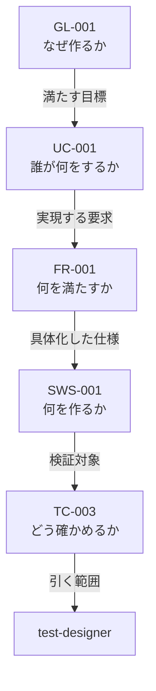

<!-- GENERATED FILE. Do not edit by hand. -->
<!-- Source: maintenance/2026-08-10/00-mode-matrix.md -->
<!-- Regenerate: node maintenance-tools/split-work-table.mjs -->

# 開発方式と作業表の読み方

---

# 開発方式 対応表（2026-08-10）

開発方式を 1 つ決めれば、仕様書・フェーズ・エージェント・プロセス・成果物・レビューがすべて決まる。その対応表である。

**本表が正である。** `spec-writing-rules.md` および `framework-src/` の既存文書と食い違う場合は、本表に合わせて相手側を直す。ただし本表が既存規則を変える箇所は、備考にその旨を明記する（黙って上書きしない）。

適用先: プロセス規則 §3.1.1。

開発方式は `簡易` / `標準` / `厳格` の 3 つ。

## 軸を 2 つに割る

**順序の軸と方式の軸を 1 枚に載せない。**

| 表 | 何を持つか | 節 |
|---|---|---|
| **作業表** | **誰が誰に何を頼み、何を読み、何を書き、何を返すか。** 順序の軸 | §4・§5 |
| **表 M（方式表）** | **その手順を方式ごとに行うか行わないか。** 方式の軸 | §6 |

**混ぜると行が二重になる。** 旧版はレビューと並列実装の 4 手順を、方式ごとに 2 行ずつ書く羽目になっていた。

### 作業表の列

| 列 | 中身 |
|---|---|
| `フェーズ` | **手順記号とフェーズ名を 1 つのセルに持つ。** フェーズ名が**その作業の目的**である。**フェーズ番号は書かない** —— 手順記号の先頭文字がそれを表す。**`新設` / `統合` / `分割` を併記した行は、`commands/full-auto-dev.md` に本体がまだ無い** |
| `作業` | **目的を達成する手段を書く。動詞で終える（MUST）。** 状態（「〜されている」）で書いてはならない —— **前提条件に見え、指示にならない** |
| `依頼元` | 頼む側。`main-agent` か `利用者` |
| `担当者` | やる側。エージェント・`利用者`・道具のいずれか。**1 行 1 担当者。複数なら行を分ける** |
| `モデル` | **その担当者を動かすモデル。** 正本は `agents/*.md` の `model:` であり、**本列は写しである**（検査 18f が一致を強制する）。方式で落とす場合だけ `opus<br />簡易は sonnet` の形で併記する |
| `入力` | 読むもの。**仕様書を読む行は `対象:` と `根拠:` に割る**（§3.1） |
| `出力` | **書くファイル。** `agent-list.md` §2 の file_type で書く。**仕様書は部の単位で書き分ける —— 第 1 部 `spec-foundation`（Ch1-4）／第 2 部 `spec-architecture`（Ch5-7）／第 3 部 `spec-test`（Ch8-10）。ANMS（簡易）では 3 型とも単一の `spec` へ畳まれる**（名簿 §2・文書管理規則 §9.39）。**`spec` を作業表に書いてはならない（MUST NOT）** —— 畳んだ後の名前であり、どの部を書くのかが表から消える |
| `依頼元へ返す` | **依頼元に返す値。** 場所・合否・次の一手だけである（`agent-orchestration-rules.md` §3.6） |
| `備考` | 上のどれにも入らないこと。**1 文ごとに改行する** |

**`出力` と `依頼元へ返す` を混ぜてはならない（MUST NOT）。** 前者はファイル、後者は戻り値である。**成果物の全文を返させない**という規約（`agent-orchestration-rules.md` §4.7 の規約 1）は、両者を分けて初めて検査できる。

**1 行は 1 依頼である。往復の数は `agent-orchestration-rules.md` §4.2・§4.3 が決める。**

重い依頼（レビュー・仕様の詳細化・実機テスト）には受領通知が挟まり、指摘には回答と再判定が続く。**表は依頼の単位を持ち、往復の数は持たない。**

```text
依頼元 --作業_と_入力--> 担当者
担当者 --依頼元へ返す--> 依頼元
担当者 --書く--> 出力
```

### 値の凡例

| 記号 | 意味 | どの表 |
|---|---|---|
| `必須` / `実施` / `●` | 必ず行う | 表 M |
| `免除` / `—` | 行わない | 表 M |
| `条件付き` | 備考の条件に該当する場合のみ行う | 表 M |
| `該当なし` | その列に条件が無い | 表 0 |
| `◎` | レビューを行い、報告ファイルを残す | 表 E-1 |
| `○` | レビューは行うが、報告ファイルは残さない | 表 E-1 |
| `-` | 不要 | 表 E-1 |
| **`新設`** | **その手順の本体がまだ無い。新しく作る** | 作業表 |
| **`統合`** | **既存の複数手順を 1 つにまとめた** | 作業表 |
| **`分割`** | **既存の 1 手順を 2 つに割った** | 作業表 |
| **`[直列]`** | **前の行の完了を待つ**（同じ手順記号の 2 行目以降） | 作業表 |
| **`[同時]`** | **前の行と同時に起動してよい**（同上） | 作業表 |
| **`[簡易・標準]` / `[厳格]`** | **方式で経路が変わる行。互いに排他である** | 作業表 |

**モデルは `opus` / `sonnet` / `haiku` の 3 つだけを使う。`fable` を使ってはならない（MUST NOT）。** `agents/*.md` の `model:` にも書かない。

**モデルの正本は 2 か所にある。** `agents/*.md` の `model:`（Claude Code が実際に読む）と `agent-list.md` §1 の `model` 列である。**両者は現在 22 件すべて一致している**（実測）。本表の `モデル` 列はその写しであり、**3 つ目の正本にしてはならない。**

> **簡易でもモデルを下げない**（2026-08-11 決定）。114 行のうち opus が 69 行を占めるが、そのまま走らせる。
>
> | # | 理由 |
> |:-:|---|
> | 1 | **設計は方式によらず重要である。** 簡易だからといって設計の判断を安いモデルに委ねない |
> | 2 | **開発方式でモデルを変えると管理が煩雑になる。** モデルは担当者だけで決まり、方式の軸を持ち込まない |
>
> **したがって `モデル` 列に方式ごとの併記は現れない。** 現れたらそれは規則違反である（検査 18g）。

**可否を表すセルの値は上記だけである。`任意` を使ってはならない（MUST NOT）。** 表 0・A・E-2 は記述値を持つ表であり、この制限の対象外である。

> **表 B-1・B-2・C・D-1・D-2 は廃止した。** §4 と §5 の作業表に統合し、エージェントの起動可否・成果物・手順数は作業表と表 M から導出する。導出の規則は §11 の検査が持つ。
>
> **表 A-2 も廃止した。** エージェントごとに読む範囲を持っていたが、**同じエージェントでも手順ごとに読むものが変わる**（architect は `4a` で要求を読み、`4e` では設計だけを読む）。作業表の `入力` 列へ畳み、方式ごとの粒度だけを §3 の規則に残した。

---

## 1. 表 0 —— 開発方式の判定

`Phase 1` の `1e` で判定し、`CLAUDE.md`「開発方式」節に記録する（§4.2）。**手順も「開発方式」節もまだ存在しない。**

| | 簡易 | 標準 | 厳格 | 備考 |
|---|---|---|---|---|
| 期間 | 1 日以内で完了 | 1 日超 | 1 週間超 | 見積もりでよい |
| モジュール | 少数 | 複数 | 複数チーム相当の並列実装 | |
| 外部依存 | 最小限 | あり | 外部システム連携あり | |
| Critical | 該当なし | 該当なし | 有効なら期間・規模によらず厳格 | failure が人身・金銭・個人情報のいずれかに直結する場合 |
| 例 | サイコロアプリ、電卓、簡易 CLI、ユーティリティライブラリ | API サービス、DB 連携デスクトップアプリ | 業務システム、マイクロサービス群、決済・医療機器連携・認証基盤 | |

**Critical は他の行を上書きする。** 1 日で作る決済処理も厳格である。

条件付き 13 フラグ（開発方式とは独立に、個別に有効化する）: 法的調査 / 特許調査 / 技術動向調査 / 機能安全(HARA/FMEA/FTA) / アクセシビリティ(WCAG 2.1) / HW連携 / AI/LLM連携 / フレームワーク要求定義 / HW生産工程管理 / 製品i18n/l10n / 認証取得 / 運用・保守 / 実機テスト。判断基準と判断時期はプロセス規則 §3.4 に従う。

フラグは方式と独立なので、簡易でも有効になりうる。 その場合、担当するエージェントは方式によらず起動する（作業表の `条件付き`）。

---

## 2. 表 A —— 仕様書

| | 簡易 | 標準 | 厳格 | 備考 |
|---|---|---|---|---|
| 仕様形式 | ANMS | ANPS-part | ANPS-chapter | 本表が仕様形式の唯一の対応表である。 `spec-writing-rules.md` は形式の定義のみを持ち、方式との対応を持たない |
| 枚数 | 1 | 4 | 14 | Critical で厳格になった小さなプロジェクトでは、14 枚それぞれが小さくなるだけで枚数は減らない |
| 分割の単位 | 分割しない | 部 | 章 | |
| StrictDoc | 使わない | 使う | 使う | ANMS でも記法は同じ。export と検出クエリを使わないだけである |
| 文法ファイル | `spec-anms.sgra` | `spec.sgra` | `spec.sgra` | `tools/spec-query/` から仕様書フォルダへ複製する（MUST の本文は `spec-writing-rules.md` の「ファイル名と番号の規則」節。**`spec-writing-rules.md` に「文法の配置」という節は無い**） |
| テンプレートの行数（記入前） | **再計測** | **再計測** | **再計測** | Chapter 8 の削除後に測り直す。仕様書テンプレートに各ノード型 2 件ずつを置いた状態 |
| ファイル名 | `01-10-spec` | 4 枚 | 14 枚 | 一覧は `spec-writing-rules.md` の「ファイル名と番号の規則」節が持つ |

---

## 3. 仕様書の読ませ方

**何を読むかは §4・§5 の `入力` 列が持つ。本節は粒度だけを決める。**

### 3.1 粒度は方式で決まる

| 方式 | 粒度 | 枚数 |
|---|---|---|
| 簡易 | **全文** | ANMS は 1 枚しかない |
| 標準 | **部** | **3 部 ＋ 付録の 4 枚**のうち該当する部 |
| 厳格 | **章** | 14 枚のうち該当する章。**テスト 3 章はケースと結果で 2 枚に割れる**ので、そこだけ節の粒度になる |

**例外は 4 つだけである。**

| 担当者 | 粒度 | なぜそうするか |
|---|---|---|
| architect | **常に全文** | 要求は互いに関係するため、部分では整合を判断できない。<br />**絞る根拠がまだ無い**（テンプレートの行数が再計測待ち）。<br />推測で絞らない。 |
| implementer | **常に全文** | NFR は全 FR を横断する。<br />同上、絞る根拠がまだ無い。 |
| security-reviewer | **常に全文** | 脅威は要求を横断する。<br />1 つの入力経路が別の要求の資産に届く。 |
| tester | **常に節** | 結果はケースに 1 対 1 で紐づく。<br />自分が書く結果の節と、対応するケースだけでよい。 |

**`Ch1 Foundation` は全担当者・全方式で必ず読む。** 用語集と表記規約がそこにあり、読まなければ用語がぶれる（`terminology-checker` が Out ごとに検査する）。**粒度の対象外であり、`入力` 列にも書かない。**

**章番号を書いてはならない（MUST NOT）。** 観点と章の対応は `review-standards.md` が持つ。ここで番号を並べると正本が 2 つになる。

### 3.2 入力は `対象` と `根拠` に割る

**`対象` は判断する当のもの、`根拠` はその判断が的を射るために要る上流である。**

> **なぜ `根拠` を分けて書くのか。** `agent-orchestration-rules.md` §3.5 が「**節約してよいのは成果物であって、前提ではない**」と定めている。同書は `main-agent` について書いているが、**本表はこれをすべての担当者へ広げて適用する**（`agent-orchestration-rules.md` にこの一般化は無い。広げる判断は本表が負う）。 目的と上流を知らないエージェントは、返ってきたものが筋に合っているかを判断できない。
>
> **サブエージェントは会話履歴・呼んだスキル・読んだファイルを見ない**。**したがって `入力` 列に書いたものが、そのエージェントが知ることのほぼ全部になる。** 作業表は依頼文の材料である。

**上流を外すと何を誤るか。**

| 作業 | 上流を外すと何を取り違えるか |
|---|---|
| 設計レビュー | 何を満たすための設計かを知らず、**正当な単純化を抽象化不足と誤る** |
| テストレビュー | 何を確かめたいかを知らず、**書式しか見られない** |
| 結果の判定 | 期待と実際が食い違ったとき、**テストと実装のどちらに fault があるかを決められない** |
| ユーザーマニュアル | 操作手順・画面・メッセージが ソフトウェア仕様にしかないため、**要求だけでは書けない** |

「対象ノードの祖先」とは、対象ノードから親をたどった鎖である。



**祖先の長さは系統で変わる。** `UC` を通る鎖は `GL → UC → FR → SWS → TC → TR` で 4 ノード、`NFR` 直結の `TC` は 2 ノード、`NFR → SWS` を経るものは 3 ノードである（`spec-writing-rules.md` の鎖の図）。**「祖先は 4 ノード」と決め打ってはならない。**

引く道具は未作成である（`tools/spec-query/` にあるのは `checks.jq` / `spec.sgra` / `spec-anms.sgra` の 3 つ）。段 6 で `ancestors.jq` を新設する。**それまでは UID を手で手繰る。**

### 3.3 `入力` に使ってよい語

**`入力` 列に書けるのは下表の語だけである（MUST）。** 表に無い語を書いてはならない —— 依頼を受けたエージェントが、どのファイルを開けばよいか決められなくなる。

| 語 | 指すもの（`spec-writing-rules.md` の章名） | ノード型 | 注意 |
|---|---|---|---|
| `全文` | 仕様書のすべての章 | すべて | §3.1 の例外 4 者だけが使う |
| `目的` | Foundation の Goals | `GL` | **鎖の根である** |
| `概要` | System Overview | 持たない | 機器と経路。ID が無いので名前で参照する |
| `UC` | Use Cases | `UC` | アクターと主成功シナリオ |
| `要求` | Requirements | `FR` / `NFR` | |
| `NFR` | Requirements のうち非機能 | `NFR` | 数値目標を持つもの |
| `設計` | Design ＋ Software Specification | `ADR` のみ（鎖の外） | **設計レビューの対象範囲である。テスト戦略を含まない** |
| `ソフトウェア仕様` | Software Specification | `SWS` | 操作手順・画面・メッセージはここにしかない |
| `テスト戦略` | Test Strategy | 持たない | **第 2 部（設計側）にある。第 3 部ではない** |
| `テスト` | Use Case Tests ＋ Software Specification Tests ＋ Non-Functional Tests | `TC` / `TR` | 第 3 部。**`テスト戦略` と混同しない** |
| `対象ノードの祖先` | 対象から親をたどった鎖 | 可変 | 長さは 2〜4（上記） |
| `自分が書く結果の節` | 各テスト章の Test Results 節 | `TR` | 系統ごとに別の節である |

**語は 3 通りに書ける。それ以外の形を書いてはならない（MUST NOT）。**

| 形 | 例 | 意味 |
|---|---|---|
| 語そのもの | `対象: 設計` | 上表の語を 1 つ |
| **`と` で連ねる** | `対象: 概要と UC` | 上表の語を 2 つ以上。**新しい語を作るのではない** |
| **限定を付ける** | `根拠: 数値目標を持つ NFR` | 上表の語を条件で絞る |

**`根拠` にはこれに加えて、それ以前の手順の出力を書いてよい**（`根拠: `4a` の spec-architecture`）。**`対象` には書けない。** 対象は仕様書の範囲であり、他の手順の成果物ではない。

**章番号とファイル名は本表に書かない。** 語から章名が決まり、章名からファイルが決まる。**後半の対応は `spec-writing-rules.md` の「ファイル名と番号の規則」が持つ。**

> **仕様書の実ファイル名は `01-10-spec.md` である**（2026-08-11 決定）。§2 の表 A の `01-10-spec` に拡張子を付けたものであり、`spec-writing-rules.md` の席番号規則（ファイル番号は最初の章の番号、範囲を名前に含める）が 10 章構成から導く。**`spec-writing-rules.md` は Chapter 8 削除前の `01-11-spec.md` のままなので、追随させる**。

---
## 4. 作業表 —— フェーズの流れ

**本節に再掲しない。**

**方式ごとの実施・免除は §6 の表 M が持つ。本節に方式の列は無い。** 例外は、**方式によって経路そのものが変わる 4 手順**（`4m` `5a` `5e` `7a`）だけである。その 4 つは行を分け、備考の先頭に **[簡易・標準]** / **[厳格]** を置く。

### 目的はフェーズ名が担う

**`フェーズ` 列がフェーズ名を持ち、それが作業の目的を表す。** だから `作業` 列は**目的を達成する手段**を書く。

| 列 | 答えるもの | 例 |
|---|---|---|
| `フェーズ` | **なぜ**（目的） | `4a`<br />設計 |
| `作業` | **どうやって**（手段） | 要求を満たすアーキテクチャを検討し、設計の章に書く |
| `出力` ＋ `依頼元へ返す` | **どうなれば終わりか**（完了条件） | spec-architecture が書かれ、張った親の範囲が返っている |

**完了条件の列は要らない。** 出力と戻り値がそろえば終わりである。

### 依頼に必ず添える与件

**`入力` 列は手順ごとに変わるものだけを持つ。** 全依頼に共通するものは列に書かず、**依頼文の側で必ず添える（MUST）。**

| 与件 | どこから取るか | 無いと何が起きるか |
|---|---|---|
| **開発方式**（簡易 / 標準 / 厳格） | `1e` の decision | 読む粒度（§3.1）も、報告を残すか（表 E-1）も決まらない |
| **仕様形式**（ANMS / ANPS-part / ANPS-chapter） | §2 の表 A ＋ 開発方式 | 仕様書が 1 枚なのか 14 枚なのか決まらない |
| **仕様書の実ファイル一覧** | 仕様書のフォルダの現物 | §3.3 の語から開くファイルが決まらない |
| **現在のフェーズと直前のゲートの結果** | pipeline-state | 前提が満たされているか判断できない |
| **並列で起動された兄弟の有無と、自分に割り当てられた連番** | `main-agent` | 同時に書くと出力の採番が衝突する |

> **これは列の代わりではない。** サブエージェントは会話履歴を見ないので、**与件も `入力` と同じく依頼文に載らなければ届かない。** 列に書かないのは、97 手順すべてに同じ 5 行を書くのが冗長だからである。

> **フェーズ名を節見出しと重ねて書くのは冗長に見えるが、意図してそうしている。** **1 行がそのまま 1 つの依頼文になる。**行を抜き出したときに目的が失われてはならない。
>
> **したがってフェーズ名の質が全行の質を決める。** 現在の 9 つのうち `Phase 1 初期設定` だけが手段寄りの名前であり、目的を表しきれていない。**改名の要否は別途判断する。**

**手順数（表 M の `実施` を数えた実測値）:**

| | 簡易 | 標準 | 厳格 |
|---|---:|---:|---:|
| 無条件で実施 | **53** | **72** | **76** |
| 条件付き | 31 | 23 | 21 |
| 免除 | 13 | 2 | 0 |
| **合計** | **97** | **97** | **97** |

> **条件付きの手順が走らなかったとき、それを `入力` に挙げている後続の手順は、欠けたまま進む。**
>
> 簡易のサイコロアプリでは `5g`（SAST）と `6h`（性能テスト）が条件に当たらず走らない。**それでも `5i`（GATE-IMPL）と `6l`（GATE-TEST）は両者の結果を `入力` に挙げている。**
>
> **免除と同じ扱いとする —— 走らなかった記録をもって充足とする**（プロセス規則 §9.4.1）。**「入力が無いから止まる」ではない。** ゲートを判定するエージェントは、走らなかったことの記録を受け取って判定する。
>
> **したがってゲートの `入力` には、条件付きの手順の結果が「無い」場合があることを前提とする。**

**合計 97 は方式によらない。** 方式が変えるのは実施か免除かであって、手順の存在ではない。**厳格に免除が 1 つも無い。**

**88 → 96 になった**（2026-08-11、シミュレーションの結果を反映）。新設 8 手順の内訳は `1d` `2e` `6e` `6f` `6g` `Fi` `Fj` `Fk`。

**行数は手順数より多い。** 担当者が複数なら行を分けるためである。**同じ手順記号の行は、すべて依頼元が同じでなければならない。** これは作業表の規則であり、`agent-orchestration-rules.md` §4.5.1 の兄弟形を表に写したものである（`agent-orchestration-rules.md` にこの文は無い）。

### 4.10 不足していた手順（2026-08-11 に解消）

**下表の 8 手順を作業表へ足し、採番を 88 → 96 へ 1 回で当てた。** 採番の読み替え表も同時に更新した。

| 手順 | 足した作業 | 出所 |
|---|---|---|
| `1d` | CLAUDE.md の記入必須欄を利用者に埋めさせる | シミュレーション |
| `2e` | 目的・システム概要・ユースケースを書き、`GL` と `UC` に ID を付ける | レビュー ＋ シミュレーション |
| `6e` `6f` | ユースケーステストのケースと実行 | レビュー |
| `6g` | 非機能テストのケース | レビュー |
| `Fi` | 指摘に分類を付けて 1 通で回答し、再判定を受ける | レビュー |
| `Fj` | リスク score≧6・コスト閾値・ゲート FAIL を即時に利用者へ上げる | レビュー |
| `Fk` | FAIL したゲートの戻り先を決め、該当フェーズへ差し戻す | シミュレーション |

**「依存関係の一覧」は手順を立てなかった。** `5a` の `依頼元へ返す` に加え、`5f` と `5h` がそこから引く。実装した体が何を足したかを知っているので、新しい体を起こす必要がない。

---

---

## 6. 表 M —— 方式ごとの実施・免除

**作業表の全 97 手順について、方式ごとに行うか行わないかだけを持つ。** 作業の中身は §4・§5 が持つ。**本表に作業名を書かない**（正本が 2 つになる）。

**`条件付き` の条件は本表の `備考` が持つ。** 作業表の備考には書かない。

**Phase 0 インストール:**

| 手順 | 簡易 | 標準 | 厳格 | 備考 |
|---|:-:|:-:|:-:|---|
| `0a`〜`0e` | 実施 | 実施 | 実施 | **方式を決める前に走るため、分岐しない。** 方式は `1e` で決まる |

**Phase 1 初期設定:**

| 手順 | 簡易 | 標準 | 厳格 | 備考 |
|---|:-:|:-:|:-:|---|
| `1a` | 実施 | 実施 | 実施 | |
| `1b` | 実施 | 実施 | 実施 | |
| `1c` | 実施 | 実施 | 実施 | |
| `1d` | 実施 | 実施 | 実施 | |
| `1e` | 実施 | 実施 | 実施 | |
| `1f` | 免除 | 条件付き | 実施 | ステークホルダーが複数いるとき |
| `1g` | 実施 | 実施 | 実施 | |
| `1h` | 実施 | 実施 | 実施 | |
| `1i` | 実施 | 実施 | 実施 | |

**Phase 2 企画:**

| 手順 | 簡易 | 標準 | 厳格 | 備考 |
|---|:-:|:-:|:-:|---|
| `2a`〜`2k` | 実施 | 実施 | 実施 | **全 11 手順が無条件である。** 要求を立てない開発方式は無い |

**Phase 3 外部依存選定:**

| 手順 | 簡易 | 標準 | 厳格 | 備考 |
|---|:-:|:-:|:-:|---|
| `3a`〜`3g` | 条件付き | 条件付き | 条件付き | HW・AI・フレームワークのいずれかのフラグが有効なとき。**全 7 手順が同じ条件に従う** |

**Phase 4 設計:**

| 手順 | 簡易 | 標準 | 厳格 | 備考 |
|---|:-:|:-:|:-:|---|
| `4a` | 実施 | 実施 | 実施 | |
| `4b` | 実施 | 実施 | 実施 | |
| `4c` | 実施 | 実施 | 実施 | |
| `4d` | 実施 | 実施 | 実施 | |
| `4e` | 条件付き | 実施 | 実施 | API を持つ場合 |
| `4f` | 免除 | 条件付き | 条件付き | 第三者に公開する API を持つ場合 |
| `4g` | 条件付き | 実施 | 実施 | 外部からの入力経路がある場合 |
| `4h` | 免除 | 実施 | 実施 | |
| `4i` | 条件付き | 実施 | 実施 | 配布以外のデプロイ先がある場合 |
| `4j` | 免除 | 免除 | 実施 | |
| `4k` | 免除 | 実施 | 実施 | |
| `4l` | 条件付き | 条件付き | 条件付き | 機能安全フラグ。Critical では必須 |
| `4m` | 実施 | 実施 | 実施 | **経路が方式で変わる**（§4.5） |
| `4n` | 実施 | 実施 | 実施 | |

**Phase 5 実装:**

| 手順 | 簡易 | 標準 | 厳格 | 備考 |
|---|:-:|:-:|:-:|---|
| `5a` | 実施 | 実施 | 実施 | **経路が方式で変わる**（§4.6） |
| `5b` | 免除 | 実施 | 実施 | |
| `5c` | 実施 | 実施 | 実施 | |
| `5d` | 条件付き | 実施 | 実施 | 配布以外のデプロイ先がある場合 |
| `5e` | 実施 | 実施 | 実施 | **経路が方式で変わる**（§4.6） |
| `5f` | 実施 | 実施 | 実施 | |
| `5g` | 条件付き | 実施 | 実施 | 簡易は外部入力を扱う場合のみ |
| `5h` | 実施 | 実施 | 実施 | |
| `5i` | 実施 | 実施 | 実施 | |

**Phase 6 テスト:**

| 手順 | 簡易 | 標準 | 厳格 | 備考 |
|---|:-:|:-:|:-:|---|
| `6a` | 実施 | 実施 | 実施 | |
| `6b` | 実施 | 実施 | 実施 | |
| `6c` | 実施 | 実施 | 実施 | |
| `6d` | 実施 | 実施 | 実施 | |
| `6e` | 実施 | 実施 | 実施 | |
| `6f` | 実施 | 実施 | 実施 | |
| `6g` | 条件付き | 実施 | 実施 | 数値目標を持つ NFR がある場合 |
| `6h` | 条件付き | 実施 | 実施 | 数値目標を持つ NFR がある場合 |
| `6i` | 条件付き | 条件付き | 条件付き | 実機テストフラグ |
| `6j` | 免除 | 免除 | 実施 | |
| `6k` | 実施 | 実施 | 実施 | |
| `6l` | 実施 | 実施 | 実施 | |

**Phase 7 納品:**

| 手順 | 簡易 | 標準 | 厳格 | 備考 |
|---|:-:|:-:|:-:|---|
| `7a` | 実施 | 実施 | 実施 | **経路が方式で変わる**（§4.8） |
| `7b` | 免除 | 条件付き | 実施 | 複数バージョンを並行保守するとき |
| `7c` | 条件付き | 実施 | 実施 | 配布以外のデプロイ先がある場合 |
| `7d` | 条件付き | 実施 | 実施 | 同上 |
| `7e` | 条件付き | 実施 | 実施 | 同上 |
| `7f` | 条件付き | 実施 | 実施 | 同上 |
| `7g` | 実施 | 実施 | 実施 | |
| `7h` | 実施 | 実施 | 実施 | |
| `7i` | 条件付き | 条件付き | 条件付き | 運用・保守フラグ |
| `7j` | 実施 | 実施 | 実施 | |
| `7k` | 実施 | 実施 | 実施 | |
| `7l` | 実施 | 実施 | 実施 | |
| `7m` | 実施 | 実施 | 実施 | |

**Phase 8 運用・保守:**

| 手順 | 簡易 | 標準 | 厳格 | 備考 |
|---|:-:|:-:|:-:|---|
| `8a`〜`8f` | 条件付き | 条件付き | 条件付き | 運用・保守フラグ。**全 6 手順が同じ条件に従う。`8f` はさらに終了する場合のみ** |

**共通手順:**

| 手順 | 簡易 | 標準 | 厳格 | 備考 |
|---|:-:|:-:|:-:|---|
| `Fa` | 免除 | 実施 | 実施 | |
| `Fb` | 実施 | 実施 | 実施 | |
| `Fc` | 実施 | 実施 | 実施 | 簡易は pipeline-state のみ |
| `Fd` | 免除 | 実施 | 実施 | |
| `Fe` | 免除 | 実施 | 実施 | |
| `Ff` | 免除 | 条件付き | 条件付き | 仕様書承認後に利用者から変更要求が出たとき |
| `Fg` | 条件付き | 実施 | 実施 | defect を発見したとき。**簡易も初回から発火する** —— 発火しないとテストの失敗が修正へ向かう経路を持たない |
| `Fh` | 免除 | 実施 | 実施 | |
| `Fi` | 条件付き | 条件付き | 条件付き | レビューで指摘が 1 件でも出たとき |
| `Fj` | 条件付き | 条件付き | 条件付き | リスク score≧6 ／ コスト閾値の到達 ／ ゲート FAIL のいずれか |
| `Fk` | 条件付き | 条件付き | 条件付き | ゲートが FAIL したとき |

---

## 7. 表 E-1 —— フェーズごとのレビューと報告

| 記号 | 意味 |
|:-:|---|
| ◎ | レビューを行い、`project-records/reviews/` に報告ファイルを残す |
| ○ | レビューは行うが、報告ファイルは残さない。結果は最終報告にまとめる |
| - | 不要 |

| フェーズ / 観点 | 簡易 | 標準 | 厳格 | 備考 |
|---|:-:|:-:|:-:|---|
| `2i` R1（要求品質） | ◎ | ◎ | ◎ | 観点 1 件。<br />厳格でも 1 エージェント（割る先が無い）。 |
| `4m` R2・R4・R5・R7（設計品質） | ◎ | ◎ | ◎ | 観点 4 件。<br />厳格は 4 エージェント。 |
| `5e` R2・R3・R4・R5・R7（実装品質） | ◎ | ◎ | ◎ | 観点 5 件。<br />厳格は 5 エージェント。 |
| `6k` R6（テスト品質） | ◎ | ◎ | ◎ | 観点 1 件。<br />厳格でも 1 エージェント（割る先が無い）。 |
| `7a` R1〜R7（最終） | ◎ | ◎ | ◎ | 観点 7 件。<br />厳格は 7 エージェント。<br />簡易はここで R1〜R7 を網羅する。 |
| 再レビュー（修正後） | ◎ | ◎ | ◎ | 標準は「修正済み」とした指摘のみ。<br />厳格は全指摘。 |
| 観点ごとに別走行 | - | - | ◎ | 厳格は R1〜R7 を混ぜない。<br />**1 観点 = 1 エージェント。R をまたがない。** |

報告ファイルの本数: 簡易 5 本 ＋ 再レビュー分（**2026-08-11 に 1 本から改めた。ゲートが `入力` に「◯◯ の review」を挙げており、ファイルを残さないと引く先が無い**）／旧記述 1 本 / 標準 5 本 ＋ 再レビュー分 / 厳格 18 本 ＋ 再レビュー分（各フェーズの観点数 1+4+5+1+7 の総和。積ではない）。

**ゲートは全方式で 8 つとも判定する。省けるのは報告ファイルであってレビューではない。**

> どの観点がどの章を見るかは `review-standards.md` が持つ。 本表は方式ごとに報告を残すかだけを持つ。

---

## 8. 表 E-2 —— レビューの基準

重大度は 4 段（Critical / High / Medium / Low）で全方式共通。

| | 簡易 | 標準 | 厳格 | 備考 |
|---|---|---|---|---|
| 合格線（Critical） | 0 | 0 | 0 | `review-standards.md`「重大度別の対応ルール」に従う |
| 合格線（High） | 0 | 0 | 0 | 同上 |
| 合格線（Medium） | 対応記録があればよい | 対応記録があればよい | 0（修正済みのみ） | **厳格は既存規則を厳しくする。** 既存は据置き・受容を許容する |
| 合格線（Low） | 記録不要 | 対応記録があればよい | 対応記録があればよい | **簡易は既存規則を緩める。** 既存は全規模で対応記録を要求する |
| ゲート FAIL 時のエスカレーション | 3 回目 | 3 回目 | 2 回目 | **厳格の「2 回目」は本表で新設する。** プロセス規則 §9.1.1 の再試行ポリシー表は 1-2 回目 / 3 回目の 2 段しか持たない |
| waiver | 3 条件（ユーザー承認・tech-decision 記録・final-report 転記） | 同左 | 同左 | 3 条件は §9.1.1 に従う。再評価時期の記録は条件 2 に含まれ、全方式で必須である |

> 既存規則を変える 3 行（Medium の厳格・Low の簡易・エスカレーションの厳格）は、段 1 で `review-standards.md` と §9.1.1 の側にも同じ変更を入れる。**片方だけ変えてはならない（MUST NOT）。**

---

## 9. 簡易で何が動くか

**すべて §4・§5 の作業表から導出した値である。** 作業表を直したらここも直す。

| | 内容 |
|---|---|
| 仕様書 | ANMS 1 枚 |
| 手順 | **無条件 53**（うち `Phase 0` インストールが 5）。<br />条件付き 31。<br />免除 13。<br />**合計 97**。 |
| エージェント | **無条件 11 エージェント** —— srs-writer<br />architect<br />technical-authority<br />project-manager<br />review-agent<br />implementer<br />security-reviewer<br />license-checker<br />test-designer<br />tester<br />user-manual-writer |
| 条件付きで増えるエージェント | **8 エージェント** —— runbook-writer<br />field-test-engineer<br />feedback-classifier<br />field-issue-analyst<br />incident-reporter<br />progress-monitor<br />process-improver<br />change-manager<br />**全部有効なら 19 エージェント。** |
| 簡易では決して起動しないエージェント | **2 エージェント** —— risk-manager（`4k` 免除）<br />decree-writer（`Fe` 免除）<br />**19 ＋ 2 = 21。名簿は現在 22 件である。**<br />差は `terminology-checker` の 1 件のみで、**作業表のどの行にも現れない**。**完了報告の用語チェック要請で呼ばれるため、手順を持たない**（`agent-orchestration-rules.md` §4.6 の規約 6）。<br />**`test-engineer` は名簿から外した**（2026-08-12 決定。作業表で 1 度も使わないため）。 |
| 成果物 | user-order<br />CLAUDE.md<br />**tech-decision**<br />pipeline-state<br />interview-record<br />src<br />spec-foundation<br />spec-architecture<br />spec-test<br />traceability<br />test-plan<br />review<br />security-scan-report<br />license-report<br />final-report<br />user-manual<br />handoff<br />session-handoff<br />**18 件（表 M の `実施` から機械で導出した）。**<br />**ANMS なので 3 型は単一の `spec` へ畳まれ、現物のファイルは 1 枚である。** |
| レビュー報告 | **5 本 ＋ 再レビュー分**（`2i` `4m` `5e` `6k` `7a`。表 E-1 が正）。<br />**簡易でも報告ファイルを残す。** `gate-guard` は `project-records/reviews/` の実ファイルしか見ないので、残さないとゲートが開かない。<br />`7a` は 1 エージェントで R1〜R7 を網羅する。<br />合格線 Critical 0 / High 0。 |
| ゲート | 全 8 ゲートを判定する。 |

> **`test-plan` が新たに簡易の成果物になった。** 旧 `5a` `5b` を「作成 / 実行」に割った結果、受入基準とテストコードが `6a` `6c` の `出力` として現れたためである。**統合しなければ出てこなかった。**

**ゲートは方式によらず免除しない。免除するのは作業であってゲートではない。**

> ゲートが要求する成果物を方式が免除する組み合わせがある（`GATE-DELIVERY` の runbook、`GATE-IMPL` の SAST、`GATE-DESIGN` の threat-model）。**逃げ道は既にある。** プロセス規則 §3.1.1 が「免除した成果物は、免除の記録をもって当該ゲートを充足したものとみなす」を全ゲートに与え、§9.4.1 のゲート条件表が `GATE-IMPL` の SAST・`GATE-TEST` の性能テスト・`GATE-DELIVERY` の runbook に同じ但し書きを個別に持つ。**簡易は納品ゲートを通過できる。規約違反になるのは記録なき免除だけである。**

---

## 10. 標準と厳格の違い

**起動するエージェントは同じである。** 差は作業表の次の行に出る。

| 作業 | 標準 | 厳格 | 何が変わるか |
|---|:-:|:-:|---|
| `1f` ステークホルダー登録簿を作る | 条件付き | 実施 | 関与者が複数いる。 |
| `4j` WBS とガントチャートを作る | 免除 | 実施 | 並列する担当者がいて工程表が要る。 |
| `4m` 設計の品質レビュー | **1 エージェント** | **4 エージェント** | R2・R4・R5・R7 を 1 観点 1 エージェントに割る。 |
| `5a` コードを実装する | 単線 | **Git worktree で並列** | 差は実装の仕方にある。<br />worktree ごとにキャッシュが冷える。 |
| `5e` 実装コードのレビュー | **1 エージェント** | **5 エージェント** | R2・R3・R4・R5・R7 を 1 観点 1 エージェントに割る。 |
| `6j` テスト消化曲線と defect curve を更新する | 免除 | 実施 | 1 週間未満の走行では点が足りない。 |
| `7a` 全成果物の最終レビュー | **1 エージェント** | **7 エージェント** | R1〜R7 を 1 観点 1 エージェントに割る。<br />**下限だけで 7 倍になる。** |
| `7b` リリース判定チェックリストを運用する | 条件付き | 実施 | 複数バージョンを並行保守する。 |
| 表 E-1 観点ごとに別走行 | - | ◎ | R1〜R7 を混ぜない。 |
| 表 E-1 報告ファイルの本数 | 5 ＋ 再レビュー分 | 18 ＋ 再レビュー分 | 上に従う。 |
| 表 E-1 再レビューの範囲 | 「修正済み」とした指摘のみ | 全指摘 | 据置き・受容も検証する。<br />セルの値は両方 ◎ で、差は範囲にある。 |
| 表 E-2 Medium の合格線 | 対応記録があればよい | 0（修正済みのみ） | 据置き・受容を認めない。 |
| 表 E-2 エスカレーション | FAIL 3 回目 | FAIL 2 回目 | 早く利用者へ上げる。 |

**差は 13 行。** 手順の数ではなく、成果物とレビューの厳しさに出る。

### 10.1 レビューを 1 観点 = 1 エージェントに割る

**レビューの 3 行（`4m` `5e` `7a`）は、この決定で新たに標準と厳格の差になった。** いずれも値は `実施` だが、**経路が違うので作業表では行を分けている。**

| 手順 | 観点 | 簡易・標準 | 厳格 |
|---|---|:-:|:-:|
| `2i` 要求レビュー | R1 | 1 エージェント | **1 エージェント**（割る先が無い） |
| `4m` 設計レビュー | R2 / R4 / R5 / R7 | 1 エージェント | **4 エージェント** |
| `5e` 実装レビュー | R2 / R3 / R4 / R5 / R7 | 1 エージェント | **5 エージェント** |
| `6k` テストレビュー | R6 | 1 エージェント | **1 エージェント**（割る先が無い） |
| `7a` 最終レビュー | R1〜R7 | 1 エージェント | **7 エージェント** |

| # | 採る理由 |
|:-:|---|
| 1 | **追跡性が切れない。** 独自の分野名を作ると `review-standards.md` との対応表が要り、二重管理になる |
| 2 | **依頼文が 1 行で済む**（「R2 だけ見よ」）。分野の定義を書き下ろさなくてよい |
| 3 | **最終レビューの 7 観点が 4 分野に収まらない問題が消える。** 同時実行の上限 20 に対して余裕がある |

**項目数の偏り（R2 が 20、R4 が 3）は許容する。** 割る目的は負荷分散ではなく**文脈の分離**であり、早く終わるエージェントが出ても損ではない。

> **厳格の値段:** 最終レビュー 1 エージェントの実測は約 38k 相当である（下限は 27k〜35k で、それより上に積まれる）。**7 エージェントで回すと約 260k 相当になる。**
>
> **下限と実測を混同しない。** 7 倍になるのは実測のほうであり、下限だけを 7 倍しても 189k〜245k にしかならない。

> 仕様書の分割（表 A・A-2）にも差がある。 本節が挙げるのは作業表と表 E の差だけである。

---

## 11. 本表が満たすべき検査

`maintenance-tools/check-mode-matrix.mjs` が確かめる（2026-08-12 に新設。CI のステップ `mode-matrix`）。**機械で判定できる検査だけを実装しており、意味理解を要するもの（検査 21 の動詞判定、検査 18e の分類）は実装していない。**

**軸を 2 つに割ったので、検査も 2 群に割れる。**

### 11.1 表の形

| # | 判定 |
|:-:|---|
| 1 | **表 M の方式の列が** `簡易` / `標準` / `厳格` / `備考` の 3 ＋ 1 である。**作業表に方式の列が無い** |
| 2 | 可否を表すセルに `任意` が無い |
| 3 | `Micro` / `Small` / `Standard` / `Large` / `中規模以上` / `通常` / `厳密` が区分名として 0 件 |
| 4 | 表 E-1 のフェーズ / 観点の行の値が `◎` / `○` / `-` のいずれかである |
| 5 | 表 E-2 の重大度が `review-standards.md`「重大度別の対応ルール」の 4 段と一致する |
| 6 | `spec-writing-rules.md` の章・節の題名が `spec-template.md` の見出しと一致する |

### 11.2 作業表と表 M の噛み合わせ

| # | 判定 |
|:-:|---|
| 7 | **作業表に現れる手順記号の集合が、表 M に現れる集合と完全に一致する。** 片方にしか無い記号を許さない |
| ~~8~~ | **削除した**（2026-08-12）。「作業表の手順記号が `commands/full-auto-dev.md` に実在する」ことを求めていたが、**当の `full-auto-dev.md` は「手順をこの文書に写してはならない（MUST NOT）」と定めて手順記号を 1 つも持たない。** 手順の正本が作業表へ移った時点で役目が終わっており、**このままでは 97 件すべてが落ちる**。検査 7（作業表と表 M の集合一致）が代替する |
| 9 | 表 M の `条件付き` のセルには、同じ行の `備考` に条件が書かれている |
| 10 | **作業表の備考に `[簡易・標準]` / `[厳格]` を持つ手順は、表 M で「経路が方式で変わる」と注記されている**（現在 `4m` `5a` `5e` `7a` の 4 つ） |
| 11 | §10 に挙げた行が、作業表と表 M と表 E で実際に標準と厳格の差が出る行と一致する |

### 11.3 担当者と入出力

| # | 判定 |
|:-:|---|
| 12 | **`依頼元` と `担当者` が `agent-list.md` §1 の名簿に実在する。** 名簿外の値として `**main-agent**` / `**利用者**` / `**各 file_type のオーナー**` / `**指摘を受けた成果物のオーナー**`（`Fi`）/ `setup.js` の 5 つだけを許す |
| 13 | **全行に `担当者` が 1 つある。** 複数を書いてはならない。**`× N` の形と `**各 file_type のオーナー**` を 1 つとみなす** |
| 14 | **同じ手順記号の行が複数あれば、`依頼元` はすべて同じである**（兄弟の規則。`agent-orchestration-rules.md` §4.5.1） |
| 15 | **`担当者` が `**利用者**` の行は、`依頼元` が `**main-agent**` である**（`agent-orchestration-rules.md` §4.5 の規約 1）。エージェントが利用者に直接話す経路を許さない |
| 16 | **`依頼元` は `**main-agent**` か `**利用者**` だけである**（`agent-orchestration-rules.md` §4.5 の規約 3・7）。エージェントがエージェントを起動する経路を許さない |
| 17 | **`担当者` がその方式で 1 つも `実施` を持たないエージェントは、その方式で起動しない**（旧 表 C の導出。表 M を引く） |
| 18 | **`出力` に現れる名前が `agent-list.md` §2 の file_type に実在する。** file_type でない生成物は除外リストで明示する —— `src` / `tests` / `infra` / `openapi` / `container-image` / `settings.json` / `agents` / `commands` / `process-rules` / `CLAUDE.md` / `全 file_type`（`Fh`）。**前 3 者は名簿 §2 が「file_type ではない生成物」として明示的に列挙している。新設候補ではない** |
| **18b** | **`出力` の file_type のオーナーが `担当者` と一致する。** 異なる行は `備考` に移管の宣言を持つ（`agent-orchestration-rules.md` §4.7 の規約 4） |
| **18c** | **`担当者` が `review-agent` の行の `出力` は `review` だけである**（`agent-orchestration-rules.md` §4.7 の規約 3。レビュアーに直させない） |
| **18d** | **`担当者` が `**main-agent**` の行は `出力` が `—` である**（`agent-orchestration-rules.md` §4.5 の規約 1。`main-agent` に記録させない）。**例外は `session-handoff` の 1 型だけである** —— 文書管理規則 §11 が「**サブエージェントでは復元できない情報を持つ成果物にのみ `main-agent` を指定できる（MUST）**」と定めており、セッションの会話文脈がそれに当たる |
| **18f** | **`モデル` 列が `agents/*.md` の `model:` および `agent-list.md` §1 の `model` 列と一致する。** 名簿未登録の暫定値は `**暫定**` を併記する。**`fable` が現れたら FAIL** |
| **18g** | **`モデル` 列に方式ごとの併記が無い。** モデルは担当者だけで決まる（2026-08-11 決定） |
| **18e** | **`依頼元へ返す` の各値が「場所」「可否」「件数」「次の一手」のいずれかに分類できる。** 分類できない値があれば FAIL（`agent-orchestration-rules.md` §3.6・§4.3 の規約 4・§4.7 の規約 1） |
| 19 | **全行に `依頼元へ返す` がある。** 空欄を許さない。**`—` を許すのは `依頼元` と `担当者` が同じ行だけである**（自分でやる行に戻り値は無い） |
| 20 | **`出力` と `依頼元へ返す` に同じ値が現れない。** 現れたら成果物を返させている（`agent-orchestration-rules.md` §4.7 の規約 1 違反） |
| 21 | **`作業` が手段として書かれ、動詞で終わる。** 状態表現（「〜ている」「〜である」）を許さない —— **前提条件に見え、指示にならない** |
| **21b** | **全行の `フェーズ` がフェーズ名と手順記号の両方を持つ。** フェーズ名が欠けた行は目的を持たない |
| **21c** | **`入力` に現れる語がすべて §3.3 の一覧に実在する。** 一覧に無い語を書いてはならない —— 依頼を受けた側が開くファイルを決められない |
| **21d** | **同じ手順記号に複数行あるとき、2 行目以降の `備考` が `[直列]` / `[同時]` / `[簡易・標準]` / `[厳格]` のいずれかで始まる。** 「兄弟で並べて起動する」は階層の話であって順序の話ではない |
| 22 | **仕様書を読む行の `入力` は `対象:` と `根拠:` の両方を持つ。** 片方だけを許さない。§3.1 の例外 4 エージェントは `全文` / `節` のみでよい |
| 23 | **`入力` に章番号（`Ch` で始まる字面）が 0 件である。** 観点と章の対応は `review-standards.md` が持つ |

> **現状 FAIL する検査が 3 つある。段 1・段 6 で解消する。**
>
> **検査 12 は解消した**（2026-08-11）。`test-designer` と `tester` を `agent-list.md` §1 に登録し、`framework-src/ja/agents/` に定義を新設した。**現在は名簿 22 件・定義 22 件で `check-roster` は PASS である**（2026-08-12 に `test-engineer` を削除し、`kotodama-kun` を `terminology-checker` へ改名した。`framework-src/en/` は削除済みで言語ツリーは 1 つである）。
>
> **検査 18**（`出力` が file_type に実在する）—— 次の 4 件が名簿に無い。**名簿を直すか出力を寄せるかは名簿側の判断であり、本表では決めない。**
>
> | 出力 | 使う手順 | 名簿の状況 |
> |---|---|---|
> | `spec` | — | **解消した**（2026-08-12）。`4c` `4d` を `spec-architecture`、`5c` `6a`〜`6h` を `spec-test` へ振り替え、部の境界（Ch1-4 / Ch5-7 / Ch8-10）に揃えた。**ANMS で 3 型が `spec` 1 枚へ畳まれる規則は §「作業表の列」が持つ** |
> | `safety` | `4l` | 無い |
> | `release-checklist` | `7b` | 無い |
> | `stakeholder-register` ほか | — | 実在する。問題ではない |
>
> **`openapi` / `src` / `container-image` は新設しない。** 名簿 §2 が「**file_type ではない生成物**: openapi.yaml, src/, tests/, infra/, cost-log.json, …」と明示的に列挙している。**除外リストへ入れるのが正しい。**
>
> **検査 18b**（オーナーの一致）—— `7f` `8d` および `traceability` を書く行が不一致であり、**いずれも `備考` に宣言を入れた**（`00` 冒頭の「黙って上書きしない」に従う）。名簿側の是正は別途。

### 11.4 既知の fault で落ちること

| # | 判定 |
|:-:|---|
| 24 | 存在しないエージェント名を `担当者` に 1 件仕込むと FAIL する |
| 25 | 存在しない手順記号を作業表に 1 件仕込むと FAIL する（検査 7 が落ちる。**検査 8 は削除済み**） |
| 26 | `依頼元` にエージェントの名前を 1 件仕込むと FAIL する（検査 16） |
| 27 | `出力` の値を `依頼元へ返す` にも書くと FAIL する（検査 20） |

### 11.5 統合の検算（1 度だけ走らせる）

**旧表を捨てる前に、作業表から導出した値が旧表と一致することを確かめる。** 一致しなければ統合で何かを落としている。

| # | 検算 | 状態 |
|:-:|---|---|
| 1 | 導出した起動エージェントが旧 表 C と一致する | **実施済み。** 簡易は旧表の 12 エージェントと一致した。**その後 `terminology-checker`（旧 kotodama-kun）が作業表に行を持たなくなったため、現在の導出は 11 エージェントである**（§9。完了報告の要請で呼ばれる）。標準・厳格は旧表の宣言が `17` だったが実測 `16` で、旧表の側が誤っていた |
| 2 | 導出した成果物が旧 表 D-2 と一致する | 未実施 |
| 3 | 導出した手順数が旧 表 B-1 と一致する | 未実施。**新設・統合・分割を除いた状態で比べる** |

> **検算 1 は旧表の fault を見つけた。** 旧 表 C は「無条件で起動するエージェント数 標準 17 / 厳格 17」と書いていたが、`●` を数えると 16 である。**統合しなければ気づかないままだった。**
