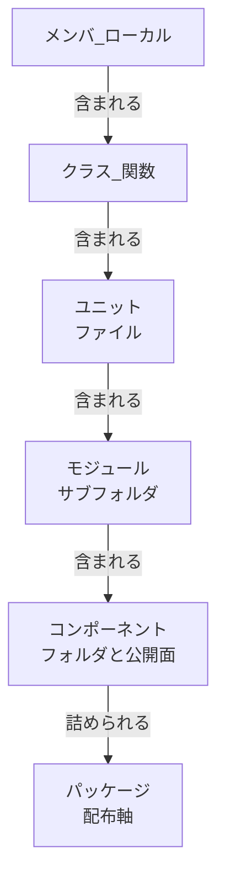

# 用語集

> **本文書の位置づけ:** full-auto-dev フレームワークで使用する用語の定義。辞書的な一般用語は含まない。フレームワーク固有の意味・選定理由・非採用の代替を記録する。
> **関連文書:** [プロセス規則](full-auto-dev-process-rules.md)、[文書管理規則](full-auto-dev-document-rules.md)、[エージェント一覧](agent-list.md)、[不具合系用語の体系](defect-taxonomy.md)

---

## 1. 意図的に選定した用語

同義語が複数ある中で、意図的に1つを選んだ用語。非採用の代替とその理由を記録する。

| 用語 | English | 定義 | 非採用 | 理由 |
|------|---------|------|--------|------|
| 要求 | requirement | システムが満たすべき条件。EARS 構文で形式化する | 要件 | 要求が根源（求めるもの）。要件は派生（満たすべき条件）。Requirements = 要求で統一 |
| インタビュー | interview | ユーザーへの構造化質問による要求抽出 | ヒアリング | hearing は和製英語。英語では法廷審問・聴覚の意味 |
| status | ステータス | ワークフロー上の現在位置を示す値 | state | state（存在モード）と status（進捗位置）の区別は実務上不要。status に統一 |
| error | error | 人間の認識・判断・操作のミス。fault の原因（IEEE 1044）。詳細は [defect-taxonomy](defect-taxonomy.md) 参照 | 誤り | 英単語で統一。日本語の「誤り」は日常語で技術的精度が低い |
| fault | fault | error の結果、コード・設計・仕様に潜在する不正状態。発見されるまで発現しない（IEEE 1044, IEC 61508） | フォールト, 欠陥 | 英単語で統一。カタカナも不採用 |
| failure | failure | fault が実行時に発現し、要求を満たさなくなった事象（IEEE 1044, IEC 61508） | フェイラー, 故障, 障害 | 「故障」はHW寄り、「障害」は多義的。英単語で統一 |
| defect | defect | テスト・運用で発見された failure（または fault）の正式記録（file_type）。因果連鎖: error → fault → failure → defect | 障害, bug, バグ, 不具合 | 「障害」は failure/incident と混同するため廃止。英単語で統一 |
| incident | incident | 本番環境で発生した計画外のサービス影響事象（ITIL, ISO 20000）。file_type: incident-report | 障害, インシデント | 英単語で統一。カタカナも不採用 |
| hazard | hazard | failure が人命・財産・環境に害を及ぼしうる危険源（IEC 61508）。条件付きプロセス「機能安全」が有効な場合に使用 | ハザード | 英単語で統一 |
| fault origin | fault origin | fault が混入したフェーズ。requirements fault / design fault / implementation fault の3分類（IEEE 1044）。defect の root cause analysis で使用 | — | 因果連鎖における fault の発生源を特定するための分類軸 |
| HARA | HARA | Hazard Analysis and Risk Assessment（ISO 26262）。システムレベルで hazard を特定し safety goal を導出する分析手法。機能安全が有効な場合に必須 | — | トップダウン分析。詳細は [defect-taxonomy §7](defect-taxonomy.md) |
| FMEA | FMEA | Failure Mode and Effects Analysis（IEC 60812）。コンポーネントレベルで fault のモードと影響を網羅的に分析する手法 | — | ボトムアップ分析。Ch3 確定後に実施 |
| FTA | FTA | Fault Tree Analysis（IEC 61025）。特定の top event から原因を AND/OR ゲートで逆探索する分析手法 | — | トップダウン分析。高リスク hazard または重大 incident の原因分析に使用 |
| interview-record | インタビュー記録 | ユーザーインタビューの構造化記録（file_type） | hearing-record | 上記 interview の選定に連動 |
| disaster-recovery-plan | 災害復旧計画 | RPO/RTO に基づく復旧手順の定義（file_type） | dr-plan | 名前空間の略称禁止ルールに従う |

## 2. フレームワーク固有概念

辞書に載っていない、このフレームワークで定義される概念。

| 用語 | 定義 |
|------|------|
| STFB | Stable Top, Flexible Bottom（上剛下柔）。安定依存の原則に基づく仕様書の章構成。上位章は安定・抽象、下位章は可変・具体 |
| ANMS | AI-Native Minimal Spec。単一 Markdown ファイルの仕様書形式。1コンテキストウィンドウに収まる規模向け |
| ANPS | AI-Native Plural Spec。複数 Markdown ファイル + Common Block の仕様書形式。中規模向け |
| ANGS | AI-Native Graph Spec。GraphDB + Git の仕様書形式。大規模向け。MD はビュー |
| main-agent | ユーザーと双方向にやりとりし、サブエージェントを起動する唯一の主体。Claude Code のメインの会話そのものであり、**定義ファイルを持たないため名簿（agent-list §1）に載らない**。会話履歴を保持する |
| project-manager | 進行状態の記録と PM 情報の統合・報告を担うサブエージェント。**ユーザーとは直接やりとりしない**（旧名 `orchestrator`。世の中の orchestrator がユーザー入口を兼ねるため退役させた） |
| Common Block | 全 file_type 共通のメタデータ。ファイルの身元証明（識別・状態・ワークフロー・コンテキスト・出自）。**YAML frontmatter のトップレベルに置く** |
| Form Block | file_type 固有の構造化フィールド。エージェントがパースして判断・アクションに使う。**frontmatter 内で名前空間キーの配下にネストし、1 ファイルに 1 つ** |
| Detail Block | 詳細説明ゾーン。ドメイン知識の本体。人間とエージェントが理解のために読む。**frontmatter の外、本文の markdown** |
| OKF | Open Knowledge Format。知識文書の容器形式の標準。本フレームワークは v0.2 に従い、`type` / `description` / `generated` / `sources` を用いる |
| actor | 主体の表記規約。`{agent-name}` / `human:{id}` / `process:{id}` の 3 形式。**人間の承認と機械の生成を機械的に区別するために設けた** |
| Footer | 更新履歴ブロック。append-only。監査用 |
| In | エージェントの入力。仕事開始時に存在するファイル。イミュータブル（読むだけ） |
| Out | エージェントの出力。仕事終了時の最終成果物。End Conditions に対応。次のエージェントの In になる |
| Work | エージェントの作業用一時ファイル。Out 完成後に削除する。再利用しない |
| pure function（純粋関数）| 可変内部状態なし・副作用なし・外部状態を読まない。出力は引数のみで決まる（参照透過）|
| semi-pure function（準純粋関数）| 可変状態なし・副作用なしだが、外部状態を自ら読む。参照透過ではない。準純粋-a=不変値の読取（決定的）、準純粋-b=可変/非決定の読取（時刻・乱数・DB/ファイル読取）|
| non-pure function（非純粋関数）| 可変内部状態を持つ、または副作用がある（グローバル/引数の書換・I/O・ログ・lock/mutex・throw・HW/OS/env 変更）|
| immutable class（不変クラス）| 構築後フィールド不変。メソッドは新インスタンスを返し純粋（this 固定＝引数扱い）。例: LocalDate, record |
| value object（値オブジェクト）| 同一性でなく値で比較される不変オブジェクト。純粋メソッド。例: Money, Coordinate |
| stateless class（ステートレスクラス）| 状態を持たず純粋メソッド/ユーティリティのみ。例: Math |
| stateful class（ステートフルクラス）| 可変状態を持つ、または副作用メソッドを持つ（非純粋メソッドを含む）。例: 書込リポジトリ、キャッシュ |

## 3. 略称の許可判定

名前空間（file_type 名）での略称使用の判定記録。原則: 略称禁止（document-rules §7）。

| 略称 | 正式名 | 判定 | 理由 |
|------|--------|:----:|------|
| WBS | Work Breakdown Structure | 許可 | PM の一般用語。「Work Breakdown Structure」と書く人はいない |
| SRS | Software Requirements Specification | エージェント名のみ許可 | `srs-writer` はエージェント名（名前空間ルール対象外）。名前空間には使用不可 |
| DR | Disaster Recovery | 不許可 | `disaster-recovery-plan` に改名済み。3語で上限内 |
| CR | Change Request | 不許可 | フィールド名 `change_request_status` に改名済み |
| HW | Hardware | 許可 | file_type `hw-requirement-spec` で使用。`hardware-requirement-spec` は4語で上限超過 |
| AI | Artificial Intelligence | 許可 | 一般用語。`ai-requirement-spec` で使用 |
| FW | Framework | 不許可 | `framework-requirement-spec` は3語で上限内。略称不要 |

## 4. 紛らわしい対の区別

似ているが異なる概念の区別を明確にする。

| 対 | 区別 |
|---|------|
| gr-sw-maker vs full-auto-dev | gr-sw-maker = ツール名 / リポジトリ名 / npm パッケージ名。full-auto-dev = 手法論名（ツールに依存しない上位概念）。相互に置換してはならない。ツール固有の話題には gr-sw-maker、手法論・プロセスの話題には full-auto-dev を使う |
| 要求 vs 変更要求 | 要求 = requirement（システムが満たすべき条件）。変更要求 = change request（仕様承認後のユーザー起点の変更リクエスト）。同じ「要求」だが英語では requirement vs request で別語 |
| 仕様書 vs テンプレート | 仕様書 = プロジェクト固有の成果物（docs/spec/）。テンプレート = フレームワークが提供する雛形（process-rules/spec-template.md） |
| エージェント vs サブエージェント | エージェント = agent-list §1 に登録されたロール定義。サブエージェント = Claude Code が起動する子プロセス（エージェントを含む） |
| project-manager vs organizer | project-manager = プロセス規則で定義されたオーケストレーターエージェント。organizer = ANGS 論文で提案されたグラフ走査エージェント。現時点では同一の役割を異なる文脈で呼んだもの |
| document_status vs {type}_status | 同じ status。document_status = Common Block（文書ライフサイクル: draft/in-review/approved/archived）。{type}_status = Form Block（ドメイン固有のワークフロー位置） |
| fault vs defect | fault = コードに潜在する不正状態（未発見）。defect = 発見後に記録された正式な問題票（file_type）。fault が発見されて defect として起票される |
| failure vs incident | failure = 要求を満たさなくなった技術的事象（テスト中含む）。incident = failure が本番でサービスに影響した運用的事象。テスト中の failure は incident ではない |
| defect vs incident | defect = テスト・開発中の発見記録（file_type: defect, owner: test-engineer）。incident = 本番での発生記録（file_type: incident-report, owner: incident-reporter）。フェーズが異なる |
| hazard vs risk | hazard = 人命・財産への危険源（IEC 61508）。risk = プロジェクト目標への影響（file_type: risk）。hazard は機能安全固有、risk は全プロジェクト共通 |

## 5. コード単位の階層（包含関係）

純粋性の判定は原則「クラス/関数」単位、物理分離は「ユニット/モジュール/コンポーネント」単位で行う。レイヤー軸（Entity/UseCase/Adapter/Framework）はこの包含と直交し、spec-template Ch3.1・review-standards の CA に定義済み。

**階層に番号を振らない。** 包含は「含まれる先」と「含むもの」の鎖で表す。隣接する行の値が一致することが包含の閉じている証拠であり、行を足したときの繋ぎ忘れが表の中で露見する。番号は条件付きの行が増えるたびにずれ、自己検査の役に立たない。

### 5.1 構造軸 — コードの物理的な入れ子

| 単位（日 / 英）| 対応 | 含まれる先 | 含むもの |
|----------------|------|------------|----------|
| メンバ / ローカル (member, local)（プロパティ・メソッド・内部変数/関数・内部クラス）| — | クラス / 関数 | 文、式 |
| クラス / 関数 (class, function) | — | ユニット | メンバ、ローカル、内部クラス |
| ユニット (unit) | ファイル（C なら `.c` と `.h` の対）| モジュール | クラス、関数 |
| モジュール (module) | サブフォルダ、または接頭辞を共有するファイル群 | コンポーネント | ユニット |
| コンポーネント (component) | フォルダ + 公開面 | パッケージ（§5.2）| モジュール、ユニット |

**ユニットが単体テストの対象単位である。** モジュールを単体テストの対象と読んではならない（MUST NOT）。読み違えると、独立して検証できない粒度にモックを積むことになる。

**構造軸の包含:**



### 5.2 配布軸 — 受け渡しの単位

**構造軸と 1 本の鎖に繋がない。** 配布の器と実行形態は別の軸であり、繋ぐと分散システムの扱いが後付けの挿入になる。

| 単位（日 / 英）| 種別 | 定義 | 含むもの |
|----------------|------|------|----------|
| パッケージ (package) | 器 | 版と依存を持ち、レジストリまたはファイルで受け渡される | コンポーネント |
| ライブラリ (library) | 実行形態 | 単独では起動せず、他のソフトウェアに組み込まれる | パッケージの中身 |
| アプリケーション (application) | 実行形態 | 利用者が直接起動する。エントリポイントを持つ | 自身のパッケージ + 外部ライブラリ |
| サービス (service) | 実行形態 | 常駐し、境界越しに要求を受ける。デプロイの単位でもある | 自身のパッケージ + 外部ライブラリ |

分散システムでは、アプリケーション（システム全体）が複数のサービスから成る。**サービスは条件付きで挿入する行ではなく、最初から並列に定義された実行形態である。**

### 5.3 コンポーネントの公開面

> **コンポーネントは公開面を宣言する（MUST）。他コンポーネントは公開面のみに依存してよく、内部実装への依存を禁じる（MUST NOT）。** 守らなければ交換の単位でなくなり、フォルダを分けた意味が消える。
>
> **公開面の表現手段は、言語が提供する可視性機構を優先する（SHOULD）。** ディレクトリ規約は誰かが検査しなければ守られないが、言語機構はコンパイラが守らせる。機構を持たない、または弱い場合にのみディレクトリで表す。

| 言語 | 公開面の表現 |
|------|--------------|
| Rust | `pub` / `mod`。言語が強制する |
| TypeScript / JavaScript | `index.ts` からの `export` のみを公開面とする |
| Python | `__init__.py` の `__all__`。内部のユニットは `_` 接頭辞 |
| Java / C# | package-private / `internal` |
| Go | 大文字始まりが公開。言語が強制する |
| C / C++ | 機構が弱いためディレクトリで表す（下記）|

**ディレクトリで表す場合の構成:**

```text
src/components/bms/
  include/
    bms_api.hpp
  private/
    cell_monitor/
      ltc6811.hpp
      ltc6811.cpp
      voltage_cal.hpp
      voltage_cal.cpp
    fault_detect/
      over_volt.hpp
      over_volt.cpp
```

`include/` が公開面であり、他コンポーネントが参照してよい唯一の場所である。`private/` 配下への参照は違反として起票する。ビルド設定で強制できる場合は強制する（CMake の `target_include_directories` の `PUBLIC` と `PRIVATE`）。`private/` の内側の下位ディレクトリはコンポーネントではなくモジュールである。**コンポーネントを名乗るのは公開面を持つものだけである。**

**規模による選択:** コンポーネントが 1 つなら `src/` 直下にユニットを置き `components/` を作らない。2〜数個なら `src/{component}/` とし公開面は言語機構で表す。多数、または公開面の統制が要る場合にのみ上記の構成を採る。**既定を置くが要求にはしない。** 小規模に強制すると、規約の側から過剰設計を再生産する。
