# 道具の目録

本書は `maintenance-tools/` と `tools/` の 2 つのディレクトリにまたがる 20 ファイルの目録である。**両者を分ける軸は「配るか否か」である。** `maintenance-tools/` の 12 ファイルは本リポジトリを守るためのもので、利用者プロジェクトへは 1 つも届かない。`tools/` の 8 ファイルは利用者プロジェクトの中で動くもので、`create-gr-sw-maker/bin/create.js` の `USER_TOOLS` 許可リストがそのまま配布対象である。

各欄はスクリプトの実体から読み取ったものであり、**正本はスクリプト自身と、それを起動する `.github/workflows/framework-check.yml`・`.claude/settings.json`・`maintenance-tools/hooks/` である。** 本書と実体が食い違ったときは実体が正しい。

本書自身は道具ではない。配られない理由は許可リストではなく置き場である。`create.js` の `FRAMEWORK_ONLY` に `maintenance-tools` が載っており、`main()` が `pruneTools()` を呼ぶより先に `removePath()` がこのディレクトリを丸ごと削除する。`USER_TOOLS` の判定に届く前に本書は消えている。

---

## 1. 分類

役割で 6 つに分かれる。同じ役割でも置き場は分かれるため、置き場を列に立てる。

| 分類 | 置き場 | 何をするものか | 該当 |
|---|---|---|---|
| 検査 | `maintenance-tools/` | 正本の食い違いを見つけて非 0 で落ちる | `check-parity.mjs` `check-roster.mjs` `check-links.mjs` `check-tagnames.mjs` `check-terms.mjs` `check-setup.mjs` `hooks/pre-commit` |
| 検査 | `tools/` | 利用者プロジェクトの仕様書のグラフを検査する | `spec-query/checks.jq` |
| 生成 | `maintenance-tools/` | 正本から別の形を作り出す | `split-work-table.mjs` `jsonl2md.mjs` |
| 計測 | `maintenance-tools/` | フレームワーク自身を測る | `context-census.mjs` |
| 計測 | `tools/` | 走行中のセッションを測って記録に残す | `otel-sink.mjs` `session-meter.mjs` `progress-log.mjs` |
| 門番 | `tools/` | 実行時に書き込みを止める | `gate-guard.mjs` |
| 連携 | `tools/` | 他の道具を起動する口 | `start-otel-sink.bat` |
| 部品とデータ | `maintenance-tools/` | 単体では起動せず、検査が import する | `lib/framework.mjs` `lib/citations.mjs` |
| 部品とデータ | `tools/` | 単体では起動せず、`strictdoc` が読む | `spec-query/spec.sgra` `spec-query/spec-anms.sgra` |

**起動経路:**

```mermaid
flowchart TB
    subgraph Entry["自動の起動元"]
        CI["GitHub_Actions<br/>framework-check.yml"]
        PreHook["settings.json<br/>PreToolUse"]
        StatusLine["settings.json<br/>statusLine"]
        GitCommit["git_commit<br/>core.hooksPath"]
        CmdEn["en_commands<br/>full-auto-dev.md_Phase0"]
    end

    Manual["利用者が手で叩く"]
    SetupJs["setup.js"]

    subgraph MT["maintenance-tools_配らない"]
        subgraph MTInspect["検査"]
            Parity["check-parity.mjs"]
            Roster["check-roster.mjs"]
            Links["check-links.mjs"]
            Tagnames["check-tagnames.mjs"]
            Terms["check-terms.mjs"]
            SetupChk["check-setup.mjs"]
            PreCommit["hooks_pre-commit"]
        end
        subgraph MTGenerate["生成"]
            Split["split-work-table.mjs"]
            Jsonl["jsonl2md.mjs"]
        end
        subgraph MTMeasure["計測"]
            Census["context-census.mjs"]
        end
        subgraph MTParts["部品"]
            Fw["lib_framework.mjs"]
            Cit["lib_citations.mjs"]
        end
    end

    subgraph TL["tools_配る"]
        subgraph TLInspect["検査"]
            ChecksJq["spec-query_checks.jq"]
        end
        subgraph TLMeasure["計測"]
            Otel["otel-sink.mjs"]
            Meter["session-meter.mjs"]
            PLog["progress-log.mjs"]
        end
        subgraph TLRun["門番と連携"]
            Gate["gate-guard.mjs"]
            Bat["start-otel-sink.bat"]
        end
        subgraph TLData["データ"]
            Sgra["spec-query_の_sgra_2枚"]
        end
    end

    CI -->|"ステップ_parity"| Parity
    CI -->|"ステップ_roster"| Roster
    CI -->|"ステップ_links"| Links
    CI -->|"ステップ_tagnames"| Tagnames
    CI -->|"ステップ_terms"| Terms
    CI -->|"ステップ_setup"| SetupChk
    PreHook -->|"Write_と_Edit_の直前"| Gate
    PreHook -->|"Task_の_起動時と終了時"| PLog
    StatusLine -->|"応答のたび"| Meter
    GitCommit -->|"現在は素通しして_exit_0"| PreCommit
    PreCommit -.->|"停止を解いたら呼ぶ"| Parity
    CmdEn -->|"Windowsのとき"| Bat
    CmdEn -->|"他のOSのとき"| Otel
    Bat -->|"nodeで起動する"| Otel

    Manual -->|"CIの6本は手でも走らせる"| MTInspect
    Manual -->|"自動の起動元が無い"| Split
    Manual -->|"自動の起動元が無い"| Jsonl
    Manual -->|"自動の起動元が無い"| Census
    Manual -->|"strictdocとjqを介して叩く"| ChecksJq
    Manual -->|"仕様書フォルダへ複製する"| Sgra

    Parity -->|"importする"| Fw
    Roster -->|"importする"| Fw
    Links -->|"importする"| Fw
    Tagnames -->|"importする"| Fw
    Terms -->|"importする"| Fw
    SetupChk -->|"importする"| Fw
    Census -->|"importする"| Fw
    Census -->|"importする"| Cit
    Cit -->|"importする"| Fw
    SetupChk -->|"砂場で起動する"| SetupJs
    ChecksJq -->|"文法として対になる"| Sgra
```

`maintenance-tools/` へ入る矢印は CI と `git commit` と手動だけであり、利用者プロジェクトからは 1 本も入らない。`tools/` へ入る矢印はフックと statusLine と Phase 0 の起動であり、いずれも利用者プロジェクトの中で発火する。CI から起動される検査 6 本は `framework-src/{lang}/process-rules/framework-development.md` §6 が手元での実行方法も案内している。

---

## 2. 目録

`ツール名` はリポジトリルートからのパスである。

| ツール名 | 目的 | 起動タイミング | 処理 | 入力 | 出力 | 備考 |
|---|---|---|---|---|---|---|
| `maintenance-tools/check-links.mjs` | 参照先が移動・改名したときに黙って壊れるリンクと、実在しない節を指す引用を捕まえる。存在しない節を指示されたエージェントは規則文書を全文読み込むため、引用はその context 消費を避けるために在る | CI: `framework-check.yml` のステップ `links`（`node maintenance-tools/check-links.mjs`）。手元での実行も `framework-development.md` §6 が案内する | 2 種類を突き合わせる。(1) `README.md`・`README-ja.md`・`framework-src/`・`essays/` の Markdown から相対リンクを抜き、リンク元からの相対解決で実在を確かめる。(2) `agents/*.md` の `§9.1` 形式の引用を、ラベル表 `CITATION_LABELS` が指す `process-rules/{name}.md` の見出し番号集合と照合する。ラベルが無い引用は全規則文書の節番号の和集合と照合し、ラベル未登録の言語そのものも問題として報告する | `README.md`・`README-ja.md`・`framework-src/**/*.md`・`essays/**/*.md`・`framework-src/{lang}/process-rules/*.md`・`framework-src/{lang}/agents/*.md`。引数と環境変数は取らない | ファイルは書かない。問題を stderr へ 1 行ずつ、要約 `check-links: PASS (N link(s), M section citation(s))` を stdout へ。終了コード 0 は問題なし、1 は 1 件以上 | 走査範囲は上記 4 か所に限られる。**本書を含む `maintenance-tools/` と `tools/` のリンクは検査されない。** `docs/`・`maintenance/`・`project-management/`・`project-records/` も同様である。**節番号が実在しても題名が違う場合は検出できない**（`framework-development.md:149` が明記）。`maintenance-tools/lib/framework.mjs` に依存する |
| `maintenance-tools/check-parity.mjs` | 片方の言語ツリーだけを直して他方を置き去りにしたコミットを捕まえる | CI: ステップ `parity`（`node maintenance-tools/check-parity.mjs`）。`maintenance-tools/hooks/pre-commit` からも呼ばれる行を持つが、そのフックは停止中でコメントアウトされている。手元での実行は §6 と `pre-commit` の告知が案内する | `framework-src/` 直下の言語ディレクトリを列挙し、基準言語の `.md` 集合を他言語の集合と双方向に比較する。共通のファイルごとに行数・見出し数・表行数・コードフェンス数を数えて突き合わせ、相対リンク先の並びを比較する。フェンス数が奇数なら閉じ忘れとして報告する | `framework-src/{lang}/**/*.md`。引数 1 = 基準言語コード（省略時 `ja`） | ファイルは書かない。stderr と stdout。0 は一致、1 は不一致あり。基準言語のツリーが無い場合も 1 | 語数・文字数・数値トークンは意図的に比較しない（言語によって正当に差が出るため）。**現時点で FAIL する。** en 未整備 11 ファイルと `commands/full-auto-dev.md` の 3 項目、計 14 件。`maintenance-tools/lib/framework.mjs` に依存する |
| `maintenance-tools/check-roster.mjs` | 名簿とエージェント実体の食い違いを捕まえる。ファイル名だけを改名すると frontmatter の `name` とずれてエージェントが到達不能になり、モデル指定を名簿だけ書き替えても実行時には何も変わらない | CI: ステップ `roster`（`node maintenance-tools/check-roster.mjs`）。手元での実行は §6 | `agent-list.md` 第 1 節の表から番号・名前・モデルを読み、`agents/*.md` のファイル名集合と件数・連番・双方向の包含を照合する。各定義の YAML frontmatter の `name` がファイル名と一致するか、`model` が名簿の値と一致するかを確かめる。続いて `review-standards.md` の `## R{n}:` 見出しと `review-agent.md` 中の `R{n}` 出現を双方向に照合し、最後に言語ツリー全体を `R2/R3/R4/R5` や `R1-R6` といった R7 を落とした観点集合の正規表現で走査する | `framework-src/{lang}/agents/*.md`・`process-rules/agent-list.md`・`process-rules/review-standards.md`・`framework-src/{lang}/**/*.md` | ファイルは書かない。stderr と stdout。0 は一致、1 は不一致あり | `agents/` のサブディレクトリに置かれた `.md` は名簿照合から除外される。R7 の欠落走査だけは言語ツリー全体が対象で、他の照合は名簿と定義に閉じる。`maintenance-tools/lib/framework.mjs` に依存する |
| `maintenance-tools/check-setup.mjs` | `setup.js` の配置漏れ・非冪等・言語切替の残骸・利用者が書いた `user-order.md` の消失を捕まえる | CI: ステップ `setup`（`node maintenance-tools/check-setup.mjs`）。手元での実行は §6 | OS の一時ディレクトリに `setup.js` と `framework-src/` だけを複製した砂場を作り、各言語で `node setup.js {lang}` を実行する。`agents`・`commands`・`process-rules` の配置先ファイル名集合を正本と比較し、2 回目の実行で結果が変わらないこと、言語を戻したとき残骸が残らないことを確かめる。`zz` という探り用の言語ツリーを作って 1 ファイル落とし、旧サフィックス形式のファイルを置いてから配置し、どちらも掃除されることを確かめる。編集済み `user-order.md` が `.bak` へ退避されること、`--force` では退避されないことを確かめる。最後に `.claude/settings.json` が名指しする `tools/` のファイルが実在し、かつ `create.js` の `USER_TOOLS` に載っているかを照合する | `setup.js`・`framework-src/`・`.claude/settings.json`・`create-gr-sw-maker/bin/create.js`・OS の一時ディレクトリ | 一時ディレクトリのみに書き、最後に削除する。stderr と stdout。0 は問題なし、1 は 1 件以上 | **19 本の中で唯一 `setup.js` を実際に起動する。** 砂場で動かすため作業中の `CLAUDE.md` と `user-order.md` は壊れない。`.claude/settings.json` が無い場合もそれ自体を問題として報告する。**照合の正規表現は `maintenance-tools/{名前}` と `tools/{名前}` の両方を交替で拾い、どちらに当たったかでメッセージを変える。** `maintenance-tools/` 側なら「`create.js` が生成プロジェクトから削除する」と報告する。`tools/` だけを見る書き方では `maintenance-tools/` の末尾にも当たり、置いた覚えのない `tools/{名前}` が実在しないと報告されてしまうため、分岐を明示している。`maintenance-tools/lib/framework.mjs` に依存する |
| `maintenance-tools/check-tagnames.mjs` | Fields 表に定義の無い Form Block のフィールド名が例文だけで出回るのを捕まえる。名前が無いより悪く、エージェントは善意でその欄を書き、読む側は誰も居ない | CI: ステップ `tagnames`（`node maintenance-tools/check-tagnames.mjs`）。手元での実行は §6 | `full-auto-dev-document-rules.md` の表の第 1 セルから `namespace:field` 形式の宣言済み名を集める。同じ言語ツリーの全 Markdown からバッククォートで囲まれた `namespace:field` を集め、宣言に無いものを使用箇所つきで報告する | `framework-src/{lang}/process-rules/full-auto-dev-document-rules.md`・`framework-src/{lang}/**/*.md` | ファイルは書かない。stderr と stdout。0 は問題なし、1 は 1 件以上 | 走査範囲は `framework-src/` のみ。**バッククォートで囲まれた記述だけを見る**ため、地の文にそのまま書かれた名前は検査されない。逆にコードフェンスの中も除外しないので、例示のコード中の名前も宣言を要求される。`maintenance-tools/lib/framework.mjs` に依存する |
| `maintenance-tools/check-terms.mjs` | 用語集が非採用と決めた語が本文に紛れ込むのを捕まえる。実際に 1 語が試行の 4 フェーズへ、書き手 4 人がそれぞれ独立に持ち込んだ | CI: ステップ `terms`（`node maintenance-tools/check-terms.mjs`）。手元での実行は §6 | `glossary.md` の表の第 4 列（非採用）から語を集める。丸括弧の読み添えは落とし、`state` は `NOT_MECHANICAL` として機械照合から外す。言語ツリーの各 Markdown からコードフェンスを取り除いた本文に対し、ラテン文字の語は単語境界つきで大文字小文字を無視して、CJK の語は素の部分一致で数える | `framework-src/{lang}/process-rules/glossary.md`・`framework-src/{lang}/**/*.md` | ファイルは書かない。stderr と stdout。0 は問題なし、1 は 1 件以上 | **走査範囲は `framework-src/` のみで、本書を含む `maintenance-tools/`・`tools/`・`docs/`・`maintenance/`・リポジトリ直下の `README.md` は検査されない。** `glossary.md`・`defect-taxonomy.md`・`agents/terminology-checker.md`・`commands/council-review.md` の 4 ファイルは、非採用語を書けなければ役目を果たせないため対象外。非採用語の一覧を本ファイルは持たず、用語集の表がそのまま検査対象になる。`maintenance-tools/lib/framework.mjs` に依存する |
| `maintenance-tools/context-census.mjs` | エージェント 1 起動あたりに読み込まれる規則文書の行数を測り、「引用節だけ読めば済む」という主張を議論ではなく数字にする | **どこからも起動されていない。** CI にもフックにも他スクリプトにも呼び出しが無く、`framework-src/` の作業表と命令文書も本ファイルを起動しない。リポジトリ全体を検索して当たるのは本ファイル自身の Usage 行と `maintenance/` の記述だけである。実行は手動に限られる | `lib/citations.mjs` で `agents/*.md` の「読むべき規則の節」表を解析し、各引用を見出しと行範囲へ解決する。エージェントごとに、引用先の規則文書を全文読んだ場合の行数、引用節だけの行数、定義本文と引用節の合計、削減率を求める。`git rev-parse HEAD` と `git status --porcelain framework-src` を添えて、作業ツリーが commit と一致するかを報告に明記する。解決できない引用が 1 つでもあれば 0 と数えずに全体を落とす | `framework-src/{lang}/agents/*.md` と、`maintenance-tools/lib/citations.mjs` の `CITATION_SOURCES` が名指しする規則文書および `framework-src/{lang}/CLAUDE.md`。引数 `--lang`（既定 `ja`）と `--out`（既定 `maintenance/2026-08-10/census-before.txt`）。`git` コマンドを実行する | `--out` のパスへ整形済みテキストを書き、同じ内容を stdout へ出す。出力先のディレクトリは自動作成する。0 は書き出し成功、1 は引数不正・未登録言語・解決できない引用。1 のときファイルは書かれない | **引数なしで走らせると既定の `--out` が既存の `maintenance/2026-08-10/census-before.txt` を上書きする。** `--out` の既定値はリポジトリルートからの相対パスとして `ROOT` に接いで解決されるため、置き場が変わっても出力先は動かない。`maintenance-tools/lib/citations.mjs` に登録された言語は `ja` だけなので `--lang en` は落ちる。`03-work-order.md:534` が計画していた `maintenance-tools/` への移動は**完了しており**、本ファイルは既にその位置に在る |
| `maintenance-tools/jsonl2md.mjs` | Claude Code のセッション JSONL を、人が読める Markdown の走行記録に変える | **どこからも起動されていない。** CI にも `.claude/settings.json` にもフックにも無い。実行は手動に限られる | JSONL を 1 行ずつ JSON として解析し、解析できない行を捨てる。`type` が `user` と `assistant` のエントリから本文を取り出し、`<system-reminder>` や `<command-message>` 等のタグを除去する。`tool_use` ブロックは道具名と代表的な引数の 1 行要約に畳み、`thinking` ブロックは落とす。時刻はホストのゾーンで整形する | 引数 1 = 入力 `.jsonl` のパス（必須）、引数 2 = 出力 `.md` のパス（省略時は入力と同じディレクトリの同名 `.md`） | 引数 2 のパスへ Markdown を書く。stdout に出力先と `N user / M assistant messages` の件数。0 は変換成功または `--help` 表示、1 は引数なし・読めない・書けない | `--help` と `-h` を受ける。**出力先を既定に任せると入力と同じディレクトリに書く**ため、`~/.claude/projects/` 配下を指すとそこに `.md` が生まれる。`README.md:217` と `README-ja.md:214` は本ファイルを手で走らせる側に数えており、実体と一致する |
| `maintenance-tools/split-work-table.mjs` | 作業表の正本を 1 枚に保ち、配布用に割った 11 ファイルとの二重管理が起きるのを防ぐ | **どこからも自動起動されていない。** CI にもフックにも無い。生成された 11 ファイルの 3 行目 `<!-- Regenerate: node maintenance-tools/split-work-table.mjs -->` が手動実行の唯一の案内である | `maintenance/2026-08-10/00-mode-matrix.md` を 1 行ずつ読み、見出しで出力先を切り替える。`### 4.1 ` から `### 4.9 ` はフェーズ別ファイルへ、`## 5. ` は共通ファイルへ、`## 4. ` と `### 4.10 ` と `## 6. ` は方式ファイルへ送る。各フェーズファイルには生成物バナーと「列の意味は `development-mode.md` が持つ」等の前置きを付ける。書き出す前に既存ファイルと文字列を比較し、同一なら触らない | `maintenance/2026-08-10/00-mode-matrix.md`。引数 `--check` | `framework-src/ja/process-rules/` の 11 ファイル。`development-mode.md`、`work-table-0-install.md` から `work-table-8-operation.md` までの 9 枚、`work-table-common.md`。stdout に `split-work-table: written N file(s) ...` または `... checked N file(s) ..., M stale`。0 は書き出し完了または `--check` で全一致、1 は `--check` で古い出力が 1 つ以上 | **入力も出力も裸の相対パスで開く。** `lib/framework.mjs` の `ROOT` を使わないため、**リポジトリルートを作業ディレクトリにして実行しなければ落ちる。** `--check` はメモリ上で再生成して差分だけ報告し、ファイルを書かない。**引数なしの実行は 11 ファイルを上書きする。** 生成先は `ja` に固定で en 側の作業表を作らないため、`check-parity` が報告する 14 件のうち 11 件がこれに当たる |
| `maintenance-tools/hooks/pre-commit` | 片方の言語ツリーだけを含むコミットを拒否する。`check-parity` は作業ツリーを見るため、構造を保ったまま片側だけ書き替えたコミットを見分けられない | `git config core.hooksPath maintenance-tools/hooks` を実行した環境の `git commit` 時。**この設定は自動では入らない。** 手順は `framework-development.md:134` と `README.md`・`README-ja.md` が案内する | **2026-08-11 に停止された。** 現在は停止中である旨と `node maintenance-tools/check-parity.mjs` を手で走らせる案内を 1 行出して `exit 0` するだけである。本来の処理——staged なファイルのうち `framework-src/{lang}/...` について他言語の対応ファイルも staged かを確かめ、欠けていれば拒否し、続いて node が在れば `check-parity` を走らせる——はコメントアウトされたまま残っている | 稼働時は `git diff --cached --name-only --diff-filter=ACMR` の結果と `framework-src/` のディレクトリ一覧。停止中の現在は何も読まない | 標準出力へ停止中の告知 1 行。**終了コードは常に 0 で、コミットを止めない** | 停止の理由は ja を先行して改修し en を後から一括で追従させる方針（work order 11.1）。規則そのものは生きており、`framework-development.md` 5.1 の MUST 本文は消してはならないとファイル内に明記されている。再開手順も同じコメントが持つ。`.gitattributes:15` が `maintenance-tools/hooks/*` を LF 固定にしている。拡張子が無く他の規則が届かないためである |
| `maintenance-tools/lib/framework.mjs` | 検査 6 本と `context-census` が共通で使う、言語ツリーの走査と構造カウントの部品 | 単体では起動しない。`check-links` `check-parity` `check-roster` `check-setup` `check-tagnames` `check-terms` `context-census` の 7 本と `lib/citations.mjs` が import する | `ROOT` と `SRC` の解決、言語ディレクトリの列挙、`.md` の再帰走査、コードフェンスの除去、行数と見出し数と表行数とフェンス数のカウント、相対リンクの抽出、見出しと節番号の抽出、見出しが持つ行範囲の算出、そして結果表示と終了コード付き終了を行う `finish` を提供する | 呼び出し側が渡すパス。自身は `framework-src/` を基点として解決する | 関数の戻り値。`finish` だけが stderr と stdout へ書き、問題があれば `process.exit(1)` する | **`ROOT` は自ファイルの位置から `../..` で解く。** `maintenance-tools/lib/` は旧 `tools/lib/` と同じ深さなので、置き場が変わっても `ROOT` はリポジトリルートを指したままである。**`setup.js` の展開先である `.claude/` や `process-rules/` は見ない。** 生成コピーを検査しても正本の fault は見つからないため（冒頭コメント）。相対リンクの抽出は外部 URL と `{` を含むプレースホルダを飛ばす |
| `maintenance-tools/lib/citations.mjs` | エージェント定義の「読むべき規則の節」表を、実際の文書と行範囲へ解決する部品 | 単体では起動しない。`context-census.mjs` だけが import する | `CITATION_SOURCES` が言語ごとに表の見出しと、引用ラベルからファイルへの対応を持つ。表の第 2 列を取り出し、ラベルの出現位置で区切ってから 4 形式を拾う。`§9.1` は節番号、`R2` はレビュー観点、`Ch3-6` は章範囲、鉤括弧つきは題名指定である。全角括弧の注記は文字数を保ったまま空白化して誤検出を防ぐ。解決は見出し一覧の検索で行い、`sectionSpan` で行範囲へ変換する | 呼び出し側が渡すエージェント定義のテキストと言語コード。`framework-src/{lang}/process-rules/` の各規則文書と `framework-src/{lang}/CLAUDE.md` | 関数の戻り値（引用オブジェクトと行範囲）。引かれた文書が存在しない場合は `throw` する | **登録されている言語は `ja` だけである。** en の定義は注記を丸括弧で書き題名の鉤括弧を落とすため、題名形式が地の文と区別できない。`check-links.mjs` は意図的により狭いラベル表を持っており、両者は将来統合される想定である（冒頭コメント）。パスは `lib/framework.mjs` の `SRC` に接いで解くため、置き場の移動に影響されない |
| `tools/gate-guard.mjs` | そのフェーズのゲートに合格した review が記録に無いまま、次フェーズの成果物が書かれるのを止める。同じモデルが「通った」と言うだけの品質ゲートはゲートではない | `.claude/settings.json` の `PreToolUse` フック。matcher は `Write` `Edit` `MultiEdit` `NotebookEdit`、コマンドは `node "$CLAUDE_PROJECT_DIR/tools/gate-guard.mjs"`。分割後もパスは変わらず、`settings.json` は無変更である | 標準入力の JSON から道具名と書き込み先を読み、プロジェクト内の相対パスへ直す。`project-management/` と `project-records/reviews/` は常に許可する。`src/` `tests/` `infra/` は `GATE-DESIGN`、`docs/api/` `docs/security/` `docs/observability/` は `GATE-PLANNING`、`project-records/performance/` は `GATE-IMPL`、`final-report.md` は `GATE-TEST` を要求する。`project-records/reviews/*.md` の frontmatter の `review:` ブロックを自前の簡易パーサで読み、`result: pass` かつ `gate` が一致する記録を探す。`gate` 欄が無い記録は、適用した `dimensions` の `R{n}` 集合がそのゲートの要求観点をすべて含むかで代替する | 標準入力の PreToolUse ペイロード JSON、`{projectDir}/project-records/reviews/*.md`、環境変数 `GR_SW_MAKER_SKIP_GATE_GUARD` | 拒否時のみ `hookSpecificOutput.permissionDecision` が `deny` の JSON を stdout へ、理由を stderr へ出す。終了コード 0 は許可、2 は拒否 | **想定外の入力はすべて許可側に倒れる。** JSON が壊れている・パスが読めない・プロジェクト外を指す、のいずれも許可する。自分の fault とゲート不合格を見分けられなくなるのを避けるためである。`GR_SW_MAKER_SKIP_GATE_GUARD=1` で丸ごと無効化できる。review の中身が妥当かは判定しない。`create.js` の `USER_TOOLS` に載って配られる |
| `tools/otel-sink.mjs` | モデル自身が観測できないトークン消費とコストを、エージェントが読める場所に記録する。statusLine はデスクトップアプリで発火せず、5 日間の試行が計測ゼロのまま何も告げずに終わった | 手動起動が基本である。`framework-src/en/commands/full-auto-dev.md:11` が Phase 0 での起動を指示する。**ja 側の `commands/full-auto-dev.md` は表を読む文書に書き替えられており、この起動手順を持たない。** `work-table-0-install.md` にも受け口を起動する行は無い。ja の `full-auto-dev-process-rules.md:537` は「起動は `/full-auto-dev` の Phase 0 で行う」と述べたままである | `127.0.0.1` の指定ポートで HTTP を待ち受け、OTLP/JSON の `/v1/logs` を受ける。gzip と deflate を展開し、`ALLOWED` の 11 キーだけを属性から取り出す。この許可リストを通らない属性は JavaScript のオブジェクトに載る前に捨てられる。event 名が `api_request` で終わるレコードから cost・tokens・duration を session ごとに積み、`query_source` 別と `agent.name` 別にも分ける。`query_source` が `compact` のものを compaction として数える。書き出しは既存の JSON を読んでから merge するため statusLine が持つ欄を消さない。30 秒ごとに heartbeat を更新し、書き込みは 1 秒間隔に間引く | HTTP POST のボディ、環境変数 `OTEL_EXPORTER_OTLP_ENDPOINT`（ポートの決定に使う。無ければ 4318）、引数 `--port` `--project-dir` `--quiet` `--help`、既存の `project-management/progress/session-state.json` | `{project-dir}/project-management/progress/session-state.json`。stdout に待受アドレスと書き込み先（`--quiet` で抑制）。0 は `--help` 表示または SIGINT / SIGTERM による終了、1 は待ち受け失敗（ポート使用中など）。それ以外は常駐して終了しない | **常駐する。目録を作る目的で起動してはならない。** 待受は loopback のみに限る（ペイロードにメールアドレスと組織 ID が載り、この受け口は認証を一切持たないため）。生ペイロードはログにも一時ファイルにも書かない。単価表は自前で持たず `cost_usd` をそのまま採る。`create.js` の `USER_TOOLS` に載って配られるが、`.claude/settings.json` は配線しない |
| `tools/session-meter.mjs` | テレメトリがどの metric でも event でも運ばないコンテキストウィンドウ使用率を、エージェントが読める場所に記録する | `.claude/settings.json` の `statusLine`。コマンドは `node "$CLAUDE_PROJECT_DIR/tools/session-meter.mjs"`。応答が描かれるたびに走る。分割後もパスは変わらず、`settings.json` は無変更である | 標準入力の statusLine ペイロード JSON から `session_id` と `context_window` の使用率・残率・ウィンドウ長を取り、既存の `session-state.json` へ merge して書く。コストは payload に載っていても書かない（持ち主は `otel-sink.mjs` であり、2 つの書き手が 1 つのコスト欄を持つのは規則が禁じる second source になるため）。表示用にモデル名・`ctx N%`・`$N.NN` を組み立てて stdout へ 1 行出す | 標準入力の statusLine ペイロード JSON、既存の `project-management/progress/session-state.json` | `{project_dir}/project-management/progress/session-state.json`。stdout に statusLine の 1 行。**終了コードを明示しないため常に 0。** 書き込みに失敗しても例外を握りつぶし、statusLine に `meter: NOT RECORDED` を足して知らせる | **Claude Code が statusLine を描く環境でしか走らない。** デスクトップアプリでは発火せず、そのときコンテキスト使用率はどこにも記録されない。閾値はこのファイルに持たず `CLAUDE.md` が単一の持ち主である。`create.js` の `USER_TOOLS` に載って配られる |
| `tools/start-otel-sink.bat` | Windows で受け口を独立したウィンドウとして立ち上げ、ウィンドウを閉じれば止まると目で分かる形にする | `framework-src/en/commands/full-auto-dev.md:11` が Phase 0 で `cmd /c start "" "tools\start-otel-sink.bat"` を指示する。ダブルクリックによる手動起動も想定している（ファイル冒頭のコメント）。ja 側の命令文書と作業表には該当する行が無い | `%~dp0..`（`tools/` の親、すなわちプロジェクトルート）へ移動し、ウィンドウタイトルを設定する。`where node` で node の有無を確かめ、無ければ案内を出して `exit /b 1` する。あれば `node "tools\otel-sink.mjs" %*` を実行し、異常終了ならポート使用中の可能性を案内して `pause` で待つ | 引数はすべて `otel-sink.mjs` へ素通しする（例 `--port 4319`）。`PATH` 上の `node` | 自身はファイルを書かない。書くのは `otel-sink.mjs` である。コンソールへ案内を出す。1 は node が PATH に無い場合。それ以外は `otel-sink.mjs` の挙動に従う | Windows 専用。**`cmd /c start` で呼ぶとき空の `""` を落としてはならない。** `start` が次の語をプログラム名と読み、その名前が見つからないと報告する。`create.js` の `USER_TOOLS` に載る。`.gitattributes` は `.bat` に個別の指定を持たず `* text=auto` に任せているため、Windows では CRLF で取り出される |
| `tools/spec-query/checks.jq` | StrictDoc の文法では表せない、グラフ全体の性質を捕まえる検出クエリ。「すべてのユースケースがテストで覆われている」は 1 ノードの性質ではないため文法に書けない | **どこからも自動起動されていない。** CI にもフックにも無い。実行手順はファイル冒頭と `maintenance/2026-08-10/02-spec-writing-rules.md:1361` が示す。`strictdoc export docs/spec --formats=json` の出力を `jq -f tools/spec-query/checks.jq` に渡す | StrictDoc の JSON から UID を持つノードを集め、`Parent` 関係を辿る。D17 は親を持たないノード、D16a から D16d は `USE_CASE` `SW_SPEC` `NON_FUNC_REQ` `FUNC_REQ` がテストで覆われていないもの、D19 は結果の無いテスト、D20 は許されない型の親を指すテスト、D21 はノード型と UID 接頭辞の不一致である。いずれも空であるべきリストとして出す | `strictdoc export` が出す `index.json`（用例では `out/json/json/index.json`）。`strictdoc` と `jq` が要る | 検出項目名をキーとする JSON を stdout へ。**終了コードは `jq` のものであり、検出が有っても 0 である。** 合否を終了コードで表さない | 接頭辞表と親の型の表を `maintenance/2026-08-10/02-spec-writing-rules.md` と二重に持っており、片方だけ直すとずれる（同ファイル:204 が MUST として明記）。**その相方は配られない `maintenance/` の側に在るため、利用者プロジェクトには規則の本文が届かない。** `03-work-order.md:476` は `$ALLOWED` 9 行のうち評価されるのは 3 行だけで `TEST_RESULT` の制約が検査されていないと記録している。**空の結果は正しさの証拠ではない**——既知の fault を仕込んで報告されることを確かめてから信じる、と冒頭コメントが述べる |
| `tools/spec-query/spec.sgra` | ANPS 形式の仕様書ノードの型・必須欄・親関係を StrictDoc へ宣言する文法 | 実行ファイルではない。`strictdoc` が仕様書フォルダの文法として読む。`development-mode.md:123` が `tools/spec-query/` から仕様書フォルダへ複製するよう指示する。**複製を行うスクリプトは無い。** `setup.js` の `DIR_TARGETS` は `agents` `commands` `process-rules` の 3 つだけで `tools` を持たないため、手順として行う | `SECTION` `GOAL` `USE_CASE` `FUNC_REQ` `NON_FUNC_REQ` `SW_SPEC` `USE_CASE_TEST` `SW_SPEC_TEST` `NON_FUNC_TEST` `TEST_RESULT` の 10 タグについて、`UID` `TITLE` `STATEMENT` 等の欄と必須・任意の別、`Parent` 関係のロール（`Satisfies` `Verifies` `ResultOf`）を定義する | 無し。`strictdoc` が読むデータである | 無し。終了コードも持たない | 言語ごとの複製を持たない。欄名がどの言語でも英語であり、言語別に置けば突き合わせる相手の無いまま食い違うため（`create.js` の注記）。`create.js` の `USER_TOOLS` に `spec-query` ディレクトリごと載って配られる |
| `tools/spec-query/spec-anms.sgra` | ANMS 形式向けの文法。1 枚に収める規模で必須にすると書けなくなる欄を任意へ落としたもの | 同上。ANMS を選んだ場合にこちらを複製する | `spec.sgra` と同じ 10 タグを定義する。差分は 4 行のみで、`SW_SPEC_TEST` の `TEST_LEVEL` と `TEST_RESULT` の `EXECUTED_ON` `TESTED_VERSION` `ENVIRONMENT` が `REQUIRED: False` になっている | 無し | 無し | `development-mode.md:122` は「ANMS でも記法は同じで、export と検出クエリを使わないだけ」と述べる。同じく `create.js` が配る |

---

## 3. 参照されているが実体が無い道具

道具のパスを名指ししているのに、その位置にファイルが無いものを挙げる。3 つに分かれる。

### 3.1 在るものとして書かれているが無いもの

**これが最も危うい。** 読み手はその道具が今すぐ走ると受け取る。

| 名前 | 参照元 | どう書かれているか |
|---|---|---|
| ~~`tools/kotodama-kun.mjs`~~ | —（参照は残っていない） | **解消した**（2026-08-12）。**道具にしない決定に変わった。** 6 観点のうち機械で決まるのは非採用語との照合だけで、和製英語の判定・同義語の検出・品詞の妥当性は意味理解を要する。エージェント `terminology-checker`（旧 `kotodama-kun`）が受け持ち、**Out を生成した体が完了報告に用語チェック要請を含めて返す**（`agent-orchestration-rules.md` §4.6 の規約 5・6）。断定形の記述は 3 箇所とも書き換えた |
| ~~`tools/progress-log.mjs`~~ | —（実在する） | **解消した**（2026-08-12）。**実装して `.claude/settings.json` の `Task` の `PreToolUse` / `PostToolUse` に配線した。** `create.js` の `USER_TOOLS` にも追加済みで、`check-setup` が許可リストとの一致を見張る |
| `framework-src/tools/` | `framework-src/ja/process-rules/work-table-0-install.md` の `0b` 行の `入力` 欄 `maintenance/2026-08-10/00-mode-matrix.md:278` `maintenance/2026-08-10/03-work-order.md:26`・`:36`・`:505`・`:516`・`:519`・`:540`・`:693` `maintenance/2026-08-10/README.md:49` | `0b` の `入力` 欄がこのディレクトリを名指しするが、`framework-src/` 配下は `en/` と `ja/` の 2 つだけである。**この行はもう埋まらない。** 配布元を `tools/` 据え置きとする決定が下り、`framework-src/tools/` は作られない。`setup.js` の `DIR_TARGETS` にも `tools` は無い。同じ行の `備考` 欄は「道具の配布経路はまだ無い。現在の `setup.js` は `tools/` を配らない」と述べており、行の中で入力欄と備考欄が食い違ったままである |

### 3.2 未作成であると自ら明記しているもの

| 名前 | 参照元 | 添えられている断り |
|---|---|---|
| `tools/check-mode-matrix.mjs` | `framework-src/ja/process-rules/development-mode.md:546` `maintenance/2026-08-10/00-mode-matrix.md:753` | 「同ファイルは未作成である」。**パスが古い。** これは対応表を検査する保守側の道具であり、`03-work-order.md:535` は `maintenance-tools/check-mode-matrix.mjs` を予定している。2 文書が置き場で食い違っている |
| `tools/spec-query/ancestors.jq` | `framework-src/ja/process-rules/development-mode.md:184` `maintenance/2026-08-10/00-mode-matrix.md:176` | 「引く道具は未作成である」「それまでは UID を手で手繰る」。**パスは正しい。** 利用者プロジェクトが仕様書を引くための道具であり、行き先は配る側の `tools/spec-query/` である |

### 3.3 作業計画にのみ現れるもの

`maintenance/2026-08-10/03-work-order.md` §9 は道具の置き場を割り直す計画を持つ。**その半分は済んだ。** §9.2 の表 `:506` と §9.3 の作業 5（`:520`）が求めた「`tools/` を `maintenance-tools/` へ改名し、CI と `framework-development.md` の参照を直す」は完了している。もう半分の `framework-src/tools/` の新設（`:505`・`:516`）は採らないと決まった。したがって **§9 の表は現状と一致しない。** `:36` の段 0.5 と `maintenance/2026-08-10/README.md:49` も「未着手」「まだ動かしていない」と述べたままである。

§9.5 が並べる道具の現状は次のとおり。

| 名前 | 参照元 | 状態 |
|---|---|---|
| `maintenance-tools/context-census.mjs` | `maintenance/2026-08-10/03-work-order.md:534` | **満たされた。** 実体が同じパスに在る（段 0） |
| `maintenance-tools/check-mode-matrix.mjs` | `maintenance/2026-08-10/03-work-order.md:535` | 未作成（段 1） |
| `maintenance-tools/build-agents.mjs` | `maintenance/2026-08-10/03-work-order.md:536` | 未作成（段 2） |
| `maintenance-tools/rule-section.mjs` | `maintenance/2026-08-10/03-work-order.md:537` | 未作成（段 2） |
| `maintenance-tools/check-ownership-citations.mjs` | `maintenance/2026-08-10/03-work-order.md:538` | 未作成（段 4） |
| `maintenance-tools/check-orphan-sections.mjs` | `maintenance/2026-08-10/03-work-order.md:539` | 未作成（段 4） |
| `maintenance-tools/check-deployed.mjs` | `maintenance/2026-08-10/03-work-order.md:541` | 未作成（段 8） |
| `framework-src/tools/spec-query/ancestors.jq` | `maintenance/2026-08-10/03-work-order.md:540` | 未作成、かつ**置き場の記述が無効になった。** `framework-src/tools/` は作られないため、配る側の行き先は `tools/spec-query/` である |

計画の外で名前だけ挙がっているものが 2 つある。

| 名前 | 参照元 | 状態 |
|---|---|---|
| `tools/subagent-meter.mjs` | `maintenance/2026-08-10/05-open-questions.md:332` | 未決。`subagentStatusLine` を計測経路に採る場合にのみ新設する。利用者プロジェクトで走る計測なので、パスは配る側で正しい |
| `tools/check-spec-meta.mjs` | `maintenance/2026-08-10/History/2026-08-08/06-file-inventory.md:61` `maintenance/2026-08-10/History/2026-08-08/06-file-inventory.md:435` `maintenance/2026-08-10/History/2026-08-08/14-framework-update-plan.md:714` | `History/` にのみ現れ、現行の作業指示には引き継がれていない。仕様書の管理情報を検査する保守側の道具なので、作るなら `maintenance-tools/` が置き場になる |

---

## 4. 対象外

道具ではなく配布の入口であるため、本目録には載せない。

| 名前 | 載せない理由 |
|---|---|
| `setup.js` | リポジトリ直下に在る展開スクリプトであり、`framework-src/{lang}/` を `.claude/` と `process-rules/` へ配置する入口である。`DIR_TARGETS` は `agents` `commands` `process-rules` の 3 つで、**どちらの道具ディレクトリも配置しない。** **対話プロンプトを持つため引数なしで実行すると入力待ちになる。** 構文だけ見るなら `node --check setup.js` を使う |
| `create-gr-sw-maker/bin/` | `npm init gr-sw-maker` の実体である `create.js` が在る。tarball を取得して展開し、`FRAMEWORK_ONLY` に載るものを削り（`maintenance-tools` はここで丸ごと消える）、続いて `pruneTools()` が `tools/` を `USER_TOOLS` 許可リストで刈り込んでユーザープロジェクトを作る入口である |
