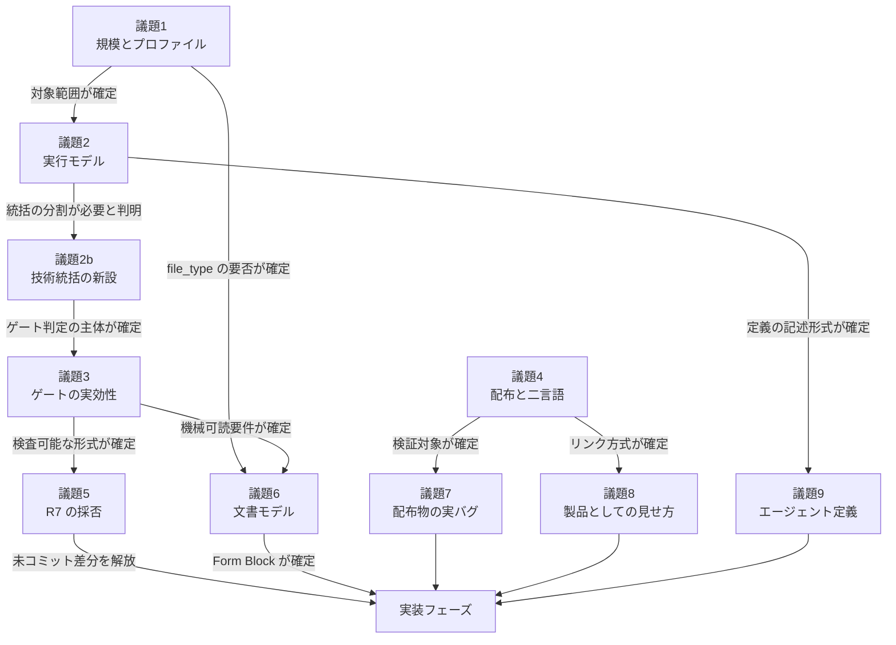

# 指摘の整理と判断順序

**目的:** 78 件の指摘をどう整理し、どの順序で判断したかを記録する。

---

## 1. 順序決定の原則

重大度順でも着手容易性順でもなく、**「これを先に決めないと他の判断が無駄になるか」** で並べた。

その結果、上位 2 議題は修正ではなく**方針の決定**になった。決定そのものは短時間で終わるが、答えによって下流の修正内容が変わる。

### 1.1 なぜ重大度順にしなかったか

重大度順に着手すると、以下が起きる。

- エージェント定義 30 箇所を直してから「エージェント数を減らす」判断が出れば、その修正は捨てになる
- 11 エージェントの「kotodama-kun に依頼する」を書き換えてから実行モデルが変われば、同じ箇所を二度直す
- ゲート条件を文章で整理してから機械検証に移行すれば、条件の表現形式を全部書き直すことになる

**手戻りの最小化を最優先した。**

### 1.2 議論の順序と実装の順序は別

本文書が定めるのは**議論の順序**である。実装の順序は別に決めてよく、実際に異なる（`04-work-plan.md` §1 参照）。

とくに以下は他のどの判断にも依存しないため、議論の完了を待たずに実装できる性質のものだった。

| 項目 | 指摘 | 規模 |
|---|---|---:|
| `.mcp.json` の削除 | P5 | 1 ファイル |
| `angs-essay-en.md` のフェンス削除 | F2 | 2 行 |
| `create.js` の LICENSE 削除 | D1 | 4 行 |
| README に examples へのリンク追加 | E1 | 5 行 |

---

## 2. 議題の依存関係

**議題の依存グラフ:**

**議題 4 は 1〜3 と独立している。** 並行して検討できる位置にある。

---

## 3. 議題一覧

| 順 | 議題 | 性質 | 影響件数 | 依存 |
|:-:|---|---|:-:|---|
| 1 | 規模とプロファイル | **方針決定** | 約 15 | なし |
| 2 | 実行モデル | **方針決定** | 約 12 | 議題 1 |
| 2b | 技術統括の新設 | 方針＋設計 | 約 8 | 議題 2 |
| 3 | ゲートの実効性 | 方針＋設計 | 約 12 | 議題 2b |
| 4 | 配布と二言語モデル | 方針＋設計 | 約 12 | **なし（並行可）** |
| 5 | R7 の採否と矛盾解消 | 設計 | 約 6 | 議題 3 |
| 6 | 文書モデルの整合 | 設計 | 26 | 議題 1, 3 |
| 7 | 配布物の実バグ | 実装のみ | 24 | 議題 3, 4 |
| 8 | 製品としての見せ方 | 実装のみ | 22 | 議題 4 |
| 9 | エージェント定義の個別修正 | 実装のみ | 約 20 | 議題 2, 2b, 5, 6, 8 |

**議題 2b は当初の計画になかった。** 議題 2 の検討中にユーザーから「orchestrator はプロジェクト管理専門にして、ソフトウェア開発統括を設けるのは？」という提案があり、独立した議題として切り出した。結果として 6 件以上の「無主責務」指摘が単一の原因に還元された（`03-decisions.md` §2b 参照）。

---

## 4. 各議題が扱った指摘

| 議題 | 扱った指摘 ID |
|:-:|---|
| 1 | A9, B14, C7, G4 |
| 2 | P3, A3（一部）, A7, B1（一部）, B7, B14, C10-a |
| 2b | B2, B5, A5, A6, A10, A1（判断主体の確定） |
| 3 | A1, A2, A4, A5, A6, A8, A10, B5, B6, C3, G2 |
| 4 | P1, P2, P2b, D3, D4, D5, D10, E5, F3, F4, F5, F6, F7 |
| 5 | P4, A11, A12, F1, C10-e |
| 6 | C1, C2, C3, C4, C5, C6, C7, C10, A9, A7（一部） |
| 7 | P5, D1, D2, D6, D7, D8, D9, D10, F2, F6 |
| 8 | E1〜E10, A3（再判定）, A7（再判定）, B11 |
| 9 | B1, B3, B4, B6, B8, B9, B10, B11, B12, B13, B15, F5 |
| 別テーマ | C8, C9, G3 |

---

## 5. 判断を仰いだ点と、自律的に決めた点

### 5.1 ユーザーの判断を仰いだ点（10 件）

| # | 議題 | 論点 | 理由 |
|:-:|:-:|---|---|
| 1 | 1 | 規模を維持するか縮小するか | 設計思想の根幹 |
| 2 | 2 | 統括主体をどこに置くか | 実行モデル全体を決める |
| 3 | 2b | 技術統括の責務範囲 | 3 案の比較を要請された |
| 4 | 2b | 新設エージェントの名称 | 命名は言霊 |
| 5 | 3 | 機械検証をどこまで入れるか | 配布物と移植性に影響 |
| 6 | 3 | `cannot-reproduce` の可否 | defect-taxonomy の理論と衝突 |
| 7 | 4 | 配布方式を構造変更するか | 最大の構造変更 |
| 8 | 5 | R7 の矛盾の直し方 | 思想の選択（`throw` の扱い） |
| 9 | 6 | 版管理の正本 / ANGS の扱い | 著者の構想に関わる |
| 10 | 7, 8 | リリース方針 / コスト開示 / README のトーン | 公開ポリシー |

### 5.2 自律的に決めた点

以下は明白または既決事項の適用であり、推奨案で決定した。

- 機械的な誤り（C5 の誤フィールド名、F2 のフェンス、D7 の URL 404）
- 既に決まった設計の反映（Form Block への項目追加、エージェント定義への配線）
- 実装不能な記述の置換（A3 の時間ベーストリガー → イベントベース）
- 既存規則との整合（C1 の enum 揃え、C10-c の表削除）

**判断が分かれうる箇所は必ず根拠を明示し、異論があれば実装前に修正できる形で記録した。**

---

## 6. 検討中に判明した「1 つの原因に還元される」群

個別の指摘として報告したものが、検討を通じて単一原因に還元された例が 3 つある。**これが順序を波及順にした最大の効用である。**

| 群 | 個別に報告した指摘 | 単一の原因 | 決着 |
|---|---|---|:-:|
| 無主責務 | B2（infra 無主）, B5（SCA/SAST 判定主体）, A5（重大度写像）, A6（threat-model）, A10（ルーティング）, A1（打ち切り判断者）, 横断的品質特性の欠落 | **技術統括の不在** | 議題 2b |
| 配布の歪み | P2（name 衝突）, F7（62 本の 404）, F5（検証スコープ誤り）, D3（言語残骸）, D4（存在しないコマンド）, D5（翻訳元誤り） | **原本を配布先と同じディレクトリに置く設計** | 議題 4 |
| 静かな不遵守 | P3（Task 未付与）, A3（実行不能な監視）, A2（到達不能な条件付きプロセス）, P4（未配線の R7）, G2（自己申告ゲート） | **実行不能な指示を LLM が黙って飛ばす** | 議題 2, 3 |

3 群目がとくに重要である。本レビューで最も広く分布した失敗モードであり、**この型を再生産しない設計を選ぶこと**が議題 2・3 の判断基準になった。
