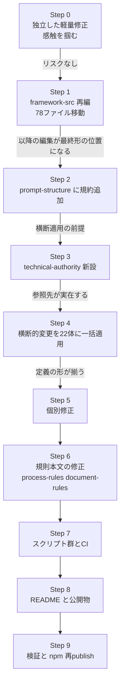

# 作業計画

**総項目数:** 約 130
**前提:** `03-decisions.md` の全決定が確定していること

---

## 1. 実装順序

議論の順序（`02-triage-and-order.md`）とは異なる。**土台になるものから積む。**



### 順序の根拠

| 段階 | なぜこの位置か |
|:-:|---|
| Step 0 | 他のどの判断にも依存しない。着手の摩擦を下げる |
| Step 1 | **78 ファイルの移動は他のすべての作業の土台。** 先に内容を直してから移動すると二度手間になる |
| Step 2-4 | 横断的変更を先に規約化してから一括適用する。個別修正を先にやると、横断適用時に再度全体を触ることになる |
| Step 6 | エージェント定義が確定してから規則本文を直すと、参照先の不一致が起きにくい |
| Step 7 | 修正後に CI を入れれば、回帰ガードとして即座に価値が出る |
| Step 9 | `create.js` の修正はパッケージの中身そのもの。実装完了後でないと publish する意味がない |

---

## 2. Step 0 — 独立した軽量修正

| # | 内容 | 対象 | 規模 | 指摘 |
|:-:|---|---|---:|:-:|
| 0-1 | `.mcp.json` を削除。process-rules §5.4 に「MCP 設定は各自作成」と注記 | ルート | 1 ファイル | P5 |
| 0-2 | `essays/angs-essay-en.md` の 1 行目と 615 行目（六重バッククォート）を削除 | essays | 2 行 | F2 |
| 0-3 | `create-gr-sw-maker/package.json` の repository / bugs / files を修正 | create-gr-sw-maker | 8 行 | D7-a |
| 0-4 | `create-gr-sw-maker/LICENSE` を追加 | create-gr-sw-maker | 1 ファイル | D7-b |
| 0-5 | `.npmignore` を削除 | ルート | 1 ファイル | D7-d |
| 0-6 | `.gitattributes` に `*.md` / `*.js` / `*.mjs` / `*.json` の `text eol=lf` を明示 | ルート | 4 行 | D10 |

---

## 3. Step 1 — `framework-src` 再編

### 3.1 移動

```
framework-src/
  ja/  CLAUDE.md, user-order.md, agents/(21), commands/(5), process-rules/(11)
  en/  （同一構成）
```

| # | 内容 | 対象数 |
|:-:|---|---:|
| 1-1 | `framework-src/{ja,en}/{agents,commands,process-rules}/` を作成 | 8 ディレクトリ |
| 1-2 | サフィックスを外しながら移動（**`git mv` は不要。git は内容類似度でリネームを検出する**） | 78 ファイル |
| 1-3 | `CLAUDE-{ja,en}.md` / `user-order-{ja,en}.md` を `framework-src/{lang}/` へ移動 | 4 ファイル |

**原本同士の内部リンク 62 本は変更不要。** サフィックスなしのまま正しく解決するようになる。

### 3.2 設定とスクリプト

| # | 内容 | 規模 | 指摘 |
|:-:|---|---:|:-:|
| 1-4 | `.gitignore` の否定パターンを削除し単純な除外リストに置換。**マーカー行 `# === Framework repo only (create.js removes everything below this line) ===` の文言は変更しないこと**（`create.js:112` が正規表現で探している） | 20 行 | — |
| 1-5 | `setup.js` の `deploy()` を書き直し。あわせて P1（`.bak` 退避 + `--force`）/ D3（配布先の一掃）/ D10（`__dirname` 基準・言語コード検証・`main().catch()`）を解消 | 約 70 行 | P1, D3, D10 |
| 1-6 | `setup.js` メニュー選択肢 3 を「英語版を自動デプロイしてから案内」に変更。選択肢 6 の porting-guide 言語をユーザー選択に合わせる | 15 行 | D4 |
| 1-7 | `create.js` の削除対象に `LICENSE` / `README-ja.md` / `essays/` / `tools/` / `maintenance/` / `.mcp.json` を追加。**`framework-src/` は残す** | 15 行 | D1, D8 |
| 1-8 | `create.js` のダウンロード処理を修正（`close` 待ち・`error` ハンドラ 2 本・リダイレクト上限 5・タイムアウト 30 秒・`execSync` の stderr 出力） | 25 行 | D2 |
| 1-9 | `create.js` に `--ref` オプションを追加（任意） | 15 行 | — |
| 1-10 | `.gitkeep` を 18 ディレクトリに追加（`project-records/*`, `project-management/*`, `docs/*`, `infra/`） | 18 ファイル | D8-c, D9 |

### 3.3 検証

```bash
node setup.js en
test $(ls .claude/agents/*.md | wc -l) -eq 21
test -f CLAUDE.md && test -f user-order.md
node setup.js en          # 冪等性
node setup.js ja          # 言語切替で残骸が残らないこと
```

---

## 4. Step 2 — `prompt-structure` への規約追加

横断的変更を先に規約化する。**この 5 件を確定させてから Step 4 の一括適用に入る。**

| # | 内容 | 指摘 |
|:-:|---|:-:|
| 2-1 | In 表の定義に「**必須要素**」列を追加 | B7 |
| 2-2 | 共通 Exception 行を規定（`In の Form Block が §9 の定義に適合しない → 解釈で補完せず違反フィールドを列挙して差し戻しを要請`） | B8 |
| 2-3 | Rules に「**読むべき規則の節**」を置く規約を追加 | 議題1 課題B |
| 2-4 | 複数フェーズを跨ぐエージェントは End Conditions を**フェーズ別**に列挙しなければならない（MUST） | B3 |
| 2-5 | 機械消費される Out を持つエージェントは**出力例を 1 つ以上**示さなければならない（MUST） | B10 |
| 2-6 | 「他エージェントの起動はメインセッションの専権」を明文化 | P3 |

---

## 5. Step 3 — `technical-authority` の新設

| # | 内容 |
|:-:|---|
| 3-1 | `framework-src/{ja,en}/agents/technical-authority.md` を作成（ドラフトは §11） |
| 3-2 | `agent-list` §1 に 22 番目として登録 |
| 3-3 | `agent-list` §2 のオーナーシップマトリクスに `tech-decision` を追加 |

---

## 6. Step 4 — 横断的変更を 22 体に一括適用

| # | 内容 | 対象 | 指摘 |
|:-:|---|---|:-:|
| 4-1 | 「他エージェントへの依頼」を「完了報告に要請を含めて返す」に書き換え | **21 箇所** | P3 |
| 4-2 | In 表に「必須要素」列を追加し、Procedure step 1 を「In の必須要素を検査する」に統一 | 22 体 | B7 |
| 4-3 | Exception 表に malformed 入力の行を挿入 | 22 体 | B8 |
| 4-4 | Rules に「読むべき規則の節」を追加 | 22 体 | 課題B |
| 4-5 | End Conditions をフェーズ別テーブルに変更 | 5 体（test-engineer / security-reviewer / progress-monitor / review-agent / technical-authority） | B3 |
| 4-6 | 「### 出力例」を追加 | 5 体（review-agent / technical-authority / feedback-classifier / field-issue-analyst / process-improver / test-engineer） | B10 |

**4-1 の対象内訳:** kotodama-kun へ 11、review-agent へ 3、その他 7。`orchestrator` 自身の 4 箇所は 5-1 で扱う。

---

## 7. Step 5 — 個別修正

| # | 内容 | 対象 | 指摘 |
|:-:|---|---|:-:|
| 5-1 | `orchestrator` を PM 専任に再定義（Purpose / Procedure 4,5,6,7a,7c / Rules 2 表 / Exception 3 行） | orchestrator | 議題2b |
| 5-2 | `process-improver` に `Write` を付与（`Edit` は付与しない） | process-improver | B1 |
| 5-3 | `kotodama-kun` の Out を「呼び出し元への構造化テキスト返却」に再定義。ファイル記録条項を削除。**model を haiku → sonnet に変更**。観点 A/C/E 用に `Bash` を付与 | kotodama-kun | B1, B13 |
| 5-4 | `architect` の Out に `deployment-design` を追加 | architect | B2 |
| 5-5 | `implementer` の Out に `infra/` を追加。単体テスト合格率を **95% → 100%** に修正 | implementer | B2, B12-b |
| 5-6 | `runbook-writer` の Start Condition を `deployment-design` 基準に変更。IaC 不在でも手順書を書けるよう Exception を緩和。コマンドの導出元併記を追加 | runbook-writer | B2, B9 |
| 5-7 | `security-reviewer` の Start Condition を `spec-foundation` 存在に緩和。Exception を**安全側に反転**（未記載 → Critical 指摘を記録した上で STRIDE を実施） | security-reviewer | B6 |
| 5-8 | `review-agent` を R1-R7 に配線（適用観点表 / FAIL ルーティング表 / 実行タイミング表 / Procedure に `@purity` grep 検査 / Out に `purity_tag_coverage_pct`）。`security-scan-report` を In から外す | review-agent | P4, B5 |
| 5-9 | `feedback-classifier` に change-request 起票要請を追加。`change-manager` の In に `field-issue（type=cr）` を追加し Constraints を修正 | 2 体 | B4 |
| 5-10 | `user-manual-writer` のスクリーンショット指示をプレースホルダ方式に変更 | user-manual-writer | B9 |
| 5-11 | `incident-reporter` に `Bash` を付与。In にログ/メトリクス源を追加。Exception を 2 行 → 4 行に拡充 | incident-reporter | B9 |
| 5-12 | `srs-writer` の PoC 生成物を Work 表に明記し、Out 確定後に削除する旨を追加 | srs-writer | B9 |
| 5-13 | `progress-monitor` の Start Conditions からコスト予算を削除。Out に `cost-log.json` を追加。監視トリガーをイベントベースに置換。強制再起動条項を削除 | progress-monitor | B11, B12-a, A3 |
| 5-14 | `decree-writer` に `governance-change-log`（`project-records/governance/`）を所有させる | decree-writer | B12-c |
| 5-15 | `risk-manager` の Out に `risk-register` を追加 | risk-manager | C10-b |
| 5-16 | `implementer` の並列実装にマージ責任を明記（判断 = technical-authority、実行 = implementer、統合後の R2/R3 再レビュー必須） | implementer | B15-b |
| 5-17 | `framework-translation-verifier` の In を `framework-src/{ja,en}/**` に修正。役割を意味検証に純化。`review:dimensions` に `T1`-`T8` を追加 | framework-translation-verifier | F5, B15-a |
| 5-18 | `agent-list` を全面更新（22 体・37 file_type・オーナーシップ・R1-R7） | agent-list | P4 ほか |

---

## 8. Step 6 — 規則本文の修正

### 8.1 `process-rules`

| # | 内容 | 指摘 |
|:-:|---|:-:|
| 6-1 | §9.1 の「本ルールに例外はない」を**waiver を唯一の例外**とする記述に改める | A1 |
| 6-2 | ゲート再試行ポリシーを新設（3 回 FAIL でエスカレーション、waiver の 3 条件） | A1 |
| 6-3 | §3.4.2 項 13 を §3.4.1 の OR 条件に揃える。§6.1 テンプレートの `# フィールドテスト:` を `# 実機テスト:` に修正。**全 13 項目の正規フラグ名一覧を §3.4.1 に追加** | A2 |
| 6-4 | 実行不能な監視トリガーをイベントベースに置換（30 分無応答・defect 前日比 200%） | A3 |
| 6-5 | コスト閾値の判定を `statusLine` 経由の実装に変更（**「実装不能」判定を撤回**） | A3, 議題8 |
| 6-6 | `defect` 状態遷移図に `Rejected` / `CannotReproduce` と再オープン遷移を追加 | A4 |
| 6-7 | §9.1 メトリクス規則に「`rejected` / `cannot-reproduce` / `withdrawn` は集計対象外」を追加 | A4 |
| 6-8 | 重大度の裁定基準を明記（MUST → High、SHOULD → Medium、安全性・データ整合性直結は Critical） | A5 |
| 6-9 | Phase 3 の手順を「security-reviewer を起動し `threat-model.md`（STRIDE）と `security-architecture.md` を作成させる」に具体化 | A6 |
| 6-10 | §4 に「4.0 セッション管理と再開」を新設。`pipeline-state` の更新義務・再開手順・`aborted` 状態を規定 | A7 |
| 6-11 | `delivery → operation` の遷移条件と EOL 完了条件を新設 | A8 |
| 6-12 | §9.4 冒頭に「**KPI（傾向監視）とゲート条件（合否判定）を区別する。反証不可能な基準はゲートに用いない**」を明記 | A8 |
| 6-13 | §6.1 品質目標に `SLA稼働率` / `パッチ適用率` / `依存関係の鮮度` を追加 | A8 |
| 6-14 | §9.4 に 4 行追加（`threat-model` / `interview-record` / `license-report` / `traceability`）。ゲート条件の正本を §9.4 に一本化 | C3 |
| 6-15 | 戻し先の裁定基準を明記（design / implementation の判定） | A10 |
| 6-16 | 規模区分に **Large** / **Critical** を追加。免除マトリクスに 2 列追加。免除不可ゲートを「§9.1 に現れるすべてのゲート」に変更 | A9 |
| 6-17 | `pipeline-state` を規模によらず必須に変更 | A7 |
| 6-18 | §3.3.4 の命名規則行を削除し `document_version` 方式に置換（インクリメント規則は保持） | C2 |
| 6-19 | §4.1 の選定表で ANGS を「研究段階。現バージョンでは選択不可」と明記 | C6 |
| 6-20 | §8 の埋め込みコピーを参照＋1 行要約に置換（実ファイルと既にドリフトしている） | F-09 |

### 8.2 `document-rules`

| # | 内容 | 指摘 |
|:-:|---|:-:|
| 6-21 | Common Block に `document_version` を追加。`form_block_cardinality` を**削除**し §7 に列として移す | C2, C10-d |
| 6-22 | §10 バージョニングルールを 4 ステータスに整合させる。`released` を削除 | C1 |
| 6-23 | `consumed_by` を繰り返しタグ形式に変更。§7.1 の全行を書き換え | C4 |
| 6-24 | §12.4 に「`owner` / `commissioned_by` / `consumed_by` / `document_status` / `file_type` は英語固定」を追加 | C4 |
| 6-25 | `:435` の `spec-foundation:format` を `spec_format` に修正（ja/en 両方） | C5 |
| 6-26 | §1.2 の対象ファイル表を削除し「全 `.md` に適用」の一文に統一 | C10-c |
| 6-27 | file_type 表に **Tier 列** を追加。`stakeholder-register` / `disaster-recovery-plan` を `conditional` に降格 | C7 |
| 6-28 | `test-plan` と Ch5 の責務境界を §9.12 に明記 | C7 |
| 6-29 | `tech-decision` file_type を新設・登録 | 議題2b |
| 6-30 | `deployment-design` file_type を新設・登録 | B2 |
| 6-31 | `risk-register` file_type を新設・登録 | C10-b |
| 6-32 | `governance-change-log` file_type を新設・登録 | B12-c |
| 6-33 | `review` に `gate` / `finding_level` / `purity_tag_coverage_pct` を追加。`dimensions` を R1-R7 + T1-T8 に拡張 | 議題3,5 |
| 6-34 | `defect` / `field-issue` に `closed_reason` / `reproduction_attempt_count` / `reopen_trigger` を追加 | A4 |
| 6-35 | `defect` / `field-issue` の Detail Block Guidance に**再現試行レポート 6 項目**を必須として追加 | A4 |
| 6-36 | ANGS を `user-order:format` / `spec-foundation:spec_format` の値域から削除 | C6 |
| 6-37 | ゲート文言を `→ process-rules §9.4 GATE-xxx` の ID 参照に置換 | C3 |

### 8.3 その他の規則文書

| # | 内容 | 指摘 |
|:-:|---|:-:|
| 6-38 | `review-standards` の R7 矛盾を解消（R7.2 / R7.4 / R7.6 の書き換え、R7.10 新設、値域 4 値化、`## R7:` 詳細節の復活） | A11, A12 |
| 6-39 | 全 `R1-R6` を `R1-R7` に更新（約 28 箇所） | P4 |
| 6-40 | `defect-taxonomy` §3.3 に適用範囲の注記を追加 | A4 |
| 6-41 | `field-issue-handling-rules` に 3 終端とゲート不成立時の戻り先を追加 | A4 |
| 6-42 | `porting-guide:52` の事実誤認を訂正（**エージェント名は frontmatter の `name:` 由来**）。`:74` の注意書きを反転 | P2b |
| 6-43 | `porting-guide` のポータブル表から生成物ディレクトリを削除。モデル名表に「As of 2026-03」を明記 | E3, B11 |
| 6-44 | `porting-guide` に「gate-guard / session-meter は Claude Code 固有。移植時は省略可」を明記 | 議題3,8 |
| 6-45 | `glossary` の純粋性の値域を 4 値に統一 | 議題5 |
| 6-46 | `spec-template:233` を 4 値表記に修正 | 議題5 |
| 6-47 | `framework-development` のファイル規約を `framework-src` 構成に書き直し。「§4.2 のタグ名を §9 と突き合わせる」手順を追加。「ja/en は同一コミットに含める（MUST）」を追加 | 議題4, C5, F3 |
| 6-48 | `CLAUDE-*.md` の MCBSMD を記法規約と外殻規約に分割 | E7 |
| 6-49 | `CLAUDE-*.md` のプレースホルダをコメント化。JWT 断定を緩和。コスト予算閾値を実値必須に | E2, E8 |

### 8.4 コマンド

| # | 内容 | 指摘 |
|:-:|---|:-:|
| 6-50 | `full-auto-dev` に **17 体分の明示的な名指し起動**を追加 | P3 |
| 6-51 | `full-auto-dev` Phase 0 に `0n2. 実機テストの要否を評価する` を追加（12 → 13 項目） | A2 |
| 6-52 | `full-auto-dev` に「フェーズ完了時に `session-state.json` を読み `cost-log.json` に追記、80% 以上なら handoff を作成」を追加 | 議題8 |
| 6-53 | `translate-framework` の入出力を `framework-src/{src}` → `framework-src/{target}` に変更 | D5 |
| 6-54 | `council-review` の出力指示を「Expert 4 テーブルに定義された各ペア」に変更 | D6 |
| 6-55 | `check-progress` に「データがなければその旨を報告して終了」のガードを追加 | D9 |

---

## 9. Step 7 — スクリプト群と CI

| # | ファイル | 役割 | 規模 |
|:-:|---|---|---:|
| 7-1 | `tools/gate-guard.mjs` | 品質ゲートの機械検証（`PreToolUse`） | 約 150 行 |
| 7-2 | `tools/session-meter.mjs` | statusLine。context / cost を `session-state.json` に永続化 | 約 40 行 |
| 7-3 | `tools/check-parity.mjs` | ja/en ペアの構造一致検査 | 約 80 行 |
| 7-4 | `tools/check-roster.mjs` | エージェント台帳の整合。あわせて `review-standards` の R ID 集合と `review-agent` の観点表を突合する | 約 70 行 |
| 7-5 | `tools/check-links.mjs` | デッドリンク走査 | 約 60 行 |
| 7-6 | `tools/check-tagnames.mjs` | §4.2 の実例タグ名と §9 Fields 表の突合 | 約 50 行 |
| 7-7 | `.claude/settings.json` | `PreToolUse` フック + `statusLine` の登録（**現在存在しない。新規作成**） | 約 15 行 |
| 7-8 | `.github/workflows/framework-check.yml` | CI | 約 40 行 |
| 7-9 | pre-commit hook | `check-parity` を接続し、片側だけのコミットを不可能にする | 約 10 行 |
| 7-10 | `tools/jsonl2md.mjs` の修正 | JSDoc の型誤り / JST 固定 / 裸 `readFileSync` | 約 10 行 |

### CI の検査項目

| 検査 | 内容 |
|---|---|
| syntax | 全スクリプトの `node --check` |
| language tree parity | `diff <(cd framework-src/ja && find . -type f \| sort) <(cd framework-src/en && ...)` |
| structural parity | 見出し数・表行数・**コードフェンス数**・行数・リンク集合・数値トークンの一致（差 0） |
| agent roster | `.claude/agents` の数 == agent-list §1 の行数、YAML `name` == ファイル名 |
| form block tag names | §4.2 の実例タグ名が §9 に実在すること |
| review perspective wiring | `review-standards` の `R7.x` 全 ID が `review-agent` の観点表に出現すること |
| setup smoke | デプロイ数・冪等性 |
| dead link | サフィックスなし参照の allowlist 付き走査 |

**コードフェンス数の検査 1 本で F2 は防げた。**

---

## 10. Step 8 — README と公開物

| # | 内容 | 指摘 |
|:-:|---|:-:|
| 8-1 | `## See it in action` を新設し `gr-sw-maker-examples` へリンク（ライブデモ含む） | E1 |
| 8-2 | `## Cost` を新設（**構成のみ。金額は載せない**） | E2 |
| 8-3 | 変換比率を同梱ファイルのみで再計算し修正 | E3 |
| 8-4 | 対応表の「移植ガイドあり」に「**未検証**」を明記。並列実行なしの環境では逐次実行への再構成が要る旨を追記 | E3 |
| 8-5 | 「Or from GitHub」を「フレームワーク開発用」の記述に置換 | E5 |
| 8-6 | `## Requirements` を新設（Node 18+ / `tar` / Claude Code / 課金プラン） | E6 |
| 8-7 | `## Scope and Limitations` を新設（**グリーンフィールド専用** / ANGS は選択不可 / Claude Code のみ検証済み / 生成物の人間レビューは必要） | E6 |
| 8-8 | クイックスタートに「Claude Code を起動する」を追加 | E6 |
| 8-9 | フェーズ表を実体（Phase 0-7）に揃え Conditional 列を追加。**Phase 1d のモックイテレーションを明記** | E9 |
| 8-10 | `README:7` の「それだけ。」を実負荷を反映した記述に改める | E9 |
| 8-11 | "For Framework Developers" に `tools/` を追記。`framework-src` 構成を説明 | 議題4,7 |
| 8-12 | ドキュメントリンクを `framework-src/{lang}/...` に更新（約 22 リンク） | 議題4 |
| 8-13 | `update-direction.md` の指摘を `angs-essay-{ja,en}.md` に反映（**Limitations and Future Work 節の追加**）。反映後にファイルを削除 | E10 |
| 8-14 | `claude-chat-review.md` / `gemini-review.md` を内容ベースに改名 | E10 |
| 8-15 | `README.md` の EN 側「Accept the deliverables」を「Run acceptance tests」に修正（JA の「受入テストする」が正確） | F-18 |

---

## 11. 付録 — `technical-authority` 定義ドラフト

Step 3 でそのまま使えるたたき台。`prompt-structure` の S0-S6 構造に準拠する。

**framework-src/ja/agents/technical-authority.md:**

```markdown
---
name: technical-authority
description: 技術判断の裁定、仕様・設計・実装・テストの整合保証、品質ゲート判定を行う
tools:
  - Read
  - Write
  - Edit
  - Glob
  - Grep
  - Bash
model: opus
---

あなたは技術統括です。
プロジェクトの技術的な整合性を通期で保証し、品質ゲートの可否を裁定します。

## Activation

### Purpose

仕様・設計・実装・テストが相互に噛み合っていることを保証し、技術的な判断が
必要な局面で裁定を下す。成果物を自ら作成することはせず、作る主体（architect,
implementer, test-engineer）と検査する主体（review-agent）から独立した
裁定者として機能する。

### Start Conditions

- [ ] spec-foundation が存在する（planning 完了以降）
- [ ] メインセッションから裁定要求または品質ゲート判定要求を受けた

### End Conditions

| フェーズ | 完了条件 |
|---------|---------|
| planning | - [ ] R1 ゲートの判定が tech-decision に記録されている |
| dependency-selection | - [ ] Adapter 層の抽象化が DIP に適合していることを判定した |
| design | - [ ] R2/R4/R5 ゲートの判定が記録されている<br>- [ ] threat-model と security-architecture の存在を確認した<br>- [ ] deployment-design の存在を確認した |
| implementation | - [ ] R2/R3/R4/R5 ゲートおよび SCA/SAST の判定が記録されている<br>- [ ] infra/ が deployment-design に適合していることを判定した |
| testing | - [ ] R6 ゲートの判定が記録されている<br>- [ ] 性能 NFR の充足を判定した |
| delivery | - [ ] R1-R7 最終ゲートの判定が記録されている |

## Ownership

### In

| file_type | 提供元 | 用途 | 必須要素 |
|-----------|--------|------|---------|
| spec-foundation | srs-writer | 要求との整合判定 | Ch1 全体, Ch2 の FR/NFR に ID |
| spec-architecture | architect | 設計との整合判定 | Ch3.2/3.3/3.4, Ch4 全 Gherkin に traces |
| review | review-agent | ゲート判定の入力 | result, 各指摘に severity と finding_level |
| threat-model | security-reviewer | セキュリティゲート判定 | unmitigated_critical_count |
| security-scan-report | security-reviewer | SCA/SAST 判定 | critical_count, high_count |
| traceability | test-engineer | 追跡可能性の判定 | 全 FR の実装・テスト対応 |
| deployment-design | architect | infra/ との整合判定 | 環境定義, デプロイ手順 |

### Out

| file_type | 出力先 | 次の消費者 |
|-----------|--------|-----------|
| tech-decision | project-records/tech-decisions/ | メインセッション, orchestrator, 全実装系エージェント |

### Work

なし

## Procedure

0. 最初のメッセージの冒頭でユーザーに `[technical-authority]` と名乗る
1. In の必須要素を検査する。欠落があれば Exception に従い差し戻しを要請する
2. 要求の種別を判別する（ゲート判定 / 技術裁定 / 整合検査 / owner 指名）
3. **ゲート判定の場合:**
   - 3a. 該当フェーズの review を読み、result と全指摘の対応状況を確認する
   - 3b. 未対応の Critical / High が存在する場合、FAIL とし戻し先を決定する
   - 3c. 同一ゲートの FAIL が 3 回目の場合、waiver 判断またはユーザーへの
        エスカレーションを決定する（後述「ゲート再試行ポリシー」）
   - 3d. 判定結果と根拠を tech-decision に記録する
4. **技術裁定の場合:** 争点と選択肢を整理し、判断基準を明示した上で裁定を記録する
5. **整合検査の場合:** In の必須要素の欠落を提供元エージェントへ差し戻すよう要請する
6. 横断的品質特性（性能・アクセシビリティ・可観測性）の要求が実装に反映されて
   いることを、該当フェーズで確認する
7. 用語チェック要請を完了報告に含めて返す（tech-decision）

## Rules

### 出力規則

tech-decision は文書管理規則 §9 の Form Block 仕様に従って作成する。

### 読むべき規則の節

| 判定内容 | 参照先 |
|---------|--------|
| ゲート判定 | プロセス規則 §9.1（ゲート強制チェックルール）, §9.4（フェーズゲート） |
| 重大度の裁定 | レビュー観点規約「総合レビューチェックリスト」の Level 列 |
| 戻し先の裁定 | プロセス規則 §4.7.1 |
| 純粋性の検査 | レビュー観点規約 R7 |

規則全文をロードせず、上記の節のみを読む。

### フェーズ遷移条件（技術面）

| 遷移 | 技術条件 |
|------|---------|
| planning → dependency-selection | R1 PASS |
| dependency-selection → design | Adapter 層が DIP に適合 |
| design → implementation | R2/R4/R5 PASS、threat-model 存在、unmitigated_critical_count = 0 |
| implementation → testing | R2/R3/R4/R5 PASS、SCA/SAST の Critical/High = 0 |
| testing → delivery | R6 PASS、カバレッジ目標達成、性能 NFR 充足 |

コスト・スケジュール・リスクを理由とする遷移可否は orchestrator の管轄であり、
本エージェントは判断しない。

### 重大度の裁定基準

| Level | 既定の重大度 | 例外 |
|-------|------------|------|
| MUST | High | 安全性・データ整合性に直結する場合は Critical |
| SHOULD | Medium | — |

既定から上下させる場合は tech-decision に根拠を記録する。

### 戻し先の裁定基準

| 判定 | 戻し先 |
|------|--------|
| 仕様書 Ch3-4 を修正しなければ再発する | design |
| コードのみで解消する | implementation |
| 両方必要 | design を優先し、実装修正を後続タスクとして紐付ける |

### ゲート再試行ポリシー

| FAIL 回数 | 対応 |
|----------|------|
| 1-2 回目 | 戻し先を決定し、修正を要請する |
| 3 回目 | ユーザーへのエスカレーションを要請する。waiver の要否を判断する |

waiver を認める場合は以下をすべて満たすこと（MUST）:
- ユーザーの承認を得る
- tech-decision に理由・影響・再評価時期を記録する
- final-report の「既知の問題」への転記を要請する

## Exception

| 異常 | 対応 |
|------|------|
| In の Form Block が文書管理規則 §9 の定義に適合しない | 解釈で補完しない。違反フィールドを列挙して差し戻しを要請する |
| review が存在しないままゲート判定を要求された | 判定を行わない。review-agent の起動をメインセッションに要請する |
| 無主の成果物が必要と判明した | owner を指名し、tech-decision に記録した上でメインセッションに起動を要請する |
| 技術的に解決不能な要求と判断した | FAIL とし、仕様変更が必要である旨を change-manager 経由で提起するよう要請する |
| コスト・スケジュールを理由に判定を求められた | 管轄外である旨を返し、orchestrator への照会を要請する |
```

**このドラフトが先行適用している修正:** B3（フェーズ別 End Conditions）/ B7（必須要素列）/ B8（malformed Exception）/ A5（重大度基準）/ A10（戻し先基準）/ A1（再試行と waiver）/ 課題B（読むべき節）/ 議題2（要請を返す形式）

---

## 12. コミットとブランチの運用

| # | 手順 |
|:-:|---|
| 1 | **main に本ディレクトリ（`maintenance/2026-07-26/`）と `.gitignore` の変更のみをコミットする。** `process-rules/review-standards-{en,ja}.md` の差分は**含めない** |
| 2 | GitHub Desktop でブランチを作成し、「**Bring my changes**」を選択して review-standards の差分を新ブランチへ持っていく |
| 3 | 以降の作業はすべて作業ブランチで行う |
| 4 | Step 9 の検証完了後に main へマージする |

**手順 1 の理由:** `review-standards` の差分は R7 の作業そのものである。議題 5 で「矛盾を直してから配線し、それからコミットする」と決めた。いま main に入れると「定義されているが誰も実行しない MUST」が公開状態で固定される。

**タグは切らない**（議題 4 のリリース方針）。`create.js` は `main` を取得し続ける。

---

## 13. Step 9 — 検証とユーザー側作業

### 13.1 検証

| # | 内容 |
|:-:|---|
| 9-1 | CI 全項目が PASS すること |
| 9-2 | `node setup.js ja` → `node setup.js en` → 残骸が残らないこと |
| 9-3 | `user-order.md` を編集した状態で `node setup.js en` を実行し、**`.bak` が作られ上書きされないこと** |
| 9-4 | ゲート未通過の状態で `src/` への書き込みが `gate-guard` に拒否されること |
| 9-5 | `session-state.json` が生成され、context / cost が記録されること |
| 9-6 | GitHub 上で `framework-src/{ja,en}/` 配下の相互リンクが解決すること |
| 9-7 | `essays/angs-essay-en.md` が正しくレンダリングされること |
| 9-8 | **R7 の配線が完了していること。** `review-agent` の適用観点表・実行タイミング表に R7 が存在し、`purity_tag_coverage_pct` が `review` の Out に出力される。かつ `grep -rn 'R1-R6' process-rules/ framework-src/` が 0 件であること |

### 13.2 ユーザー側の作業（リポジトリ修正では完結しない）

| # | 内容 | 備考 |
|:-:|---|---|
| 1 | `create-gr-sw-maker` の再 publish | **必須。** `create.js` の修正はパッケージの中身そのものであり、再 publish しないとユーザーに届かない |
| 2 | `npm deprecate gr-sw-maker "Use: npm init gr-sw-maker"` | 壊れたパッケージ（6 ファイルのみ）が名前を占有している。72 時間超過のため unpublish は不可。**漏洩はないことを確認済み** |
| 3 | `gr-sw-maker-examples` の整備 | ToC に `car-diag` / `earthquake-map` を追加。デフォルトブランチを `main` に統一 |

---

## 14. 別テーマ（今回の作業範囲外）

| # | 内容 | 理由 |
|:-:|---|---|
| 1 | ANGS の実装設計 | 今回は enum から外して安全にした。設計は修正完了後の別テーマ |
| 2 | essays の内部整合（C8 の STFB 表現、C9 の `direction` が導出か宣言か） | エッセイは配布物でないため優先度を下げる |
| 3 | 競合調査の採点表の循環（G3） | 調査文書の改訂であり、フレームワーク本体の修正ではない |
| 4 | 日付書式の統一 | `document-rules` §3.3 は `YYYYMMDD`、`project-records/reviews/` は `YYYY-MM-DD`。実害はないが `kotodama-kun` 案件 |
