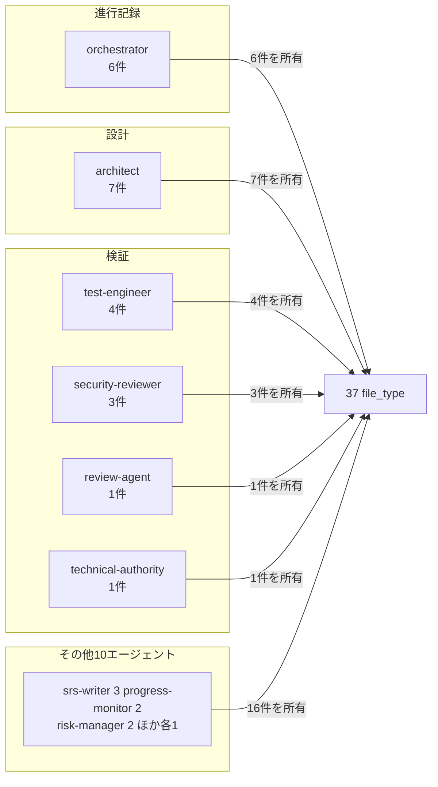
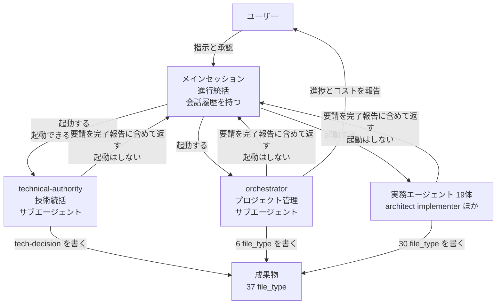
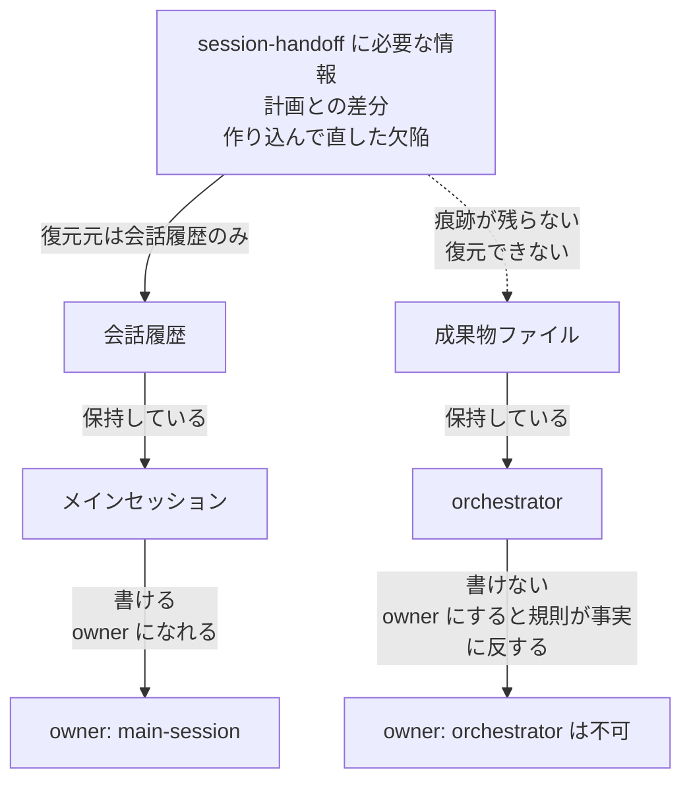

# owner と orchestrator の関係、および統括3主体

**目的:** 文書管理規則 §11 の `owner` が何を指すのか、それが orchestrator とどう違うのかを確定する。`session-handoff` の owner を決めるための前提整理。

**出所:** `framework-src/ja/process-rules/full-auto-dev-document-rules.md` §11、`prompt-structure.md` §1・§3.4、`agents/orchestrator.md`、`maintenance/2026-07-26/03-decisions.md` 議題2・議題2b。本文書の数値はすべて実測値であり、推定を含まない。

---

## 1. 結論

**owner と orchestrator は別の軸である。混同されやすいが交わらない。**

| 軸 | 問い | 答えを持つ規則 |
|---|---|---|
| オーナーシップ軸 | このファイルを**書き換えてよいのは誰か** | 文書管理規則 §11 |
| 実行軸 | このエージェントを**起動するのは誰か** | プロンプト構造規約 §1 設計原則6 |
| 統括軸 | 何をいつ動かすかを**決めるのは誰か** | 03-decisions 議題2 / 議題2b |

`orchestrator` はエージェントの名前であって、オーナーシップ軸における特権的な地位ではない。**orchestrator は 37 file_type のうち 6 個の owner にすぎない。**

---

## 2. owner とは何か

§11 の定義はこう書かれている。

> 各ファイルにはただ1つの `owner` エージェントが存在する。オーナーのみがCommon BlockとForm Blockのフィールドを変更できる。

つまり owner は **「そのファイルの構造化フィールドを書き換える権限を持つ唯一の主体」** である。「そのファイルの内容に責任を持つ主体」でも「そのファイルを読める主体」でもない。読むのは誰でもよい。Detail Block への追記も §11 の例外規定で誰でもできる（change_log に記録すれば MAY）。

**owner が単一である理由:** 同じフィールドを2主体が書くと、どちらの値が正なのか追えなくなる。SSOT を file_type 単位で成立させるための制約である。

---

## 3. orchestrator は何の owner か

**owner ごとの file_type 保有数（実測）:**

```text
architect            7
orchestrator         6
test-engineer        4
srs-writer           3
security-reviewer    3
progress-monitor     2
risk-manager         2
change-manager       1
decree-writer        1
field-test-engineer  1
incident-reporter    1
license-checker      1
process-improver     1
review-agent         1
runbook-writer       1
technical-authority  1
user-manual-writer   1
---------------------------
合計                37
```

`framework-src/ja/process-rules/full-auto-dev-document-rules.md` の §11 表を集計した結果である。§7 のマスターテーブル 37 件と過不足なく一致する（差分 0）。

orchestrator が owner である 6 件は `pipeline-state` / `executive-dashboard` / `final-report` / `decision` / `stakeholder-register` / `handoff` であり、いずれも**プロジェクト進行の記録**である。設計文書もコードもテストも持っていない。

**オーナーシップの分布:**



orchestrator が「全体を回す人」であることと、orchestrator が「全ファイルの owner」であることは別である。後者は成立していないし、成立させてはならない。設計文書を書き換えられるのは architect でなければ、設計の正が2箇所に分かれる。

---

## 4. 統括3主体

2026-07-26 の議題2・議題2b で、従来 orchestrator 1体が担っていた統括を3主体に分割した。

| 主体 | 立場 | 決めること | 会話履歴 |
|---|---|---|:---:|
| メインセッション | 進行統括 | 何をいつ動かすか。ユーザーとの対話 | **持つ** |
| technical-authority | 技術統括 | 技術裁定・品質ゲートの可否・FAIL の戻し先 | 持たない |
| orchestrator | プロジェクト管理 | コスト・スケジュール・リスクを理由とする進行可否 | 持たない |

**分割の理由は「記憶が要る統括と要らない統括があるから」である。** サブエージェントは会話履歴を持たない。技術裁定は成果物の現物から再構築でき、むしろ新鮮な目で読むほうがよい。PM 情報もファイルから再構築できる。しかし「3日前にユーザーがこう言った」はファイルに残っていなければ再構築できない。

**統括3主体と起動関係:**



矢印の向きが重要である。**サブエージェントから出る矢印は「返す」であって「起動する」ではない。** プロンプト構造規約 §1 設計原則6 がこれを定めている。理由は §3.4 に書かれているとおり、サブエージェントは他のサブエージェントを起動できず、「起動する」と書かれた指示はエラーにならずに黙って飛ばされるためである。

---

## 5. 現状のギャップ

**メインセッションは規則上、宙に浮いている。**

実測した出現箇所は以下のとおり。

| 文書 | 箇所 | 扱われ方 |
|---|---|---|
| `prompt-structure.md` | §1 設計原則6、§3.4 | **起動権を持つ唯一の主体**として定義されている |
| `full-auto-dev-document-rules.md` | §7.1（`tech-decision` の consumer 欄） | **成果物の消費者**として列挙されている |
| `agent-list.md` §1 名簿 | — | **存在しない**（22体に含まれない） |
| `full-auto-dev-document-rules.md` §11 | — | **存在しない**（owner になれない） |

つまりメインセッションは「起動できる」「読む」とは書かれているが、「書く」とは一度も書かれていない。これは 2026-07-26 の時点では問題にならなかった。メインセッションが owner になるべき成果物が存在しなかったからである。

`session-handoff` はその最初の例になる。

---

## 6. なぜ orchestrator を owner にできないのか

**owner は「書き換えてよい主体」の定義であり、書けない主体を owner に書くと規則が事実に反する。**

`session-handoff` に書くべき内容のうち、実走行で「素直に書くと抜けるが実際に効いた」と判明した2項目は、いずれも**会話履歴からしか復元できない**。

| 項目 | 出所 | orchestrator が書けるか |
|---|---|:---:|
| 計画との差分 | 計画書とその後の会話の突き合わせ | 書けない |
| 自分で作り込んで自分で直した欠陥 | 会話中の試行錯誤 | 書けない |

2番目が決定的である。「4b の適用スクリプトがヒアドキュメントで壊れ、ファイル書き込みに到達せず終了していた」という記録は、どの成果物ファイルにも痕跡がない。**成功した最終状態しかファイルに残らないため、失敗の経路はファイルから再構築できない。**

**owner 候補の比較:**



点線の矢印が「復元できない」経路である。orchestrator を owner と書くこと自体は規則上いま可能だが、**書いた瞬間に「規則にはそう書いてあるが実際には誰も書けない成果物」が1件生まれる。** これは 2026-07-26 のレビューが 78 指摘のうち複数で問題にした型（登録されているが実行されない / 能力がないのに指示だけある）と同じものである。

---

## 7. §11 改訂案

改訂は2箇所で足りる。

**改訂案の差分（ja）:**

```diff
 # 11. オーナーシップモデル

-各ファイルにはただ1つの `owner` エージェントが存在する。オーナーのみがCommon BlockとForm Blockのフィールドを変更できる。
+各ファイルにはただ1つの `owner` が存在する。オーナーのみがCommon BlockとForm Blockのフィールドを変更できる。
+
+**owner の値域:** エージェント名（agent-list §1 の22体）または `main-session`。`main-session` は会話履歴を保持する進行統括であり、サブエージェントでは復元できない情報を持つ成果物にのみ指定できる（プロンプト構造規約 §1 設計原則6）。
```

`main-session` を値域に加え、指定してよい条件を「サブエージェントでは復元できない情報を持つ成果物」に限定する。無条件に開けると、書きにくい成果物を何でも main-session に押し付ける逃げ道になる。

**§11 表への追加行:**

| オーナー | ファイル（file_type） | 書込み範囲 |
|---------|---------|-----------|
| main-session | session-handoff | セッション引継文書の完全制御。サブエージェントは作成できない |

file_type 名は未確定のため、上表の `session-handoff` は仮である（本文書 §8 参照）。

**副作用の確認:**

| 影響先 | 内容 | 対応 |
|---|---|---|
| `check-roster.mjs` | §11 の owner 列を参照していないか | **参照していない**（`owner` の文字列が出現しない）。改訂による影響なし |
| `agent-list.md` §1 | 22体の名簿に main-session を載せるか | **載せない**ことを推奨。名簿はサブエージェント定義ファイルの一覧であり、main-session には定義ファイルが存在しない。§11 の値域注記で足りる |
| en 版 | 同一の改訂が必要 | ja/en 同一コミットに含める |

`check-roster.mjs` は §11 のオーナーシップ表を読んでいないため、改訂による機械検査への影響はない。

---

## 8. 未確定事項

| # | 論点 | 状態 |
|:-:|---|---|
| 1 | file_type とコマンドの名称 | **未確定。** `session-handoff` は世の中の一般名称と衝突するため、接頭辞の要否を調査中 |
| 2 | §11 の改訂 | 本文書 §7 の案で確定待ち |
| 3 | 出力先ディレクトリ | **分離することは確定。** ディレクトリ名は名称確定後 |

論点1と3は名称の決定に従属する。論点2は名称と独立に決められる。
