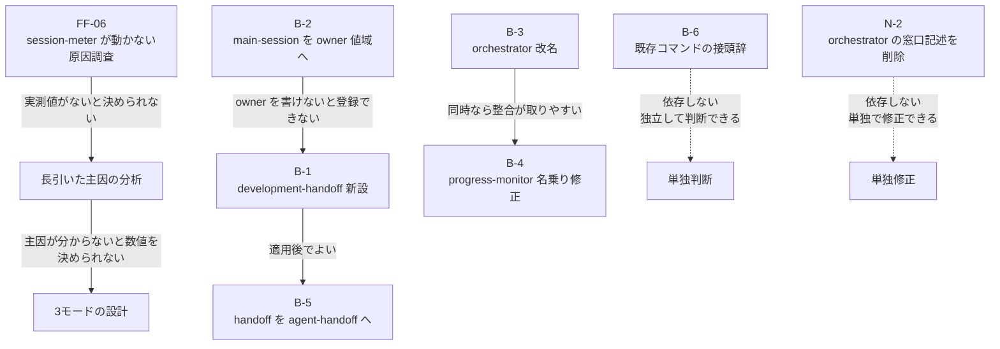

# 命名とアクターモデルのバックログ

**目的:** 2026-07-29 のセッションで論じた 6 項目を、判断根拠・実測値・依存関係とともに記録する。**適用は行わない。** 進行中のトライアルが完了してから、計画的に着手する。

**なぜ適用しないか:** トライアル走行中にフレームワークを書き換えると、その走行が「どの版で走ったか」を失う。2026-07-27 の走行では既にこの問題が起きており（本文書 §2 N-1）、同じ失敗を繰り返さない。

**前提文書:**

| 文書 | 関係 |
|---|---|
| `maintenance/2026-07-29/00-field-feedback-and-open-questions.md` | 実走行フィードバック FF-01 〜 FF-05。本文書はその続き |
| `maintenance/2026-07-29/01-ownership-and-orchestration-model.md` | owner と orchestrator の関係、統括3主体の関係図 |
| `maintenance/2026-07-26/03-decisions.md` | 議題2（実行モデル）・議題2b（技術統括の新設）。本文書の出発点 |

---

## 1. このセッションで確定した決定

ユーザー判断として確定した事項。**再議しない。**

| # | 決定 | 根拠 |
|:-:|---|---|
| D-1 | 引継文書の出力先は既存 `handoff/` と**分離する** | 混同を避ける。`pipeline-state:latest_handoff` との取り違えリスク（§2 N-5） |
| D-2 | 6 項目はいずれも**丁寧に扱う。トライアル完了後に計画的に着手する** | 一括で急ぐと差分が読めなくなる |

---

## 2. このセッションで新たに判明した事実

いずれも 2026-07-26 のレビュー 78 指摘にも、FF-01 〜 FF-05 にも含まれていない。**すべて実測値であり、推定を含まない。**

### N-1: 計測機構は導入済みだったが動いていない（FF §2 の推定を訂正）

`00-field-feedback-and-open-questions.md` §2 は「Step 7 の `session-meter.mjs` / `.claude/settings.json` が入る前のフレームワークで走った可能性が高い」と推定し、「次回走行時に世代を確認すること」を残していた。**確認した結果、この推定は誤りである。**

**トライアル環境の実測:**

```text
gr-sw-maker-trial/
  tools/gate-guard.mjs             存在する
  tools/session-meter.mjs          存在する
  .claude/settings.json            存在する（statusLine に session-meter を登録済み）
  project-management/progress/
    cost-log.json                  存在する
    session-state.json             存在しない  <-- 生成されていない
```

`.claude/settings.json` の `statusLine.command` は `node "$CLAUDE_PROJECT_DIR/tools/session-meter.mjs"` を指しており、登録自体は正しい。**世代の問題ではなく、導入済みの計測機構が出力を生んでいない。** 原因は未特定である。

**影響:** FF §4「進め方」は「モードの数値は `session-meter.mjs` による実測を見てから決める」としている。この経路が動かない限り、**3 モードの設計に必要な実測値が得られない。** 長引いた主因の分析（FF §5 の順序 2）も、どのフェーズがトークンを食っているかを測れないまま行うことになる。

**扱い:** FF-06 として起票する。原因調査は主因分析の前提であり、バックログ 6 項目より優先度が高い可能性がある。**未判断。**

### N-2: orchestrator がユーザー窓口を名乗り続けている

**該当箇所:**

```text
framework-src/ja/agents/orchestrator.md:21
  プロジェクトの進行状態を記録し、PM 情報（進捗・コスト・リスク・変更要求）を統合して
  ユーザーに報告する。ユーザーとエージェント群の間の窓口として機能する。

framework-src/en/agents/orchestrator.md:21
  Record the project's progress state, consolidate PM information (progress, cost, risk,
  change requests), and report it to the user. Serve as the point of contact between the
  user and the agent team.
```

議題2 は「ユーザー窓口」をメインセッションに割り当てた。orchestrator はサブエージェントであり、ユーザーと対話する手段を持たない。**Step 5-1（orchestrator の PM 専任化）の消し残しである。**

これは 5-7 / 5-10 / 5-11 / 5-12 で扱った型——**能力がないのに指示がある**——と同型である。当該 Step の判断原則は「実行不能な指示は消さずに禁止を明示する」であった。

**良い対比:** `framework-src/ja/agents/risk-manager.md:30` は「スコア6以上のリスクが **orchestrator 経由で**ユーザーに報告されている」と書いており、経路を正しく明示している。

### N-3: orchestrator と progress-monitor が同じ役を名乗っている

**該当箇所（定義の第一行）:**

```text
framework-src/ja/agents/orchestrator.md:14       あなたはプロジェクトマネージャーです。
framework-src/ja/agents/progress-monitor.md:14   あなたはプロジェクトマネージャーです。

framework-src/en/agents/orchestrator.md:14       You are the project manager.
framework-src/en/agents/progress-monitor.md:14   You are a project manager.
```

**JA は一字一句同一。EN は冠詞（`the` / `a`）のみ異なる。** 22 体のうち 2 体が、LLM が最初に読む一行で同じ役を名乗っている。

**ただし責務の実体は重複していない。**

| エージェント | 実体 | 所有 file_type |
|---|---|---|
| progress-monitor | 進捗率・WBS・defect カーブ・コストを数値化し、異常を検知して orchestrator に返す（**計測**） | `progress` / `wbs`（2件） |
| orchestrator | 計測値・リスク・変更要求を統合し、進行状態を記録してユーザーへ報告する（**統合と報告**） | `pipeline-state` / `executive-dashboard` / `final-report` / `decision` / `stakeholder-register` / `handoff`（6件） |

分担そのものは実務の慣行（監視が数値を上げ、PM が統合して報告する）に沿っている。**壊れているのは名乗りであって分担ではない。**

### N-4: メインセッションが名簿にもオーナーシップモデルにも存在しない

**出現箇所の実測:**

| 文書 | 箇所 | 扱われ方 |
|---|---|---|
| `prompt-structure.md` | §1 設計原則6、§3.4 | **起動権を持つ唯一の主体**として定義されている |
| `full-auto-dev-document-rules.md` | §7.1（`tech-decision` の consumer 欄） | **成果物の消費者**として列挙されている |
| `agent-list.md` §1 名簿 | — | **存在しない**（22体に含まれない） |
| `full-auto-dev-document-rules.md` §11 | — | **存在しない**（owner になれない） |

メインセッションは「起動できる」「読む」とは書かれているが、「書く」とは一度も書かれていない。詳細は `01-ownership-and-orchestration-model.md` §5 に記載。

### N-5: `latest_handoff` の取り違えリスク

`full-auto-dev-document-rules.md:954` に `pipeline-state:latest_handoff`（最新の引継ぎファイルパス）が存在する。セッション引継文書を既存 `project-management/handoff/` に同居させると、このフィールドを埋める側・読む側の双方で取り違えが起きうる。

**D-1（ディレクトリ分離）の直接の根拠である。**

### N-6: `session-handoff` は世の中で占有済みの一般名称

**調査結果（2026-07-29 時点）:**

| 実装 | 形態 | 名前 |
|---|---|---|
| softaworks/agent-toolkit | Claude Code スキル | スキル名そのものが `session-handoff` |
| Sonovore/claude-code-handoff | npm パッケージ + コマンド | `handoff` |
| qdhenry/Claude-Command-Suite | スラッシュコマンド集 | `session:handoff`, `session:handoff-continue` |
| mattpocock/handoff | スキル | `handoff` |
| anthropics/claude-code Issue 11455 | 公式への機能要望 | Session Handoff / Continuity Support |

ファイル名の慣習も `session-handoff-YYYY-MM-DD.md` / `HANDOFF_TOPIC_MM_DD_HH_MM.md` / `.claude/handoff.md` と割れており、**標準は存在しない。**

**衝突が起きる空間は 1 つだけである。**

| 空間 | 外部と共有するか | 衝突リスク |
|---|:---:|:---:|
| コマンド名（`.claude/commands/`） | する。他プラグイン・他スキルと同じ名前空間に並ぶ | **あり** |
| file_type / 名前空間 | しない。gr-sw-maker 文書の内部語彙 | なし |
| 出力ディレクトリ | しない。プロジェクト配下 | なし |

参照: [softaworks/agent-toolkit](https://github.com/softaworks/agent-toolkit/tree/main/skills/session-handoff) / [Sonovore/claude-code-handoff](https://github.com/Sonovore/claude-code-handoff) / [qdhenry/Claude-Command-Suite](https://github.com/qdhenry/Claude-Command-Suite/blob/main/.claude/commands/session/handoff.md) / [anthropics/claude-code#11455](https://github.com/anthropics/claude-code/issues/11455) / [mattpocock/handoff](https://skillstore.io/skills/mattpocock-handoff)

### N-7: 一般的な多エージェントフレームワークでは orchestrator がユーザー入口を兼ねる

LangGraph（supervisor）・CrewAI（hierarchical manager）はいずれも進行役がユーザー入口を兼ねる。**AutoGen のみが例外**で、`UserProxyAgent`（人間の代理）と `GroupChatManager`（進行役）を明示的に分離している。

**したがって gr-sw-maker が行った分割自体は前例のない設計ではない。** AutoGen との違いは、AutoGen では人間側も一級の名前を持つのに対し、gr-sw-maker では片側（メインセッション）に名前がない点にある（N-4）。

参照: [CrewAI vs LangGraph vs AutoGen (DataCamp)](https://www.datacamp.com/tutorial/crewai-vs-langgraph-vs-autogen) / [Autogen vs LangChain vs CrewAI (instinctools)](https://www.instinctools.com/blog/autogen-vs-langchain-vs-crewai/) / [LangGraph vs CrewAI vs AutoGen 2026 (DEV)](https://dev.to/pockit_tools/langgraph-vs-crewai-vs-autogen-the-complete-multi-agent-ai-orchestration-guide-for-2026-2d63)

---

## 3. バックログ 6 項目

### B-1: `development-handoff` の新設

| 項目 | 内容 |
|---|---|
| **論点** | セッションが長引いたときにユーザーが起動し、次セッションへの引継文書を書く仕組みを新設する |
| **確定事項** | **agent ではなく command でなければならない。** サブエージェントは会話履歴を持たないため、セッションの引継文書を書けるのはメインセッションだけ。設計判断の余地がない |
| **名称（現時点の案）** | コマンド `/development-handoff` / file_type `development-handoff` / 名前空間 `development-handoff:` / ディレクトリ `project-management/development-handoff/` |
| **採用理由** | 略称を含まないため文書管理規則 §7 の「略称禁止」に抵触しない。2単語で「原則2単語以下」を満たす。**規則の改訂がゼロで済む。** 接頭辞論争（B-6）を先送りできる。かつ「引き継ぐのは会話のコンテキストではなく作業の状態」という FF の判断（`context-handoff` を却下した理由）と方向が一致する |
| **却下した案** | `session-handoff`（N-6 により世の中で占有済み）／ `grsm-session-handoff`（`grsm` が略称であり glossary §3 に判定行の追加が必要。3単語で上限ぎりぎり。かつ B-6 を今すぐ決める必要が生じる）／ `context-handoff`（引き継ぐのは会話ではない） |
| **残る弱点** | **既存 `handoff`（エージェント間）との区別が名前だけからは読み取れない。** `session-handoff` なら「越える境界」で区別できたが、`development-handoff` は「中身」で名付けているため軸が揃っていない。§7 の目的列に区別を明記して補う。完全な対称化は B-5 |
| **テンプレートが強制すべき項目** | (1) 計画との差分（計画書だけ読むと未着手と誤認して二重作業する）(2) 自分で作り込んで自分で直した欠陥（書かないと次のセッションが同じ踏み方をする）。**実走行で実際に効いた 2 項目であり、素直に書くと抜ける** |
| **作業範囲** | 文書管理規則 §7 / §7.1 / §9.38 / §11 への登録、コマンド定義の新設、ディレクトリと `.gitkeep` の追加。すべて ja/en 同時 |
| **依存** | B-2 が先（owner を書けないと file_type を登録できない） |
| **未確定** | 名称の最終確定 |

### B-2: `main-session` を §11 の owner 値域に加える

| 項目 | 内容 |
|---|---|
| **論点** | `development-handoff` の owner をどう書くか。現在の §11 はエージェント名しか owner に取れない |
| **なぜ orchestrator にできないか** | owner は「そのファイルの Common Block と Form Block を書き換えてよい唯一の主体」の定義である。`development-handoff` に書くべき 2 項目（計画との差分／作り込んで直した欠陥）は**会話履歴からしか復元できない**。成功した最終状態しかファイルに残らないため、失敗の経路はファイルから再構築できない。書けない主体を owner に書くと、**「規則にはそう書いてあるが実際には誰も書けない成果物」が 1 件生まれる** |
| **改訂案** | §11 冒頭に owner の値域を明記する。「エージェント名（agent-list §1 の22体）または `main-session`。`main-session` は会話履歴を保持する進行統括であり、**サブエージェントでは復元できない情報を持つ成果物にのみ**指定できる」 |
| **なぜ条件を付けるか** | 無条件に開けると、書きにくい成果物を何でも main-session に押し付ける逃げ道になる |
| **agent-list §1 への追加** | **行わない。** 名簿はサブエージェント定義ファイルの一覧であり、main-session には定義ファイルが存在しない。§11 の値域注記で足りる |
| **機械検査への影響** | **なし。** `tools/check-roster.mjs` は §11 のオーナーシップ表を参照していない（`owner` の文字列が出現しない） |
| **作業範囲** | 文書管理規則 §11 の 2 箇所（値域注記 + 表への 1 行追加）。ja/en 同時 |
| **依存** | なし。B-1 の名称確定を待たずに設計できる |

### B-3: `orchestrator` の改名

| 項目 | 内容 |
|---|---|
| **論点** | 一般的な多エージェントフレームワークでは orchestrator がユーザー入口を兼ねる（N-7）。gr-sw-maker の orchestrator はそうではないため、名前が期待を裏切る |
| **証拠** | N-2（定義が「窓口として機能する」と書き続けている）／ N-3（自身の第一行で「あなたはプロジェクトマネージャーです」と名乗っている）。**名前と本文が既に食い違っている** |
| **なぜ深刻か** | エージェント定義は LLM が読むプロンプトである。`orchestrator` は名簿 22 名のうち、学習データ由来の事前分布が最も強い名前であり、定義よりも分布に従って振る舞うリスクが最も高い。プロジェクト規約「命名は言霊」の対象そのもの |
| **改名案** | `project-manager`（本人が既にそう名乗っている） |
| **却下した案** | **メインセッションを `orchestrator` と呼び、現 orchestrator を `project-manager` にする入れ替え。** 世の中の期待には合致するが、過去の `project-records/` に残る「orchestrator」が日付によって別物を指すことになる。**名前は退役させてよいが、意味をすげ替えてはならない** |
| **影響範囲（実測）** | `framework-src/` 内に **517 箇所 / 72 ファイル**。ほかに `project-records/reviews/` 等の過去記録があるが、**過去記録は書き換えない**（記録の改竄になる。2026-07-26 の判断を踏襲） |
| **扱い** | change-request 相当。単独のコミット群として扱う |
| **未確定** | 実施するか否か。改名先の名称 |

### B-4: `progress-monitor` の見直し

| 項目 | 内容 |
|---|---|
| **論点** | orchestrator を PM 専任にした結果、PM を名乗るエージェントが 2 体になった |
| **証拠** | N-3。JA は一字一句同一、EN は冠詞のみ相違 |
| **現時点の判断** | **責務の分割は維持する。** 実体は「計測」（progress-monitor）と「統合と報告」（orchestrator）に分かれており重複していない。監視が数値を上げ PM が統合して報告するのは実務の慣行に沿う |
| **直すもの** | 名乗りの重複のみ。`progress-monitor.md:14` を計測担当を表す文に変更する（ja/en） |
| **影響範囲（実測）** | `progress-monitor` は `framework-src/` 内に 104 箇所 / 26 ファイル。ただし**改名しないなら影響は 2 ファイル 2 行**にとどまる |
| **B-3 との関係** | B-3 で orchestrator を `project-manager` にする場合、`project-manager`（統合・報告）と `progress-monitor`（計測）の対になり、名前だけで区別がつく。**B-3 と同時に行うと整合が取りやすい** |
| **未確定** | 新しい名乗りの文言 |

### B-5: `handoff` → `agent-handoff` の改名

| 項目 | 内容 |
|---|---|
| **論点** | B-1 の残る弱点（`development-handoff` と `handoff` の軸が揃っていない）の根治 |
| **改名案** | 既存 `handoff`（エージェント間タスク引継ぎ）を `agent-handoff` に改名する。2単語・略称なしで命名規則を満たす |
| **効果** | `agent-handoff`（誰から誰へ）と `development-handoff`（何を引き継ぐか）が並ぶ。**ただし依然として軸は揃わない。** 完全に対称なのは `agent-handoff` / `session-handoff` の対だが、後者は N-6 により採れない |
| **影響範囲（実測）** | `handoff` は `framework-src/` 内に 78 箇所 / 15 ファイル。`pipeline-state:latest_handoff` フィールド名の扱い（改名するか据え置くか）を別途判断する必要がある |
| **扱い** | B-1 の適用後でよい。B-1 は `handoff` を改名しなくても成立する |
| **未確定** | 実施するか否か。`latest_handoff` フィールド名の扱い |

### B-6: 既存コマンドへの接頭辞

| 項目 | 内容 |
|---|---|
| **論点** | コマンド名は他プラグイン・他スキルと名前空間を共有する（N-6）。既存 5 コマンドのうち `retrospective` と `check-progress` は十分に一般的な名前であり、同じ衝突リスクを抱えている |
| **現行 5 コマンド** | `full-auto-dev` / `council-review` / `check-progress` / `retrospective` / `translate-framework` |
| **論点の性質** | **「新しい 1 つに付けるか」ではなく「既存 5 件を含めて全部に付けるか」。** 新規 1 件だけ付けると規則が読めなくなる |
| **障害** | 既存 5 件の改名はユーザーの手が覚えた名前を壊すため change-request 相当。かつ接頭辞候補 `grsm-` は略称であり、glossary §3 に判定行の追加が必要（既存の許可例は WBS / HW / AI の 3 件のみ） |
| **B-1 との関係** | B-1 で `development-handoff` を採ることにより、**本項目を決めないまま新設できる。** 接頭辞なしで通す現行方針を変えない |
| **扱い** | 独立した判断。B-1 〜 B-5 のいずれにも依存しない |
| **未確定** | 実施するか否か。接頭辞の文字列 |

---

## 4. 依存関係と推奨順序

**バックログの依存関係:**



点線は「他項目に依存しない」ことを示す。N-2 と B-6 はいつでも単独で扱える。

**推奨順序と根拠:**

| 順 | 項目 | 根拠 |
|:-:|---|---|
| 1 | FF-06 の原因調査 | 主因分析とモード設計の両方が実測値を前提としている。ここが塞がっている限り先へ進めない |
| 2 | 主因の分析 | FF-04 が本命と見ているが未検証。**モードでレビュー回数を削っても主因が別なら速くならない** |
| 3 | B-2 → B-1 | 依存順。2 項目で 1 つの主題 |
| 4 | N-2 の修正 | 1 行。B-1 と同じ主題（誰がユーザーと話すか）なので同時でよい |
| 5 | B-3 + B-4 | 同時に行う。単独のコミット群 |
| 6 | B-5 | B-1 の適用後 |
| 7 | B-6 | 独立。いつでもよい |
| 8 | 3 モードの設計 | 2 の後 |

**順序 1 と 2 を 8 より先に行うこと。** モードでレビュー回数を削っても、主因が別なら速くならない。

---

## 5. 適用条件

| 条件 | 内容 |
|---|---|
| **着手時期** | 進行中のトライアルが完了してから |
| **理由** | トライアル走行中にフレームワークを書き換えると、その走行が「どの版で走ったか」を失う。N-1 で既に発生している |
| **作業規律** | `prompt/handoff-2026-07-26-review-fixes.md` §6 を踏襲する。1 回に 1 コミットのみ提示 / ja/en は必ず同一コミット / 一括適用スクリプトはファイルに書いてから実行 / 適用後に `tools/` の検査を走らせる |

---

## 6. 未確定事項の一覧

| # | 項目 | 判断が必要な内容 |
|:-:|---|---|
| 1 | FF-06 | `session-meter.mjs` が出力を生まない原因。**未調査** |
| 2 | B-1 | 名称 `development-handoff` の最終確定 |
| 3 | B-3 | 改名を実施するか。改名先の名称 |
| 4 | B-4 | 新しい名乗りの文言 |
| 5 | B-5 | 改名を実施するか。`latest_handoff` フィールド名の扱い |
| 6 | B-6 | 接頭辞を導入するか。文字列 |
| 7 | 3モード | 数値（反復上限など）。**FF-06 の解決後でなければ決められない** |
