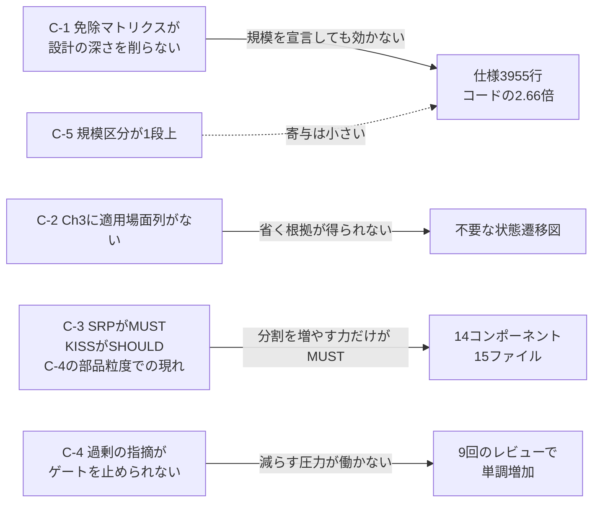

# 過剰設計の原因調査

**契機:** ユーザー指摘「ただの単位変換 CLI なのにコードが複雑すぎる」「コンポーネント図や状態遷移図も複雑すぎる」「そもそも状態遷移なんていらんだろ。起動→入力→単位判定→計算→結果出力の一本道やん」。

**対象:** `gr-sw-maker-trial`（unit-converter-cli）。**トライアルは 2026-07-29 時点で進行中であり、本調査は途中時点の成果物に対するものである。**

**結論の先出し:** 過剰設計は architect の判断の緩みではなく、**規則の構造から生じている。** 具体的には (1) 規模によるスケールダウンが設計の深さに一切作用しない (2) 仕様テンプレートの Ch3 に条件付けの仕組みがない (3) 過剰を指摘するレビュー観点が構造的に品質ゲートを止められない、の 3 点である。

---

## 1. 症状の実測

| 指標 | 実測値 |
|---|---:|
| 仕様書の行数 | 3,955 行 |
| 実装コードの行数 | 1,486 行（15 ファイル） |
| **仕様書 / コードの比** | **2.66 : 1** |
| コンポーネント数 | 14 |
| 1 コンポーネントあたりの平均コード行数 | 約 106 行 |
| 図の数 | 9（flowchart 3 / graph 3 / stateDiagram 1 / sequenceDiagram 1 / classDiagram 1） |
| 要求 ID | FR 40 / NFR 18 |
| Gherkin シナリオ | 29（具体ケース展開後 143） |
| テストケース | 66 |
| テストファイル | 22 |
| レビュー実施回数 | **9 回**（review-001 〜 review-009） |
| 仕様書の版 | **v1.22** |
| change_log の entry 数 | 23 |

**章ごとの行数:**

| 章 | 行数 | 内容 |
|---|---:|---|
| Ch1 Foundation | 208 | 背景・目標・範囲・用語・表記規約 |
| Ch2 Requirements | 652 | FR 40 件（508 行）+ NFR 18 件（144 行） |
| Ch3 Architecture | 1,051 | レイヤー仕訳・方式・コンポーネント・ファイル構成・ドメインモデル・振る舞い・ADR 11 件 |
| **Ch4 Specification** | **1,250** | シナリオ 866 行 + 繰延事項の確定 276 行 + **FR-040 の追加の経緯 108 行** |
| Ch5 Test Strategy | 414 | テストマトリクス・許容誤差・測定方法・リスク対応テスト |
| Ch6 Design Principles | 224 | R1-R7 への準拠確認表・純粋性分類・R4/R5 適用可否・R2 自己点検 |

**実装のディレクトリ構成:**

```text
src/
  cli-entry.js              59 行   Framework 層
  usecase/
    convert-quantity.js     87 行
    run-cli.js              95 行
  domain/
    unit-registry.js       244 行
    error-classification.js 153 行
    number-format.js       145 行
    conversion-factors.js   95 行
    quantity-grammar.js     67 行
    conversion-rules.js     45 行
    text-notation.js        44 行
  adapter/
    message-catalog.js     173 行
    argv-parser.js         137 行
    debug-trace.js          70 行
    json-presenter.js       37 行
    human-presenter.js      35 行
```

ユーザーの指摘のとおり、単位変換の一本道に対して 4 層 15 ファイルである。**`tests/unit/layer-dependency.test.js` が存在する** — レイヤー間の依存方向を検査するためだけのテストであり、テンプレートが課した構造を守らせるために書かれている。

---

## 2. 原因

### C-1（主因）: スケールダウンが「管理文書」だけを削り「設計の深さ」を削らない

プロセス規則 §3.1.1 の免除マトリクスは **13 行**からなる。その全行を列挙する。

```text
WBS / ガントチャート
進捗レポート（progress/）
コストログ（cost-log.json）
pipeline-state
executive-dashboard.md
stakeholder-register.md
性能テスト（k6等）
可観測性設計
deployment-design
R3 コードレビュー（個別レポート）
R6 テストレビュー（個別レポート）
機能安全分析（HARA/FMEA/FTA）
脅威モデリング（STRIDE）
```

**13 行すべてがプロジェクト管理文書または検証活動である。仕様書の章構成・図の種類・コンポーネントの粒度・アーキテクチャの層数に触れる行は 1 行も存在しない。**

したがって規模を Micro と宣言しても Small と宣言しても、**仕様書の深さと実装の構造は一切変わらない。** 削れるのは WBS とダッシュボードと性能テストだけである。

実走行での適用結果も、これを裏づけている。トライアルの `CLAUDE.md`「スケールダウン設定」で免除されたのは executive-dashboard / WBS / 進捗レポート / stakeholder-register / 性能テスト / 可観測性設計であり、`pipeline-state.md:1866` にそのまま記録されている。**Ch3 の図も 14 コンポーネントも 4 層も、免除の対象になりえなかった。**

### C-2（主因）: spec-template の Ch3 に「適用場面」列がない

同一テンプレート内で、条件付けの仕組みが章によって不揃いである。

**Ch4 の拡張節（適用場面列がある）:**

```text
| Section候補 | English          | 日本語         | 適用場面                       |
| 4.x         | UI Elements Map  | UI要素マップ   | UIを持つアプリ                 |
| 4.x         | Configuration    | 設定定義       | 設定オブジェクトを持つアプリ   |
| 4.x         | API Definition   | API定義        | APIを提供・利用するアプリ      |
| 4.x         | Data Schema      | データスキーマ | DB を使用するアプリ            |
| 4.x         | State Management | 状態管理       | 複雑な状態遷移を持つアプリ     |
| 4.x         | Algorithm        | アルゴリズム   | 数理・暗号等の演算ロジック     |
| 4.x         | Error Handling   | エラー処理     | エラー体系の定義が必要なアプリ |
```

**Ch3 の節（適用場面列がない）:**

```text
| Section | English              | 日本語             | 記述内容 |
| 3.1     | Architecture Concept | アーキテクチャ方式 | ... |
| 3.2     | Components           | コンポーネント     | ...コンポーネント図... |
| 3.3     | File Structure       | ファイル構成       | ... |
| 3.4     | Domain Model         | ドメインモデル     | ...クラス図、ER図、状態遷移図 |
| 3.5     | Behavior             | 振る舞い           | シーケンス図、アクティビティ図 |
| 3.6     | Decisions            | 設計判断           | ADR |
```

**Ch4 は「複雑な状態遷移を持つアプリ」という条件で状態管理を省けるのに、Ch3.4 の状態遷移図には条件が付いていない。**

その結果が仕様書に残っている。`docs/spec/unit-converter-cli-spec.md:1640` 以降を引用する。

```text
### 3.4.6 起動の帰結の状態遷移

本ツールは起動をまたいで持続する状態を持たない（仕様書 1.9 の While の解釈）。
したがって状態遷移図は**プロセスの寿命内における帰結の確定過程**を表す。
```

**「持続する状態を持たない」と自分で書いた直後に、状態遷移図を描いている。** テンプレートの枠を空けられないため、状態遷移の意味を「プロセス寿命内の帰結確定過程」へ読み替えて枠を埋めた。ユーザーの指摘「そもそも状態遷移なんていらんだろ」は正しく、**architect も同じ結論に達していながら、省く根拠を規則から得られなかった。**

対照的に ER 図は省かれている。同じ 3.4 の中で、`ER 図は永続ストアを持たないため作成しない旨を理由とともに明記` と change_log に記録されている。**省けたものと省けなかったものの差は規則ではなくエージェントの裁量にあり、再現性がない。**

### C-3【訂正】: 層の数は原因でない。粒度を決めているのは SRP と KISS の非対称である

**本項は 2026-07-29 に訂正した。** 初版は「図の色分け要求が Clean Architecture 4 層を連れてきたことが主因」としていたが、**これは因果の帰属を誤っていた。** ユーザー指摘により訂正する。

**訂正の根拠 1 — 層の数と部品の数は直交する。** 4 層は 4 つの入れ物を与えるだけである。実測した内訳は次のとおりで、膨張は層の数でなく**入れ物の中**で起きている。

```text
Framework  cli-entry                                              1 ファイル
Use Case   convert-quantity / run-cli                             2 ファイル
Entity     unit-registry / error-classification / number-format /
           conversion-factors / quantity-grammar /
           conversion-rules / text-notation                        7 ファイル
Adapter    message-catalog / argv-parser / debug-trace /
           json-presenter / human-presenter                        5 ファイル
```

4 層に分けた結果は 4 である。15 になったのは Entity が 7、Adapter が 5 に割れたためであり、**層の数を 4 から 3 や 2 に減らしても、この分割は 1 つも消えない。**

**訂正の根拠 2 — この CLI では 4 層が自然に対応する。** 変換式 = Entity、単位変換入力 = Use Case、CLI 用の接合 = Adapter、標準入出力 = Framework。CA の本質は依存の向きを一方向にし、プロジェクト固有で最も変わりにくいもの（本件では単位の変換テーブル）を中心に置き、変わるもの（UI・フレームワーク）を外側に置いて中心に依存させることである。**この構造を採ったこと自体は過剰設計ではない。**

**訂正の根拠 3 — 分割を駆動したのは SRP である。** review-standards の Level を突き合わせると、粒度に働く力は次のようになっている。

| 観点 | Level | 重大度 | 働く向き | ゲートを止めるか |
|---|---|---|---|:---:|
| R2.2 SRP（1 モジュール 1 変更理由） | **MUST** | High | **分割を増やす** | **止める** |
| R2.8 KISS（動作する最も単純な解） | SHOULD | Medium | 分割を減らす | 止めない |
| R2.9 YAGNI（過度な抽象化なし） | SHOULD | Medium | 分割を減らす | 止めない |

**分割を増やす力だけが MUST であり、減らす力は両方とも SHOULD である。** Entity が 7 に割れたのは、換算係数・換算規則・単位表・文法・数値書式・表記・エラー分類がそれぞれ「単一の変更理由」を持つと読めるからであり、SRP に忠実に従えばこうなる。**したがって C-3 は独立した主因ではなく、C-4 が部品粒度の層で現れたものである。**

### C-3b: 層の数を要求として書いていた箇所が 1 つあった（原因ではないが規則の誤り）

上記の調査中に、本件の膨張の原因ではないが規則の誤りである箇所を 1 つ見つけた。

| 箇所 | 記述 | 本質か形か |
|---|---|:---:|
| プロセス規則 §4.4「レイヤー仕訳」 | 全コンポーネントを Clean Architecture の 4 層に**明示的に分類する** | **形** |
| spec-template | 他のアーキテクチャを採用する場合は凡例を 3.1 に定義すること | 本質（代替を認めている） |
| review-standards R2.16 | 依存がドメイン（内側）を向く。… | 本質（向きを先に述べている） |
| review-standards CA 節 | 依存の方向がドメイン層（内側）に向かっているか | 本質（同上） |

**本質を述べている 3 箇所に対し、エージェントが実際に実行する手順の側だけが形（ 4 という数）を要求していた。** 層が 3 でも 5 でも成立する設計を MUST 違反に見せる罠であるため、本日是正した（§5）。**ただしこれは本件の 3,955 行を生んだ原因ではない。**

### C-4（主因）: 過剰を指摘する観点は、構造的にゲートを止められない

review-standards には KISS と YAGNI が**存在する。**

```text
| R2.8 | 設計 | SHOULD | KISS: 動作する最も単純な解。ネスト深さ4未満。早期リターンで平坦化 |
| R2.9 | 設計 | SHOULD | YAGNI: 先回り機能・過度な抽象化なし。未使用のパラメータ/フラグ/設定なし |
```

しかし両者は **SHOULD** である。そしてプロセス規則 §9.1.2 が重大度への写像を定めている。

```text
| Level  | 既定の重大度 | 例外 |
| MUST   | High        | 安全性・データ整合性に直結する場合は Critical |
| SHOULD | Medium      | — |
```

品質ゲートが止まる条件は Critical 0 / High 0 である。**したがって:**

| 指摘の向き | 該当する Level | 重大度 | ゲートを止めるか |
|---|---|---|:---:|
| 必須のものが欠けている | MUST | **High** | **止める** |
| 不要なものが多い（KISS / YAGNI 違反） | SHOULD | Medium | **止めない** |

**レビューの圧力は一方向にしか働かない。** 「足りない」は作業を止めるが、「多すぎる」は止めない。9 回のレビューを重ねれば、仕様は単調に増える。実測がそれを示している — 版は v1.22 まで上がり、change_log は 23 entry、Ch4 には `FR-040 の追加の経緯` が 108 行にわたって残っている。

**これは FF-04（改訂時の突き合わせを義務づける仕組みがない）と同じ構造の別の面である。** FF-04 は「是正が新しい矛盾を持ち込む」、C-4 は「是正が新しい記述を持ち込み、減らす力が働かない」。どちらも改訂が単調増加することを許している。

### C-5（副因）: 規模区分が 1 段上に判定された

§3.1.1 の規模区分表は、Micro の例を次のように挙げている。

```text
| Micro | 単一セッション内で完了（1時間未満）。単一モジュール、外部依存なし | サイコロアプリ、電卓、簡易CLIツール |
```

**「電卓」「簡易CLIツール」が Micro の例示である。** 単位変換 CLI はこの記述に最も近い。しかし実走行では **Small** と判定された（`pipeline-state.md:174`、`CLAUDE.md:68`）。

さらに Small の基準は「1日以内で完了」であるが、実際は 2026-07-26 に setup が完了し、2026-07-29 時点で design フェーズが未完了である。**所要は基準を大きく超えている。**

ただし**これは副因である。** Micro と判定していれば R3/R6 の個別レポートが最終レビューに統合され、deployment-design と脅威モデリングが免除されたが、**C-1 のとおり Ch3 の図・14 コンポーネント・4 層・Ch6 の自己証明はいずれも Micro でも免除されない。** 区分を正しても仕様書の 3,955 行はほとんど減らない。

---

## 3. 原因の重み付け



**C-1 から C-4 は規模と無関係に効く構造的原因であり、C-5 のみが個別の判定誤りである。** 点線は寄与が小さいことを示す。

---

## 4. 3 モード設計への含意（重要）

`00-field-feedback-and-open-questions.md` §4 は、モードが動かすものとして次を挙げていた。

> **Medium / Low を据置き（deferred）にしてよいか** — review-standards の既存機構を再利用。新しい免除機構は作らない

**本調査の結果、この案は主因に対して逆向きに効く。**

C-4 で示したとおり、KISS（R2.8）と YAGNI（R2.9）は SHOULD であり、§9.1.2 により **Medium が上限**である。**Medium を据置き可能にすると、過剰設計を指摘する唯一の観点が最初に据置かれる。** 軽くするためのモードが、重くする方向に働く。

同 §4 は「削るべきはレビュー回数ではない」と既に述べており、主因を FF-04 と見ていた。**本調査はその見立てを支持しつつ、もう 1 つの主因（C-1 〜 C-4）を加える。** モードが動かすべきものは、指摘の据置きではなく **仕様の深さ**（章と図の適用条件）である可能性が高い。

**ただしこれは設計案ではなく、調査から導かれた含意である。モードの設計は本文書の範囲外とする。**

---

## 5. 是正の方向（未検討・案として記録するのみ）

**以下は原因に対応する方向の列挙である。C-3b と C-4 は 2026-07-29 に適用した。C-1 / C-2 / C-5 は未判断である。**

| 原因 | 是正の方向 | 影響する文書 |
|---|---|---|
| C-1 | 免除マトリクスに設計成果物の行を追加する（Ch3 の図の種類・コンポーネント粒度の下限・Ch6 の自己証明） | プロセス規則 §3.1.1 |
| C-2 | spec-template の Ch3 に Ch4 と同じ「適用場面」列を追加する。3.4 の状態遷移図は「持続する状態を持つアプリ」を条件とする | spec-template |
| C-3b | **是正済み（2026-07-29）。** 4 箇所を、要求を「依存の向きと中心の選択」に置き、層の数を設計判断とする形へ改めた | プロセス規則 §4.4 / review-standards R2.16 と CA 節 / spec-template |
| C-4 | **是正済み（2026-07-29）。** 重大度の写像には触れず、**「過剰」を「比較の欠落」に変換した。** R2.18（MUST）を新設し、Ch3.6 の ADR-000「最小構成との比較」の存在と内容を要求する。欠落は High となりゲートを止める。あわせて architect の Procedure に手順 8「最小構成と比較する」を追加した | review-standards R2.18 と R2 詳細節 / spec-template Ch3.6 と Ch6 チェックリスト / architect |
| C-5 | 規模区分の判定に「テンプレートの例示との照合」を手順として加える。かつ実績が基準を超えた場合の再判定を規定する | プロセス規則 §3.1.1 |

**§9.1.2 の写像には手を入れていない。** 2026-07-26 の議題6 で SSOT を一本化した箇所であり、例外を作れば同じ問題が再発する。代わりに「大きすぎる」という主観的で Medium 止まりの判定を、「最小構成と比較した記録があるか」という**客観的で MUST の判定**に置き換えた。**欠落は止められるという非対称を、敵にせず利用している。**

ただし限界がある。**KISS / YAGNI 自体は SHOULD のままであり、ADR-000 が存在しさえすれば、内容が薄くても Medium 止まりである。** R2.18 が保証するのは「比較したことの記録が残る」ことであって、「比較の結論が正しい」ことではない。後者は依然として LLM 裁定に委ねられる。**これは 2026-07-26 の議題3 が「内容の妥当性は LLM 判断であり、これは明示的に受容する」とした判断と同型であり、意図的な受容である。**

---

## 6. 未確定事項

| # | 内容 |
|:-:|---|
| 1 | 是正の方向の採否。**C-3b と C-4 は適用済み（2026-07-29）。残る C-1 / C-2 / C-5 は未判断** |
| 1b | **進行中のトライアルは R2.18 を満たしていない。** 仕様書の ADR は ADR-001 〜 ADR-011 であり ADR-000 が存在しない（実測）。次の design レビューで High として現れる。遡って適用するか次のプロジェクトから適用するかは**未判断** |
| 2 | C-4 の扱い（重大度の写像に手を入れるか、別の機構を設けるか） |
| 3 | 本調査は design フェーズ途中の成果物に対するものである。**implementation / testing フェーズ完了後に再測定すること** |
| 4 | FF-06（`session-meter.mjs` が動かない）が未解決のため、**どのフェーズが時間とトークンを食ったかは依然として測れていない。** 本調査は成果物の量から原因を辿ったものであり、所要時間の配分は特定していない |
