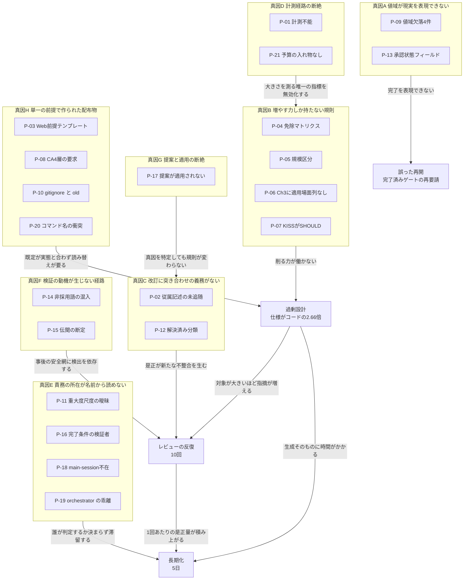
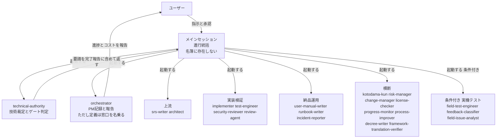
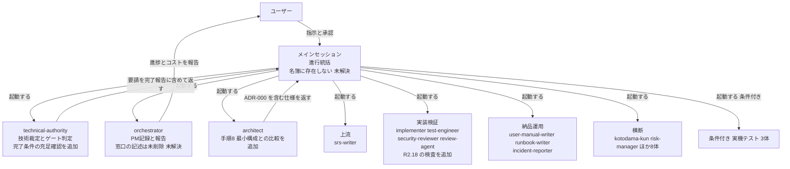
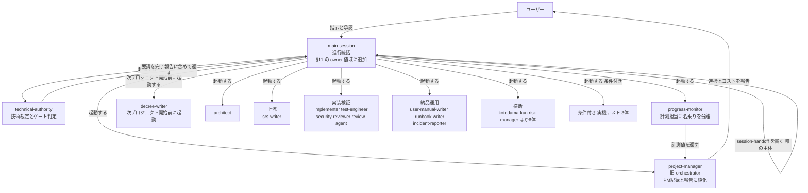

# gr-sw-maker 初回トライアル 総括レポート

**対象:** `gr-sw-maker-trial`（unit-converter-cli）。2026-07-26 開始、2026-07-30 完了、GATE-DELIVERY PASS。

**位置づけ:** gr-sw-maker を実際のアプリ開発に適用した**最初の完走**。本レポートは検出した問題を統合し、真因ごとに対策を比較検討する。

**方針:** 数値はすべて成果物からの実測である。推測を含む箇所はその旨を明記する。**トライアル側のファイルは変更していない。**

---

# 1. エグゼクティブサマリー

## 1.1 走行結果

| 項目 | 実測 |
|---|---|
| 最終判定 | **GATE-DELIVERY PASS**（TD-008、免除 0 件）。品質ゲート 6 件すべて PASS |
| defect | **0 件** |
| テスト | **198 件全件合格**（単体 165 / 結合 30 / 性能 3）。単体カバレッジ 3 指標とも **100.00%** |
| 期間 / 成果物 | **5 日** / `.md` **167 ファイル** |
| 仕様書 : コード | **3,958 行 : 1,486 行 = 2.66 : 1** |
| waiver | **2 件**（TC-I-04 オフライン実測 / CodeQL）。いずれもユーザー承認付き |
| トークン消費 | **全期間を通じて計測不能** |

## 1.2 問題一覧

**対策状況の値域:** `適用済み`（規則に反映）／ `部分適用`（一部のみ反映）／ `判断待ち`（案はあるが未決）／ `未着手`（案が未立案）

| # | フェーズ | 問題 | 対策 | 対策状況 | 備考 |
|:--:|---|---|---|:---:|---|
| P-01 | 全期間 | `session-state.json` が一度も生成されず、コスト・コンテキストが計測不能 | 計測経路の原因調査と、経路断絶を検知する仕組みの新設 | **未着手** | FF-06。真因 D。**次走行前に必須** |
| P-02 | 全期間 | 改訂が従属記述に追随しない。design だけで新規 7 件 | 改訂時に既存記述との突き合わせを義務づける規則 | **未着手** | FF-04。真因 C。**対照実験で実証済み** |
| P-03 | setup | CLAUDE.md テンプレートがサーバー / Web 前提で、CLI と 6 箇所衝突 | アーキタイプ別の既定値を持つ、または既定を置かない | **部分適用** | 真因 H。2026-07-26 で一部是正 |
| P-04 | setup | 免除マトリクス 13 行がすべて管理文書で、設計の深さを削らない | 設計成果物の行を追加する | **判断待ち** | C-1。真因 B。**過剰設計の第一原因** |
| P-05 | setup | 規模区分が 1 段上に判定された（Micro の例示に該当するが Small） | 判定手順に「テンプレートの例示との照合」を追加 | **判断待ち** | C-5。真因 B。副因 |
| P-06 | design | spec-template の Ch3 に「適用場面」列がない（Ch4 にはある） | Ch3 に適用場面列を追加する | **判断待ち** | C-2。真因 B。**不要な状態遷移図の直接原因** |
| P-07 | design | 過剰を指摘する観点（KISS / YAGNI）が SHOULD で、ゲートを止められない | R2.18 新設。最小構成との比較を MUST 化 | **適用済み** | C-4。真因 B。**本試行には未反映** |
| P-08 | design | Clean Architecture の 4 層が手順で「要求」として書かれていた | 要求を「依存の向きと中心の選択」に置き換え | **適用済み** | C-3b。真因 H |
| P-09 | 全期間 | 値域が現実の状態を表現できない。**4 件** | 値域設計の原則を規則に置く、または個別に追加 | **判断待ち** | FF-05 / FF-07 ほか。真因 A |
| P-10 | setup | `.gitignore` が規則の義務づけた保存先 `old/` を除外している | `.gitignore` の修正 | **未着手** | FF-01。真因 H |
| P-11 | setup | 「セキュリティ脆弱性 Critical: 0」がどの重大度尺度を指すか未定義 | どの尺度を指すか規則に明記 | **未着手** | FF-02。真因 E |
| P-12 | planning | 「解決済み」分類の内側に未点検の論点が残る | 分類の粒度自体を検証する観点を追加 | **未着手** | FF-03。真因 C |
| P-13 | planning | `spec-foundation` に章単位の承認状態を表すフィールドがない | 承認状態フィールドの新設 | **未着手** | FF-05。真因 A |
| P-14 | 全期間 | 非採用語の混入が **4 回**。delivery では宣言自体が自己矛盾 | 生成時の予防側の仕組み | **未着手** | 真因 F |
| P-15 | 全期間 | 伝聞由来の断定が事後の安全網でしか検出されない | 改変を伴わない受け渡しにも検証を課す | **未着手** | 真因 F |
| P-16 | design | フェーズ完了条件（`test-plan`）を検証する者が未定義のまま次フェーズへ | ゲート判定要請にフェーズ完了条件の充足状況を添付 | **部分適用** | technical-authority が自ら恒久対策を定めたが**規則に未反映** |
| P-17 | 全期間 | ふりかえりの提案が一度も適用されない | decree-writer の起動条件を定義する | **判断待ち** | 真因 G。**対照実験の原因でもある** |
| P-18 | 全期間 | メインセッションが名簿にも §11 にも存在しない | §11 の owner 値域に `main-session` を追加 | **判断待ち** | B-2。真因 E |
| P-19 | 全期間 | orchestrator の名前が実態と乖離。progress-monitor と同じ名乗り | 改名（`project-manager`）と名乗りの分離 | **判断待ち** | B-3 / B-4。真因 E |
| P-20 | 全期間 | コマンド名が世の中の一般名と衝突しうる | `development-handoff` の新設。接頭辞は別途判断 | **判断待ち** | B-1 / B-6。真因 H |
| P-21 | setup | `budget_usd`（予算絶対額）の入れ物が CLAUDE.md にない | 行を新設する | **判断待ち** | 真因 D。ユーザーは設定を却下したが**入れ物の欠落は残る** |
| P-22 | 全期間 | **decree-writer の適用先が配布物であり、原本 `framework-src/` に届かない** | 還元経路の定義 | **未着手** | 真因 G。**本レポート作成時に発見。** ふりかえりにも final-report にも記載がない |

**適用済みは 2 件、部分適用が 2 件、残る 18 件は未決である。**

---

# 2. 問題の依存関係

21 の問題は独立ではない。**8 つの真因に収束し、真因どうしにも依存がある。**

**問題と真因の依存関係:**



**読み方の要点は 3 つある。**

1. **真因 D（計測不能）は単独では害が小さいが、真因 B を見えなくする。** 大きさが悪化したことを検知する唯一の指標がコスト予算であり、それが全期間を通じて機能しなかった。**牛刀を測る計器だけが壊れていた。**
2. **真因 G は真因 C の上流にある。** ふりかえりは真因 C を正しく特定していた。適用されなかったから再発した。**分析の失敗ではなく、分析と適用の間の断絶である。**
3. **長期化（5 日）は単一原因ではない。** 過剰設計とレビュー反復の 2 経路が合流し、さらに真因 E（判定者が決まらない滞留）が加わる。

---

# 3. 真因ごとの分析

各真因について、原因分析 → 真因の特定 → 対策案 → 比較検討 → 推奨案の順に記す。

## 3.1 真因 A — 値域が現実の状態を表現できない

**該当:** P-09, P-13

### 原因分析

同型の事象が **4 件**発生した。

| # | フィールド | 表現できなかった状態 | 現場の対処 |
|:-:|---|---|---|
| 1 | `tech-decision:verdict`（PASS / FAIL） | **非該当** | Detail Block に文章で記述（TD-003） |
| 2 | `tech-decision:verdict` | **CONDITIONAL** | 個別の説明文で補った |
| 3 | `final-report:total_cost_usd`（number 必須） | **計測不能** | **値域外と承知で `計測不能` と記録** |
| 4 | `pipeline-state` の全 15 フィールド | **プロジェクト完了** | **書き戻せず `pending` のまま放置**（FF-07） |
| 5 | `spec-foundation` | **章単位の承認済み** | decision による代替を設計（FF-05 / DEC-006） |

**1〜3 と 5 では、エージェントが値域外であることを自覚し記録に残した。** これは正しい振る舞いである。**4 だけが記録に残らなかった** — 書き戻す先がないうえ、Phase 7 をスキップしたため遷移の契機も発生しなかったためである。

### 真因

**フィールドを設計する際に「観測されうる状態の集合」を列挙していない。** 正常系の値だけを列挙し、**未確定・非該当・計測不能・終了といったメタ状態を値域に含めていない。**

`pipeline-state` は「進行中のどこにいるか」を表すよう設計され、**「もう進行していない」が状態の集合から漏れた。**

### 対策案

| 案 | 内容 | 長所 | 短所 |
|:-:|---|---|---|
| **A-1** | 判明した 5 件を個別に修正する | 最小の変更。すぐ着手できる | **6 件目が同じように出る。** 予防にならない |
| **A-2** | 文書管理規則 §9 に**値域設計の原則**を新設する。「enum を定義するとき、非該当・未確定・計測不能・終了の 4 種のメタ状態が観測されうるかを検討し、該当するものを値域に含めるか、含めない理由を記録する」 | 予防になる。新設 file_type にも効く | 原則だけでは既存 37 file_type は直らない |
| **A-3** | A-2 に加え、**既存 37 file_type の全 enum フィールドを一度棚卸しする** | 網羅的 | 作業量が大きい。**本試行で問題が顕在化していないフィールドまで触る** |

### 比較検討

**A-1 は却下する。** 5 件が独立の偶然ではなく同一の型であることは既に示されており、個別修正は 6 件目を招く。

**A-3 の棚卸しは魅力的だが、優先度が合わない。** 顕在化していないフィールドの修正は投機であり、2026-07-26 で「規模は維持する」と決めた方針（削減でも水増しでもなく、不備のある部分をメンテナンスする）から外れる。

### 推奨案

> **A-2 を採り、あわせて判明済みの 5 件を修正する（A-1 との併用）。**

原則を先に置き、既知の 5 件をその原則の適用例として直す。**原則が先にあれば、5 件の直し方が揃う。** 棚卸し（A-3）は行わず、以後 file_type を新設・改訂する際に原則が働くことに委ねる。

**FF-07（pipeline-state の完了）だけは優先度が高い。** 実害があり、いま再開すると完了済みゲートを再要請する。`project_status` フィールドの新設（値域: `in-progress` / `completed` / `aborted`）を推奨する。`phase` の値域拡張（0-8）は**採らない** — 8 が「フェーズ」でないものをフェーズの値域に入れることになり、同じ型の誤りを繰り返す。

## 3.2 真因 B — 規則が「増やす」方向にしか力を持たない

**該当:** P-04, P-05, P-06, P-07

### 原因分析

3 つの独立した観測が同じ方向を指した。

1. **免除マトリクス 13 行がすべて管理文書または検証活動**である。仕様の章・図の種類・コンポーネント粒度・層数に触れる行が 1 行もない。**規模を宣言しても設計の深さは変わらない**
2. **architect の手順は全部「作る」動詞**であった（詳細化する・定義する・設定する・生成する・作成する）。削る・見直す・より単純な案と比較する、に相当する手順が存在しなかった
3. **品質目標 11 指標のうち、設計が大きくなると悪化するのはコスト予算 1 つだけ**であり、それは真因 D により機能しなかった

そして粒度に働く力が非対称である。**R2.2 SRP は MUST（分割を増やす）、R2.8 KISS と R2.9 YAGNI は SHOULD（分割を減らす）。** §9.1.2 が MUST → High / SHOULD → Medium と写像し、ゲートは Critical / High = 0 で止まる。**増やす力だけがゲートを止められる。**

### 真因

**「足りない」は検出でき「多すぎる」は検出できない構造になっている。** これは重大度の写像が原因ではなく、**過剰を指摘する観点がすべて主観的で、客観的な MUST に書けなかったこと**が原因である。

### 対策案

| 案 | 内容 | 長所 | 短所 |
|:-:|---|---|---|
| **B-1** | KISS / YAGNI を MUST に格上げする | 単純。既存の観点を使う | **§9.1.2 の写像に例外を作る。** 「大きすぎる」は主観的で High の根拠が毎回争点になる |
| **B-2** | 品質目標にサイズ指標（仕様行数 / コード行数の比など）を追加する | 数値で止まる | **妥当な閾値を誰も知らない。** 根拠のない数値は形骸化する |
| **B-3** | **過剰を「比較の欠落」に変換する。** 最小構成との比較を成果物として要求し、その**存在**を MUST とする | **判定が客観的**（grep で決まる）。写像に触れない。**生成時に発火する** | 比較の**内容**の妥当性までは保証しない |
| **B-4** | 免除マトリクスに設計成果物の行を追加する | 規模と設計の深さが連動する | **どの図を削ってよいかの判断が規模だけでは決まらない**（状態を持つ Micro アプリもある） |
| **B-5** | spec-template の Ch3 に「適用場面」列を追加する | **Ch4 に既にある仕組みの水平展開。** 新機構を作らない | Ch3 だけでは Ch5 / Ch6 の膨張に効かない |

### 比較検討

**B-1 と B-2 は却下する。** B-1 は SSOT を一本化したばかりの写像を崩し、判定が主観的なまま High を付けることになる。B-2 は閾値の根拠がなく、**本試行では分母となるコスト計測すら動いていない。**

**B-3 / B-4 / B-5 は競合しない。** B-3 は設計全体、B-5 は章と図、B-4 は規模との連動と、効く層が異なる。

**B-4 には注意が要る。** 「Micro なら状態遷移図を免除」は誤りで、Micro でも状態機械を持つアプリはある。**規模ではなく性質で条件づけるべき**であり、それは B-5（適用場面列）が既にやっていることである。

### 推奨案

> **B-3（適用済み）に B-5 を続け、B-4 は「規模」ではなく「性質」で条件づける形に限定して検討する。**

| 順 | 案 | 状態 |
|:-:|---|---|
| 1 | **B-3** 最小構成との比較（R2.18 + ADR-000 + architect 手順 8） | **適用済み** |
| 2 | **B-5** Ch3 に適用場面列。3.4 の状態遷移図は「持続する状態を持つアプリ」を条件とする | 推奨 |
| 3 | **B-4** 免除マトリクスへの追加は、Ch6 の自己証明のように**性質に依存しないもの**に限る | 限定的に推奨 |

**B-3 の限界を明記する。** R2.18 が保証するのは「比較を記録した」ことであって「比較の結論が正しい」ことではない。後者は LLM 裁定に残る。**これは 2026-07-26 の議題3 が「内容の妥当性は LLM 判断であり明示的に受容する」とした判断と同型であり、意図的な受容である。**

## 3.3 真因 C — 改訂に突き合わせの義務がない

**該当:** P-02, P-12

### 原因分析

**本試行が意図せず対照実験になった。**

| 時点 | 出来事 |
|---|---|
| planning 完了 | retrospective-002 が本パターンを**構造的**と判定。根拠 2 件（DEC-004 v3.0→v4.0 / DEC-005・006 v1.0→v2.0） |
| 規則側の手当て | **なし**（decree-writer を試行完了後にまとめる方針のため） |
| design 完了 | 同一パターンが**新たに 7 件**（ADR の Consequences / 3.1.2 性能への影響行 / 3.4.6 状態遷移図 / 3.4.4 クラス図 / 3.5.1 シーケンス図 / 3.5.3 出力先分岐図 / `formatUserToken` の残存） |

**再発は偶然ではなく帰結である。** FF-04 は「本命と見ているが未検証」から**実証済み**に上がった。

P-12（「解決済み」分類の内側に未点検の論点が残る）は同じ型の別の面である。**一度閉じたものを再点検する契機が規則にない。**

### 真因

**改訂を「差分の適用」としてのみ扱い、「既存記述との整合の再確認」を伴う操作として定義していない。** `change_log` は何を変えたかを記録するが、**変えたことによって従属記述が古くなったかは誰も見ない。**

### 対策案

| 案 | 内容 | 長所 | 短所 |
|:-:|---|---|---|
| **C-1** | 改訂時に「本改訂が影響する既存記述の一覧と、追随の要否」を `change_log` に記録することを MUST とする | 既存の仕組み（change_log）に載る。追加の成果物がない | **自己申告であり、見落としたものは書かれない** |
| **C-2** | review-agent に「改訂差分と従属記述の突き合わせ」を観点として追加する | 第三者が見る。**検査する人と作る人の分離**（議題2b）と整合 | レビュー時点＝**事後**。本試行と同じく再レビューで拾う形になる |
| **C-3** | 図・表・ADR の Consequences など**従属しやすい記述の種類を列挙**し、改訂時にその種類ごとの追随を確認する手順を architect の Procedure に置く | **生成時に発火する。** 対象が具体的で機械検査に近づけられる | 列挙にない種類は漏れる |
| **C-4** | トレーサビリティを機械化する（要求 ID → 図 → コードの参照グラフを持ち、改訂時に影響先を機械算出） | 漏れない | **実装コストが大きい。** ANGS 相当の基盤が要る |

### 比較検討

**C-4 は現段階では過大である。** GraphDB を前提とする ANGS は研究段階として enum から外したばかりであり（C6）、ここだけ先行させる理由がない。

**C-1 単独は弱い。** 本試行の 7 件は、いずれも architect が改訂時に気づかなかったものである。**気づかなかったものを自己申告させても出てこない。**

**C-2 は効くが遅い。** 実際、本試行の 7 件は再レビューで検出された。**検出はできている。問題は検出が遅く、是正がまた新たな不整合を生むこと。**

**C-3 が最も上流に効く。** 本試行の 7 件の内訳を見ると、**図が 4 件、ADR の Consequences が 1 件、本文の影響行が 1 件、コード内の残存が 1 件**であり、**種類が偏っている。** 列挙は現実的である。

### 推奨案

> **C-3 を主とし、C-1 を補助として併用する。C-2 は現状のまま（既に機能している）。**

C-3 の列挙候補（本試行の実績から導出）:

| 種類 | 本試行での件数 |
|---|:-:|
| 図（クラス図・シーケンス図・状態遷移図・分岐図） | **4** |
| ADR の Consequences | 1 |
| 本文中の「影響」を述べた行 | 1 |
| コード内の識別子 | 1 |

**この 4 種類を改訂時の追随確認対象として明記する。** そのうえで C-1 として「追随を確認した種類と結果」を `change_log` に記録させる。**自己申告だが、対象が列挙されていれば「確認していない」ことが可視になる。**

## 3.4 真因 D — 計測経路の断絶

**該当:** P-01, P-21

### 原因分析

`tools/session-meter.mjs` と `.claude/settings.json`（statusLine 登録済み）は**トライアル環境に存在した。** それでも `session-state.json` は **7 フェーズ + delivery を通じて一度も生成されなかった。**

**当初の推定（「Step 7 以前のフレームワークで走った」）は誤りである。** 世代の問題ではない。**原因は未特定。**

結果として:

| 品質目標 | 判定 |
|---|---|
| コスト予算アラート閾値 | **判定不能**（予算額が未定義、かつ消費が計測不能） |
| コンテキスト使用率の引継ぎ閾値 | **判定不能** |

さらに `budget_usd` は CLAUDE.md に**入れ物そのものがない**（P-21）。ユーザーは予算設定を却下したため本試行では決着したが、**入れ物の欠落はフレームワーク側に残る。**

### 真因

**計測経路が「動かなくても誰も気づかない」構造である。** statusLine が失敗しても、フックが登録されていなくても、ファイルが生成されないだけで、**エラーもアラートも出ない。**

2026-07-26 の議題2 は案 B を「設定ファイル 1 つの欠落で無言で壊れる」という理由で却下した。**議題8 で新設した計測経路が、まさにその失敗モードを持っていた。**

### 対策案

| 案 | 内容 | 長所 | 短所 |
|:-:|---|---|---|
| **D-1** | 原因を調査して修正する | 根本的 | **原因が未特定であり、環境依存なら修正できない可能性がある** |
| **D-2** | 経路の断絶を**検知**する仕組みを置く（フェーズ境界で `session-state.json` の存在と鮮度を検査し、欠落なら警告を出す） | **原因が分からなくても効く。** 無言の失敗が可視になる | 検知するだけで計測はできない |
| **D-3** | 計測を諦め、コストとコンテキストの閾値を規則から削除する | 実行不能な指示が消える | **「実行不能な指示は消さずに禁止を明示する」という 2026-07-26 の判断原則に反する。** かつ引継ぎ閾値は実運用で有用 |
| **D-4** | 代替の計測経路を用意する（サブエージェントの usage ブロック / transcript 解析） | 冗長性がある | **いずれも議題8 で「公式に文書化されていない実装詳細」として却下済み** |

### 比較検討

**D-3 と D-4 は却下する。** D-3 は判断原則に反し、D-4 は既に却下した根拠が変わっていない。

**D-1 は必要だが十分ではない。** 環境依存の可能性があり、修正できても次に壊れたときにまた無言で止まる。

**D-2 は D-1 が失敗しても価値が残る。** 本試行では orchestrator が「計測不能」を毎フェーズ記録し続けた — **つまり人間の目には見えていた。** 見えていたのに 5 日間放置されたのは、**それが警告として扱われなかったから**である。

### 推奨案

> **D-1 と D-2 を両方行う。順序は D-1 が先。**

**D-1 を先にする理由:** 原因が「settings.json の記法」「statusLine が当該実行形態で発火しない」等の単純なものなら、D-2 の設計が変わる。**調査 30 分の価値が、検知機構の設計を左右する。**

**D-2 の設計方針:** ゲート判定の入力に `session-state.json` の存在と鮮度を含める。**欠落を FAIL にはしない**（作業が止まる）が、**tech-decision に「計測不能」を明示的に記録させる。** 記録が積み上がれば無言ではなくなる。

**P-21 は独立に処理してよい。** CLAUDE.md「品質目標」に `budget_usd` の行を新設する。ユーザーが「設定しない」と決めるのは自由だが、**決める場所がないのは別の問題である。**

## 3.5 真因 E — 責務の所在が名前から読めない

**該当:** P-11, P-16, P-18, P-19

### 原因分析

4 つの事象はいずれも「誰が決めるのか」が曖昧であることに帰する。

| # | 事象 |
|:-:|---|
| P-11 | 「セキュリティ脆弱性 Critical: 0」が脅威モデル / レビュー指摘 / スキャン結果の**どの尺度か規則に書かれていない**。security-reviewer が 3 つの原文から毎回導出した |
| P-16 | `test-plan` が design の完了条件でありながら未作成のまま testing まで引き継がれた。**フェーズ完了条件を検証する者が定義されていない** |
| P-18 | メインセッションは prompt-structure で「起動権を持つ唯一の主体」と定義されながら、**名簿にも §11 にも存在しない**。「書く」主体になれない |
| P-19 | `orchestrator` が世の中の通例（ユーザー入口）と異なる役割を持ち、かつ**自分の定義の第一行で progress-monitor と同じ「あなたはプロジェクトマネージャーです」を名乗っている** |

### 真因

**責務が定義文の本文にしか書かれておらず、名前と名簿から読み取れない。** 読む主体は LLM であり、**名前は学習データ由来の事前分布を呼び出す。** 定義本文と名前が食い違えば、名前が勝つ余地が残る。

### 対策案

| 案 | 内容 | 長所 | 短所 |
|:-:|---|---|---|
| **E-1** | 名前は変えず、定義本文の矛盾だけ直す（orchestrator の「窓口」記述の削除、progress-monitor の名乗り変更） | **影響が小さい。** 数行 | 名前と実態の乖離は残る |
| **E-2** | `orchestrator` → `project-manager` に改名し、`main-session` を §11 の owner 値域に加える | 名前が実態に一致する | **framework-src 内 517 箇所 / 72 ファイル。** 過去記録との対応が切れる |
| **E-3** | E-2 に加え、メインセッションを `orchestrator` と呼ぶ（名前の入れ替え） | 世の中の通例に一致する | **過去記録の「orchestrator」が日付によって別物を指す。** 改名より悪い |
| **E-4** | 曖昧な参照（P-11）と検証者不在（P-16）だけを直し、名前の問題は据え置く | 実害のあるものだけ直る | 名前の問題は次のトライアルでも再発する |

### 比較検討

**E-3 は却下する。** 名前は退役させてよいが、**意味をすげ替えてはならない。**

**P-11 と P-16 は名前の問題と独立であり、E-2 の判断を待つ理由がない。** P-16 は technical-authority が本試行中に自ら恒久対策（ゲート判定要請にフェーズ完了条件の充足状況を添える）を定めており、**規則に写すだけで済む。**

**E-2 の 517 箇所は機械的だが、過去記録（`project-records/reviews/` 等）は書き換えない**という 2026-07-26 の判断を踏襲すると、**新旧の名前が併存する期間が生じる。** これは避けられない。

### 推奨案

> **E-1 と P-11 / P-16 の是正を先に行い、E-2 は独立した change-request として扱う。**

| 順 | 内容 | 規模 |
|:-:|---|---|
| 1 | orchestrator の「窓口として機能する」を削除、progress-monitor の名乗りを計測担当に変更 | 4 行（ja / en） |
| 2 | P-11: 「セキュリティ脆弱性 Critical: 0」は SAST / SCA を指すと CLAUDE.md に明記 | 1 行 |
| 3 | P-16: フェーズ完了条件の充足状況をゲート判定要請に添えることを規則化 | 数行 |
| 4 | P-18: §11 の owner 値域に `main-session` を追加 | 2 箇所 |
| 5 | **E-2 の改名** | **単独のコミット群。次のトライアルの前後どちらで行うかを別途判断** |

## 3.6 真因 F — 検証の動機が生じない経路がある

**該当:** P-14, P-15

### 原因分析

retrospective-003 §4-2 が明快な非対称を報告している。

| 状況 | 件数 | 検出できたか |
|---|:-:|---|
| 受け手が**成果物を改変する**行為を求められた | 3 | **実害の前に検出** |
| 記録として受け渡された**伝聞由来の断定** | 3 | **検出できず。** 再レビューまたはゲート判定という**事後の網でのみ** |

非採用語の混入（P-14）は同じ構造の別の面である。**4 フェーズで独立に発生し、delivery では「非採用語を用いていない」という宣言そのものが該当語を含む**という自己矛盾に、**4 つの書き手が独立に踏み込んだ。**

### 真因

**「一次資料に当たれ」という規律が、当たる動機のある場面でしか働かない。** 改変を求められれば現物を見るが、**そのまま受け渡すだけなら見ない。** 規律は動機に依存しており、動機は経路によって生じたり生じなかったりする。

### 対策案

| 案 | 内容 | 長所 | 短所 |
|:-:|---|---|---|
| **F-1** | 「引用する数値・断定は一次資料の所在を併記する」を全エージェントの規約にする | **書く時点で当たらざるを得なくなる。** 動機を経路に埋め込む | 記述量が増える |
| **F-2** | review-agent の観点に「伝聞の断定」を追加する | 第三者が見る | **事後。** 現状と変わらない |
| **F-3** | kotodama-kun をフェーズ末だけでなく成果物生成ごとに起動する | 非採用語には効く | **議題2 で 11 回 → 最大 8 回に減らしたばかり。** 逆行する |
| **F-4** | 非採用語の一覧を機械検査（`tools/` のスクリプト）にする | 確実。安価 | **非採用語に限る。** 伝聞の断定には効かない |

### 比較検討

**F-3 は却下する。** 起動回数の削減は議題2 の決定であり、覆す根拠がない。

**F-2 は既に実質的に機能している**（本試行では再レビューが検出した）。追加の価値は小さい。

**F-1 と F-4 は対象が異なり、併用できる。** F-4 は非採用語という**機械的に判定できる**対象に、F-1 は伝聞という**機械では判定できない**対象に効く。

### 推奨案

> **F-4 を先に、F-1 を次に。**

**F-4 が先の理由:** 非採用語は 4 回発生しており、かつ**用語集に一覧が既にある。** `tools/check-terms.mjs` 相当を書けば、CI とプリコミットで止められる。**本試行で最も回数の多かった事象を、最も安価に潰せる。**

**F-1 は書き方の規約であり、prompt-structure の設計原則に追加する形が自然である。** ただし「一次資料の所在を併記」を全文に課すと冗長になるため、**対象を「数値」と「他者の判断の引用」に限定することを推奨する。**

## 3.7 真因 G — 提案と適用が切れている

**該当:** P-17, P-22

### 原因分析（その 2 — P-22。本レポート作成時に発見）

**decree-writer の適用先を検査した結果、フレームワークへの還元経路が存在しないことが判明した。**

```text
framework-src/ja/agents/decree-writer.md の承認テーブル

| CLAUDE.md              | ユーザー      |
| エージェント定義（.claude/agents/） | orchestrator |
| process-rules/         | ユーザー      |
```

**`.claude/agents/` と `process-rules/` は、ユーザープロジェクトでは `setup.js` の出力（配布物）である。** 原本は `framework-src/{lang}/` にあり、**decree-writer の適用先に一度も現れない。**

したがって、**トライアルで発見した改善を decree-writer が適用しても、そのプロジェクト限りで消える。** 次に `setup.js` を走らせれば原本のコピーで上書きされる。**フレームワークを回して見つけた改善が、フレームワーク自身の仕組みでは原本に戻れない。**

**本試行で 24 件の提案が人手で `framework-src/` に適用されている（本セッションの C-3b・C-4）のは、この経路が存在しないためである。** 迂回していたことに、いま気づいた。

### 原因分析（その 1 — P-17）

process-improver は 3 回のふりかえりで **24 件**の改善策を提案した。**すべて `proposed` のまま、一度も適用されなかった。**

これはユーザーの方針（decree-writer を試行完了後にまとめて起動する）による**意図的なもの**であり、フレームワークの不具合ではない。**しかし結果として、真因 C が規則に手当てされないまま design で 7 件再発した。**

### 真因

**decree-writer の起動条件が定義されていない。** process-improver は「提案する」と定義され、decree-writer は「承認済み改善策を適用する」と定義されているが、**「いつ承認を求め、いつ適用するか」を定める規則がない。** 結果として既定は「起動しない」になる。

### 対策案

| 案 | 内容 | 長所 | 短所 |
|:-:|---|---|---|
| **G-1** | フェーズ完了ごとに decree-writer を起動することを既定にする | 再発が早期に止まる | **試行中に規則が変わる。** 走行の一貫性が失われ、どの版で走ったか分からなくなる |
| **G-2** | 「構造的」と判定された提案のみ、**次のプロジェクト開始前**に適用することを規則化する | 走行の一貫性が保たれる | **同一プロジェクト内の再発は防げない**（本試行の 7 件は防げなかった） |
| **G-3** | 提案の**滞留を可視化**する。未適用の `proposed` 件数と最古の提案日を `final-report` に必須記載とする | 忘れられなくなる | 可視化するだけで適用はされない |
| **G-4** | G-2 と G-3 を併用する | 一貫性を保ちつつ滞留を防ぐ | 同一プロジェクト内の再発は残る |

### 比較検討

**G-1 は却下する。** 走行中にフレームワークを書き換えると、その走行が「どの版で走ったか」を失う。**本試行でこの問題は既に起きており**（計測機構の世代を後から確認する必要が生じた）、同じ失敗を繰り返す。

**同一プロジェクト内の再発を防ぐことと、走行の一貫性を保つことは両立しない。** どちらを取るかの選択である。

**本試行は、一貫性を取ったことで対照実験としての価値を得た。** 7 件の再発は損失だが、**FF-04 が実証済みに上がったことの対価**として見合っている。

### 推奨案

> **G-4（G-2 + G-3）を採る。同一プロジェクト内の再発は明示的に受容する。**

**受容する理由を記録に残すことが重要である。** 「防げるのに防がない」のではなく、**「走行の一貫性と引き換えに受容している」**と書く。書かなければ、次に同じ再発を見たときに欠陥として再発見される。

**G-3 の実装は軽い。** `final-report` に「未適用の改善提案: N 件、最古 YYYY-MM-DD」を必須項目として追加する。本試行なら「24 件、最古 2026-07-26」と出る。

### P-22 の対策案（還元経路）

| 案 | 内容 | 長所 | 短所 |
|:-:|---|---|---|
| **G-5** | decree-writer の適用先に `framework-src/{lang}/` を追加する | 経路が閉じる | **ユーザープロジェクトに `framework-src/` は配布されている**（`create.js` が残す）。書き換えても**フレームワークのリポジトリには戻らない。** 経路は閉じない |
| **G-6** | フレームワーク改善は**フレームワークのリポジトリ側の作業**と定義し、プロジェクトからは「提案の書き出し」までとする。retrospective-report をフレームワーク側へ持ち出す手順を規則化する | **役割の分離が明確。** 現に本セッションが行っていることの形式化 | 手作業の持ち出しが残る |
| **G-7** | decree-writer を 2 種の適用先に分ける（プロジェクト固有の改善 → 配布物 / フレームワーク改善 → 提案の書き出しのみ） | 両方を扱える | エージェント定義が複雑になる |

**推奨は G-6 である。** G-5 は経路が閉じたように見えて閉じない（**リポジトリ境界を越えられない**）。**プロジェクトからフレームワークのリポジトリへ書き込む手段は存在せず、作るべきでもない。**

**decree-writer の責務を「プロジェクト内のガバナンスファイルへの適用」に限定し、フレームワーク改善は提案の書き出しで終わることを定義に明記する。** 現状は書かれていないため、**あたかも還元されるかのように読める。** これが本試行で 24 件が宙に浮いた理由の一部である。

## 3.8 真因 H — 単一の前提で作られた配布物

**該当:** P-03, P-08, P-10, P-20

### 原因分析

4 件はいずれも「フレームワークが単一の世界を前提にしている」ことの帰結である。

| # | 前提 | 現実 |
|:-:|---|---|
| P-03 | プロジェクトはサーバー / Web アプリである | CLI では 6 箇所が衝突し、その都度 decision で読み替えた |
| P-08 | アーキテクチャは Clean Architecture の 4 層である | 層の数は設計判断であり、3 でも 5 でも成立する |
| P-10 | `old/` は作業ゴミである | 文書管理規則 §3.10 / §10 が改版時のアーカイブ先として**義務づけている** |
| P-20 | コマンド名の空間には gr-sw-maker しかいない | 他プラグイン・他スキルと同じ名前空間に並ぶ |

### 真因

**既定値を「唯一の値」として書いている。** テンプレートは既定を示すつもりで、**代替の書き方を示していない。** 読む主体は LLM であり、既定しか書かれていなければ既定に従う。

### 対策案

| 案 | 内容 | 長所 | 短所 |
|:-:|---|---|---|
| **H-1** | 既定値のそばに必ず「これは既定であり、変える場合はどこに記録するか」を併記する | **横断的に効く。** 追加の機構が要らない | 記述量が増える |
| **H-2** | プロジェクト・アーキタイプ（サーバー / CLI / ライブラリ / 組込み / バッチ）を setup で選ばせ、アーキタイプ別の既定値セットを持つ | 衝突が構造的に消える | **アーキタイプ数 × セクション数の保守が発生する。** 規模が増える |
| **H-3** | 個別に直す（P-03 / P-10 / P-20 をそれぞれ修正） | 確実 | **5 件目が同じように出る** |

### 比較検討

**H-2 は魅力的だが規模が合わない。** 議題1 で「規模は維持する」と決めており、アーキタイプ別の既定値セットは実質的にテンプレートの複製を意味する。

**H-1 は P-08 で既に実践した。** CA の記述を「4 層に分類する」から「依存の向きと中心の選択が要求であり、4 は既定の語彙であって要求ではない」に改め、**代替を採る場合の記録先（Ch3.1）を明示した。** この形が横展開できる。

**P-10 と P-20 は H-1 で解けない。** 前者は `.gitignore` の実バグ、後者は外部との名前空間衝突であり、**個別対応（H-3）が要る。**

### 推奨案

> **H-1 を原則として採り、P-10 と P-20 は個別に直す。**

| 対象 | 対応 |
|---|---|
| P-03 CLAUDE.md テンプレート | **H-1。** 既定値に「CLI・ライブラリ・組込みでは該当しない場合がある。判断と理由を setup で記録する」を併記（一部は 2026-07-26 で適用済み） |
| P-08 CA の 4 層 | **H-1 適用済み** |
| P-10 `.gitignore` の `old/` | **H-3。** `old/` を除外対象から外す。**規則が義務づけた保存先を捨てているのは実バグである** |
| P-20 コマンド名 | **H-3。** `development-handoff` を新設。既存 5 コマンドへの接頭辞は別途判断 |

---

# 4. エージェント体制

## 4.1 トライアル開始前

**体制図（トライアル開始前）:**



**22 体。** メインセッションは起動権を持つ唯一の主体として定義されているが、**名簿にも §11 にも存在しない。**

## 4.2 現在（トライアル中に実施した改善）

**体制そのものは変わっていない。変わったのは責務である。**

**体制図（現在）:**



**22 体のまま。** 増減なし。

## 4.3 今後の改善案

**体制図（改善案）:**



**22 体のまま。改名と責務の明確化のみで、増減はない。**

## 4.4 責務一覧（現在）

| # | エージェント | 責務 | model |
|:-:|---|---|---|
| 1 | orchestrator | 進行状態の記録、PM 情報の統合、ユーザーへの報告 | opus |
| 2 | srs-writer | ユーザーコンセプトの構造化、インタビュー、仕様書 Ch1-2 作成 | opus |
| 3 | architect | 仕様書 Ch3-6 詳細化、OpenAPI・可観測性・外部依存要求の設計 | opus |
| 4 | security-reviewer | 脅威モデリング、セキュリティ設計、脆弱性スキャン | opus |
| 5 | implementer | ソースコード実装、単体テスト作成 | opus |
| 6 | test-engineer | テスト計画・実行、カバレッジ計測、性能テスト | sonnet |
| 7 | review-agent | R1-R7 観点での品質レビュー、重大度付き指摘の起票 | opus |
| 8 | progress-monitor | WBS 管理、進捗追跡、品質メトリクス監視、異常検知 | sonnet |
| 9 | change-manager | ユーザー起点の変更要求の受付・影響分析・記録 | sonnet |
| 10 | risk-manager | リスク特定・評価・監視、リスク台帳管理 | sonnet |
| 11 | license-checker | OSS ライセンス互換性確認、帰属表示管理 | haiku |
| 12 | kotodama-kun | 用語・命名の整合性チェック | sonnet |
| 13 | framework-translation-verifier | フレームワーク文書の多言語間翻訳一致性を検証 | sonnet |
| 14 | user-manual-writer | ユーザーマニュアルの作成 | sonnet |
| 15 | runbook-writer | 運用手順書の作成 | sonnet |
| 16 | incident-reporter | インシデント報告書の作成 | sonnet |
| 17 | process-improver | ふりかえり・根本原因分析・プロセス改善策の提案 | sonnet |
| 18 | decree-writer | 承認済み改善策のガバナンスファイルへの安全な適用 | sonnet |
| 19 | field-test-engineer | 実機テスト、フィードバック記録、修正後の実機検証 | sonnet |
| 20 | feedback-classifier | フィードバックを defect / CR / 質問に分類 | sonnet |
| 21 | field-issue-analyst | 原因分析、対策立案、影響範囲・副作用・代替案比較 | opus |
| 22 | technical-authority | 技術判断の裁定、整合保証、品質ゲート判定 | opus |

## 4.5 3 状態の差分

**変化のあるものだけを示す。上表の他 15 体は 3 状態を通じて変化しない。**

| 主体 | トライアル開始前 | 現在 | 今後の改善案 |
|---|---|---|---|
| **メインセッション** | 起動権を持つ唯一の主体。**名簿にも §11 にも不在** | 変化なし（**未解決**） | **`main-session` として §11 の owner 値域に追加。** `development-handoff` の唯一の書き手 |
| **orchestrator** | PM 記録と報告。ただし定義は**「ユーザーとエージェント群の間の窓口として機能する」と名乗る**（実行不能） | 変化なし（**未解決**） | **`project-manager` に改名。** 窓口の記述を削除し PM に純化 |
| **progress-monitor** | 計測担当。ただし第一行が orchestrator と**同一文**（「あなたはプロジェクトマネージャーです」） | 変化なし（**未解決**） | 名乗りを**計測担当**に変更。project-manager との対で役割が読める |
| **architect** | Ch3-6 の詳細化（手順 0-12）。**削る手順が存在しない** | **手順 8「最小構成と比較する」を新設**（手順 0-13）。ADR-000 の作成が MUST | 変化なし |
| **review-agent** | R1-R7。**過剰を指摘できるのは SHOULD の KISS / YAGNI のみ** | **R2.18（MUST）を追加。** ADR-000 の存在と内容を検査 | 変化なし |
| **technical-authority** | 技術裁定とゲート判定 | 本試行中に**フェーズ完了条件の充足状況の確認を自ら恒久対策として追加**（**規則には未反映**） | 規則に反映する |
| **decree-writer** | 承認済み改善策の適用。**起動条件が未定義**のため既定で起動しない | 変化なし（**24 件が未適用のまま滞留**） | **次プロジェクト開始前の起動を規則化。** 滞留件数を `final-report` に必須記載 |

---

# 5. 推奨する着手順序

| 順 | 内容 | 真因 | 根拠 |
|:-:|---|:-:|---|
| **1** | **P-01 計測経路の原因調査**（D-1） | D | **次走行を測れる状態にしないと、また「重い気がするが測れない」で終わる。** 本試行で実際にそうなった |
| **2** | P-01 の検知機構（D-2）、P-21 予算の入れ物 | D | 原因が分かってから設計する |
| **3** | **FF-07 `project_status` の新設**（A-2 + A-1） | A | **実害がある。** いま再開すると完了済みゲートを再要請する |
| **4** | E-1 の 4 行 + P-11 + P-16 + P-18 | E | いずれも数行。名前の問題と独立に効く |
| **5** | C-3 改訂時の追随確認（図 4 種の列挙） | C | **実証済みの真因。** 7 件の内訳から対象が具体化できている |
| **6** | F-4 非採用語の機械検査 | F | **最も回数が多く、最も安価** |
| **7** | B-5 Ch3 に適用場面列 | B | 過剰設計の直接原因。B-3 は適用済み |
| **8** | G-4 提案の滞留の可視化 | G | 軽い。忘却を防ぐ |
| **9** | P-10 `.gitignore`、P-20 コマンド名 | H | 独立。いつでもよい |
| **10** | **E-2 orchestrator の改名**（517 箇所） | E | **単独の change-request。** 次走行の前後どちらかを別途判断 |
| **11** | 2 回目のトライアル | — | R2.18 の初検証を含む |

---

# 6. 本レポートが答えていない問い

| # | 問い | 状態 |
|:-:|---|---|
| 1 | **3,958 行の仕様は 0 defect を買ったのか、大半は余剰だったのか** | **判定不能。** 単一の走行に反実仮想はない。軽い手順での対照走行が要る |
| 2 | 5 日のうちどのフェーズが時間とトークンを食ったか | **判定不能。** P-01 が未解決 |
| 3 | R2.18（最小構成との比較）は実際に効くか | **未検証。** 本試行には反映されていない（ADR は ADR-001 から始まる） |
| 4 | 21 件のうち、適用しなくても実害のないものはどれか | **未判定。** 本試行は 1 プロジェクトの 1 アーキタイプ（CLI）にすぎない |
