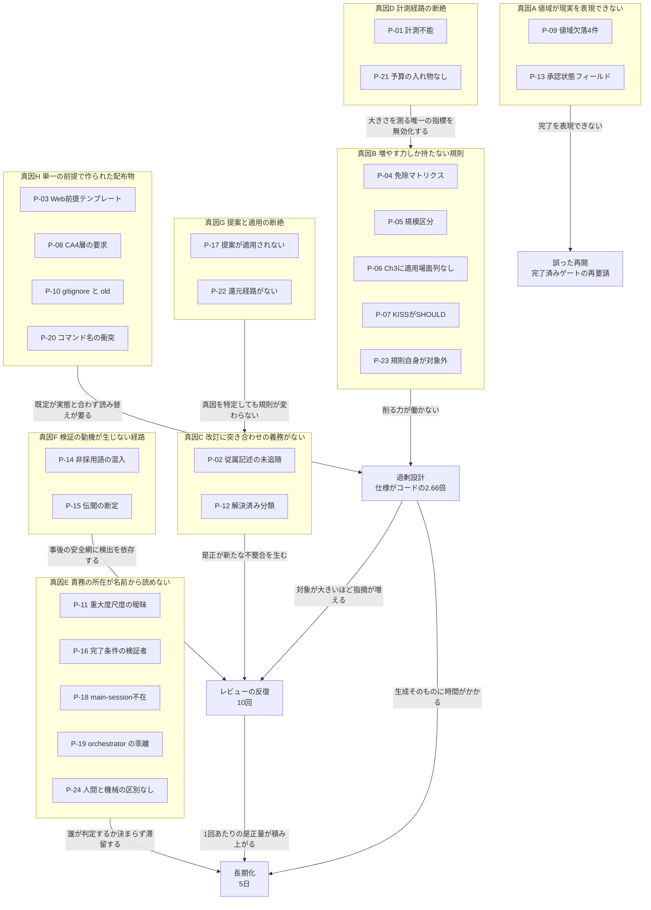
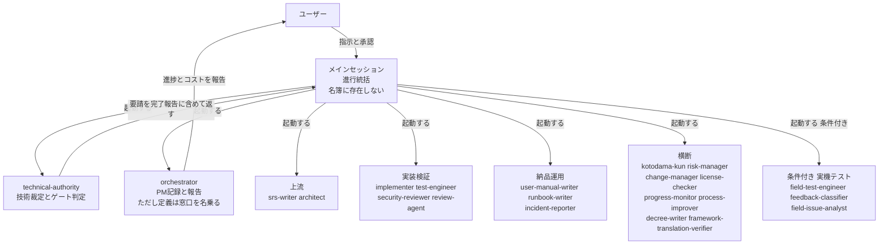
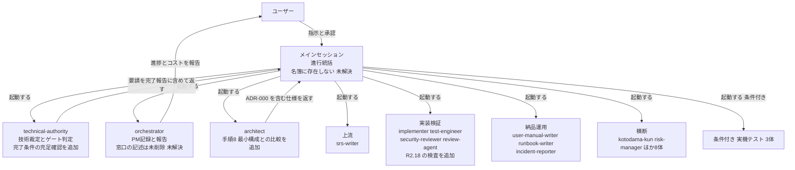
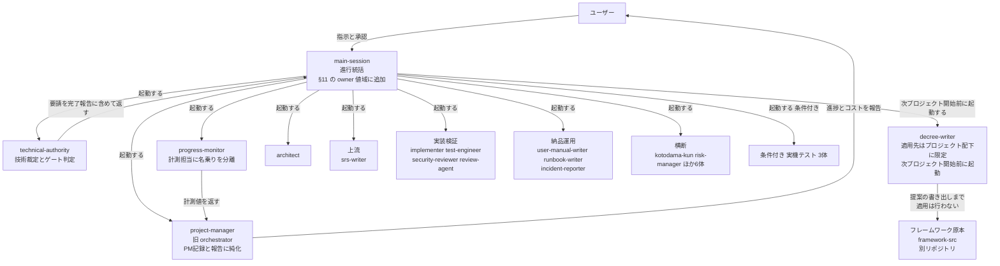

# gr-sw-maker 初回トライアル 総括レポート v3

**対象:** `gr-sw-maker-trial`（unit-converter-cli）。2026-07-26 開始、2026-07-30 完了、GATE-DELIVERY PASS。

**v3 での変更（重要）:**

| # | 内容 |
|:-:|---|
| 1 | **OKF の採用を決定した。** v2 §3.2 の「11 要素不採用」という結論は**仕様の誤読に基づくものであり、撤回する**（§3.2） |
| 2 | P-25（`form_block_cardinality` が削除されたまま移設されていない）を追加 |
| 3 | P-26（コンポーネントの公開面が未定義）と P-27（パッケージとライブラリの同居）を追加 |
| 4 | 着手順序を OKF 移行を含む形に更新 |

**v2 の誤りの性質:** 仕様の適合規則を「生産者への制約」と読んだが、実際には**消費者への制約**であった。**これは本試行で 3 回発生した「伝聞を検証せず断定へ変えた」型の誤りである（真因 F）。一次資料に当たって訂正した。

| 資料 | 反映先 |
|---|---|
| Claude Code システムプロンプト削減の分析（ai-revolution.co.jp） | **§3.1**、P-23、真因 B の対策 B-6 / B-7 |
| Open Knowledge Format (OKF) v0.2 仕様（GoogleCloudPlatform/knowledge-catalog） | **§3.2**、P-24 〜P-25、真因 A / E / F の対策 |
| 構造単位の包含関係とフォルダ構造（ユーザー提示） | P-26 / P-27。設計の詳細は `02-structural-unit-taxonomy.md` |

**方針:** 数値はすべて成果物からの実測である。

---

# 1. エグゼクティブサマリー

## 1.1 走行結果

| 項目 | 実測 |
|---|---|
| 最終判定 | **GATE-DELIVERY PASS**（TD-008、免除 0 件）。品質ゲート 6 件すべて PASS |
| defect | **0 件** |
| テスト | **198 件全件合格**（単体 165 / 結合 30 / 性能 3）。単体カバレッジ 3 指標とも **100.00%** |
| 期間 / 成果物 | **5 日** / `.md` **167 ファイル** |
| 仕様書 : コード | **3,958 行 : 1,486 行 = 2.66 : 1** |
| **フレームワーク自身の規模** | **11,264 行**（ja。CLAUDE.md 264 / agents 2,812 / process-rules 7,601 / commands 587） |
| waiver | **2 件**（TC-I-04 / CodeQL）。いずれもユーザー承認付き |
| トークン消費 | **全期間を通じて計測不能** |

## 1.2 問題一覧

**対策状況の値域:** `適用済み`（規則に反映）／ `部分適用`（一部のみ反映）／ `判断待ち`（案はあるが未決）／ `未着手`（案が未立案）

| # | フェーズ | 問題 | 対策 | 対策状況 | 備考 |
|:--:|---|---|---|:---:|---|
| P-01 | 全期間 | `session-state.json` が一度も生成されず、コスト・コンテキストが計測不能 | 原因調査（D-1）+ 経路断絶の検知機構（D-2） | **未着手** | FF-06。真因 D。**次走行前に必須** |
| P-02 | 全期間 | 改訂が従属記述に追随しない。design だけで新規 7 件 | **従属しやすい 4 種類を列挙**し改訂時の追随確認を義務づける（C-3） | **未着手** | FF-04。真因 C。**対照実験で実証済み** |
| P-03 | setup | CLAUDE.md テンプレートがサーバー / Web 前提で、CLI と 6 箇所衝突 | 既定値に「代替を採る場合の記録先」を併記（H-1） | **部分適用** | 真因 H |
| P-04 | setup | 免除マトリクス 13 行がすべて管理文書で、設計の深さを削らない | 規模ではなく**性質**で条件づける行に限定して追加（B-4） | **判断待ち** | C-1。真因 B |
| P-05 | setup | 規模区分が 1 段上に判定された | 判定手順に「テンプレートの例示との照合」を追加 | **判断待ち** | C-5。真因 B。副因 |
| P-06 | design | spec-template の Ch3 に「適用場面」列がない（Ch4 にはある） | Ch3 に適用場面列を追加（B-5） | **判断待ち** | C-2。真因 B。**不要な状態遷移図の直接原因** |
| P-07 | design | 過剰を指摘する観点（KISS / YAGNI）が SHOULD で、ゲートを止められない | R2.18 新設。最小構成との比較を MUST 化（B-3） | **適用済み** | C-4。真因 B。**本試行には未反映** |
| P-08 | design | Clean Architecture の 4 層が手順で「要求」として書かれていた | 要求を「依存の向きと中心の選択」に置き換え | **適用済み** | C-3b。真因 H |
| P-09 | 全期間 | 値域が現実の状態を表現できない。**4 件** | **値域設計の原則**を §9 に新設（A-2）+ 既知 5 件の修正 | **判断待ち** | FF-05 / FF-07 ほか。真因 A |
| P-10 | setup | `.gitignore` が規則の義務づけた保存先 `old/` を除外している | `old/` を除外対象から外す | **未着手** | FF-01。真因 H。**実バグ** |
| P-11 | setup | 「セキュリティ脆弱性 Critical: 0」がどの重大度尺度を指すか未定義 | SAST / SCA を指すと CLAUDE.md に明記 | **未着手** | FF-02。真因 E |
| P-12 | planning | 「解決済み」分類の内側に未点検の論点が残る | 分類の粒度自体を検証する観点を追加 | **未着手** | FF-03。真因 C |
| P-13 | planning | `spec-foundation` に章単位の承認状態を表すフィールドがない | 承認状態フィールドの新設 | **未着手** | FF-05。真因 A |
| P-14 | 全期間 | 非採用語の混入が **4 回**。delivery では宣言自体が自己矛盾 | **機械検査**（`tools/check-terms.mjs`）（F-4） | **未着手** | 真因 F。**最多かつ最安** |
| P-15 | 全期間 | 伝聞由来の断定が事後の安全網でしか検出されない | **OKF の `sources` を frontmatter に採用**（F-5） | **未着手** | 真因 F。**OKF 採用に含まれる** |
| P-16 | design | フェーズ完了条件（`test-plan`）を検証する者が未定義のまま次フェーズへ | ゲート判定要請にフェーズ完了条件の充足状況を添付 | **部分適用** | technical-authority が自ら定めたが**規則に未反映** |
| P-17 | 全期間 | ふりかえりの提案が一度も適用されない | 滞留の可視化（G-3）+ 次プロジェクト開始前の適用（G-2） | **判断待ち** | 真因 G |
| P-18 | 全期間 | メインセッションが名簿にも §11 にも存在しない | §11 の owner 値域に `main-session` を追加 | **判断待ち** | B-2。真因 E |
| P-19 | 全期間 | orchestrator の名前が実態と乖離。progress-monitor と同じ名乗り | 改名（`project-manager`）と名乗りの分離 | **判断待ち** | B-3 / B-4。真因 E |
| P-20 | 全期間 | コマンド名が世の中の一般名と衝突しうる | `development-handoff` の新設 | **判断待ち** | B-1 / B-6。真因 H |
| P-21 | setup | `budget_usd`（予算絶対額）の入れ物が CLAUDE.md にない | 行を新設する | **判断待ち** | 真因 D |
| P-22 | 全期間 | decree-writer の適用先が配布物であり、原本 `framework-src/` に届かない | **還元経路を作らず、責務の限界を定義に明記**（G-6） | **未着手** | 真因 G。v1 作成時に発見 |
| **P-23** | 全期間 | **フレームワーク自身が R2.18 の対象外。11,264 行が最小構成と比較されたことがない** | **規則追加の提案に最小構成の併記を義務づける**（B-6） | **未着手** | 真因 B。**v2 で新規**。記事の指摘により発見 |
| **P-24** | 全期間 | **人間の承認と機械の生成を区別する形式がない** | **OKF の actor 規約を採用**（E-5） | **未着手** | 真因 E。v2 で新規。**OKF 採用に含まれる** |
| **P-25** | 全期間 | **`form_block_cardinality` が削除されたまま §7 に移設されていない。** どの file_type が複数 Form Block を持つか不明 | **§7 に列は作らない。** 全 37 件が 1 であることを確認し、§4 に不変条件として MUST 記載（37 行すべて同値の列は情報を持たず、真因 B に逆行する） | **適用済み** | **v3 で新規**。C10-d。**OKF 移行に容器側の制約はないことが確定した** |
| **P-26** | design | **コンポーネントの公開面が未定義。** glossary §5 は「フォルダ」とだけ定め、外から何を参照してよいかを定めていない | 公開面と内部実装の分離を規定する | **未着手** | **v3 で新規**。設計は `02-structural-unit-taxonomy.md` |
| **P-27** | — | **glossary §5 の階層 5 が「パッケージ / ライブラリ」を同居させている。** 配布の器と実行形態は別軸 | 階層を分ける | **未着手** | **v3 で新規**。C10-b（risk と risk-register の同居）と同型 |

**適用済み 2 / 部分適用 2 / 判断待ち・未着手 23。**

---

# 2. 問題の依存関係

24 の問題は独立ではない。**8 つの真因に収束し、真因どうしにも依存がある。**

**問題と真因の依存関係:**



**読み方の要点は 4 つある。**

1. **真因 D（計測不能）は単独では害が小さいが、真因 B を見えなくする。** 大きさの悪化を検知する唯一の指標がコスト予算であり、それが全期間を通じて機能しなかった
2. **真因 G は真因 C の上流にある。** ふりかえりは真因 C を正しく特定していた。適用されなかったから再発した
3. **長期化は単一原因ではない。** 過剰設計とレビュー反復の 2 経路が合流し、さらに真因 E の滞留が加わる
4. **P-23 は真因 B の再帰的な現れである。** 規則が製品の過剰を止めるようになった（R2.18）が、**規則自身の過剰を止めるものがない**

---

# 3. 外部知見の適用可否

**両資料とも、主張をそのまま採らず gr-sw-maker の実測値と突き合わせた。結果として大半は不採用である。**

## 3.1 Claude Code システムプロンプト削減の分析

### 資料の主張

| 項目 | 内容 |
|---|---|
| 事実 | 2026-07-01、Claude Code のシステムプロンプトを約 **80% 削減**し、動作例の提示を廃止した（v2.1.154） |
| 削るもの | 禁止事項リスト／挙動パターンの網羅的列挙／思考プロセスの説明指示／ステップバイステップの手順書き下し／コードから導ける情報の転記 |
| 残す・増やすもの | 短い一文での方向づけ／ツール環境の提供／**なぜそれをやるのかという意図・目的・制約**／検証用サブエージェント／曖昧さの排除 |
| 中核概念 | "The models are grown, not designed"。詳細指示が**能力のオーバーハング**を生じさせ、伸びた能力を隠す |
| 原則 | **"Give the reason, not only the request"** |

### gr-sw-maker の実測との突き合わせ

**資料が名指しする削減対象は、gr-sw-maker のエージェント定義では実測すると軽い。**

| 資料が「削れ」と言う要素 | gr-sw-maker の実測（ja・22 体） | 判断 |
|---|---:|---|
| 禁止事項リスト（MUST NOT / 禁止） | **19 箇所**（22 体合計。1 体あたり 1 未満） | **削らない** |
| ステップバイステップの手順 | **217 行**（1 体あたり約 10 行） | **削らない** |
| 例示（出力例） | **6 体のみ** | **削らない。ただし増やさない** |
| 挙動パターンの網羅的列挙 | Exception 表。1 体あたり数行 | **削らない** |

**削らない理由は実証にある。** 2026-07-26 に追加したこれらの要素は、**本試行で効果が観測されている。**

| 観測された振る舞い | 対応する追加 |
|---|---|
| 値域にない値を創作しなかった（`verdict` に「非該当」がないため Detail Block で記述） | **出力例（4-6）と値域の明示（6-33）** |
| security-reviewer が判断不能を明記して報告し、作業を止めなかった | **停止させる Exception → 記録させる Exception（5-7）** |
| user-manual-writer が存在しない画像パスを書かなかった | **MUST NOT の明示（5-10）** |

**「能力がないのに指示がある場合は、指示を消さずに禁止を明示する」**という 2026-07-26 の判断原則は、**資料の「禁止事項リストを削れ」と正面から衝突する。** 本試行の実測は前者を支持している。

**なお、資料の対象は汎用コーディングエージェントのシステムプロンプトであり、gr-sw-maker のそれは開発方法論のドメイン規則である。** 同一視はできない。

### それでも 2 点は採用する

**採用 1 — "Give the reason, not only the request"。**

`prompt-structure` の設計原則 7 項目を確認したところ、原則 2「ゴールを知ってから手順に入る」が近いが、**これはエージェントに目的を与える規約であって、規則の各条に理由を書く規約ではない。**

本試行では、**理由が書かれていない規則が繰り返し読み替えを必要とした。** 例: CLAUDE.md テンプレートのサーバー前提の既定値（P-03）は 6 箇所で衝突し、その都度 decision による読み替えが要った。**「なぜその既定なのか」が書かれていれば、CLI では当てはまらないと即座に判断できた。**

**採用 2 — 足場が能力を隠す（P-23 の根拠）。**

**フレームワークは自身に対して最小構成の比較を課していない。**

```text
フレームワーク自身の規模（ja、毎プロジェクトに配布される）

CLAUDE.md            264 行
agents 22 体       2,812 行
process-rules 11   7,601 行   <-- 全体の 67 パーセント
commands 5           587 行
-----------------------------
合計              11,264 行

うち 2 文書で 4,755 行（process-rules の 63 パーセント）
  full-auto-dev-process-rules.md   2,896 行
  full-auto-dev-document-rules.md  1,859 行
```

**R2.18（最小構成との比較）は製品の設計に課した規則であり、フレームワーク自身は対象外である。** 11,264 行が「これより小さくできないか」と問われたことは一度もない。

**重要な限定:** これは「11,264 行が過剰である」という主張ではない。**過剰かどうかを問う機構がない**という主張である。議題1 で「規模は維持する」と決めた判断は有効であり、本項はその判断を覆すものではない。

## 3.2 Open Knowledge Format (OKF) v0.2 — **採用する**

### v2 の結論を撤回する

v2 は 13 要素中 11 を不採用とした。**その根拠 2 点はいずれも仕様の誤読である。**

| v2 の却下理由 | 仕様の原文 | 判定 |
|---|---|---|
| `type` は自由定義でなければならず、閉じた 37 種は使えない | *"Producers SHOULD pick values that are descriptive and self-explanatory; consumers MUST tolerate unknown types"* | **誤り。** 制約は**消費者**側であり、生産者が閉じた集合を使うことは禁じられていない |
| 適合規則が In の必須要素検査と衝突する | *"Consumers: MUST NOT reject a concept for missing any optional family (§5.3)"* | **誤り。** これは**消費者が §5-§10 の任意メタデータ族の欠落を理由に文書の受理を拒むこと**の禁止であり、業務上の前提条件とは層が違う |

さらに決定的な一文がある。

> *"Producers **MAY include any additional keys.** Consumers SHOULD preserve unknown keys when round-tripping and **MUST NOT reject documents with unrecognized fields.**"*

**独自キーは明示的に許可されている。** 必須は `type` のみであり、*"a concept carrying just `type` is fully conformant"* と明記されている。

**この誤り自体が真因 F の実例である。** 仕様の要約を受け取り、一次資料に当たらずに断定へ変えた。**成果物を改変する行為を伴わなかったため、検証の動機が生じなかった。**

### 対応関係

Common Block の 15 フィールドを突き合わせた。**3 つは直接対応し、12 は拡張キーとしてそのまま載る。**

| gr-sw-maker | OKF | 扱い |
|---|---|---|
| `file_type`（37 種） | **`type`** | **直接対応** |
| `summary` | **`description`** | **直接対応** |
| `created_by` + `created_at` | **`generated: {by, at}`** | **直接対応** |
| `document_status`（draft / in-review / approved / archived） | `status` は値域が違う（draft / stable / deprecated） | **拡張キーとして名前ごと維持。OKF の `status` は使わない**（値域の衝突を避ける） |
| `document_version` / `language` / `owner` / `commissioned_by` / `consumed_by` / `project` / `purpose` / `related_docs` / `schema_version` | — | **拡張キー。** `consumed_by` は YAML list になり、繰り返しタグ形式（C4）より素直になる |
| Form Block（file_type 固有） | — | **拡張キーとして名前空間ごとネスト** |
| Detail Block / Footer の change_log | 本文（自由形式 markdown） | **本文に残す** |
| — | **`sources`** | **新規採用**（真因 F。F-5） |
| — | **actor 規約** | **新規採用**（真因 E。E-5） |

### 採用の根拠

| # | 根拠 |
|:-:|---|
| 1 | **移植性。** 現行は独自の XML 風タグ（`<doc:document_version>`）＋ `<!-- FIELD: -->` コメントであり、**専用パーサが要る。** YAML frontmatter なら `yq`・Python・JS・GitHub 表示・各種エディタがそのまま読む。README が 7 プラットフォームの対応表を公開している以上、これは直接に効く |
| 2 | **運用負担の軽減。** `tools/check-tagnames.mjs` は**独自形式だからこそ必要**なツールである。YAML なら既存のスキーマ検証が使える。`<!-- FIELD: -->` コメントが §9 の表を複製している二重管理も消える |
| 3 | **自前発明を避けられる。** v2 で提案した F-1（一次資料の所在を併記する規約）は `sources` で置き換えられる |

### タイミングが決定的である

文書管理規則自身が次を定めている。

| 版 | 段階 | Common Block の変更 |
|---|---|---|
| **0.x.x** | **PoC 前** | **自由に変更可能** |
| MAJOR | — | **全管理対象ファイルの要マイグレーション** |

**現在 v0.0.0 Pre-release。「PoC 完了後に v1.0.0 へ昇格する」と明記されており、その PoC が本試行である。**

**やるなら今しかない。** v1.0.0 に上げてから移すと、以後すべてのユーザープロジェクトの全管理ファイルが移行対象になる。

### 唯一の本物の制約 — Form Block の複数配置

> **訂正（2026-08-01）— この制約は存在しなかった。P-25 の調査で確定した。**
>
> **§9 の 37 の file_type を全件確認した結果、複数の Form Block を持つものは 1 つもない。** 集合はすべて Detail Block の表にあり、Form Block が持つのは件数・状態・ID といった文書レベルの属性だけである。
>
> **§4 の「複数配置できる（例: テストケースの連続）」という記述自体が誤りであり、挙げられた例も誤っていた。** `test-plan` の Form Block は `test_case_count`（総数）を持ち、テストケースの一覧は §9.12 の指示どおり Detail Block の表にある。
>
> **実測でも裏づけた。** トライアル成果物 194 ファイルを走査し、**同一 file_type の Form Block を 2 つ以上持つファイルは 0 件**、いずれの名前空間もフィールドの重複出現は最大 1 回であった。
>
> **したがって YAML frontmatter（1 ファイル 1 つ）は全 file_type にそのまま適合する。OKF 移行に容器側の制約はない。** 下記「採用する解法」は、制約への対処ではなく**既に成立している事実の明文化**として framework-src に反映した（§4 に MUST として記載）。

**§4 に「Form Block は 1 ファイル内に複数配置できる（例: テストケースの連続）」とある。YAML frontmatter は 1 ファイルに 1 つだけである。**

さらに、**どの file_type が該当するかを現行の規則から特定できない**（P-25）。

**採用する解法:** frontmatter は**文書レベルの属性**を担い、複数エントリは**本文の表**が担う。1 概念 1 ファイルへの分割は採らない — ファイル数が跡ね上がり、**真因 B（増やす力しか働かない）に逆行する**ためである。

### 採用の範囲を明確にする

> **容器形式として OKF を採用する。** Common Block と Form Block を YAML frontmatter へ移し、`type` / `description` / `generated` / `sources` と actor 規約を用いる。ドメイン固有のフィールドは**拡張キー**として保持する。
>
> **使わないもの:** OKF の `status`（`document_status` と値域が異なる）、`stale_after`（時間ベースでは真因 C を解けない）、`log.md`（Footer の change_log で足りる）、`index.md`（CLAUDE.md と二重管理になる）。
>
> **`okf_version` は宣言する。** 生産者側の適合条件（全 `.md` が解析可能な frontmatter を持ち、非空の `type` を持つ）を満たすためである。**ただし満たしてから宣言する。移行前に宣言してはならない（MUST NOT）。**

---

# 4. 真因ごとの分析

各真因について、原因分析 → 真因の特定 → 対策案 → 比較検討 → 推奨案の順に記す。**v2 で対策が変わったものは明示する。**

## 4.1 真因 A — 値域が現実の状態を表現できない

**該当:** P-09, P-13

### 原因分析

同型の事象が **5 件**発生した。

| # | フィールド | 表現できなかった状態 | 現場の対処 |
|:-:|---|---|---|
| 1 | `tech-decision:verdict`（PASS / FAIL） | **非該当** | Detail Block に文章で記述（TD-003） |
| 2 | `tech-decision:verdict` | **CONDITIONAL** | 個別の説明文で補った |
| 3 | `final-report:total_cost_usd`（number 必須） | **計測不能** | **値域外と承知で `計測不能` と記録** |
| 4 | `pipeline-state` の全 15 フィールド | **プロジェクト完了** | **書き戻せず `pending` のまま放置**（FF-07） |
| 5 | `spec-foundation` | **章単位の承認済み** | decision による代替を設計（FF-05） |

**1〜3 と 5 では、エージェントが値域外であることを自覚し記録に残した。正しい振る舞いである。4 だけが記録に残らなかった** — 書き戻す先がなく、Phase 7 をスキップしたため遷移の契機も発生しなかった。

### 真因

**フィールド設計時に「観測されうる状態の集合」を列挙していない。** 正常系の値だけを列挙し、**未確定・非該当・計測不能・終了というメタ状態を値域に含めていない。**

### 対策案

| 案 | 内容 | 長所 | 短所 |
|:-:|---|---|---|
| **A-1** | 判明した 5 件を個別に修正する | 最小の変更 | **6 件目が同じように出る** |
| **A-2** | §9 に**値域設計の原則**を新設。「enum を定義するとき、非該当・未確定・計測不能・終了の 4 種のメタ状態が観測されうるかを検討し、値域に含めるか、含めない理由を記録する」 | 予防になる。新設 file_type にも効く | 既存 37 file_type は直らない |
| **A-3** | A-2 に加え、既存 37 file_type の全 enum を棚卸しする | 網羅的 | **顕在化していないフィールドまで触る。投機的** |
| **A-4**（v2 で追加） | OKF の `status`（draft / stable / deprecated）と `stale_after` を導入する | 標準語彙に寄る | **`document_status` と二重になる。** `stale_after` は時間ベースであり真因 C を解けない |

### 比較検討

**A-1 は却下する。** 5 件が同一の型であることは示されており、個別修正は 6 件目を招く。

**A-3 は優先度が合わない。** 顕在化していないフィールドの修正は投機であり、議題1 の「不備のある部分をメンテナンスする」方針から外れる。

**A-4 は却下する（v2 の判断）。** `document_status` が既に 4 値のライフサイクルを持っており、OKF の `status` を重ねると**どちらが正かが分からなくなる。** `stale_after` は「いつ古くなるか」を時間で表すが、**本試行で起きたのは「上流が変わったから古くなった」という依存の問題**であり、時間では捉えられない。**採用すれば誤った安心を与える。**

### 推奨案

> **A-2 を採り、あわせて判明済みの 5 件を修正する（A-1 との併用）。**

原則を先に置き、既知の 5 件をその適用例として直す。**原則が先にあれば 5 件の直し方が揃う。**

**FF-07 だけは優先度が高い。** 実害があり、いま再開すると完了済みゲートを再要請する。**`project_status`（値域: `in-progress` / `completed` / `aborted`）の新設を推奨する。** `phase` の値域を 0-8 に拡張する案は**採らない** — フェーズでないものをフェーズの値域に入れることになり、同じ型の誤りを繰り返す。

## 4.2 真因 B — 規則が「増やす」方向にしか力を持たない

**該当:** P-04, P-05, P-06, P-07, **P-23**

### 原因分析

4 つの独立した観測が同じ方向を指した。

1. **免除マトリクス 13 行がすべて管理文書または検証活動**である。仕様の章・図の種類・コンポーネント粒度・層数に触れる行が 1 行もない
2. **architect の手順は全部「作る」動詞**であった。削る・見直す・より単純な案と比較するに相当する手順が存在しなかった
3. **品質目標 11 指標のうち、設計が大きくなると悪化するのはコスト予算 1 つだけ**であり、それは真因 D により機能しなかった
4. **（v2 で追加）フレームワーク自身が 11,264 行あり、最小構成と比較されたことがない**

そして粒度に働く力が非対称である。**R2.2 SRP は MUST（分割を増やす）、R2.8 KISS と R2.9 YAGNI は SHOULD（分割を減らす）。** §9.1.2 が MUST → High / SHOULD → Medium と写像し、ゲートは Critical / High = 0 で止まる。**増やす力だけがゲートを止められる。**

### 真因

**「足りない」は検出でき「多すぎる」は検出できない構造になっている。** 過剰を指摘する観点がすべて主観的で、客観的な MUST に書けなかったことが原因である。

**そして同じ構造がフレームワーク自身にも適用されている。** 規則を足す提案には根拠が要るが、**足さない選択肢を検討した証拠は求められない。**

### 対策案

| 案 | 内容 | 長所 | 短所 |
|:-:|---|---|---|
| **B-1** | KISS / YAGNI を MUST に格上げする | 単純 | **§9.1.2 の写像に例外を作る。** 判定が主観的なまま High になる |
| **B-2** | 品質目標にサイズ指標を追加する | 数値で止まる | **妥当な閾値を誰も知らない。** 分母となるコスト計測も動いていない |
| **B-3** | 過剰を「比較の欠落」に変換する（R2.18 + ADR-000） | **判定が客観的。** 写像に触れない。**生成時に発火** | 比較の**内容**の妥当性は保証しない |
| **B-4** | 免除マトリクスに設計成果物の行を追加する | 規模と設計の深さが連動する | **どの図を削ってよいかは規模だけでは決まらない** |
| **B-5** | spec-template の Ch3 に「適用場面」列を追加する | **Ch4 に既にある仕組みの水平展開** | Ch3 だけでは Ch5 / Ch6 に効かない |
| **B-6**（v2 で追加） | **規則の追加提案に「最小構成の併記」を義務づける。** `framework-development.md` に「規則を追加する提案には、(1) 追加しない場合に何が起きるか (2) より小さい代替案 (3) 採らなかった理由 を併記する」を MUST として置く | **R2.18 の自己適用。** 既存の考え方の水平展開で新機構が要らない | フレームワーク開発の速度が落ちる |
| **B-7**（v2 で追加） | **規則の各条に「なぜ」を併記する規約**（資料の "Give the reason"） | **読み替えが要る場面で即座に判断できる。** P-03 の 6 箇所はこれで防げた | 記述量が増える。**真因 B と逆行しうる** |

### 比較検討

**B-1 と B-2 は却下する。** 理由は v1 から変わらない。

**B-3 / B-5 は競合しない。** 効く層が異なる（設計全体 / 章と図）。

**B-4 には注意が要る。** 「Micro なら状態遷移図を免除」は誤りで、Micro でも状態機械を持つアプリはある。**規模ではなく性質で条件づけるべき**であり、それは B-5 が既にやっている。**したがって B-4 は「性質に依存しないもの」（Ch6 の自己証明など）に限定する。**

**B-6 と B-7 は互いに緊張関係にある。** B-7 は記述量を増やす提案であり、**B-6 を適用すれば B-7 自身が「より小さい代替案」を問われる。** これは矛盾ではなく、**B-6 が正しく働いている証拠**である。

**B-7 の適用範囲を限定する。** 全条文に理由を書くと 11,264 行がさらに増える。**「既定値」と「MUST」に限る。** 本試行で読み替えが必要になったのはいずれも既定値であり、争点になったのはいずれも MUST であった。

### 推奨案

> **B-3（適用済み）に B-5、B-6 を続ける。B-4 は性質に依存しないものに限定。B-7 は既定値と MUST に限定して適用する。**

| 順 | 案 | 状態 |
|:-:|---|---|
| 1 | **B-3** 最小構成との比較（R2.18 + ADR-000 + architect 手順 8） | **適用済み** |
| 2 | **B-5** Ch3 に適用場面列。3.4 の状態遷移図は「持続する状態を持つアプリ」を条件とする | 推奨 |
| 3 | **B-6** 規則追加の提案に最小構成を併記（P-23） | 推奨 |
| 4 | **B-7** 既定値と MUST に「なぜ」を併記 | 推奨（範囲限定） |
| 5 | **B-4** 免除マトリクスへの追加は性質に依存しないものに限る | 限定的に推奨 |

**B-3 の限界を明記する。** R2.18 が保証するのは「比較を記録した」ことであって「比較の結論が正しい」ことではない。**これは議題3 の「内容の妥当性は LLM 判断であり明示的に受容する」と同型であり、意図的な受容である。**

## 4.3 真因 C — 改訂に突き合わせの義務がない

**該当:** P-02, P-12

### 原因分析

**本試行が意図せず対照実験になった。**

| 時点 | 出来事 |
|---|---|
| planning 完了 | retrospective-002 が本パターンを**構造的**と判定。根拠 2 件 |
| 規則側の手当て | **なし** |
| design 完了 | 同一パターンが**新たに 7 件** |

**再発は偶然ではなく帰結である。** FF-04 は「本命と見ているが未検証」から**実証済み**に上がった。

### 真因

**改訂を「差分の適用」としてのみ扱い、「既存記述との整合の再確認」を伴う操作として定義していない。** `change_log` は何を変えたかを記録するが、**変えたことで従属記述が古くなったかは誰も見ない。**

### 対策案

| 案 | 内容 | 長所 | 短所 |
|:-:|---|---|---|
| **C-1** | 改訂時に「影響する既存記述の一覧と追随の要否」を `change_log` に記録することを MUST とする | 既存の仕組みに載る | **見落としたものは書かれない** |
| **C-2** | review-agent に「改訂差分と従属記述の突き合わせ」を観点として追加する | 第三者が見る | **事後。** 本試行と同じ形 |
| **C-3** | **従属しやすい記述の種類を列挙**し、改訂時にその種類ごとの追随確認を architect の Procedure に置く | **生成時に発火。** 対象が具体的 | 列挙にない種類は漏れる |
| **C-4** | トレーサビリティを機械化する（参照グラフで影響先を算出） | 漏れない | **ANGS 相当の基盤が要る。過大** |
| **C-5**（v2 で検討） | OKF の `stale_after` を用いる | 標準語彙 | **却下。** 時間ベースであり依存ベースの問題を解けない |

### 比較検討

**C-4 は現段階では過大である。** ANGS は研究段階として enum から外したばかりであり、ここだけ先行させる理由がない。

**C-1 単独は弱い。** 本試行の 7 件はいずれも改訂時に気づかなかったものである。**気づかなかったものは自己申告に出てこない。**

**C-2 は効くが遅い。** 実際に 7 件は再レビューで検出された。**検出はできている。問題は遅いことと、是正がまた新たな不整合を生むこと。**

**C-5 は却下する（v2 の判断）。** `stale_after` は「日付を過ぎたら再確認せよ」であり、**「上流が変わったから古くなった」を表現できない。** 本試行の 7 件はいずれも同一セッション内の改訂で発生しており、日付では捉えられない。

**C-3 が最も上流に効く。** 7 件の内訳が偏っているため列挙が現実的である。

### 推奨案

> **C-3 を主とし、C-1 を補助として併用する。C-2 は現状のまま。**

C-3 の列挙候補（本試行の実績から導出）:

| 種類 | 本試行での件数 |
|---|:-:|
| 図（クラス図・シーケンス図・状態遷移図・分岐図） | **4** |
| ADR の Consequences | 1 |
| 本文中の「影響」を述べた行 | 1 |
| コード内の識別子 | 1 |

**この 4 種類を追随確認の対象として明記する。** そのうえで C-1 として「確認した種類と結果」を `change_log` に記録させる。**自己申告だが、対象が列挙されていれば「確認していない」ことが可視になる。**

## 4.4 真因 D — 計測経路の断絶

**該当:** P-01, P-21

### 原因分析

`tools/session-meter.mjs` と `.claude/settings.json`（statusLine 登録済み）は**トライアル環境に存在した。** それでも `session-state.json` は **7 フェーズ + delivery を通じて一度も生成されなかった。** 原因は未特定である。

### 真因

**計測経路が「動かなくても誰も気づかない」構造である。** statusLine が失敗しても、ファイルが生成されないだけで、**エラーもアラートも出ない。**

議題2 は案 B を「設定ファイル 1 つの欠落で無言で壊れる」という理由で却下した。**議題8 で新設した計測経路が、まさにその失敗モードを持っていた。**

### 対策案

| 案 | 内容 | 長所 | 短所 |
|:-:|---|---|---|
| **D-1** | 原因を調査して修正する | 根本的 | **環境依存なら修正できない可能性がある** |
| **D-2** | 経路の断絶を**検知**する仕組み（フェーズ境界で存在と鮮度を検査） | **原因が分からなくても効く** | 検知するだけで計測はできない |
| **D-3** | 計測を諦め、閾値を規則から削除する | 実行不能な指示が消える | **判断原則に反する** |
| **D-4** | 代替の計測経路（usage ブロック / transcript 解析） | 冗長性 | **議題8 で却下済み。根拠は変わっていない** |

### 比較検討

**D-3 と D-4 は却下する。**

**D-1 は必要だが十分ではない。** 修正できても次に壊れたときにまた無言で止まる。

**D-2 は D-1 が失敗しても価値が残る。** 本試行では orchestrator が毎フェーズ「計測不能」を記録し続けた — **人間の目には見えていた。それが 5 日間放置されたのは、警告として扱われなかったからである。**

### 推奨案

> **D-1 と D-2 を両方行う。順序は D-1 が先。**

**D-1 を先にする理由:** 原因が単純なものなら D-2 の設計が変わる。**調査 30 分の価値が検知機構の設計を左右する。**

**D-2 の設計方針:** ゲート判定の入力に `session-state.json` の存在と鮮度を含める。**欠落を FAIL にはしない**が、**tech-decision に「計測不能」を明示的に記録させる。**

**P-21 は独立に処理してよい。** CLAUDE.md に `budget_usd` の行を新設する。**ユーザーが「設定しない」と決めるのは自由だが、決める場所がないのは別の問題である。**

## 4.5 真因 E — 責務の所在が名前から読めない

**該当:** P-11, P-16, P-18, P-19, **P-24**

### 原因分析

5 つの事象はいずれも「誰が決めたのか」が読み取れないことに帰する。

| # | 事象 |
|:-:|---|
| P-11 | 「セキュリティ脆弱性 Critical: 0」が 3 つの重大度尺度のどれを指すか規則に書かれていない |
| P-16 | フェーズ完了条件を検証する者が定義されていない |
| P-18 | メインセッションが名簿にも §11 にも存在せず、「書く」主体になれない |
| P-19 | `orchestrator` が世の中の通例と異なる役割を持ち、progress-monitor と**同じ第一行**を名乗る |
| **P-24**（v2 で追加） | **`change_log` の `by=` にエージェント名しか入らず、人間の承認と機械の生成を区別できない** |

**P-24 の実例:** 本試行では waiver 2 件がユーザー承認を得ているが、その承認は decision の本文にしか現れない。**「この判断を人間が確認したか」を機械的に判定する手段がない。**

### 真因

**責務も承認主体も、定義文と本文にしか書かれておらず、構造化された場所から読み取れない。** 読む主体は LLM であり、名前は学習データ由来の事前分布を呼び出す。

### 対策案

| 案 | 内容 | 長所 | 短所 |
|:-:|---|---|---|
| **E-1** | 定義本文の矛盾だけ直す（窓口記述の削除、名乗りの分離） | **影響が小さい。数行** | 名前と実態の乖離は残る |
| **E-2** | `orchestrator` → `project-manager` に改名し、`main-session` を §11 に加える | 名前が実態に一致する | **517 箇所 / 72 ファイル。** 過去記録との対応が切れる |
| **E-3** | メインセッションを `orchestrator` と呼ぶ（入れ替え） | 通例に一致 | **過去記録の同じ語が別物を指す。改名より悪い** |
| **E-4** | P-11 と P-16 だけ直し、名前は据え置く | 実害のあるものだけ直る | 名前の問題が再発する |
| **E-5**（v2 で追加） | **OKF の actor 規約を採用する。** `change_log` の `by=` と decision の承認者を `human:<id>` / `process:<id>` / `<agent-name>` の 3 形式に統一する | **人間の承認が機械判定できる。** 標準語彙であり自前発明でない。**議題2b の「作る人・検査する人・決める人」を成果物側で表現できる** | 既存記録との併存期間が生じる |

### 比較検討

**E-3 は却下する。名前は退役させてよいが、意味をすげ替えてはならない。**

**P-11 と P-16 は名前の問題と独立であり、E-2 の判断を待つ理由がない。**

**E-5 は E-2 と独立に効く（v2 の判断）。** 改名するかどうかに関わらず、**誰が承認したかを構造化する価値は変わらない。** かつ OKF の信頼階級（unverified / machine-confirmed / human-reviewed）は、**本フレームワークが議題2b で分離した 3 主体を、成果物の側から検証可能にする。**

**ただし OKF の `verified` フィールドは新設しない。** レビュー結果は `review` file_type が持っており、フィールドを重ねると二重管理になる。**借りるのは actor の表記規約と階級の概念だけである。**

### 推奨案

> **E-1・P-11・P-16・P-18・E-5 を先に行い、E-2 は独立した change-request として扱う。**

| 順 | 内容 | 規模 |
|:-:|---|---|
| 1 | orchestrator の「窓口として機能する」を削除、progress-monitor の名乗りを計測担当に変更 | 4 行（ja / en） |
| 2 | P-11: 「セキュリティ脆弱性 Critical: 0」は SAST / SCA を指すと明記 | 1 行 |
| 3 | P-16: フェーズ完了条件の充足状況をゲート判定要請に添えることを規則化 | 数行 |
| 4 | P-18: §11 の owner 値域に `main-session` を追加 | 2 箇所 |
| 5 | **E-5: actor 規約の採用**（`human:` / `process:` / エージェント名） | 文書管理規則 §4 相当 + change_log の記法 |
| 6 | **E-2 の改名** | **単独のコミット群。次走行の前後を別途判断** |

## 4.6 真因 F — 検証の動機が生じない経路がある

**該当:** P-14, P-15

### 原因分析

retrospective-003 §4-2 が明快な非対称を報告している。

| 状況 | 件数 | 検出できたか |
|---|:-:|---|
| 受け手が**成果物を改変する**行為を求められた | 3 | **実害の前に検出** |
| 記録として受け渡された**伝聞由来の断定** | 3 | **事後の網でのみ検出** |

**実例（final-report より）:** 性能値の出所が争点になり、「本報告では一次資料の値を用いる。**77.051 ms / 81.146 ms という再実行値が存在するが、いずれも報告書に反映されていないため本報告には用いない**」と明記せざるを得なかった。**どの数値がどこ由来かを記録する形式がなかった。**

非採用語の混入（P-14）は同じ構造の別の面である。**4 フェーズで独立に発生し、delivery では宣言そのものが自己矛盾する構造に 4 つの書き手が独立に踏み込んだ。**

### 真因

**「一次資料に当たれ」という規律が、当たる動機のある場面でしか働かない。** 改変を求められれば現物を見るが、**そのまま受け渡すだけなら見ない。**

### 対策案

| 案 | 内容 | 長所 | 短所 |
|:-:|---|---|---|
| **F-1**（v1 の案） | 「引用する数値・断定は一次資料の所在を併記する」規約を自前で作る | 動機を経路に埋め込む | **自前発明。** 記法が定まらず書き手ごとにばらつく |
| **F-2** | review-agent の観点に「伝聞の断定」を追加 | 第三者が見る | **事後。現状と変わらない** |
| **F-3** | kotodama-kun を成果物生成ごとに起動する | 非採用語に効く | **議題2 で削減したばかり。逆行する** |
| **F-4** | 非採用語の一覧を機械検査にする | **確実で安価** | 非採用語に限る |
| **F-5**（v2 で追加） | **OKF の `sources` を Common Block に採用する。** `sources: [{ id, resource, author, last_modified }]` + 本文からは `id` で引用する | **仕様が既にある。** 自前発明を避けられる。**信頼シグナル（作成者・最終更新）が付く。** 性能値の出所問題がそのまま解ける | Common Block が 1 フィールド増える |

### 比較検討

**F-3 は却下する。** 起動回数の削減は議題2 の決定であり、覆す根拠がない。

**F-2 は既に実質的に機能している**（本試行では再レビューが検出した）。追加の価値は小さい。

**F-1 は F-5 に置き換える（v2 の判断）。** やりたいことは同一だが、**F-1 は記法を自前で決めることになり、書き手ごとにばらつく。** OKF の `sources` は `resource` を必須とし、`id` による本文からの引用を定めており、**そのまま使える。** 「標準があるものを自前で作らない」は本フレームワーク自身の判断原則（議題4 で `README` を GitHub の慣行に合わせた判断と同型）と整合する。

**F-4 と F-5 は対象が異なり併用できる。** F-4 は**機械的に判定できる**対象（非採用語）に、F-5 は**機械では判定できない**対象（伝聞）に効く。

### 推奨案

> **F-4 を先に、F-5 を次に。**

**F-4 が先の理由:** 非採用語は 4 回発生し、かつ**用語集に一覧が既にある。** `tools/check-terms.mjs` を書けば CI とプリコミットで止まる。**最多の事象を最安で潰せる。**

**F-5 の適用範囲を限定する。** すべての記述に `sources` を求めると記述量が膨らみ、真因 B と逆行する。**対象を「数値」と「他者の判断の引用」に限る。** 本試行で問題になったのはこの 2 種のみである。

## 4.7 真因 G — 提案と適用が切れている

**該当:** P-17, P-22

### 原因分析（その 1 — P-17）

process-improver は 3 回のふりかえりで **24 件**の改善策を提案した。**すべて `proposed` のまま、一度も適用されなかった。**

これはユーザーの方針による**意図的なもの**であり、フレームワークの不具合ではない。**しかし結果として真因 C が手当てされないまま design で 7 件再発した。**

### 原因分析（その 2 — P-22）

**decree-writer の適用先に `framework-src/` が一度も現れない。**

```text
framework-src/ja/agents/decree-writer.md の承認テーブル

| CLAUDE.md                        | ユーザー      |
| エージェント定義（.claude/agents/） | orchestrator |
| process-rules/                   | ユーザー      |
```

**`.claude/agents/` と `process-rules/` はユーザープロジェクトでは `setup.js` の出力（配布物）である。** 原本は `framework-src/{lang}/` にあり、適用先に現れない。

したがって **decree-writer が適用しても、次に `setup.js` を走らせれば原本のコピーで上書きされて消える。** **フレームワークを回して見つけた改善が、フレームワーク自身の仕組みでは原本に戻れない。**

**本セッションで C-3b と C-4 を手で `framework-src/` に当てていたのは、この経路を迂回していたからである。**

### 真因

**decree-writer の起動条件と適用範囲がどちらも未定義である。** 「いつ承認を求め、いつ適用するか」を定める規則がなく、既定は「起動しない」になる。かつ**適用先がプロジェクト配下に閉じていることが定義に書かれていない**ため、還元されるかのように読める。

### 対策案

| 案 | 内容 | 長所 | 短所 |
|:-:|---|---|---|
| **G-1** | フェーズ完了ごとに decree-writer を起動する | 再発が早期に止まる | **試行中に規則が変わる。走行の一貫性が失われる** |
| **G-2** | 「構造的」と判定された提案のみ**次のプロジェクト開始前**に適用する | 一貫性が保たれる | 同一プロジェクト内の再発は防げない |
| **G-3** | 提案の**滞留を可視化**する（未適用件数と最古の提案日を `final-report` に必須記載） | 忘れられなくなる | 適用はされない |
| **G-4** | G-2 + G-3 | 一貫性を保ちつつ滞留を防ぐ | 同一プロジェクト内の再発は残る |
| **G-5** | decree-writer の適用先に `framework-src/` を追加する | 経路が閉じるように見える | **閉じない。** ユーザープロジェクトの `framework-src/` を書き換えても**フレームワークのリポジトリには戻らない** |
| **G-6** | **フレームワーク改善はフレームワーク側の作業と定義し、プロジェクトからは提案の書き出しまでとする** | **役割の分離が明確。** 現に行っていることの形式化 | 手作業の持ち出しが残る |

### 比較検討

**G-1 は却下する。** 走行中にフレームワークを書き換えると、その走行が「どの版で走ったか」を失う。**本試行で既に起きている。**

**同一プロジェクト内の再発を防ぐことと、走行の一貫性を保つことは両立しない。** 本試行は一貫性を取ったことで対照実験としての価値を得た。**7 件の再発はその対価である。**

**G-5 は却下する。** 経路が閉じたように見えて閉じない。**プロジェクトからフレームワークのリポジトリへ書き込む手段は存在せず、作るべきでもない。**

### 推奨案

> **G-4（G-2 + G-3）と G-6 を採る。同一プロジェクト内の再発は明示的に受容する。**

**受容する理由を記録に残すことが重要である。** 「防げるのに防がない」のではなく「**走行の一貫性と引き換えに受容している**」と書く。書かなければ、次に同じ再発を見たときに欠陥として再発見される。

**G-6 の具体:** decree-writer の定義に「**本エージェントの適用先はプロジェクト配下のガバナンスファイルに限る。フレームワーク原本（`framework-src/`）への反映は本エージェントの責務ではない**」を明記する。**現状は書かれていないため、還元されるかのように読める。**

## 4.8 真因 H — 単一の前提で作られた配布物

**該当:** P-03, P-08, P-10, P-20

### 原因分析

4 件はいずれも「フレームワークが単一の世界を前提にしている」ことの帰結である。

| # | 前提 | 現実 |
|:-:|---|---|
| P-03 | プロジェクトはサーバー / Web アプリである | CLI では 6 箇所が衝突し、その都度 decision で読み替えた |
| P-08 | アーキテクチャは Clean Architecture の 4 層である | 層の数は設計判断であり 3 でも 5 でも成立する |
| P-10 | `old/` は作業ゴミである | 文書管理規則が**改版時のアーカイブ先として義務づけている** |
| P-20 | コマンド名の空間には gr-sw-maker しかいない | 他プラグイン・他スキルと同じ名前空間に並ぶ |

### 真因

**既定値を「唯一の値」として書いている。** テンプレートは既定を示すつもりで、**代替の書き方を示していない。** 読む主体は LLM であり、既定しか書かれていなければ既定に従う。

### 対策案

| 案 | 内容 | 長所 | 短所 |
|:-:|---|---|---|
| **H-1** | 既定値のそばに必ず「これは既定であり、変える場合はどこに記録するか」を併記する | **横断的に効く。追加機構が要らない** | 記述量が増える |
| **H-2** | プロジェクト・アーキタイプ別の既定値セットを持つ | 衝突が構造的に消える | **アーキタイプ数 × セクション数の保守。規模が増える** |
| **H-3** | 個別に直す | 確実 | **5 件目が同じように出る** |

### 比較検討

**H-2 は規模が合わない。** 議題1 で「規模は維持する」と決めており、アーキタイプ別の既定値セットは実質的にテンプレートの複製である。

**H-1 は P-08 で既に実践した。** CA の記述を「4 層に分類する」から「依存の向きと中心の選択が要求であり、4 は既定の語彙であって要求ではない」に改め、**代替を採る場合の記録先（Ch3.1）を明示した。** この形が横展開できる。

**H-1 は §4.2 の B-7（理由を併記する）と同じ方向を向いている。** 既定値に「なぜその既定なのか」と「変える場合どうするか」を併記すれば、両方が満たされる。**2 つの対策を 1 つの記法で実現できる。**

**P-10 と P-20 は H-1 で解けない。** 前者は `.gitignore` の実バグ、後者は外部との名前空間衝突であり、**個別対応が要る。**

### 推奨案

> **H-1 を原則として採り（B-7 と統合）、P-10 と P-20 は個別に直す。**

| 対象 | 対応 |
|---|---|
| P-03 CLAUDE.md テンプレート | **H-1 + B-7。** 既定値に理由と代替の記録先を併記 |
| P-08 CA の 4 層 | **適用済み** |
| P-10 `.gitignore` の `old/` | **個別。** 除外対象から外す。**規則が義務づけた保存先を捨てているのは実バグ** |
| P-20 コマンド名 | **個別。** `development-handoff` を新設 |

---

# 5. エージェント体制

## 5.1 トライアル開始前

**体制図（トライアル開始前）:**



**22 体。** メインセッションは起動権を持つ唯一の主体として定義されているが、**名簿にも §11 にも存在しない。**

## 5.2 現在（トライアル中に実施した改善）

**体制そのものは変わっていない。変わったのは責務である。**

**体制図（現在）:**



**22 体のまま。** 増減なし。

## 5.3 今後の改善案

**体制図（改善案）:**



**22 体のまま。改名と責務の明確化のみで、増減はない。**

## 5.4 責務一覧（現在）

| # | エージェント | 責務 | model |
|:-:|---|---|---|
| 1 | orchestrator | 進行状態の記録、PM 情報の統合、ユーザーへの報告 | opus |
| 2 | srs-writer | ユーザーコンセプトの構造化、インタビュー、仕様書 Ch1-2 作成 | opus |
| 3 | architect | 仕様書 Ch3-6 詳細化、OpenAPI・可観測性・外部依存要求の設計 | opus |
| 4 | security-reviewer | 脅威モデリング、セキュリティ設計、脆弱性スキャン | opus |
| 5 | implementer | ソースコード実装、単体テスト作成 | opus |
| 6 | test-engineer | テスト計画・実行、カバレッジ計測、性能テスト | sonnet |
| 7 | review-agent | R1-R7 観点での品質レビュー、重大度付き指摘の起票 | opus |
| 8 | progress-monitor | WBS 管理、進捗追跡、品質メトリクス監視、異常検知 | sonnet |
| 9 | change-manager | ユーザー起点の変更要求の受付・影響分析・記録 | sonnet |
| 10 | risk-manager | リスク特定・評価・監視、リスク台帳管理 | sonnet |
| 11 | license-checker | OSS ライセンス互換性確認、帰属表示管理 | haiku |
| 12 | kotodama-kun | 用語・命名の整合性チェック | sonnet |
| 13 | framework-translation-verifier | フレームワーク文書の多言語間翻訳一致性を検証 | sonnet |
| 14 | user-manual-writer | ユーザーマニュアルの作成 | sonnet |
| 15 | runbook-writer | 運用手順書の作成 | sonnet |
| 16 | incident-reporter | インシデント報告書の作成 | sonnet |
| 17 | process-improver | ふりかえり・根本原因分析・プロセス改善策の提案 | sonnet |
| 18 | decree-writer | 承認済み改善策のガバナンスファイルへの安全な適用 | sonnet |
| 19 | field-test-engineer | 実機テスト、フィードバック記録、修正後の実機検証 | sonnet |
| 20 | feedback-classifier | フィードバックを defect / CR / 質問に分類 | sonnet |
| 21 | field-issue-analyst | 原因分析、対策立案、影響範囲・副作用・代替案比較 | opus |
| 22 | technical-authority | 技術判断の裁定、整合保証、品質ゲート判定 | opus |

## 5.5 3 状態の差分

**変化のあるものだけを示す。上表の他 14 体は 3 状態を通じて変化しない。**

| 主体 | トライアル開始前 | 現在 | 今後の改善案 |
|---|---|---|---|
| **メインセッション** | 起動権を持つ唯一の主体。**名簿にも §11 にも不在** | 変化なし（**未解決**） | **`main-session` として §11 の owner 値域に追加。** `development-handoff` の唯一の書き手 |
| **orchestrator** | PM 記録と報告。ただし定義は**「ユーザーとエージェント群の間の窓口として機能する」と名乗る**（実行不能） | 変化なし（**未解決**） | **`project-manager` に改名。** 窓口の記述を削除し PM に純化 |
| **progress-monitor** | 計測担当。ただし第一行が orchestrator と**同一文** | 変化なし（**未解決**） | 名乗りを**計測担当**に変更 |
| **architect** | Ch3-6 の詳細化（手順 0-12）。**削る手順が存在しない** | **手順 8「最小構成と比較する」を新設**（手順 0-13） | 変化なし |
| **review-agent** | R1-R7。**過剰を指摘できるのは SHOULD の KISS / YAGNI のみ** | **R2.18（MUST）を追加。** ADR-000 の存在と内容を検査 | 変化なし |
| **technical-authority** | 技術裁定とゲート判定 | フェーズ完了条件の充足確認を**自ら恒久対策として追加**（**規則には未反映**） | 規則に反映する |
| **decree-writer** | 承認済み改善策の適用。**起動条件が未定義。適用範囲も未定義** | 変化なし（**24 件が未適用のまま滞留**） | **適用先をプロジェクト配下に限ると明記**（G-6）。**次プロジェクト開始前の起動を規則化**（G-2）。滞留件数を `final-report` に必須記載（G-3） |
| **全エージェント共通** | `change_log` の `by=` はエージェント名のみ | 変化なし | **OKF の actor 規約を採用**（`human:` / `process:` / エージェント名）（E-5） |

---

# 6. 推奨する着手順序

| 順 | 内容 | 真因 | 根拠 |
|:-:|---|:-:|---|
| **1** | **P-01 計測経路の原因調査**（D-1） | D | **次走行を測れる状態にしないと、また「重い気がするが測れない」で終わる** |
| **2** | P-01 の検知機構（D-2）、P-21 予算の入れ物 | D | 原因が分かってから設計する |
| **3** | **FF-07 `project_status` の新設**（A-2 + A-1） | A | **実害がある。** いま再開すると完了済みゲートを再要請する |
| **4** | E-1 の 4 行 + P-11 + P-16 + P-18 | E | いずれも数行。名前の問題と独立に効く |
| **5** | **P-25 の解消。** 37 file_type の Form Block 個数を確定し §7 に列を復活させる | — | **OKF 移行の範囲がこれで決まる。先にやらなければ見積もれない** |
| **6** | **OKF への移行。** Common Block + Form Block を frontmatter へ。`sources`（F-5）と actor 規約（E-5）を**同時に**入れる | E, F | **v0.0.0 Pre-release のうちだけ Common Block を自由に変えられる。移行を 2 回に分けない** |
| **7** | C-3 改訂時の追随確認（図 4 種の列挙） | C | **実証済みの真因。** 対象が具体化できている |
| **8** | F-4 非採用語の機械検査 | F | **最多かつ最安** |
| **9** | B-5 Ch3 に適用場面列 | B | 過剰設計の直接原因 |
| **10** | **B-6 規則追加への最小構成の併記 + B-7 既定値と MUST に理由を併記**（H-1 と統合） | B, H | **R2.18 の自己適用。** 記法を 1 つにまとめる |
| **11** | G-4 提案の滞留の可視化 + **G-6 decree-writer の適用範囲の明記** | G | 軽い。忘却と誤読を防ぐ |
| **12** | P-10 `.gitignore`、P-20 コマンド名 | H | 独立。いつでもよい |
| **13** | **E-2 orchestrator の改名**（517 箇所） | E | **単独の change-request。** 次走行の前後を別途判断 |
| **14** | 2 回目のトライアル | — | R2.18 の初検証を含む |

---

# 7. 本レポートが答えていない問い

| # | 問い | 状態 |
|:-:|---|---|
| 1 | **3,958 行の仕様は 0 defect を買ったのか、大半は余剰だったのか** | **判定不能。** 単一走行に反実仮想はない。軽い手順での対照走行が要る |
| 2 | 5 日のうちどのフェーズが時間とトークンを食ったか | **判定不能。** P-01 が未解決 |
| 3 | R2.18（最小構成との比較）は実際に効くか | **未検証。** 本試行には反映されていない |
| 4 | 21 件のうち、適用しなくても実害のないものはどれか | **未判定。** 本試行は 1 プロジェクトの 1 アーキタイプ（CLI）にすぎない |
| 5 | **フレームワーク自身の 11,264 行は最小構成に対してどれだけ大きいのか** | **未測定。** B-6 を適用しても、既存の 11,264 行が遡って比較されるわけではない |
| 6 | OKF の `sources` を採用したとき、記述量の増加が真因 B と衝突しないか | **未検証。** 適用範囲を「数値」と「他者の判断の引用」に限る設計で回避を図るが、実測は次走行を待つ |
