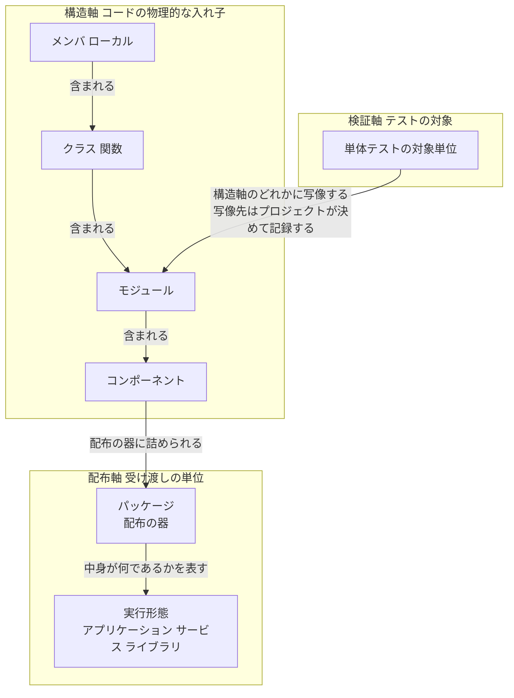

# 構造単位の包含関係とフォルダ構造

**目的:** ソフトウェア / アプリ / サービス / ライブラリ / パッケージ / モジュール / ユニット / コンポーネント / クラスの関係を確定し、フォルダ構造の規約を定める。

**位置づけ:** `01-trial-report_v3.md` の P-26 / P-27 に対する設計案。**適用は未判断である。**

---

## 1. 現状 — 定義は既に存在する

**`glossary.md` §5「コード単位の階層（包含関係）」に 6 階層の表が既にある。** ゼロから作る必要はない。

```text
| 階層 | 単位                         | 対応              | 含むもの                |
| 1    | メンバ / ローカル              | —                | 文、式                  |
| 2    | クラス / 関数                 | —                | メンバ、ローカル、内部クラス |
| 3    | モジュール                    | ファイル           | クラス、関数             |
| 4    | コンポーネント                 | フォルダ           | モジュール               |
| 5    | パッケージ / ライブラリ         | 配布単位           | コンポーネント           |
| 6    | アプリケーション               | —                | パッケージ、外部ライブラリ |

分散システムでは 5 と 6 の間に「サービス / デプロイ単位」を挿入する。
```

**既にあるものを作り直さない。** 以下は改訂案である。

---

## 2. 現状の 4 つの問題

| # | 問題 | 根拠 |
|:-:|---|---|
| **T-1** | **コンポーネントの公開面が未定義。** 「フォルダ」とだけ定め、**そのフォルダの何を外から参照してよいかを定めていない** | R2.16（依存が一方向）の検査がフォルダ単位でしか行えず、**フォルダ内のどのファイルに依存してよいかが決まらない** |
| **T-2** | **階層 5 が「パッケージ / ライブラリ」を同居させている** | **配布の器と実行形態は別の軸である。** C10-b（`risk` と `risk-register` の同居で singleton 判定が矛盾した）と同型 |
| **T-3** | **「ユニット」が定義されていない** | `framework-src/ja` 全体での出現 **0 回**。実体は「単体テスト」で呼ばれている |
| **T-4** | **階層番号が安定しない** | 「分散システムでは 5 と 6 の間に挿入する」と書かれているが、挿入するとアプリケーションは **7** になる。**表は 6 と書いたままである** |

**T-4 は番号を付けたことに起因する。** 「難しいのは 2 つ、キャッシュの無効化と命名、そして off-by-one エラー」という警句のとおり、**条件付きで要素が増える表に通し番号を振ると、必ずここでずれる。** 番号を捨てるのが正しい。

---

## 3. 改訂案 — 3 つの軸に分ける

**1 本の入れ子にしない。** 3 つの独立した軸が混ざっている。

**軸の関係:**



### 3.1 構造軸 — コードの物理的な入れ子

| 単位 | 対応 | 含むもの |
|---|---|---|
| メンバ / ローカル | — | 文、式 |
| クラス / 関数 | — | メンバ、ローカル、内部クラス |
| モジュール | ファイル | クラス、関数 |
| **コンポーネント** | **フォルダ + 公開面** | モジュール |

**番号を振らない（T-4 の解消）。** 包含は表の順序で表す。

### 3.2 配布軸 — 受け渡しの単位

| 単位 | 定義 | 含むもの |
|---|---|---|
| **パッケージ** | **配布の器。** 版と依存を持ち、レジストリまたはファイルで受け渡される | コンポーネント |
| **ライブラリ** | 単独では起動せず、他のソフトウェアに組み込まれる**実行形態** | パッケージの中身 |
| **アプリケーション** | 利用者が直接起動する**実行形態**。エントリポイントを持つ | 自身のパッケージ + 外部ライブラリ |
| **サービス** | 常駐し、境界越しに要求を受ける**実行形態**。デプロイの単位でもある | 自身のパッケージ + 外部ライブラリ |

**T-2 の解消:** パッケージは**器**、ライブラリ・アプリケーション・サービスは**中身の形態**である。同じ階層に置かない。

**分散システムの扱い:** アプリケーション（システム全体）が複数のサービスから成る。**条件付きの挿入ではなく、最初から並列に定義する。** これで T-4 が構造的に起きなくなる。

### 3.3 検証軸

| 単位 | 定義 |
|---|---|
| **単体テストの対象単位** | 構造軸のどの単位を指すかを**プロジェクトが決めて仕様書 Ch5 に記録する**（既定: モジュール） |

**「ユニット」を構造単位として使わない（MUST NOT）。** テスト文脈の「単体テスト」以外で用いると、モジュールともコンポーネントとも読める。**現状 0 回であり、いま禁じれば混入を防げる（T-3 の解消）。**

### 3.4 「ソフトウェア」の扱い

**総称であり、いずれの軸にも置かない。** 本フレームワークが作る成果物の全体を指す語として用い、**特定の単位を指すときには使わない。**

### 3.5 レイヤー軸との関係

**構造軸・配布軸・検証軸のいずれとも直交する。**

R2.16 の改訂により、レイヤーは**依存の向きの規約**であって層の数は設計判断となった。**したがってレイヤーはフォルダ名である必要がない。** `glossary.md` §5 が既に「レイヤー軸はこの包含と直交する」と述べており、その主張は維持される。

---

## 4. コンポーネントの公開面（T-1 の解消）

### 4.1 定義の改訂

| | 内容 |
|---|---|
| 現行 | コンポーネント = フォルダ（多い場合サブフォルダ） |
| **改訂案** | **コンポーネント = 公開面を持ち、内部実装を隠す、交換の単位。フォルダに対応する** |

### 4.2 規約

> **コンポーネントは公開面を宣言する（MUST）。他コンポーネントは公開面のみに依存してよい。内部実装への依存を禁じる（MUST NOT）。**
>
> **公開面の表現手段は、言語が提供する可視性機構を優先する（SHOULD）。** 機構を持たない、または機構が弱い場合にのみディレクトリで表す。

**言語機構を優先する理由:** ディレクトリ規約は**誰かが検査しなければ守られない**。言語機構は**コンパイラが守らせる**。**守らせる主体がいる方を選ぶ** — これは議題3 の「宣言ではなく作業そのものを止める」と同じ原理である。

**言語別の既定:**

| 言語 | 公開面の表現 |
|---|---|
| Rust | `pub` / `mod`。**言語が強制する** |
| TypeScript / JavaScript | `index.ts` からの `export` のみを公開面とする |
| Python | `__init__.py` の `__all__`。内部モジュールは `_` 接頭辞 |
| Java / C# | package-private / `internal` |
| **C / C++** | **機構が弱いためディレクトリで表す**（§4.3） |
| Go | 大文字始まりが公開。**言語が強制する** |

### 4.3 ディレクトリで表す場合

**C / C++ など、ヘッダの include が可視性を制御できない言語で用いる。**

**コンポーネントのディレクトリ構成:**

```text
src/components/bms/
  include/
    bms_api.hpp
  private/
    cell_monitor/
      ltc6811.hpp
      ltc6811.cpp
      voltage_cal.hpp
      voltage_cal.cpp
    fault_detect/
      over_volt.hpp
      over_volt.cpp
```

`include/` が公開面であり、他コンポーネントが `#include` してよい唯一の場所である。`private/` 配下への参照は違反として起票する。ビルド設定（CMake の `target_include_directories` における `PUBLIC` と `PRIVATE`）で強制できる場合は強制する。

**`private/` の内側の下位ディレクトリ（`cell_monitor/` など）はコンポーネントではない。** 単なるモジュールのまとまりである。**コンポーネントを名乗るのは公開面を持つものだけ**であり、これが §3.1 の定義から直接従う。

### 4.4 規模による選択

**既定を置くが要求にしない。** 小規模に `components/` を強制すると、本試行で確認した過剰設計（真因 B）を規約の側から再生産する。

| コンポーネント数 | 既定の構成 |
|:-:|---|
| **1** | `src/` の直下にモジュールを置く。**`components/` を作らない** |
| **2〜数個** | `src/{component}/`。公開面は言語機構で表す |
| **多数、または公開面の統制が要る** | `src/components/{component}/` に §4.3 の構成 |

**本試行（unit-converter-cli）は 1 に該当する。** 実際の構成は `src/domain/` `src/usecase/` `src/adapter/` というレイヤー名のフォルダであった。**コンポーネントが 1 つならこれでよく、規約違反ではない。**

---

## 5. 改訂案の最小構成との比較（R2.18 の自己適用）

**本設計案そのものに、本試行で新設した R2.18 を適用する。**

### 最小構成

> **「コンポーネントは公開面を宣言する。他コンポーネントは公開面のみに依存してよい」の一文を `glossary.md` §5 に加える。**

これだけで T-1 は解消する。**以下は最小構成に対する増分であり、それぞれ理由を示す。**

| 増分 | 理由 | 理由が弱ければ落とす |
|---|---|:---:|
| **3 軸への分離**（§3） | **T-2 と T-4 が実在する。** パッケージとライブラリの同居は C10-b と同型の欠陥であり、番号のずれは文書内で既に発生している | 落とさない |
| **言語別の既定**（§4.2） | 書き手が毎回「この言語ではどう表すか」を発明することになる。**本試行では architect が Ch3.1 で 5 観点の検討を要した** | 落とさない |
| **ディレクトリ構成の既定**（§4.3） | C / C++ には言語機構がなく、既定がないと毎回設計判断になる | 落とさない |
| **規模による選択**（§4.4） | **既定だけ置くと小規模で牛刀になる。** 本試行で実証済み（真因 B） | 落とさない |
| 「ユニットを使わない」の明文化（§3.3） | 現状 0 回であり、**実害はまだ出ていない。** 予防のみ | **弱い。落としてもよい** |
| 「ソフトウェア」の扱い（§3.4） | 総称であることは自明に近い | **弱い。落としてもよい** |

**弱い 2 件を落とした版を代替案として記録する。** 採否はユーザーの判断による。

---

## 6. 影響範囲

| 対象 | 変更 |
|---|---|
| `glossary.md` §5 | 表を 3 軸に再構成。番号を廃止。コンポーネントの定義に公開面を追加 |
| `spec-template.md` Ch3.3 | 「コンポーネントとフォルダの対応」に**公開面の宣言**を追加 |
| `review-standards.md` | R2.16 の検査に「他コンポーネントの内部実装への依存がないか」を追加するか判断（**新設 R ID は作らず R2.16 の本文に含めることを推奨**） |
| `full-auto-dev-process-rules.md` §4.4 | レイヤー仕訳の記述と整合を取る |

**いずれも ja / en 同時。** `check-parity` で検証する。

---

## 7. 未確定事項

| # | 内容 |
|:-:|---|
| 1 | 本設計案の採否。**すべて未判断** |
| 2 | §5 の「弱い 2 件」を落とすか |
| 3 | R2.16 に検査を追加するか、規約の記述にとどめるか |
| 4 | 本改訂を OKF 移行（v3 §6 の順序 6）の前に行うか後に行うか。**glossary は Common Block を持たないため OKF 移行の対象外であり、独立に進められる** |
