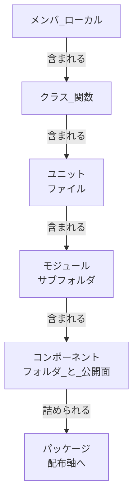

# 構造単位の呼称統一 — 修正リスト

**目的:** `モジュール` が 2 つの意味で使われている状態を解消し、`ユニット` / `モジュール` / `コンポーネント` を確定する。あわせて P-26（コンポーネントの公開面が未定義）と P-27（パッケージとライブラリの同居）を解消する。

**位置づけ:** `2026-07-31/02-structural-unit-taxonomy.md` の設計案に対する適用計画。**設計案の T-3（ユニットの扱い）だけは実測により結論を変えている**（§2）。

**作業規律:**

- **一括置換を行わない（MUST NOT）。** 本リストの 1 行が 1 判定であり、変更しない箇所も理由つきで列挙する
- 定義（glossary）を先に直し、従属する記述をあとから直す。逆順にすると、直している間どちらの定義が正か分からなくなる
- ja / en は同一コミットに含める。**行数一致が `check-parity` で強制されているため、ja と en の行番号は一致する**
- 各ステップの後に検査 6 種を走らせる

---

## 1. 現状の問題 — 実測

`framework-src/ja` の `モジュール` 全 44 箇所を分類した。**ばらつきではなく、文書の系統ごとに割れている。**

| 意味 | 内容 | 件数 | 分布 |
|---|---|:-:|---|
| **A** | ファイル | 約 10 | review-standards、spec-template |
| **B** | ファイルより大きなまとまり | 約 16 | full-auto-dev-process-rules、エージェント定義 |
| **定義** | 階層表そのもの | 3 | glossary |
| **その他** | 図・WBS のラベル等、判定に影響しないもの | 残り | full-auto-dev-process-rules |

**意味 B の根拠（抜粋）:**

```text
process-rules:360   規模区分「単一モジュール、外部依存なし」  → 例は電卓アプリ全体
process-rules:606   「独立したモジュールが 3 つ以上」で中規模  → ファイルなら 3 は基準にならない
process-rules:1122  「モジュールA（認証モジュール）を実装」    → ブランチ feature/auth-module
process-rules:1049  WBS「モジュールA実装 5d」                 → 1 ファイルの作業ではない
field-issue-analyst:80   「ファイル・モジュール・機能の一覧」  → ファイルと別物として並記
field-issue-analyst:148  「同一モジュール内の機能」            → モジュールが機能を複数含む
change-manager:95        「複数モジュールにわたる変更」= High  → 影響度の尺度
```

`glossary.md` §5 は `モジュール = ファイル`（意味 A）だけを正としており、**多数派である意味 B は規則に定義の無い意味で書かれている。**

---

## 2. 決定 — 3 段に確定する

**設計案 §3.3 は「ユニットを構造単位として使わない（MUST NOT）」としていた。これを覆す。**

設計案は「モジュールは一貫してファイルを指しており、ユニットは不要」という前提に立っていた。**§1 の実測はその前提を否定する。**多数派の意味 B を正とし、ファイルには別の名前を与えるほうが、直す箇所が少なく（10 対 16）、かつ「認証モジュール」のような自然な語を捨てずに済む。

### 2.1 構造軸

| 単位 | 対応 | 含まれる先 | 含むもの |
|---|---|---|---|
| メンバ / ローカル (member, local) | — | クラス / 関数 | 文、式 |
| クラス / 関数 (class, function) | — | ユニット | メンバ、ローカル、内部クラス |
| **ユニット (unit)** | **ファイル**（C なら `.c` と `.h` の対） | モジュール | クラス、関数 |
| **モジュール (module)** | **サブフォルダ**、または接頭辞を共有するファイル群 | コンポーネント | ユニット |
| **コンポーネント (component)** | **フォルダ + 公開面** | 配布軸のパッケージ | モジュール、ユニット |

**番号を振らない。** 包含は `含まれる先` と `含むもの` の鎖で表す。**隣接行の一致が包含の閉じている証拠になる**ため、行を足したときの繋ぎ忘れが表の中で露見する。番号にはこの自己検査性がなく、現に「5 と 6 の間に挿入する」と書きながらアプリケーションが 6 のまま残っていた（T-4）。

**構造軸の包含:**



ユニットが単体テストの対象単位である。**モジュールを単体テストの対象と読んではならない（MUST NOT）。**

### 2.2 配布軸

**構造軸と 1 本の鎖に繋がない。** 繋いだことが「サービスをどこに挿すか」問題を生んだ原因である（P-27）。

| 単位 | 種別 | 定義 | 含むもの |
|---|---|---|---|
| **パッケージ (package)** | **器** | 版と依存を持ち、レジストリまたはファイルで受け渡される | コンポーネント |
| **ライブラリ (library)** | 実行形態 | 単独では起動せず、他のソフトウェアに組み込まれる | パッケージの中身 |
| **アプリケーション (application)** | 実行形態 | 利用者が直接起動する。エントリポイントを持つ | 自身のパッケージ + 外部ライブラリ |
| **サービス (service)** | 実行形態 | 常駐し、境界越しに要求を受ける。デプロイの単位でもある | 自身のパッケージ + 外部ライブラリ |

**サービスを最初から並列に定義する。**条件付きの挿入をやめたことで、除外規定が不要になる。分散システムでは、アプリケーション（システム全体）が複数のサービスから成る。

### 2.3 コンポーネントの公開面

設計案 §4 をそのまま採る。**言語機構を優先し、機構が弱い C / C++ でのみディレクトリで表す。**規模による選択（コンポーネントが 1 つなら `components/` を作らない）も維持する。

---

## 3. 修正リスト

**ステップ順に実施する。1 ステップ = 1 コミット。ja / en は同一コミット。**

### ステップ 1 — 定義（glossary.md §5）

| # | 対象（ja / en 共通行） | 現状 | 変更後 |
|:-:|---|---|---|
| 1-1 | `glossary.md:92` | 「物理分離は『モジュール/コンポーネント』単位で行う」 | 3 段の呼称に合わせて書き換える |
| 1-2 | `glossary.md:96-104` | 6 階層の番号つき単一表 | §2.1 の構造軸表 + §2.2 の配布軸表 + Mermaid 図に差し替える |
| 1-3 | `glossary.md` §5 末尾 | 「分散システムでは 5 と 6 の間に挿入する」 | **削除。** 配布軸にサービスを常設したため不要 |
| 1-4 | `glossary.md` §5（新規） | — | コンポーネントの公開面の規約（MUST / MUST NOT）と言語別の既定を追加 |

### ステップ 2 — review-standards.md

**変更する 8 箇所。いずれも「ファイル」の意味であり、ユニットに差し替える。**

| # | 行 | 現状の語 | 変更後 | 根拠 |
|:-:|:-:|---|---|---|
| 2-1 | 70 | 1クラス・1モジュール | 1クラス・1ユニット | SRP。Martin の module = source file |
| 2-2 | 299 | 関数/モジュールへ分離 | 関数/ユニットへ分離 | 分離先はファイル |
| 2-3 | 351 | クラス/モジュール**内で** | クラス/ユニット内で | ファイル内のメンバ順序 |
| 2-4 | 353 | ファイル/モジュールを分割 | ユニットを分割 | 本文が「**別ファイルに**」と明記 |
| 2-5 | 411 | R2.2 1クラス/モジュール | 1クラス/ユニット | 2-1 の規約行 |
| 2-6 | 442 | R7.2 関数/モジュール | 関数/ユニット | 2-2 の規約行 |
| 2-7 | 447 | R7.7 クラス/モジュール内 | クラス/ユニット内 | 2-3 の規約行 |
| 2-8 | 449 | R7.9 ファイル/モジュールを分割 | ユニットを分割 | 2-4 の規約行 |

**あわせて R2.16 に検査を 1 つ加える**（設計案 §6 の推奨に従い、新設 R ID は作らない）。

| # | 行 | 追加内容 |
|:-:|:-:|---|
| 2-9 | R2.16 の本文 | 「他コンポーネントの内部実装に依存していないか。参照してよいのは公開面のみ」 |

### ステップ 3 — spec-template.md

| # | 行 | 現状 | 変更後 | 根拠 |
|:-:|:-:|---|---|---|
| 3-1 | 225 | SRP「各クラス・モジュールが単一の責務」 | 各クラス・ユニット | ステップ 2-1 と同じ |
| 3-2 | 219 | SDP「自分より安定なモジュールか」 | **コンポーネント** | SDP は Clean Architecture のコンポーネント原則であり、ファイルでもサブフォルダでもない |
| 3-3 | 93 | Ch3.3「コンポーネントとフォルダの対応」 | 「**公開面の宣言**」を追加 | P-26。ステップ 1-4 への追随 |

### ステップ 4 — 残りの従属記述

| # | 対象 | 現状 | 変更後 | 根拠 |
|:-:|---|---|---|---|
| 4-1 | `test-engineer.md:117` | describe: テスト対象のモジュール/関数名 | ユニット/関数名 | 単体テストの対象はユニット |
| 4-2 | `full-auto-dev-process-rules.md:110` | SW実装、モジュール単体テスト | ユニット単体テスト | 同上 |

### ステップ 5 — 判断保留

| # | 対象 | 内容 | 論点 |
|:-:|---|---|---|
| 5-1 | `full-auto-dev-document-rules.md:1186` | traceability の実装列「ファイルパスまたはモジュール」 | 新定義でも両方が有効な粒度として成立する。**変える必要があるか未判定。**ユーザー判断を仰ぐ |

---

## 4. 変更しない箇所

**一括置換をしていない証拠として列挙する。いずれも意味 B であり、新定義のもとで既に正しい。**

| 対象 | 行 | 理由 |
|---|:-:|---|
| `review-standards.md` | 87 | DIP「上位モジュール / 下位モジュール」。**DIP の module は方針と機構のまとまりであり、ファイルではない。**Martin の原典どおり |
| `review-standards.md`（en のみ） | 415 | R2.6 の en が "upper modules / lower modules"。ja に対応語がない。**87 と同じ理由で維持する** |
| `full-auto-dev-process-rules.md` | 349, 360, 361, 362, 606 | 規模区分と中規模の目安。モジュール数で規模を測る記述 |
| `full-auto-dev-process-rules.md` | 1049, 1050, 1108, 1121, 1122, 1125, 1126, 1135 | 並列実装の worktree 単位。「認証モジュール」「ダッシュボード」 |
| `full-auto-dev-process-rules.md` | 1283, 2709, 2715 | defect の集中領域、実装依頼の単位 |
| `defect-taxonomy.md` | 241, 288, 319 | FMEA の分析単位。「モジュール分割が決まらないと意味がない」はアーキテクチャの分割を指す |
| `change-manager.md` | 95, 96 | 影響度の尺度。単一モジュール = Medium、複数モジュール = High |
| `field-issue-analyst.md` | 41, 80, 128, 148 | 影響範囲と副作用の分析単位 |
| `field-issue-handling-rules.md` | 202 | 上と同じ書式 |
| `review-agent.md` | 175 | レビュー起動契機「各モジュール実装完了後」 |

---

## 5. 検証

各ステップの後に実行する。

```bash
node tools/check-parity.mjs && node tools/check-roster.mjs && node tools/check-links.mjs && node tools/check-tagnames.mjs && node tools/check-terms.mjs && node tools/check-setup.mjs
```

**加えて、全ステップ完了後に残存確認を行う。**

```bash
grep -rn "モジュール" framework-src/ja/ | wc -l
```

| 時点 | 期待値 | 内訳 |
|---|:-:|---|
| 着手前 | **44** | §1 の実測 |
| ステップ 1 完了後 | **48** | glossary が定義文書として語を名指すため 3 → 7 に増える |
| 全ステップ完了後 | **36** | 48 から §3 の変更 12 件（ステップ 2 で 8、3 で 2、4 で 2）を引いた値 |

減った 12 件が §3 の変更対象と一致し、残りが §4 の一覧と一致することを確認する。**数が合わない場合は一括置換が混入している。**

---

## 6. 未確定事項

| # | 内容 |
|:-:|---|
| 1 | ステップ 5-1（traceability の実装列）の要否 |
| 2 | 本改訂を OKF 移行の前に行うか後に行うか。**glossary は Common Block を持たないため OKF 移行の対象外であり、独立に進められる**（設計案 §7-4） |
| 3 | 既存の `02-structural-unit-taxonomy.md` を本リストの決定で改訂するか、設計案として据え置くか。**過去記録の改竄を避けるため、据え置きを推奨する** |
