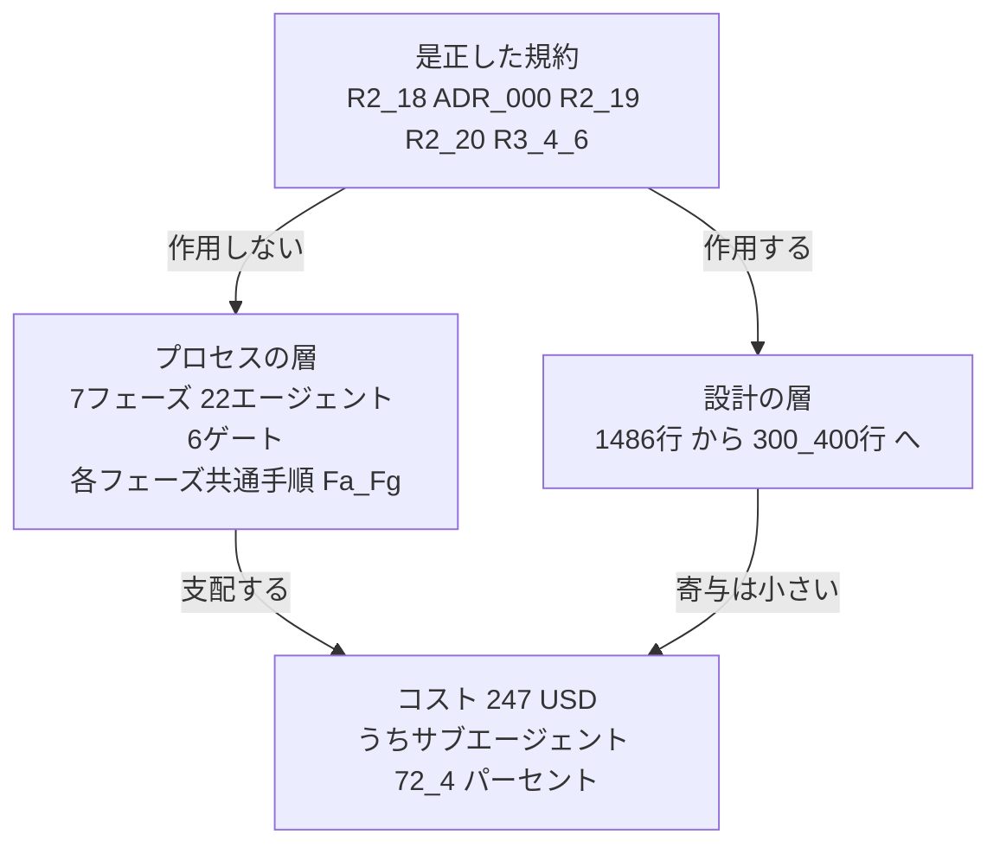

# 2 回目トライアル 総括 — 軽量版との比較

**対象:** `gr-sw-maker-trial`（unit-convert）。2026-08-02 開始、同日 `GATE-DESIGN` PASS 直後に終了（`project_status: aborted`）。

**比較対象:** `unit-converter`（unicon）。同一の `user-order.md` から、フレームワークを与えずに作らせた対照実験。

**方針:** 数値はすべて成果物とテレメトリからの実測である。走行セッションの申告は採らず、自分で計測した。テストは自分で実行した。**未計測のものは未計測と書く。**

**位置づけ:** `2026-07-31/01-trial-report_v3.md` の着手順序 14 に対する結果報告。観測の生記録は `2026-08-02/02-trial2-observation-log.md` にある。

---

## 1. 比較の条件

| 項目 | 1 回目 | **2 回目** | **対照実験** |
|---|---|---|---|
| 実施日 | 2026-07-26〜30 | 2026-08-02 | 2026-08-02 |
| `user-order.md` | 原本 | **md5 一致** | **md5 一致** |
| 与えた文書 | フレームワーク一式 | フレームワーク一式 | **3 件のみ**（`user-order` / `spec-template` / `review-standards`） |
| 規約の版 | 是正前 | **是正後（`7187bf8`）** | **是正前**（`review-standards` 450 行） |
| プロセス | 7 フェーズ・22 エージェント・6 ゲート | 同左 | **無し** |
| 規模区分 | Small | **Micro**（免除フル適用） | 判定せず |

**交絡因子:** 対照実験は規約も旧版である（`R2.19` / `R2.20` / `R3.4-3.6` / 品詞規約 / ユニットが無い）。**動いた変数は 2 つ。** ただし規約の差はチェックリスト 5 行、プロセスの差はフェーズ・エージェント・ゲート・インタビュー全体であり、**支配的なのは後者である。**

---

## 2. 実測

| 指標 | 1 回目 | **2 回目** | **対照実験** |
|---|---:|---:|---:|
| 到達点 | **GATE-DELIVERY PASS** | **GATE-DESIGN PASS 後に終了** | **完成・動作確認済み** |
| 仕様書 | 3,958 行 | **2,908 行** | **1,129 行** |
| コード | 1,486 行 | **0 行** | **596 行**（9 ファイル） |
| テスト | 198 件・カバレッジ 100% | **0 件** | **129 件全通過**（自分で実行して確認） |
| `.md` 総数 | 167 | 83 | 5 |
| defect | 0 件 | 0 件 | — |
| **コスト** | **計測不能** | **$247.23** | **約 $8.30** |
| 所要 | 5 日 | 約 13 時間（待機を含む） | 約 26 分 |

**コストの倍率は約 30 倍である。** ただし対照実験の $8.30 は UI パネルの表示であり、**内訳が単価表と検算で一致しない**（`03-measurement-path-poc.md` §5-2 が未解明としたのと同種の乖離）。**桁の比較として用い、小数点以下に意味を与えない。**

**2 回目のコストの内訳:**

```text
サブエージェント（agent:custom）  $178.94  /  688 リクエスト   72.4 %
メインセッション（sdk）            $39.46  /  109 リクエスト   27.6 %
                                 ────────
                                  $247.23  /  797 リクエスト（再起動後）
```

**予算は同日に 4 回改定された。** 25 → 50 → 120 → 250 USD。**いずれも「プロセスを削らず予算を広げる」選択である。**

---

## 3. 是正は効いたか — 効いた

**まずこれを書く。フレームワークは、狙ったところでは確実に良くなった。**

| # | 検証項目 | 結果 |
|:-:|---|---|
| 1 | 総コスト | **測れた。** 1 回目の「計測不能」が解消 |
| 4 | 不要な図 | **改善。** 状態遷移図を作らず、Ch3.6.5 に理由を記録（1 回目は不要な状態遷移図 1 件） |
| 5 | 従属記述の未追随 | **生成時に検出した。** Ch3 の厳密有理数採用が Ch1.7 の L-7 の前提を壊したことを、レビュー前に自分で見つけて諮った（1 回目は 7 件すべて事後検出） |
| 7 | ADR-000 | **書かれ、中身も妥当。** 最小構成が機能要求 23 件を満たすと認めたうえで増分を要求に紐づけ、増やさなかった要素 9 件も記録 |
| 9 | `project_status` | **値域が現実を表現できた。** 完了しなかったので `aborted` が入った。旧設計では表現できなかった状態である |
| 11 | `0-pre` | **無質問で起動し、確認まで到達** |
| 12 | `3a2` | **条文どおり理由を添えて尋ねた** |
| 13 | R2.19 公開面 | **予測が外れ、NA にならず全 8 件を宣言。** 公開面を持たない 1 件から検査規則 AR-17 を導出 |
| 14 | R2.20 キャッシュ | **NA + 理由** |
| 16 | R3.5 資源 | **NA + 理由** |
| 17 | R3.6 時刻 | **予測が外れ、正当に適用**（性能測定に単調時計） |
| 19 | 単位の但し書き | **ヒット。** ただし規約の例示が正解そのもので、写経の疑いは残る |

**Ch3.6.5 の冒頭が、この走行で最も良い一文である。**

> 描かない判断・作らない判断も設計判断である。記録がなければ「検討して不要と判断した」のか「忘れた」のかを後から区別できない。

**加えて、規約に無い良い振る舞いが観測された。**

| 事象 | 内容 |
|---|---|
| NFR-004 の列挙漏れ | **列挙を延長せず、列挙が要らない検査に置換した。** 将来の API も自動的に覆う |
| 電源断への対応 | 受け口を再起動する**前に**状態を退避し、累計の読み方を規則として定め、欠測区間を「推論であって計測ではない」と明記 |
| 所有者の逸脱 | 他エージェントの担当ファイルを書いた事実と理由を記録に残した |
| torn state の回避 | 「architect が仕様書を書いている間は、それを読むエージェントを起動しない」を自分の失敗から学んで採用 |

**推測禁止の規約が、自分の計測が壊れた場面で守られた。真因 F への対策としてこれ以上の実例はない。**

---

## 4. それでも何が起きたか

**設計は小さくなった。コストは 30 倍になった。**

| 対象 | 1 回目 | 2 回目 |
|---|---:|---:|
| コード（実績 / 見込み） | 1,486 行 | **300〜400 行**（ADR-000 の見込み） |

**R2.18 と ADR-000 は設計の層で確実に効いた。** 最小構成との比較が実際に構成を絞った。

**しかしコストはそこに無かった。**

**コストの所在:**



**免除マトリクス（§3.1.1）が削るのは成果物だけである。** 13 行すべてが文書または検証活動であり、**フェーズ数・エージェント起動数・共通手順の回数を減らす行が 1 つも無い。** Micro でも 7 フェーズを回し、各フェーズで `Fa`（kotodama-kun）・`Fb`（progress-monitor）・`Fd`（project-manager）・`Fe`（process-improver）を起動する。

**v3 の P-04 は「免除マトリクス 13 行がすべて管理文書で、設計の深さを削らない」と述べた。本走行はその一段先を示した — 設計の深さだけでなく、プロセスの回数も削らない。**

---

## 5. 新しく分かった構造 — 削る力が要求の層に無い

**2 回目と対照実験の差の中心は、行数ではなく要求である。**

| 項目 | 対照実験 | 2 回目 |
|---|---|---|
| 丸め | 有効数字 12 桁 | 有効数字 6 桁 |
| 精度の要求 | 無し | **NFR-006（Ubiquitous）:** 109 単位対すべてで理論値と文字列一致 100% |
| 数の表現 | `Number` | **厳密有理数（BigInt 分数）** |
| 帰結 | — | `Rational` 約 80 行 + `RoundedDecimal` の 2 コンポーネント増 |

**`user-order.md` は md5 一致である。NFR-006 は入力に存在しない。Phase 1 のインタビューで生まれた。**

2 回目の仕様書 §2.3 が自らこう記録している。

> 全件がインタビューで合意された最小構成に対応する。ラウンド 3 の Q11 でユーザーがインタビューを終了した時点で、**削減候補として挙げられた要求は 1 件も無い**

**32 件すべてが MUST で、削減候補はゼロであった。**

> **R2.18 は設計を最小構成と比較させる。要求を最小構成と比較させる機構は存在しない。**

**真因 B が、R2.18 の効く層より 1 つ上流で作用している。** P-23 は「フレームワーク自身の規模が比較されない」と述べたが、**同じ構造が要求定義にもある。インタビューは足す方向にしか動かない。**

**公平を期して記す。** ユーザーはインタビューに参加しており、NFR-006 は捏造ではない。**問題は要求されたことではなく、手順が一度も「これは要りますか」と問わないことである。**

---

## 6. 失敗と、残った欠陥

| # | 内容 | 種別 |
|:-:|---|---|
| 21 | **構造単位の呼称が届かなかった。** 仕様書に「ユニット」は **0 回**、「モジュール」が 18 回。ファイルを「モジュール」と呼び、同じ表の ID では「コンポーネント」と呼んでいる | **検証項目の失敗** |
| 18 | **命名の品詞は識別力を持たない。** 1 回目・対照実験・2 回目の 3 例すべてで Use Case が動詞句になり、**うち 2 例は品詞規約が存在しない** | **検証項目の無効** |
| — | **`sink_started_at` の変化を検知する機構が無い。** 受け口が再起動すると累計が 0 に戻り、鮮度マーカーは `OK` を返し続ける | **計測経路の欠陥** |
| — | **Micro が `cost-log.json` を免除し、予算の転記先が消える。** 本走行でアラートが発火したのは、走行が免除を無視して作ったからである | **規則間の矛盾** |
| — | **報告値が報告時点で古い。** Phase 0 で 3 つの値が食い違い、design で 26 USD の乖離。Fb は「読め」と定めるが「いつ読むか」を定めていない | **規則の欠落（2 回発生）** |
| — | **R2.1 の品詞の規約とレイヤー別の表が、純粋な Use Case で競合する。** どちらが優先かを規則が定めていない | **規則の内部矛盾** |
| — | **Micro の所要時間基準「1 時間未満」に対し、実績は 1 回目 5 日・2 回目 13 時間** | **基準の校正ずれ** |
| — | **`by_agent` が実走行では `custom` 1 個に潰れ、エージェント別の按分が取れない** | **計測の限界（実走行で初確認）** |

---

## 7. v3 が答えられなかった問いへの回答

| # | v3 の問い | 本走行の回答 |
|:-:|---|---|
| 1 | 3,958 行の仕様は 0 defect を買ったのか、大半は余剰だったのか | **対照実験が反実仮想を与えた。** 1,129 行の仕様と 596 行のコードで、129 件のテストが通る道具が約 26 分で成立した。**「大半は余剰」の側に強い証拠がある。** ただし品質の尺度は揃っていない（対照実験はカバレッジ未測定） |
| 2 | どのフェーズが時間とトークンを食ったか | **測れた。** サブエージェントが 72.4%。planning $47.5、design が残り |
| 3 | R2.18 は実際に効くか | **効いた。設計の層で。** コードは 1,486 行から 300〜400 行の見込みへ |
| 5 | フレームワーク自身は最小構成に対してどれだけ大きいのか | **同一入力に対し約 30 倍のコスト。** かつ 2 回目はコードに到達しなかった |
| 6 | `sources` の採用は真因 B と衝突しないか | **本走行では判定できない。** frontmatter の観測は未完了 |

---

## 8. 判断が要ること

**本文書は提案であり、適用ではない。**

| # | 論点 |
|:-:|---|
| 1 | **免除マトリクスにプロセスの行を足すか。** 現状は成果物しか削らない。Micro で `Fa` / `Fe` を毎フェーズ起動する必要があるか |
| 2 | **要求の層に最小構成との比較を置くか。** R2.18 の要求版。インタビューに「削減候補」を出す手順を義務づけるか |
| 3 | **Micro の所要時間基準を実績に合わせて校正するか** |
| 4 | **受け口に累計の永続化を入れるか**（`sink_started_at` の変化検知、または集計のファイル保持） |
| 5 | **`cost-log.json` を免除対象から外すか。** 予算アラートの分母である |
| 6 | **Fb に「報告直前に読み直す」を義務づけるか** |
| 7 | **R2.1 の競合に優先順位を定めるか**（純粋な Use Case は動詞句か名詞句か） |
| 8 | **検証項目 #18（命名の品詞）を検証項目から外す。** 3 例で識別力が無いことが確定した |
| 9 | **構造単位の呼称に、言語機構としての `module` との衝突を扱う条項を足すか** |
| 10 | **次の対照走行には telemetry の `env` を置く。** 本対照実験はコストが未計測で、UI の表示で代用した |

**未適用のまま残る v3 の残件:** P-03 / P-04 / P-05 / P-12 / P-21 / P-26 / P-27、および前回レビューで見送った Low 6 件。
