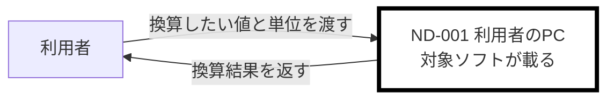
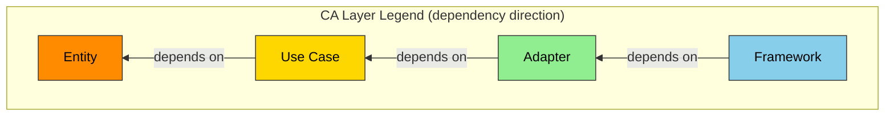

# ANMS v0.35 — AI-Native Minimal Spec Template（ドラフト）

> **本ファイルはドラフトである。本体は `framework-src/ja/process-rules/spec-template.md`（v0.34）であり、まだ変更していない。**
>
> **★新設 / ★変更 の印は、v0.34 からの差分をレビューするための目印である。本体へ移すときに取り除く。**
>
> 承認済みの方針: 章立て A（システム構成とユースケースを別章）/ 構成を選べる場合は ADR へ逃がす / NFR は Ch2 のノード・接続へトレースする。
>
> **本ドラフトを本体へ適用するときの作業一覧は、末尾の「適用時の作業一覧」にある。テンプレート本文ではない。**

---

## 仕様書の設計原則: STFB (Stable Top, Flexible Bottom) — 上剛下柔

Robert C. Martin の安定依存の原則 (Stable Dependencies Principle) に着想を得た章構成。上位の章は剛（安定し変更頻度が低い）、下位の章は柔（具体的で変更頻度が高い）。上位章が変わると下位章の見直しが必要になるが、下位章の変更は上位章に影響しない。

**★変更 — 章構成の安定度軸:**

```text
  Chapter 1  Foundation             <- 剛: 最も安定
  Chapter 2  System Configuration      与件。選ぶものではなく、与えられるもの
  Chapter 3  Use Cases                 アクター視点。誰が何を達成するか
  Chapter 4  Requirements              システム視点。何を満たすか
  Chapter 5  Architecture              どう作るか
  Chapter 6  Specification          <- 柔: 最も可変
```

Chapter 2 と Chapter 3 を要求より上に置く理由は 2 つある。**(1) システム構成は与件である。** 車両・スマートフォン・サーバー・既存ハードウェアは既に存在し、こちらの都合では変えられない。設計判断より安定している。**(2) ユースケースはアクター視点であり、要求はシステム視点である。** 視点の変換は一方向で、アクターの目標が変われば要求は変わるが、要求の書き換えでアクターの目標は変わらない。

> **★変更 — 本軸は安定度であって抽象度ではない。** v0.34 は「最も抽象的 → 最も具体的」も併記していたが、**Chapter 2 の挿入でこれは成り立たなくなった。** システム構成は物理的で具体的でありながら、与件であるがゆえに最も安定している。**抽象度の階段は別の軸であり、Chapter 3 の冒頭で定義する。**

本テンプレートは三段階仕様体系（ANMS / ANPS / ANGS）の第1段階（ANMS）として設計されている。1コンテキストウィンドウに収まる規模では単一ファイルとして使用する。収まらない場合はANPS（AI-Native Plural Spec）としてチャプター単位でファイルを分割する:

**★変更 — ANPS のファイル分割:**

- **spec-foundation**（Ch1-4: Foundation・System Configuration・Use Cases・Requirements）— オーナー: srs-writer
- **spec-architecture**（Ch5-8: Architecture・Specification・Test Strategy・Design Principles）— オーナー: architect

ANPSでは各ファイルにCommon Block + Form Blockを付与する（文書管理規則に従う）。STFB構造はファイルが分かれても維持される。

> **★新設 — Chapter 2 のオーナーの例外。** Chapter 2 のオーナーは srs-writer である。**ただし構成を選べる場合、選定は architect が Chapter 5.6 の ADR で行い、確定した構成を srs-writer が Chapter 2 へ反映する。オーナーは移らない。**

**人間が主導する3つの責務:**

全自動開発においても、以下の3つは人間が主導する（プロセス規則 §1.1 参照）:

1. **コンセプトの提示**（Ch1 Foundation の入力）— 何を作りたいか、なぜ必要か
2. **重要な意思決定**（Ch5 Architecture Decisions の判断）— 技術選定、アーキテクチャ方針
3. **受入テスト**（Ch6 Specification の Result 判定）— 完成物がビジネス要求を満たすか

---

## Chapter Structure

**★変更 — 章の一覧:**

| #   | English                          | 日本語              | 主な記法                            | 安定度                   |
| --- | -------------------------------- | ------------------- | ----------------------------------- | ------------------------ |
| 1   | **Foundation**                   | 基本事項            | 自然言語 + テーブル                 | 最も安定                 |
| 2   | **System Configuration** ★新設   | システム構成        | Mermaid + テーブル                  | 最も安定（与件）         |
| 3   | **Use Cases** ★新設              | ユースケース        | テーブル（Cockburn brief）          | 安定                     |
| 4   | **Requirements**                 | 要求                | EARS + 数式 + テーブル + 図         | 安定                     |
| 5   | **Architecture**                 | アーキテクチャ      | Mermaid + テーブル                  | やや安定                 |
| 6   | **Specification**                | 仕様                | Gherkin + テーブル + コードブロック | よく変わる               |
| 7   | **Test Strategy**                | テスト戦略          | テーブル                            | よく変わる               |
| 8   | **Design Principles Compliance** | SW設計原則 準拠確認 | テーブル                            | 可変（レビュー時に更新） |
| A   | **Appendix**                     | 付録                | 自由形式                            | —                        |

---

## Section Structure

### Chapter 1. Foundation (基本事項)

プロジェクトの「北極星」。すべての後続章の前提となる。最も安定し、最も変わりにくい層。

| Section | English     | 日本語   | 記述内容                                   |
| ------- | ----------- | -------- | ------------------------------------------ |
| 1.1     | Background  | 背景     | なぜこのSWが必要か。ドメインの現状         |
| 1.2     | Challenges  | 課題     | 現状の具体的な問題点                       |
| 1.3     | Goals       | 目標     | 成功の定義。達成すべき状態。**★変更: 各目標に `GOAL-xxx` の ID を振る**（Chapter 3 のユースケースが参照する） |
| 1.4     | Approach    | 解決方針 | 技術スタック、アーキテクチャ方針           |
| 1.5     | Scope       | 範囲     | 本プロジェクトでやること (In-scope) とやらないこと (Out-of-scope)。**★変更: 機能の範囲を書く。物理的な範囲（どの機械までが対象か）は Chapter 2 に書く** |
| 1.6     | Constraints | 制約事項 | プロジェクトが絶対に破れない制約（技術・法規・倫理・特許等） |
| 1.7     | Limitations | 制限事項 | 要求を完全には満たさないが許容可能な既知の妥協点 |
| 1.8     | Glossary    | 用語集   | プロジェクト固有の用語定義。AIと人間で用語の解釈を揃える |
| 1.9     | Notation    | 表記規約 | RFC 2119/8174 準拠。主要キーワード例: SHALL/MUST=必須, SHOULD=推奨, MAY=任意。EARS の `shall` は SHALL と同義。**★変更: 下の文体規則を含む** |

#### 1.9 の文体規則 ★新設

**本規則は文書全体に効く。** Chapter 3 のユースケース、Chapter 4 の要求、Chapter 6 のシナリオは、いずれも「誰が何をするか」を書く場所であり、そこが欠けると読み手ごとに別の解釈が立つ。

> **主語を省略してはならない（MUST NOT）。**
> **他動詞の目的語を省略してはならない（MUST NOT）。**

| 省略したもの | 何が起きるか |
| --- | --- |
| **主語** | アクターがやるのか、システムがやるのかが読めない。**Chapter 3（アクター視点）と Chapter 4（システム視点）の区別が消える** |
| **目的語** | 何に対する操作かが決まらない。後段のエージェントが別々の答えに至る |

**適用するのは記述文だけである。** 記述文とは、何がどうなっているかを述べる文を指す。

| 対象 | 対象外 |
| --- | --- |
| **記述文** — 主成功シナリオ・要求文・拡張・シナリオ・説明の地の文 | **指示文** — 「〜する（MUST）」「〜してはならない（MUST NOT）」の形。**主語は読み手であり自明である** |
| | **名前・見出し・動詞句・名詞句の欄** — 文ではない（ユースケースの目標欄、接続表の「運ぶもの」欄など） |

**指示文に主語を強制してはならない（MUST NOT）。** 「書き手は対象ソフトが載るノードを太枠で示す」は日本語として不自然であり、規則を読みにくくするだけである。

**例外は 1 つある。** 実行主体を意図的に決めていない場合に限り記述文でも省略してよく、**そのときは「主体は未定」と明記する（MUST）。** 黙って省略してはならない。

> **日本語で特に効く。** 主語と目的語を落としても文が成立してしまうためである。**英語では文法が主語を強制する。**

> **受動態と否定形は本規則に含めない。** `review-standards` の **R1.6** が「否定要求は代替となる行動を明示。受動態を能動態に」を定めている。**同じ規則を 2 か所に置くと、片方だけが更新される。**

---

### Chapter 2. System Configuration (システム構成) ★新設

**対象ソフトが、どの機械の上で、何とつながって動くのかを示す。** PC・スマートフォン・サーバー・車両・ハードウェアなどの物理的な接続の概要である。

**本章は与件を書く章であり、設計判断を書く章ではない。** ソフトウェアの内部分解は Chapter 5.2 Components に書く。両者を混ぜてはならない（MUST NOT）。

#### 本章の抽象度 ★新設

> **本章が答える問いは 3 つだけである — 何があるか / 何とつながっているか / 何が流れるか。**

**速さ・容量・形式・型番・版を書いてはならない（MUST NOT）。** それらは Chapter 4 の NFR、または Chapter 5 に属する。**本章は概要であり、機械の仕様書ではない。**

| 書く | 書かない |
|---|---|
| サーバー | メモリ 512 MB、型番 XX-100 |
| 問い合わせを送る | 1 秒あたり 10 件、JSON 形式 |
| 公衆網を通る | TLS 1.3、往復 200 ms 以内 |

**粒度は「機械」である。** OS の入出力経路（標準出力・標準エラー出力・ファイルハンドル）をノードとして描いてはならない（MUST NOT）。**それらは 1 つの機械の内側にあり、機械の数を増やさない。**

| Section | English              | 日本語       | 記述内容                                                     |
| ------- | -------------------- | ------------ | ------------------------------------------------------------ |
| 2.1     | Configuration Diagram | 構成図       | ノードと接続の全体図。Mermaid                                 |
| 2.2     | Nodes                | ノード       | 機械の一覧。対象ソフトが載るノードを明示する                  |
| 2.3     | Connections          | 接続         | ノード間の接続一覧。何が流れるかを書く                        |
| 2.4     | Out of Configuration | 持たないもの | 構成に含まれないものを明示する                                |

#### 2.1 Configuration Diagram (構成図)

**以降の記入例は、本テンプレート全体で 1 つのプロジェクトを通して使う。** 利用者が、サーバー上のシステムへ問い合わせ、結果を受け取る——という題材である。

**構成図の記入例:**


対象ソフトが載るノードを太枠で示す。**色を使ってはならない（MUST NOT）** — 色は Chapter 5.1 のアーキテクチャレイヤー凡例に予約されており、同じ図法で違う意味を持たせると読み手が混同する。**図のノードと線は ND-xxx / CN-xxx を持ち、§2.2 と §2.3 の表と 1 対 1 で対応する。** 接続の方式（HTTPS 等）は図に書かず、§2.3 の表が持つ。

**利用者に ID が無く、その線に `CN` が無いのは規則どおりである**（下の規則 6・7）。**人が操作する端末は機械であり、ノードとして立てる。** これを省くと接続が 0 件になり、問い合わせが網を渡る事実が図から消える。

**別の例（最小の構成。単一ノードで完結する CLI ツール）:**



**本例の ID は本例の中だけで有効である。** 上の通し例とは別のプロジェクトであり、`ND-001` は同じものを指さない。

**ノードは 1 つ、接続は 0 件である。** 標準出力・標準エラー出力・呼び出し元シェルは同じ機械の内側にあり、ノードを増やさない。**この図が「外部から到達する経路が無い」ことの宣言になる。**

**ノードが 1 つでも構成図を描く（MUST）。** 省略を許すと「外部依存が無い」ことが暗黙になり、Chapter 2.4 の攻撃面の議論が根拠を失う。

**構成図の規則:**

| # | 規則 |
|:-:|---|
| 1 | **対象ソフトが載るノードを太枠（`stroke-width:4px`）で示す（MUST）。** これが無いと、どこからが自分の責任範囲か読めない |
| 2 | **色を使ってはならない（MUST NOT）。** Chapter 5.1 の層凡例と衝突する |
| 3 | **線のラベルには「何が流れるか」を書く（MUST）** |
| 4 | **ノードが 1 つでも描く（MUST）** |
| 5 | **図と表を ID で対応させる（MUST）。** ノードは `ND-xxx`、機械どうしの線は `CN-xxx` |
| 6 | **`ND-xxx` は機械にのみ振る（MUST）。** 人は図の外周に描いてよいが ID を振らない。アクターの定義は Chapter 3.1 が持つ |
| 7 | **`CN-xxx` は機械と機械の間にのみ振る（MUST）。** 人と機械のやり取りは Chapter 3 のユースケースが扱う |

#### 2.2 Nodes (ノード)

**ノード表のテンプレート:**

| ND-ID | ノード名 | 種別 | 対象ソフトが載るか | 供給元 | こちらで変えられるか |
| ----- | -------- | ---- | ------------------ | ------ | -------------------- |
| ND-001 | 利用者の端末 | 汎用端末 | 載らない | 利用者所有 | 変えられない |
| ND-002 | サーバー | サーバー | **載る** | 新規 | 変えられる |

**供給元は「既存」か「新規」かを必ず書く（MUST）。** 既存のノードは制約であり、新規のノードは調達・構築のコストを伴う。両者を区別しないと、見積もりも変更の影響分析も成立しない。

**性能・容量・型番・版を書いてはならない（MUST NOT）。** 「メモリ 512 MB 以上」は Chapter 4 の NFR であり、本表の粒度ではない。**本表が答えるのは「その機械が何で、こちらの自由になるか」だけである。**

#### 2.3 Connections (接続)

**接続表のテンプレート:**

| CN-ID | from | to | 運ぶもの | 方式 | 入力として信頼できるか |
| ----- | ---- | -- | -------- | ---- | ---------------------- |
| CN-001 | ND-001 | ND-002 | 問い合わせ | HTTPS | **信頼できない**（利用者が組み立てて送る） |
| CN-002 | ND-002 | ND-001 | 結果 | HTTPS | 該当なし（送信のみ） |

**「入力として信頼できるか」は Chapter 5 のセキュリティ設計の起点である。** 信頼できない向きの接続は、そのすべてが入力検証の対象になる。**向きごとに 1 行を立てる（MUST）** — 送る側と受け取る側で判定が変わるためである。

**帯域・遅延・電文形式・データ構造を書いてはならない（MUST NOT）。** それらは Chapter 4 の NFR、または Chapter 6 の仕様である。

#### 2.4 Out of Configuration (持たないもの)

**持たないもの表のテンプレート:**

| 持たないもの | 理由 |
| ------------ | ---- |
| 認証境界 | 利用者を区別しない（C-[X]） |
| 永続ストア | 問い合わせの内容も結果も残さない |
| 外部 API | 実行時に他のサービスを呼ばない |
| 利用者の端末上の対象ソフト | ND-001 には何も配置しない。既存の閲覧手段で足りる |

**「該当なし」を空欄にしてはならない（MUST NOT）。** 持たないことを明記して初めて、Chapter 5 でセキュリティ設計・可観測性設計を省略する判断に根拠が立つ。

#### 構成を選べる場合の扱い ★新設

**構成そのものを選べる場合がある**（サーバーをどこに置くか、処理を端末とクラウドのどちらで行うか、既存ハードウェアを流用するか新規調達するか）。

> **選定は Chapter 5.6 の ADR に記録し、本章には確定した構成のみを書く（MUST）。**

与件の章に判断を混ぜると、後から読んだエージェントが「変えられないもの」と「選んだ結果」を区別できなくなる。

---

### Chapter 3. Use Cases (ユースケース) ★新設

**アクターの視点で、誰が何を達成するかを書く。** Chapter 4 の要求と Chapter 6 の Gherkin はどちらもシステムを主語とするため、本章がプロジェクト唯一のアクター視点の記述である。

記法は Alistair Cockburn のユースケース記述の **brief（簡潔記述）** に限る。

#### Cockburn のユースケース記述 ★新設

**出典:** Alistair Cockburn, *Writing Effective Use Cases*（Addison-Wesley, 2001）。以下は同書の pre-publication draft #3（2000.02.21）の "Reminders"・"The Writing Process"・目次を**一次資料として実際に確認した内容**である。推測は含まない。

**(1) 精密度は 4 段階で、低いほうから順に上げる**

| 精密度 | 同書の内容 | 本テンプレートでの扱い |
| --- | --- | --- |
| Level 1 | 主アクターの名前と目標 | **§3.1・§3.2 で書く** |
| Level 2 | ユースケース brief、または主成功シナリオ | **§3.2 で書く。既定はここまで** |
| Level 3 | 拡張の条件 | **§3.3 の契機でのみ書き足す** |
| Level 4 | 拡張の処理手順 | 同上 |

同書は幅優先で低い精密度から高い精密度へ進めることを勧めている。**本テンプレートが brief 止まりを既定とし、必要になってから拡張を足すのは、この順序をそのまま採ったものである。独自の妥協ではない。**

**(2) 目標レベルは 5 段階**

| 同書の呼称 | 記号 | 本テンプレートでの扱い |
| --- | --- | --- |
| Very high summary | 雲 | 範囲外 |
| Summary | 凧 | `kite`。使ってよい |
| **User-goal** | **波（海面）** | **`sea`。既定** |
| Subfunction | 魚 | `fish`。使ってよい |
| too low | 貝 | **使わない（MUST NOT）** |

同書は記号の代わりに名前へ印を付ける流儀も示している（要約に `+`、利用者の目標に `!` または無印、下位機能に `-`）。**本テンプレートは印を使わず、レベル列に語で書く。** 表で扱え、検索できるためである。

**(3)「手段を書かない」も「アクターを主語にする」も、同書の指示である**

同書は各ステップについて "Highlight the actor's intention, not the user interface details." と述べている。**§3.2 の手段独立テストは、これを判定手順の形にしたものである。**

**同書は続けて、各ステップでアクターに次のいずれかを行わせよと述べている — 情報を渡す / 条件を検証する / 状態を更新する。** いずれも**主語はアクターであり、動詞と目的語を伴う。**

> **したがってユースケースの文は完全な文で書く。** Chapter 1.9 の文体規則がそのまま効く。**「結果を受け取る」は誰が受け取るのかを言っておらず、ユースケースの文としては成立しない。**

**主語がシステムになる箇所もある**（アクターの求めにシステムが応じる部分）。**そのときは「システムが」と書く。** 主語がアクターとシステムのどちらなのかは、書かなければ読み手には決められない。

**(4) 粒度の目安**

同書は主成功シナリオを 3〜9 ステップで書くことを勧めている。**本テンプレートはそれを 1 行に畳むが、9 ステップに収まらない目標は `sea` ではなく `kite` である疑いが強い。** そのときは分割を検討する。

**(5) fully dressed が持ち、本テンプレートが持たないもの**

同書が「テンプレートとして書くべき部分」として章立てしているのは次である — Scope / Stakeholders and Actors / Three Named Goal Levels / Preconditions, Triggers, and Guarantees / Scenarios and Steps / Extensions / Technology and Data Variations / Linking Use Cases。

| 同書の部分 | 本テンプレートでの居場所 |
| --- | --- |
| Scope | **Chapter 2。** システム構成が境界を示す |
| Stakeholders and Actors | §3.1 |
| Three Named Goal Levels | §3.2 のレベル列 |
| Preconditions, Triggers, Guarantees | **持たない。** Chapter 6.1 の `Background` / `Given` が担う |
| Scenarios and Steps | §3.2 は 1 行。手順は Chapter 6.1 |
| Extensions | §3.3。既定は空 |
| Technology and Data Variations | **持たない。** Chapter 2 と Chapter 6 |
| Linking Use Cases | **持たない。** ユースケースの入れ子を作らない |

> **同書の執筆手順の第 1 段は「システムのスコープと境界に名前を付け、コンテキスト図を作る」ことである。** 本テンプレートが Chapter 2 を Chapter 3 の前に置いた順序は、これと一致する。**同書は続けて主アクターの列挙、利用者目標の網羅的な列挙（Actor-Goal List）を置く。§3.1 と §3.2 はその 2 つに当たる。**

**(6) brief を散文で書く場合の形:**

```text
UC-001 知りたいことを問い合わせる
  主アクター: 利用者
  レベル: sea
  利用者が調べたい内容を示し、システムが結果を返す。
```

**表（§3.2）と散文のどちらで書いてもよい。表を既定とする** — 紐づけ先（GOAL / FR）を列で持てるためである。

#### 抽象度の階段 ★新設

**本章は目的と要求の間にある。この位置を外すと本章は無意味になる** — 目的と同じ粒度なら Chapter 1.3 の写しであり、要求と同じ粒度なら Chapter 4.1 の写しである。

**抽象度の階段:**

| 層 | 章 | 主語 | 1 件が表すもの | 例 |
| --- | --- | --- | --- | --- |
| 目的 | Ch1.3 | プロジェクト | 達成すべき状態 | `GOAL-001` 知りたいことを調べるために作業を中断しなくてよい |
| **ユースケース** | **Ch3.2** | **アクター** | **1 回の利用で完結する目標** | `UC-001` 知りたいことを問い合わせる |
| 要求 | Ch4.1 | システム | 1 つの振る舞い | `FR-003` 該当が無いとき、システムは無いことを利用者に示す |
| シナリオ | Ch6.1 | システム | 1 つの検証可能な事例 | `SC-001` 利用者が登録の無い語を問い合わせたとき、システムが無い旨を返す |

**抽象度の判定 — 手段独立テスト:**

> **実現手段を変えても文が変わらないなら、抽象度は正しい。変わるなら具体的すぎる。**

利用者が画面から使っても、別のソフトがシステムを呼んでも、「知りたいことを問い合わせる」は変わらない。「システムが結果を画面の一覧に表示する」は変わる。**後者は Chapter 6 に属する。**

| | 語 |
|---|---|
| **書いてはならない（MUST NOT）** | 標準出力・画面・ファイル・引数・コマンド・API・プロトコル名・データ形式・キー操作・接続方式。**これらは Chapter 2（構成）・Chapter 5（設計）・Chapter 6（仕様）のものである** |
| 書いてよい | Chapter 1.8 Glossary に定義したドメイン用語 |

**粒度の判定:**

> **1 つのユースケースは複数の要求を持つ。1 つの要求としか対応しないなら、粒度を疑う（SHOULD）。**

粒度が要求と 1 対 1 に落ちると、**Chapter 4.3 の削減候補の検出が働かなくなる** — すべての要求が自動的に紐づけ先を得てしまうからである。

#### 節構成

| Section | English    | 日本語         | 記述内容                                       |
| ------- | ---------- | -------------- | ---------------------------------------------- |
| 3.1     | Actors     | アクター       | 目標を持つ主体の一覧                            |
| 3.2     | Use Cases  | ユースケース   | brief 形式。1 ユースケース = 表 1 行            |
| 3.3     | Extensions | 拡張           | **既定は空。定められた契機でのみ書き足す**       |

#### 3.1 Actors (アクター)

**アクター表のテンプレート:**

| アクター | 種別 | 関心 |
| -------- | ---- | ---- |
| 利用者 | 人 | 知りたいことを、待たずに得たい |

**種別は「人」と「外部システム」を区別する。** 定期実行の基盤や、対象ソフトを呼び出す別のシステムもアクターである。**人だけとは限らない。**

**アクターに ID を振らない（MUST NOT）。** ユースケース表がアクター名で参照し、本表が定義を持つ。ID を足しても参照経路は増えず、維持する対象だけが増える。

#### 3.2 Use Cases (ユースケース)

**ユースケース表のテンプレート:**

| UC-ID | アクター | 目標（動詞句） | レベル | 主成功シナリオ（1 行） | 関連 GOAL | 関連 FR |
| ----- | -------- | -------------- | ------ | ---------------------- | --------- | ------- |
| UC-001 | 利用者 | 知りたいことを問い合わせる | sea | 利用者が調べたい内容を示し、システムが結果を返す | GOAL-001 | FR-001〜FR-006 |
| UC-002 | 利用者 | 問い合わせられる範囲を知る | sea | 利用者が何を尋ねられるかを問い、システムが一覧を返す | GOAL-001 | FR-010〜FR-012 |

**目標レベル（Cockburn）:**

| レベル | 記号の意味 | 使いどころ |
| ------ | ---------- | ---------- |
| kite | 要約レベル | 複数の利用者目標をまたぐ業務の流れ |
| **sea** | **利用者の目標** | **既定。1 回の利用で完結する目標** |
| fish | 下位機能 | 他のユースケースから使われる部分機能 |

**規則:**

| # | 規則 |
|:-:|---|
| 1 | **1 ユースケース = 表 1 行（MUST）。** 主成功シナリオは 1 行で書く |
| 2 | **拡張を最初から書いてはならない（MUST NOT）。** §3.3 の契機でのみ書き足す |
| 3 | **既定のレベルは sea。** kite / fish を選ぶ場合は理由を 1 行記録する（MUST） |
| 4 | **目標は動詞句で書く（MUST）。** 名詞句は機能一覧であってユースケースではない |
| 5 | **実現手段を書いてはならない（MUST NOT）。** 上の手段独立テストで判定する |
| 6 | **どの目標（GOAL-xxx）にも効かないユースケースは、Chapter 4.3 の削減候補に挙げる（MUST）** |
| 7 | **主成功シナリオは完全な文で書く（MUST）。** 主語（アクターまたはシステム）・動詞・目的語を省略しない。Chapter 1.9 の文体規則に従う。**目標の欄は動詞句であり、本規則の対象外である** |

#### 3.3 Extensions (拡張)

**本節は既定で空である。** 主成功シナリオだけでは足りないと判明したときにだけ書き足す。

**書き足す契機は次の 3 つに限る（MUST）:**

| # | 契機 |
|:-:|---|
| 1 | review-agent の指摘 |
| 2 | defect の根本原因が「アクター視点の異常系が仕様に無い」と判定された |
| 3 | field-issue の分析結果 |

**書き足しの規則:**

| # | 規則 |
|:-:|---|
| 1 | 形式は Cockburn の拡張記法（`3a. 条件 -> 処置`）。**当該ユースケースの直下にのみ書く** |
| 2 | **書き足したら Chapter 6.1 に対応するシナリオを 1 本足す（MUST）。** Remark に「UC-001 の拡張 3a に対応」と記す |
| 3 | **書き足した理由を 1 行残す（MUST）。** どの指摘 ID によるものか |
| 4 | **拡張も §3.2 の手段独立テストに従う（MUST）。** 「接続が切れた」は書けるが「BLE が切断した」は書けない |
| 5 | **番号は同書の流儀に従う。** 主成功シナリオの手順番号 + 英小文字（`3a.`）で条件を書き、処理手順を続ける |

**拡張の記入例:**

```text
UC-001 利用者が知りたいことを問い合わせる

  3a. システムが結果の一部しか得られない
      3a1. システムは、不完全な結果を利用者に示さない
      3a2. システムは、結果を得られなかったことを利用者に伝える
      （REV-012 の指摘による）
```

**条件が `3a.`、処理手順が `3a1.` `3a2.` である**（同書の流儀）。**条件も処理手順も主語を書く** — Chapter 1.9 の文体規則は拡張にも効く。

> **書き足した回数は、この設計判断そのものを評価する指標になる。** brief 止まりで足りるという前提が正しければ回数は少ない。多発するなら前提が誤っていた証拠であり、そのときは規則を見直す。

---

### Chapter 4. Requirements (要求)

システムが満たすべき要求。EARS構文・数式・テーブル・図など、要求に適した形式で記述する。

**★変更 — 節構成:**

| Section | English                     | 日本語     | 記述内容                           |
| ------- | --------------------------- | ---------- | ---------------------------------- |
| 4.1     | Functional Requirements     | 機能要求   | システムが提供する機能の要求。**どのユースケースを満たすかを紐づける** |
| 4.2     | Non-Functional Requirements | 非機能要求 | 性能、セキュリティ、可用性等の要求。**どのノード・接続に効くかを紐づける** |
| 4.3     | Reduction Candidates ★新設  | 削減候補   | 紐づけ先を持たない要求の一覧と、ユーザーの判断 |

#### トレースの向き ★新設

> **FR はユースケースへ紐づける。NFR は Chapter 2 のノードまたは接続へ紐づける。**

性能・セキュリティ・可用性は横断的であり、特定のアクターの目標に属さない。**一方で「どのノード・どの接続に効くか」は必ず書ける。** 両方向で紐づけ先を持たない要求を検出できる。

**各要求は最低限、ID と紐づけ先を持つ（MUST）。他の列はプロジェクトが決めてよい。**

#### 4.1 Functional Requirements (機能要求)

**機能要求表のテンプレート:**

| FR-ID | パターン | 要求文 | 関連 UC |
| ----- | -------- | ------ | ------- |
| FR-001 | Ubiquitous | [System] は、[Response] しなければならない（**shall**）。 | UC-001 |
| FR-005 | Unwanted Behavior | **If** [Trigger]、[System] は [Response] しなければならない（**shall**）。 | UC-001 |
| FR-010 | Ubiquitous | [System] は、[Response] しなければならない（**shall**）。 | UC-002 |

EARS構文パターン:

| パターン          | 構文                                                                          | 用途                         |
| ----------------- | ----------------------------------------------------------------------------- | ---------------------------- |
| Ubiquitous        | The [System] shall [Response].                                                | 常に成り立つ要求             |
| Event-driven      | **When** [Trigger], the [System] shall [Response].                            | イベント起点の要求           |
| State-driven      | **While** [In State], the [System] shall [Response].                          | 状態依存の要求               |
| Unwanted Behavior | **If** [Trigger], then the [System] shall [Response].                         | 異常系・例外処理             |
| Optional Feature  | **Where** [Feature is included], the [System] shall [Response].               | オプション機能・条件付き機能 |
| Complex           | **When** [Trigger], **while** [In State], the [System] shall [Response].      | 複合条件の要求               |

※ EARS 構文中の `shall` は Chapter 1.9 Notation に定義する `SHALL` と同義。

**★新設 — `[System]` の定義。** EARS の `[System]` は、**Chapter 2.2 で「対象ソフトが載る」と記したノード上で動くソフトウェアを指す。** Chapter 2 を書かずに Chapter 4 を書いてはならない（MUST NOT）。主語が定義されないまま要求を書くことになる。

#### 4.2 Non-Functional Requirements (非機能要求)

**非機能要求表のテンプレート:**

| NFR-ID | 分類 | 要求文 | 効く対象 |
| ------ | ---- | ------ | -------- |
| NFR-001 | 性能 | [System] は、[Response] しなければならない（**shall**）。 | CN-001, CN-002 |
| NFR-005 | セキュリティ | [System] は、[Response] しなければならない（**shall**）。 | CN-001 |
| NFR-006 | 正確性 | [System] は、[Response] しなければならない（**shall**）。 | ND-002 |

**`ND-001`（利用者の端末）に効く NFR が 1 件も無いのは正しい。** 対象ソフトが載らないノードであり、こちらの責任範囲ではない。**逆に、載らないノードへ NFR が向いていたら、それは要求が範囲を越えている印である。**

#### 4.3 Reduction Candidates (削減候補) ★新設

**紐づけ先を持たないものは、削減候補である。**

| 対象 | 紐づけ先 | 候補になる条件 |
| ---- | -------- | -------------- |
| ユースケース（Ch3.2） | GOAL-xxx | どの目標にも効かない |
| FR | UC-xxx | どのユースケースにも属さない |
| NFR | ND-xxx / CN-xxx | どのノード・接続にも効かない |

**削減候補表のテンプレート:**

| 対象ID | 紐づけ先が無い理由 | 外すと何が起きるか | ユーザーの判断 |
| ------ | ------------------ | ------------------ | -------------- |
| NFR-0xx | どのノード・接続にも対応しない | [1 行で書く] | 残す / 外す |
| UC-0xx | どの目標にも効かない | [1 行で書く] | 残す / 外す |

**ユースケースも本表で扱う。** Chapter 3 ではなくここに置くのは、**削減の判断材料を 1 か所に集めてユーザーに一度で示すため**である。要求だけを候補にすると、**その要求を生んだユースケース自体が過剰だった場合を捕まえられない。**

**候補が無い場合も「候補なし」と記す（MUST）。** 空欄は「検討していない」と区別できない。

> **外す判断はユーザーが行う（MUST）。** 本表は候補と材料を提示するものであり、AI が要求を削除してはならない（MUST NOT）。

---

### Chapter 5. Architecture (アーキテクチャ)

SWの構造と設計判断。Chapter 4 の要求を実現するための技術的な構造を定義する。

| Section | English              | 日本語               | 適用場面 | 記述内容                                                                 |
| ------- | -------------------- | -------------------- | -------- | ------------------------------------------------------------------------ |
| 5.1     | Architecture Concept | アーキテクチャ方式   | 常に     | 採用するアーキテクチャの種類（CA, Hexagonal, Layered等）と凡例の定義     |
| 5.2     | Components           | コンポーネント       | 常に     | 部品と責務の分割。コンポーネント図（5.1の凡例で色分け）。**★変更: 各コンポーネントがどのノード（ND-xxx）に載るかを書く。** AI/LLM連携がある場合はプロンプトテンプレートの配置（`src/prompts/` 等）・入出力スキーマ・テスト方針・ハルシネーション対策も定義する |
| 5.3     | File Structure       | ファイル構成         | 常に     | ディレクトリ構成。コンポーネントとフォルダの対応。**各コンポーネントの公開面の宣言**（R2.19） |
| 5.4     | Domain Model         | ドメインモデル       | 常に。**ただし図は種類ごとに条件が異なる** | 構造・関係・状態の定義。クラス図（5.1の凡例で色分け、**構造を持つ型が複数ある場合**）、ER図（**永続ストアを持つ場合**）、状態遷移図（**持続する状態を持つ場合**） |
| 5.5     | Behavior             | 振る舞い             | 常に。**ただし図は種類ごとに条件が異なる** | 処理フロー・相互作用。シーケンス図（**複数コンポーネントの相互作用がある場合**）、アクティビティ図（**分岐・並行が多い場合**）。**★変更: ノードをまたぐ相互作用は、Chapter 2.3 の接続 ID（CN-xxx）を明記する** |
| 5.6     | Decisions            | 設計判断             | 常に     | ADR（Architecture Decision Records）。判断理由・代替案・決定者。記録形式は Michael Nygard の ADR フォーマット（Status / Context / Decision / Consequences）を推奨。**ADR-000「最小構成との比較」を必ず含める**（要求を満たす最小の構成、採用案が増やした要素、各々を増やした理由。R2.18）。**キャッシュを用いる場合はキャッシュ方針の ADR を含める**（R2.20）。**★変更: システム構成を選べる場合、その選定を ADR に記録する**（Chapter 2） |

**★新設 — コンポーネントとノードの対応。** Chapter 5.2 は、**各コンポーネントが Chapter 2.2 のどのノードに載るかを書く（MUST）。** 単一ノードなら「すべて ND-001 に載る」の 1 行で足りる。これを書かないと、物理構成の章と論理構造の章が互いを参照せずに離れていく。

**適用場面に当てはまらない図は描かない（MUST NOT）。** 省略した図は Ch5.6 に「該当なし」と理由を 1 行で記録する（MUST）。**描かない判断も設計判断であり、記録がなければ「検討したうえで不要と判断した」のか「忘れた」のかを後から区別できない。**

コンポーネント図・クラス図にはアーキテクチャレイヤーに基づく色分けを必須とする。**色分けが表すべきものは依存の向きであり、層の数ではない。** デフォルトはClean Architectureの4層（下記凡例）を使用する。層の数が4でない場合、および他のアーキテクチャを採用する場合は、そのアーキテクチャに応じた凡例を5.1に定義すること。

**デフォルト凡例: Clean Architecture レイヤー (コンポーネント図・クラス図 共通):**



この凡例は Chapter 5 のコンポーネント図・クラス図にのみ適用する。**Chapter 2 の構成図には適用しない** — 構成図が表すのは層ではなく機械の配置であり、同じ色で違う意味を表すと読み手が混同する。

| CAレイヤー | 役割                         | 色       | Hex       |
| ---------- | ---------------------------- | -------- | --------- |
| Entity     | ドメインデータ・コアロジック | 橙       | `#FF8C00` |
| Use Case   | ビジネスロジック調整         | ゴールド | `#FFD700` |
| Adapter    | 外部IF適合                   | 緑       | `#90EE90` |
| Framework  | UI・デバイス・外部サービス   | 青       | `#87CEEB` |

> **★注意 — 用語の衝突。** CA レイヤーの `Use Case` は**コードの層の名前**であり、Chapter 3 の `ユースケース`（アクターの目標）とは別のものである。混同を避けるため、Chapter 3 を指すときは必ず「Chapter 3 のユースケース」または `UC-xxx` と書く（MUST）。

---

### Chapter 6. Specification (仕様)

具体的で、よく変わる層。AIがコードに直接変換できるレベルの定義。

6.1 は Scenarios (Gherkin) を固定配置し、6.2以降はプロジェクトの性質に応じて取捨選択する。

#### 6.1 Scenarios (シナリオ)

Gherkin形式による UAT (User Acceptance Testing) の受入基準。Chapter 4 の要求を検証可能なシナリオとして具体化する。各シナリオの直下にテスト結果を記録する。トレーサビリティ確保のため、各シナリオの Scenario 行に対応する要求IDを `(traces: FR-xxx)` 形式で付記する。

**★注意 — シナリオはユースケースを直接参照しない。** FR が UC を持つため、`SC -> FR -> UC` の順に辿れる。参照を二重に持たせると、改訂のたびに両方を直すことになる。**例外は Chapter 3.3 の拡張から生まれたシナリオで、その場合のみ Remark に「UC-001 の拡張 3a に対応」と記す。**

Result ステータス定義（非該当を削除して使用する）:

| ステータス    | 意味                                   |
| ------------- | -------------------------------------- |
| PASS          | 受入基準を満たす                       |
| CONDITIONAL   | 基本OKだが条件付き。Remarkに改善点記載 |
| FAIL          | 受入基準を満たさない。修正必須         |
| SKIP          | 未テスト・非該当。Remarkに理由記載     |

**Gherkinテンプレート:**

````
```gherkin
Feature: [機能名]

  Background:
    Given [全シナリオ共通の前提条件]

  Rule: [ビジネスルール名]

    Scenario: SC-001 [シナリオ名] (traces: FR-xxx)
      Given [前提条件]
      And [追加の前提条件]
      When [操作・イベント]
      Then [期待結果]
      And [追加の期待結果]
      But [起きてはならないこと]
```

**Result:** PASS  CONDITIONAL  FAIL  SKIP
**Remark:**

---

```gherkin
Scenario: SC-002 [シナリオ名] (traces: FR-xxx)
  Given [前提条件]
  When [操作・イベント]
  Then [期待結果]
```

**Result:** PASS  CONDITIONAL  FAIL  SKIP
**Remark:**
````

シナリオと結果を隣接させることで、AI が埋めやすく、人間がレビューしやすい配置にする。

#### 6.2以降のセクション候補

プロジェクトに応じて取捨選択する:

| Section候補 | English          | 日本語         | 適用場面                       |
| ----------- | ---------------- | -------------- | ------------------------------ |
| 6.x         | UI Elements Map  | UI要素マップ   | UIを持つアプリ                 |
| 6.x         | Configuration    | 設定定義       | 設定オブジェクトを持つアプリ   |
| 6.x         | API Definition   | API定義        | APIを提供・利用するアプリ      |
| 6.x         | Data Schema      | データスキーマ | DB を使用するアプリ            |
| 6.x         | State Management | 状態管理       | 複雑な状態遷移を持つアプリ     |
| 6.x         | Algorithm        | アルゴリズム   | 数理・暗号等の演算ロジック     |
| 6.x         | Error Handling   | エラー処理     | エラー体系の定義が必要なアプリ |

---

### Chapter 7. Test Strategy (テスト戦略)

テストレベル別の方針。個別テストケースの詳細はAIに委任し、ここでは「何をどのレベルでテストするか」を定義する。

テストマトリクス（テンプレート例。プロジェクトに応じて行を追加・削除する）:

| テストレベル | 対象                 | 方針                               | ツール/フレームワーク | 合格基準         |
| ------------ | -------------------- | ---------------------------------- | --------------------- | ---------------- |
| 単体テスト   | 全ビジネスロジック   | AIが自動生成。カバレッジ目標: [X]% | [例: Vitest]          | 合格率 [X]% 以上 |
| 結合テスト   | [結合ポイント列挙]   | [方針]                             | [例: Vitest]          | 合格率 100%      |
| 性能テスト   | [対象API/処理]       | Chapter 4 NFR の数値目標に基づく。**★変更: 対象の接続 ID（CN-xxx）を明記する** | [例: k6]              | [目標値]         |
| E2Eテスト    | [主要ユーザーフロー] | Chapter 6.1 Gherkin シナリオに対応 | [例: Playwright]      | 全シナリオPASS   |

**★新設 — ノードをまたぐテストの明示。** 複数のノードにまたがる検証は、**どの接続（CN-xxx）を実際に通すかを書く（MUST）。** 書かないと、実機で通すのか模擬で代替するのかが実装者の判断に委ねられ、後から再現できない。

---

### Chapter 8. Design Principles Compliance (SW設計原則 準拠確認)

アーキテクチャおよび実装がSW設計原則に準拠しているかを確認する。Chapter 1-7 の「定義・設計・検証」とはメタレベルが異なる、品質保証の層。

プロジェクトの性質に応じて確認する原則を追加・削除してよい。

| カテゴリ | 識別名               | 正式名称                              | 確認観点                                                                   |
| -------- | -------------------- | ------------------------------------- | -------------------------------------------------------------------------- |
| 命名     | Naming               | —                                     | 意図が伝わる命名か。ドメイン語彙（Chapter 1.8）と一致するか                |
| 依存関係 | Dependency Direction | —                                     | 依存方向が Chapter 5.1 のアーキレイヤーに従っているか                       |
| 依存関係 | SDP                  | Stable Dependencies Principle         | 依存先が自分より安定（変更頻度が低い）コンポーネントか（R2.16）             |
| 簡潔性   | KISS                 | Keep It Simple, Stupid                | 動作する最も単純な解決を選んでいるか                                       |
| 簡潔性   | YAGNI                | You Aren't Gonna Need It             | 今必要でない機能を作っていないか。オーバーエンジニアリングしていないか     |
| 簡潔性   | Minimal Comparison   | —                                     | Ch5.6 の ADR-000 で最小構成と比較し、増分の理由を示しているか（R2.18）     |
| 簡潔性   | DRY                  | Don't Repeat Yourself                 | コード・ロジック・定義に重複がないか                                       |
| 責務分離 | SoC                  | Separation of Concerns                | 関心ごとが適切に分離されているか                                           |
| 責務分離 | SRP                  | Single Responsibility Principle       | 各クラス・ユニットが単一の責務を持つか                                     |
| 責務分離 | SLAP                 | Single Level of Abstraction Principle | 関数内の抽象度レベルが統一されているか                                     |
| SOLID    | OCP                  | Open-Closed Principle                 | 拡張に開き修正に閉じているか                                               |
| SOLID    | LSP                  | Liskov Substitution Principle         | 親クラスを子クラスに差し替えても正しく動作するか                           |
| SOLID    | ISP                  | Interface Segregation Principle       | インターフェースが適切に分割されているか                                   |
| SOLID    | DIP                  | Dependency Inversion Principle        | 具象ではなく抽象に依存しているか                                           |
| 結合     | LoD                  | Law of Demeter                        | オブジェクトの内部構造を掘り下げてアクセスしていないか（直接の協調者のみ利用） |
| 結合     | CQS                  | Command-Query Separation              | コマンドとクエリが分離されているか                                         |
| 可読性   | POLA                 | Principle of Least Astonishment       | 読み手が予想する通りに動作するか                                           |
| 可読性   | PIE                  | Program Intently and Expressively     | 意図が明確に伝わるコードか                                                 |
| テスト   | Testability          | —                                     | 単体テストがしやすいか。Mock・スタブを容易に差し込める設計か               |
| 純粋性   | Pure / Semi-pure-a / Semi-pure-b / Non-pure | —              | 各関数を pure / semi-pure-a / semi-pure-b / non-pure に分類できるか。副作用と外部読み取りを計算ロジックの外へ寄せているか（functional core / imperative shell）|
| 構造     | Collect-Process Separation | 収集後処理                       | 処理の途中で新たな外部読取を行わないか。全件収集が不可能な場合、一貫性の単位（チャンク/スナップショット/トランザクション）を明示し、結果がタイミング依存にならないか |
| 状態遷移 | State Transition     | —                                     | 状態遷移の条件取得と遷移実行が分離されているか                             |
| 並行性   | Concurrency Safety   | —                                     | デッドロック・競合状態・グリッチが発生しないか                             |
| エラー   | Error Propagation    | —                                     | エラーが握りつぶされず、適切に伝播・処理されているか                       |
| 資源管理 | Resource Lifecycle   | —                                     | リソース（接続・ファイル・メモリ）の取得と解放が対になっているか（R3.5）   |
| 不変性   | Immutability         | —                                     | 変更不要な値が不変（immutable）になっているか                               |
| 資源効率 | Resource Efficiency  | —                                     | CPU負荷・メモリ使用量・ストレージ摩耗等が許容範囲内か                      |

---

### Appendix (付録)

| Section | English    | 日本語       | 記述内容                       |
| ------- | ---------- | ------------ | ------------------------------ |
| A.1     | References | 参考文献     | 標準規格、外部資料へのリンク   |
| A.2     | Licenses   | ライセンス   | 依存ライブラリのライセンス情報 |
| A.3     | Changelog  | 変更履歴     | 本文書のバージョン履歴         |
| A.x     | (その他)   | (その他)     | プロジェクト固有の補足資料     |

---

> 以下の「Design Rationale」と「References」は本テンプレート自体の設計根拠と参考文献である。プロジェクト仕様書を作成する際は削除してよい。

## Design Rationale (本構成の設計根拠)

| 判断                                    | 根拠                                                                                         |
| --------------------------------------- | -------------------------------------------------------------------------------------------- |
| STFB / 上剛下柔 (SDP適用)               | 章の順序はStable Dependencies Principleに従う。上位=安定・抽象、下位=可変・具体              |
| **★ System Configuration を Ch2 に新設** | **v0.34 は EARS の `[System]` を全要求に強制しながら、その `[System]` を定義する節を持たなかった。** 与件（車両・端末・サーバー）は設計判断より安定するため、要求より上に置く |
| **★ 構成図で対象ソフトのノードを太枠で示す** | **色は Ch5.1 の層凡例に予約されている。** 同じ図法で違う意味を持たせると読み手が混同する |
| **★ 持たないものを Ch2.4 に明記**       | **攻撃面の列挙の起点。** v0.34 では信頼境界が Architecture 章まで現れず、要求を書く間これを持たなかった |
| **★ ノードが 1 つでも構成図を描く**     | 省略を許すと「外部依存が無い」ことが暗黙になり、Ch2.4 の判断が根拠を失う |
| **★ 構成の選定は Ch5.6 の ADR へ逃がす** | 与件の章に判断を混ぜると、「変えられないもの」と「選んだ結果」を後から区別できない |
| **★ Use Cases を Ch3 に新設**           | **Ch4 の EARS と Ch6 の Gherkin はどちらもシステムを主語とする。** v0.34 にはアクター視点の記述が 1 つも無かった |
| **★ Cockburn の brief に限る**          | 主成功シナリオと拡張を全部書くと Ch6.1 Gherkin と二重管理になる。**視点は違うので複製ではないが、維持する対象は増える** |
| **★ 抽象度の階段を Ch3 冒頭に明記**     | **ユースケースが要求と同じ粒度に落ちると Ch4.3 の削減候補検出が働かない**（すべての要求が自動的に紐づけ先を得る）。目的と同じ粒度なら Ch1.3 の写しになる。**手段独立テストと粒度の判定で位置を固定する** |
| **★ STFB の軸は安定度であって抽象度ではない、と明記** | v0.34 は「最も抽象的 → 最も具体的」も併記していたが、**Ch2 の挿入で成り立たなくなった。** システム構成は具体的だが与件ゆえに最も安定している |
| **★ Ch1.3 Goals に `GOAL-xxx` の ID を振る** | ユースケースの紐づけ先。**どの目標にも効かないユースケースを検出する。** 目的が ID を持たないと、階段の最上段だけが機械可読でなくなる |
| **★ 削減候補にユースケースを含める**    | 要求だけを候補にすると、**その要求を生んだユースケース自体が過剰だった場合を捕まえられない** |
| **★ Cockburn の精密度 4 段階を Ch3 に明記** | **brief 止まりを既定とし、拡張を後から足す運用は同書の「幅優先で低い精密度から上げる」順序そのものである。** 出典を書かないと、独自の妥協に見えて後任が勝手に fully dressed へ広げる |
| **★ 目標レベルは記号でなく語で書く**    | 同書は雲・凧・波・魚・貝の記号と `+` `!` `-` の印を示すが、**表で扱えて検索できるのは語である** |
| **★ Ch2 の粒度を「機械」に固定**        | 初稿は標準出力・標準エラー出力・呼び出し元シェルをノードとして描いていた。**それらは同じ機械の内側にあり、機械の数を増やさない。** 概要図の粒度が OS の入出力経路まで落ちていた |
| **★ 図と表を ND / CN の ID で対応させる** | 初稿は図にも表にも同じノードが出ていたが、対応する手段が無かった。**NFR が CN-xxx を指す以上、図のどの線かが特定できなければトレースが成立しない** |
| **★ 接続は向きごとに 1 行**             | 「入力として信頼できるか」は送る向きと受け取る向きで判定が変わる。1 行にまとめると、どちらの判定なのかが読めない |
| **★ 通しの例を 1 つに固定する**         | 初稿は Ch2 が車載（ノード 4・アクター 2）、Ch3 以降が CLI で、**Ch3.2 の 1 つの表に両方が同居し、`ND-001` が 2 つの機械を指していた。** 章ごとに抽象度が違うように見え、実際に読み手を止めた。**例は「利用者がサーバー上のシステムへ問い合わせ、結果を受け取る」に統一する** — ノード 2・接続 2・アクター 1 で、全部の表の形が見える最小である |
| **★ 最小の構成だけ別の例として残す**    | ノード 1・接続 0 の CLI は、**「外部から到達する経路が無い」ことの宣言として質的に違う。** 通し例には使わず、Ch2.1 に 1 枚だけ置いて ID は本例限りと明記する |
| **★ 文体規則（主語・目的語）を Ch1.9 に置く** | **同書は各ステップでアクターに情報を渡す・条件を検証する・状態を更新するのいずれかを行わせよと述べており、主語・動詞・目的語の指示である。** 日本語は主語も目的語も落として文が成立するため、規則にしないと守られない。**Ch3 だけでなく Ch4・Ch6 にも効くので Foundation 層に置く** |
| **★ 受動態と否定形は本テンプレートに書かない** | **`review-standards` の R1.6 が既に定めている。** 同じ規則を 2 か所に置くと片方だけが更新される。**規則の重複は規則の不在より悪い** |
| **★ 文体規則は記述文にのみ適用する**    | **点検して分かった欠陥である。** 規則文は「〜する（MUST）」の形で主語を省くのが正しい日本語であり、当初の書き方では本テンプレート自身がほぼ全行で違反していた。**指示文に主語を強制すると規則が読みにくくなるだけである** |
| **★ 目標欄は文体規則の対象外**          | 目標は動詞句であり文ではない（規則 4）。**すべての欄に文を強制すると、名前の欄が文になって表が読めなくなる** |
| **★ UML ユースケース図を採らない**      | **Mermaid にユースケース図が無く**（提案は承認済みだが未実装）、かつ図が持つ情報は §3.2 の表を超えない |
| **★ アクターに ID を振らない**          | UC 表がアクター名で参照し、§3.1 が定義を持つ。ID を足しても参照経路は増えず、維持対象だけが増える |
| **★ FR は UC へ、NFR は ND / CN へ紐づける** | 性能・セキュリティ・可用性は横断的でアクターの目標に属さない。**一方「どのノード・接続に効くか」は必ず書ける。** 両方向で紐づけ先の無い要求を検出できる |
| **★ 削減候補を Ch4.3 に記録**           | 紐づけ先を持たない要求を機械的に候補として挙げる。**外す判断はユーザーが行い、AI は削除しない** |
| **★ コンポーネントの載るノードを Ch5.2 に書く** | 書かないと物理構成の章と論理構造の章が互いを参照せずに離れていく |
| **★ シナリオは UC を直接参照しない**    | FR が UC を持つため `SC -> FR -> UC` で辿れる。参照を二重に持つと改訂のたび両方を直すことになる |
| SRS/SWS統合 → 1文書化                   | AIのコンテキストウィンドウに全情報を入れるため。参照が分断されるとAIの幻覚（hallucination）を誘発しやすい |
| EARS 5パターン + Complex                | When/While/If/Where + Ubiquitous + 複合パターン。全パターンを網羅                            |
| EARS + 数式のハイブリッド               | EARSだけでは数理仕様を表現できない。ドメインに応じて使い分け                                 |
| Mermaid レイヤー色分け必須              | Mermaidはレイアウト制御が弱い。色分けがないと責務の境界が視覚的に判別不能                     |
| CAをデフォルト凡例とし差し替え可        | CA以外(Hexagonal, Layered等)を採用する場合は5.1で独自凡例を定義する                           |
| デフォルト色はgrsmd_gen2_specに準拠     | Entity(橙#FF8C00), UseCase(ゴールド#FFD700), Adapter(緑#90EE90), Framework(青#87CEEB)        |
| Architecture Conceptを5.1に新設         | 色分けの起点はアーキコンセプトの選定。選定→設計→色分け可視化の順序を構造化                    |
| File StructureをCh5.3に独立             | フォルダ構成変更=アーキテクチャ変更。コンポーネントとフォルダの対応を明示する重要セクション  |
| ADRをArchitecture章内に配置             | 設計と根拠をセットで読める。Appendixに追いやると参照が切れる                                 |
| GherkinをCh6.1に固定配置                | GherkinはUATの受入基準=仕様の具体化。EARSより不安定→SDPにより下位章に配置                    |
| Gherkin全キーワード網羅                 | Feature, Background, Rule, Scenario, Given/And/When/Then/And/But。テンプレートで全構文を提示 |
| シナリオ直下にResult/Remark             | シナリオと結果が隣接。AIが埋めやすく人間がレビューしやすい                                   |
| シナリオに要求IDトレース付記            | `(traces: FR-xxx)` 形式で要求IDを紐付け、トレーサビリティを確保する                          |
| Result 4択 PASS/CONDITIONAL/FAIL/SKIP  | 条件付き合格を明示。非該当を削除する運用。スペース区切りでデリミタ競合を回避                  |
| Specification章はセクション候補制        | 全SW開発に適用するため。分野ごとに取捨選択                                                   |
| Test StrategyをCh7に独立                | テストケース詳細はAIに委任。ここでは方針とマトリクスのみ定義                                 |
| Design Principles ComplianceをCh8に独立 | Ch1-7の「定義・設計・検証」とはメタレベルが異なる品質保証の層                                |
| Ch8原則をカテゴリ別に網羅               | Naming→依存→簡潔性→責務分離→SOLID→結合→可読性。命名と依存方向を最優先に配置。正式名称列を併記し、略称だけでは伝わらない原則の意図を補足する |
| SDPをCh8に追加                          | STFBの根幹原則であり、コードレベルでも依存先の安定度を検証すべき。Dependency Directionとは観点が異なる（方向 vs 安定度） |
| Limitations追加                         | Scope(やらない)とConstraints(破れない)の間にある「妥協点」を明示                             |
| Glossary追加                            | AIとの語彙同期。grsmd_gen2_specで有効性を実証済み                                            |
| NotationをCh1.9に配置                   | 文書全体に適用される表記規約はFoundation層に属する。RFC 2119/8174準拠。EARSのshallとの関係を明示 |

---

## References

1. Martin, R.C. "[The Clean Architecture](https://blog.cleancoder.com/uncle-bob/2012/08/13/the-clean-architecture.html)" — Stable Dependencies Principle (SDP), Stable Abstractions Principle (SAP)
2. Mavin, A., et al. "[EARS: Easy Approach to Requirements Syntax](https://ieeexplore.ieee.org/document/5328509)" — IEEE, 2009
3. Cucumber. "[Gherkin Reference](https://cucumber.io/docs/gherkin/reference/)"
4. Starke, G. "[arc42 Architecture Template](https://arc42.org/)"
5. ISO/IEC/IEEE. "[29148:2018 — Requirements Engineering](https://www.iso.org/standard/72089.html)"
6. Bradner, S. "[RFC 2119 — Key words for use in RFCs to Indicate Requirement Levels](https://datatracker.ietf.org/doc/html/rfc2119)" — IETF, 1997
7. Leiba, B. "[RFC 8174 — Ambiguity of Uppercase vs Lowercase in RFC 2119 Key Words](https://datatracker.ietf.org/doc/html/rfc8174)" — IETF, 2017
8. Nygard, M. "[Documenting Architecture Decisions](https://cognitect.com/blog/2011/11/15/documenting-architecture-decisions)" — ADR format reference
9. **★ Cockburn, A. "Writing Effective Use Cases" — Addison-Wesley, 2001。** 精密度 4 段階、目標レベル 5 段階、執筆手順 12 段、fully dressed の構成要素。**本テンプレートは pre-publication draft #3（2000.02.21）を一次資料として参照した:** <https://kurzy.kpi.fei.tuke.sk/zsi/resources/CockburnBookDraft.pdf>（Technical University of Košice が講義資料として公開）

---

---

# 適用時の作業一覧（テンプレート本文ではない）

**本節は本ドラフトを本体へ移すときの手順である。本体へ移すときに削除する。**

## 1. 参照の書き換え — 実測値

**仕様書の章を指す表現は 2 形式しかない。`第 N 章` は規則文書自身の章を指す別の名前空間であり、触ってはならない（MUST NOT）。**

```text
framework-src/ja : 329 件 -> うち 307 件が動く
framework-src/en : 369 件 -> 同型（ja 反映後に同じ手順を当てる）
分布              : 28 ファイル
```

**動かないもの（ja 22 件）:** `Ch1` 7 / `Ch1.8` 7 / `Ch1.9` 1 / `Chapter1` 4 / `Chapter1.8` 1 / `Chapter1.9` 2

**動くもの（ja 307 件）:**

| 現 | 新 | ja 件数 | 備考 |
| --- | --- | ---: | --- |
| `Ch1-2` | `Ch1-4` | 67 | **範囲の末尾が動く。「Ch1 は不動」ではない** |
| `Ch1-5` | `Ch1-7` | 1 | |
| `Ch1-6` | `Ch1-8` | 1 | |
| `Ch2` / `Chapter2` | `Ch4` / `Chapter4` | 49 | |
| `Ch3` / `Chapter3` | `Ch5` / `Chapter5` | 51 | |
| `Ch3.1`〜`Ch3.6` / `Chapter3.1` | `Ch5.1`〜`Ch5.6` | 25 | |
| `Ch3-4` | `Ch5-6` | 21 | |
| `Ch3-6` | `Ch5-8` | 45 | **最多。ANPS の分割記述** |
| `Ch4` / `Chapter4` | `Ch6` / `Chapter6` | 20 | |
| `Ch4.1` / `Chapter4.1` | `Ch6.1` | 2 | |
| `Ch4-6` | `Ch6-8` | 1 | |
| `Ch5` / `Chapter5` | `Ch7` / `Chapter7` | 14 | |
| `Ch6` / `Chapter6` | `Ch8` / `Chapter8` | 10 | |

## 2. 置換の順序に罠がある

**素直に上から当てると壊れる。** `Ch2 -> Ch4` を先に当てると、その結果を後続の `Ch4 -> Ch6` が食う。また `Ch3 -> Ch5` は `Ch3-6` を `Ch5-6` にしてしまう（正しくは `Ch5-8`）。

**正しい順序:**

| 段 | 対象 | 内容 |
|:-:|---|---|
| 1 | **範囲表記** | `Ch1-2` `Ch1-5` `Ch1-6` `Ch3-4` `Ch3-6` `Ch4-6` を**トークン全体で**先に処理する |
| 2 | **節番号** | `Ch4.1` -> `Ch6.1`、`Ch3.1`〜`Ch3.6` -> `Ch5.1`〜`Ch5.6` |
| 3 | **章番号単独（降順）** | `Ch6->Ch8` -> `Ch5->Ch7` -> `Ch4->Ch6` -> `Ch3->Ch5` -> `Ch2->Ch4` |

**作業規律 #4 が一括置換を禁じている。** 上記は列挙のための順序であって、実行は 1 件ずつ確認して当てる。**変更しないもの（`Ch1` 単独 22 件）も理由つきで記録する。**

## 3. 番号だけでは済まないもの

| 対象 | 件数 | 内容 |
|---|---:|---|
| **ANPS のファイル分割記述** | **24 ファイル** | `spec-foundation` = Ch1-2 -> **Ch1-4**、`spec-architecture` = Ch3-6 -> **Ch5-8**。エージェント定義 16・コマンド 2・process-rules 6 に散っている |
| プロセス規則 | 84 箇所 | 最大の塊。GATE の判定対象章 |
| review-standards | 19 箇所 | R1 の対象章が Ch1-2 -> Ch1-4 |
| 文書管理規則 | 14 箇所 | `spec-foundation` / `spec-architecture` の file_type 定義 |
| architect / srs-writer | 28 箇所 | 担当章の範囲 |
| **srs-writer の責務** | — | **Ch2・Ch3 の執筆が新たに加わる。** ヒアリング項目に「どの機械の上で動くか」「誰が何を達成するか」を足す。**Ch1.3 の目標に `GOAL-xxx` を振る** |
| **review-agent の観点** | — | **2 つ増える。** (1) 紐づけ先を持たないものの検出（Ch4.3）。(2) **ユースケースの抽象度**（手段独立テストと粒度の判定、Ch3.2） |

## 4. 本ドラフトが本体に対して行った記法上の変更

| # | 内容 |
|:-:|---|
| 1 | **コードブロック・図の直前に `**タイトル:**` を置いた。** CLAUDE.md の記法規約に従う。本体 v0.34 は一部で欠けている |
| 2 | Mermaid の矢印にラベルを付けた（凡例図は元から付いていた） |
| 3 | **本ドラフトの地の文を Ch1.9 の文体規則で点検した。** 主語を落とした記述文を 1 件直した（§3.2 手段独立テストの例文）。**点検の結果、規則側にも欠陥が見つかり、「指示文は対象外」を足した** — 規則文はほぼすべて主語を省くのが正しい日本語であり、当初の書き方では本テンプレート自身がほぼ全行で違反する形になっていた。**体言止めの章導入文 6 件（Ch1・Ch4・Ch5・Ch6・Ch7・Ch8 の冒頭）は v0.34 由来であり、主語・目的語の規則の対象外と判断して残した** |

## 5. 適用後に走らせる検査

```bash
node tools/check-parity.mjs && node tools/check-roster.mjs && node tools/check-links.mjs && node tools/check-tagnames.mjs && node tools/check-terms.mjs && node tools/check-setup.mjs
```

**`check-parity` は 41 ファイル対で ja / en の行数一致を強制する。** 作業規律 #1 に従い ja を先に仕上げ、確認してから en に反映する。

## 6. 本ドラフトで決めていないこと

| # | 内容 |
|:-:|---|
| 1 | **簡易形式（改良計画 段階 1）への影響。** 簡易は「spec-template を現行のまま使う」前提だった。本改訂で基準線が動く |
| 2 | **ANGS / StrictDoc との関係。** Ch2 のノード・接続は関係の集合であり、StrictDoc の `RELATIONS` に写せる見込みがある。**未検証** |
| 3 | **既存の仕様書（`gr-sw-maker-trial` の 2,908 行）を新構成へ移すコスト。** 未測定 |
| 4 | en 版の作成。ja 確定後 |
| 5 | **手段独立テストを機械で判定できるか。** 禁止語（標準出力・引数・API 等）の検出は `check-terms` の仕組みで届く見込みがあるが、**言い換え（「画面に出す」→「利用者に見せる」）を捕まえられない。未検証** |
| 6 | **記述文と指示文を機械で見分けられるか。** 文末（「〜である」対「〜する（MUST）」）で概ね分かれる見込みだが、**未検証**。分けられないなら、文体規則の検査は人（review-agent）に残る |
