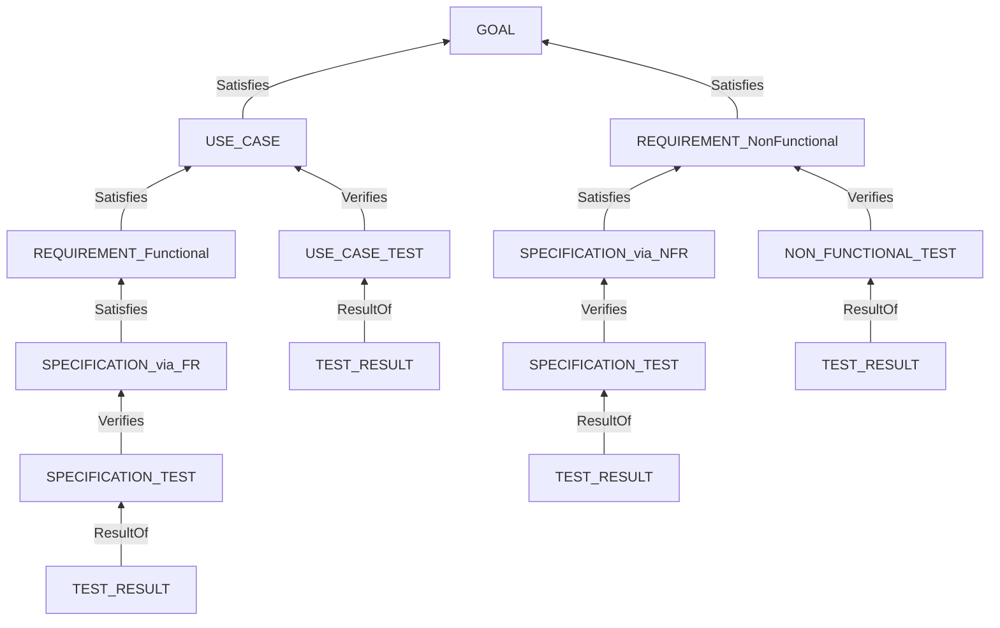

# 仕様形式 StrictDoc 統一 — 編集計画（第 5 版）

**本書は計画である。まだ 1 文書も編集していない。** `framework-src/` と `process-rules/` には触れていない。編集の対象は `maintenance/2026-08-08/` 配下の各文書であり、本体への適用は段 5 以降にユーザーの許可を得てから行う。

**版ごとの変更:**

| 版 | 変更 |
|:-:|---|
| 1 | 初版 |
| 2 | 用語（`TAG` / UID 接頭辞 / `ROLE`）の説明を新設。第 1 版はこの 3 つを混ぜて書いており誤解を生んだ |
| 3 | `Type` の書き場所と綴りの規則を実測して追加。テストの 3 系統をノード型に分けた |
| 4 | 全面改訂。§1 に「各 Type の列を持つ一覧表」を置いた |
| **5** | **§1.1 の表に「意味」列（for Node / for Relation / for Field）を足した。`ADR` の UID を復活。Ch5 を Architecture から Design へ改名。集約ファイルの命名規則を新設** |

---

## 1. 型と名前の関係

**ここが繰り返し分かりにくいと言われている箇所である。表を 3 枚置く。**

### 1.1 `Type` は 3 つの意味で、5 か所に出る

| # | どこ | 意味 | キー | 説明 | 値の例 |
|:-:|---|---|---|---|---|
| 1 | `.sgra` の `ELEMENTS` 直下 | **for Node** | `TAG:` | ノードの型を**宣言する** | `GOAL` |
| 2 | **`.md` のノード先頭** | **for Node** | `**Type**:` | そのノードの型を**名指す** | `GOAL` |
| 3 | `.sgra` の `RELATIONS` の中 | **for Relation** | `TYPE:` | 関係の種類を**宣言する** | `Parent` / `File` |
| 4 | `.md` の `**Relations**:` の中 | **for Relation** | `**Type**:` | その関係の種類を**名指す** | `Parent` / `File` |
| 5 | `.sgra` の `FIELDS` の中 | **for Field** | `TYPE:` | **欄に入る値の型** | `String` / `SingleChoice(...)` |

**読み方は 3 つに分かれる。**

| 意味 | 宣言する側（`.sgra`） | 名指す側（`.md`） | 関係 |
|---|---|---|---|
| **for Node** | 1 `TAG:` | 2 `**Type**:` | **必ず同じ値になる** |
| **for Relation** | 3 `TYPE:` | 4 `**Type**:` | **必ず同じ値になる** |
| **for Field** | 5 `TYPE:` | **無い** | **`.md` 側に対応が無い。** 値そのものが型を満たすかを StrictDoc が判定する |

> **名前が `TAG` と `Type` で揃っていないのは StrictDoc 側の都合であり、こちらでは変えられない。**

**現物で並べる:**

```text
spec.sgra                                  04-requirements.md
-------------------------------------      ------------------------------
[GRAMMAR]                                  ### 語を受け取る
ELEMENTS:
- TAG: REQUIREMENT            --- 1 --2--> **Type**: REQUIREMENT
  FIELDS:                                  **UID**: FR-001
  - TITLE: UID                             **REQ_KIND**: Functional
    TYPE: String              --- 5        **REVIEW_STATUS**: NoFinding
    REQUIRED: True                         **Relations**:
  - TITLE: REQ_KIND                        - **Type**: `Parent`
    TYPE: SingleChoice(...)   --- 5          **ID**: `UC-001`
    REQUIRED: True                           **Role**: `Satisfies`
  RELATIONS:
  - TYPE: Parent              --- 3 --4-->   **Type**: `Parent`
    ROLE: Satisfies           -----------> **Role**: `Satisfies`
```

**上の番号は §1.1 の表の行番号である。** `1` と `2` が for Node の対、`3` と `4` が for Relation の対、`5` は for Field で `.md` 側に相手がいない。

> **図では省いたが、`.md` の欄の行末には行継続の `\` が付く。** 解析には不要だが、Markdown として 1 行にまとめて見せるために `md-basic-ja` が採っている書き方である。

### 1.2 ノードの一覧表

| UID 接頭辞 | 章 | `.sgra` の `TAG:`<br>（for Node・宣言） | `.md` の `**Type**:`<br>（for Node・名指し） | 親の `TAG` | 関係の `TYPE` | `ROLE` | ファイル | 備考 |
|---|---|---|---|---|---|---|---|---|
| — | 全章 | `SECTION` | `SECTION` | — | — | — | 全ノード文書 | 章の見出し。`IS_COMPOSITE: True` |
| — | 全章 | **宣言しない** | **書かない** | — | — | — | 全ノード文書 | `TEXT`。地の文。**StrictDoc が自動で作る** |
| **`GL`** | Ch1.3 | `GOAL` | `GOAL` | **無し（根）** | — | — | `01-foundation.md (SD)` | 鎖の根 |
| `UC` | Ch3.2 | `USE_CASE` | `USE_CASE` | `GOAL` | `Parent` | `Satisfies` | `03-use-cases.md (SD)` | 主成功シナリオ・拡張は欄 |
| `FR` | Ch4.1 | `REQUIREMENT` | `REQUIREMENT` | `USE_CASE` | `Parent` | `Satisfies` | `04-requirements.md (SD)` | `REQ_KIND: Functional` |
| `NFR` | Ch4.2 | `REQUIREMENT` | `REQUIREMENT` | `GOAL` | `Parent` | `Satisfies` | `04-requirements.md (SD)` | `REQ_KIND: NonFunctional` |
| **`ADR`** | **Ch5.6** | **宣言しない** | **書かない** | — | — | — | `05-design.md (SD)` | **UID を持つがノードではない（決定 24）。トレースに載せない** |
| **`SP`** | Ch6 | `SPECIFICATION` | `SPECIFICATION` | `REQUIREMENT` | `Parent` | `Satisfies` | `06-specification.md (SD)` | **EARS 1 文 1 件** |
| `TC` | Ch9 | `USE_CASE_TEST` | `USE_CASE_TEST` | `USE_CASE` | `Parent` ＋ `File` | `Verifies` | `09-uc-test-cases.md (SD)` | `File` はテストコードを指す |
| `TC` | Ch11 | `SPECIFICATION_TEST` | `SPECIFICATION_TEST` | `SPECIFICATION` | `Parent` ＋ `File` | `Verifies` | `11-sp-test-cases.md (SD)` | 同上 |
| `TC` | Ch13 | `NON_FUNCTIONAL_TEST` | `NON_FUNCTIONAL_TEST` | `REQUIREMENT`（NFR のみ） | `Parent` ＋ `File` | `Verifies` | `13-nfr-test-cases.md (SD)` | 同上 |
| `TR` | Ch10 / 12 / 14 | `TEST_RESULT` | `TEST_RESULT` | **テスト 3 型のいずれか** | `Parent` | `ResultOf` | `10` / `12` / `14`-`*-test-results.md (SD)` | 1 ケースに N 件 |

**3 列目と 4 列目が常に同じ値であることが、この表で言いたいことである。**

**宣言する `TAG` は 9 種、UID 接頭辞は 8 件、`ROLE` は 3 種。すべての関係が鎖に載る。**

> **`ADR` だけが「UID を持つがノードではない」。** 3 列目と 4 列目が空である。**議論のときに `ADR-003` と名指せることを優先し、トレースには載せない**（決定 24）。**代償は §1.5 に書く。**

### 1.3 型ごとの欄

| `TAG` | 必須の欄 | 任意の欄 |
|---|---|---|
| `SECTION` | `TITLE` | — |
| `GOAL` | `UID` / `TITLE` / `STATEMENT` | — |
| `USE_CASE` | `UID` / `TITLE` / `UC_LEVEL` / `STATEMENT` / `MAIN_SCENARIO` | `EXTENSIONS` |
| `REQUIREMENT` | `UID` / `TITLE` / `REQ_KIND` / `REVIEW_STATUS` / `STATEMENT` | `ORIGIN` / `RATIONALE` |
| `SPECIFICATION` | `UID` / `TITLE` / `STATEMENT` | `RATIONALE` |
| `USE_CASE_TEST` | `UID` / `TITLE` / `GIVEN` / `WHEN` / `THEN` | — |
| `SPECIFICATION_TEST` | `UID` / `TITLE` / **`TEST_LEVEL`** / `GIVEN` / `WHEN` / `THEN` | — |
| `NON_FUNCTIONAL_TEST` | `UID` / `TITLE` / `GIVEN` / `WHEN` / `THEN` | — |
| `TEST_RESULT` | `UID` / `TITLE` / `RESULT` / `EXECUTED_ON` / `ENVIRONMENT` / **`EVIDENCE`** | `REMARK` |

**値域を持つ欄:**

| 欄 | 値域 |
|---|---|
| `REQ_KIND` | `SingleChoice(Functional, NonFunctional)` |
| `REVIEW_STATUS` | `SingleChoice(NotReviewed, NoFinding, Open, Fixed, WontFix)` |
| `UC_LEVEL` | `SingleChoice(sea)` |
| `TEST_LEVEL` | `SingleChoice(Unit, Integration, System)` |
| `RESULT` | `SingleChoice(PASS, CONDITIONAL, FAIL, SKIP)` |

> **`USE_CASE_TEST` に `TEST_LEVEL` を置かない。** 受入レベルに決まっており、型が既にそれを言っている。**`SPECIFICATION_TEST` だけが単体・結合・システムにまたがるので欄を持つ。**

> **`NON_FUNCTIONAL_TEST` の観点（性能・セキュリティ・信頼性）を欄にするかは決めていない**（§9 未決 1）。

### 1.4 綴りの規則 — 場所ごとに違う

**`TAG` の綴りは StrictDoc が文法で縛っている。**

```text
Expected Not or '[A-Z]+(_[A-Z]+)*'
error source: strictdoc/backend/sdoc/grammar_reader.py:46, function: read()
```

**実測（2026-08-09。最小の `.sgra` + `.md` で 4 通り）:**

| 書き方 | 例 | 終了 |
|---|---|:-:|
| **UPPER_SNAKE_CASE** | `USE_CASE_TEST` | **0（通る）** |
| kebab-case | `USE-CASE-TEST` | 1 |
| lowerCamelCase | `useCaseTest` | 1 |
| PascalCase | `UseCaseTest` | 1 |

**場所ごとの綴り:**

| 対象 | 綴り | 例 | 根拠 |
|---|---|---|---|
| **`TAG`（ノード型）** | **UPPER_SNAKE_CASE** | `USE_CASE_TEST` | **文法で強制（実測）** |
| **`ROLE`（関係名）** | **PascalCase** | `ResultOf` / `Satisfies` | **実測で通っている** |
| 欄名（`TITLE:`） | UPPER_SNAKE_CASE | `REQ_KIND` / `EXECUTED_ON` | 慣例。**強制かは未測定** |
| UID 接頭辞 | 大文字 | `GL` / `SP` / `TC` | 本フレームワークの規約 |
| ファイル名 | kebab-case | `09-uc-test-cases.md` | 本フレームワークの規約 |

### 1.5 UID を振る基準

> **UID を持つのは、ノード型として宣言したものだけである。加えて文書ヘッダが持つ。**

> **判定規則: 誰かが `Relations` で指すか、機械が検証するか。どちらも無いなら UID は飾りである。振ってはならない（MUST NOT）** —— 維持されなくなり、やがて実体とずれる。

**この規則で `ND` / `CN` を落とした**（決定 17）。経緯は `09-element-inventory.md` §1.1 にある。

**`ADR` だけは例外とする（決定 24）。** 議論の場で `ADR-003` と名指せないと、そのたびに判断の中身を言い直すことになる。**その費用のほうが高い。**

| | 得るもの | 失うもの |
|---|---|---|
| `ADR` に UID を振る | **議論で名指せる。文書間で参照できる** | **StrictDoc が検証しない。** 参照が切れても export は止まらない |

> **代償を塞ぐ手当てを 1 つ置く。** `ADR-xxx` の参照が同じ文書内で解決するかを、**素朴な本文検査（現行の `check-links` と同じ仕組み）で守る。** StrictDoc の外側の検査になる。

> **`D21`（接頭辞と `TAG` の対応検査）は `ADR` を対象外とする（MUST）。** 対応する `TAG` が無いためである。

---

## 2. 決定一覧

| # | 決定 | 決めた人 |
|:-:|---|---|
| 1 | **`GOAL` の UID 接頭辞を `GL` にする**（`TAG` は `GOAL` のまま） | ユーザー |
| 2 | **Ch6 Specification に UID を振る。接頭辞は `SP`** | ユーザー |
| 3 | **機能側のトレースは 2 段。** `UC` テスト（受入）と `SP` テスト（実装） | ユーザー |
| 4 | **`NFR` には `NFR` 用のテストを立てる** | ユーザー |
| 5 | **`TC` を 3 ファイル、`TR` をそれに紐づく 3 ファイルに分ける** | ユーザー |
| 6 | **`SP` の粒度は EARS 構文 1 つで書ける粒度とする** | ユーザー |
| 7 | **`SP` の親に `NFR` を許す。** その場合も `NFR` 用の `TC` と `SP` 用の `TC` は分ける | ユーザー |
| 8 | ~~`TC` の欄名は `TEST_KIND`~~ **決定 15 が引き取った。欄は不要** | — |
| 9 | **Ch7 Test Strategy に 3 系統のマトリクスを持たせる** | ユーザー |
| 10 | **`SC` を廃止し、`TC` / `TR` に改める** | ユーザー |
| 11 | **章番号とファイル番号を規則で一致させる。** 順序は変わらない。省略はある | ユーザー |
| 12 | **`NFR` も `SP` と同じく EARS 1 文の粒度とする** | ユーザー |
| 13 | **`TR` はテストを実行したエージェントが書く** | ユーザー |
| 14 | **「システム構成図」の衝突は `§9.14` 側を「コンポーネント図」に改めて解く** | ユーザー |
| 15 | **テストの 3 系統を、欄ではなくノード型で分ける。`TEST_KIND` 欄は廃止** | ユーザー |
| 16 | **`TAG` の綴りは UPPER_SNAKE_CASE**（選択の余地なし） | StrictDoc |
| 17 | **`ND` / `CN` をノード型にせず地の文に落とす。** `Affects` / `From` / `To` も廃止 | ユーザー |
| 18 | ~~`ADR` の UID を廃止する~~ **決定 24 で撤回した** | — |
| 19 | **モデルとスキーマは記法ではなく役割で分ける。** 裸の「データモデル」は非採用語 | ユーザー |
| **20** | **Ch6 の表・図は資料であり、`SP` はそれについての言明とする**（§5.2） | ユーザー |
| **21** | **`USE_CASE_TEST` の `ROLE` を分けない。`Verifies` のままとする**（§5.5） | 合意 |
| **22** | **`TEST_RESULT` に `EVIDENCE` 欄を持たせる** | ユーザー |
| 23 | **ファイル番号は 1 始まりとする** | ユーザー |
| **24** | **`ADR` は UID を持つ。ただし StrictDoc のトレースにはどこにも紐づけない**（決定 18 の撤回） | ユーザー |
| **25** | **Ch5 を Architecture から Design（設計）へ改名する** | ユーザー |
| **26** | **複数の章を 1 枚に入れるファイルは、範囲を名前に含める**（`05-08-design.md`） | 合意 |

### 2.1 決定 25 を採る理由

**Ch5 の中身は「アーキテクチャ」より広い。** 方式・コンポーネント分割・ファイル構成・ドメインモデル・振る舞い・ADR が入っており、**ファイル構成とドメインモデルはアーキテクチャではなく設計である。**

| # | 改名で収まりが良くなるもの |
|:-:|---|
| 1 | **Ch8 が「Design Principles Compliance（設計原則 準拠確認）」である。** Ch5 が Design なら、Ch8 は Ch5 を照合する章として素直に読める |
| 2 | **file_type の `spec-design`（Ch5〜Ch8）が字義どおりになる** |
| 3 | **Ch6 Specification との境界が言葉で立つ** —— 下の表 |

**Ch5 と Ch6 の境界:**

| | **Ch5 Design（設計）** | **Ch6 Specification（仕様）** |
|---|---|---|
| 何を書くか | **どう組むか。構造と方針** | **何を守るか。言明** |
| ノード | **無し**（`ADR` は UID のみ） | **`SPECIFICATION`** |
| 誰が読むか | 人 | 人と機械 |
| 破られたとき | 設計判断のやり直し | **テストが落ちる** |

> **`ADR`（Architecture Decision Record）の語は変えない。** 業界で確立した語であり、章名が Design になっても意味は通る。

---

## 3. 章とファイル番号の規則（決定 11・23）

> **規則: ファイル番号は、そのファイルが持つ最初の章の番号とする（MUST）。**

**番号は席番号であり、並び順ではない。** 形式によってファイルが省かれても、**残ったファイルの番号を詰め直してはならない（MUST NOT）。**

**対応表は `09-element-inventory.md` §5 にある。** 規則を当てて直るものが 2 件ある。

| # | 直るもの |
|:-:|---|
| 1 | **`06` と `07` の入れ替え。** `06-file-inventory.md` は `06` を design-principles-check、`07` を test-strategy としているが、**章は Ch7 が Test Strategy、Ch8 が Design Principles である** |
| 2 | **0 始まりを 1 始まりにする**（決定 23）。`00-foundation` → `01-foundation`。**章番号との差をゼロにする** |

**複数の章を 1 枚に入れるファイルは、範囲を名前に含める（MUST。決定 26）。**

| 章の数 | 名前の形 | 例 |
|---|---|---|
| 1 章 | `NN-章名.md` | `05-design.md` |
| 複数章 | **`NN-MM-まとめ名.md`** | `05-08-design.md` |

| 形式 | 枚数 | ファイル | 持つ章 |
|---|:-:|---|---|
| **簡易** | **1** | `01-14-spec.md (SD)` | Ch1〜Ch14 |
| 中間 | 3 | `01-04-upper.md (SD)` / `05-08-design.md (SD)` / `09-14-test.md (SD)` | Ch1〜4 / Ch5〜8 / Ch9〜14 |
| 分割 | 14 | `01-foundation.md (SD)` … `14-nfr-test-results.md (SD)` | 1 章ずつ |

> **範囲を入れないと名前が衝突する。** 14 枚形式の `05-design.md` は Ch5 だけ、3 枚形式の同名ファイルは Ch5〜8 を持つ。**同じ名前で守備範囲が違うと、フレームワーク文書側でどちらを指すのか書けない。**

---

## 4. 何枚に分けるか

> **簡易は 1 枚を推す。理由は 1 行で言える。**

> **文書を分ける理由はビューである。ビューを見ない形式に、分ける理由が無い。**

`04-spec-format-unification.md` §3.1 は簡易を「検証を回さない。書くだけ」と定めている。そして実測（§7.4）で分かったのは、**文書を分けることの効き目は HTML のトレース画面が系統ごとに分かれること**という一点である。**画面を見ないなら、得るものが無い。**

| 形式 | 既定 | 理由 |
|---|:-:|---|
| **簡易** | **1 枚** | 検証を回さない。分量も 1 コンテキストウィンドウに収まる規模なので木も小さい |
| **通常** | **14 枚（該当章のみ）** | 検証と HTML を回す。回すなら画面が要り、画面が要るなら分ける |
| **厳密** | 14 枚（全章） | 同上 |

**3 枚は簡易が 1 枚に収まらなくなったときの避難先であり、通常の既定ではない。**

---

## 5. 設計の詳細

### 5.1 鎖

**トレースの鎖とテストの接続:**



`GOAL` を根とし、テストは 3 か所から刺さる。**1 つのテストは 1 か所しか指さない。**

**`ROLE` は 3 種すべてが鎖に載る。鎖の外の関係は無い（決定 17）。** したがって**削減候補の判定は「`Parent` 関係を 1 つでも持つか」だけになる。**

**`FR` は自前のテストを持たない。** 覆われ判定は積み上げになる（§6 の D16d）。

### 5.2 Ch6 の書き方 — 表は資料、`SP` は言明（決定 20）

**第 3 版は「Ch6 には EARS で書けないものがある」と書いた。これは誤りである。**

> **正しい切り分けは「表そのものを `SP` にしない。`SP` は表についての言明である」。**

| Ch6 の中身 | 資料（参照される） | `SP`（EARS 1 文） |
|---|---|---|
| データスキーマ | ERD / DDL / JSON Schema | 「システムは、利用者に関する情報を `table-users` にのみ保存すること」 |
| UI 要素マップ | 要素と識別子の対応表 | 「システムは、ログイン画面に、メール欄・パスワード欄・送信ボタンを表示すること」 |
| 設定定義 | 設定名と既定値の表 | 「もし `PORT` が設定されていないならば、システムは 8080 を使うこと」 |
| API 定義 | 経路と手段の表 | 「システムは、`/lookup` に対し `word` を 1 つ受け取ること」 |

**あわせて規則を 1 つ置く。**

> **資料に機械可読な形で書いてあることを、`SP` で繰り返してはならない（MUST NOT）。**

DDL に `VARCHAR(32) NOT NULL` と書いてあるなら、**その制約は DBMS が強制する。** `SP` で書き写せば二重管理になり、やがてずれる。**`SP` が書くのは、資料に現れない振る舞い**である —— どこに保存するか、いつ書くか、何を拒むか。

**判定の問い:** その文が破られたときに何が起きるかを言えるか。**言えるなら `SP`。言えないなら資料である。**

### 5.3 `NFR` 由来の `SP` の守備範囲（決定 7・12。例を示す）

> **規則: `NFR` も `SP` も EARS 1 文で書く（MUST）。`TC` は、指している 1 文に書かれていることだけを確かめる（MUST）。文に書かれていないことを確かめてはならない（MUST NOT）。**

**守備範囲は「文」が決める。** 文が違えば `TC` も違い、重ならない。以下は作例である。

**非機能要求（`04-requirements.md`）:**

```markdown
### 信頼できない入力を検証する

**Type**: REQUIREMENT \
**UID**: NFR-005 \
**REQ_KIND**: NonFunctional \
**REVIEW_STATUS**: NoFinding
**Relations**:
- **Type**: `Parent` \
  **ID**: `GL-002` \
  **Role**: `Satisfies`

**STATEMENT**: もし信頼できない経路から値を受け取ったならば、 システムは、 受け付ける集合との照合によって検証すること。
```

この 1 文が言っているのは**「照合によって検証すること」**である。どの符号を返すかも、どんな文言を返すかも書いていない。

**そこから生まれた詳細仕様（`06-specification.md`）:**

```markdown
### 語の形を検証する

**Type**: SPECIFICATION \
**UID**: SP-021
**Relations**:
- **Type**: `Parent` \
  **ID**: `NFR-005` \
  **Role**: `Satisfies`

**STATEMENT**: もし `word` が英小文字 1 文字以上 32 文字以下に一致しないならば、 システムは、 HTTP 400 と符号 `invalid_word` を返すこと。
```

この 1 文が言っているのは**「400 と `invalid_word` を返すこと」**である。他の経路のことは書いていない。

**`NFR` 用のテスト（`13-nfr-test-cases.md`）:**

```markdown
### 信頼できない経路に検証漏れが無い

**Type**: NON_FUNCTIONAL_TEST \
**UID**: TC-003
**Relations**:
- **Type**: `Parent` \
  **ID**: `NFR-005` \
  **Role**: `Verifies`
- **Type**: `File` \
  **Path**: `tests/test_input_coverage.py`

**GIVEN**: 信頼できない経路として Ch2 が挙げているものが 1 つ以上ある。

**WHEN**: それぞれの経路へ、 受け付ける集合の外にある値を送る。

**THEN**: いずれの経路も、 値を処理せずに拒む。
```

**`SP` 用のテスト（`11-sp-test-cases.md`）:**

```markdown
### 英小文字以外の語を拒む

**Type**: SPECIFICATION_TEST \
**UID**: TC-002 \
**TEST_LEVEL**: Unit
**Relations**:
- **Type**: `Parent` \
  **ID**: `SP-021` \
  **Role**: `Verifies`
- **Type**: `File` \
  **Path**: `tests/test_validate.py`

**GIVEN**: `word` に `ABC!` を置く。

**WHEN**: `/lookup` を呼ぶ。

**THEN**: HTTP 400 と符号 `invalid_word` が返る。
```

**2 つは重ならない。** 理由は指している文が違うからである。

| | `TC-003`（`NFR` 用） | `TC-002`（`SP` 用） |
|---|---|---|
| 確かめる文 | `NFR-005` の 1 文 | `SP-021` の 1 文 |
| **確かめること** | **経路に漏れが無いこと** | **その 1 経路が仕様どおり返すこと** |
| 見ないもの | 符号も文言も見ない | 他の経路を見ない |
| 典型的な道具 | 構成との突き合わせ・fuzzing・スキャン | 単体テスト |

### 5.4 `TEST_RESULT` の書き方（決定 13・22）

```markdown
### [PASS] 英小文字以外の語を拒む

**Type**: TEST_RESULT \
**UID**: TR-002 \
**RESULT**: PASS \
**EXECUTED_ON**: 2026-08-08 \
**ENVIRONMENT**: CI (host, python 3.13) \
**EVIDENCE**: ci/run-4821/junit.xml#test_validate::test_reject_symbol
**Relations**:
- **Type**: `Parent` \
  **ID**: `TC-002` \
  **Role**: `ResultOf`

**REMARK**: TR-001 の修正後の再走行である。
```

> **`EVIDENCE` は必須とする（MUST）。** 任意にすると書かれなくなり、**手で書いた `RESULT` を裏づけるものが何も無くなる。** トレーサビリティが 0 件になったのと同じ経路である。

> **`EVIDENCE` には後から取り出せるものを書く（MUST）** —— 走行ログの位置、実行 ID、成果物のパス。**「確認済み」のような、たどれない文字列を書いてはならない（MUST NOT）。**

### 5.5 `TC` / `TR` の規則

| # | 規則 |
|:-:|---|
| 1 | **`TC` は `Verifies` 関係をちょうど 1 つ持つ（MUST）** |
| 2 | **1 つの `TC` が 2 つの段を指してはならない（MUST NOT）** |
| 3 | **テストの `TAG` と、実際に指している親の `TAG` が対応しなければならない（MUST）** |
| 4 | **`TEST_KIND` 欄は持たない（MUST NOT）。** 系統は `TAG` が持つ（決定 15） |
| 5 | **`TR` はテストを実行したエージェントが書く**（決定 13） |
| 6 | **`TC` に対する `TR` は 1 対 N。** 走行のたびに `TR` を足す。上書きしない |

**規則 3 の対応表:**

| テストの `TAG` | 指してよい親の `TAG` |
|---|---|
| `USE_CASE_TEST` | `USE_CASE` |
| `SPECIFICATION_TEST` | `SPECIFICATION` |
| `NON_FUNCTIONAL_TEST` | `REQUIREMENT`（`REQ_KIND` が `NonFunctional` のもの） |

#### `ROLE` を `Validates` に分けない理由（決定 21）

**第 3 版は「`USE_CASE_TEST` 向けを `Validates` に分ける」を推していた。撤回する。**

| # | 分けても得られないもの |
|:-:|---|
| 1 | **StrictDoc の検証は増えない。** 段の取り違え（`USE_CASE_TEST` が `SP` を指す）は相手の `TAG` を制約できない以上 jq でしか捕まらず、`ROLE` を分けても捕まらない |
| 2 | **`ROLE` が 3 → 4 に増える。** 鎖を辿るクエリの条件が 1 つ増える |
| 3 | **そもそも `Verifies` で正しいという見方が強い。** `UC` は仕様書に書かれた成果物であり、**それとの一致を確かめるのは検証である。** 妥当性確認は「そのユースケース自体が要るのか」を利用者に問うことであり、**それはテストではなくレビューと実機テストの仕事である** |

### 5.6 file_type（`.meta.yaml` の `type`）

**現行の `spec-foundation` / `spec-architecture` の 2 つでは 14 ファイルを表せない。**

> **分ける基準はオーナーである。** `.meta.yaml` が持つのは `owner` / `consumed_by` / `document_status` であり、**それが変わる境界で型を分ける。** 章ごとに作ると 14 個になり、意味の無い細分になる。

| `file_type` | 対象（章） | オーナー | 次に使う者 | どの形式で使うか |
|---|---|---|---|---|
| `spec` | Ch1〜Ch14 | srs-writer | 全エージェント | **簡易（1 枚）** |
| `spec-upper` | Ch1〜Ch4 | srs-writer | 全エージェント | 中間・分割 |
| `spec-design` | Ch5〜Ch8 | architect | implementer / review-agent | 同上 |
| `spec-test` | Ch9〜Ch14 | test-engineer | implementer / progress-monitor | **中間（3 枚）のみ** |
| `spec-test-case` | Ch9 / 11 / 13 | test-engineer | implementer / review-agent | **分割（14 枚）のみ** |
| `spec-test-result` | Ch10 / 12 / 14 | **テストを実行したエージェント** | progress-monitor | 同上 |

**移行の対応:** `spec-foundation` → `spec-upper`、`spec-architecture` → `spec-design`。

> **`spec-architecture` を参照している箇所に注意が要る。** `runbook-writer` は In の必須要素として `spec-architecture` の「Ch3 のシステム構成図」を求めている。**型名の変更に加えて参照先の章も動く**（§9 未決 3）。

### 5.7 語の衝突（決定 14・19）

| 場所 | 現 | 新 |
|---|---|---|
| v0.35 Ch2.1 | システム構成図 | **システム構成図（変えない）** |
| `§9.14` 側 | システム構成図 | **コンポーネント図** |
| `document-rules:1277` | データモデル | **ドメインモデル** |
| `document-rules:1273` | データモデルマイグレーション数 | **データスキーマのマイグレーション数** |
| `agents/architect.md:3` | データモデル | **データスキーマ** |
| `process-rules:900` | データモデルサンプル | **ドメインモデルサンプル** |

**モデルとスキーマの区別、および「データモデル」を非採用語にする理由は `09-element-inventory.md` §6 にある。**

---

## 6. クエリの改定

| # | 検出したいもの | 判定 | 状態 |
|:-:|---|---|---|
| D17 | **鎖から外れたノード** | `Parent` 関係を 1 つも持たない（`GOAL` を除く） | **実測済** |
| D16a | テストに覆われない `UC` | その `UC` を `Verifies` する `TC` が無い | 未測 |
| D16b | テストに覆われない `SP` | その `SP` を `Verifies` する `TC` が無い | 未測 |
| D16c | テストに覆われない `NFR` | その `NFR` を `Verifies` する `TC` が無い | 未測 |
| **D16d** | **テストに覆われない `FR`** | **その `FR` に `SP` が 1 件も無い、または配下の `SP` のいずれかが覆われていない** | 未測 |
| D19 | **走らせていないテスト** | その `TC` を `ResultOf` する `TR` が無い | **実測済** |
| D20 | **段をまたいだテスト** | `TC` が `Verifies` を 2 つ以上持つ、またはテストの `TAG` と親の `TAG` が §5.5 の対応表と合わない | 未実装 |
| D21 | **接頭辞の規約違反** | ノードの `TAG` と UID の接頭辞が §1.2 の表と合わない | 未実装 |

> **接頭辞で絞るときは、必ずハイフンまで含める（MUST）。** `startswith("FR-")` と書く。**区切りまで含めれば、接頭辞を増やしても壊れない。**

---

## 7. 実測で確かめたこと（2026-08-09）

**測定環境:** strictdoc 0.27.1 / Python 3.13.3 / jq 1.8.1 / Windows 11 / Git Bash。**すべてのファイルはバイトを `od -c` で確認してから走らせた。**

### 7.1 `TEST_RESULT` の分離は通る

| 測ったこと | 結果 |
|---|---|
| `ResultOf` 関係の解決 | 通る。2 件の `TR` が同じ `TC` を指す 1 対 N が成立した |
| 鎖の孤立検出（D17） | **仕込んだ 2 件だけを拾い、正当な 11 件は 1 件も誤検出しない** |
| **未走行テストの検出（D19）** | **`TR` を持たない `TC` 1 件だけを拾った** |
| `File` 関係 | `Path` で `tests/*.py` に解決する |

> **`TEST_RESULT` を別ノードにしたことで `NotRun` という値が要らなくなった。** ノードが無いこと自体が「まだ走らせていない」を意味する。

### 7.2 `**Relations**:` の配置に制約がある

**メタデータ欄と `**Relations**:` の間に空行を 1 つ挟むと export が止まる。**

```text
error: Semantic error: Markdown parsing error:
       Relations must directly follow requirement metadata without an empty line.
```

| 書き方 | 結果 |
|---|---|
| メタデータ欄の直後（**空行なし**）に置く | **通る。** 本書の作例はすべてこの形 |
| 本文欄（`GIVEN` など段落として書く欄）を挟んでから置く | 通る |
| **メタデータ欄との間に空行だけを挟む** | **止まる** |

**`REMARK` のような任意欄は `**Relations**:` の後ろに置いても正しく読まれる**（実測）。

### 7.3 `DEEP_TRACEABILITY_SCREEN` は主因ではない

| 画面 | 出る UID | 大きさ |
|---|---|---:|
| テストケースの `-TRACE.html` | `UC` / `FR` × 3 / `TC` × 3 / `TR` × 3 | 64,320 |
| テストケースの `-DEEP-TRACE.html` | 上記 ＋ 目標 1 件だけ | 61,416 |

**差は祖先 1 段だけで、DEEP のほうがむしろ小さい。** 鎖が短いため TRACE の時点でほぼ根まで届いている。

### 7.4 見にくいのは要求の画面である

| 画面 | 出る UID |
|---|---|
| 要求文書の `-TRACE.html` | **19 件すべて** |
| 要求文書の `-DEEP-TRACE.html` | **同じく 19 件** |

**全要求を 1 枚に置いているため、そこを根にした画面は必ず全体を映す。**

> **結論: ビューの単位は文書である。** 文書を分けることが、そのままビューを分けることになる。**§4 の「簡易は 1 枚」も、この事実から導いている。**

### 7.5 `TAG` の綴りは選べない

**§1.4 のとおり。UPPER_SNAKE_CASE 以外は文法が受け付けない。**

### 7.6 `--filter-nodes` は使わない（ユーザー決定）

**必要な情報は全量 JSON に出し、jq で絞る。**

| 帰結 | 内容 |
|---|---|
| JSON 側は元から変わらない | **`--filter-nodes` は JSON に効かない**（実測） |
| **接頭辞の包含衝突が問題にならなくなった** | jq の `startswith("FR-")` なら `NFR-001` を拾わない |
| **失うもの** | 「上流を捨てて下流だけ見る」HTML ビュー。**代わりに文書分割で対処する** |

---

## 8. 文書ごとの編集指示

**すべて `maintenance/2026-08-08/` 配下。本体（`framework-src/` / `process-rules/`）は対象外。**

| 対象 | 編集内容 |
|---|---|
| **`00-spec-template-draft.md`**<br>「ID の接頭辞」節 | 表を §1.2 に差し替える。**件数は 8 のまま。中身が入れ替わる**（`ND` / `CN` / `SC` が消え、`SP` / `TC` / `TR` が入る。`ADR` は残る）。**`TAG` と UID 接頭辞と `ROLE` の違い（§1.1）を注記する** |
| 同 「記入例の読み替え」節 | `GOAL-001` → `GL-001`、`SC-001` → `TC-001`。`ND-001` / `CN-001` の行を消す |
| 同 「Chapter Structure」節 | **章を 8 から 14 に増やす。** Ch9〜Ch14 にテストの 6 章を足す |
| 同 **Ch2 System Configuration** | **`ND` / `CN` の ID を廃し、地の文にする**（決定 17）。表は残すが UID 列を削る |
| 同 **Ch5** | **章名を Architecture から Design（設計）へ改める**（決定 25）。**`ADR` の ID は残す**（決定 24）。**「ドメインモデル」の語を確定する**（決定 19）。**Ch6 との境界（§2.1 の表）を本文に書く** |
| 同 **Ch6 Specification** | **`SP` ノードを導入する。** §5.2 の規則（表は資料・`SP` は言明・資料を繰り返さない）を本文に書く |
| 同 **Ch6.1 Scenarios** | **本節を Chapter 6 から外し、Ch9 / Ch11 / Ch13 へ移す。** `SC-901` を `TC-901` に改める。**`Result:` / `Remark:` の手書き欄を削り、`TR` へ移す** |
| 同 Ch4「トレースの向き」 | `SP` の 1 段を足す。**`FR` が自前のテストを持たず、覆われ判定が積み上げになることを書く** |
| 同 **Ch7 Test Strategy** | **3 系統（UC / SP / NFR）のマトリクスを置く**（決定 9） |
| 同 **Ch9〜Ch14（新設）** | テストの 6 章を新設する。§5.3・§5.4 の作例を記入例として使う |
| **`02-framework-fixes.md`** §3 | **案 A を採ったことを記録する**（決定 14） |
| **`04-spec-format-unification.md`** §3.2 | 章 → ノード型の対応表を §1.2 に合わせる。**「ノードになるのは 7 種類」を 9 種類に直す。決定 1（`ND` / `CN` をノード型にする）が覆ったことを明記する** |
| 同 §3.4 | 削減候補の検出クエリ表を §6 に差し替える |
| **`06-file-inventory.md`** §A の表 | **ファイル名を `01-`〜`14-` へ振り直す。** `05-specification` の「UID を持たない」を撤回。テスト 6 行に差し替える。**`06` と `07` を入れ替える** |
| 同 §A-1 | `.meta.yaml` の `type` を §5.6 の 6 種に差し替える |
| 同 §A-2 | 鎖の図に `SP` を足し、`TC` 3 系統に対応させる |
| 同 §A-3 / §A-6 / §A-7 | **`--filter-nodes` を前提にした記述を削る（§7.6）。** ビューは文書分割で作る旨に改める |
| 同 §A-3 の未確認 | **`DEEP_TRACEABILITY_SCREEN` の未実測を §7.3 の実測に置き換える** |
| **`07-anms-sgra-draft.md`** | **`.sgra` を §1.2 の 9 種へ書き直す。** `NODE` / `CONNECTION` を削り、`SPECIFICATION` とテスト 3 型と `TEST_RESULT` を足す。**§7.2 の `Relations` 配置制約と §1.4 の綴りの規則を追記する** |
| **`05-strictdocstarter-feedback.md`** | **指摘 3 として「出力先を入力フォルダの中に置くと UID 重複で止まる」を足す**（`md-basic-ja` も当たる）。**指摘 4 として §7.2 の `Relations` 配置制約を検討する** |
| **`01-spec-template-migration.md`** | **章が 8 → 14 に増え、ファイル番号が 1 始まりになる。** 本書の置換手順に上乗せされる。**影響は未計測** |

---

## 9. 未決

| # | 内容 | 誰が決めるか |
|:-:|---|---|
| 1 | **`NON_FUNCTIONAL_TEST` に観点の欄（性能 / セキュリティ / 信頼性）を持たせるか。** `SPECIFICATION_TEST` の `TEST_LEVEL` に相当するもの | ユーザー |
| 2 | **`06-design-principles-check`（Ch8）を通常でも要るとするか。** 現行は通常から | ユーザー |
| 3 | **`runbook-writer` / `user-manual-writer` の In の参照先。** 「システム構成の理解」が欲しいのが物理配置（Ch2）なら、参照先ごと向け直す必要がある。**未確認** | 調べてからユーザー |
| 4 | **`_assets/` を複数の製品で共有する場合の衝突。** StrictDoc は `_assets` の名前を固定で扱う。**未検証** | 測ってからユーザー |

---

## 10. 触ってはならないもの

| # | 対象 | 理由 |
|:-:|---|---|
| 1 | **`framework-src/` と `process-rules/`** | 本体はまだ 1 行も変えていない。段 5 以降でユーザーの許可を得てから |
| 2 | **`StrictDocStarter` リポジトリ** | 作業中。参照のみ。**`md-sovd-automotive-ja/` に未コミットの変更がある** |
| 3 | **`git commit` / `push` / `tag`** | 利用者が手で行う |
| 4 | `user-order.md` | 人間が書くもの |

---

## 11. 測るときの規律

| # | 規律 |
|:-:|---|
| 1 | **テストファイルはヒアドキュメント（または素の書き出し）で作る。** 文字列エスケープ経由だと `\` + 改行がリテラル 2 文字になり、別の現象を測ることになる |
| 2 | **測ったら `od -c` でバイトを確認してから結論を書く** |
| 3 | **strictdoc の出力先を入力フォルダの中に置かない。** 出力先を変えた回に UID 重複で止まる |
| 4 | **`--no-parallelization` を必ず付ける。** 並列 export が本当のエラーを握り潰す（strictdoc 0.27.1） |
