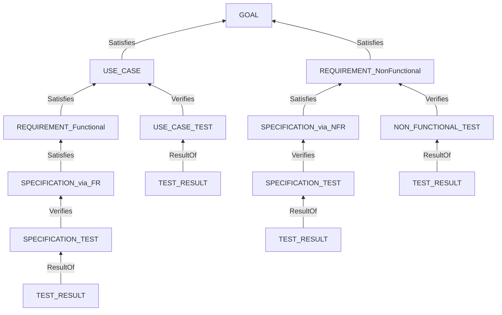

# 仕様形式 StrictDoc 統一 — 編集計画（第 3 版）

**本書は計画である。まだ 1 文書も編集していない。** `framework-src/` と `process-rules/` には触れていない。編集の対象は `maintenance/2026-08-08/` 配下の各文書であり、本体への適用は段 5 以降にユーザーの許可を得てから行う。

**版ごとの変更:**

| 版 | 変更 |
|:-:|---|
| 1 | 初版 |
| 2 | 用語（`TAG` / UID 接頭辞 / `ROLE`）の説明を冒頭に新設。第 1 版はこの 3 つを混ぜて書いており誤解を生んだ。あわせてユーザー決定 4 件を反映 |
| **3** | **`Type` の書き場所（§1.3）と綴りの規則（§1.4）を実測して追加。テストの 3 系統をノード型に分けた（決定 15）** |

---

## 1. 用語の整理 — 3 つは別物である

**第 1 版が誤解を生んだ箇所である。`TAG` と UID 接頭辞と `ROLE` は、それぞれ別のものを指す。**

| | **`TAG`** | **UID 接頭辞** | **`ROLE`** |
|---|---|---|---|
| **何を指すか** | ノードの**型**（種類） | ノード**1 個体**の名前の先頭 | **関係の名前** |
| 例 | `GOAL` | `GL-001` の `GL` | `Satisfies` |
| どこに書くか | `.sgra` の `TAG:`／`.md` の `**Type**:` | `.md` の `**UID**:` | `.sgra` の `ROLE:`／`.md` の `**Role**:` |
| **StrictDoc は検証するか** | **する。** 未宣言の型は export が止まる | **しない。** ただの文字列 | **する。** 未宣言の `ROLE` は export が止まる |
| 誰のためか | StrictDoc と読み手 | 人間と jq | StrictDoc と読み手 |

**具体例で示す。**

**ノードの書き方（`.md` 側）:**

```markdown
### 語の意味を早く知れる

**Type**: GOAL \
**UID**: GL-001

**STATEMENT**: 利用者が、 知りたい語の意味を、 数秒で得られる状態にする。
```

`**Type**: GOAL` が `TAG`（型名）であり、`**UID**: GL-001` の `GL` が接頭辞である。**型名は `GOAL` のまま変えない。短くするのは UID の接頭辞だけである。**

### 1.1 `GL` に変えるのは UID だけである（確認への回答）

> **そのとおりである。`TAG` は `GOAL` のまま。UID の接頭辞だけを `GL` にする。**

| 何 | 変更前 | 変更後 |
|---|---|---|
| `TAG`（型名） | `GOAL` | **`GOAL`（変えない）** |
| UID | `GOAL-001` | **`GL-001`** |

**理由:** 型名は宣言と本文に数回しか現れないので読みやすさを優先する。UID は全文書に何百回も現れ、表・図・トレース画面の桁を食うので短くする。

> **注意すべき穴がある。** **StrictDoc は「`GOAL` 型のノードの UID が `GL-` で始まること」を検証しない。** 接頭辞はただの文字列である。**規約を守らせるには jq の検査が要る**（§6 の D21）。

### 1.2 `ROLE` はエージェント名ではない（確認への回答）

> **エージェント名ではない。`ROLE` は「関係の名前」である。**

StrictDoc の関係は 2 段で表す。

```markdown
**Relations**:
- **Type**: `Parent` \
  **ID**: `GL-001` \
  **Role**: `Satisfies`
```

| 段 | 何 | 値 |
|:-:|---|---|
| 1 | **`Type`** | 関係の**種類**。`Parent` / `File` など。StrictDoc が持つ組み込みの分類 |
| 2 | **`Role`** | その `Parent` が**どういう意味の親か**。`Satisfies` / `Verifies` / `ResultOf` の 3 種（決定 17 で `Affects` / `From` / `To` は消えた） |

**`Type` だけでは「親」としか言えない。** 目標を満たす親なのか、検証する親なのか、単に効く先なのかを区別するのが `ROLE` である。**`.sgra` で宣言していない `ROLE` を書くと export が止まる**（実測）。

**第 1 版の「未決 1」は、この `ROLE` の名前の話である。** 受入テストが `UC` を指すときの `ROLE` を `Verifies`（検証）と呼ぶのは正確でない。**妥当性確認は `Validates` である。** §9 未決 1 に残す。

### 1.3 `Type` はどこに書くか — `.sgra` と `.md` の対応

> **`.sgra` は型を宣言する側、`.md` はどの型かを指定する側である。** そして**同じ `Type` という綴りが、両方のファイルに、別の意味で出る。**

| どこ | キー | 何を意味するか | 値の例 |
|---|---|---|---|
| `.sgra` の `ELEMENTS` 直下 | **`TAG:`** | **ノード型の宣言** | `GOAL` |
| `.sgra` の `FIELDS` の中 | `TYPE:` | **欄のデータ型** | `String` / `SingleChoice(...)` |
| `.sgra` の `RELATIONS` の中 | `TYPE:` | **関係の種類** | `Parent` / `File` |
| **`.md` のノード先頭** | **`**Type**:`** | **ノード型の指定** | `GOAL` |
| `.md` の `**Relations**:` の中 | `**Type**:` | **関係の種類** | `Parent` / `File` |

**「ノード型」を指す語は、`.sgra` では `TAG`、`.md` では `Type` である。名前が揃っていない。** StrictDoc 側の都合であり、こちらでは変えられない。

**対応する現物:**

```text
anms.sgra                        01-foundation.md
---------------------------      ------------------------------
[GRAMMAR]                        ### 語の意味を早く知れる
ELEMENTS:
- TAG: GOAL          <------->   **Type**: GOAL \
  FIELDS:                        **UID**: GL-001
  - TITLE: UID       <------->
    TYPE: String                 **STATEMENT**: 利用者が、 ...
    REQUIRED: True
```

左の `TAG: GOAL` が宣言であり、右の `**Type**: GOAL` がその型を名指している。**左の `TYPE: String` はノード型ではなく欄のデータ型である。**

> **`**Type**:` は省略できない（MUST）。** SOVD サンプルの `**Type**:` 行は 349 件あり、`REQUIREMENT` も `SECTION` も含めて**全ノードが明示している。省略しているノードは 1 件も無い**（実測）。

### 1.4 綴りの規則 — 場所ごとに違う

**`TAG` の綴りは StrictDoc が文法で縛っている。**

```text
Expected Not or '[A-Z]+(_[A-Z]+)*'
error source: strictdoc/backend/sdoc/grammar_reader.py:46, function: read()
```

**実測（2026-08-09。最小の `.sgra` + `.md` で 4 通り）:**

| 書き方 | 例 | 終了 |
|---|---|:-:|
| **UPPER_SNAKE_CASE** | `USE_CASE_TEST` | **0（通る）** |
| kebab-case | `USE-CASE-TEST` | 1 |
| lowerCamelCase | `useCaseTest` | 1 |
| PascalCase | `UseCaseTest` | 1 |

> **`TAG` は大文字と下線だけである。kebab も camel も使えない。数字も使えない**（`[A-Z]+(_[A-Z]+)*` に数字が無い）。**したがってノード型名の綴りに選択の余地は無い。**

**場所ごとの綴り:**

| 対象 | 綴り | 例 | 根拠 |
|---|---|---|---|
| **`TAG`（ノード型）** | **UPPER_SNAKE_CASE** | `USE_CASE_TEST` | **文法で強制（実測）** |
| **`ROLE`（関係名）** | **PascalCase** | `ResultOf` / `Satisfies` | **実測で通っている** |
| 欄名（`TITLE:`） | UPPER_SNAKE_CASE | `REQ_KIND` / `EXECUTED_ON` | 慣例。**強制かは未測定** |
| UID 接頭辞 | 大文字 | `GL` / `SP` / `TC` | 本フレームワークの規約 |
| ファイル名 | kebab-case | `09-uc-test-cases.md` | 本フレームワークの規約 |

---

## 2. 決定一覧

### 2.1 前回までの決定（2026-08-09 前半）

| # | 決定 |
|:-:|---|
| 1 | **`GOAL` の UID 接頭辞を `GL` にする**（`TAG` は `GOAL` のまま） |
| 2 | **`05-specification` に UID を振る。接頭辞は `SP`** |
| 3 | **機能側のトレースは 2 段。** `UC` テスト（受入）と `SP` テスト（実装） |
| 4 | **`NFR` には `NFR` 用のテストを立てる** |
| 5 | **`TC` を 3 ファイル、`TR` をそれに紐づく 3 ファイルに分ける** |
| 6 | **`SP` の粒度は EARS 構文 1 つで書ける粒度とする** |
| 7 | **`SP` の親に `NFR` を許す。** その場合も `NFR` 用の `TC` と `SP` 用の `TC` は分ける |
| 8 | ~~**`TC` の欄名は `TEST_KIND`。値は `UseCase` / `Spec` / `NonFunctional`**~~ **決定 15 が引き取った。欄は不要になる** |
| 9 | **`07-test-strategy` に 3 系統のマトリクスを持たせる** |
| 10 | **`SC` を廃止し、`TC` / `TR` に改める** |

### 2.2 今回の決定（2026-08-09 後半）

| # | 決定 | 出典 |
|:-:|---|---|
| 11 | **章番号とファイル番号を規則で一致させる。** ファイル数は形式で変わるが**順序は変わらない。省略はある** | ユーザー |
| 12 | **`NFR` も `SP` と同じく EARS 1 文の粒度とする。** 守備範囲は「指している 1 文」が決める | ユーザー |
| 13 | **`TR` はテストを実行したエージェントが書く** | ユーザー |
| 14 | **「システム構成図」の語の衝突は案 A で解く** — `§9.14` 側を「コンポーネント図」に改める | ユーザー |
| **15** | **テストの 3 系統を、欄ではなくノード型（`TAG`）で分ける。** `USE_CASE_TEST` / `SPECIFICATION_TEST` / `NON_FUNCTIONAL_TEST`。**`TEST_KIND` 欄は廃止する** | ユーザー |
| 16 | **`TAG` の綴りは UPPER_SNAKE_CASE とする。** 選択の余地は無い（§1.4 の実測） | StrictDoc |
| **17** | **`ND` / `CN` をノード型にせず地の文に落とす。** `NODE` / `CONNECTION` 型と `Affects` / `From` / `To` を廃止する | ユーザー |
| **18** | **`ADR` の UID を廃止する。** Architecture 章は完全に地の文になる | ユーザー |
| 19 | **モデルとスキーマは記法ではなく役割で分ける。** ER 図はモデルであってスキーマではない。裸の「データモデル」を非採用語にする | ユーザー |

### 2.3 決定 15 を採る理由

**当初案は `TEST_CASE` 型 1 つ ＋ `TEST_KIND` 欄だった。ユーザーの提案で型に分けた。分けたほうが良い理由は 3 つある。**

| # | 理由 |
|:-:|---|
| 1 | **`.sgra` の `RELATIONS` は `TAG` ごとに宣言する。** 型を分ければ、`USE_CASE_TEST` に `Validates` だけ、`SPECIFICATION_TEST` に `Verifies` だけを宣言できる。**未宣言の `ROLE` は export が止まるので、段の取り違えの一部を StrictDoc が捕まえる** |
| 2 | **欄が 1 つ減る。** 系統は `TAG` が持つので `TEST_KIND` は重複になる |
| 3 | **JSON の `_NODE_TYPE` で絞れる。** 欄を読むより素直で、HTML のトレース画面にも型名が出る |

> **ただし StrictDoc は「`Verifies` の相手の `TAG`」を制約できない。** `SPECIFICATION_TEST` が `USE_CASE` を指しても export は通る。**最後の 1 段は jq が守る**（§6 の D20）。

> **UID の接頭辞は `TC` / `TR` のまま 1 つずつとする。** 型を分けた目的は「系統を `TAG` に持たせる」ことなので、接頭辞にも系統を持たせると同じ情報が 2 か所に増える。**`TEST_KIND` を捨てた理由と同じ理由で、接頭辞は分けない。**

---

## 3. 章番号とファイル番号の規則（決定 11）

> **規則: ファイル番号は、そのファイルが持つ最初の章の番号とする（MUST）。**

**番号は席番号であり、並び順ではない。** 形式によってファイルが省かれても、**残ったファイルの番号を詰め直してはならない（MUST NOT）。**

### 3.1 章とファイルの対応

> **対応表は `09-element-inventory.md` §5 にある。**

**規則を当てると、現行の食い違いが 1 件直る。** `06-file-inventory.md` は `06` を design-principles-check、`07` を test-strategy としているが、**章は Ch7 が Test Strategy、Ch8 が Design Principles である。** 規則に合わせて**入れ替える。**

**番号が 0 始まりから 1 始まりに変わる。** `00-foundation` → `01-foundation`。**章番号との差をゼロにするためである。** 差が 1 あると、読み手も書き手も毎回引き算することになる。

### 3.2 まとめて 1 枚にする場合

**複数の章を 1 枚に入れるときは、その中で最も小さい章番号を付ける。**

| 形式 | 枚数 | ファイル名 | 持つ章 |
|---|:-:|---|---|
| **簡易** | **1** | `01-spec.md` | Ch1〜Ch14 |
| **中間** | **3** | `01-upper.md` / `05-design.md` / `09-test.md` | Ch1〜4 / Ch5〜8 / Ch9〜14 |
| **分割** | **14** | `01-foundation.md` … `14-nfr-test-results.md` | 1 章ずつ |

**どの形でも規則は 1 つである** — 番号はその文書が持つ最初の章を指す。

---

## 4. 何枚に分けるか（意見を求められた件）

> **簡易は 1 枚を推す。**

**理由は 1 行で言える。**

> **文書を分ける理由はビューである。ビューを見ない形式に、分ける理由が無い。**

`04-spec-format-unification.md` §3.1 は、**簡易を「検証を回さない。書くだけ」と定めている。** そして今回の実測（§7.4）で分かったのは、**文書を分けることの効き目は HTML のトレース画面が系統ごとに分かれることだ**という一点である。**画面を見ないなら、得るものが無い。**

**根拠を 4 つ並べる。**

| # | 根拠 |
|:-:|---|
| 1 | **簡易は検証を回さない。** ビューが要らない |
| 2 | **簡易の分量は 1 コンテキストウィンドウに収まる規模である。** 木も小さく、読めないほど肥大しない |
| 3 | **「単一 Markdown」という ANMS 本来の約束を保てる** |
| 4 | **`.sgra` と `.meta.yaml` を足しても 3 ファイルで済む。** 14 枚 + 14 枚の `.meta.yaml` = 29 ファイルとの差は大きい |

**ご提案の 3 枚（上位 / 仕様 / テスト）は、簡易が 1 枚に収まらなくなったときの避難先として置く。** テストの 1 枚に `UC` / `SP` / `NFR` の 3 系統すべてを入れる形は、**分ける理由がビューである以上、一貫している** —— ビューを見ないなら系統ごとに割る意味も無い。

**推奨する段階:**

| 形式 | 既定 | 次へ移る引き金 |
|---|:-:|---|
| **簡易** | **1 枚** | 1 コンテキストウィンドウに収まらなくなったら 3 枚へ |
| **通常** | **14 枚（該当章のみ）** | — |
| **厳密** | **14 枚（全章）** | — |

> **通常を 14 枚とする理由は、通常が検証と HTML を回すからである。** 回すなら画面が要り、画面が要るなら文書を分ける。**3 枚は簡易の避難先であって、通常の既定ではない。**

---

## 5. 確定した設計

### 5.1 ノード・ファイル・関係の一覧

> **`09-element-inventory.md` へ移した。** ノード（UID 接頭辞 / `TAG` / 親 / `ROLE` / ファイル）、ノードを持たないファイル、関係（`TYPE` / `ROLE`）の定義は**すべて同書を唯一の出所とする。**

**同書が持つもの:**

| 節 | 内容 |
|:-:|---|
| §1 | **UID を振る基準** |
| §2 | ノードの一覧 |
| §3 | ノードを持たないファイルの一覧 |
| §4 | 関係の一覧と鎖の図 |
| §5 | 章とファイル番号の規則 |
| §6 | **紛らわしい語の区別**（データモデル / ドメインモデル / データスキーマ） |
| §7 | 未決 |

### 5.4 鎖と関係

**トレースの鎖とテストの接続:**



`GL` を根とし、`SP` が加わって機能側の鎖が 1 段深くなった。テストは 3 か所から刺さり、**1 つの `TC` は 1 か所しか指さない。**

**`ROLE` は `Satisfies` / `Verifies` / `ResultOf` の 3 種であり、すべてが鎖に載る。** 鎖の外の関係は無い（決定 17）。**削減候補の判定は「`Parent` 関係を 1 つでも持つか」だけになる。**

**`FR` は自前のテストを持たない。** 覆われ判定は積み上げになる（§6 の D16d）。

### 5.5 `NFR` 由来の `SP` の守備範囲（決定 12。例を示す）

> **規則: `NFR` も `SP` も EARS 1 文で書く（MUST）。`TC` は、指している 1 文に書かれていることだけを確かめる（MUST）。文に書かれていないことを確かめてはならない（MUST NOT）。**

**守備範囲は「文」が決める。** 文が違えば `TC` も違い、重ならない。以下は作例である。

**非機能要求（`04-requirements.md`）:**

```markdown
### 信頼できない入力を検証する

**Type**: REQUIREMENT \
**UID**: NFR-005 \
**REQ_KIND**: NonFunctional \
**REVIEW_STATUS**: NoFinding
**Relations**:
- **Type**: `Parent` \
  **ID**: `GL-002` \
  **Role**: `Satisfies`

**STATEMENT**: もし信頼できない経路から値を受け取ったならば、 システムは、 受け付ける集合との照合によって検証すること。
```

この 1 文が言っているのは**「照合によって検証すること」**である。どの符号を返すかも、どんな文言を返すかも書いていない。

**そこから生まれた詳細仕様（`06-specification.md`）:**

```markdown
### 語の形を検証する

**Type**: SPECIFICATION \
**UID**: SP-021
**Relations**:
- **Type**: `Parent` \
  **ID**: `NFR-005` \
  **Role**: `Satisfies`

**STATEMENT**: もし `word` が英小文字 1 文字以上 32 文字以下に一致しないならば、 システムは、 HTTP 400 と符号 `invalid_word` を返すこと。
```

この 1 文が言っているのは**「400 と `invalid_word` を返すこと」**である。他の経路のことは書いていない。

**`NFR` 用のテスト（`13-nfr-test-cases.md`）:**

```markdown
### 信頼できない経路に検証漏れが無い

**Type**: NON_FUNCTIONAL_TEST \
**UID**: TC-003
**Relations**:
- **Type**: `Parent` \
  **ID**: `NFR-005` \
  **Role**: `Verifies`
- **Type**: `File` \
  **Path**: `tests/test_input_coverage.py`

**GIVEN**: 信頼できない経路として Ch2 が挙げているものが 1 つ以上ある。

**WHEN**: それぞれの経路へ、 受け付ける集合の外にある値を送る。

**THEN**: いずれの経路も、 値を処理せずに拒む。
```

**`SP` 用のテスト（`11-sp-test-cases.md`）:**

```markdown
### 英小文字以外の語を拒む

**Type**: SPECIFICATION_TEST \
**UID**: TC-002
**Relations**:
- **Type**: `Parent` \
  **ID**: `SP-021` \
  **Role**: `Verifies`
- **Type**: `File` \
  **Path**: `tests/test_validate.py`

**GIVEN**: `word` に `ABC!` を置く。

**WHEN**: `/lookup` を呼ぶ。

**THEN**: HTTP 400 と符号 `invalid_word` が返る。
```

**2 つは重ならない。** 理由は指している文が違うからである。

| | `TC-003`（`NFR` 用） | `TC-002`（`SP` 用） |
|---|---|---|
| 確かめる文 | `NFR-005` の 1 文 | `SP-021` の 1 文 |
| **確かめること** | **経路に漏れが無いこと** | **その 1 経路が仕様どおり返すこと** |
| 見ないもの | 符号も文言も見ない | 他の経路を見ない |
| 典型的な道具 | 構成との突き合わせ・fuzzing・スキャン | 単体テスト |

> **実務上の言い換え:** `NFR` 用の `TC` は**横断（漏れが無いか）**を、`SP` 用の `TC` は**個別（そのとおり動くか）**を担保する。**同じことを 2 度確かめない。**

### 5.6 `TC` / `TR` の規則

| # | 規則 |
|:-:|---|
| 1 | **`TC` は `Verifies` 関係をちょうど 1 つ持つ（MUST）** |
| 2 | **1 つの `TC` が 2 つの段を指してはならない（MUST NOT）** |
| 3 | **テストの `TAG` と、実際に指している親の `TAG` が対応しなければならない（MUST）** |
| 4 | **`TEST_KIND` 欄は持たない（MUST NOT）。** 系統は `TAG` が持つ（決定 15） |
| 5 | **`TR` はテストを実行したエージェントが書く（決定 13）** |
| 6 | **`TC` に対する `TR` は 1 対 N。** 走行のたびに `TR` を足す。上書きしない |

**規則 3 の対応表:**

| テストの `TAG` | 指してよい親の `TAG` |
|---|---|
| `USE_CASE_TEST` | `USE_CASE` |
| `SPECIFICATION_TEST` | `SPECIFICATION` |
| `NON_FUNCTIONAL_TEST` | `REQUIREMENT`（`REQ_KIND` が `NonFunctional` のもの） |

> **StrictDoc は `Verifies` の相手の `TAG` を制約できない。** `.sgra` の `RELATIONS` が宣言できるのは `TYPE` と `ROLE` だけである。**したがって規則 1〜3 を守れるのは jq だけであり、テストの `TAG` と実際の親の `TAG` を突き合わせることが唯一の検査になる**（§6 の D20）。

> **ただし決定 15 により、`ROLE` の側は StrictDoc が守れるようになった。** 型ごとに `RELATIONS` を宣言するので、未宣言の `ROLE` を書けば export が止まる。**未決 1（`Validates` を分けるか）を採ると、この守りがもう 1 段効く。**

### 5.7 file_type の提案（`.meta.yaml` の `type`）

**現行の `spec-foundation` / `spec-architecture` の 2 つでは、14 ファイルを表せない。**

> **分ける基準はオーナーである。** `.meta.yaml` が持つのは `owner` / `consumed_by` / `document_status` であり、**それが変わる境界で型を分ける。** 章ごとに型を作ると 14 個になり、意味の無い細分になる。

| `file_type` | 対象（章） | オーナー | 次に使う者 | どの形式で使うか |
|---|---|---|---|---|
| **`spec`** | Ch1〜Ch14 | srs-writer | 全エージェント | **簡易（1 枚）** |
| **`spec-upper`** | Ch1〜Ch4 | srs-writer | 全エージェント | 中間（3 枚）・分割（14 枚） |
| **`spec-design`** | Ch5〜Ch8 | architect | implementer / review-agent | 同上 |
| **`spec-test`** | Ch9〜Ch14 | test-engineer | implementer / progress-monitor | **中間（3 枚）のみ** |
| **`spec-test-case`** | Ch9 / 11 / 13 | test-engineer | implementer / review-agent | **分割（14 枚）のみ** |
| **`spec-test-result`** | Ch10 / 12 / 14 | **テストを実行したエージェント** | progress-monitor | 同上 |

**移行の対応:**

| 現行 | 新 |
|---|---|
| `spec-foundation` | **`spec-upper`** |
| `spec-architecture` | **`spec-design`** |

> **`spec-architecture` を参照している箇所に注意が要る。** `runbook-writer` は In の必須要素として `spec-architecture` の「Ch3 のシステム構成図」を求めている。**型名の変更に加えて、参照先の章も動く**（§5.8）。

### 5.8 「システム構成図」の語の衝突（決定 14）

**同じ名前の図が 2 つの文書に、別々の粒度で存在していた。**

| 対象 | 変更前 | 変更後 |
|---|---|---|
| v0.35 Ch2.1 | システム構成図 | **システム構成図（変えない）** |
| `full-auto-dev-document-rules.md:1277` ほかの `§9.14` 側 | システム構成図 | **コンポーネント図** |

**Ch5 の実体はコンポーネントの分割であり、「コンポーネント図」のほうが正確である。**

> **残る確認が 1 件ある。** `runbook-writer` / `user-manual-writer` が「システム構成の理解」を何のために求めているかによって、**In の参照先を Ch5 のままにするか Ch2 へ向け直すかが変わる。** 運用手順書が欲しいのは物理配置（Ch2）である可能性が高い。**未確認**（§7 未決 3）。

---

## 6. クエリの改定

**`FR` が自前のテストを持たなくなったため、覆われ判定が 1 段深くなる。これを書かないと `FR` が全件「未覆」に見える。**

| # | 検出したいもの | 判定 | 状態 |
|:-:|---|---|---|
| D17 | **鎖から外れたノード** | `Satisfies` / `Verifies` / `ResultOf` のいずれの `ROLE` の親も持たない（`GOAL` を除く） | **実測済** |
| D16a | テストに覆われない `UC` | その `UC` を `Verifies` する `TC` が無い | 未測 |
| D16b | テストに覆われない `SP` | その `SP` を `Verifies` する `TC` が無い | 未測 |
| D16c | テストに覆われない `NFR` | その `NFR` を `Verifies` する `TC` が無い | 未測 |
| **D16d** | **テストに覆われない `FR`** | **その `FR` に `SP` が 1 件も無い、または配下の `SP` のいずれかが覆われていない** | 未測 |
| D19 | **走らせていないテスト** | その `TC` を `ResultOf` する `TR` が無い | **実測済** |
| **D20** | **段をまたいだテスト** | `TC` が `Verifies` を 2 つ以上持つ、または**テストの `TAG` と実際の親の `TAG` が §5.6 の対応表と合わない** | 未実装 |
| **D21** | **接頭辞の規約違反** | ノードの `TAG` と UID の接頭辞が §5.1 の対応表と合わない（例: `GOAL` 型なのに `GL-` で始まらない） | **未実装。§1.1 の穴を塞ぐ** |

> **接頭辞で絞るときは、必ずハイフンまで含める（MUST）。** `startswith("FR-")` と書く。`startswith("FR")` は `NFR-001` を拾わないが、`startswith("SP")` は将来 `SPX-` のような接頭辞を足した瞬間に壊れる。**区切りまで含めれば、接頭辞を増やしても壊れない。**

---

## 7. 実測で確かめたこと（2026-08-09）

**測定環境:** strictdoc 0.27.1 / Python 3.13.3 / jq 1.8.1 / Windows 11 / Git Bash。**測定場所はセッション scratchpad。すべてのファイルはバイトを `od -c` で確認してから走らせた。**

### 7.1 `TEST_RESULT` の分離は通る

`TEST_CASE` の欄だった `TEST_RESULT` を別ノード型に分け、テストケースと結果の 2 枚を書いて export した。**json / html とも通った。**

| 測ったこと | 結果 |
|---|---|
| `ResultOf` 関係の解決 | 通る。2 件の `TR` が同じ `TC` を指す 1 対 N が成立した |
| 鎖の孤立検出（D17） | **仕込んだ 2 件だけを拾い、正当な 11 件は 1 件も誤検出しない** |
| **未走行テストの検出（D19）** | **`TR` を持たない `TC` 1 件だけを拾った** |
| `File` 関係 | `Path` で `tests/*.py` に解決する |

> **`TEST_RESULT` を別ノードにしたことで `NotRun` という値が要らなくなった。** ノードが無いこと自体が「まだ走らせていない」を意味する。**手で `NotRun` を書き換え忘れる経路が消える。**

### 7.2 `**Relations**:` の配置に制約がある（新発見）

**メタデータ欄と `**Relations**:` の間に空行を 1 つ挟むと export が止まる。**

```text
error: Semantic error: Markdown parsing error:
       Relations must directly follow requirement metadata without an empty line.
```

| 書き方 | 結果 |
|---|---|
| メタデータ欄の直後（**空行なし**）に置く | **通る。** 本書の作例はすべてこの形 |
| 本文欄（`GIVEN` など段落として書く欄）を挟んでから置く | 通る |
| **メタデータ欄との間に空行だけを挟む** | **止まる** |

**`REMARK` のような任意欄は `**Relations**:` の後ろに置いても正しく読まれる**（実測）。

### 7.3 `DEEP_TRACEABILITY_SCREEN` は主因ではない

| 画面 | 出る UID | 大きさ |
|---|---|---:|
| テストケースの `-TRACE.html` | `UC` / `FR` × 3 / `TC` × 3 / `TR` × 3 | 64,320 |
| テストケースの `-DEEP-TRACE.html` | 上記 ＋ 目標 1 件だけ | 61,416 |

**差は祖先 1 段だけで、DEEP のほうがむしろ小さい。** 鎖が 5 段しかないため、TRACE の時点でほぼ根まで届いている。**外しても得るものがほとんど無い。**

### 7.4 見にくいのは要求の画面である

| 画面 | 出る UID |
|---|---|
| 要求文書の `-TRACE.html` | **19 件すべて**（`ND` / `CN` / 孤立 `NFR` を含む） |
| 要求文書の `-DEEP-TRACE.html` | **同じく 19 件** |

**全要求を 1 枚に置いているため、そこを根にした画面は必ず全体を映す。** 一方テストケースの画面は `ND` も `CN` も孤立 `NFR` も映さない。

> **結論: ビューの単位は文書である。** 文書を分けることが、そのままビューを分けることになる。**§4 の「簡易は 1 枚」も、この事実から導いている。**

### 7.5 `--filter-nodes` は使わない（ユーザー決定）

**必要な情報は全量 JSON に出し、jq で絞る。**

| 帰結 | 内容 |
|---|---|
| JSON 側は元から変わらない | **`--filter-nodes` は JSON に効かない**（`06-file-inventory.md` §A-7 の実測） |
| **接頭辞の包含衝突が問題にならなくなった** | `"FR" in node["UID"]` は `NFR-001` にも当たるが、**jq の `startswith("FR-")` なら当たらない** |
| **失うもの** | 「上流を捨てて下流だけ見る」HTML ビューを作る唯一の純正手段。**代わりに文書分割で対処する** |

---

## 8. 文書ごとの編集指示

**すべて `maintenance/2026-08-08/` 配下。本体（`framework-src/` / `process-rules/`）は対象外。**

| 対象 | 編集内容 |
|---|---|
| **`00-spec-template-draft.md`**<br>「ID の接頭辞」節 | 表を §5.1 の一覧表に差し替える。**「8 つ」を「10」に直す。** `GOAL` → `GL`、`SC` 削除、`SP` / `TC` / `TR` 追加。**`TAG` と UID 接頭辞の違い（§1）を注記する** |
| 同 「記入例の読み替え」節 | `GOAL-001` → `GL-001`、`SC-001` → `TC-001`。**読み替えないもの**に `SP` / `TC` / `TR` を足し、`SC` を消す |
| 同 「Chapter Structure」節 | **章を 8 から 14 に増やす。** Ch9〜Ch14 にテストの 6 章を足す。**Ch7 / Ch8 の順序は現行のまま（Test Strategy → Design Principles）** |
| 同 **Ch2.1 構成図** | **語を「システム構成図」のまま据え置く**（決定 14 では動かさない側） |
| 同 **Ch6 Specification** | **`SP` ノードを導入する。** §5.5 の粒度規則（EARS 1 文 = `SP` 1 件）を本文に書く。親は `FR` または `NFR` |
| 同 **Ch6.1 Scenarios** | **本節を Chapter 6 から外し、Ch9 / Ch11 / Ch13 へ移す。** `SC-901` を `TC-901` に改める。**`Result:` / `Remark:` の手書き欄を削り、`TR` へ移す** |
| 同 Ch4「トレースの向き」 | `SP` の 1 段を足す。**`FR` が自前のテストを持たず、覆われ判定が積み上げになることを書く** |
| 同 **Ch7 Test Strategy** | **3 系統（UC / SP / NFR）のマトリクスを置く（決定 9）** |
| 同 **Ch9〜Ch14（新設）** | テストの 6 章を新設する。§5.5 の作例を記入例として使う |
| 同 Ch1.3 の記入例 | `GOAL-001` → `GL-001` |
| **`02-framework-fixes.md`** §3 | **案 A を採ったことを記録する**（決定 14）。`§9.14` 側を「コンポーネント図」に改める。**`runbook-writer` の In の参照先は未確認のまま残す** |
| **`04-spec-format-unification.md`** §3.2 | 章 → ノード型の対応表に `SPECIFICATION` と `TEST_RESULT` を足す。**「ノードになるのは 7 種類」を 9 種類に直す。** Ch6.1 の行を書き換える |
| 同 §3.4 | 削減候補の検出クエリ表を §6 の内容に差し替える |
| **`06-file-inventory.md`** §A の表 | **ファイル名を `01-`〜`14-` へ振り直す。** `05-specification` の「UID を持たない」を撤回。`08` / `09` の 2 行をテスト 6 行に差し替える。**`06` と `07` を入れ替える** |
| 同 §A-1 | `.meta.yaml` の `type` を §5.7 の 6 種に差し替える |
| 同 §A-2 | 鎖の図に `SP` を足し、`TC` 3 系統に対応させる |
| 同 §A-3 / §A-6 / §A-7 | **`--filter-nodes` を前提にした記述を削る（§7.5）。** ビューは文書分割で作る旨に改める。**§A-7 の「手段 1 が答えである」は取り下げる** |
| 同 §A-3 の未確認 | **`DEEP_TRACEABILITY_SCREEN` の未実測を §7.3 の実測に置き換える** |
| **`07-anms-sgra-draft.md`** | **`.sgra` を `09-element-inventory.md` §2 の 9 種へ書き直す。** `NODE` / `CONNECTION` を削り、 `TEST_CASE` を 3 型へ分け、`TEST_KIND` 欄を削る。§1 末尾の「分離を反映していない」注記を消す。**§7.2 の `Relations` 配置制約と §1.4 の綴りの規則を追記する** |
| 同 | **`SPECIFICATION` と `TEST_RESULT` を足す。** `TEST_RESULT` は 3 系統で共用する 1 型とする |
| **`05-strictdocstarter-feedback.md`** | **指摘 3 として「出力先を入力フォルダの中に置くと UID 重複で止まる」を足す**（`md-basic-ja` も当たる）。**指摘 4 として §7.2 の `Relations` 配置制約を検討する** |
| **`01-spec-template-migration.md`** | **章が 8 → 14 に増え、ファイル番号が 0 始まりから 1 始まりに変わる。** 本書の置換手順に上乗せされる。**影響は未計測** |

---

## 9. 未決

| # | 内容 | 誰が決めるか |
|:-:|---|---|
| 1 | **`UC` を指す関係の `ROLE` 名。** 受入テストは妥当性確認であり `Verifies` は正確でない。**`USE_CASE_TEST` 向けを `Validates`、他を `Verifies` に分けることを推奨する。** 分けると鎖に載る `ROLE` が 4 つになる。**決定 15 で型を分けたので、`.sgra` 側は `USE_CASE_TEST` に `Validates` だけを宣言すれば済む。採るのが以前より安くなった** | ユーザー |
| 2 | **`TR` に証跡の欄を持たせるか。** 手で書く以上、走行結果とずれうる。**ランナーの出力（ログのパス・実行 ID）を `EVIDENCE` 欄に持たせることを提案する** | ユーザー |
| 3 | **`runbook-writer` / `user-manual-writer` の In の参照先。** 「システム構成の理解」が欲しいのが物理配置（Ch2）なら、参照先ごと向け直す必要がある。**未確認** | 調べてからユーザー |
| 4 | **ファイル番号を 1 始まりに変えることの承認。** `00-foundation` → `01-foundation`。**章番号との差をゼロにするためだが、既存の記述をすべて振り直す** | ユーザー |
| 5 | **`_assets/` を複数の製品で共有する場合の衝突。** StrictDoc は `_assets` の名前を固定で扱う。**未検証** | 測ってからユーザー |

---

## 10. 触ってはならないもの

| # | 対象 | 理由 |
|:-:|---|---|
| 1 | **`framework-src/` と `process-rules/`** | 本体はまだ 1 行も変えていない。段 5 以降でユーザーの許可を得てから |
| 2 | **`StrictDocStarter` リポジトリ** | 作業中。参照のみ。**`md-sovd-automotive-ja/` に未コミットの変更がある** |
| 3 | **`git commit` / `push` / `tag`** | 利用者が手で行う |
| 4 | `user-order.md` | 人間が書くもの |

---

## 11. 測るときの規律

**本作業で 2 度、測定の失敗を踏んでいる。同じ轍を踏まないために残す。**

| # | 規律 |
|:-:|---|
| 1 | **テストファイルはヒアドキュメント（または素の書き出し）で作る。** スクリプトの文字列エスケープ経由だと `\` + 改行のつもりがリテラルの 2 文字になり、別の現象を測ることになる |
| 2 | **測ったら `od -c` でバイトを確認してから結論を書く** |
| 3 | **strictdoc の出力先を入力フォルダの中に置かない。** 出力先を変えた回に UID 重複で止まる |
| 4 | **`--no-parallelization` を必ず付ける。** 並列 export が本当のエラーを握り潰す（strictdoc 0.27.1） |
