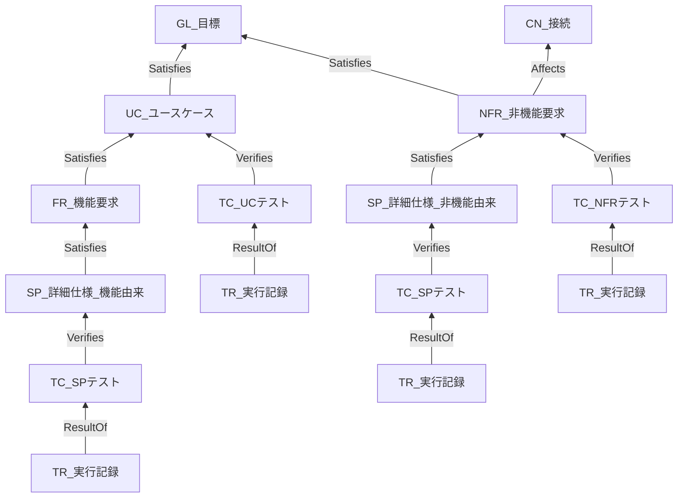

# 仕様形式 StrictDoc 統一 — 編集方針

**本書は方針である。まだ 1 文書も編集していない。** `framework-src/` と `process-rules/` には触れていない。編集の対象は `maintenance/2026-08-08/` 配下の各文書であり、本体への適用は段 5 以降にユーザーの許可を得てから行う。

**前提:** `04-spec-format-unification.md` の段 0〜4 が実施済みであること。段 4 で ANMS が StrictDoc の `.md` へ写せることは実測で確かめてある。

---

## 1. 今回確定した決定（2026-08-09。決めたのはユーザー）

| # | 決定 | 効き先 |
|:-:|---|---|
| 1 | **`GOAL` の接頭辞を `GL` にする** | 接頭辞表・全記入例 |
| 2 | **`05-specification.md` に UID を振る。接頭辞は `SP`** | Ch6・ノード型・鎖 |
| 3 | **機能側のトレースは 2 段。** `UC` テスト（受入）と `SP` テスト（実装） | テストの設計 |
| 4 | **`NFR` には `NFR` 用のテストを立てる** | 同上 |
| 5 | **`TC` を 3 ファイル（`UC` / `SP` / `NFR`）、`TR` をそれに紐づく 3 ファイルに分ける** | ファイル構成 |
| 6 | **`SP` の粒度は EARS 構文 1 つで書ける粒度とする** | Ch6 の記法 |
| 7 | **`SP` の親に `NFR` を許す。** その場合も `NFR` 用の `TC` と `SP` 用の `TC` は分ける | 鎖・テストの設計 |
| 8 | **`TC` の欄名は `TEST_KIND`。値は `UseCase` / `Spec` / `NonFunctional`** | 文法 |
| 9 | **`07-test-strategy.md` に 3 系統のマトリクスを持たせる** | Ch7 |
| 10 | **`SC` を廃止し、`TC`（Test Case）/ `TR`（Test Result）に改める** | 接頭辞表・Ch6.1 |

> **決定 8 の背景を記録する。** 当初案の欄名は `VERIFIES_KIND` だった。**「検証（Verification）に限るのは違和感がある。妥当性確認（Validation）もある」というユーザーの指摘により `TEST_KIND` に改めた。** 同じ指摘は関係の `ROLE` 名にも当たる（§7 未決 1）。

---

## 2. 確定した設計

### 2.1 接頭辞（10 件）

**採番はすべて 3 桁のゼロ詰めとする（MUST）** — `SP-001`、`TC-001`。**ランダム ID・GUID は使わない（MUST NOT）。**

| 接頭辞 | 元の語 | 何を指すか | 親 | 定義する章 |
| --- | --- | --- | --- | --- |
| **`GL`** | Goal | 達成すべき状態 | **根。親を持たない** | Ch1.3 |
| `ND` | Node | 機械 | 鎖の外 | Ch2.2 |
| `CN` | Connection | 経路 | 鎖の外 | Ch2.3 |
| `UC` | Use Case | アクターの目標 | `GL` | Ch3.2 |
| `FR` | Functional Requirement | 機能要求 | `UC` | Ch4.1 |
| `NFR` | Non-Functional Requirement | 非機能要求 | `GL` | Ch4.2 |
| **`SP`** | **Specification** | **詳細仕様の 1 項目** | **`FR` または `NFR`** | **Ch6** |
| `ADR` | Architecture Decision Record | 設計判断 | 鎖の外 | Ch5.6 |
| **`TC`** | **Test Case** | **受入基準 1 件** | **`UC` / `SP` / `NFR` のいずれか 1 つ** | Ch9 相当 |
| **`TR`** | **Test Result** | **実行記録 1 件** | **`TC`** | Ch10 相当 |

**変更点は 4 つ:** `GOAL` → `GL`（決定 1）、`SC` の削除（決定 10）、`SP` の新設（決定 2）、`TC` / `TR` の新設（決定 10）。**差し引き 8 件から 10 件になる。**

> **接頭辞とノード型の名前は別物である。** StrictDoc の `TAG` は `GOAL` のまま読みやすさを優先し、UID の接頭辞だけを `GL` と短くする。**混同しないこと。**

### 2.2 ノード型（9 種）

| `TAG` | 置く文書 | 親（`ROLE`） | 備考 |
|---|---|---|---|
| `SECTION` | 全文書 | — | 章。`IS_COMPOSITE: True` |
| `GOAL` | `00-foundation` | **無し（根）** | UID は `GL-001` |
| `NODE` | `01-configuration` | 無し（鎖の外） | |
| `CONNECTION` | `01-configuration` | `NODE`（`From` / `To`） | 鎖の外 |
| `USE_CASE` | `02-use-cases` | `GOAL`（`Satisfies`） | 主成功シナリオと拡張は欄 |
| `REQUIREMENT` | `03-requirements` | `USE_CASE` または `GOAL`（`Satisfies`） | `REQ_KIND` で FR / NFR を区別 |
| **`SPECIFICATION`** | **`05-specification`** | **`REQUIREMENT`（`Satisfies`）** | **新設。EARS 1 文 1 件** |
| `TEST_CASE` | `08` / `10` / `12` | `USE_CASE` / `SPECIFICATION` / `REQUIREMENT`（`Verifies`） | `TEST_KIND` で系統を区別 |
| `TEST_RESULT` | `09` / `11` / `13` | `TEST_CASE`（`ResultOf`） | **実測で分離済み（§4）** |

**7 種から 9 種に増える。** 増えるのは `SPECIFICATION` と `TEST_RESULT` である。

### 2.3 鎖と関係

**トレースの鎖とテストの接続:**



`GL` を根とし、`SP` が加わって機能側の鎖が 1 段深くなった。テストは 3 か所から刺さり、**1 つの `TC` は 1 か所しか指さない。**

**鎖に載る `ROLE` は `Satisfies` / `Verifies` / `ResultOf` の 3 つである。** 鎖の外は `Affects`（`NFR` が効くノード・接続）と `From` / `To`（接続の両端）である。**削減候補の判定は、この 3 つの `ROLE` を持つ親があるかどうかだけで決まる。**

**`FR` は自前のテストを持たない。** `FR` が覆われているかは、**その `FR` に `SP` がぶら下がっており、その `SP` にテストが在るか**で判定する（§6）。

### 2.4 ファイル構成（`docs/spec/` 配下 14 枚）

| # | ファイル名 | 持つノード | 要否 | 備考 |
|:-:|---|---|---|---|
| 1 | `00-foundation.md` | `GOAL` | 簡易 | 残りは地の文 |
| 2 | `01-configuration.md` | `NODE` / `CONNECTION` | 簡易 | |
| 3 | `02-use-cases.md` | `USE_CASE` | 簡易 | アクターに ID を振らない |
| 4 | `03-requirements.md` | `REQUIREMENT` | 簡易 | FR / NFR |
| 5 | `04-architecture.md` | **無し** | 簡易 | 鎖の外の見取り図 |
| 6 | `05-specification.md` | **`SPECIFICATION`** | 簡易 | **変更点。従来は UID 無し** |
| 7 | `06-design-principles-check.md` | 無し | 通常 | |
| 8 | `07-test-strategy.md` | 無し | 通常 | **3 系統のマトリクスを持つ（決定 9）** |
| 9 | `08-uc-test-cases.md` | `TEST_CASE`（`UseCase`） | 簡易 | **新設** |
| 10 | `09-uc-test-results.md` | `TEST_RESULT` | 簡易 | **新設** |
| 11 | `10-sp-test-cases.md` | `TEST_CASE`（`Spec`） | 通常 | **新設** |
| 12 | `11-sp-test-results.md` | `TEST_RESULT` | 通常 | **新設** |
| 13 | `12-nfr-test-cases.md` | `TEST_CASE`（`NonFunctional`） | 通常 | **新設** |
| 14 | `13-nfr-test-results.md` | `TEST_RESULT` | 通常 | **新設** |

**加えて `spec.sgra` 1 枚、`_assets/fig-<name>.md` を必要数、`<同名>.meta.yaml` を `.md` 1 枚につき 1 枚置く。**

**並びはケースと結果を対にする** — `08`/`09` が UC、`10`/`11` が SP、`12`/`13` が NFR。**系統ごとに読めるようにするためである。**

> **ファイルを分ける理由は実測にある（§4）。** StrictDoc の HTML はビューを文書単位で作る。**分けた文書は、それだけでトレース画面が系統ごとに分かれる。** 逆に 1 枚にまとめると、その画面は全系統を映して読めなくなる。

### 2.5 `SP` の粒度（決定 6）

> **`SP` 1 件は、EARS 構文 1 つで書ける大きさとする（MUST）。**

**判定はこうなる。** 1 つの `SP` の `STATEMENT` を EARS の 1 文で書けないなら、それは 2 件以上に割るべきものである。

| 例 | 判定 |
|---|---|
| 「もし扱えない形の値を受け取ったならば、システムは、400 と誤りの旨を返すこと」 | **1 件。** Unwanted behaviour 型の EARS 1 文 |
| 「API は `/lookup` と `/register` を持ち、それぞれ次のように振る舞うこと」 | **割る。** 2 文以上になる |

**この規則が効くのは、`SP` が `TC` の検証単位を決めるからである。** 粒度を決めないと、`SP` 1 件に対してテストが何件必要なのかが誰にも分からなくなる。

### 2.6 `TC` の規則

| # | 規則 |
|:-:|---|
| 1 | **`TC` は `Verifies` 関係をちょうど 1 つ持つ（MUST）** |
| 2 | **1 つの `TC` が `UC` と `SP` の両方を指してはならない（MUST NOT）。** 段が違う |
| 3 | **`TEST_KIND` と、実際に指している親のノード型が一致しなければならない（MUST）** |
| 4 | `TEST_KIND` の値は `UseCase` / `Spec` / `NonFunctional` の 3 つとする |

**`TEST_KIND` は親のノード型と重複する情報である。重複させるのは意図的である。**

> **StrictDoc は `Verifies` の相手のノード型を制約できない。** `.sgra` の `RELATIONS` が宣言できるのは `TYPE` と `ROLE` だけで、相手の型は書けない。**したがって規則 2 と 3 を守れるのは jq だけであり、`TEST_KIND` と実際の親を突き合わせることが唯一の検査になる。** 欄が無ければ「書き手が何のつもりだったか」が失われ、突き合わせる相手が消える。

---

## 3. 何が要らなくなるか

| 消えるもの | 置き換わるもの |
|---|---|
| 接頭辞 `SC`（受入シナリオ） | `TC` + `TEST_KIND: UseCase` |
| Ch6.1 の「シナリオの直下に結果を書く」配置 | `TR` ノード（別ファイル） |
| `Result:` / `Remark:` の手書き欄 | `TEST_RESULT` の `RESULT` / `REMARK` |
| 手で維持するトレーサビリティ表 | §6 のクエリ |

---

## 4. 実測で確かめたこと（2026-08-09）

**測定環境:** strictdoc 0.27.1 / Python 3.13.3 / jq 1.8.1 / Windows 11 / Git Bash。**測定場所はセッション scratchpad。すべてのファイルはバイトを `od -c` で確認してから走らせた。**

### 4.1 `TEST_RESULT` の分離は通る

`TEST_CASE` の欄だった `TEST_RESULT` を別ノード型に分け、`08-test-cases.md` / `09-test-results.md` の 2 枚を書いて export した。**json / html とも通った。**

| 測ったこと | 結果 |
|---|---|
| `ResultOf` 関係の解決 | 通る。`TR-001` / `TR-002` が同じ `TC-001` を指す 1 対 N が成立した |
| 鎖の孤立検出 | **仕込んだ 2 件（`NFR-098` / `NFR-099`）だけを拾い、正当な 11 件は 1 件も誤検出しない** |
| **未走行テストの検出** | **`TR` を持たない `TC-003` だけを拾った** |
| `File` 関係 | `Path` で `tests/*.py` に解決する |

> **`TEST_RESULT` を別ノードにしたことで `NotRun` という値が要らなくなった。** ノードが無いこと自体が「まだ走らせていない」を意味する。**手で `NotRun` を書き換え忘れる経路が消える。**

### 4.2 `**Relations**:` の配置に制約がある（新発見）

**メタデータ欄と `**Relations**:` の間に空行を 1 つ挟むと export が止まる。**

```text
error: Semantic error: Markdown parsing error:
       Relations must directly follow requirement metadata without an empty line.
```

**通る書き方は 2 通りある。**

| 書き方 | 結果 |
|---|---|
| メタデータ欄の直後（**空行なし**）に `**Relations**:` を置く | 通る。**SOVD サンプルがこの形** |
| 本文欄（`GIVEN` など段落として書く欄）を挟んでから置く | 通る |
| **メタデータ欄との間に空行だけを挟む** | **止まる** |

**`REMARK` のような任意欄は `**Relations**:` の後ろに置いても正しく読まれる**（実測）。

### 4.3 `DEEP_TRACEABILITY_SCREEN` は主因ではない（未決 1 への回答）

**トレース木の肥大の原因はこの画面ではなかった。**

| 画面 | 出る UID | 大きさ |
|---|---|---:|
| `08-test-cases-TRACE.html` | `UC` / `FR` × 3 / `TC` × 3 / `TR` × 3 | 64,320 |
| `08-test-cases-DEEP-TRACE.html` | 上記 ＋ `GL-001` だけ | 61,416 |

**差は祖先 1 段だけで、DEEP のほうがむしろ小さい。** 理由は構造にある — **鎖が 5 段しかないので、TRACE の時点でほぼ根まで届いている。** 外しても得るものがほとんど無い。

### 4.4 見にくいのは要求の画面である

| 画面 | 出る UID |
|---|---|
| `03-requirements-TRACE.html` | **19 件すべて**（`ND` / `CN` / 孤立 `NFR` を含む） |
| `03-requirements-DEEP-TRACE.html` | **同じく 19 件** |

**全要求を 1 枚に置いているため、そこを根にした画面は必ず全体を映す。** 一方 `08-test-cases-TRACE.html` は `ND` も `CN` も孤立 `NFR` も映さない。

> **結論: ビューの単位は文書である。** 文書を分けることが、そのままビューを分けることになる。**決定 5（テストを 6 枚に分ける）は、この実測に基づく。**

### 4.5 `--filter-nodes` は使わない（ユーザー決定）

**必要な情報は全量 JSON に出し、jq で絞る。**

| 帰結 | 内容 |
|---|---|
| JSON 側は元から変わらない | **`--filter-nodes` は JSON に効かない**（`06-file-inventory.md` §A-7 の実測）。エージェントは元から全量 JSON + jq である |
| **接頭辞の包含衝突が問題にならなくなった** | `"FR" in node["UID"]` は `NFR-001` にも当たるが、**jq の `startswith("FR-")` なら当たらない。** 接頭辞を読みやすさだけで選べる |
| **失うもの** | 「上流を捨てて下流だけ見る」HTML ビューを作る唯一の純正手段を失う。**代わりに文書分割で対処する（§4.4）** |

---

## 5. 文書ごとの編集指示

**すべて `maintenance/2026-08-08/` 配下。本体（`framework-src/` / `process-rules/`）は対象外。**

| 対象 | 編集内容 |
|---|---|
| **`00-spec-template-draft.md`**<br>「ID の接頭辞」節 | 表を §2.1 の 10 件に差し替える。`GOAL` → `GL`、`SC` 削除、`SP` / `TC` / `TR` 追加。**「本テンプレートが使う接頭辞は次の 8 つ」を 10 に直す** |
| 同 「記入例の読み替え」節 | `GOAL-001` → `GL-001`、`SC-001` → `TC-001`。**読み替えないもの**の列挙に `SP` / `TC` / `TR` を足し、`SC` を消す |
| 同 **Ch6 Specification** | **本章に `SP` ノードを導入する。** §2.5 の粒度規則（EARS 1 文 = `SP` 1 件）を本文に書く。親は `FR` または `NFR` |
| 同 **Ch6.1 Scenarios** | **本節を Chapter 6 から外す。** Gherkin の受入基準は `TC` として独立ファイルへ移る。**`SC-901` などの例を `TC-901` に改める。** `Result:` / `Remark:` の手書き欄を削り、`TR` へ移す旨を書く |
| 同 Ch4「トレースの向き」 | `SP` の 1 段を足す。`FR` が自前のテストを持たないことと、覆われ判定が積み上げになることを書く |
| 同 **Ch7 Test Strategy** | **3 系統（UC / SP / NFR）のマトリクスを置く（決定 9）** |
| 同 Ch1.3 の記入例 | `GOAL-001` → `GL-001` |
| **`04-spec-format-unification.md`** §3.2 | 章 → ノード型の対応表に `SPECIFICATION` と `TEST_RESULT` を足す。**「ノードになるのは 7 種類」を 9 種類に直す。** Ch6.1 の行を書き換える |
| 同 §3.4 | 削減候補の検出クエリ表を §6 の内容に差し替える |
| **`06-file-inventory.md`** §A の表 | **`05-specification.md` の「UID を持たない」を撤回**し `SPECIFICATION` を持つに改める。`08` / `09` の 2 行を §2.4 の 6 行に差し替える |
| 同 §A-2 | 鎖の図に `SP` を足す。`TC` 3 系統に対応させる |
| 同 §A-3 / §A-6 / §A-7 | **`--filter-nodes` を前提にした記述を削る（§4.5）。** ビューは文書分割で作る旨に改める。**§A-7 の「手段 1 が答えである」は取り下げる** |
| 同 §A-3 の未確認 | **`DEEP_TRACEABILITY_SCREEN` の未実測を §4.3 の実測に置き換える** |
| **`07-anms-sgra-draft.md`** | **`.sgra` を §2.2 の 9 種へ書き直す。** §1 末尾の「文法はまだ分離を反映していない」注記を消す。**§4.2 の `Relations` 配置制約を追記する** |
| **`05-strictdocstarter-feedback.md`** | **指摘 3 として「出力先を入力フォルダの中に置くと、出力先を変えた回に UID 重複で止まる」を足す**（`06-file-inventory.md` §A-4）。**`md-basic-ja` も `output/` をサンプルフォルダ内に置いているので当たる。** あわせて §4.2 の `Relations` 配置制約を指摘 4 として検討する |
| **`01-spec-template-migration.md`** | **Ch6.1 が Chapter 6 から外れることによる参照の再確認が要る。** 本書は v0.34 → v0.35 の章番号移動を扱っており、**今回の変更が上乗せされる。未計測** |

---

## 6. クエリの改定

**`FR` が自前のテストを持たなくなったため、覆われ判定が 1 段深くなる。これを書かないと `FR` が全件「未覆」に見える。**

| # | 検出したいもの | 判定 |
|:-:|---|---|
| D17 | **鎖から外れたノード** | `Satisfies` / `Verifies` / `ResultOf` のいずれの `ROLE` の親も持たない（`GOAL` を除く） |
| D16a | **テストに覆われない `UC`** | その `UC` を `Verifies` する `TC` が無い |
| D16b | **テストに覆われない `SP`** | その `SP` を `Verifies` する `TC` が無い |
| D16c | **テストに覆われない `NFR`** | その `NFR` を `Verifies` する `TC` が無く、かつ配下の `SP` も覆われていない |
| **D16d** | **テストに覆われない `FR`** | **その `FR` に `SP` が 1 件も無い、または配下の `SP` のいずれかが覆われていない** |
| D19 | **走らせていないテスト** | その `TC` を `ResultOf` する `TR` が無い |
| **D20** | **段をまたいだテスト** | `TC` が `Verifies` を 2 つ以上持つ、または **`TEST_KIND` と実際の親のノード型が食い違う** |

**D19 と D20 は新設である。** D19 は `TEST_RESULT` の分離によって初めて書けるようになり、**実測で `TC-003` だけを正しく拾うことを確かめた**（§4.1）。**D20 は未実装・未測定である。**

---

## 7. 未決

| # | 内容 | 誰が決めるか |
|:-:|---|---|
| 1 | **`UC` を指す関係の `ROLE` 名。** 受入テストは妥当性確認（Validation）であり、`Verifies` は正確でない。**`UC` 向けを `Validates`、`SP` / `NFR` 向けを `Verifies` に分けることを推奨する。** 分けると鎖に載る `ROLE` が 4 つになる | ユーザー |
| 2 | **章番号とファイル番号の二重管理。** 章は Ch1〜Ch8、ファイルは `00`〜`13` で、既に順序が食い違っている（Ch7 Test Strategy がファイル `07`、Ch8 Design Principles がファイル `06`）。**StrictDoc へ寄せる以上、単位をファイルに一本化することを推奨するが、参照 307 件に及ぶ** | ユーザー |
| 3 | **簡易形式でテストを何枚要求するか。** 14 枚は簡易には重い。**`08` / `09`（UC 系）のみ簡易必須、`10`〜`13` は通常から、を推奨する** | ユーザー |
| 4 | **`NFR` 由来の `SP` の守備範囲。** `NFR` 用の `TC` と、その配下の `SP` 用の `TC` が両方存在する。**どちらが何を担保するのかを規則に書く必要がある** | ユーザー |
| 5 | **`TR` を誰がどう更新するか。** 手で更新する限り実際の走行結果とずれる。**トレーサビリティが 0 件になったのと同じ経路である。** 案: テストランナーの出力から `UID` で `.md` を引いて書き戻す | ユーザー |
| 6 | **`spec-foundation` / `spec-architecture` という file_type 名。** 14 ファイルに割れると 2 つでは表せない。**`spec` 1 つを推奨済み** | ユーザー |
| 7 | **`02-framework-fixes.md` §3 の「システム構成図」の語の衝突。** A（`§9.14` 側を「コンポーネント図」に改める）を推奨済み | ユーザー |

---

## 8. 触ってはならないもの

| # | 対象 | 理由 |
|:-:|---|---|
| 1 | **`framework-src/` と `process-rules/`** | 本体はまだ 1 行も変えていない。段 5 以降でユーザーの許可を得てから |
| 2 | **`StrictDocStarter` リポジトリ** | 作業中。参照のみ。**`md-sovd-automotive-ja/` に未コミットの変更がある** |
| 3 | **`git commit` / `push` / `tag`** | 利用者が手で行う |
| 4 | `user-order.md` | 人間が書くもの |

---

## 9. 測るときの規律

**本作業で 2 度、測定の失敗を踏んでいる。同じ轍を踏まないために残す。**

| # | 規律 |
|:-:|---|
| 1 | **テストファイルはヒアドキュメント（または素の書き出し）で作る。** スクリプトの文字列エスケープ経由だと `\` + 改行のつもりがリテラルの 2 文字になり、別の現象を測ることになる |
| 2 | **測ったら `od -c` でバイトを確認してから結論を書く** |
| 3 | **strictdoc の出力先を入力フォルダの中に置かない。** 出力先を変えた回に UID 重複で止まる |
| 4 | **`--no-parallelization` を必ず付ける。** 並列 export が本当のエラーを握り潰す（strictdoc 0.27.1） |
