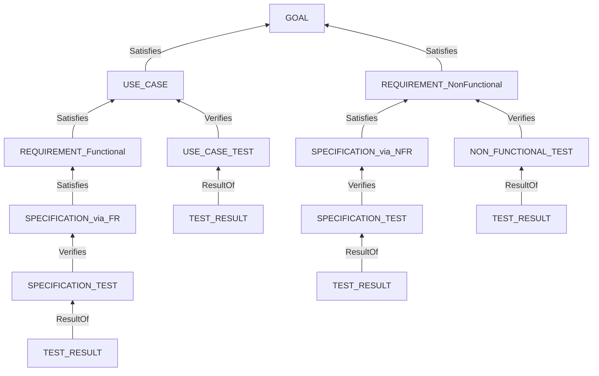

# 仕様書の構成要素 一覧

**本書は定義表である。** ノード・ファイル・関係の定義は本書を唯一の出所とする。`08-edit-policy.md` はここを参照する。

**まだ 1 文書も編集していない。** `framework-src/` と `process-rules/` には触れていない。

## 凡例

| 表記 | 意味 |
|---|---|
| `xx-` | **章番号。形式によって変わるので伏せる。** 規則は §5 |
| `.md (SD)` | **StrictDoc が解析する Markdown。** 先頭は H1、`**Type**:` などの欄を持つ |
| `.md` | 素の Markdown。StrictDoc は解析しない |
| `TAG` | ノードの型。`.sgra` で宣言し、`.md` に `**Type**:` として書く |
| `ROLE` | 関係の名前。`Satisfies` など |

---

## 1. UID を振る基準

> **UID を持つのは、ノード型として宣言したものだけである。加えて文書ヘッダが持つ。**

| 対象 | UID | 理由 |
|---|:-:|---|
| 文書ヘッダ | **持つ** | `[LINK: DOC-FIG-STATE]` で他の文書を参照するのに使う（実測） |
| `UID` 欄を宣言したノード型 | **持つ** | 誰かが `Relations` で指し、機械が検証する |
| `SECTION` | 持たない | 章の見出しである |
| `TEXT` | 持たない | 地の文。**StrictDoc が自動で作る。宣言しない** |

> **判定規則: 誰かが `Relations` で指すか、機械が検証するか。どちらも無いなら UID は飾りである。** 飾りの UID を振ってはならない（MUST NOT）—— **維持されなくなり、やがて実体とずれる。**

### 1.1 この規則を当てて落としたもの（2026-08-09 決定）

| 対象 | 変更前 | 変更後 | 理由 |
|---|---|---|---|
| **`ND` / `CN`** | `NODE` / `CONNECTION` 型 | **地の文（`TEXT`）** | **自己完結した島だった。** `CN` を指すのは `NFR` の `Affects` だけ、`ND` を指すのは `CN` だけ。`TRUSTED` を使ったセキュリティ設計も `CARRIES_SOFTWARE` を使った運用手順も**設計にあるだけで未実装**であり、飾りになる公算が高い |
| **`ADR`** | UID を持つが型は無い | **UID のまま残す** | **議論で `ADR-003` と名指せないと、そのたびに判断の中身を言い直すことになる。その費用のほうが高い**（決定 24）。**ただしトレースにはどこにも紐づけない** |

**この 2 件により、`04-spec-format-unification.md` §3.2 の決定 1（`ND` / `CN` をノード型にする）は覆る。**

**当時の理由は「ID を振ると決めた以上、機械が検証できないと ID の意味が半減する」だった。** これは「ID を振る」を前提にした循環である。**前提のほうを外した。**

### 1.2 落としたことの効き目

| | 変更前 | **変更後** |
|---|---|---|
| 宣言する `TAG` | 11 種 | **9 種** |
| UID 接頭辞 | 10 件 | **8 件**（`ADR` を残す） |
| `ROLE` | 6 種 | **3 種** |
| 鎖の外の関係 | `Affects` / `From` / `To` | **無し** |

> **すべての関係が鎖に載るようになった。** 削減候補の判定は「`Parent` 関係を 1 つでも持つか」だけになる。**`Affects` を親と数えて検出が壊れるという罠（段 4 で実際に踏んだ）が、そもそも存在しなくなった。**

**失うものも書く。**

| # | 失うもの |
|:-:|---|
| 1 | **`NFR` が効く対象を機械で辿れない。** どの経路に効くかは `NFR` の EARS 文が言葉で述べる |
| 2 | **`TRUSTED` の印が地の文になる。** security-reviewer は Ch2 を文として読む |
| 3 | **「守られていない攻撃面」の自動検出ができない**（提案していた D22 / D23 は不要になった） |

> **1 は見かけほど痛くない。** EARS 文が「もし信頼できない経路から値を受け取ったならば」と条件を述べるので、**`Affects` は文と重複していた。** 痛いのは 2 と 3 である。

---

## 2. ノードの一覧

> **`08-edit-policy.md` §1.2 へ移した。** 各 Type の列（`.sgra` の `TAG:` と `.md` の `**Type**:`）を並べた形になっている。**ノードの定義はそちらを唯一の出所とする。**

**要点だけ再掲する。**

| 項目 | 数 |
|---|---|
| 宣言する `TAG` | **9 種** |
| UID 接頭辞 | **8 件**（`GL` / `UC` / `FR` / `NFR` / `ADR` / `SP` / `TC` / `TR`）。**`ADR` だけノード型を持たない** |
| `ROLE` | **3 種**（`Satisfies` / `Verifies` / `ResultOf`）。**すべて鎖に載る** |

## 3. ノードを持たないファイルの一覧

| ファイル | 中身 | 備考 |
|---|---|---|
| `xx-configuration.md (SD)` | 構成図・機械・経路・持たないもの | **地の文（決定変更）。** 経路の信頼性は文で述べる |
| `xx-design.md (SD)` | 方式・コンポーネント・ファイル構成・**ドメインモデル**・振る舞い・ADR | **ノードを持たない見取り図。`ADR` は UID を持つがノードではない** |
| `xx-test-strategy.md (SD)` | 3 系統（UC / SP / NFR）のマトリクス | |
| `xx-design-principles-check.md (SD)` | 設計原則ごとの確認表 | |
| `spec.sgra` | **文法。** `TAG` / 欄 / 必須性 / 値域 / `RELATIONS` の宣言 | **ガバナンスの中核。全形式で必須** |
| `<同名>.meta.yaml` | Common Block（OKF v0.2） | **ノード文書 1 枚につき 1 枚** |
| `_assets/fig-<name>.md (SD)` | 15 行を超える図 1 つ | **`Grammar` を宣言しない**（宣言するとパス解決で落ちる） |
| `output/json/index.json` | export の出力 | **コミットしない。入力フォルダの外に置く** |
| `output/html/**.html` | 同上 | 同上 |

> **`.md (SD)` でありながらノードを持たない文書がある。** 地の文だけでも StrictDoc は解析する（`SECTION` と `TEXT` になる）。**`(SD)` は「解析されるか」であって「ノードを持つか」ではない。**

---

## 4. 関係の一覧

**関係は 2 段で表す。`TYPE` が種類、`ROLE` がその親の意味である。**

| `TYPE` | 追加の鍵 | 意味 |
|---|---|---|
| `Parent` | `ID` / `Role` | 上位ノードを指す |
| `File` | **`Path`** | ソースファイルを指す。**鍵は `Path`（MUST）。他を書くと export が止まる** |

| `ROLE` | 誰が持つか | 何を指すか |
|---|---|---|
| `Satisfies` | `USE_CASE` / `REQUIREMENT` / `SPECIFICATION` | 1 段上のノード |
| `Verifies` | テスト 3 型 | 検証する対象 |
| `ResultOf` | `TEST_RESULT` | 対応するテスト |

**`ROLE` の綴りは PascalCase である**（実測で通っている）。`TAG` の UPPER_SNAKE_CASE とは規則が違う。

> **`ROLE` は 3 種すべてが鎖に載る。** 鎖の外の関係は無い（§1.2）。**削減候補の判定は「`Parent` 関係を 1 つでも持つか」だけである。**

**トレースの鎖:**



`GOAL` を根とし、テストは 3 か所から刺さる。**1 つのテストは 1 か所しか指さない。分岐も合流も無い 1 本の木である。**

---

## 5. 章とファイル番号の規則

> **規則: ファイル番号は、そのファイルが持つ最初の章の番号とする（MUST）。**

**番号は席番号であり、並び順ではない。** 形式によってファイルが省かれても、**残ったファイルの番号を詰め直してはならない（MUST NOT）。**

| 章 | 章名 | 分割したときのファイル | ノード |
|:-:|---|---|---|
| 1 | Foundation（前提） | `01-foundation.md (SD)` | `GOAL` |
| 2 | System Configuration（システム構成） | `02-configuration.md (SD)` | **無し** |
| 3 | Use Cases（ユースケース） | `03-use-cases.md (SD)` | `USE_CASE` |
| 4 | Requirements（要求） | `04-requirements.md (SD)` | `REQUIREMENT` |
| 5 | **Design（設計）** | `05-design.md (SD)` | **無し**（`ADR` は UID のみ持つ） |
| 6 | Specification（仕様） | `06-specification.md (SD)` | `SPECIFICATION` |
| 7 | Test Strategy（テスト戦略） | `07-test-strategy.md (SD)` | 無し |
| 8 | Design Principles Compliance（設計原則 準拠確認） | `08-design-principles-check.md (SD)` | 無し |
| 9 | UC Test Cases | `09-uc-test-cases.md (SD)` | `USE_CASE_TEST` |
| 10 | UC Test Results | `10-uc-test-results.md (SD)` | `TEST_RESULT` |
| 11 | SP Test Cases | `11-sp-test-cases.md (SD)` | `SPECIFICATION_TEST` |
| 12 | SP Test Results | `12-sp-test-results.md (SD)` | `TEST_RESULT` |
| 13 | NFR Test Cases | `13-nfr-test-cases.md (SD)` | `NON_FUNCTIONAL_TEST` |
| 14 | NFR Test Results | `14-nfr-test-results.md (SD)` | `TEST_RESULT` |

**まとめて 1 枚にするときは、その中で最も小さい章番号を付ける。**

| 形式 | 枚数 | ファイル | 持つ章 |
|---|:-:|---|---|
| **簡易** | **1** | `01-14-spec.md (SD)` | Ch1〜Ch14 |
| 中間 | 3 | `01-04-upper.md (SD)` / `05-08-design.md (SD)` / `09-14-test.md (SD)` | Ch1〜4 / Ch5〜8 / Ch9〜14 |
| 分割 | 14 | 上の表のとおり | 1 章ずつ |

---

## 6. モデルとスキーマの区別

### 6.1 判定は記法ではなく役割である

**ER 図で描いてもクラス図で描いても、それがモデルであることは変わらない。**

| | **モデル** | **スキーマ** |
|---|---|---|
| **何のためにあるか** | **人が理解するため** | **機械が検証するため** |
| 形 | クラス図 / ER 図 / 表 / 文章。**記法を問わない** | DDL / JSON Schema / XSD / Protobuf。**機械が読める形** |
| 実装への依存 | しない | **する** |
| 置き場所 | **Ch5 Design** | **Ch6 Specification** |
| 本フレームワークでの呼び名 | **ドメインモデル** | **データスキーマ** |

**判定の問い:**

| 問い | 答え |
|---|---|
| **ER 図はスキーマか** | **違う。モデルである。** 人が読むための図であり、機械は検証に使えない |
| JSON Schema / XML Schema は | **スキーマである。** 機械が検証に使う |
| **クラス図でデータをモデル化した場合は** | **モデルである。記法は判定基準にならない** |
| DDL（`CREATE TABLE`）は | **スキーマである** |

> **境界が曖昧になる場合が 1 つある。** 物理設計まで落とした ER 図は DDL と 1 対 1 に対応する。**そのときは DDL を正本とし、ER 図は Ch5 の見取り図として残す（MUST）。** 2 つを正本にすると必ずずれる。

> **`Data Schema` の適用条件を広げる。** 現行テンプレートは「DB を使用するアプリ」としているが、**DB が無くても API の電文に JSON Schema を持つ場合がある。** 「永続ストアを持つか、外部と構造化データを交換する場合」に改める。

### 6.2 「データモデル」を使わない理由

**「データモデル」は誤った語ではない。** データモデリングの分野では**概念 / 論理 / 物理の 3 段**を持つ確立した語である。

| 段 | 内容 | 本フレームワークでの置き場所 |
|---|---|---|
| 概念データモデル | 実体と関連。実装非依存 | **Ch5 ドメインモデル** |
| 論理データモデル | 正規化・鍵・属性。DBMS 非依存 | **Ch5 ドメインモデル** |
| 物理データモデル | テーブル・型・索引。DBMS 依存 | **Ch6 データスキーマ** |

> **本フレームワークで使わない理由は、語が誤っているからではない。** **裸で「データモデル」と書くと、Ch5 と Ch6 のどちらを指すかが決まらないためである。** 用語集には**非採用語（理由: 段を特定しない）**として記録する。

### 6.3 直す箇所

**同じものが 2 つの名前で呼ばれている現物:**

```text
spec-template.md:94                   3.4 Domain Model  ドメインモデル
full-auto-dev-document-rules.md:1277  Ch3（Architecture: ... ・データモデル）
full-auto-dev-document-rules.md:1273  migration_count | データモデルマイグレーション数
agents/architect.md:3                 OpenAPI仕様・データモデル・マイグレーション戦略
full-auto-dev-process-rules.md:900    データモデルサンプル | エンティティ間関係の確認 | ER図、サンプルJSON
spec-template.md:191                  4.x Data Schema  データスキーマ
```

**`1277` は Ch5 のドメインモデルを、`1273` は Ch6 のデータスキーマを指している。同じ語で別のものを指している。**

| 場所 | 現 | 新 |
|---|---|---|
| `full-auto-dev-document-rules.md:1277` | データモデル | **ドメインモデル**。**同じ行の `Architecture` は `Design` に、章番号は Ch3 → Ch5 に動く**（決定 25） |
| `full-auto-dev-document-rules.md:1273` | データモデルマイグレーション数 | **データスキーマのマイグレーション数** |
| `agents/architect.md:3` | データモデル | **データスキーマ**（OpenAPI と並ぶので実装寄り） |
| `full-auto-dev-process-rules.md:900` | データモデルサンプル | **ドメインモデルサンプル**（ER 図・エンティティ間関係の確認である） |

**あわせて、もう 1 件の語の衝突を再掲する**（決定 14 で決着済み）。

| 場所 | 現 | 新 |
|---|---|---|
| v0.35 Ch2.1 | システム構成図 | **システム構成図（変えない）** |
| `§9.14` 側 | システム構成図 | **コンポーネント図** |

> **同じ判定を状態の記述にも当てる。** 状態遷移図（Ch5）は**モデル**、実装が持つ状態の定義（Ch6 の状態管理）は**仕様**である。**記法ではなく役割で分ける。**

---

## 7. 未決

| # | 内容 | 誰が決めるか |
|:-:|---|---|
| 1 | **`runbook-writer` / `user-manual-writer` の In の参照先。** 「システム構成の理解」が欲しいのが物理配置（Ch2）なら、参照先ごと向け直す必要がある。**未確認** | 調べてからユーザー |
| 2 | **`_assets/` を複数の製品で共有する場合の衝突。** StrictDoc は `_assets` の名前を固定で扱う。**未検証** | 測ってからユーザー |
