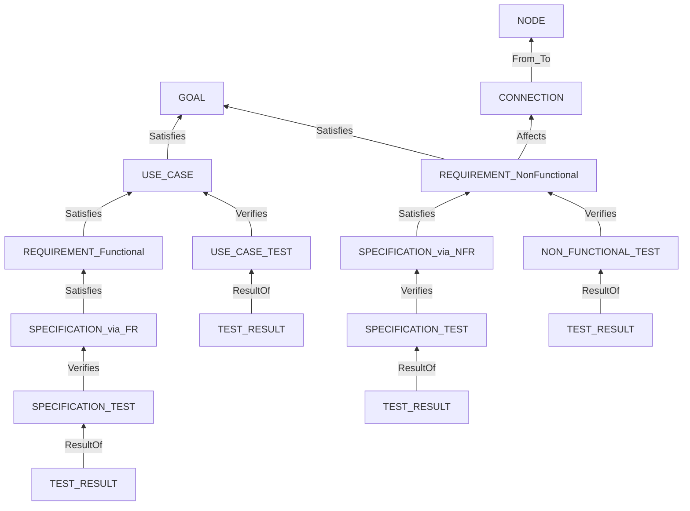

# 仕様書の構成要素 一覧

**本書は定義表である。** `08-edit-policy.md` に散っていた 3 つの表を引き取った。**ノード・ファイル・関係の定義は本書を唯一の出所とする。**

**まだ 1 文書も編集していない。** `framework-src/` と `process-rules/` には触れていない。

## 凡例

| 表記 | 意味 |
|---|---|
| `xx-` | **章番号。形式によって変わるので伏せる。** 規則は §5 |
| `.md (SD)` | **StrictDoc が解析する Markdown。** 先頭は H1、`**Type**:` などの欄を持つ |
| `.md` | 素の Markdown。StrictDoc は解析しない |
| `TAG` | ノードの型。`.sgra` で宣言し、`.md` に `**Type**:` として書く |
| `ROLE` | 関係の名前。`Satisfies` など |
| **要判断** | 本書で提起した未決。§7 を見よ |

---

## 1. UID を振る基準

> **UID を持つのは、ノード型として宣言したものだけである。加えて文書ヘッダが持つ。**

| 対象 | UID | 理由 |
|---|:-:|---|
| 文書ヘッダ | **持つ** | `[LINK: DOC-FIG-STATE]` で他の文書を参照するのに使う（実測） |
| `UID` 欄を宣言したノード型 | **持つ** | 誰かが `Relations` で指し、機械が検証する |
| `SECTION` | 持たない | 章の見出しである |
| `TEXT` | 持たない | 地の文。**StrictDoc が自動で作る。宣言しない** |

> **判定規則: 誰かが `Relations` で指すか、機械が検証するか。どちらも無いなら UID は飾りである。** 飾りの UID を振ってはならない（MUST NOT）—— **維持されなくなり、やがて実体とずれる。**

**この規則を当てると、`ND` / `CN` / `ADR` に判断が要る。** §7 の未決 1・2 を見よ。

---

## 2. ノードの一覧

**採番はすべて 3 桁のゼロ詰めとする（MUST）** — `SP-001`。**ランダム ID・GUID は使わない（MUST NOT）。**

| UID 接頭辞 | `TAG`（ノード型） | 親の `TAG` | `ROLE` | ファイル | 備考 |
|---|---|---|---|---|---|
| — | `SECTION` | — | — | 全ノード文書 `.md (SD)` | 章の見出し。`IS_COMPOSITE: True` |
| — | `TEXT` | — | — | 全ノード文書 `.md (SD)` | 地の文。**宣言しない。StrictDoc が作る** |
| `GL` | `GOAL` | **無し（根）** | — | `xx-foundation.md (SD)` | **鎖の根。型名は `GOAL` のまま** |
| `ND` | `NODE` | 無し | — | `xx-configuration.md (SD)` | 機械。鎖の外。**要判断（未決 1）** |
| `CN` | `CONNECTION` | `NODE` | `From` / `To` | `xx-configuration.md (SD)` | 経路。鎖の外。**要判断（未決 1）** |
| `UC` | `USE_CASE` | `GOAL` | `Satisfies` | `xx-use-cases.md (SD)` | 主成功シナリオ・拡張は欄 |
| `FR` | `REQUIREMENT` | `USE_CASE` | `Satisfies` | `xx-requirements.md (SD)` | `REQ_KIND: Functional` |
| `NFR` | `REQUIREMENT` | `GOAL` | `Satisfies` | `xx-requirements.md (SD)` | `REQ_KIND: NonFunctional`。**加えて `ND` / `CN` へ `Affects`** |
| `ADR` | **無し** | — | — | `xx-architecture.md (SD)` | **型を持たない。StrictDoc は検証しない。要判断（未決 2）** |
| `SP` | `SPECIFICATION` | `REQUIREMENT` | `Satisfies` | `xx-specification.md (SD)` | **EARS 1 文 1 件** |
| `TC` | `USE_CASE_TEST` | `USE_CASE` | `Verifies` | `xx-uc-test-cases.md (SD)` | `File` 関係でテストコードを指す |
| `TC` | `SPECIFICATION_TEST` | `SPECIFICATION` | `Verifies` | `xx-sp-test-cases.md (SD)` | 同上 |
| `TC` | `NON_FUNCTIONAL_TEST` | `REQUIREMENT`（NFR のみ） | `Verifies` | `xx-nfr-test-cases.md (SD)` | 同上 |
| `TR` | `TEST_RESULT` | **テスト 3 型のいずれか** | `ResultOf` | `xx-*-test-results.md (SD)` | **1 ケースに N 件。3 系統で 1 型を共用する** |

**`TAG` の綴りは UPPER_SNAKE_CASE に限られる。** StrictDoc の文法が `[A-Z]+(_[A-Z]+)*` と定めており、kebab も camel も数字も通らない（実測）。

> **`TC` / `TR` は 3 系統で接頭辞を共有し、番号は通しの単一連番とする。** 系統は `TAG` が持つので、接頭辞にも持たせると同じ情報が 2 か所に増える。**番号帯で系統を表してはならない（MUST NOT）** —— 件数が帯を超えた瞬間に壊れる。

---

## 3. ノードを持たないファイルの一覧

| ファイル | 中身 | 備考 |
|---|---|---|
| `xx-architecture.md (SD)` | 方式・コンポーネント・ファイル構成・**ドメインモデル**・振る舞い・ADR | **UID を持たない鎖の外の見取り図** |
| `xx-test-strategy.md (SD)` | 3 系統（UC / SP / NFR）のマトリクス | |
| `xx-design-principles-check.md (SD)` | 設計原則ごとの確認表 | |
| `spec.sgra` | **文法。** `TAG` / 欄 / 必須性 / 値域 / `RELATIONS` の宣言 | **ガバナンスの中核。全形式で必須** |
| `<同名>.meta.yaml` | Common Block（OKF v0.2） | **ノード文書 1 枚につき 1 枚** |
| `_assets/fig-<name>.md (SD)` | 15 行を超える図 1 つ | **`Grammar` を宣言しない**（宣言するとパス解決で落ちる） |
| `output/json/index.json` | export の出力 | **コミットしない。入力フォルダの外に置く** |
| `output/html/**.html` | 同上 | 同上 |

> **`.md (SD)` でありながらノードを持たない文書がある。** 地の文だけでも StrictDoc は解析する（`SECTION` と `TEXT` になる）。**`(SD)` は「解析されるか」であって「ノードを持つか」ではない。**

---

## 4. 関係の一覧

**関係は 2 段で表す。`TYPE` が種類、`ROLE` がその親の意味である。**

| `TYPE` | 追加の鍵 | 意味 |
|---|---|---|
| `Parent` | `ID` / `Role` | 上位ノードを指す |
| `File` | **`Path`** | ソースファイルを指す。**鍵は `Path`（MUST）。他を書くと export が止まる** |

| `ROLE` | 誰が持つか | 何を指すか | 鎖に載るか |
|---|---|---|:-:|
| `Satisfies` | `USE_CASE` / `REQUIREMENT` / `SPECIFICATION` | 1 段上のノード | **載る** |
| `Verifies` | テスト 3 型 | 検証する対象 | **載る** |
| `ResultOf` | `TEST_RESULT` | 対応するテスト | **載る** |
| `Affects` | `REQUIREMENT`（NFR） | `NODE` / `CONNECTION` | 載らない |
| `From` / `To` | `CONNECTION` | `NODE` | 載らない |

**`ROLE` の綴りは PascalCase である**（実測で通っている）。`TAG` の UPPER_SNAKE_CASE とは規則が違う。

> **削減候補の判定は、`Satisfies` / `Verifies` / `ResultOf` のいずれかの親を持つかどうかだけで決まる。** **`Affects` を親として数えると検出が壊れる**（段 4 の実測で確認済み）。

**トレースの鎖:**



`GOAL` を根とし、テストは 3 か所から刺さる。**1 つのテストは 1 か所しか指さない。**

---

## 5. 章とファイル番号の規則

> **規則: ファイル番号は、そのファイルが持つ最初の章の番号とする（MUST）。**

**番号は席番号であり、並び順ではない。** 形式によってファイルが省かれても、**残ったファイルの番号を詰め直してはならない（MUST NOT）。**

| 章 | 章名 | 分割したときのファイル |
|:-:|---|---|
| 1 | Foundation（前提） | `01-foundation.md (SD)` |
| 2 | System Configuration（システム構成） | `02-configuration.md (SD)` |
| 3 | Use Cases（ユースケース） | `03-use-cases.md (SD)` |
| 4 | Requirements（要求） | `04-requirements.md (SD)` |
| 5 | Architecture（アーキテクチャ） | `05-architecture.md (SD)` |
| 6 | Specification（仕様） | `06-specification.md (SD)` |
| 7 | Test Strategy（テスト戦略） | `07-test-strategy.md (SD)` |
| 8 | Design Principles Compliance（設計原則 準拠確認） | `08-design-principles-check.md (SD)` |
| 9 | UC Test Cases | `09-uc-test-cases.md (SD)` |
| 10 | UC Test Results | `10-uc-test-results.md (SD)` |
| 11 | SP Test Cases | `11-sp-test-cases.md (SD)` |
| 12 | SP Test Results | `12-sp-test-results.md (SD)` |
| 13 | NFR Test Cases | `13-nfr-test-cases.md (SD)` |
| 14 | NFR Test Results | `14-nfr-test-results.md (SD)` |

**まとめて 1 枚にするときは、その中で最も小さい章番号を付ける。**

| 形式 | 枚数 | ファイル | 持つ章 |
|---|:-:|---|---|
| **簡易** | **1** | `01-spec.md (SD)` | Ch1〜Ch14 |
| 中間 | 3 | `01-upper.md (SD)` / `05-design.md (SD)` / `09-test.md (SD)` | Ch1〜4 / Ch5〜8 / Ch9〜14 |
| 分割 | 14 | 上の表のとおり | 1 章ずつ |

---

## 6. 紛らわしい語の区別

**同じものが 2 つの名前で呼ばれている箇所を見つけた。実測で確認した現物を挙げる。**

```text
spec-template.md:94                   3.4 Domain Model  ドメインモデル
full-auto-dev-document-rules.md:1277  Ch3（Architecture: ... ・データモデル）
full-auto-dev-document-rules.md:1273  migration_count | データモデルマイグレーション数
architect.md:3                        OpenAPI仕様・データモデル・マイグレーション戦略
spec-template.md:191                  4.x Data Schema  データスキーマ
```

**「データモデル」が 2 つの別物を指している** —— `1277` は Ch5 のドメインモデルを、`1273` は Ch6 のデータスキーマ（マイグレーションはスキーマの話である）を指す。

**提案する区別:**

| 語 | 何を指すか | 置き場所 | 扱い |
|---|---|---|---|
| **ドメインモデル**（Domain Model） | **問題領域の概念と関係。** 実装非依存。クラス図・ER 図・状態遷移図 | **Ch5 Architecture** | 地の文（UID 無し） |
| **データスキーマ**（Data Schema） | **永続・交換のための具体構造。** テーブル・型・制約 | **Ch6 Specification** | 地の文（表）。**振る舞いは `SP` が持つ** |
| ~~データモデル~~ | **使ってはならない（MUST NOT）** | — | **用語集の非採用語にする** |

**直す箇所:**

| 場所 | 現 | 新 |
|---|---|---|
| `full-auto-dev-document-rules.md:1277` | データモデル | **ドメインモデル** |
| `full-auto-dev-document-rules.md:1273` | データモデルマイグレーション数 | **データスキーマのマイグレーション数** |
| `agents/architect.md:3` | データモデル | **データスキーマ**（OpenAPI と並ぶので実装寄り） |
| `full-auto-dev-process-rules.md:900` | データモデルサンプル | **ドメインモデルサンプル**（ER 図・エンティティ間関係の確認である） |

**あわせて、もう 1 件の語の衝突を再掲する**（決定 14 で決着済み）。

| 場所 | 現 | 新 |
|---|---|---|
| v0.35 Ch2.1 | システム構成図 | **システム構成図（変えない）** |
| `§9.14` 側 | システム構成図 | **コンポーネント図** |

---

## 7. 未決

### 未決 1 — `ND` / `CN` をノードのままにするか

**§1 の判定規則を当てると、この 2 つは条件付きでしか正当化されない。**

**`ND` / `CN` が稼いでいるもの:**

| # | 何 | 実在するか |
|:-:|---|---|
| 1 | `NFR` が `CN` を `Affects` で指す。**参照先が消えれば export が止まる** | **実測済み** |
| 2 | `CN` が `ND` を `From` / `To` で指す。**同上** | **実測済み** |
| 3 | `CN.TRUSTED` が攻撃面の起点。`docs/security/` の入口 | 設計のみ。**未実装** |
| 4 | `ND.CARRIES_SOFTWARE` がデプロイ先を決める。runbook-writer の入力 | 設計のみ。**未実装** |

> **1 と 2 だけでは自己完結した島である。** `CN` を指すのは `NFR` の `Affects` だけ、`ND` を指すのは `CN` だけ。**`Affects` を実際に書かないなら、`ND` / `CN` は誰からも指されず、ただの飾りになる。**

| 案 | 内容 | 帰結 |
|:-:|---|---|
| **A** | **両方ノードのまま残す。ただし正当化するクエリを規則として置く** | 下の D22 / D23 を新設する |
| B | `CN` だけノード、`ND` は地の文 | `From` / `To` が消える。`CARRIES_SOFTWARE` を失う |
| C | **両方 `TEXT` に落とす** | **`Affects` と `From` / `To` が消え、`ROLE` が 3 つだけになる。設計が一段簡単になる** |

**A を推す。** ただし**条件つきである** —— 下の 2 本を置かないなら C にすべきである。

| # | 新設するクエリ | 何を捕まえるか |
|:-:|---|---|
| **D22** | `TRUSTED: Untrusted` な `CN` のうち、`Affects` を 1 つも受けていないもの | **守られていない攻撃面。** 抜けやすく、抜けると効く |
| **D23** | `CARRIES_SOFTWARE: Yes` な `ND` を端点に持つ `CN` が 1 本も無いもの | 到達経路の無い機械。構成の書き誤り |

> **判断の分かれ目は「`Affects` を本当に書くか」である。** 書かない運用になるなら、`ND` / `CN` は維持されずに実体とずれる。**それなら最初から地の文のほうが正直である。**

### 未決 2 — `ADR` の UID を廃止するか

**`ADR` だけが、接頭辞を持ちながらノード型を持たない。** StrictDoc は `ADR-001` を検証せず、参照が切れても止まらない。接頭辞の検査（D21）も覆えない。

| 案 | 内容 |
|:-:|---|
| **A** | **`ADR` に UID を振るのをやめ、章の見出しだけで扱う** |
| B | `DECISION` 型を足して鎖の外のノードにする |

**A を推す。**「設計判断をトレース対象にすると層が 1 つ増える」という既存の判断（`04-spec-format-unification.md` §3.2 決定 4）と一貫する。**Architecture 章を完全に地の文にできる。**

### 未決 3 — `xx-specification`（Ch6）に、EARS で書けないものをどう置くか

**`SP` は EARS 1 文の粒度と決めた（決定 6）。しかし Ch6 には表で書くべきものがある。**

| Ch6 の中身 | EARS 1 文で書けるか |
|---|:-:|
| API 定義（振る舞い） | **書ける → `SP`** |
| 誤りの扱い | **書ける → `SP`** |
| アルゴリズム | **書ける → `SP`** |
| **データスキーマ** | **書けない（表である）** |
| **UI 要素マップ** | **書けない（表である）** |
| **設定定義** | **書けない（表である）** |

**提案: Ch6 は `SP` ノードと地の文の混在とする。** EARS 1 文で書けるものが `SP`、表で書くべきものは地の文。**Ch1 が `GOAL` ノードと地の文の混在であるのと同じ形である。**

> **帰結を 1 つ明記する。** 地の文で書いたスキーマは `SPECIFICATION_TEST` の検証対象にならない。**スキーマに関する振る舞い**（「システムは、`word` 列に 32 文字を超える値を保持してはならない」）**を `SP` として書けば、そこがテスト対象になる。**

### 未決 4 — 持ち越し

| # | 内容 |
|:-:|---|
| 4-1 | **`USE_CASE_TEST` の `ROLE` を `Validates` に分けるか**（推奨: 分ける） |
| 4-2 | `TR` に証跡欄 `EVIDENCE` を持たせるか（推奨: 持たせる） |
| 4-3 | `runbook-writer` / `user-manual-writer` の In の参照先を Ch2 へ向け直すか（**要調査**） |
| 4-4 | **ファイル番号を 1 始まりに変えることの承認**（`00-foundation` → `01-foundation`） |
| 4-5 | `_assets/` を複数の製品で共有する場合の衝突（**未検証**） |
