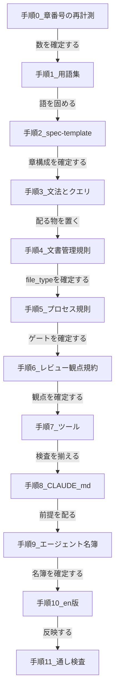

# framework-src 更新計画

**本書は作業指示書である。** これ 1 冊で `framework-src/` の更新を実行できる。**経緯と理由は書かない。決まったことだけを書く。**

**`maintenance/2026-08-08/00`〜`13` は履歴である。本書が優先する。**

---

## 0. この文書の使い方

| # | 守ること |
|:-:|---|
| 1 | **§1 と §2 を読んでから §3 に入る。** §3 の各手順は §2 の定義を指しており、定義を知らずに手順だけ実行すると必ず食い違う |
| 2 | **§3 の手順は番号順に行う。** 依存関係は §3.0 にある |
| 3 | **1 手順を終えるごとに、その手順の「確認」を実行する。** 通らないうちは次へ進まない |
| 4 | **一括置換をしてはならない（MUST NOT）。** 1 件ずつ確認して当てる |
| 5 | **途中で止めるときは、手順の切れ目で止める** |
| 6 | **判断が要る場面は §5 に集めてある。** その場で決めず、ユーザーに問う |
| 7 | **§6（注意・ノウハウ）は作業中に何度でも戻って読む** |

---

## 1. 前提と禁止事項

### 1.1 触ってよいもの

| 対象 | 可否 |
|---|:-:|
| `framework-src/ja/**` | **可** |
| `framework-src/en/**` | **可**（手順 10 でのみ） |
| `.claude/agents/**` / `.claude/commands/**` | **可**（手順 9 でのみ） |
| `CLAUDE.md` | **可**（手順 8 でのみ） |
| `tools/**` | **可**（手順 7 でのみ） |

### 1.2 触ってはならないもの

| # | 対象 | 理由 |
|:-:|---|---|
| 1 | **`git commit` / `git push` / `git tag`** | 利用者が手で行う。読み取りは可 |
| 2 | **`user-order.md`** | 人間が書くもの |
| 3 | **`StrictDocStarter` リポジトリ** | 参照のみ |
| 4 | **`maintenance/2026-08-08/00`〜`13`** | 履歴である。書き換えない |

---

## 2. 適用後の姿（定義）

**本章が定義の唯一の出所である。**

### 2.1 部と章の構成

| 部 | 章 | 章題（英） | 章題（日） | 節 |
|:-:|:-:|---|---|---|
| **第 1 部 Requirements** | 1 | Foundation | **基本事項** | 1.3 Goals がノードを持つ |
| | 2 | System Overview | システム概要 | 地の文のみ |
| | 3 | Use Cases | ユースケース | 3.1 Actors（ID 無し）/ 3.2 Use Cases |
| | 4 | Requirements | 要求 | **4.1 Functional / 4.2 Non-Functional** |
| **第 2 部 Design** | 5 | Design | 設計 | 5.6 ADR |
| | 6 | Software Specification | ソフトウェア仕様 | — |
| | 7 | Test Strategy | テスト戦略 | 地の文のみ |
| | 8 | Design Principles Compliance | 設計原則 準拠確認 | 地の文のみ |
| **第 3 部 Test** | 9 | Use Case Tests | ユースケーステスト | **9.1 Test Cases / 9.2 Test Results** |
| | 10 | Software Specification Tests | ソフトウェア仕様テスト | **10.1 Test Cases / 10.2 Test Results** |
| | 11 | Non-Functional Tests | 非機能テスト | **11.1 Test Cases / 11.2 Test Results** |

**Ch5 Design が持つモデルは 3 種で、並列である。**

| 何 | 何を表すか | 形 |
|---|---|---|
| **コンポーネント図** | どう分割するか（構造） | 図 |
| **ドメインモデル** | 何を扱うか（概念と関係） | クラス図 / ER 図 / 表 |
| **振る舞い** | どう動くか（状態・順序） | 状態遷移図 / シーケンス図 |

**データスキーマは Ch6 に置く。** 機械が検証する具体構造であり、Ch5 の 3 種とは層が違う。

### 2.2 仕様形式

**`ANGS` を廃止する。記法は 1 つで、変わるのは分ける単位だけである。**

| 仕様形式 | 分ける単位 | 枚数 | StrictDoc | `.sgra` | 使えるプロセス形式 |
|---|---|:-:|:-:|:-:|---|
| **ANMS** | 分けない | 1 | **使わない** | **配る（回さない）** | 簡易のみ |
| **ANPS-part** | 部 | 3 | 使う | 配って回す | 簡易 / 通常 / 厳密 |
| **ANPS-chapter** | 章 | 14 | 使う | 配って回す | 簡易 / 通常 / 厳密 |

**移行の道筋:**

```text
ANMS ──ファイルを部で割る──▶ ANPS-part ──部を章で割る──▶ ANPS-chapter
```

**記法が同じなので、どの段でも書き直しが要らない。**

**移行の引き金（いずれかを満たしたら次へ）:**

| # | 引き金 |
|:-:|---|
| 1 | 1 コンテキストウィンドウに収まらなくなった |
| 2 | 2 体以上のエージェントが同時に仕様書を書くようになった |
| 3 | プロセス形式が通常以上に上がった |

### 2.3 ファイル名と番号の規則

> **ファイル番号は、そのファイルが持つ最初の章の番号とする（MUST）。番号は席番号であり、並び順ではない。ファイルが省かれても、残ったファイルの番号を詰め直してはならない（MUST NOT）。**

> **複数の章を 1 枚に入れるファイルは、範囲を名前に含める（MUST）。**

| 仕様形式 | ファイル |
|---|---|
| **ANMS** | `01-11-spec.md` |
| **ANPS-part** | `01-04-requirements.md` / `05-08-design.md` / `09-11-test.md` |
| **ANPS-chapter** | 下の 14 枚 |

```text
01-foundation.md              06-software-specification.md   10-sws-test-cases.md
02-overview.md                07-test-strategy.md            10-sws-test-results.md
03-use-cases.md               08-design-principles-check.md  11-nfr-test-cases.md
04-requirements.md            09-uc-test-cases.md            11-nfr-test-results.md
05-design.md                  09-uc-test-results.md
```

**あわせて置くもの:** `spec.sgra` 1 枚、`<同名>.meta.yaml` を `.md` 1 枚につき 1 枚、`_assets/fig-<name>.md` を必要数。

**`DOC` の UID は `DOC-` ＋ ファイル名（番号を除く）を大文字にしたもの（MUST）。**

### 2.4 ノードの一覧

| UID 接頭 | 章 | `TAG`（`.sgra` の `TAG:` ＝ `.md` の `**Type**:`） | 親 `TAG` | `TYPE` / `ROLE` | 作成者 | 編集者 | 読者 |
|---|---|---|---|---|---|---|---|
| — | 全章 | `SECTION` | — | — | 文書のオーナー | 同左 | 文書の読者 |
| — | 全章 | 無し（宣言しない。`TEXT`） | — | — | 文書のオーナー | 同左 | 文書の読者 |
| `GL` | Ch1.3 | `GOAL` | 無し（根） | — | srs-writer | srs-writer / change-manager | 全エージェント |
| `UC` | Ch3.2 | `USE_CASE` | `GOAL` | `Parent` / `Satisfies` | srs-writer | srs-writer | architect / review-agent |
| `FR` | Ch4.1 | `FUNC_REQ` | `USE_CASE` | `Parent` / `Satisfies` | srs-writer | change-manager | 全エージェント |
| `NFR` | Ch4.2 | `NON_FUNC_REQ` | `GOAL` | `Parent` / `Satisfies` | srs-writer | change-manager | 全エージェント |
| `ADR` | Ch5.6 | 無し（UID のみ。トレースに載せない） | — | — | architect | architect | implementer / review-agent / runbook-writer |
| `SWS` | Ch6 | `SW_SPEC` | `FUNC_REQ` または `NON_FUNC_REQ` | `Parent` / `Satisfies` | architect | architect | implementer |
| `TC` | Ch9.1 | `USE_CASE_TEST` | `USE_CASE` | `Parent` / `Verifies` ＋ `File` | test-designer | test-designer | implementer / review-agent / tester |
| `TC` | Ch10.1 | `SW_SPEC_TEST` | `SW_SPEC` | `Parent` / `Verifies` ＋ `File` | test-designer | test-designer | implementer / review-agent / tester |
| `TC` | Ch11.1 | `NON_FUNC_TEST` | `NON_FUNC_REQ` | `Parent` / `Verifies` ＋ `File` | test-designer | test-designer | implementer / security-reviewer / tester |
| `TR` | Ch9.2 / 10.2 / 11.2 | `TEST_RESULT` | テスト 3 型のいずれか | `Parent` / `ResultOf` | tester | tester | progress-monitor / test-designer |

**採番は 3 桁のゼロ詰め（MUST）。ランダム ID・GUID を使ってはならない（MUST NOT）。**
**`TC` / `TR` は 3 系統で接頭辞を共有し、番号は通しの単一連番とする。番号帯で系統を表してはならない（MUST NOT）。**

### 2.5 型ごとの欄

| `TAG` | 必須の欄 | 任意の欄 |
|---|---|---|
| `SECTION` | `TITLE` | — |
| `GOAL` | `UID` / `TITLE` / `STATEMENT` | — |
| `USE_CASE` | `UID` / `TITLE` / `STATEMENT` / **`SCENARIO`** | `EXTENSIONS` |
| `FUNC_REQ` | `UID` / `TITLE` / `STATEMENT` | `ORIGIN` / `RATIONALE` |
| `NON_FUNC_REQ` | `UID` / `TITLE` / `STATEMENT` | `ORIGIN` / `RATIONALE` |
| `SW_SPEC` | `UID` / `TITLE` / `STATEMENT` | `RATIONALE` |
| `USE_CASE_TEST` | `UID` / `TITLE` / `GIVEN` / `WHEN` / `THEN` | — |
| `SW_SPEC_TEST` | `UID` / `TITLE` / `TEST_LEVEL` / `GIVEN` / `WHEN` / `THEN` | — |
| `NON_FUNC_TEST` | `UID` / `TITLE` / `GIVEN` / `WHEN` / `THEN` | — |
| `TEST_RESULT` | `UID` / `TITLE` / `RESULT` / `EXECUTED_ON` / `TESTED_VERSION` / `ENVIRONMENT` / `EVIDENCE` | `REMARK` |

**値域を持つ欄:**

| 欄 | 値域 |
|---|---|
| `TEST_LEVEL` | `Unit` / `Integration` / `System` |
| `RESULT` | `PASS` / `CONDITIONAL` / `FAIL` / `SKIP` |

**書き方の規則:**

| # | 規則 |
|:-:|---|
| 1 | `TITLE` は見出しから来る。**`.md` に `**TITLE**:` と書かない** |
| 2 | **`EXECUTED_ON` は UTC の ISO 8601 日時とする（MUST）** —— `2026-08-09T05:32:05Z`。**オフセット表記を使ってはならない（MUST NOT）。** 混ざると文字列比較の順序が実時刻とずれる |
| 3 | `TESTED_VERSION` は**被試験ソフトを一意に特定するもの**。commit SHA を推奨 |
| 4 | `EVIDENCE` は**後から取り出せるもの**。「確認済み」のようなたどれない文字列を書いてはならない（MUST NOT） |
| 5 | `SW_SPEC` の `STATEMENT` は **EARS 1 文**。資料に機械可読な形で在ることを繰り返してはならない（MUST NOT） |
| 6 | **仕様書のノードはレビュー関連の欄を持たない（MUST NOT）。** §2.9 を見よ |

### 2.6 file_type

| `file_type` | 対象（部・章） | オーナー | どの仕様形式で使うか |
|---|---|---|---|
| `spec` | Ch1〜Ch11 | srs-writer | **ANMS** |
| `spec-requirements` | 第 1 部（Ch1〜Ch4） | srs-writer | ANPS-part / ANPS-chapter |
| `spec-design` | 第 2 部（Ch5〜Ch8） | architect | 同左 |
| `spec-test` | 第 3 部（Ch9〜Ch11） | test-designer | **ANPS-part のみ** |
| `spec-test-case` | Ch9.1 / 10.1 / 11.1 | test-designer | **ANPS-chapter のみ** |
| `spec-test-result` | Ch9.2 / 10.2 / 11.2 | tester | 同左 |

**移行:** `spec-foundation` → `spec-requirements`、`spec-architecture` → `spec-design`。

### 2.7 置換辞書（旧 → 新）

**本節が置換の唯一の出所である。**

| 種別 | 旧 | 新 |
|---|---|---|
| 仕様形式 | ANMS / ANPS / **ANGS** | **ANMS / ANPS-part / ANPS-chapter**（ANGS 廃止） |
| 章 | Ch2 System Configuration | **Ch2 System Overview** |
| 章 | Ch5 Architecture | **Ch5 Design** |
| 章 | Ch6.1 Scenarios | **Ch9 / Ch10 / Ch11 の各 .1** |
| 章題（日） | Foundation = 前提 | **Foundation = 基本事項** |
| UID 接頭 | `GOAL-` | **`GL-`** |
| UID 接頭 | `SC-` | **`TC-`** |
| UID 接頭 | （新設） | **`SWS-` / `TR-`** |
| UID 接頭 | `ND-` / `CN-` | **廃止**（地の文にする） |
| 欄 | `MAIN_SCENARIO` | **`SCENARIO`** |
| 欄 | `REVIEW_STATUS`（ノード側） | **廃止**（§2.9） |
| file_type | `spec-foundation` | **`spec-requirements`** |
| file_type | `spec-architecture` | **`spec-design`** |
| 語 | データモデル（Ch5 を指すもの） | **ドメインモデル** |
| 語 | データモデル（Ch6 を指すもの） | **データスキーマ** |
| 語 | データモデル（裸で使う） | **非採用語。使ってはならない（MUST NOT）** |
| 語 | システム構成図（`§9.14` 側） | **コンポーネント図** |
| 語 | システム構成図（Ch2 側） | **変えない** |
| 役割 | test-engineer | **test-designer ＋ tester**（手順 9） |

> **章番号の移動は本表では表せない。** 件数は**未計測である**（手順 0）。

### 2.8 レビュー指摘の置き場

> **レビュー指摘は `project-records/reviews/` が持つ。仕様書のノードは一切持たない（MUST NOT）。**

**切り分けた理由は 1 つである。** 指摘には**ノードに紐づけられないもの**が確実にある。

| 指摘の種類 | 例 | ノードに紐づくか |
|---|---|:-:|
| 単一ノードへの指摘 | 「この要求にテスト不可能な表現がある」 | 紐づく |
| **ノード間の指摘** | 「`FR-001` の前提が `FR-015` の動作と競合する」 | **2 つにまたがる** |
| **漏れの指摘** | 「MECE の観点で漏れがある」「境界条件が無い」 | **紐づかない。無いものは指せない** |
| **文書全体への指摘** | 「エンティティ名が一貫していない」 | 紐づかない |
| **コードへの指摘（R2 全体）** | 「`UserService` が 3 つの責務を持つ」 | 紐づかない |

**レビュー文書は機械可読とする。** Form Block に指摘 1 件ずつを持つ。

| 欄 | 値域 | 中身 |
|---|---|---|
| `finding_id` | `RV-001` 形式 | 指摘の ID |
| **`target_kind`** | `node` / `document` / `chapter` / `code` / `whole` | **対象の種類。これが「漏れ」を置ける鍵である** |
| `target` | 文字列 | `FR-001` / `DOC-OVERVIEW` / `Ch4.2` / `src/lookup.py` / `-` |
| `viewpoint` | `R1a` 〜 `R7` | 観点 |
| `severity` | `Critical` / `High` / `Medium` / `Low` | 重大度 |
| `status` | `Open` / `Fixed` / `WontFix` | 状態 |
| `action` | 文字列 | 対応 |

**これで次の 2 つが機械で出せる。**

| 何 | どうやって |
|---|---|
| **品質ゲート（Critical 0 / High 0）** | `severity` が `Critical` / `High` かつ `status` が `Open` のものを数える |
| **未解決の指摘を持つ要求の一覧** | `target_kind` が `node` の指摘と、仕様書 JSON を `target` で結合する |

> **状態を 2 か所に持たない。** 仕様書のノードに状態を写すと、写した先とレビュー文書がずれる。**結合で同じ答えが出る以上、写す理由が無い。**

### 2.9 配る文法 `spec.sgra`

**配置先:** `framework-src/ja/templates/spec.sgra`（新設。`apply-process-mode.js` が `docs/spec/` へ配置する）

**ノード型 10 種。`GOAL` を根とし、`ROLE` は `Satisfies` / `Verifies` / `ResultOf` の 3 種のみ。すべて鎖に載る。**

```text
[GRAMMAR]
ELEMENTS:
- TAG: SECTION
  PROPERTIES:
    IS_COMPOSITE: True
  FIELDS:
  - TITLE: TITLE
    TYPE: String
    REQUIRED: True
- TAG: GOAL
  FIELDS:
  - TITLE: UID
    TYPE: String
    REQUIRED: True
  - TITLE: TITLE
    TYPE: String
    REQUIRED: True
  - TITLE: STATEMENT
    TYPE: String
    REQUIRED: True
- TAG: USE_CASE
  FIELDS:
  - TITLE: UID
    TYPE: String
    REQUIRED: True
  - TITLE: TITLE
    TYPE: String
    REQUIRED: True
  - TITLE: STATEMENT
    TYPE: String
    REQUIRED: True
  - TITLE: SCENARIO
    TYPE: String
    REQUIRED: True
  - TITLE: EXTENSIONS
    TYPE: String
    REQUIRED: False
  RELATIONS:
  - TYPE: Parent
    ROLE: Satisfies
- TAG: FUNC_REQ
  FIELDS:
  - TITLE: UID
    TYPE: String
    REQUIRED: True
  - TITLE: TITLE
    TYPE: String
    REQUIRED: True
  - TITLE: STATEMENT
    TYPE: String
    REQUIRED: True
  - TITLE: ORIGIN
    TYPE: String
    REQUIRED: False
  - TITLE: RATIONALE
    TYPE: String
    REQUIRED: False
  RELATIONS:
  - TYPE: Parent
    ROLE: Satisfies
- TAG: NON_FUNC_REQ
  FIELDS:
  - TITLE: UID
    TYPE: String
    REQUIRED: True
  - TITLE: TITLE
    TYPE: String
    REQUIRED: True
  - TITLE: STATEMENT
    TYPE: String
    REQUIRED: True
  - TITLE: ORIGIN
    TYPE: String
    REQUIRED: False
  - TITLE: RATIONALE
    TYPE: String
    REQUIRED: False
  RELATIONS:
  - TYPE: Parent
    ROLE: Satisfies
- TAG: SW_SPEC
  FIELDS:
  - TITLE: UID
    TYPE: String
    REQUIRED: True
  - TITLE: TITLE
    TYPE: String
    REQUIRED: True
  - TITLE: STATEMENT
    TYPE: String
    REQUIRED: True
  - TITLE: RATIONALE
    TYPE: String
    REQUIRED: False
  RELATIONS:
  - TYPE: Parent
    ROLE: Satisfies
- TAG: USE_CASE_TEST
  FIELDS:
  - TITLE: UID
    TYPE: String
    REQUIRED: True
  - TITLE: TITLE
    TYPE: String
    REQUIRED: True
  - TITLE: GIVEN
    TYPE: String
    REQUIRED: True
  - TITLE: WHEN
    TYPE: String
    REQUIRED: True
  - TITLE: THEN
    TYPE: String
    REQUIRED: True
  RELATIONS:
  - TYPE: Parent
    ROLE: Verifies
  - TYPE: File
- TAG: SW_SPEC_TEST
  FIELDS:
  - TITLE: UID
    TYPE: String
    REQUIRED: True
  - TITLE: TITLE
    TYPE: String
    REQUIRED: True
  - TITLE: TEST_LEVEL
    TYPE: SingleChoice(Unit, Integration, System)
    REQUIRED: True
  - TITLE: GIVEN
    TYPE: String
    REQUIRED: True
  - TITLE: WHEN
    TYPE: String
    REQUIRED: True
  - TITLE: THEN
    TYPE: String
    REQUIRED: True
  RELATIONS:
  - TYPE: Parent
    ROLE: Verifies
  - TYPE: File
- TAG: NON_FUNC_TEST
  FIELDS:
  - TITLE: UID
    TYPE: String
    REQUIRED: True
  - TITLE: TITLE
    TYPE: String
    REQUIRED: True
  - TITLE: GIVEN
    TYPE: String
    REQUIRED: True
  - TITLE: WHEN
    TYPE: String
    REQUIRED: True
  - TITLE: THEN
    TYPE: String
    REQUIRED: True
  RELATIONS:
  - TYPE: Parent
    ROLE: Verifies
  - TYPE: File
- TAG: TEST_RESULT
  FIELDS:
  - TITLE: UID
    TYPE: String
    REQUIRED: True
  - TITLE: TITLE
    TYPE: String
    REQUIRED: True
  - TITLE: RESULT
    TYPE: SingleChoice(PASS, CONDITIONAL, FAIL, SKIP)
    REQUIRED: True
  - TITLE: EXECUTED_ON
    TYPE: String
    REQUIRED: True
  - TITLE: TESTED_VERSION
    TYPE: String
    REQUIRED: True
  - TITLE: ENVIRONMENT
    TYPE: String
    REQUIRED: True
  - TITLE: EVIDENCE
    TYPE: String
    REQUIRED: True
  - TITLE: REMARK
    TYPE: String
    REQUIRED: False
  RELATIONS:
  - TYPE: Parent
    ROLE: ResultOf
```

**実測（2026-08-09。strictdoc 0.27.1 / Python 3.13.3 / Windows 11）:** 14 枚 + 図 1 枚で json / html とも export が通り、20 ノードすべての関係が解決した。**同じ番号の 2 ファイルは共存し、`.meta.yaml` は文書として拾われない。**

### 2.10 配る検出クエリ `checks.jq`

**配置先:** `tools/spec-query/checks.jq`（新設）

**走らせ方:**

```bash
strictdoc export docs/spec --formats=json --output-dir out/json --no-parallelization
jq -f tools/spec-query/checks.jq out/json/json/index.json
```

```text
def nodes: [.DOCUMENTS[].NODES | .. | objects | select(.UID != null)];
def parents($n): [($n.RELATIONS // [])[] | select(.TYPE == "Parent") | .VALUE];

nodes as $N
| ($N | map({key: .UID, value: ._NODE_TYPE}) | from_entries) as $TYPE
| ({
    "GOAL":"GL","USE_CASE":"UC","FUNC_REQ":"FR","NON_FUNC_REQ":"NFR",
    "SW_SPEC":"SWS","USE_CASE_TEST":"TC","SW_SPEC_TEST":"TC",
    "NON_FUNC_TEST":"TC","TEST_RESULT":"TR"
  }) as $PREFIX
| ({
    "USE_CASE":["GOAL"],
    "FUNC_REQ":["USE_CASE"],
    "NON_FUNC_REQ":["GOAL"],
    "SW_SPEC":["FUNC_REQ","NON_FUNC_REQ"],
    "USE_CASE_TEST":["USE_CASE"],
    "SW_SPEC_TEST":["SW_SPEC"],
    "NON_FUNC_TEST":["NON_FUNC_REQ"],
    "TEST_RESULT":["USE_CASE_TEST","SW_SPEC_TEST","NON_FUNC_TEST"]
  }) as $ALLOWED
| ([$N[] | select(._NODE_TYPE == "USE_CASE_TEST") | parents(.)[]]) as $cov_uc
| ([$N[] | select(._NODE_TYPE == "SW_SPEC_TEST") | parents(.)[]]) as $cov_sws
| ([$N[] | select(._NODE_TYPE == "NON_FUNC_TEST") | parents(.)[]]) as $cov_nfr
| ([$N[] | select(._NODE_TYPE == "TEST_RESULT") | parents(.)[]]) as $has_result
| ([$N[] | select(._NODE_TYPE == "SW_SPEC") | {sws: .UID, req: parents(.)[]}]) as $sws_of_req
| {
  "D17 鎖から外れたノード":
    [$N[] | select(._NODE_TYPE != "GOAL") | select(parents(.) | length == 0)
      | "\(._NODE_TYPE) \(.UID)"],

  "D16a テストに覆われない USE_CASE":
    [$N[] | select(._NODE_TYPE == "USE_CASE") | select(.UID as $u | ($cov_uc | index($u)) | not) | .UID],

  "D16b テストに覆われない SW_SPEC":
    [$N[] | select(._NODE_TYPE == "SW_SPEC") | select(.UID as $u | ($cov_sws | index($u)) | not) | .UID],

  "D16c テストに覆われない NON_FUNC_REQ":
    [$N[] | select(._NODE_TYPE == "NON_FUNC_REQ") | select(.UID as $u | ($cov_nfr | index($u)) | not) | .UID],

  "D16d 積み上げで覆われない FUNC_REQ":
    [$N[] | select(._NODE_TYPE == "FUNC_REQ") | .UID as $fr
      | ([$sws_of_req[] | select(.req == $fr) | .sws]) as $mine
      | ([$mine[] | . as $s | select(($cov_sws | index($s)) | not)]) as $uncov
      | if ($mine | length) == 0 then "\($fr) (SW_SPEC 無し)"
        elif ($uncov | length) > 0 then "\($fr) (配下の SW_SPEC が未覆: \($uncov | join(",")))"
        else empty end],

  "D19 走らせていないテスト":
    [$N[] | select(._NODE_TYPE | endswith("_TEST"))
      | select(.UID as $u | ($has_result | index($u)) | not) | .UID],

  "D20 段をまたいだテスト":
    [$N[] | select(._NODE_TYPE | endswith("_TEST")) as $t
      | parents($t)[] as $p
      | select(($ALLOWED[$t._NODE_TYPE] | index($TYPE[$p])) | not)
      | "\($t.UID) (\($t._NODE_TYPE) -> \($p) は \($TYPE[$p]))"],

  "D21 接頭辞の規約違反":
    [$N[] | . as $n
      | select(($n.UID | startswith($PREFIX[$n._NODE_TYPE] + "-")) | not)
      | "\($n.UID) (\($n._NODE_TYPE) なら \($PREFIX[$n._NODE_TYPE])- で始まるべき)"]
}
```

> **接頭辞と親の型の対応表がクエリの中に埋まっている。§2.4 を直したら、このファイルも直す（MUST）。**

---

## 3. 作業手順

### 3.0 段取りと依存関係



| # | なぜこの順か |
|:-:|---|
| 1 | **用語を先に固める。** 以降の全手順が同じ語を使う |
| 2 | **spec-template を次に置く。** 章構成が確定しないと、他の規則の参照先が決まらない |
| 3 | **エージェント名簿は最後の手前。** 最も切り戻しにくいので、他が全部通ってから触る |
| 4 | **en 版は ja が全部終わってから。** `check-parity` が 41 ファイル対で行数一致を強制する |

---

### 手順 0. 章番号参照の再計測

**未実施。着手前に必ず行う。**

| やること | 内容 |
|---|---|
| 数える対象の形をすべて列挙する | `ChN` / `ChN.M` / `ChN-M`（範囲）/ `ChapterN` / `ChapterN.M` |
| ja / en それぞれの件数を出す | ファイル別・表記別に分ける |
| 置換の順序を決める | **範囲表記 → 節番号 → 章番号（降順）** |

**確認:** 件数表ができ、置換順序が書かれていること。

> **本書に件数を書いていないのは、まだ数えていないからである。推測で埋めてはならない（MUST NOT）。**

---

### 手順 1. 用語集 `framework-src/ja/process-rules/glossary.md`

| # | 変更 |
|:-:|---|
| 1 | **§2.7 の語をすべて登録する**（採用語・非採用語） |
| 2 | **「データモデル」を非採用語にする。** 理由: Ch5 のドメインモデルと Ch6 のデータスキーマのどちらを指すか決まらない |
| 3 | **`review` / `audit` / `check` の定義を足す**（`02-framework-fixes.md` §8.1 に案がある） |
| 4 | **`actor` の衝突を「紛らわしい対」に登録する。** Common Block の `actor` と Ch3 のアクター |
| 5 | **`Use Case` / `ユースケース` の対を登録する** |
| 6 | **v0.35 が持ち込んだ新語を登録する。** ノード / 接続 / 機械 / 精密度 / 目標レベル / 削減候補 / 記述文 / 指示文 / 手段独立テスト / 与件 |
| 7 | **本改訂の新語を登録する。** `SW_SPEC` / `SWS` / ドメインモデル / データスキーマ / コンポーネント図 / test-designer / tester / ANPS-part / ANPS-chapter |

**確認:** `node tools/check-terms.mjs` が通る。

---

### 手順 2. 仕様テンプレート `framework-src/ja/process-rules/spec-template.md`

> **本文は別途。** v0.36 の全文は本書に含まれない。**別ファイルとして起こし、それで置き換える。**

**本文が満たすべき条件（受入基準）:**

| # | 条件 |
|:-:|---|
| 1 | **部が 3 つ、章が 11 章であること**（§2.1） |
| 2 | **接頭辞表が §2.4 と一致すること。** `ND` / `CN` / `SC` が無く、`SWS` / `TC` / `TR` があること |
| 3 | **Ch1 の和訳が「基本事項」であること** |
| 4 | **Ch2 が地の文のみであること。** 機械にも経路にも UID を振らない |
| 5 | **Ch5 が地の文のみであること。** `ADR` だけが UID を持ち、トレースに載らない |
| 6 | **Ch5 のモデルが 3 種（コンポーネント図・ドメインモデル・振る舞い）で並列に書かれていること** |
| 7 | **Ch6 が `SW_SPEC` を持ち、EARS 1 文の粒度を定めていること** |
| 8 | **Ch6 の表・図は資料であり、`SW_SPEC` はそれについての言明であると書かれていること** |
| 9 | **Ch6 にデータスキーマが置かれていること** |
| 10 | **Ch7 が 3 系統のマトリクスを持つこと** |
| 11 | **Ch9〜Ch11 が新設され、各章が `.1` ケースと `.2` 結果に分かれること** |
| 12 | **図の外出しが行数で定められていないこと**（「大きな図」とする） |
| 13 | **記入例の読み替え表が §2.7 と一致すること** |
| 14 | **レビュー指摘の書き方が書かれていないこと。** 指摘は `project-records/reviews/` が持つ（§2.8） |

**確認:** 上の 14 件を 1 件ずつ照合する。`node tools/check-links.mjs` が通る。

---

### 手順 3. 文法と検出クエリの配布

| # | やること | 配置先 |
|:-:|---|---|
| 1 | `spec.sgra` を置く（§2.9） | `framework-src/ja/templates/spec.sgra` |
| 2 | `checks.jq` を置く（§2.10） | `tools/spec-query/checks.jq` |
| 3 | 走らせ方を `spec-template` から参照できるようにする | — |

**確認:** §2.10 の手順で export が通り、`checks.jq` が動くこと。

---

### 手順 4. 文書管理規則 `framework-src/ja/process-rules/full-auto-dev-document-rules.md`

**この規則ファイルに対する変更をすべてここで行う。同じファイルを 2 度開かない。**

| # | 変更 | 種別 |
|:-:|---|:-:|
| 1 | **`file_type` を §2.6 の 6 種に改める** | 統一 |
| 2 | **Common Block の例外を書く。** 仕様書だけ `.meta.yaml` へ外出しする。**なぜ仕様書だけ違うのかを規則側に書く** | 統一 |
| 3 | **`review` の file_type に Form Block を定義する（§2.8）。** `finding_id` / `target_kind` / `target` / `viewpoint` / `severity` / `status` / `action` | **切り分け** |
| 4 | **`completed_chapters` / `approved_chapters` の値域を 11 章構成に合わせる** | **`02` §2** |
| 5 | **`document-rules:883` の記入例 `spec-architecture.completed_chapters: 3,4` を直す** | **`02` §2** |
| 6 | **`document-rules:1277` の「Ch3（Architecture: …・データモデル）」を直す。** 章番号・章題・語の 3 つが動く | **`02` §3** |
| 7 | **`migration_count` の説明「データモデルマイグレーション数」を「データスキーマのマイグレーション数」に改める** | **`02` §3** |
| 8 | **ANPS の分割単位の食い違いを解消する。** §2.2 の ANPS-part / ANPS-chapter で置き換える | **`02` §8-1** |

**確認:** `node tools/check-tagnames.mjs` と `node tools/check-links.mjs` が通る。

---

### 手順 5. プロセス規則 `framework-src/ja/process-rules/full-auto-dev-process-rules.md`

| # | 変更 | 種別 |
|:-:|---|:-:|
| 1 | **【最優先】design フェーズの起動プロンプトの章番号を直す**（`:997` 付近の 5 行） | **`02` §1** |
| 2 | **品質ゲートの判定対象章を 11 章構成に合わせる**（84 箇所） | 統一 |
| 3 | **品質ゲートの「レビュー指摘 Critical 0 / High 0」の数え方を定める。** レビュー文書の Form Block を数える（§2.8） | **切り分け** |
| 4 | **`process-rules:900` の「データモデルサンプル」を「ドメインモデルサンプル」に改める** | **`02` §3** |
| 5 | **要求 ID 付与率が `FR` / `NFR` しか数えない件を直す。** `GL` / `UC` / `SWS` の付与漏れが検出されない | **`02` §8-2** |

> **手順 1 は成果物が物理的に失われる経路である。** 現在の文面のままだと、architect が承認済みの `UC-001` 以下を上書きする。**最初に直す。**

**確認:** 起動プロンプトの章番号を 1 件ずつ照合する。`node tools/check-links.mjs` が通る。

---

### 手順 6. レビュー観点規約 `framework-src/ja/process-rules/review-standards.md`

| # | 変更 | 種別 |
|:-:|---|:-:|
| 1 | **R1 の対象章を 11 章構成に合わせる**（19 箇所） | **`02` §4** |
| 2 | **指摘の書き方を定める（§2.8）。** 観点ごとに `target_kind` が何になるかを示す | **切り分け** |
| 3 | **R1a と Ch3.3 の衝突を解消する。** 判断は §5 の未決 2 | **`02` §6** |
| 4 | **review-agent の観点を 2 つ足す。** (a) 紐づけ先を持たないものの検出、(b) ユースケースの抽象度の判定 | **`02` §5** |
| 5 | **`R4.3` / `R5.1` が旧章番号を含むか照合する**（未照合） | **`02` §10-1** |

**確認:** 章番号の参照が 11 章構成と一致すること。

---

### 手順 7. ツール `tools/**`

| # | 変更 |
|:-:|---|
| 1 | **`check-spec-meta.mjs` を新設する。** `.md (SD)` 1 枚ごとに同名の `.meta.yaml` が在るか、`type` が §2.6 に登録済みか、`owner` が §2.4 と合うか |
| 2 | **レビュー指摘の対象 UID の実在検査を新設する（§2.8）。** `target_kind` が `node` の指摘について、`target` が仕様書 JSON に在るか |
| 3 | **品質ゲートの集計を新設する。** `severity` が `Critical` / `High` かつ `status` が `Open` の件数 |
| 4 | **`check-links.mjs` を残す。** 仕様書については不要になるが、フレームワーク文書用には要る |
| 5 | **`check-tagnames.mjs` を残す。** 同上 |
| 6 | **`ADR-xxx` の参照切れ検査を足す。** StrictDoc は `ADR` を検証しない |
| 7 | **古い結果の検出を足す。** `TC` のファイル更新が `TR` の `EXECUTED_ON` より新しければ疑わしい |

**確認:** 新設した検査が、**既知の欠陥を仕込んだ状態で実際に拾うこと**（§6.3）。

---

### 手順 8. `CLAUDE.md`

| # | 変更 |
|:-:|---|
| 1 | **仕様形式の表を §2.2 の 3 つに改める。** `ANGS` を削る |
| 2 | **仕様形式とプロセス形式の組み合わせ制限を書く。** 通常以上は ANPS のみ |
| 3 | **エージェント名簿を手順 9 の結果に合わせる** |
| 4 | **仕様書の出力先と構成を 11 章に合わせる** |

**確認:** `node tools/check-setup.mjs` が通る。

---

### 手順 9. エージェント定義と名簿の再整理

> **最も切り戻しにくい手順である。他が全部通ってから着手する。**

| # | 変更 | 種別 |
|:-:|---|:-:|
| 1 | **名簿全体を再整理する。** 現行 22 体の役割・オーナーシップ・データフローを見直す | 統一 |
| 2 | **`test-engineer` を `test-designer` と `tester` に分ける。** 受入基準とテストコードは test-designer、実行と記録は tester | 統一 |
| 3 | **`review-agent` の Out を §2.8 の Form Block に合わせる** | **切り分け** |
| 4 | **`srs-writer` の Procedure を直す。** Ch1.3 の目標に `GL-xxx` を振る / Ch2 のヒアリング項目を足す / Ch3 のアクターとユースケース / 削減候補の提示 | **`02` §5** |
| 5 | **`architect.md` の Start Conditions と Procedure の章番号を直す**（`:30` と `:74-84`） | **`02` §1** |
| 6 | **`architect.md` の description の「データモデル」を「データスキーマ」に改める** | **`02` §3** |
| 7 | **`runbook-writer.md` の In を直す。** `spec-architecture` → `spec-requirements`、「Ch3 のシステム構成図」→「Ch2 の構成図」 | **`02` §3** |
| 8 | **`runbook-writer.md` の In に `deployment-design` を足す。** Start Conditions が要求しているのに In の表に無い | **新規発見** |
| 9 | **`commands/full-auto-dev.md` に章番号の直書きがあるか照合する**（未照合） | **`02` §10-2** |

**確認:** `node tools/check-roster.mjs` が通る。

---

### 手順 10. en 版への反映 `framework-src/en/**`

| # | 変更 |
|:-:|---|
| 1 | **ja で行った全変更を en に反映する** |
| 2 | **章題は §2.1 の英語をそのまま使う** |

> **`check-parity` が 41 ファイル対で ja / en の行数一致を強制する。** ja を先に仕上げ、確認してから en に反映する。**行数を合わせる作業が別に要る。**

**確認:** `node tools/check-parity.mjs` が通る。

---

### 手順 11. 通し検査

```bash
node tools/check-parity.mjs && node tools/check-roster.mjs && node tools/check-links.mjs && node tools/check-tagnames.mjs && node tools/check-terms.mjs && node tools/check-setup.mjs
```

---

## 4. 完了条件

| # | 条件 | 判定方法 |
|:-:|---|---|
| 1 | 手順 0〜11 がすべて終わっている | 各手順の「確認」が通る |
| 2 | 通し検査が通る | 手順 11 |
| 3 | **11 章構成の仕様書一式が export できる** | §2.10 の手順 |
| 4 | **検出クエリ 8 本が、仕込んだ欠陥を拾う** | §6.3 |
| 5 | **レビュー指摘が Form Block で数えられる** | 手順 7-3 |
| 6 | **`02-framework-fixes.md` の Critical が残っていない** | 手順 4〜6・9 の該当行 |
| 7 | §5 の未決がすべて決着している | §5 |

---

## 5. 段 5 の中で決める判断

**その場で決めてはならない（MUST NOT）。ユーザーに問う。**

| # | 判断 | 選択肢 |
|:-:|---|---|
| 1 | **`spec-template` v0.36 の本文をどう起こすか** | 別ファイルで新規作成 / v0.35 からの差分適用 |
| 2 | **R1a と Ch3.3 の衝突をどう解くか** | A: R1a を Ch9.1 の異常系で満たすと定める（推奨）/ B: R1a を緩める / C: Ch3.3 の「既定は空」をやめる |
| 3 | **エージェント名簿の再整理の範囲** | `test-engineer` の分割のみ / 22 体全体の見直し |
| 4 | **要求 ID 付与率が数える対象** | `FR` / `NFR` のみ / `GL` / `UC` / `SWS` も数える |
| 5 | **`02-framework-fixes.md` §8 の既存不整合 5 件を今回直すか** | 直す / 記録のみ |
| 6 | **`RV` 接頭辞を用語集の接頭辞表に載せるか** | 載せる（仕様書の接頭辞と混ざる）/ プロセス記録側で別に定義する |

---

## 6. 注意・ノウハウ

### 6.1 StrictDoc の癖

| # | 内容 |
|:-:|---|
| 1 | **`TAG` は `[A-Z]+(_[A-Z]+)*` に限られる。** kebab も camel も数字も通らない |
| 2 | **欄名は `[A-Z]+[A-Za-z0-9_\-]*`。** `TAG` より緩いが、UPPER_SNAKE_CASE に統一する |
| 3 | **`ROLE` は PascalCase。** `TAG` と規則が違う |
| 4 | **`**Relations**:` はメタデータ欄の直後（空行なし）か、本文欄の後ろに置く。** 間に空行だけを挟むと export が止まる |
| 5 | **メタデータ欄の最終行に行継続の `\` を残さない。** 欄を削るときは前の行の `\` も一緒に落とす |
| 6 | **`**Type**:` は省略できない。** `SECTION` も明示する |
| 7 | **`File` 関係の鍵は `Path`。** 他を書くと export が止まる |
| 8 | **文書ヘッダに独自の欄を書いてはならない。** エラーも警告も無く消える |
| 9 | **`_assets/` の図に `**Grammar**` を宣言しない。** パス解決で落ちる |
| 10 | **`HUMAN_TITLE` は HTML のラベルしか変えない。** `.md` の書き方も JSON の鍵も変わらない |
| 11 | **Common Block（YAML frontmatter）をファイル先頭に置けない。** H1 の後ろへ逃がすと文書ヘッダと文法を失う |
| 12 | **`--filter-nodes` は HTML にしか効かない。** JSON には効かない |
| 13 | **`exclude_doc_paths` は鎖の後ろ側しか切れない。** 前を切ると参照切れで止まる |
| 14 | **`.meta.yaml` を同じフォルダに置いても文書として拾われない**（実測） |
| 15 | **同じ番号の 2 ファイルは共存できる**（実測）。名前が違えばよい |
| 16 | **使える欄の型は 4 種。** `String` / `SingleChoice(...)` / `MultipleChoice(...)` / `Tag` |

### 6.2 測るときの規律

| # | 規律 |
|:-:|---|
| 1 | **`--no-parallelization` を必ず付ける。** 並列 export が本当のエラーを握り潰す |
| 2 | **出力先を入力フォルダの中に置かない。** 出力先を変えた回に UID 重複で止まる |
| 3 | **測ったら `od -c` でバイトを確認してから結論を書く** |
| 4 | **シェルのヒアドキュメントでバックスラッシュが潰れることがある。** `\` を含むスクリプトは**ファイルに書いてから実行する** |
| 5 | **Python の非 raw 文字列では `\` + 改行が消える。** `r"""..."""` を使う |
| 6 | **長いヒアドキュメントは途中で壊れる。** 生成スクリプトをファイルに書く |

### 6.3 jq を書くときの罠

**`.` の文脈がパイプと関数引数で変わる。**

| # | 誤った書き方 | 何が起きたか | 正しい書き方 |
|:-:|---|---|---|
| 1 | `.UID \| startswith($PREFIX[._NODE_TYPE] + "-")` | パイプの先で `.` が文字列になり `Cannot index string` | `. as $n` で束縛してから使う |
| 2 | `$cov \| index(.)` | 引数は**その関数の入力**に対して評価される。`.` が `$cov` 自身になり、**常に不一致 → 検出が全件空** | `. as $s` で束縛し `index($s)` |

> **2 はエラーにならず「検出なし」という正しく見える答えを返す。**

> **したがって、検出クエリは必ず既知の欠陥を仕込んで確かめる（MUST）。「0 件だった」は「検査が働いた」を意味しない。**

### 6.4 作業そのものの落とし穴

| # | 内容 |
|:-:|---|
| 1 | **一括置換をしてはならない。** `Ch2 → Ch4` を先に当てると、その結果を後続の `Ch4 → Ch6` が食う |
| 2 | **置換の順序は「範囲表記 → 節番号 → 章番号（降順）」** |
| 3 | **変更しないものも理由つきで記録する。** 数え漏れと区別が付かなくなる |
| 4 | **数える前に、数える対象の形をすべて列挙する。** 範囲表記を数え落とすと件数が 3 割ずれる |
| 5 | **引用する規約は、引用する前に本文を読む** |
| 6 | **同じ知識を 2 か所に置かない。** `checks.jq` に接頭辞と親の型の対応表が埋まっている。§2.4 を直したら必ず両方直す |
| 7 | **状態を 2 か所に持たない。** レビュー指摘の状態を仕様書のノードにも写すと、必ずずれる。**結合で答えが出るなら写さない** |
