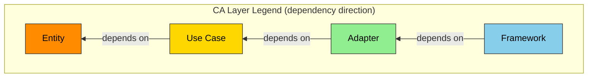

# AI-Native Spec Template v0.36 — ANMS / ANPS-part / ANPS-chapter

**本書は仕様テンプレートの本文である。** `framework-src/ja/process-rules/spec-template.md` を置き換える候補として起こした。**適用は段 5（`maintenance/2026-08-08/14-framework-update-plan.md` の手順 2）で行う。**

**記法は 1 つである。** ANMS・ANPS-part・ANPS-chapter で変わるのは分ける単位だけであり、書き方は変わらない。

---

## 仕様書の設計原則: STFB (Stable Top, Flexible Bottom) — 上剛下柔

Robert C. Martin の安定依存の原則 (Stable Dependencies Principle) に着想を得た章構成。上位の章は剛（安定し変更頻度が低い）、下位の章は柔（具体的で変更頻度が高い）。上位章が変わると下位章の見直しが必要になるが、下位章の変更は上位章に影響しない。

**章構成の安定度軸:**

```text
  第 1 部 Requirements
    Chapter  1  Foundation                    ← 剛: 最も安定
    Chapter  2  System Overview                 与件。何の上で動くか
    Chapter  3  Use Cases                       アクター視点。誰が何を達成するか
    Chapter  4  Requirements                    システム視点。何を満たすか

  第 2 部 Design
    Chapter  5  Design                          どう作るか
    Chapter  6  Software Specification          どう動くか
    Chapter  7  Test Strategy                   どう確かめるか
    Chapter  8  Design Principles Compliance    設計原則に適っているか

  第 3 部 Test
    Chapter  9  Use Case Tests                  ユースケースを確かめる
    Chapter 10  Software Specification Tests    ソフトウェア仕様を確かめる
    Chapter 11  Non-Functional Tests          ← 柔: 最も可変（結果は走らせるたびに変わる）
```

**部は 3 つである。** 第 1 部が「何を作るか」、第 2 部が「どう作るか」、第 3 部が「作ったものが合っているか」を持つ。**部の境界は書き手が変わる境界でもある** —— 第 1 部は srs-writer、第 2 部は architect、第 3 部は test-designer と tester が書く。

Chapter 2 と Chapter 3 を要求より上に置く理由は 2 つある。**(1) システムの概要は与件である。** 車両・スマートフォン・サーバー・既存ハードウェアは既に存在し、こちらの都合では変えられない。設計判断より安定している。**(2) ユースケースはアクター視点であり、要求はシステム視点である。** 視点の変換は一方向で、アクターの目標が変われば要求は変わるが、要求の書き換えでアクターの目標は変わらない。

> **本軸は安定度であって抽象度ではない。** システムの概要は物理的で具体的でありながら、与件であるがゆえに最も安定している。**抽象度は別の軸であり、その階段は Chapter 3 で定義する。**

**人間が主導する 3 つの責務:**

全自動開発においても、以下の 3 つは人間が主導する（プロセス規則 §1.1 参照）:

1. **コンセプトの提示**（Ch1 Foundation の入力）— 何を作りたいか、なぜ必要か
2. **重要な意思決定**（Ch5.6 Decisions の判断）— 技術選定、アーキテクチャ方針
3. **受入テスト**（Ch9.2 / Ch10.2 / Ch11.2 の `RESULT` 判定）— 完成物がビジネス要求を満たすか

---

## 仕様形式

**記法は 1 つで、変わるのは分ける単位だけである。**

| 仕様形式 | 分ける単位 | 枚数 | StrictDoc | `spec.sgra` | 使えるプロセス形式 |
|---|---|:-:|:-:|:-:|---|
| **ANMS**（AI-Native Minimal Spec） | 分けない | 1 | **使わない** | **配る（回さない）** | 簡易のみ |
| **ANPS-part**（AI-Native Plural Spec, 部単位） | 部 | 3 | 使う | 配って回す | 簡易 / 通常 / 厳密 |
| **ANPS-chapter**（AI-Native Plural Spec, 章単位） | 章 | 14 | 使う | 配って回す | 簡易 / 通常 / 厳密 |

**ANMS でも記法は同じである。** StrictDoc を回さないだけであり、`spec.sgra` は配る。**回さないので export も検出クエリも使えないが、書き直しなしで次の段へ移れる。**

**移行の道筋:**

```text
ANMS ──ファイルを部で割る──▶ ANPS-part ──部を章で割る──▶ ANPS-chapter
```

**記法が同じなので、どの段でも書き直しが要らない。** 割るだけである。

**移行の引き金（いずれかを満たしたら次へ）:**

| # | 引き金 |
|:-:|---|
| 1 | 1 コンテキストウィンドウに収まらなくなった |
| 2 | 2 体以上のエージェントが同時に仕様書を書くようになった |
| 3 | プロセス形式が通常以上に上がった |

### ファイル名と番号の規則

> **ファイル番号は、そのファイルが持つ最初の章の番号とする（MUST）。番号は席番号であり、並び順ではない。ファイルが省かれても、残ったファイルの番号を詰め直してはならない（MUST NOT）。**

> **複数の章を 1 枚に入れるファイルは、範囲を名前に含める（MUST）。**

| 仕様形式 | ファイル |
|---|---|
| **ANMS** | `01-11-spec.md` |
| **ANPS-part** | `01-04-requirements.md` / `05-08-design.md` / `09-11-test.md` |
| **ANPS-chapter** | 下の 14 枚 |

**ANPS-chapter の 14 枚:**

```text
01-foundation.md              06-software-specification.md   10-sws-test-cases.md
02-overview.md                07-test-strategy.md            10-sws-test-results.md
03-use-cases.md               08-design-principles-check.md  11-nfr-test-cases.md
04-requirements.md            09-uc-test-cases.md            11-nfr-test-results.md
05-design.md                  09-uc-test-results.md
```

**同じ番号の 2 枚が並ぶ。** 第 3 部の各章はケースと結果に分かれ、書き手も更新頻度も違うためである。**名前が違えば共存する**（実測で確認済み）。

**あわせて置くもの:**

| 何 | 枚数 | 中身 |
|---|---|---|
| `spec.sgra` | 1 | ノード型の文法。`apply-process-mode.js` が配置する |
| `<同名>.meta.yaml` | `.md` 1 枚につき 1 枚 | Common Block。**StrictDoc は文書として拾わない**（実測） |
| `_assets/fig-<name>.md` | 必要数 | 大きな図。**`**Grammar**` を宣言しない**（宣言するとパス解決で落ちる） |

**`DOC` の UID は `DOC-` ＋ ファイル名（番号を除く）を大文字にしたものとする（MUST）。** `04-requirements.md` なら `DOC-REQUIREMENTS`、`01-11-spec.md` なら `DOC-SPEC` である。

---

## Chapter Structure

**章の一覧:**

| 部 | # | English | 日本語 | 主な記法 | 安定度 |
|:-:|:-:|---|---|---|---|
| **第 1 部 Requirements** | 1 | **Foundation** | 基本事項 | 自然言語 + テーブル | 最も安定 |
| | 2 | **System Overview** | システム概要 | Mermaid + テーブル | 最も安定（与件） |
| | 3 | **Use Cases** | ユースケース | ノード（Cockburn brief） | 安定 |
| | 4 | **Requirements** | 要求 | ノード（EARS）+ 数式 | 安定 |
| **第 2 部 Design** | 5 | **Design** | 設計 | Mermaid + テーブル | やや安定 |
| | 6 | **Software Specification** | ソフトウェア仕様 | ノード（EARS）+ 表・図・スキーマ | よく変わる |
| | 7 | **Test Strategy** | テスト戦略 | テーブル | よく変わる |
| | 8 | **Design Principles Compliance** | 設計原則 準拠確認 | テーブル | 可変（レビュー時に更新） |
| **第 3 部 Test** | 9 | **Use Case Tests** | ユースケーステスト | ノード（Given/When/Then） | 可変 |
| | 10 | **Software Specification Tests** | ソフトウェア仕様テスト | ノード（Given/When/Then） | 可変 |
| | 11 | **Non-Functional Tests** | 非機能テスト | ノード（Given/When/Then） | 最も可変 |
| — | A | **Appendix** | 付録 | 自由形式 | — |

**節の一覧（ノードを持つ節と、地の文だけの節を分ける）:**

| 章 | 節 | ノードを持つか |
|:-:|---|---|
| 1 | 1.1〜1.9 | **1.3 Goals のみ**（`GOAL`）。他は地の文 |
| 2 | 2.1〜2.4 | **持たない。** 機械にも経路にも UID を振らない |
| 3 | 3.1 Actors / 3.2 Use Cases | **3.2 のみ**（`USE_CASE`）。3.1 のアクターに ID を振らない |
| 4 | 4.1 Functional / 4.2 Non-Functional / 4.3 Reduction Candidates | **4.1**（`FUNC_REQ`）と **4.2**（`NON_FUNC_REQ`）。4.3 は地の文 |
| 5 | 5.1〜5.6 | **持たない。** 5.6 の `ADR` だけが UID を持つが、トレースには載らない |
| 6 | 6.1 Software Specifications / 6.2 Data Schema / 6.3 以降 | **6.1 のみ**（`SW_SPEC`）。6.2 以降は資料 |
| 7 | — | 持たない |
| 8 | — | 持たない |
| 9 | 9.1 Test Cases / 9.2 Test Results | **両方**（`USE_CASE_TEST` / `TEST_RESULT`） |
| 10 | 10.1 Test Cases / 10.2 Test Results | **両方**（`SW_SPEC_TEST` / `TEST_RESULT`） |
| 11 | 11.1 Test Cases / 11.2 Test Results | **両方**（`NON_FUNC_TEST` / `TEST_RESULT`） |

---

## ID の接頭辞

**本テンプレートが使う接頭辞は次の 8 つである。** 略号は初出のここでのみ展開する。

| 接頭辞 | 元の語 | 何を指すか | 親 | 定義する章 |
|---|---|---|---|---|
| `GL` | Goal | 達成すべき状態 | **根。親を持たない** | Ch1.3 |
| `UC` | Use Case | アクターの目標 | `GL` | Ch3.2 |
| `FR` | Functional Requirement | 機能要求 | `UC` | Ch4.1 |
| `NFR` | Non-Functional Requirement | 非機能要求 | `GL` | Ch4.2 |
| `ADR` | Architecture Decision Record | 設計判断 | **鎖の外** | Ch5.6 |
| **`SWS`** | **Software Specification** | **どう動くかの言明** | `FR` または `NFR` | Ch6.1 |
| **`TC`** | **Test Case** | **何を確かめるか** | `UC` / `SWS` / `NFR` | Ch9.1 / Ch10.1 / Ch11.1 |
| **`TR`** | **Test Result** | **確かめた結果** | `TC` | Ch9.2 / Ch10.2 / Ch11.2 |

**文書そのものには `DOC` を振る。** `DOC-REQUIREMENTS` のように、`DOC-` ＋ ファイル名（番号を除く）を大文字にしたものである。**`DOC` はノードではなく文書ヘッダの UID であり、上の鎖には載らない。**

**親をたどると必ず `GL` に着く（MUST）。着かないものは Chapter 4.3 の削減候補である。**

**`ADR` は鎖の外にある。** 判断の記録であって要求ではない。**StrictDoc は `ADR` を検証しないので、参照切れは別の検査で拾う。**

**採番は 3 桁のゼロ詰めとする（MUST）** —— `FR-001`、`SWS-002`。**ランダム ID・GUID を使ってはならない（MUST NOT）。**

> **`TC` と `TR` は 3 系統で接頭辞を共有し、番号は通しの単一連番とする（MUST）。番号帯で系統を表してはならない（MUST NOT）。** Ch9.1 が `TC-001` `TC-002` を使ったら、Ch10.1 は `TC-003` から始める。**系統は接頭辞ではなく `**Type**:` が持っている。** 番号帯に意味を持たせると、系統をまたぐ挿入のたびに採番規則が破れる。

**ID を振らないもの:**

| 対象 | 理由 | 章 |
|---|---|---|
| アクター | ユースケースが名前で参照する。ID を足しても参照経路は増えない | Ch3.1 |
| **機械（PC・サーバー・端末）** | **Ch2 は概要であり、トレースの対象ではない。** 名前で参照する | Ch2.2 |
| **経路（機械と機械の間、人と機械の間）** | 同上 | Ch2.3 |
| コンポーネント | 設計をトレースの対象にすると層が 1 つ増える | Ch5.2 |

**接頭辞を増やすなら、本表に足す（MUST）。** 表に無い接頭辞を本文で使ってはならない（MUST NOT）。**何を指すのかが読み手ごとに変わる。**

> **本表を直したら `tools/spec-query/checks.jq` も直す（MUST）。** 接頭辞と親の型の対応表がクエリの中に埋まっている。**同じ知識が 2 か所にある。**

---

## ノードと地の文

**仕様書は StrictDoc の Markdown で書く。** 見出しがノードの `TITLE` になり、`**Type**:` がノードの型を名指す。

> **本節は「何がノードか」と「各型が持つ欄」だけを持つ。書き下し方と検査の走らせ方は、Chapter 11 の後ろの「ノードの書き下しと検査」にある。** 章の規則が決まる前に記法を読んでも、書く中身が決まっていないので引きようがない。

### 何がノードで、何が地の文か

| 何 | 書き方 |
|---|---|
| **ノード** | 見出しの直後に `**Type**:` を置く。上の接頭辞表が持つ 8 種のうち `ADR` を除く 7 種 |
| **章・節の見出し** | `**Type**: SECTION` を置く。**省略できない** |
| **地の文** | 何も宣言しない。段落・表・図はそのまま書く |

### 型ごとの欄

| `**Type**:` | 必須の欄 | 任意の欄 | 親 | `Role` |
|---|---|---|---|---|
| `SECTION` | （見出しが `TITLE` になる） | — | — | — |
| `GOAL` | `UID` / `STATEMENT` | — | **無し（根）** | — |
| `USE_CASE` | `UID` / `STATEMENT` / `SCENARIO` | `EXTENSIONS` | `GOAL` | `Satisfies` |
| `FUNC_REQ` | `UID` / `STATEMENT` | `ORIGIN` / `RATIONALE` | `USE_CASE` | `Satisfies` |
| `NON_FUNC_REQ` | `UID` / `STATEMENT` | `ORIGIN` / `RATIONALE` | `GOAL` | `Satisfies` |
| `SW_SPEC` | `UID` / `STATEMENT` | `RATIONALE` | `FUNC_REQ` / `NON_FUNC_REQ` | `Satisfies` |
| `USE_CASE_TEST` | `UID` / `GIVEN` / `WHEN` / `THEN` | — | `USE_CASE` ＋ `File` | `Verifies` |
| `SW_SPEC_TEST` | `UID` / `TEST_LEVEL` / `GIVEN` / `WHEN` / `THEN` | — | `SW_SPEC` ＋ `File` | `Verifies` |
| `NON_FUNC_TEST` | `UID` / `GIVEN` / `WHEN` / `THEN` | — | `NON_FUNC_REQ` ＋ `File` | `Verifies` |
| `TEST_RESULT` | `UID` / `RESULT` / `EXECUTED_ON` / `TESTED_VERSION` / `ENVIRONMENT` / `EVIDENCE` | `REMARK` | テスト 3 型のいずれか | `ResultOf` |

**`TITLE` は見出しから来る。`.md` に `**TITLE**:` と書いてはならない（MUST NOT）。**

**値域を持つ欄:**

| 欄 | 値域 |
|---|---|
| `TEST_LEVEL` | `Unit` / `Integration` / `System` |
| `RESULT` | `PASS` / `CONDITIONAL` / `FAIL` / `SKIP` |

### レビュー指摘の置き場

> **レビュー指摘は `project-records/reviews/` が持つ。仕様書のノードは一切持たない（MUST NOT）。**

**指摘にはノードに紐づけられないものがある** —— 漏れの指摘（「境界条件が無い」）、文書全体への指摘、コードへの指摘。**紐づけられないものを置ける形は仕様書のノードにはない。**

**書き方は本テンプレートではなく文書管理規則が持つ。** ここでは「仕様書は持たない」ことだけを定める。

---

## 記入例の読み替え

**本テンプレートの記入例は、1 つの題材を全章で通して使う** —— 利用者が、サーバー上のシステムへ問い合わせ、結果を受け取る。

**他のプロジェクトで使うときは、下の表のとおり読み替える。規則そのものは読み替えなくてよい。**

| 本書に出る名前 | 何を表すか | あなたのプロジェクトでは |
|---|---|---|
| 利用者 | 主アクター | 相手のアクター |
| 利用者の端末 / サーバー | 機械（Ch2.2）。**ID は振らない** | 相手の機械 |
| 問い合わせを送る / 結果を返す | 経路（Ch2.3）。**ID は振らない** | 相手の経路 |
| `GL-001` / `UC-001` / `FR-001` / `NFR-001` / `SWS-001` / `TC-001` / `TR-001` | ID の採番 | 相手の採番 |
| 「知りたいことを問い合わせる」 | ユースケースの目標 | 相手の目標 |
| 単一の機械の CLI の例（§2.1 の 2 枚目） | **最小の構成を示す別の例** | 通し例とは別物 |

**読み替えないもの:** MUST / MUST NOT / SHOULD の規則、部と章の構成、ID の接頭辞（`GL` / `UC` / `FR` / `NFR` / `ADR` / `SWS` / `TC` / `TR`）。

---

## 第 1 部 Requirements（Chapter 1〜4）

**オーナー: srs-writer。** `file_type` は `spec-requirements`（ANMS では `spec`）。

### Chapter 1. Foundation (基本事項)

プロジェクトの「北極星」。すべての後続章の前提となる。最も安定し、最も変わりにくい層。

| Section | English | 日本語 | 記述内容 |
|---|---|---|---|
| 1.1 | Background | 背景 | なぜこの SW が必要か。ドメインの現状 |
| 1.2 | Challenges | 課題 | 現状の具体的な問題点 |
| 1.3 | Goals | 目標 | 成功の定義。達成すべき状態。**各目標を `GOAL` ノードとし `GL-xxx` を振る。機能の目標だけでなく、品質の目標（速さ・安全・可用性）も書く** —— Chapter 3 のユースケースと Chapter 4.2 の NFR が、どちらもここへ紐づく |
| 1.4 | Approach | 解決方針 | 技術スタック、アーキテクチャ方針 |
| 1.5 | Scope | 範囲 | 本プロジェクトでやること (In-scope) とやらないこと (Out-of-scope)。**機能の範囲を書く。物理的な範囲（どの機械までが対象か）は Chapter 2 に書く** |
| 1.6 | Constraints | 制約事項 | プロジェクトが絶対に破れない制約（技術・法規・倫理・特許等） |
| 1.7 | Limitations | 制限事項 | 要求を完全には満たさないが許容可能な既知の妥協点 |
| 1.8 | Glossary | 用語集 | プロジェクト固有の用語定義。AI と人間で用語の解釈を揃える |
| 1.9 | Notation | 表記規約 | RFC 2119/8174 準拠。主要キーワード例: SHALL/MUST=必須, SHOULD=推奨, MAY=任意。**RFC 8174 は大文字のときだけ規範語とする。EARS 構文中の小文字 `shall` を `SHALL` と同じ拘束力で扱うのは本文書が置く明示の例外であり、その旨を 1.9 に書く（MUST）。** 下の文体規則と図の規則を含む |

**目標ノードの記入例:**

```markdown
### 調べるために作業を中断しない

**Type**: GOAL \
**UID**: GL-001

**STATEMENT**: 利用者が、 知りたいことを調べるために、 進行中の作業を中断しない。

### 渡した値でシステムが壊れない

**Type**: GOAL \
**UID**: GL-002

**STATEMENT**: 利用者が渡した値によって、 システムが停止したり、 意図しない動作をしたりしない。
```

**`GOAL` は親を持たない。** 鎖の根であり、`**Relations**:` を書かない。

**`GL-001` は機能の目標、`GL-002` は品質の目標である。** Chapter 3 のユースケースは前者へ、Chapter 4.2 の非機能要求は前者と後者の両方へ紐づく。**品質の目標を書かないと、非機能要求が紐づけ先を持てない。**

#### 1.9 の文体規則

**本規則は文書全体に効く。** Chapter 3 のユースケース、Chapter 4 の要求、Chapter 6 のソフトウェア仕様、Chapter 9〜11 のテストは、いずれも「誰が何をするか」を書く場所であり、そこが欠けると読み手ごとに別の解釈が立つ。

> **主語を省略してはならない（MUST NOT）。**
> **他動詞の目的語を省略してはならない（MUST NOT）。**

| 省略したもの | 何が起きるか |
|---|---|
| **主語** | アクターがやるのか、システムがやるのかが読めない。**Chapter 3（アクター視点）と Chapter 4（システム視点）の区別が消える** |
| **目的語** | 何に対する操作かが決まらない。後段のエージェントが別々の答えに至る |

**適用するのは記述文だけである。** 記述文とは、何がどうなっているかを述べる文を指す。

| 対象 | 対象外 |
|---|---|
| **記述文** —— `STATEMENT` / `SCENARIO` / `EXTENSIONS` / `GIVEN` / `WHEN` / `THEN` / 説明の地の文 | **指示文** —— 「〜する（MUST）」「〜してはならない（MUST NOT）」の形。**主語は読み手であり自明である** |
| | **名前・見出し・動詞句・名詞句の欄** —— 文ではない（見出し、経路表の「運ぶもの」欄など） |

**指示文に主語を強制してはならない（MUST NOT）。** 「書き手は対象ソフトが載る機械を太枠で示す」は日本語として不自然であり、規則を読みにくくするだけである。

**例外は 1 つある。** 実行主体を意図的に決めていない場合に限り記述文でも省略してよく、**そのときは「主体は未定」と明記する（MUST）。** 黙って省略してはならない。

> **日本語で特に効く。** 主語と目的語を落としても文が成立してしまうためである。**英語では文法が主語を強制する。**

> **受動態と否定形は本規則に含めない。** `review-standards` の **R1.6** が「否定要求は代替となる行動を明示。受動態を能動態に」を定めている。**同じ規則を 2 か所に置くと、片方だけが更新される。**

#### 1.9 の図の規則

> **大きな図は、別ファイルへ出して本文から参照する（MUST）。** 置き場は `_assets/fig-<name>.md` とする。

**大きな図とは、画面 1 つに収まらず、読み手が図と本文を往復し始める大きさの図を指す。**

> **行数で定めない。** 行数は図の読みにくさと一致しない —— ノードが 20 個ある 12 行の図は、ノードが 4 個の 20 行の図より読みにくい。**判定は「1 目で全体が入るか」である。**

| # | 規則 |
|:-:|---|
| 1 | **大きな図は別ファイルへ出す（MUST）。** 置き場は `_assets/` とする |
| 2 | **外に出したら、前後の地の文も直す（MUST）。**「下の図のとおり」が宙に浮く。**これは機械では検出できない。目で読む** |
| 3 | **`_assets/` の図に `**Grammar**` を宣言してはならない（MUST NOT）。** パス解決で落ちる |
| 4 | 小さな図は本文に置いてよい |

**図が本文に埋まると、その仕様書を読むすべてのエージェントが、毎回その全行を読む。** ANMS は「1 コンテキストウィンドウに収まる」ことを定義に含む形式であり、**図の行数はそのまま固定費になる。**

---

### Chapter 2. System Overview (システム概要)

**対象ソフトが、どの機械の上で、何とつながって動くのかを示す。** PC・スマートフォン・サーバー・車両・ハードウェアなどの物理的な接続の概要である。

> **本章はノードを持たない。機械にも経路にも UID を振らない（MUST NOT）。** 本章は概要であり、トレースの対象ではない。**後続の章は名前で参照する。**

**本章は確定した構成を書く章であり、選定の過程を書く章ではない。** 選べる構成を選んだ場合、その判断は Chapter 5.6 の ADR に置く（本章末尾を見よ）。ソフトウェアの内部分解は Chapter 5.2 Components に書く。両者を混ぜてはならない（MUST NOT）。

#### 本章の抽象度

> **本章が答える問いは 4 つである —— 何があるか / それはこちらの自由になるか / 何とつながっているか / 何が流れ、それを信頼できるか。**

**速さ・容量・形式・型番・版を書いてはならない（MUST NOT）。** それらは Chapter 4 の NFR、または Chapter 5 に属する。**本章は概要であり、機械の仕様書ではない。**

| 書く | 書かない |
|---|---|
| サーバー | メモリ 512 MB、型番 XX-100 |
| 問い合わせを送る | 1 秒あたり 10 件、JSON 形式 |
| 公衆網を通る | TLS 1.3、往復 200 ms 以内 |

**粒度は「機械」である。** OS の入出力経路（標準出力・標準エラー出力・ファイルハンドル）を機械として描いてはならない（MUST NOT）。**それらは 1 つの機械の内側にあり、機械の数を増やさない。**

| Section | English | 日本語 | 記述内容 |
|---|---|---|---|
| 2.1 | Overview Diagram | 概要図 | 機械と経路の全体図。Mermaid |
| 2.2 | Machines | 機械 | 機械の一覧。対象ソフトが載る機械を明示する |
| 2.3 | Paths | 経路 | 機械の間、および人と機械の間の経路。何が流れるかを書く |
| 2.4 | Out of Scope | 持たないもの | 構成に含まれないものを明示する |

#### 2.1 Overview Diagram (概要図)

**以降の記入例は、本テンプレート全体で 1 つのプロジェクトを通して使う。** 利用者が、サーバー上のシステムへ問い合わせ、結果を受け取る —— という題材である。

**概要図の記入例:**


対象ソフトが載る機械を太枠で示す。**色を使ってはならない（MUST NOT）** —— 色は Chapter 5.1 のアーキテクチャレイヤー凡例に予約されており、同じ図法で違う意味を持たせると読み手が混同する。**図の機械と線は §2.2 と §2.3 の表と名前で 1 対 1 に対応する。** 経路の方式（HTTPS 等）は図に書かず、§2.3 の表が持つ。

**人が操作する端末は機械であり、図に立てる。** これを省くと経路が 0 件になり、問い合わせが網を渡る事実が図から消える。

**別の例（最小の構成。単一の機械で完結する CLI ツール）:**


**本例は上の通し例とは別のプロジェクトである。**

**機械は 1 つ、経路は 2 件である。** 標準出力・標準エラー出力・呼び出し元シェルは同じ機械の内側にあり、機械を増やさない。**経路が 2 件あるのは下の規則 5 による** —— 対象ソフトは利用者の PC に載っており、利用者との出入りがその境界を越える。**利用者が渡す値は入力検証の対象であり、経路を書かなければ検証の起点が消える。**

**網を通る経路は 1 件も無い。** それは §2.4 に「持たないもの」として書く。

**機械が 1 つでも概要図を描く（MUST）。** 省略を許すと「外部依存が無い」ことが暗黙になり、Chapter 2.4 の攻撃面の議論が根拠を失う。

**概要図の規則:**

| # | 規則 |
|:-:|---|
| 1 | **対象ソフトが載る機械を太枠（`stroke-width:4px`）で示す（MUST）。** これが無いと、どこからが自分の責任範囲か読めない |
| 2 | **色を使ってはならない（MUST NOT）。** Chapter 5.1 の層凡例と衝突する |
| 3 | **線のラベルには「何が流れるか」を書く（MUST）** |
| 4 | **機械が 1 つでも描く（MUST）** |
| 5 | **対象ソフトが載る機械に出入りする経路は、すべて図と §2.3 の表に書く（MUST）。** 相手が機械でも人でもよい。**この経路が入力検証の対象だからである** |
| 6 | **対象ソフトが載らない機械どうしの線は書かない。** 責任範囲の外である |
| 7 | **UID を振ってはならない（MUST NOT）。** 名前で参照する |

#### 2.2 Machines (機械)

**機械の表のテンプレート:**

| 機械 | 種別 | 対象ソフトが載るか | 供給元 | こちらで変えられるか |
|---|---|---|---|---|
| 利用者の端末 | 汎用端末 | 載らない | 既存 | 変えられない（利用者の所有物） |
| サーバー | サーバー | **載る** | 新規 | 変えられる |

**供給元は「既存」か「新規」の 2 値である（MUST）。他の値を使ってはならない（MUST NOT）。** 所有者や貸与条件は「こちらで変えられるか」欄に書く。既存の機械は制約であり、新規の機械は調達・構築のコストを伴う。両者を区別しないと、見積もりも変更の影響分析も成立しない。

**性能・容量・型番・版を書いてはならない（MUST NOT）。** 「メモリ 512 MB 以上」は Chapter 4 の NFR であり、本表の粒度ではない。**本表が答えるのは「その機械が何で、こちらの自由になるか」だけである。**

**名前は一意にする（MUST）。** 後続の章がこの名前で参照するためである。**同じ種別の機械が複数あるなら、区別できる名前を付ける**（「サーバー」ではなく「問い合わせサーバー」「集計サーバー」）。

#### 2.3 Paths (経路)

**経路の表のテンプレート:**

| from | to | 運ぶもの | 方式 | 入力として信頼できるか |
|---|---|---|---|---|
| 利用者の端末 | サーバー | 問い合わせ | HTTPS | **信頼できない**（利用者が組み立てて送る） |
| サーバー | 利用者の端末 | 結果 | HTTPS | 該当なし（送信のみ） |

**「入力として信頼できるか」は Chapter 5 のセキュリティ設計の起点である。** 信頼できない向きの経路は、そのすべてが入力検証の対象になる。**向きごとに 1 行を立てる（MUST）** —— 送る側と受け取る側で判定が変わるためである。

**人が対象ソフトへ直接与える経路も 1 行として記す（MUST）。** `from` 欄にはアクター名を書く。**これを省くと、単一の機械の構成で入力検証の対象が 1 件も立たなくなる。**

**単一の機械の例に対応する経路の表:**

| from | to | 運ぶもの | 方式 | 入力として信頼できるか |
|---|---|---|---|---|
| 利用者 | 利用者のPC | 換算したい値と単位 | コマンド行 | **信頼できない**（利用者が組み立てて渡す） |
| 利用者のPC | 利用者 | 換算結果 | 標準出力 | 該当なし（送信のみ） |

**帯域・遅延・電文形式・データ構造を書いてはならない（MUST NOT）。** それらは Chapter 4 の NFR、または Chapter 6 のデータスキーマである。

#### 2.4 Out of Scope (持たないもの)

**持たないもの表のテンプレート:**

| 持たないもの | 理由 |
|---|---|
| 認証境界 | 利用者を区別しない（Chapter 1.6 の制約による） |
| 永続ストア | 問い合わせの内容も結果も残さない |
| 外部 API | 実行時に他のサービスを呼ばない |
| 利用者の端末上の対象ソフト | 利用者の端末には何も配置しない。既存の閲覧手段で足りる |

**「該当なし」を空欄にしてはならない（MUST NOT）。** 持たないことを明記して初めて、Chapter 5 でセキュリティ設計・可観測性設計を省略する判断に根拠が立つ。

#### 構成を選べる場合の扱い

**構成そのものを選べる場合がある**（サーバーをどこに置くか、処理を端末とクラウドのどちらで行うか、既存ハードウェアを流用するか新規調達するか）。

> **選定は Chapter 5.6 の ADR に記録し、本章には確定した構成のみを書く（MUST）。**

与件の章に判断を混ぜると、後から読んだエージェントが「変えられないもの」と「選んだ結果」を区別できなくなる。

---

### Chapter 3. Use Cases (ユースケース)

**アクターの視点で、誰が何を達成するかを書く。** Chapter 4 の要求と Chapter 6 のソフトウェア仕様はどちらもシステムを主語とするため、**アクターの目標を書く場所は本章だけである。**

記法は Alistair Cockburn のユースケース記述の **brief（簡潔記述）** を土台とし、主成功シナリオと拡張を欄として持つ。

#### 抽象度の階段

**本章は目標（Chapter 1.3）と要求（Chapter 4.1）の間にある。この位置を外すと本章は無意味になる** —— 目標と同じ粒度なら Chapter 1.3 の写しであり、要求と同じ粒度なら Chapter 4.1 の写しである。

**抽象度の階段:**

| 層 | 章 | 主語 | 1 件が表すもの | 例 |
|---|---|---|---|---|
| 目標 | Ch1.3 | 利用者 | 達成すべき状態 | `GL-001` 利用者が、知りたいことを調べるために作業を中断しない |
| **ユースケース** | **Ch3.2** | **アクター** | **1 回の利用で完結する目標** | `UC-001` 知りたいことを問い合わせる |
| 要求 | Ch4.1 | システム | 1 つの振る舞い | `FR-003` 該当が無いとき、システムは無いことを利用者に示す |
| ソフトウェア仕様 | Ch6.1 | システム | 1 つの実装可能な言明 | `SWS-004` 語が集合に無ければ HTTP 404 と符号 `not_found` を返す |
| テストケース | Ch9〜11 | システム | 1 つの検証可能な事例 | `TC-001` 登録の無い語を問い合わせたとき、該当が無い旨が返る |

**抽象度の判定 —— 手段独立テスト:**

> **実現手段を変えても文が変わらないなら、抽象度は正しい。変わるなら具体的すぎる。**

利用者が画面から使っても、別のソフトがシステムを呼んでも、「知りたいことを問い合わせる」は変わらない。「システムが結果を画面の一覧に表示する」は変わる。**後者は Chapter 6 に属する。**

| | 語 |
|---|---|
| **書いてはならない（MUST NOT）** | 標準出力・画面・ファイル・引数・コマンド・API・プロトコル名・データ形式・キー操作・接続方式。**これらは Chapter 2（概要）・Chapter 5（設計）・Chapter 6（ソフトウェア仕様）のものである** |
| 書いてよい | Chapter 1.8 Glossary に定義したドメイン用語 |

**粒度の判定:**

> **1 つのユースケースは複数の要求を持つ。1 つの要求としか対応しないなら、粒度を疑う（SHOULD）。**

粒度が要求と 1 対 1 に落ちると、**Chapter 4.3 の削減候補の検出が働かなくなる** —— すべての要求が自動的に紐づけ先を得てしまうからである。

#### Cockburn のユースケース記述

**出典:** Alistair Cockburn, *Writing Effective Use Cases*（Addison-Wesley, 2001）。以下は同書の pre-publication draft #3（2000.02.21）の "Reminders"・"The Writing Process"・目次を**一次資料として実際に確認した内容**である。推測は含まない。

**(1) 精密度は 4 段階で、低いほうから順に上げる**

| 精密度 | 同書の内容 | 本テンプレートでの扱い |
|---|---|---|
| Level 1 | 主アクターの名前と目標 | **§3.1・§3.2 で書く** |
| Level 2 | ユースケース brief、または主成功シナリオ | **§3.2 の `STATEMENT` と `SCENARIO`** |
| Level 3 | 拡張の条件 | **§3.2 の `EXTENSIONS`。全ユースケースに書く** |
| Level 4 | 拡張の処理手順 | **§3.2 の `EXTENSIONS`。契機があるときだけ書く** |

同書は幅優先で低い精密度から高い精密度へ進めることを勧めている。**本テンプレートが Level 3 までを既定とし、Level 4 を必要になってから足すのは、この順序をそのまま採ったものである。独自の妥協ではない。**

**(2) 目標レベル —— 名前が付くのは 3 つ、記号は 5 つ**

| 同書の呼称 | 記号 | 本テンプレートでの扱い |
|---|---|---|
| Very high summary | 雲 | 範囲外 |
| Summary | 凧 | `kite`。判定にのみ使う |
| **User-goal** | **波（海面）** | **`sea`。これだけを書く** |
| Subfunction | 魚 | `fish`。判定にのみ使う |
| too low | 貝 | **使わない（MUST NOT）** |

**同書が名前を付ける目標レベルは 3 つである**（章題も "Three Named Goal Levels"）—— 要約 / 利用者の目標 / 下位機能。**上の 5 行は Reminders の記号一覧であり、要約が雲と凧に、下位機能が魚と貝に分かれたものである。**

同書は記号の代わりに名前へ印を付ける流儀も示している（要約に `+`、利用者の目標に `!` または無印、下位機能に `-`）。**本テンプレートは印を使わず、見出しと `STATEMENT` に語で書く。**

**(3)「手段を書かない」も「アクターを主語にする」も、同書の指示である**

同書は各ステップについて "Highlight the actor's intention, not the user interface details." と述べている。**「抽象度の階段」節の手段独立テストは、これを判定手順の形にしたものである。**

**同書は続けて、各ステップでアクターに次のいずれかを行わせよと述べている —— 情報を渡す / 条件を検証する / 状態を更新する。** いずれも**主語はアクターであり、動詞と目的語を伴う。**

> **したがってユースケースの文は完全な文で書く。** Chapter 1.9 の文体規則がそのまま効く。**「結果を受け取る」は誰が受け取るのかを言っておらず、ユースケースの文としては成立しない。**

**主語がシステムになる箇所もある**（アクターの求めにシステムが応じる部分）。**そのときは「システムが」と書く。** 主語がアクターとシステムのどちらなのかは、書かなければ読み手には決められない。

**(4) 粒度の目安**

同書は主成功シナリオを 3〜9 ステップで書くことを勧めている。**9 ステップに収まらない目標は `sea` ではなく `kite` である疑いが強い。** そのときは分割を検討する。

**(5) fully dressed が持ち、本テンプレートが持たないもの**

同書が「テンプレートとして書くべき部分」として章立てしているのは次の 10 である —— The Use Case as a Contract for Behavior / Scope / Stakeholders and Actors / Three Named Goal Levels / Preconditions, Triggers, and Guarantees / Scenarios and Steps / Extensions / Technology and Data Variations / Linking Use Cases / Use Case Formats。

| 同書の部分 | 本テンプレートでの居場所 |
|---|---|
| The Use Case as a Contract for Behavior | **持たない。** 契約をアクターの目標と要求に分けて表す |
| Scope | **Chapter 2 と Chapter 1.5。** 物理的な範囲は Chapter 2、機能の範囲は Chapter 1.5 |
| Stakeholders and Actors | §3.1 |
| Three Named Goal Levels | §3.2 の粒度の判定 |
| Preconditions, Triggers, Guarantees | **持たない。** Chapter 9.1 の `GIVEN` が担う |
| Scenarios and Steps | §3.2 の `SCENARIO` 欄 |
| Extensions | §3.2 の `EXTENSIONS` 欄 |
| Technology and Data Variations | **持たない。** Chapter 2 と Chapter 6 |
| Linking Use Cases | **持たない。** ユースケースの入れ子を作らない |
| Use Case Formats | **brief を土台とする。** casual と fully dressed は採らない |

> **同書の執筆手順の第 1 段は「システムのスコープと境界に名前を付け、コンテキスト図を作る」ことである。** 本テンプレートが Chapter 2 を Chapter 3 の前に置いた順序は、これと一致する。**同書は続けて主アクターの列挙、利用者目標の網羅的な列挙（Actor-Goal List）を置く。§3.1 と §3.2 はその 2 つに当たる。**

#### 節構成

| Section | English | 日本語 | 記述内容 |
|---|---|---|---|
| 3.1 | Actors | アクター | 目標を持つ主体の一覧。**ID を振らない。地の文の表** |
| 3.2 | Use Cases | ユースケース | `USE_CASE` ノード。1 ユースケース = 1 ノード |

> **v0.35 にあった 3.3 は無い。** 主成功シナリオと拡張は `USE_CASE` ノードの `SCENARIO` 欄と `EXTENSIONS` 欄になったため、節として独立させる理由が消えた。**同じものを 2 か所に置かない。**

#### 3.1 Actors (アクター)

**アクター表のテンプレート:**

| アクター | アクター種別 | 対応する機械 | 関心 |
|---|---|---|---|
| 利用者 | 人 | 該当なし | 知りたいことを、待たずに得たい |

**アクター種別は「人」と「外部システム」を区別する。** 定期実行の基盤や、対象ソフトを呼び出す別のシステムもアクターである。**人だけとは限らない。**

**外部システムのアクターは、Chapter 2.2 の機械として必ず現れる。** そのときは「対応する機械」欄にその名前を書く（MUST）。**書かないと、同じ実体が Chapter 2 と Chapter 3 に別名で並び、影響分析がまたげない。** 人のアクターは機械ではないので「該当なし」と書く。

**アクターに ID を振らない（MUST NOT）。** ユースケースがアクター名で参照し、本表が定義を持つ。ID を足しても参照経路は増えず、維持する対象だけが増える。

> **用語の衝突。** 文書管理規則の `actor` は Common Block のフィールドで、**その文書を誰が生成し誰が承認したか**を記録する表記規約（`{agent-name}` / `human:{id}` / `process:{id}`）である。**本節の「アクター」とは別のものである。** 本節を指すときは「Chapter 3 のアクター」と書く（MUST）。

#### 3.2 Use Cases (ユースケース)

**ユースケースノードの記入例:**

```markdown
### 知りたいことを問い合わせる

**Type**: USE_CASE \
**UID**: UC-001
**Relations**:
- **Type**: `Parent` \
  **ID**: `GL-001` \
  **Role**: `Satisfies`

**STATEMENT**: 利用者が、 調べたい内容を示し、 システムが、 結果を返す。

**SCENARIO**:
1. 利用者が、 調べたい内容をシステムに示す。
2. システムが、 示された内容を検証する。
3. システムが、 該当する結果を集める。
4. システムが、 結果を利用者に返す。

**EXTENSIONS**:
- 2a. 示された内容が扱える形でない。
  - システムは、 問い合わせを行わず、 形が違うことを利用者に伝える。
- 3a. 該当する結果が 1 件も無い。
  - システムは、 該当が無いことを利用者に示す。
- 3b. 結果の一部しか得られない。
  - システムは、 不完全な結果を示さず、 得られなかったことを利用者に伝える。
```

**見出しが目標である。** 動詞句で書く。`STATEMENT` が brief の 1 文、`SCENARIO` が主成功シナリオ、`EXTENSIONS` が拡張である。

**規則:**

| # | 規則 |
|:-:|---|
| 1 | **見出し（目標）は動詞句で書く（MUST）。** 名詞句は機能一覧であってユースケースではない |
| 2 | **`STATEMENT` は 1 文で書く（MUST）** |
| 3 | **`SCENARIO` は 3〜9 手順で書く（MUST）。** 9 手順に収まらない目標は `sea` ではなく `kite` の疑いが強い |
| 4 | **粒度は `sea`（1 回の利用で完結する利用者の目標）に限る（MUST）。** `kite` に見えるなら分割し、`fish` に見えるならそれは Chapter 4 の要求である |
| 5 | **実現手段を書いてはならない（MUST NOT）。**「抽象度の階段」節の手段独立テストで判定する |
| 6 | **`EXTENSIONS` をすべてのユースケースに書く（MUST）。** 下の「拡張を必ず書く理由」を見よ |
| 7 | **拡張が 1 件も無いときは「拡張なし」と書く（MUST）。** 空欄は「検討していない」と区別できない |
| 8 | **`SCENARIO` と `EXTENSIONS` は完全な文で書く（MUST）。** Chapter 1.9 の文体規則に従う。**見出しは動詞句であり、本規則の対象外である** |
| 9 | **どの目標（`GL-xxx`）にも効かないユースケースは、Chapter 4.3 の削減候補に挙げる（MUST）** |

> **`kite` と `fish` を使わない理由は、本テンプレートがユースケースどうしの関係を記録する欄を持たないからである。** `kite` は複数の `sea` をまとめ、`fish` は他の `sea` から使われる。**どちらも「どの UC と繋がるか」を書く場所を要するが、本テンプレートは入れ子を作らない**（Cockburn の Linking Use Cases を採らない）。関係を書けないまま階層だけ作ると、部分機能が独立した利用者目標に見える。

#### 拡張を必ず書く理由

> **拡張こそが要求を生む。** 主成功シナリオだけを書いて満足すると、**望ましくない挙動型（Unwanted Behavior）の要求がまるごと抜け落ちる。**

**上の記入例が生んだ要求:**

| 出どころ | 生まれた要求 |
|---|---|
| `SCENARIO` 手順 4 | `FR-001` |
| **`EXTENSIONS` `2a`** 扱えない形 | **`FR-005`（Unwanted Behavior）** |
| **`EXTENSIONS` `3a`** 該当が無い | **`FR-003`** |
| `EXTENSIONS` `3b` 一部しか得られない | **生まれない。** 利用者への約束ではなく、実現側の都合である |

**拡張を書かなければ `FR-005` と `FR-003` は存在しなかった。** 主成功シナリオが生んだのは `FR-001` の 1 件だけである。

> **拡張の数だけ要求を作ってはならない（MUST NOT）。** `3b` のように、実現側の都合にすぎない拡張がある。**利用者から見える約束かどうかで判断する。**

**書き方の規則:**

| # | 規則 |
|:-:|---|
| 1 | **`2a.` が条件、その下の箇条が処置である。** 処置が 1 つで済むなら 1 行でよい |
| 2 | **処置を複数へ割る（`3a1.` `3a2.`）のは、必要になったときだけでよい。** Cockburn の精密度で言えば Level 4 である |
| 3 | **拡張も手段独立テストに従う（MUST）。**「接続が切れた」は書けるが「BLE が切断した」は書けない |
| 4 | **拡張から生まれた要求には、`ORIGIN` 欄でどの拡張から来たかを残す（MUST）** |

**Level 4 へ上げる契機:**

| # | 契機 |
|:-:|---|
| 1 | review-agent の指摘 |
| 2 | defect の根本原因が「拡張の処置が曖昧だった」と判定された |
| 3 | field-issue の分析結果 |

> **`review-standards` の R1a が求める「代替シナリオ」は、本節の `EXTENSIONS` が満たす。** 全ユースケースが拡張を持つため、R1a は Chapter 3.2 を見れば足りる。**Chapter 9 を見に行く必要はない。**

> **Chapter 9.1 のテストケースは、拡張を直接参照しない。** 拡張から生まれた要求を経由して `TC -> FR -> UC` と辿れる。

---

### Chapter 4. Requirements (要求)

システムが満たすべき要求。EARS 構文・数式・テーブル・図など、要求に適した形式で記述する。

**節構成:**

| Section | English | 日本語 | 記述内容 |
|---|---|---|---|
| 4.1 | Functional Requirements | 機能要求 | `FUNC_REQ` ノード。**どのユースケースを満たすかを親に持つ** |
| 4.2 | Non-Functional Requirements | 非機能要求 | `NON_FUNC_REQ` ノード。性能、セキュリティ、可用性等 |
| 4.3 | Reduction Candidates | 削減候補 | **地の文の表。** 鎖から外れたものの一覧と、ユーザーの判断 |

#### トレースの向き

> **すべての要求は、`GL` を根とする 1 本の鎖に載る。**

**鎖の形:**

```text
GL-001 ◀─Satisfies─ UC-001 ◀─Satisfies─ FR-003 ◀─Satisfies─ SWS-004 ◀─Verifies─ TC-004 ◀─ResultOf─ TR-004
                       ▲
                       └─Verifies─ TC-001 ◀─ResultOf─ TR-001

GL-001 ◀─Satisfies─ NFR-001 ◀─Verifies─ TC-005 ◀─ResultOf─ TR-005

GL-002 ◀─Satisfies─ NFR-005 ◀─Satisfies─ SWS-002 ◀─Verifies─ TC-003 ◀─ResultOf─ TR-003
```

**3 本に見えるが、根はすべて `GOAL` である。** 1 本目が機能の鎖、2 本目と 3 本目が非機能の鎖である。**`NFR-001` は `SW_SPEC` を持たずテストへ直接つながり、`NFR-005` は `SWS-002` へ具体化してからテストへつながる。** どちらも正しい —— **非機能要求が `SW_SPEC` を持つかどうかは、具体化する余地があるかで決まる。** 数値目標をそのまま測れるなら、間に段を置く理由が無い。

**矢印は「親」を指す。親は常に具体から抽象へ向く。** 子の側が親を書く（MUST）。**逆に書いてはならない（MUST NOT）** —— 親が子を列挙する形にすると、子を 1 つ足すたびに親を書き換えることになる。

| 子 | 親 | `Role` | 意味 |
|---|---|---|---|
| `UC` | `GL` | `Satisfies` | この目標を満たす |
| `FR` | `UC` | `Satisfies` | このユースケースを満たす |
| **`NFR`** | **`GL`** | `Satisfies` | **この目標を満たす** |
| `SWS` | `FR` または `NFR` | `Satisfies` | この要求を満たす |
| `TC` | `UC` / `SWS` / `NFR` | `Verifies` | これを検証する |
| `TR` | `TC` | `ResultOf` | このテストを走らせた結果である |

**NFR がユースケースではなく目標に付くのは、横断的だからである。** 性能・安全・可用性は特定のアクターの目標に属さないが、**「どの目標のために速く / 安全であるべきか」は必ず書ける。** それが書けない NFR は、**誰のためのものでもない。**

**段をまたいで親を張ってはならない（MUST NOT）。** `SW_SPEC_TEST` が `FUNC_REQ` を直接指すような形は、検出クエリ D20 が拾う。

#### 4.1 Functional Requirements (機能要求)

**機能要求ノードの記入例:**

```markdown
### 該当が無いことを示す

**Type**: FUNC_REQ \
**UID**: FR-003
**Relations**:
- **Type**: `Parent` \
  **ID**: `UC-001` \
  **Role**: `Satisfies`

**STATEMENT**: もし該当する結果が 1 件も無いならば、 システムは、 該当が無いことを利用者に示すこと。

**ORIGIN**: UC-001 の拡張 `3a`

**RATIONALE**: 利用者が、 問い合わせが失敗したのか該当が無いのかを区別できるようにするためである。
```

> **EARS の型（Ubiquitous / Event-driven 等）を欄に持ってはならない（MUST NOT）。** 型は要求文そのものに現れる。**型名を別の欄に書くと、要求文を書き直したときに欄が古いまま残り、どちらを信じるかを決められなくなる。**

**EARS 構文パターン:**

| パターン | 構文 | 用途 |
|---|---|---|
| Ubiquitous | The [System] shall [Response]. | 常に成り立つ要求 |
| Event-driven | **When** [Trigger], the [System] shall [Response]. | イベント起点の要求 |
| State-driven | **While** [In State], the [System] shall [Response]. | 状態依存の要求 |
| Unwanted Behavior | **If** [Trigger], then the [System] shall [Response]. | 異常系・例外処理 |
| Optional Feature | **Where** [Feature is included], the [System] shall [Response]. | オプション機能・条件付き機能 |
| Complex | **While** [In State], **when** [Trigger], the [System] shall [Response]. | 複合条件の要求。**状態が先、契機が後**（原論文の節順に従う） |

※ EARS 構文中の `shall` は Chapter 1.9 Notation に定義する `SHALL` と同義。

**条件は主語より先に書く（MUST）。これが EARS の要点である。**

主語を先頭に置いて「[System] は、〜の場合、〜すること。」と書くと、**読む側は条件に行き着くまで主語を抱えたままになり、条件の抜けにも気づけない。** 条件を先に出せば、**その要求がいつ効くのかが文頭で決まる。**

**日本語での言い回し:**

| 型 | 日本語の形 |
|---|---|
| Ubiquitous | [System] は、[Response] すること。 |
| Event-driven | [Trigger] したとき、[System] は、[Response] すること。 |
| State-driven | [In State] の間、[System] は、[Response] すること。 |
| Unwanted Behavior | もし [Trigger] ならば、[System] は、[Response] すること。 |
| Optional Feature | [Feature] を備える場合、[System] は、[Response] すること。 |
| Complex | [In State] の間、[Trigger] したとき、[System] は、[Response] すること。 |

**`shall` は「〜すること。」に当たる。** 事実の記述は「〜する。」、推奨は「〜が望ましい。」で区別する。**要求は必ず「〜すること。」で終える（MUST）** —— 語尾が揃っていると、要求かどうかを機械で見分けられる。

**`[System]` の定義。** EARS の `[System]` は、**Chapter 2.2 で「対象ソフトが載る」と記した機械の上で動くソフトウェアを指す。** Chapter 2 を書かずに Chapter 4 を書いてはならない（MUST NOT）。主語が定義されないまま要求を書くことになる。

#### 4.2 Non-Functional Requirements (非機能要求)

**非機能要求ノードの記入例:**

```markdown
### 待たせない

**Type**: NON_FUNC_REQ \
**UID**: NFR-001
**Relations**:
- **Type**: `Parent` \
  **ID**: `GL-001` \
  **Role**: `Satisfies`

**STATEMENT**: システムは、 問い合わせを受け取ってから 500 ms 以内に結果を返すこと。

**RATIONALE**: 公衆網を通る問い合わせの経路（Chapter 2.3）に効く。
```

**`Parent` が目標である。** 品質の目標（例: 利用者が渡した値によってシステムが壊れない）も Chapter 1.3 に `GOAL` として書き、そこへ紐づける。

> **「効く対象」を欄として持たない。** Chapter 2 が UID を持たなくなったため、機械や経路を機械可読に指す手段が無い。**どこに効くかは `RATIONALE` に名前で書く（SHOULD）。**

**測定可能な数値基準を書く（MUST）。** 「高速に」「十分に」は要求ではない。**数値が決まらない段階では「design フェーズで数値化予定」と明記する（MUST）** —— 曖昧なまま置くのと、曖昧だと分かって置くのは違う。

**対象ソフトが載らない機械にだけ効く NFR は、範囲を越えている印である（SHOULD）。** 責任範囲の外にあるものへ要求を出している。**Chapter 4.3 で扱う。**

#### 4.3 Reduction Candidates (削減候補)

**紐づけ先を持たないものは、削減候補である。**

> **判定は 1 つである —— 辿っていって `GL` に着かないものは削減候補である。**

**これは検出クエリの D17（鎖から外れたノード）が拾う。** `GOAL` 以外で親を持たないノードがすべて挙がる。**鎖が 1 本なので、途中のどこで切れていても 1 つの条件で拾える。**

| 対象 | 親 | 候補になる条件 |
|---|---|---|
| ユースケース（Ch3.2） | `GL` | どの目標も満たさない |
| FR（Ch4.1） | `UC` | どのユースケースにも属さない（**その先で `GL` に着かない**） |
| NFR（Ch4.2） | `GL` | どの目標も満たさない |
| SWS（Ch6.1） | `FR` / `NFR` | どの要求にも属さない |

**削減候補表のテンプレート:**

| 対象ID | 紐づけ先が無い理由 | 外すと何が起きるか | ユーザーの判断 |
|---|---|---|---|
| NFR-0xx | どの目標にも効かない | [1 行で書く] | 残す / 外す |
| UC-0xx | どの目標にも効かない | [1 行で書く] | 残す / 外す |

**ユースケースも本表で扱う。** Chapter 3 ではなくここに置くのは、**削減の判断材料を 1 か所に集めてユーザーに一度で示すため**である。要求だけを候補にすると、**その要求を生んだユースケース自体が過剰だった場合を捕まえられない。**

**候補が無い場合も「候補なし」と記す（MUST）。** 空欄は「検討していない」と区別できない。

**ユーザーが「残す」と決めたものは、本表の行が紐づけ先の代わりの根拠となる。** 鎖から外れたまま残ることになるので、**検出クエリは毎回それを挙げ続ける。** 本表と突き合わせて既知のものを除く。

> **外す判断はユーザーが行う（MUST）。** 本表は候補と材料を提示するものであり、AI が要求を削除してはならない（MUST NOT）。

---

## 第 2 部 Design（Chapter 5〜8）

**オーナー: architect。** `file_type` は `spec-design`（ANMS では `spec`）。

### Chapter 5. Design (設計)

SW の構造と設計判断。Chapter 4 の要求を実現するための技術的な構造を定義する。

> **本章はノードを持たない。** 設計をトレースの対象にすると層が 1 つ増える。**`ADR` だけが UID を持つが、鎖には載らない。**

| Section | English | 日本語 | 適用場面 | 記述内容 |
|---|---|---|---|---|
| 5.1 | Architecture Concept | アーキテクチャ方式 | 常に | 採用するアーキテクチャの種類（CA, Hexagonal, Layered 等）と凡例の定義 |
| 5.2 | Components | コンポーネント | 常に | 部品と責務の分割。**コンポーネント図**（5.1 の凡例で色分け）。**各コンポーネントがどの機械（Chapter 2.2）に載るかを書く。** AI/LLM 連携がある場合はプロンプトテンプレートの配置（`src/prompts/` 等）・入出力スキーマ・テスト方針・ハルシネーション対策も定義する |
| 5.3 | File Structure | ファイル構成 | 常に | ディレクトリ構成。コンポーネントとフォルダの対応。**各コンポーネントの公開面の宣言**（R2.19） |
| 5.4 | Domain Model | ドメインモデル | 常に。**ただし図は種類ごとに条件が異なる** | 概念と関係の定義。クラス図（5.1 の凡例で色分け、**構造を持つ型が複数ある場合**）、ER 図（**永続ストアを持つ場合**）、表 |
| 5.5 | Behavior | 振る舞い | 常に。**ただし図は種類ごとに条件が異なる** | 処理フロー・相互作用。状態遷移図（**持続する状態を持つ場合**）、シーケンス図（**複数コンポーネントの相互作用がある場合**）、アクティビティ図（**分岐・並行が多い場合**）。**機械をまたぐ相互作用は、Chapter 2.3 の経路を名前で明記する** |
| 5.6 | Decisions | 設計判断 | 常に | ADR（Architecture Decision Records）。**`ADR-xxx` の UID を持つ** |

#### 本章が持つモデルは 3 種で、並列である

| 何 | 何を表すか | 形 | 節 |
|---|---|---|---|
| **コンポーネント図** | **どう分割するか（構造）** | 図 | 5.2 |
| **ドメインモデル** | **何を扱うか（概念と関係）** | クラス図 / ER 図 / 表 | 5.4 |
| **振る舞い** | **どう動くか（状態・順序）** | 状態遷移図 / シーケンス図 | 5.5 |

> **3 種は並列であり、どれかがどれかの下位ではない。** 同じ設計を 3 つの向きから見たものである。**1 つを書けば他が要らなくなることはない。**

> **データスキーマは本章に置かない。** それは Chapter 6 に属する。**ドメインモデルは概念と関係を表し、データスキーマは機械が検証する具体構造を表す。層が違う。**

> **「データモデル」という語を使ってはならない（MUST NOT）。** Chapter 5 のドメインモデルと Chapter 6 のデータスキーマのどちらを指すか決まらない。

**コンポーネントと機械の対応。** Chapter 5.2 は、**各コンポーネントが Chapter 2.2 のどの機械に載るかを書く（MUST）。** 単一の機械なら「すべてサーバーに載る」の 1 行で足りる。これを書かないと、概要の章と論理構造の章が互いを参照せずに離れていく。

**適用場面に当てはまらない図は描かない（MUST NOT）。** 省略した図は Ch5.6 に「該当なし」と理由を 1 行で記録する（MUST）。**描かない判断も設計判断であり、記録がなければ「検討したうえで不要と判断した」のか「忘れた」のかを後から区別できない。**

#### 5.1 の凡例

コンポーネント図・クラス図にはアーキテクチャレイヤーに基づく色分けを必須とする。**色分けが表すべきものは依存の向きであり、層の数ではない。** デフォルトは Clean Architecture の 4 層（下記凡例）を使用する。層の数が 4 でない場合、および他のアーキテクチャを採用する場合は、そのアーキテクチャに応じた凡例を 5.1 に定義すること。

**デフォルト凡例: Clean Architecture レイヤー (コンポーネント図・クラス図 共通):**



この凡例は Chapter 5 のコンポーネント図・クラス図にのみ適用する。**Chapter 2 の概要図には適用しない** —— 概要図が表すのは層ではなく機械の配置であり、同じ色で違う意味を表すと読み手が混同する。

| CA レイヤー | 役割 | 色 | Hex |
|---|---|---|---|
| Entity | ドメインデータ・コアロジック | 橙 | `#FF8C00` |
| Use Case | ビジネスロジック調整 | ゴールド | `#FFD700` |
| Adapter | 外部 IF 適合 | 緑 | `#90EE90` |
| Framework | UI・デバイス・外部サービス | 青 | `#87CEEB` |

> **用語の衝突。** CA レイヤーの `Use Case` は**コードの層の名前**であり、Chapter 3 の `ユースケース`（アクターの目標）とは別のものである。混同を避けるため、Chapter 3 を指すときは必ず「Chapter 3 のユースケース」または `UC-xxx` と書く（MUST）。

#### 5.6 Decisions (設計判断)

記録形式は Michael Nygard の ADR フォーマット（Title / Context / Decision / Status / Consequences）を推奨する。

| # | 規則 |
|:-:|---|
| 1 | **`ADR-000`「最小構成との比較」を必ず含める（MUST）。** 要求を満たす最小の構成、採用案が増やした要素、各々を増やした理由（R2.18） |
| 2 | **キャッシュを用いる場合はキャッシュ方針の ADR を含める（MUST）**（R2.20） |
| 3 | **システムの構成を選べる場合、その選定を ADR に記録する（MUST）**（Chapter 2） |
| 4 | **描かなかった図は「該当なし」と理由を 1 行で記録する（MUST）** |

> **`ADR` は鎖に載らない。** StrictDoc は `ADR` を検証しないので、**`ADR-xxx` への参照切れは別の検査で拾う。**

---

### Chapter 6. Software Specification (ソフトウェア仕様)

具体的で、よく変わる層。AI がコードに直接変換できるレベルの定義。

#### 資料と言明

> **表・図・スキーマは資料である。`SW_SPEC` はその資料についての言明である。**

| 何 | 例 | ノードか |
|---|---|---|
| **資料** | データスキーマ、API 定義、UI 要素マップ、エラー体系の表、状態の一覧 | **違う。地の文である** |
| **言明** | 「もし `word` が英小文字 1 文字以上 32 文字以下に一致しないならば、システムは、HTTP 400 と符号 `invalid_word` を返すこと。」 | **`SW_SPEC` ノードである** |

**資料は機械可読な形で在るが、それだけでは要求との紐づけを持たない。** どのスキーマがどの要求のためにあるのかは、資料の中には書けない。**`SW_SPEC` がその紐づけを持つ。**

> **`SW_SPEC` の `STATEMENT` に、資料へ機械可読な形で在ることを繰り返してはならない（MUST NOT）。** 「`word` は文字列である」と書いてもスキーマの写しにしかならない。**言明は、資料から読み取れない判断を書く。**

**節構成:**

| Section | English | 日本語 | 記述内容 |
|---|---|---|---|
| 6.1 | Software Specifications | ソフトウェア仕様 | `SW_SPEC` ノード。**EARS 1 文** |
| 6.2 | Data Schema | データスキーマ | **永続ストア・電文・設定の具体構造。** 機械が検証できる形で書く |
| 6.3 以降 | （候補制） | | 下の候補表から取捨選択する |

#### 6.1 Software Specifications (ソフトウェア仕様)

**ソフトウェア仕様ノードの記入例:**

```markdown
### 語の形を検証する

**Type**: SW_SPEC \
**UID**: SWS-002
**Relations**:
- **Type**: `Parent` \
  **ID**: `NFR-005` \
  **Role**: `Satisfies`

**STATEMENT**: もし `word` が英小文字 1 文字以上 32 文字以下に一致しないならば、 システムは、 HTTP 400 と符号 `invalid_word` を返すこと。

**RATIONALE**: 受け付ける集合との照合を、 経路ごとに具体化したものである。
```

**粒度の規則:**

| # | 規則 |
|:-:|---|
| 1 | **`STATEMENT` は EARS 1 文で書く（MUST）。** 2 文になったら 2 ノードに割る |
| 2 | **語尾は「〜すること。」に揃える（MUST）。** Chapter 4.1 と同じである |
| 3 | **親は `FUNC_REQ` または `NON_FUNC_REQ` である（MUST）。** `USE_CASE` を直接指してはならない（MUST NOT） |
| 4 | **要求の言い換えを書いてはならない（MUST NOT）。** 親の `STATEMENT` と同じことを書いているなら、そのノードは要らない |
| 5 | **資料へ機械可読な形で在ることを繰り返してはならない（MUST NOT）** |

**要求とソフトウェア仕様の違い:**

| | Chapter 4 の要求 | Chapter 6 のソフトウェア仕様 |
|---|---|---|
| 主語 | システム | システム |
| 手段 | **書かない** | **書く**（符号・状態遷移・境界値） |
| 変わりやすさ | 安定 | **よく変わる** |
| 例 | 該当が無いことを利用者に示すこと。 | HTTP 404 と符号 `not_found` を返すこと。 |

**1 つの要求が複数のソフトウェア仕様を持つ。** 経路ごと・条件ごとに具体化するためである。**1 対 1 に落ちるなら、要求が具体的すぎるか、仕様が抽象的すぎる。**

#### 6.2 Data Schema (データスキーマ)

**永続ストア・電文・設定の具体構造をここに置く。** 機械が検証できる形で書く —— JSON Schema、OpenAPI の `components/schemas`、DDL、型定義。

| # | 規則 |
|:-:|---|
| 1 | **機械が検証できる形で書く（MUST）。** 散文で「文字列である」と書いてはならない（MUST NOT） |
| 2 | **Chapter 5.4 のドメインモデルと対応させる（MUST）。** 対応しない構造があるなら、どちらかが欠けている |
| 3 | **永続ストアを持たない場合は「持たない」と記す（MUST）。** Chapter 2.4 と揃える |
| 4 | **スキーマそのものは資料であり、ノードにしない。** それについての言明が要るなら `SW_SPEC` を立てる |

**データスキーマの記入例:**

```json
{
  "$schema": "https://json-schema.org/draft/2020-12/schema",
  "title": "QueryRequest",
  "type": "object",
  "required": ["word"],
  "properties": {
    "word": {
      "type": "string",
      "pattern": "^[a-z]{1,32}$"
    }
  },
  "additionalProperties": false
}
```

この資料は「`word` がどういう形か」を機械可読に持つ。**「一致しないときに何を返すか」は資料には書けない。** それが `SWS-002` の言明である。

#### 6.3 以降のセクション候補

プロジェクトに応じて取捨選択する。**いずれも資料であり、ノードにしない。**

| Section 候補 | English | 日本語 | 適用場面 |
|---|---|---|---|
| 6.x | API Definition | API 定義 | API を提供・利用するアプリ。**OpenAPI は `docs/api/` に置き、ここから参照する** |
| 6.x | UI Elements Map | UI 要素マップ | UI を持つアプリ |
| 6.x | Configuration | 設定定義 | 設定オブジェクトを持つアプリ |
| 6.x | State Management | 状態管理 | 複雑な状態遷移を持つアプリ |
| 6.x | Algorithm | アルゴリズム | 数理・暗号等の演算ロジック |
| 6.x | Error Handling | エラー処理 | エラー体系の定義が必要なアプリ |

---

### Chapter 7. Test Strategy (テスト戦略)

**3 系統のテストについて、何をどのレベルで確かめるかを定める。** 個別のテストケースは Chapter 9〜11 が持つ。

> **本章はノードを持たない。**

**3 系統のマトリクス:**

| 系統 | 章 | ノード型 | 検証する対象 | 覆えているかの検出 |
|---|:-:|---|---|---|
| **ユースケーステスト** | Ch9 | `USE_CASE_TEST` | Chapter 3.2 の `UC` | D16a |
| **ソフトウェア仕様テスト** | Ch10 | `SW_SPEC_TEST` | Chapter 6.1 の `SWS` | D16b（＋ D16d が `FR` を積み上げで見る） |
| **非機能テスト** | Ch11 | `NON_FUNC_TEST` | Chapter 4.2 の `NFR` | D16c |

**`FR` を直接検証するテストは無い。** `FR` は配下の `SWS` がすべて覆われたときに覆われたとみなす（D16d）。**要求そのものを直接叩くと、具体化の段を飛ばすことになる。**

**方針のマトリクス（テンプレート例。プロジェクトに応じて行を追加・削除する）:**

| 系統 | テストレベル | 方針 | ツール/フレームワーク | 合格基準 |
|---|---|---|---|---|
| ユースケーステスト | —（系統として持たない） | Chapter 3.2 の主成功シナリオと拡張に 1 対 1 で対応させる | [例: Playwright] | 全 `UC` PASS |
| ソフトウェア仕様テスト | `Unit` | ビジネスロジック。AI が自動生成。カバレッジ目標: [X]% | [例: Vitest] | 合格率 [X]% 以上 |
| ソフトウェア仕様テスト | `Integration` | [結合ポイント列挙] | [例: Vitest] | 合格率 100% |
| ソフトウェア仕様テスト | `System` | [対象] | [例: Playwright] | 合格率 100% |
| 非機能テスト | —（系統として持たない） | Chapter 4.2 の数値目標に基づく。**対象の経路を名前で明記する** | [例: k6] | NFR 数値目標をすべて達成 |

**`TEST_LEVEL` を持つのは `SW_SPEC_TEST` だけである。** ユースケーステストと非機能テストはレベルを持たない —— **どちらも系統そのものがレベルを決めているからである。**

**機械をまたぐテストの明示。** 複数の機械にまたがる検証は、**どの経路（Chapter 2.3）を実際に通すかを名前で書く（MUST）。** 書かないと、実機で通すのか模擬で代替するのかが実装者の判断に委ねられ、後から再現できない。

---

### Chapter 8. Design Principles Compliance (SW設計原則 準拠確認)

アーキテクチャおよび実装が SW 設計原則に準拠しているかを確認する。Chapter 1〜7 の「定義・設計・検証」とはメタレベルが異なる、品質保証の層。

> **本章はノードを持たない。**

プロジェクトの性質に応じて確認する原則を追加・削除してよい。

| カテゴリ | 識別名 | 正式名称 | 確認観点 |
|---|---|---|---|
| 命名 | Naming | — | 意図が伝わる命名か。ドメイン語彙（Chapter 1.8）と一致するか |
| 依存関係 | Dependency Direction | — | 依存方向が Chapter 5.1 のアーキレイヤーに従っているか |
| 依存関係 | SDP | Stable Dependencies Principle | 依存先が自分より安定（変更頻度が低い）コンポーネントか（R2.16） |
| 簡潔性 | KISS | Keep It Simple, Stupid | 動作する最も単純な解決を選んでいるか |
| 簡潔性 | YAGNI | You Aren't Gonna Need It | 今必要でない機能を作っていないか。オーバーエンジニアリングしていないか |
| 簡潔性 | Minimal Comparison | — | Ch5.6 の `ADR-000` で最小構成と比較し、増分の理由を示しているか（R2.18） |
| 簡潔性 | DRY | Don't Repeat Yourself | コード・ロジック・定義に重複がないか |
| 責務分離 | SoC | Separation of Concerns | 関心ごとが適切に分離されているか |
| 責務分離 | SRP | Single Responsibility Principle | 各クラス・ユニットが単一の責務を持つか |
| 責務分離 | SLAP | Single Level of Abstraction Principle | 関数内の抽象度レベルが統一されているか |
| SOLID | OCP | Open-Closed Principle | 拡張に開き修正に閉じているか |
| SOLID | LSP | Liskov Substitution Principle | 親クラスを子クラスに差し替えても正しく動作するか |
| SOLID | ISP | Interface Segregation Principle | インターフェースが適切に分割されているか |
| SOLID | DIP | Dependency Inversion Principle | 具象ではなく抽象に依存しているか |
| 結合 | LoD | Law of Demeter | オブジェクトの内部構造を掘り下げてアクセスしていないか（直接の協調者のみ利用） |
| 結合 | CQS | Command-Query Separation | コマンドとクエリが分離されているか |
| 可読性 | POLA | Principle of Least Astonishment | 読み手が予想する通りに動作するか |
| 可読性 | PIE | Program Intently and Expressively | 意図が明確に伝わるコードか |
| テスト | Testability | — | 単体テストがしやすいか。Mock・スタブを容易に差し込める設計か |
| 純粋性 | Pure / Semi-pure-a / Semi-pure-b / Non-pure | — | 各関数を pure / semi-pure-a / semi-pure-b / non-pure に分類できるか。副作用と外部読み取りを計算ロジックの外へ寄せているか（functional core / imperative shell） |
| 構造 | Collect-Process Separation | 収集後処理 | 処理の途中で新たな外部読取を行わないか。全件収集が不可能な場合、一貫性の単位（チャンク/スナップショット/トランザクション）を明示し、結果がタイミング依存にならないか |
| 状態遷移 | State Transition | — | 状態遷移の条件取得と遷移実行が分離されているか |
| 並行性 | Concurrency Safety | — | デッドロック・競合状態・グリッチが発生しないか |
| エラー | Error Propagation | — | エラーが握りつぶされず、適切に伝播・処理されているか |
| 資源管理 | Resource Lifecycle | — | リソース（接続・ファイル・メモリ）の取得と解放が対になっているか（R3.5） |
| 不変性 | Immutability | — | 変更不要な値が不変（immutable）になっているか |
| 資源効率 | Resource Efficiency | — | CPU 負荷・メモリ使用量・ストレージ摩耗等が許容範囲内か |

---

## 第 3 部 Test（Chapter 9〜11）

**各章はケース（`.1`）と結果（`.2`）に分かれる。** ケースのオーナーは test-designer、結果のオーナーは tester である。

| 章 | 節 | `file_type`（ANPS-chapter） | オーナー |
|:-:|---|---|---|
| 9 | 9.1 Test Cases | `spec-test-case` | test-designer |
| 9 | 9.2 Test Results | `spec-test-result` | tester |
| 10 | 10.1 Test Cases | `spec-test-case` | test-designer |
| 10 | 10.2 Test Results | `spec-test-result` | tester |
| 11 | 11.1 Test Cases | `spec-test-case` | test-designer |
| 11 | 11.2 Test Results | `spec-test-result` | tester |

**ANPS-part では第 3 部が 1 枚になり、`file_type` は `spec-test` である。** ANMS では全体が 1 枚で `spec` である。

**ケースと結果を分ける理由:**

| | 結果を `TC` の欄に持つ | **別ノードにする（採用）** |
|---|---|---|
| 書き込みの競合 | test-designer と tester が同じノードを触る | **起きない** |
| 走らせるたびの差分 | **仕様書が毎回変わる** | 変わるのは `.2` だけ |
| 履歴 | 上書きで消える | **新しい `TR` を足せば残る** |

**`TC` と `TR` の採番は 3 系統を通した単一連番である（MUST）。** Ch9.1 が `TC-001` `TC-002` を使ったら、Ch10.1 は `TC-003` から始める。**番号帯で系統を表してはならない（MUST NOT）。**

### Chapter 9. Use Case Tests (ユースケーステスト)

**Chapter 3.2 のユースケースを、アクターの目標が達成できるかで確かめる。**

#### 9.1 Test Cases (テストケース)

**ノード型は `USE_CASE_TEST`。** 親は `USE_CASE`、`Role` は `Verifies`。**`File` 関係でテストコードを指す。**

**記入例:**

```markdown
### 登録の無い語を問い合わせる

**Type**: USE_CASE_TEST \
**UID**: TC-001
**Relations**:
- **Type**: `Parent` \
  **ID**: `UC-001` \
  **Role**: `Verifies`
- **Type**: `File` \
  **Path**: `tests/e2e/test_query.py`

**GIVEN**: 登録の無い語が 1 つある。

**WHEN**: 利用者がその語を問い合わせる。

**THEN**: システムが、 該当が無い旨を利用者に示す。
```

| # | 規則 |
|:-:|---|
| 1 | **主成功シナリオと拡張の両方を覆う（MUST）。** 拡張を覆わないと、Chapter 3.2 で拡張を書いた意味が消える |
| 2 | **`GIVEN` / `WHEN` / `THEN` は完全な文で書く（MUST）。** Chapter 1.9 の文体規則に従う |
| 3 | **`File` 関係でテストコードを指す（MUST）。** 指さないと「ケースは書いたがコードが無い」を機械で拾えない |
| 4 | **手段独立で書かない。** 本章は実際に動かして確かめる層であり、Chapter 3 の制限は効かない |

#### 9.2 Test Results (テスト結果)

**ノード型は `TEST_RESULT`。** 親は `USE_CASE_TEST`、`Role` は `ResultOf`。

**記入例:**

```markdown
### [PASS] 登録の無い語を問い合わせる

**Type**: TEST_RESULT \
**UID**: TR-001 \
**RESULT**: PASS \
**EXECUTED_ON**: 2026-08-09T05:32:05Z \
**TESTED_VERSION**: 9f3c1ab \
**ENVIRONMENT**: CI (ubuntu-24.04, python 3.13) \
**EVIDENCE**: ci/run-4821/junit.xml#test_query::test_not_found
**Relations**:
- **Type**: `Parent` \
  **ID**: `TC-001` \
  **Role**: `ResultOf`
```

**`RESULT` の値域:**

| 値 | 意味 |
|---|---|
| `PASS` | 受入基準を満たす |
| `CONDITIONAL` | 基本は満たすが条件付き。`REMARK` に改善点を書く |
| `FAIL` | 受入基準を満たさない。修正必須 |
| `SKIP` | 未テスト・非該当。`REMARK` に理由を書く |

**`CONDITIONAL` / `FAIL` / `SKIP` のときは `REMARK` に理由を書く（MUST）。**

**2 回目以降の走行は新しい `TR` を足す（MUST）。上書きしてはならない（MUST NOT）。** 履歴が消える。

### Chapter 10. Software Specification Tests (ソフトウェア仕様テスト)

**Chapter 6.1 のソフトウェア仕様を、実装が満たしているかで確かめる。**

#### 10.1 Test Cases (テストケース)

**ノード型は `SW_SPEC_TEST`。** 親は `SW_SPEC`、`Role` は `Verifies`。**本系統だけが `TEST_LEVEL` を持つ。**

**記入例:**

```markdown
### 扱えない形を渡すと符号を返す

**Type**: SW_SPEC_TEST \
**UID**: TC-003 \
**TEST_LEVEL**: Integration
**Relations**:
- **Type**: `Parent` \
  **ID**: `SWS-002` \
  **Role**: `Verifies`
- **Type**: `File` \
  **Path**: `tests/test_query.py`

**GIVEN**: 英小文字以外を含む語が 1 つある。

**WHEN**: 利用者がその語を問い合わせる。

**THEN**: システムが、 HTTP 400 と符号 `invalid_word` を返す。
```

**`TEST_LEVEL` の値域は `Unit` / `Integration` / `System` である。** Chapter 7 の方針マトリクスと対応させる（MUST）。

#### 10.2 Test Results (テスト結果)

**Chapter 9.2 と同じ形である。** 親が `SW_SPEC_TEST` になる点だけが違う。

### Chapter 11. Non-Functional Tests (非機能テスト)

**Chapter 4.2 の非機能要求を、数値目標を満たしているかで確かめる。**

#### 11.1 Test Cases (テストケース)

**ノード型は `NON_FUNC_TEST`。** 親は `NON_FUNC_REQ`、`Role` は `Verifies`。

**記入例:**

```markdown
### 500 ms 以内に結果が返る

**Type**: NON_FUNC_TEST \
**UID**: TC-005
**Relations**:
- **Type**: `Parent` \
  **ID**: `NFR-001` \
  **Role**: `Verifies`
- **Type**: `File` \
  **Path**: `tests/perf/query.js`

**GIVEN**: システムが平常時の負荷で動いている。

**WHEN**: 利用者が問い合わせを 1000 回送る。

**THEN**: システムが、 全体の 95 パーセンタイルで 500 ms 以内に結果を返す。
```

| # | 規則 |
|:-:|---|
| 1 | **`THEN` に数値を書く（MUST）。** 親の `NON_FUNC_REQ` の数値と一致させる |
| 2 | **測り方を `GIVEN` に書く（MUST）。** 負荷の条件が違えば数値は意味を持たない |
| 3 | **機械をまたぐ場合は、どの経路を通すかを名前で書く（MUST）** |

#### 11.2 Test Results (テスト結果)

**Chapter 9.2 と同じ形である。** 親が `NON_FUNC_TEST` になる点だけが違う。

**`ENVIRONMENT` は特に重要である。** 非機能の数値は環境で変わる。**どの機械の上で測ったかを書かないと、その数値は再現できない。**

---

## ノードの書き下しと検査

**本節は、書く中身が決まったあとに引く。** 何を書くかは第 1 部〜第 3 部が持ち、本節はそれを**どう書き下し、どう検査するか**だけを持つ。**何がノードかと型ごとの欄は、前半の「ノードと地の文」にある。**

### 書き方の規則

| # | 規則 |
|:-:|---|
| 1 | **`**Type**:` を省略してはならない（MUST NOT）。** `SECTION` も明示する |
| 2 | **メタデータ欄は行継続 `\` でつなぎ、最終行に `\` を残さない（MUST NOT）。** 欄を削るときは前の行の `\` も一緒に落とす。残すと export が止まる |
| 3 | **`**Relations**:` はメタデータ欄の直後（空行なし）か、本文欄の後ろに置く（MUST）。** 間に空行だけを挟むと export が止まる |
| 4 | **`File` 関係の鍵は `Path` である（MUST）。** 使える鍵は `Type` / `Path` / `Element` / `ID` / `Hash` / `Lines` の 6 つで、他を書くと export が止まる |
| 5 | **`EXECUTED_ON` は UTC の ISO 8601 日時とする（MUST）** —— `2026-08-09T05:32:05Z`。**オフセット表記を使ってはならない（MUST NOT）。** 混ざると文字列比較の順序が実時刻とずれる。**日付だけにしてはならない（MUST NOT）** |
| 6 | **`TESTED_VERSION` は被試験ソフトを一意に特定するものとする（MUST）。** commit SHA を推奨する。タグでもよい |
| 7 | **`EVIDENCE` は後から取り出せるものとする（MUST）。** ログの位置・実行 ID・成果物のパス。**「確認済み」のようなたどれない文字列を書いてはならない（MUST NOT）** |
| 8 | **`TEST_RESULT` の見出しは判定で始める（SHOULD）** —— `[PASS] 語を問い合わせて意味を得る`。トレースツリーの上で判定が読める |
| 9 | **仕様書のノードはレビュー関連の欄を持たない（MUST NOT）。** 前半の「レビュー指摘の置き場」を見よ |

**ノードの骨格:**

```markdown
### 見出しがそのまま TITLE になる

**Type**: [型名] \
**UID**: [接頭辞]-001 \
**[短いメタデータ欄]**: [値]
**Relations**:
- **Type**: `Parent` \
  **ID**: `[親の UID]` \
  **Role**: `[Satisfies または Verifies または ResultOf]`
- **Type**: `File` \
  **Path**: `[テストコードの位置]`

**[長い欄]**: [本文]

**[長い欄]**: [本文]
```

**骨格が示すのは 4 つである。**

| # | 何 |
|:-:|---|
| 1 | **見出しが `TITLE` になる。** `**TITLE**:` とは書かない |
| 2 | **メタデータ欄は行継続 `\` でつなぐ。最終行だけが `\` を持たない** |
| 3 | **`**Relations**:` はメタデータ欄の直後に、空行なしで置く** |
| 4 | **`STATEMENT` / `GIVEN` のような長い欄は、関係の後ろに空行を挟んで置く** |

**型ごとの具体は各章の記入例にある** —— `GOAL` は Ch1.3、`USE_CASE` は Ch3.2、`FUNC_REQ` は Ch4.1、`NON_FUNC_REQ` は Ch4.2、`SW_SPEC` は Ch6.1、テストの 3 型は Ch9.1 / Ch10.1 / Ch11.1、`TEST_RESULT` は Ch9.2 にある。**同じ例を本節にも置いてはならない（MUST NOT）** —— 片方だけが更新される。

**文書ヘッダ（H1 の直後に置く）:**

```markdown
# Requirements

**Grammar**: spec.sgra \
**UID**: DOC-REQUIREMENTS \
**Version**: 0.36
```

**文書ヘッダに独自の欄を書いてはならない（MUST NOT）。** エラーも警告も出さずに消える。**欄の未知はノードでは export を止めるが、文書では黙って捨てられる。**

> **`**Grammar**` / `**UID**` / `**Version**` と H1 の間に何かを挟んではならない（MUST NOT）。** 文書ヘッダを丸ごと失い、文法が適用されなくなる。**Common Block（YAML frontmatter）をファイル先頭に置けないのはこのためであり、同名の `.meta.yaml` へ外出しする。**

### 検査の走らせ方

**export と検出クエリ:**

```bash
strictdoc export docs/spec --formats=json --output-dir out/json --no-parallelization
jq -f tools/spec-query/checks.jq out/json/json/index.json
```

**`--no-parallelization` を必ず付ける（MUST）。** 並列 export が本当のエラーを握り潰す。**出力先を入力フォルダの中に置いてはならない（MUST NOT）** —— UID 重複で止まる。

**検出クエリが拾うもの:**

| 検出 | 中身 |
|---|---|
| D16a | テストに覆われない `USE_CASE` |
| D16b | テストに覆われない `SW_SPEC` |
| D16c | テストに覆われない `NON_FUNC_REQ` |
| D16d | 積み上げで覆われない `FUNC_REQ`（`SW_SPEC` が無い、または配下の `SW_SPEC` が未覆） |
| D17 | **鎖から外れたノード**（親を持たない。`GOAL` を除く） |
| D19 | 走らせていないテスト（`TEST_RESULT` を持たない） |
| D20 | 段をまたいだテスト（`SW_SPEC_TEST` が `FUNC_REQ` を直接指す等） |
| D21 | 接頭辞の規約違反 |

> **「0 件だった」は「検査が働いた」を意味しない。** 検出クエリを直したときは、**既知の欠陥を 1 件仕込んで、それを拾うことを確かめる（MUST）。**

**ANMS では検査を走らせない。** StrictDoc を回さないためである。**記法は同じなので、ANPS へ移った時点で同じ検査がそのまま効く。**

---

## Appendix (付録)

| Section | English | 日本語 | 記述内容 |
|---|---|---|---|
| A.1 | References | 参考文献 | 標準規格、外部資料へのリンク |
| A.2 | Licenses | ライセンス | 依存ライブラリのライセンス情報 |
| A.3 | Changelog | 変更履歴 | 本文書のバージョン履歴 |
| A.x | (その他) | (その他) | プロジェクト固有の補足資料 |

---

> 以下の「Design Rationale」と「References」は本テンプレート自体の設計根拠と参考文献である。プロジェクト仕様書を作成する際は削除してよい。

## Design Rationale (本構成の設計根拠)

| 判断 | 根拠 |
|---|---|
| STFB / 上剛下柔 (SDP適用) | 章の順序は Stable Dependencies Principle に従う。上位=安定・抽象、下位=可変・具体 |
| **部を 3 つに分ける** | **書き手が変わる境界と一致する。** 第 1 部 srs-writer、第 2 部 architect、第 3 部 test-designer / tester。**ANPS-part はこの境界でファイルを割る** |
| **記法を 1 つにする** | **ANMS / ANPS-part / ANPS-chapter で書き方が変われば、移行のたびに全文を書き直すことになる。** 分ける単位だけを変える |
| **`ANGS` を廃止** | GraphDB を要する段を形式として立てても、**記法が同じである以上は分け方の話にしかならない。** 3 形式で足りる |
| **ファイル番号を席番号にする** | **番号を詰め直すと、省いたファイルの跡が消える。** ANPS-chapter で `09` が 2 枚あるのは、ケースと結果が同じ章に属するからである |
| **System Overview を Requirements の前に置く** | **EARS は全要求に `[System]` を強制する。その `[System]` が何であって何でないかを、要求より先に定める必要がある。** 与件（車両・端末・サーバー）は設計判断より安定するため、上位に置く |
| **Chapter 2 から UID を外す** | **概要はトレースの対象ではない。** 機械と経路に ID を振ると、鎖に載らないノードが 2 種増え、削減候補の判定が「根に着くか」の 1 条件で済まなくなる。**名前で参照すれば足りる** |
| **概要図で対象ソフトの機械を太枠で示す** | **色は Ch5.1 の層凡例に予約されている。** 同じ図法で違う意味を持たせると読み手が混同する |
| **持たないものを Ch2.4 に明記** | **攻撃面の列挙の起点である。** 信頼境界が Design 章まで現れないと、要求を書く間これを持たないまま進むことになる |
| **機械が 1 つでも概要図を描く** | 省略を許すと「外部依存が無い」ことが暗黙になり、Ch2.4 の判断が根拠を失う |
| **構成の選定は Ch5.6 の ADR へ逃がす** | 与件の章に判断を混ぜると、「変えられないもの」と「選んだ結果」を後から区別できない |
| **Use Cases を Requirements の前に置く** | **Ch4 の EARS も Ch6 の SW_SPEC もシステムを主語とする。** 本章が無いと、仕様書はアクター視点の記述を 1 つも持たない |
| **`SCENARIO` と `EXTENSIONS` を `USE_CASE` の欄にする** | **節として独立させると、ユースケースと拡張が別の場所に住み、対応が名前でしか取れない。** 欄にすれば 1 ノードで閉じる |
| **拡張を全ユースケースに書く** | **拡張こそが要求を生む。** 主成功シナリオだけでは、望ましくない挙動型の要求がまるごと抜ける。**歯止めとして「拡張の数だけ要求を作らない」を併記する** —— 実現側の都合にすぎない拡張がある |
| **拡張が無いときは「拡張なし」と書かせる** | **空欄は「検討していない」と区別できない。** StrictDoc の文法は `EXTENSIONS` を任意にしているが、**文法では「書かなかった」と「無いと確かめた」を区別できない。** 規則の側で埋める |
| **R1a の「代替シナリオ」を `EXTENSIONS` で満たす** | **全ユースケースが拡張を持つので、R1a は Ch3.2 を見れば足りる。** Ch9 へ回すと、要求を生む場所と検査する場所が離れる |
| **Level 4（処理の分割）は契機があるときだけ** | 同書の「幅優先で低い精密度から上げる」に従う。**条件（Level 3）を書かないと要求が生まれないが、処置の分割は後から足せる** |
| **抽象度の階段を Ch3 冒頭に明記** | **ユースケースが要求と同じ粒度に落ちると Ch4.3 の削減候補検出が働かない**（すべての要求が自動的に紐づけ先を得る）。目標と同じ粒度なら Ch1.3 の写しになる。**手段独立テストと粒度の判定で位置を固定する** |
| **STFB の軸は安定度であって抽象度ではない、と明記** | **システムの概要は具体的でありながら、与件ゆえに最も安定している。** 安定度と抽象度を 1 本の軸にまとめると、Ch2 の位置が説明できない |
| **Ch1.3 Goals に `GL-xxx` の ID を振る** | ユースケースの紐づけ先。**どの目標にも効かないユースケースを検出する。** 目標が ID を持たないと、階段の最上段だけが機械可読でなくなる |
| **削減候補にユースケースを含める** | 要求だけを候補にすると、**その要求を生んだユースケース自体が過剰だった場合を捕まえられない** |
| **Cockburn の精密度 4 段階を Ch3 に明記** | **どこまで書くかを段階で定めるためである。** 出典を書かないと、独自の妥協に見えて後任が勝手に fully dressed へ広げる |
| **EARS の型を欄に持たない** | **型は要求文そのものに現れる。** 型名を別の欄に置くと、要求文を書き直したときに欄が古いまま残り、**どちらを信じるかを決められない** |
| **条件を主語より先に書く** | 主語が先だと、読み手は条件に行き着くまで主語を抱えたままになり、**条件の抜けに気づけない。** これが EARS の要点である |
| **要求の語尾を「〜すること。」に揃える** | `shall` に当たる。**語尾が揃っていると、要求かどうかを機械で見分けられる** |
| **NFR の「効く対象」欄を廃止する** | **Ch2 が UID を失った以上、機械可読に指す先が無い。** 欄を残して名前を書くと、**綴りのゆれを機械が検出できないまま「機械可読な欄」として扱われる。** `RATIONALE` の散文に落とすほうが正直である |
| **`SWS` を新設して Ch6 に置く** | **要求と実装の間に段が無いと、`FR` が符号や境界値まで抱え込む。** 段を 1 つ置けば、要求は安定したまま仕様だけが変わる |
| **Ch6 の表・図を資料と呼び、`SW_SPEC` をそれについての言明と呼ぶ** | **スキーマは「何が正しい形か」を持つが、「外れたときに何をするか」は持てない。** 資料と言明を混ぜると、機械可読な部分と判断の部分が分けられなくなる |
| **データスキーマを Ch5 でなく Ch6 に置く** | **ドメインモデルは概念と関係、データスキーマは機械が検証する具体構造。層が違う。** Ch5 に置くと、設計の変更頻度でスキーマが動く |
| **「データモデル」を非採用語にする** | **Ch5 のドメインモデルと Ch6 のデータスキーマのどちらを指すか決まらない。** 決まらない語は、読み手ごとに別のものを指す |
| **Ch5 のモデルを 3 種で並列に置く** | **構造・概念・振る舞いは同じ設計を違う向きから見たものである。** 上下関係を付けると、下位に置いたものが「後で書けばよい」ものに見える |
| **Ch5 をノード無しにする** | 設計をトレースの対象にすると層が 1 つ増える。**`ADR` だけが UID を持つのは、判断を名指しで参照する必要があるためであり、鎖には載せない** |
| **テストを 3 系統に分ける** | **確かめる対象が違えば、書く者も走らせ方も違う。** ユースケースは目標の達成、`SWS` は実装の正しさ、`NFR` は数値。**1 つの章に混ぜると、覆えているかの判定が系統ごとにできない** |
| **`FR` を直接検証しない** | **`FR` は配下の `SWS` がすべて覆われたときに覆われたとみなす（D16d）。** 要求を直接叩くと具体化の段を飛ばし、`SWS` を書く動機が消える |
| **`TEST_LEVEL` を `SW_SPEC_TEST` だけに持たせる** | ユースケーステストと非機能テストは**系統そのものがレベルを決めている。** 全型に持たせると、値が常に同じ欄が 2 つ増える |
| **テスト結果を別ノードにする** | **test-designer と tester が同じノードを触らない。** 走らせるたびに仕様書が変わることもなく、履歴も `TR` を足せば残る |
| **`TC` / `TR` を 3 系統で通し連番にする** | **系統は `**Type**:` が持っている。** 番号帯に意味を持たせると、系統をまたぐ挿入のたびに採番規則が破れる |
| **`EXECUTED_ON` を UTC に固定する** | **オフセット表記が混ざると、文字列比較の順序が実時刻とずれる。** 「最新の結果」を機械で選べなくなる |
| **`EVIDENCE` を必須にする** | **「確認済み」は確認の記録ではない。** 後から取り出せないものは、無いのと同じである |
| **レビュー指摘を仕様書から切り離す** | **指摘にはノードに紐づけられないものが確実にある** —— 漏れ、文書全体、コード。**置けないものがある以上、置ける場所を別に持つ。** 状態を 2 か所に持つとずれる |
| **図の外出しを行数で定めない** | **行数は図の読みにくさと一致しない。** ノードが 20 個の 12 行の図は、ノードが 4 個の 20 行の図より読みにくい。**判定は「1 目で全体が入るか」である** |
| **記入例の読み替え表を置く** | 記入例が固有名詞を含む以上、**どこが例でどこが規則かの線を引かないと、読み手が題材ごと真似る** |
| **通し例を 1 つに固定する** | **章ごとに別の題材を使うと、同じ ID が別のものを指し、章ごとに抽象度が違うようにも見える。** 例は「利用者がサーバー上のシステムへ問い合わせ、結果を受け取る」に統一する |
| **最小の構成だけ別の例として残す** | 機械 1・網を通る経路 0 の CLI は、**「外部から到達する経路が無い」ことの宣言として質的に違う。** 通し例には使わず、Ch2.1 に 1 枚だけ置く |
| **文体規則（主語・目的語）を Ch1.9 に置く** | **Cockburn は各ステップでアクターに情報を渡す・条件を検証する・状態を更新するのいずれかを行わせよと述べており、主語・動詞・目的語の指示である。** 日本語は主語も目的語も落として文が成立するため、規則にしないと守られない。**Ch3 だけでなく Ch4・Ch6・Ch9〜11 にも効くので Foundation 層に置く** |
| **受動態と否定形は本テンプレートに書かない** | **`review-standards` の R1.6 が既に定めている。** 同じ規則を 2 か所に置くと片方だけが更新される。**規則の重複は規則の不在より悪い** |
| **文体規則は記述文にのみ適用する** | **規則文は「〜する（MUST）」の形で主語を省くのが正しい日本語である。** 指示文にまで主語を強制すると、規則そのものが読みにくくなる |
| **UML ユースケース図を採らない** | **Mermaid にユースケース図が無く**（提案は承認済みだが未実装）、かつ図が持つ情報は `USE_CASE` ノードを超えない |
| **アクターに ID を振らない** | ユースケースがアクター名で参照し、§3.1 が定義を持つ。ID を足しても参照経路は増えず、維持対象だけが増える |
| **鎖を `GL` 1 本に収束させる** | 根が 1 つなら、**削減候補の判定が「辿って根に着くか」の 1 条件で済む。** 2 本に割れていると、要求の種類ごとに別の判定が要る |
| **NFR の親を `GL` にする** | 性能・安全・可用性は横断的でアクターの目標に属さないが、**「どの目標のために速く / 安全であるべきか」は必ず書ける。** 書けない NFR は誰のためのものでもない。**そのために Ch1.3 に品質の目標を書かせる** |
| **削減候補を Ch4.3 に記録** | 鎖から外れたものを機械的に候補として挙げる（D17）。**外す判断はユーザーが行い、AI は削除しない** |
| **コンポーネントの載る機械を Ch5.2 に書く** | 書かないと概要の章と論理構造の章が互いを参照せずに離れていく |
| SRS/SWS 統合 → 1 文書化 | AI のコンテキストウィンドウに全情報を入れるため。参照が分断されると AI の幻覚（hallucination）を誘発しやすい |
| EARS 5 パターン + Complex | When/While/If/Where + Ubiquitous + 複合パターン。全パターンを網羅 |
| EARS + 数式のハイブリッド | EARS だけでは数理仕様を表現できない。ドメインに応じて使い分け |
| Mermaid レイヤー色分け必須 | Mermaid はレイアウト制御が弱い。色分けがないと責務の境界が視覚的に判別不能 |
| CA をデフォルト凡例とし差し替え可 | CA 以外 (Hexagonal, Layered 等) を採用する場合は 5.1 で独自凡例を定義する |
| デフォルト色は grsmd_gen2_spec に準拠 | Entity(橙#FF8C00), UseCase(ゴールド#FFD700), Adapter(緑#90EE90), Framework(青#87CEEB) |
| Architecture Concept を 5.1 に置く | 色分けの起点はアーキコンセプトの選定。選定→設計→色分け可視化の順序を構造化 |
| File Structure を Ch5.3 に独立 | フォルダ構成変更=アーキテクチャ変更。コンポーネントとフォルダの対応を明示する重要セクション |
| ADR を Design 章内に配置 | 設計と根拠をセットで読める。Appendix に追いやると参照が切れる |
| Given/When/Then を欄として持つ | **Gherkin の語彙をそのまま欄名にした。** コードブロックにすると、機械可読な単位がシナリオ全体になり、1 つの `THEN` を指せない |
| `RESULT` 4 択 PASS/CONDITIONAL/FAIL/SKIP | 条件付き合格を明示。`SingleChoice` で値域を文法が強制する |
| Software Specification 章はセクション候補制 | 全 SW 開発に適用するため。分野ごとに取捨選択 |
| Test Strategy を Ch7 に独立 | テストケース詳細は第 3 部に委ねる。ここでは方針とマトリクスのみ定義 |
| Design Principles Compliance を Ch8 に独立 | Ch1〜7 の「定義・設計・検証」とはメタレベルが異なる品質保証の層 |
| Ch8 原則をカテゴリ別に網羅 | Naming→依存→簡潔性→責務分離→SOLID→結合→可読性。命名と依存方向を最優先に配置。正式名称列を併記し、略称だけでは伝わらない原則の意図を補足する |
| SDP を Ch8 に追加 | STFB の根幹原則であり、コードレベルでも依存先の安定度を検証すべき。Dependency Direction とは観点が異なる（方向 vs 安定度） |
| Limitations 追加 | Scope(やらない) と Constraints(破れない) の間にある「妥協点」を明示 |
| Glossary 追加 | AI との語彙同期。grsmd_gen2_spec で有効性を実証済み |
| Notation を Ch1.9 に配置 | 文書全体に適用される表記規約は Foundation 層に属する。RFC 2119/8174 準拠。EARS の shall との関係を明示 |

---

## References

1. Martin, R.C. "[The Clean Architecture](https://blog.cleancoder.com/uncle-bob/2012/08/13/the-clean-architecture.html)" — Chapter 5.1 の 4 層（Entities / Use Cases / Interface Adapters / Frameworks and Drivers）の出典。**本稿には SDP も SAP も現れない**
1b. Martin, R.C. *Clean Architecture: A Craftsman's Guide to Software Structure and Design* — Prentice Hall, 2017。**STFB の根拠である Stable Dependencies Principle (SDP) と Stable Abstractions Principle (SAP) は、コンポーネント結合を扱う本書に属する**
2. Mavin, A., Wilkinson, P., Harwood, A., Novak, M. "[Easy Approach to Requirements Syntax (EARS)](https://ieeexplore.ieee.org/document/5328509)" — 17th IEEE International Requirements Engineering Conference (RE'09), 2009
3. Cucumber. "[Gherkin Reference](https://cucumber.io/docs/gherkin/reference/)" — Chapter 9〜11 の `GIVEN` / `WHEN` / `THEN` の語彙の出典
4. Starke, G. "[arc42 Architecture Template](https://arc42.org/)"
5. ISO/IEC/IEEE. "[29148:2018 — Requirements Engineering](https://www.iso.org/standard/72089.html)"
6. Bradner, S. "[RFC 2119 — Key words for use in RFCs to Indicate Requirement Levels](https://datatracker.ietf.org/doc/html/rfc2119)" — IETF, 1997
7. Leiba, B. "[RFC 8174 — Ambiguity of Uppercase vs Lowercase in RFC 2119 Key Words](https://datatracker.ietf.org/doc/html/rfc8174)" — IETF, 2017
8. Nygard, M. "[Documenting Architecture Decisions](https://cognitect.com/blog/2011/11/15/documenting-architecture-decisions)" — ADR format reference
9. **Cockburn, A. "Writing Effective Use Cases" — Addison-Wesley, 2001。** 精密度 4 段階、目標レベル 5 段階、執筆手順 12 段、fully dressed の構成要素。**本テンプレートは pre-publication draft #3（2000.02.21）を一次資料として参照した:** <https://kurzy.kpi.fei.tuke.sk/zsi/resources/CockburnBookDraft.pdf>（Technical University of Košice が講義資料として公開）
10. **StrictDoc** — Chapter 5 の文法（`spec.sgra`）と Markdown 記法の実装。**実測環境: strictdoc 0.27.1 / Python 3.13.3 / jq 1.8.1 / Windows 11**
