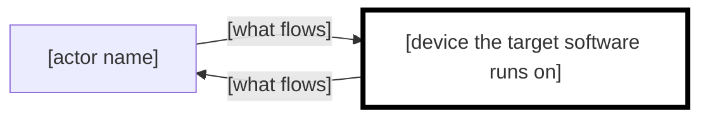
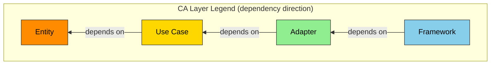

# [Project Name] Specification

**Grammar**: spec-anms.sgra
**UID**: DOC-SPEC
**Version**: 0.1

## Chapter 1. Foundation

### 1.1 Background

**Type**: SECTION

[State why this software is needed and what the domain looks like today]

### 1.2 Challenges

**Type**: SECTION

[State the concrete problems with the way things are now]

### 1.3 Goals

#### [Name one state to be reached, as a functional goal]

**Type**: GOAL
**UID**: GL-001

**STATEMENT**: [State in one sentence who becomes able to do what]

#### [Name one state to be reached, as a quality goal]

**Type**: GOAL
**UID**: GL-002

**STATEMENT**: [State in one sentence what must hold for speed, safety or availability]

### 1.4 Approach

**Type**: SECTION

[State the technology stack and the architectural direction]

### 1.5 Scope

**Type**: SECTION

| Division     | Content                           |
| ------------ | --------------------------------- |
| In-scope     | [State what this project will do] |
| Out-of-scope | [State what it will not do]       |

### 1.6 Constraints

**Type**: SECTION

[State the constraints that cannot be broken: technical, legal, ethical, patent]

### 1.7 Limitations

**Type**: SECTION

[State the known compromises that fall short of the requirements but are acceptable]

### 1.8 Glossary

**Type**: SECTION

| Term                              | Definition   |
| --------------------------------- | ------------ |
| [A term specific to this project] | [Definition] |
| [A second term]                   | [Definition] |

### 1.9 Notation

**Type**: SECTION

This document follows RFC 2119 and RFC 8174. SHALL and MUST are mandatory, SHOULD is recommended, MAY is optional. A keyword is normative only when it appears in uppercase.

**Exception:** the lowercase `shall` inside EARS syntax carries the same force as an uppercase SHALL in this document.

**Style:** a descriptive sentence never omits its subject or the object of a transitive verb. An instructional sentence (the "do X (MUST)" form) is exempt.

**Diagrams:** a large diagram goes into `_assets/fig-<name>.md` and is referenced from the body. Record any change to the thresholds here.

## Chapter 2. System Overview

### 2.1 Overview Diagram

**Type**: SECTION

**Overview of the configuration:**



Draw the device the target software runs on with a thick border. Use no colour. Label every line with what flows along it.

### 2.2 Devices

**Type**: SECTION

| Device            | Kind   | Runs the target software | Supply           | Can we change it |
| ----------------- | ------ | ------------------------ | ---------------- | ---------------- |
| [device name]     | [kind] | [yes / no]               | [existing / new] | [yes / no]       |
| [a second device] | [kind] | [yes / no]               | [existing / new] | [yes / no]       |

### 2.3 Routes

**Type**: SECTION

| from          | to            | What it carries   | Method   | Trustworthy as input             |
| ------------- | ------------- | ----------------- | -------- | -------------------------------- |
| [origin]      | [destination] | [what it carries] | [method] | [not trustworthy]                |
| [destination] | [origin]      | [what it carries] | [method] | [not applicable (outbound only)] |

### 2.4 Exclusions

**Type**: SECTION

| Not present                               | Reason             |
| ----------------------------------------- | ------------------ |
| [what the configuration does not include] | [why it is absent] |
| [a second thing not present]              | [why it is absent] |

## Chapter 3. Use Cases

### 3.1 Actors

**Type**: SECTION

| Actor            | Actor kind      | Corresponding device | Interest                   |
| ---------------- | --------------- | -------------------- | -------------------------- |
| [actor name]     | person          | not applicable       | [what they want to obtain] |
| [a second actor] | external system | [device name]        | [what it wants to obtain]  |

### 3.2 Use Cases

#### [Name the actor's goal as a verb phrase]

**Type**: USE_CASE
**UID**: UC-001

**STATEMENT**: [State in one sentence what the actor presents and what the system returns]

**SCENARIO**:

1. [State in one sentence what the actor does]
2. [State in one sentence what the system does]
3. [State in one sentence what the system does]

**EXTENSIONS**:

- 2a. [State the condition that departs from the main success scenario]
  - [State what the system does then]

**Relations**:

- **Type**: `Parent`
  **ID**: `GL-001`
  **Role**: `Satisfies`

#### [A second use case]

**Type**: USE_CASE
**UID**: UC-002

**STATEMENT**: [One sentence]

**SCENARIO**:

1. [step 1]
2. [step 2]
3. [step 3]

**EXTENSIONS**:

- 2a. [condition]
  - [what the system does]

**Relations**:

- **Type**: `Parent`
  **ID**: `GL-001`
  **Role**: `Satisfies`

## Chapter 4. Requirements

### 4.1 Functional Requirements

#### [Name one behaviour of the system]

**Type**: FUNC_REQ
**UID**: FR-001

**STATEMENT**: [Write one EARS sentence. Put the condition before the subject and end with "shall"]

**ORIGIN**: [State which scenario step or extension this came from]

**RATIONALE**: [State why this requirement is needed]

**Relations**:

- **Type**: `Parent`
  **ID**: `UC-001`
  **Role**: `Satisfies`

#### [A second functional requirement]

**Type**: FUNC_REQ
**UID**: FR-002

**STATEMENT**: [One EARS sentence]

**ORIGIN**: [where it came from]

**RATIONALE**: [why it is needed]

**Relations**:

- **Type**: `Parent`
  **ID**: `UC-002`
  **Role**: `Satisfies`

### 4.2 Non-Functional Requirements

#### [Name one quality requirement]

**Type**: NON_FUNC_REQ
**UID**: NFR-001

**STATEMENT**: [Write one EARS sentence containing a measurable numeric criterion]

**RATIONALE**: [Name the route or device this bears on]

**Relations**:

- **Type**: `Parent`
  **ID**: `GL-002`
  **Role**: `Satisfies`

#### [A second non-functional requirement]

**Type**: NON_FUNC_REQ
**UID**: NFR-002

**STATEMENT**: [One EARS sentence with a numeric criterion]

**RATIONALE**: [what it bears on]

**Relations**:

- **Type**: `Parent`
  **ID**: `GL-001`
  **Role**: `Satisfies`

### 4.3 Reduction Candidates

**Type**: SECTION

| Target ID            | Why it has no parent | What happens if it is dropped | User's decision |
| -------------------- | -------------------- | ----------------------------- | --------------- |
| [UID / none]         | [reason]             | [one line]                    | [keep / drop]   |
| [a second target ID] | [reason]             | [one line]                    | [keep / drop]   |

## Chapter 5. Design

### 5.1 Architecture Concept

**Type**: SECTION

**Layer legend:**



[Name the architecture adopted. Replace this legend here if it is not Clean Architecture]

### 5.2 Components

**Type**: SECTION

[Divide the parts and their responsibilities in a component diagram. State which device from Chapter 2.2 each component runs on]

### 5.3 File Structure

**Type**: SECTION

[State the directory layout and how components map onto folders. Declare each component's public surface]

### 5.4 Domain Model

**Type**: SECTION

[State the concepts and their relationships. Draw a class diagram if more than one type has structure, an ER diagram if there is a persistent store]

### 5.5 Behavior

**Type**: SECTION

[State the processing flow and the interactions. Draw a state diagram if state persists, a sequence diagram if several components interact]

### 5.6 Decisions

**Type**: SECTION

**ADR-000 Comparison against the minimal configuration:**

| Item         | Content                                                            |
| ------------ | ------------------------------------------------------------------ |
| Context      | [State the smallest configuration that satisfies the requirements] |
| Decision     | [State what the adopted proposal adds to it]                       |
| Status       | [Proposed / Accepted / Superseded]                                 |
| Consequences | [State why each addition was made and what it costs]               |

**ADR-001 [A second decision]:**

| Item         | Content                            |
| ------------ | ---------------------------------- |
| Context      | [background]                       |
| Decision     | [what was decided]                 |
| Status       | [Proposed / Accepted / Superseded] |
| Consequences | [outcome and cost]                 |

**Diagrams not drawn:** [Name the diagram kind and give a one-line reason. Write "none" if there are none]

## Chapter 6. Software Specification

### 6.1 Software Specifications

#### [Name one implementable statement]

**Type**: SW_SPEC
**UID**: SWS-001

**STATEMENT**: [Write one EARS sentence. State the means: codes, state transitions, boundary values]

**RATIONALE**: [State which route or condition this makes concrete for the parent requirement]

**Relations**:

- **Type**: `Parent`
  **ID**: `FR-001`
  **Role**: `Satisfies`

#### [A second software specification]

**Type**: SW_SPEC
**UID**: SWS-002

**STATEMENT**: [One EARS sentence]

**RATIONALE**: [what it makes concrete]

**Relations**:

- **Type**: `Parent`
  **ID**: `FR-002`
  **Role**: `Satisfies`

### 6.2 Data Schema

**Type**: SECTION

**[Name of the schema]:**

```json
{
  "$schema": "https://json-schema.org/draft/2020-12/schema",
  "title": "[name]",
  "type": "object",
  "required": [],
  "properties": {},
  "additionalProperties": false
}
```

[Write "none" if there is no persistent store, matching Chapter 2.4]

## Chapter 7. Test Strategy

**Type**: SECTION

| Family                       | Test level              | Policy   | Tool / framework | Pass criterion       |
| ---------------------------- | ----------------------- | -------- | ---------------- | -------------------- |
| Use case tests               | — (the family has none) | [policy] | [tool]           | every `UC` passes    |
| Software specification tests | `Unit`                  | [policy] | [tool]           | [pass rate]          |
| Software specification tests | `Integration`           | [policy] | [tool]           | [pass rate]          |
| Non-functional tests         | — (the family has none) | [policy] | [tool]           | every NFR target met |

[Name the route from Chapter 2.3 that a verification crossing devices actually goes through]

## Chapter 8. Design Principles Compliance

**Type**: SECTION

| Category       | Identifier           | What is checked                                                              | Verdict       | Evidence   |
| -------------- | -------------------- | ---------------------------------------------------------------------------- | ------------- | ---------- |
| Naming         | Naming               | Does the name convey intent, and does it match the vocabulary of Chapter 1.8 | [PASS / FAIL] | [evidence] |
| Dependency     | Dependency Direction | Does the dependency direction follow the layers of Chapter 5.1               | [PASS / FAIL] | [evidence] |
| Simplicity     | KISS                 | Is the simplest working solution the one chosen                              | [PASS / FAIL] | [evidence] |
| Responsibility | SRP                  | Does each class or unit hold a single responsibility                         | [PASS / FAIL] | [evidence] |
| SOLID          | DIP                  | Does the code depend on abstractions rather than concretions                 | [PASS / FAIL] | [evidence] |
| Concurrency    | Concurrency Safety   | Can a deadlock, a race or a glitch occur                                     | [PASS / FAIL] | [evidence] |

[Add or remove principles according to the nature of the project]

## Chapter 9. Use Case Tests

### 9.1 Test Cases

#### [Name one thing to be verified]

**Type**: USE_CASE_TEST
**UID**: TC-001

**GIVEN**: [State the precondition as a complete sentence]

**WHEN**: [State the trigger as a complete sentence]

**THEN**: [State the observable outcome as a complete sentence]

**Relations**:

- **Type**: `Parent`
  **ID**: `UC-001`
  **Role**: `Verifies`
- **Type**: `File`
  **Path**: `[location of the test code]`

#### [A second test case]

**Type**: USE_CASE_TEST
**UID**: TC-002

**GIVEN**: [precondition]

**WHEN**: [trigger]

**THEN**: [outcome]

**Relations**:

- **Type**: `Parent`
  **ID**: `UC-002`
  **Role**: `Verifies`
- **Type**: `File`
  **Path**: `[location of the test code]`

### 9.2 Test Results

#### [PASS] [Name of the corresponding test case]

**Type**: TEST_RESULT
**UID**: TR-001
**RESULT**: PASS

**EVIDENCE**: [Give a log location, run id or artefact path that can be retrieved later]

**Relations**:

- **Type**: `Parent`
  **ID**: `TC-001`
  **Role**: `ResultOf`

#### [PASS] [A second test result]

**Type**: TEST_RESULT
**UID**: TR-002
**RESULT**: PASS

**EVIDENCE**: [retrievable location]

**Relations**:

- **Type**: `Parent`
  **ID**: `TC-002`
  **Role**: `ResultOf`

## Chapter 10. Software Specification Tests

### 10.1 Test Cases

#### [Name one thing to be verified]

**Type**: SW_SPEC_TEST
**UID**: TC-003
**TEST_LEVEL**: Unit

**GIVEN**: [State the precondition as a complete sentence]

**WHEN**: [State the trigger as a complete sentence]

**THEN**: [State the observable outcome as a complete sentence]

**Relations**:

- **Type**: `Parent`
  **ID**: `SWS-001`
  **Role**: `Verifies`
- **Type**: `File`
  **Path**: `[location of the test code]`

#### [A second test case]

**Type**: SW_SPEC_TEST
**UID**: TC-004
**TEST_LEVEL**: Integration

**GIVEN**: [precondition]

**WHEN**: [trigger]

**THEN**: [outcome]

**Relations**:

- **Type**: `Parent`
  **ID**: `SWS-002`
  **Role**: `Verifies`
- **Type**: `File`
  **Path**: `[location of the test code]`

### 10.2 Test Results

#### [PASS] [Name of the corresponding test case]

**Type**: TEST_RESULT
**UID**: TR-003
**RESULT**: PASS

**EVIDENCE**: [Give a log location, run id or artefact path that can be retrieved later]

**Relations**:

- **Type**: `Parent`
  **ID**: `TC-003`
  **Role**: `ResultOf`

#### [PASS] [A second test result]

**Type**: TEST_RESULT
**UID**: TR-004
**RESULT**: PASS

**EVIDENCE**: [retrievable location]

**Relations**:

- **Type**: `Parent`
  **ID**: `TC-004`
  **Role**: `ResultOf`

## Chapter 11. Non-Functional Tests

### 11.1 Test Cases

#### [Name one thing to be verified]

**Type**: NON_FUNC_TEST
**UID**: TC-005

**GIVEN**: [State the measurement method and the load condition as a complete sentence]

**WHEN**: [State the trigger as a complete sentence]

**THEN**: [State the outcome as a complete sentence, with the same number as the parent NON_FUNC_REQ]

**Relations**:

- **Type**: `Parent`
  **ID**: `NFR-001`
  **Role**: `Verifies`
- **Type**: `File`
  **Path**: `[location of the test code]`

#### [A second test case]

**Type**: NON_FUNC_TEST
**UID**: TC-006

**GIVEN**: [measurement method and load condition]

**WHEN**: [trigger]

**THEN**: [outcome with the number]

**Relations**:

- **Type**: `Parent`
  **ID**: `NFR-002`
  **Role**: `Verifies`
- **Type**: `File`
  **Path**: `[location of the test code]`

### 11.2 Test Results

#### [PASS] [Name of the corresponding test case]

**Type**: TEST_RESULT
**UID**: TR-005
**RESULT**: PASS

**EVIDENCE**: [Give a log location, run id or artefact path that can be retrieved later]

**Relations**:

- **Type**: `Parent`
  **ID**: `TC-005`
  **Role**: `ResultOf`

#### [PASS] [A second test result]

**Type**: TEST_RESULT
**UID**: TR-006
**RESULT**: PASS

**EVIDENCE**: [retrievable location]

**Relations**:

- **Type**: `Parent`
  **ID**: `TC-006`
  **Role**: `ResultOf`

## Appendix

### A.1 References

**Type**: SECTION

[List the standards and external material this document links to]

### A.2 Licenses

**Type**: SECTION

[List the licences of the dependencies]

### A.3 Changelog

**Type**: SECTION

| Version | Date         | Change         |
| ------- | ------------ | -------------- |
| 0.1     | [YYYY-MM-DD] | [first issue]  |
| 0.2     | [YYYY-MM-DD] | [second issue] |
