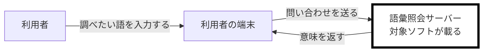
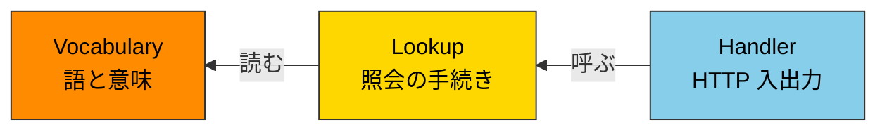

# 語彙照会サービス 仕様書

**Grammar**: spec-anms.sgra
**UID**: DOC-SPEC
**Version**: 0.1.0

## Chapter 1. Foundation (基本事項)

### 1.1 Background (背景)

**Type**: SECTION

利用者は、文章を書いている途中で語の意味を確かめたくなる。現在は別の辞書サイトを開いて調べており、書きかけの画面から離れる必要がある。

### 1.2 Challenges (課題)

**Type**: SECTION

調べるたびに作業が中断する。中断のたびに、書こうとしていた内容を思い出し直す時間がかかる。

### 1.3 Goals (目標)

#### 調べるために作業を中断しない

**Type**: GOAL
**UID**: GL-001

**STATEMENT**: 利用者が、 知りたい語の意味を調べるために、 進行中の作業を中断しない。

#### 渡した値でシステムが壊れない

**Type**: GOAL
**UID**: GL-002

**STATEMENT**: 利用者が渡した値によって、 システムが停止したり、 意図しない動作をしたりしない。

### 1.4 Approach (解決方針)

**Type**: SECTION

単一の HTTP エンドポイントを持つサービスとして作る。語を受け取り、あらかじめ用意した語彙集から意味を返す。永続ストアを持たない。

### 1.5 Scope (範囲)

**Type**: SECTION

**やること:** 語の意味を返す。扱える語の一覧を返す。

**やらないこと:** 語の追加・編集。利用者の識別。検索履歴の保存。

### 1.6 Constraints (制約事項)

**Type**: SECTION

語彙集は起動時に読み込む静的ファイルとし、実行中に変更しない。

### 1.7 Limitations (制限事項)

**Type**: SECTION

語彙集に無い語は答えられない。表記ゆれの吸収も行わない。

### 1.8 Glossary (用語集)

**Type**: SECTION

**語:** 語彙集の見出しに現れる文字列。英小文字のみで構成する。

**語彙集:** 語と意味の対を集めた静的ファイル。

### 1.9 Notation (表記規約)

**Type**: SECTION

RFC 2119 / 8174 に従う。大文字の MUST / MUST NOT / SHOULD を規範語とする。EARS 構文中の小文字 `shall` は `SHALL` と同じ拘束力を持つ。これは本文書が置く明示の例外である。

記述文では主語と目的語を省略しない。指示文（「〜する（MUST）」の形）の主語は読み手であり、省略してよい。

図が大きい場合は `_assets/` へ出す。本書の図はいずれも閾値未満のため本文に置く。

## Chapter 2. System Overview (システム概要)

**Type**: SECTION

本章は機器にも経路にも UID を振らない。後続の章は名前で参照する。

### 2.1 Overview Diagram (概要図)

**Type**: SECTION

**概要図:**



対象ソフトが載る機器を太枠で示す。

### 2.2 Devices (機器)

**Type**: SECTION

| 機器             | 種別     | 対象ソフトが載るか | 供給元 | こちらで変えられるか           |
| ---------------- | -------- | ------------------ | ------ | ------------------------------ |
| 利用者の端末     | 汎用端末 | 載らない           | 既存   | 変えられない（利用者の所有物） |
| 語彙照会サーバー | サーバー | **載る**           | 新規   | 変えられる                     |

### 2.3 Routes (経路)

**Type**: SECTION

| from             | to               | 運ぶもの                   | 方式  | 入力として信頼できるか                     |
| ---------------- | ---------------- | -------------------------- | ----- | ------------------------------------------ |
| 利用者の端末     | 語彙照会サーバー | 調べたい語                 | HTTPS | **信頼できない**（利用者が組み立てて送る） |
| 語彙照会サーバー | 利用者の端末     | 意味、または該当なしの通知 | HTTPS | 該当なし（送信のみ）                       |

### 2.4 Exclusions (持たないもの)

**Type**: SECTION

| 持たないもの | 理由                                   |
| ------------ | -------------------------------------- |
| 認証境界     | 利用者を区別しない（1.5 の範囲による） |
| 永続ストア   | 問い合わせも結果も残さない             |
| 外部 API     | 実行時に他のサービスを呼ばない         |

## Chapter 3. Use Cases (ユースケース)

### 3.1 Actors (アクター)

**Type**: SECTION

| アクター | アクター種別 | 対応する機器 | 関心                                 |
| -------- | ------------ | ------------ | ------------------------------------ |
| 利用者   | 人           | 該当なし     | 語の意味を、書く手を止めずに知りたい |

### 3.2 Use Cases (ユースケース)

#### 語の意味を問い合わせる

**Type**: USE_CASE
**UID**: UC-001

**STATEMENT**: 利用者が、 調べたい語を示し、 システムが、 その意味を返す。

**SCENARIO**:

1. 利用者が、 調べたい語をシステムに示す。
2. システムが、 示された語の形を検証する。
3. システムが、 語彙集から意味を引く。
4. システムが、 意味を利用者に返す。

**EXTENSIONS**:

- 2a. 示された語が扱える形でない。
  - システムは、 語彙集を引かず、 形が違うことを利用者に伝える。
- 3a. 語彙集に該当が無い。
  - システムは、 該当が無いことを利用者に示す。

**Relations**:
- **Type**: `Parent`
  **ID**: `GL-001`
  **Role**: `Satisfies`

## Chapter 4. Requirements (要求)

### 4.1 Functional Requirements (機能要求)

#### 意味を返す

**Type**: FUNC_REQ
**UID**: FR-001

**STATEMENT**: 語彙集に該当があるとき、 システムは、 その意味を利用者に返すこと。

**Relations**:
- **Type**: `Parent`
  **ID**: `UC-001`
  **Role**: `Satisfies`

#### 該当が無いことを示す

**Type**: FUNC_REQ
**UID**: FR-002

**STATEMENT**: もし語彙集に該当が 1 件も無いならば、 システムは、 該当が無いことを利用者に示すこと。

**ORIGIN**: UC-001 の拡張 `3a`

**Relations**:
- **Type**: `Parent`
  **ID**: `UC-001`
  **Role**: `Satisfies`

#### 扱えない形を退ける

**Type**: FUNC_REQ
**UID**: FR-003

**STATEMENT**: もし示された語が扱える形でないならば、 システムは、 語彙集を引かず、 形が違うことを利用者に伝えること。

**ORIGIN**: UC-001 の拡張 `2a`

**Relations**:
- **Type**: `Parent`
  **ID**: `UC-001`
  **Role**: `Satisfies`

### 4.2 Non-Functional Requirements (非機能要求)

#### 待たせない

**Type**: NON_FUNC_REQ
**UID**: NFR-001

**STATEMENT**: システムは、 問い合わせを受け取ってから 500 ms 以内に応答を返すこと。

**Relations**:
- **Type**: `Parent`
  **ID**: `GL-001`
  **Role**: `Satisfies`

#### 受け取った値を検証する

**Type**: NON_FUNC_REQ
**UID**: NFR-002

**STATEMENT**: システムは、 信頼できない経路から受け取った値を、 受け付ける集合との照合によって検証すること。

**Relations**:
- **Type**: `Parent`
  **ID**: `GL-002`
  **Role**: `Satisfies`

### 4.3 Reduction Candidates (削減候補)

**Type**: SECTION

候補なし。すべてのノードが `GL-001` または `GL-002` に辿り着く。

## Chapter 5. Design (設計)

**Type**: SECTION

本章は ADR を除きノードを持たない。

### 5.1 Architecture Concept (アーキテクチャ方式)

**Type**: SECTION

Clean Architecture の 4 層を採る。層の凡例は spec-template の既定に従う。

### 5.2 Components (コンポーネント)

**Type**: SECTION

**コンポーネント図:**



3 つのコンポーネントはすべて語彙照会サーバーに載る。

### 5.3 File Structure (ファイル構成)

**Type**: SECTION

`src/handler/` / `src/lookup/` / `src/vocabulary/`。各コンポーネントの公開面はディレクトリ直下の 1 ファイルに限る。

### 5.4 Domain Model (ドメインモデル)

**Type**: SECTION

| 概念 | 持つもの | 関係                             |
| ---- | -------- | -------------------------------- |
| 語   | 文字列   | 語彙集に 0 個または 1 個含まれる |
| 意味 | 文字列   | 語に 1 個従属する                |

クラス図は、構造を持つ型が 2 つしかないため省いた。

### 5.5 Behavior (振る舞い)

**Type**: SECTION

持続する状態を持たないため、状態遷移図は該当なし。コンポーネント間の相互作用は 5.2 の図で足りる。

### 5.6 Decisions (設計判断)

#### ADR-000 最小構成との比較

**Type**: SECTION

要求を満たす最小の構成は、語彙集を読み込んで照会する 1 ファイルのプログラムである。採用案はこれを 3 コンポーネントに分けた。分けた理由は、語彙集の読み込み方（静的ファイル）が後で変わりうるのに対し、照会の手続きは変わらないためである。

#### ADR-001 永続ストアを持たない

**Type**: SECTION

語彙集は起動時に読み込む静的ファイルとする。実行中の変更を要求していないため、データベースを置く理由が無い。省いた図（ER 図・状態遷移図）はこの判断の帰結である。

## Chapter 6. Software Specification (ソフトウェア仕様)

### 6.1 Software Specifications (ソフトウェア仕様)

#### 語の形を検証する

**Type**: SW_SPEC
**UID**: SWS-001

**STATEMENT**: もし `word` が英小文字 1 文字以上 32 文字以下に一致しないならば、 システムは、 HTTP 400 と符号 `invalid_word` を返すこと。

**Relations**:
- **Type**: `Parent`
  **ID**: `NFR-002`
  **Role**: `Satisfies`

#### 該当が無いときの応答

**Type**: SW_SPEC
**UID**: SWS-002

**STATEMENT**: もし語彙集に `word` が無いならば、 システムは、 HTTP 404 と符号 `not_found` を返すこと。

**Relations**:
- **Type**: `Parent`
  **ID**: `FR-002`
  **Role**: `Satisfies`

#### 該当があるときの応答

**Type**: SW_SPEC
**UID**: SWS-003

**STATEMENT**: 語彙集に `word` があるとき、 システムは、 HTTP 200 と `meaning` を含む本体を返すこと。

**Relations**:
- **Type**: `Parent`
  **ID**: `FR-001`
  **Role**: `Satisfies`

### 6.2 Data Schema (データスキーマ)

**Type**: SECTION

**問い合わせの構造:**

```json
{
  "$schema": "https://json-schema.org/draft/2020-12/schema",
  "title": "QueryRequest",
  "type": "object",
  "required": ["word"],
  "properties": {
    "word": { "type": "string", "pattern": "^[a-z]{1,32}$" }
  },
  "additionalProperties": false
}
```

この資料は語の形を機械可読に持つ。形から外れたときに何を返すかは `SWS-001` の言明が持つ。

## Chapter 7. Test Strategy (テスト戦略)

**Type**: SECTION

| 系統                   |  章  | 検証する対象   | ツール         | 合格基準             |
| ---------------------- | :--: | -------------- | -------------- | -------------------- |
| ユースケーステスト     | Ch9  | Ch3.2 の `UC`  | pytest + httpx | 全 `UC` PASS         |
| ソフトウェア仕様テスト | Ch10 | Ch6.1 の `SWS` | pytest         | 全 `SWS` PASS        |
| 非機能テスト           | Ch11 | Ch4.2 の `NFR` | pytest + time  | NFR の数値目標を達成 |

`FR` を直接検証するテストは置かない。配下の `SWS` がすべて覆われたときに覆われたとみなす。

## Chapter 8. Design Principles Compliance (設計原則 準拠確認)

**Type**: SECTION

| カテゴリ | 識別名               | 確認結果                                           |
| -------- | -------------------- | -------------------------------------------------- |
| 命名     | Naming               | 語・意味・語彙集は 1.8 の定義と一致する            |
| 依存関係 | Dependency Direction | Handler → Lookup → Vocabulary。内向きのみ          |
| 簡潔性   | KISS                 | 照会は語彙集の 1 回の参照で完結する                |
| 簡潔性   | Minimal Comparison   | ADR-000 で最小構成と比較した                       |
| 責務分離 | SRP                  | 各コンポーネントは 1 つの責務を持つ                |
| 純粋性   | Pure                 | Lookup は純粋関数。読み込みは Handler の側に寄せた |
| エラー   | Error Propagation    | 検証の失敗は符号として呼び出し元へ返す             |

## Chapter 9. Use Case Tests (ユースケーステスト)

### 9.1 Test Cases (テストケース)

#### 語彙集にある語を問い合わせる

**Type**: USE_CASE_TEST
**UID**: TC-001

**GIVEN**: 語彙集に `apple` がある。

**WHEN**: 利用者が `apple` を問い合わせる。

**THEN**: システムが、 `apple` の意味を利用者に返す。

**Relations**:
- **Type**: `Parent`
  **ID**: `UC-001`
  **Role**: `Verifies`
- **Type**: `File`
  **Path**: `tests/test_usecase.py`

#### 語彙集に無い語を問い合わせる

**Type**: USE_CASE_TEST
**UID**: TC-002

**GIVEN**: 語彙集に `zzzz` が無い。

**WHEN**: 利用者が `zzzz` を問い合わせる。

**THEN**: システムが、 該当が無いことを利用者に示す。

**Relations**:
- **Type**: `Parent`
  **ID**: `UC-001`
  **Role**: `Verifies`
- **Type**: `File`
  **Path**: `tests/test_usecase.py`

### 9.2 Test Results (テスト結果)

#### [PASS] 語彙集にある語を問い合わせる

**Type**: TEST_RESULT
**UID**: TR-001
**RESULT**: PASS

**EVIDENCE**: out/junit.xml#test_usecase::test_hit

**Relations**:
- **Type**: `Parent`
  **ID**: `TC-001`
  **Role**: `ResultOf`

#### [PASS] 語彙集に無い語を問い合わせる

**Type**: TEST_RESULT
**UID**: TR-002
**RESULT**: PASS

**EVIDENCE**: out/junit.xml#test_usecase::test_miss

**Relations**:
- **Type**: `Parent`
  **ID**: `TC-002`
  **Role**: `ResultOf`

## Chapter 10. Software Specification Tests (ソフトウェア仕様テスト)

### 10.1 Test Cases (テストケース)

#### 扱えない形を渡すと符号を返す

**Type**: SW_SPEC_TEST
**UID**: TC-003

**GIVEN**: 英小文字以外を含む語 `Apple1` がある。

**WHEN**: 利用者が `Apple1` を問い合わせる。

**THEN**: システムが、 HTTP 400 と符号 `invalid_word` を返す。

**Relations**:
- **Type**: `Parent`
  **ID**: `SWS-001`
  **Role**: `Verifies`
- **Type**: `File`
  **Path**: `tests/test_spec.py`

#### 該当が無いと 404 を返す

**Type**: SW_SPEC_TEST
**UID**: TC-004

**GIVEN**: 語彙集に `zzzz` が無い。

**WHEN**: 利用者が `zzzz` を問い合わせる。

**THEN**: システムが、 HTTP 404 と符号 `not_found` を返す。

**Relations**:
- **Type**: `Parent`
  **ID**: `SWS-002`
  **Role**: `Verifies`
- **Type**: `File`
  **Path**: `tests/test_spec.py`

#### 該当があると 200 を返す

**Type**: SW_SPEC_TEST
**UID**: TC-005

**GIVEN**: 語彙集に `apple` がある。

**WHEN**: 利用者が `apple` を問い合わせる。

**THEN**: システムが、 HTTP 200 と `meaning` を含む本体を返す。

**Relations**:
- **Type**: `Parent`
  **ID**: `SWS-003`
  **Role**: `Verifies`
- **Type**: `File`
  **Path**: `tests/test_spec.py`

### 10.2 Test Results (テスト結果)

#### [PASS] 扱えない形を渡すと符号を返す

**Type**: TEST_RESULT
**UID**: TR-003
**RESULT**: PASS

**EVIDENCE**: out/junit.xml#test_spec::test_invalid_word

**Relations**:
- **Type**: `Parent`
  **ID**: `TC-003`
  **Role**: `ResultOf`

#### [PASS] 該当が無いと 404 を返す

**Type**: TEST_RESULT
**UID**: TR-004
**RESULT**: PASS

**EVIDENCE**: out/junit.xml#test_spec::test_not_found

**Relations**:
- **Type**: `Parent`
  **ID**: `TC-004`
  **Role**: `ResultOf`

#### [PASS] 該当があると 200 を返す

**Type**: TEST_RESULT
**UID**: TR-005
**RESULT**: PASS

**EVIDENCE**: out/junit.xml#test_spec::test_hit

**Relations**:
- **Type**: `Parent`
  **ID**: `TC-005`
  **Role**: `ResultOf`

## Chapter 11. Non-Functional Tests (非機能テスト)

### 11.1 Test Cases (テストケース)

#### 500 ms 以内に応答が返る

**Type**: NON_FUNC_TEST
**UID**: TC-006

**GIVEN**: 語彙集を読み込んだシステムが起動している。

**WHEN**: 利用者が問い合わせを 100 回送る。

**THEN**: システムが、 95 パーセンタイルで 500 ms 以内に応答を返す。

**Relations**:
- **Type**: `Parent`
  **ID**: `NFR-001`
  **Role**: `Verifies`
- **Type**: `File`
  **Path**: `tests/test_perf.py`

#### 受け取った値を集合と照合する

**Type**: NON_FUNC_TEST
**UID**: TC-007

**GIVEN**: 受け付ける集合から外れた値を 20 種類用意した。

**WHEN**: 利用者がそれぞれを問い合わせる。

**THEN**: システムが、 20 種類すべてを受け付けず、 停止しない。

**Relations**:
- **Type**: `Parent`
  **ID**: `NFR-002`
  **Role**: `Verifies`
- **Type**: `File`
  **Path**: `tests/test_perf.py`

### 11.2 Test Results (テスト結果)

#### [PASS] 500 ms 以内に応答が返る

**Type**: TEST_RESULT
**UID**: TR-006
**RESULT**: PASS

**EVIDENCE**: out/junit.xml#test_perf::test_latency

**Relations**:
- **Type**: `Parent`
  **ID**: `TC-006`
  **Role**: `ResultOf`

#### [PASS] 受け取った値を集合と照合する

**Type**: TEST_RESULT
**UID**: TR-007
**RESULT**: PASS

**EVIDENCE**: out/junit.xml#test_perf::test_validation

**Relations**:
- **Type**: `Parent`
  **ID**: `TC-007`
  **Role**: `ResultOf`

