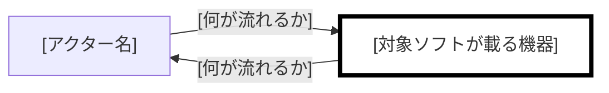
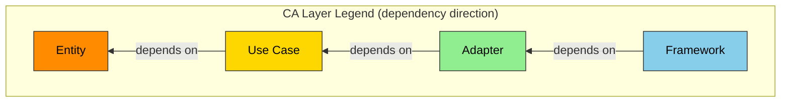

# [プロジェクト名] 仕様書

**Grammar**: spec-anms.sgra
**UID**: DOC-SPEC
**Version**: 0.1

## Chapter 1. Foundation (基本事項)

### 1.1 Background (背景)

**Type**: SECTION

[なぜこのソフトウェアが必要か、ドメインの現状を記入する]

### 1.2 Challenges (課題)

**Type**: SECTION

[現状の具体的な問題点を記入する]

### 1.3 Goals (目標)

#### [達成すべき状態を 1 つ、機能の目標として記入する]

**Type**: GOAL
**UID**: GL-001

**STATEMENT**: [誰が、何をできる状態になるかを 1 文で記入する]

#### [達成すべき状態を 1 つ、品質の目標として記入する]

**Type**: GOAL
**UID**: GL-002

**STATEMENT**: [速さ・安全・可用性のいずれかについて、達成すべき状態を 1 文で記入する]

### 1.4 Approach (解決方針)

**Type**: SECTION

[技術スタックとアーキテクチャ方針を記入する]

### 1.5 Scope (範囲)

**Type**: SECTION

| 区分         | 内容                                 |
| ------------ | ------------------------------------ |
| In-scope     | [本プロジェクトでやることを記入する] |
| Out-of-scope | [やらないことを記入する]             |

### 1.6 Constraints (制約事項)

**Type**: SECTION

[技術・法規・倫理・特許等、絶対に破れない制約を記入する]

### 1.7 Limitations (制限事項)

**Type**: SECTION

[要求を完全には満たさないが許容可能な既知の妥協点を記入する]

### 1.8 Glossary (用語集)

**Type**: SECTION

| 用語                     | 定義   |
| ------------------------ | ------ |
| [プロジェクト固有の用語] | [定義] |

### 1.9 Notation (表記規約)

**Type**: SECTION

本書は RFC 2119 / RFC 8174 に従う。SHALL / MUST は必須、SHOULD は推奨、MAY は任意を表す。規範語として扱うのは大文字で書かれた場合に限る。

**例外:** EARS 構文中の小文字 `shall` は、本書では大文字の SHALL と同じ拘束力を持つものとする。

**文体:** 記述文では主語と他動詞の目的語を省略しない。指示文（「〜する（MUST）」の形）はこの限りでない。

**図:** 大きな図は `_assets/fig-<name>.md` へ出して本文から参照する。判定の閾値を変更した場合はここに記す。

## Chapter 2. System Overview (システム概要)

### 2.1 Overview Diagram (概要図)

**Type**: SECTION

**構成の概要:**



対象ソフトが載る機器を太枠で示す。色は使わない。線のラベルには何が流れるかを書く。

### 2.2 Devices (機器)

**Type**: SECTION

| 機器     | 種別   | 対象ソフトが載るか | 供給元        | こちらで変えられるか        |
| -------- | ------ | ------------------ | ------------- | --------------------------- |
| [機器名] | [種別] | [載る / 載らない]  | [既存 / 新規] | [変えられる / 変えられない] |

### 2.3 Routes (経路)

**Type**: SECTION

| from   | to     | 運ぶもの   | 方式   | 入力として信頼できるか                |
| ------ | ------ | ---------- | ------ | ------------------------------------- |
| [起点] | [終点] | [運ぶもの] | [方式] | [信頼できない / 該当なし（送信のみ）] |

### 2.4 Exclusions (持たないもの)

**Type**: SECTION

| 持たないもの           | 理由             |
| ---------------------- | ---------------- |
| [構成に含まれないもの] | [なぜ持たないか] |

## Chapter 3. Use Cases (ユースケース)

### 3.1 Actors (アクター)

**Type**: SECTION

| アクター     | アクター種別        | 対応する機器        | 関心           |
| ------------ | ------------------- | ------------------- | -------------- |
| [アクター名] | [人 / 外部システム] | [機器名 / 該当なし] | [何を得たいか] |

### 3.2 Use Cases (ユースケース)

#### [アクターの目標を動詞句で記入する]

**Type**: USE_CASE
**UID**: UC-001

**STATEMENT**: [アクターが何を示し、システムが何を返すかを 1 文で記入する]

**SCENARIO**:

1. [アクターがすることを 1 文で記入する]
2. [システムがすることを 1 文で記入する]
3. [システムがすることを 1 文で記入する]

**EXTENSIONS**:

- 2a. [主成功シナリオから外れる条件を記入する]
  - [そのときシステムがすることを記入する]

**Relations**:

- **Type**: `Parent`
  **ID**: `GL-001`
  **Role**: `Satisfies`

## Chapter 4. Requirements (要求)

### 4.1 Functional Requirements (機能要求)

#### [システムの振る舞いを 1 つ、名前として記入する]

**Type**: FUNC_REQ
**UID**: FR-001

**STATEMENT**: [EARS 1 文で記入する。条件を主語より先に置き、「〜すること。」で終える]

**ORIGIN**: [どの手順または拡張から来たかを記入する]

**RATIONALE**: [なぜこの要求が要るのかを記入する]

**Relations**:

- **Type**: `Parent`
  **ID**: `UC-001`
  **Role**: `Satisfies`

### 4.2 Non-Functional Requirements (非機能要求)

#### [品質の要求を 1 つ、名前として記入する]

**Type**: NON_FUNC_REQ
**UID**: NFR-001

**STATEMENT**: [測定可能な数値基準を含む EARS 1 文で記入する]

**RATIONALE**: [どの経路・どの機器に効くのかを名前で記入する]

**Relations**:

- **Type**: `Parent`
  **ID**: `GL-002`
  **Role**: `Satisfies`

### 4.3 Reduction Candidates (削減候補)

**Type**: SECTION

| 対象ID           | 紐づけ先が無い理由 | 外すと何が起きるか | ユーザーの判断 |
| ---------------- | ------------------ | ------------------ | -------------- |
| [UID / 候補なし] | [理由]             | [1 行で記入する]   | [残す / 外す]  |

## Chapter 5. Design (設計)

### 5.1 Architecture Concept (アーキテクチャ方式)

**Type**: SECTION

**層の凡例:**



[採用するアーキテクチャを記入する。Clean Architecture 以外を採る場合は凡例をここで差し替える]

### 5.2 Components (コンポーネント)

**Type**: SECTION

[部品と責務の分割をコンポーネント図で記入する。各コンポーネントが Chapter 2.2 のどの機器に載るかを書く]

### 5.3 File Structure (ファイル構成)

**Type**: SECTION

[ディレクトリ構成と、コンポーネントとフォルダの対応を記入する。各コンポーネントの公開面を宣言する]

### 5.4 Domain Model (ドメインモデル)

**Type**: SECTION

[概念と関係を記入する。構造を持つ型が複数あるならクラス図、永続ストアを持つなら ER 図を描く]

### 5.5 Behavior (振る舞い)

**Type**: SECTION

[処理フローと相互作用を記入する。持続する状態を持つなら状態遷移図、複数コンポーネントの相互作用があるならシーケンス図を描く]

### 5.6 Decisions (設計判断)

**Type**: SECTION

**ADR-000 最小構成との比較:**

| 項目         | 内容                                 |
| ------------ | ------------------------------------ |
| Context      | [要求を満たす最小の構成を記入する]   |
| Decision     | [採用案が増やした要素を記入する]     |
| Status       | [Proposed / Accepted / Superseded]   |
| Consequences | [各々を増やした理由と代償を記入する] |

**描かなかった図:** [図の種類と、描かなかった理由を 1 行で記入する。無ければ「該当なし」と記入する]

## Chapter 6. Software Specification (ソフトウェア仕様)

### 6.1 Software Specifications (ソフトウェア仕様)

#### [実装可能な言明を 1 つ、名前として記入する]

**Type**: SW_SPEC
**UID**: SWS-001

**STATEMENT**: [EARS 1 文で記入する。符号・状態遷移・境界値などの手段を書く]

**RATIONALE**: [親の要求を、どの経路・どの条件で具体化したものかを記入する]

**Relations**:

- **Type**: `Parent`
  **ID**: `FR-001`
  **Role**: `Satisfies`

### 6.2 Data Schema (データスキーマ)

**Type**: SECTION

**[スキーマの名前]:**

```json
{
  "$schema": "https://json-schema.org/draft/2020-12/schema",
  "title": "[名前]",
  "type": "object",
  "required": [],
  "properties": {},
  "additionalProperties": false
}
```

[永続ストアを持たない場合は「持たない」と記入し、Chapter 2.4 と揃える]

## Chapter 7. Test Strategy (テスト戦略)

**Type**: SECTION

| 系統                   | テストレベル            | 方針   | ツール/フレームワーク | 合格基準                 |
| ---------------------- | ----------------------- | ------ | --------------------- | ------------------------ |
| ユースケーステスト     | —（系統として持たない） | [方針] | [ツール]              | 全 `UC` PASS             |
| ソフトウェア仕様テスト | `Unit`                  | [方針] | [ツール]              | [合格率]                 |
| ソフトウェア仕様テスト | `Integration`           | [方針] | [ツール]              | [合格率]                 |
| 非機能テスト           | —（系統として持たない） | [方針] | [ツール]              | NFR 数値目標をすべて達成 |

[機器をまたぐ検証は、どの経路（Chapter 2.3）を実際に通すかを名前で記入する]

## Chapter 8. Design Principles Compliance (SW設計原則 準拠確認)

**Type**: SECTION

| カテゴリ | 識別名               | 確認観点                                           | 判定          | 根拠   |
| -------- | -------------------- | -------------------------------------------------- | ------------- | ------ |
| 命名     | Naming               | 意図が伝わる命名か。Chapter 1.8 の語彙と一致するか | [PASS / FAIL] | [根拠] |
| 依存関係 | Dependency Direction | 依存方向が Chapter 5.1 の層に従っているか          | [PASS / FAIL] | [根拠] |
| 簡潔性   | KISS                 | 動作する最も単純な解決を選んでいるか               | [PASS / FAIL] | [根拠] |
| 責務分離 | SRP                  | 各クラス・ユニットが単一の責務を持つか             | [PASS / FAIL] | [根拠] |
| SOLID    | DIP                  | 具象ではなく抽象に依存しているか                   | [PASS / FAIL] | [根拠] |
| 並行性   | Concurrency Safety   | デッドロック・競合状態・グリッチが発生しないか     | [PASS / FAIL] | [根拠] |

[確認する原則はプロジェクトの性質に応じて追加・削除する]

## Chapter 9. Use Case Tests (ユースケーステスト)

### 9.1 Test Cases (テストケース)

#### [確かめることを 1 つ、名前として記入する]

**Type**: USE_CASE_TEST
**UID**: TC-001

**GIVEN**: [前提を完全な文で記入する]

**WHEN**: [きっかけを完全な文で記入する]

**THEN**: [観測できる結果を完全な文で記入する]

**Relations**:

- **Type**: `Parent`
  **ID**: `UC-001`
  **Role**: `Verifies`
- **Type**: `File`
  **Path**: `[テストコードの位置]`

### 9.2 Test Results (テスト結果)

#### [PASS] [対応するテストケースの名前]

**Type**: TEST_RESULT
**UID**: TR-001
**RESULT**: PASS

**EVIDENCE**: [後から取り出せるログの位置・実行 ID・成果物のパスを記入する]

**Relations**:

- **Type**: `Parent`
  **ID**: `TC-001`
  **Role**: `ResultOf`

## Chapter 10. Software Specification Tests (ソフトウェア仕様テスト)

### 10.1 Test Cases (テストケース)

#### [確かめることを 1 つ、名前として記入する]

**Type**: SW_SPEC_TEST
**UID**: TC-002
**TEST_LEVEL**: Unit

**GIVEN**: [前提を完全な文で記入する]

**WHEN**: [きっかけを完全な文で記入する]

**THEN**: [観測できる結果を完全な文で記入する]

**Relations**:

- **Type**: `Parent`
  **ID**: `SWS-001`
  **Role**: `Verifies`
- **Type**: `File`
  **Path**: `[テストコードの位置]`

### 10.2 Test Results (テスト結果)

#### [PASS] [対応するテストケースの名前]

**Type**: TEST_RESULT
**UID**: TR-002
**RESULT**: PASS

**EVIDENCE**: [後から取り出せるログの位置・実行 ID・成果物のパスを記入する]

**Relations**:

- **Type**: `Parent`
  **ID**: `TC-002`
  **Role**: `ResultOf`

## Chapter 11. Non-Functional Tests (非機能テスト)

### 11.1 Test Cases (テストケース)

#### [確かめることを 1 つ、名前として記入する]

**Type**: NON_FUNC_TEST
**UID**: TC-003

**GIVEN**: [測り方と負荷の条件を完全な文で記入する]

**WHEN**: [きっかけを完全な文で記入する]

**THEN**: [親の NON_FUNC_REQ と一致する数値を含む結果を完全な文で記入する]

**Relations**:

- **Type**: `Parent`
  **ID**: `NFR-001`
  **Role**: `Verifies`
- **Type**: `File`
  **Path**: `[テストコードの位置]`

### 11.2 Test Results (テスト結果)

#### [PASS] [対応するテストケースの名前]

**Type**: TEST_RESULT
**UID**: TR-003
**RESULT**: PASS

**EVIDENCE**: [後から取り出せるログの位置・実行 ID・成果物のパスを記入する]

**Relations**:

- **Type**: `Parent`
  **ID**: `TC-003`
  **Role**: `ResultOf`

## Appendix (付録)

### A.1 References (参考文献)

**Type**: SECTION

[標準規格・外部資料へのリンクを記入する]

### A.2 Licenses (ライセンス)

**Type**: SECTION

[依存ライブラリのライセンス情報を記入する]

### A.3 Changelog (変更履歴)

**Type**: SECTION

| 版  | 日付         | 変更内容 |
| --- | ------------ | -------- |
| 0.1 | [YYYY-MM-DD] | [初版]   |
