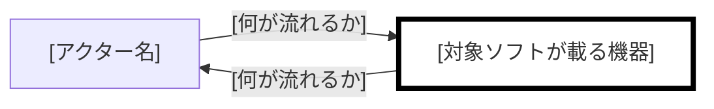

# Overview

**Grammar**: spec.sgra
**UID**: DOC-OVERVIEW
**Version**: 0.1

## Chapter 2. System Overview (システム概要)

### 2.1 Overview Diagram (概要図)

**Type**: SECTION

**構成の概要:**

対象ソフトが載る機器を太枠で示す。色は使わない。線のラベルには何が流れるかを書く。

### 2.2 Devices (機器)

**Type**: SECTION

| 機器           | 種別   | 対象ソフトが載るか | 供給元        | こちらで変えられるか        |
| -------------- | ------ | ------------------ | ------------- | --------------------------- |
| [機器名]       | [種別] | [載る / 載らない]  | [既存 / 新規] | [変えられる / 変えられない] |
| [2 つ目の機器] | [種別] | [載る / 載らない]  | [既存 / 新規] | [変えられる / 変えられない] |

### 2.3 Routes (経路)

**Type**: SECTION

| from   | to     | 運ぶもの   | 方式   | 入力として信頼できるか |
| ------ | ------ | ---------- | ------ | ---------------------- |
| [起点] | [終点] | [運ぶもの] | [方式] | [信頼できない]         |
| [終点] | [起点] | [運ぶもの] | [方式] | [該当なし（送信のみ）] |

### 2.4 Exclusions (持たないもの)

**Type**: SECTION

| 持たないもの           | 理由             |
| ---------------------- | ---------------- |
| [構成に含まれないもの] | [なぜ持たないか] |
| [2 つ目の持たないもの] | [なぜ持たないか] |
