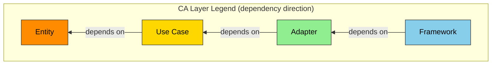

# Design

**Grammar**: spec.sgra
**UID**: DOC-DESIGN
**Version**: 0.1

## Chapter 5. Design (設計)

### 5.1 Architecture Concept (アーキテクチャ方式)

**Type**: SECTION

**層の凡例:**

[採用するアーキテクチャを記入する。Clean Architecture 以外を採る場合は凡例をここで差し替える]

### 5.2 Components (コンポーネント)

**Type**: SECTION

[部品と責務の分割をコンポーネント図で記入する。各コンポーネントが Chapter 2.2 のどの機器に載るかを書く]

### 5.3 File Structure (ファイル構成)

**Type**: SECTION

[ディレクトリ構成と、コンポーネントとフォルダの対応を記入する。各コンポーネントの公開面を宣言する]

### 5.4 Domain Model (ドメインモデル)

**Type**: SECTION

[概念と関係を記入する。構造を持つ型が複数あるならクラス図、永続ストアを持つなら ER 図を描く]

### 5.5 Behavior (振る舞い)

**Type**: SECTION

[処理フローと相互作用を記入する。持続する状態を持つなら状態遷移図、複数コンポーネントの相互作用があるならシーケンス図を描く]

### 5.6 Decisions (設計判断)

**Type**: SECTION

**ADR-000 最小構成との比較:**

| 項目         | 内容                                 |
| ------------ | ------------------------------------ |
| Context      | [要求を満たす最小の構成を記入する]   |
| Decision     | [採用案が増やした要素を記入する]     |
| Status       | [Proposed / Accepted / Superseded]   |
| Consequences | [各々を増やした理由と代償を記入する] |

**ADR-001 [2 つ目の設計判断]:**

| 項目         | 内容                               |
| ------------ | ---------------------------------- |
| Context      | [背景]                             |
| Decision     | [決めたこと]                       |
| Status       | [Proposed / Accepted / Superseded] |
| Consequences | [結果と代償]                       |

**描かなかった図:** [図の種類と、描かなかった理由を 1 行で記入する。無ければ「該当なし」と記入する]
