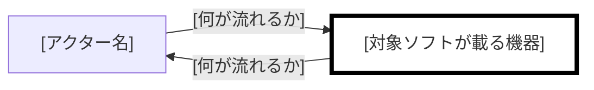

# Requirements

**Grammar**: spec.sgra
**UID**: DOC-REQUIREMENTS
**Version**: 0.1

## Chapter 1. Foundation (基本事項)

### 1.1 Background (背景)

**Type**: SECTION

[なぜこのソフトウェアが必要か、ドメインの現状を記入する]

### 1.2 Challenges (課題)

**Type**: SECTION

[現状の具体的な問題点を記入する]

### 1.3 Goals (目標)

#### [達成すべき状態を 1 つ、機能の目標として記入する]

**Type**: GOAL
**UID**: GL-001

**STATEMENT**: [誰が、何をできる状態になるかを 1 文で記入する]

#### [達成すべき状態を 1 つ、品質の目標として記入する]

**Type**: GOAL
**UID**: GL-002

**STATEMENT**: [速さ・安全・可用性のいずれかについて、達成すべき状態を 1 文で記入する]

### 1.4 Approach (解決方針)

**Type**: SECTION

[技術スタックとアーキテクチャ方針を記入する]

### 1.5 Scope (範囲)

**Type**: SECTION

| 区分         | 内容                                 |
| ------------ | ------------------------------------ |
| In-scope     | [本プロジェクトでやることを記入する] |
| Out-of-scope | [やらないことを記入する]             |

### 1.6 Constraints (制約事項)

**Type**: SECTION

[技術・法規・倫理・特許等、絶対に破れない制約を記入する]

### 1.7 Limitations (制限事項)

**Type**: SECTION

[要求を完全には満たさないが許容可能な既知の妥協点を記入する]

### 1.8 Glossary (用語集)

**Type**: SECTION

| 用語                     | 定義   |
| ------------------------ | ------ |
| [プロジェクト固有の用語] | [定義] |

### 1.9 Notation (表記規約)

**Type**: SECTION

本書は RFC 2119 / RFC 8174 に従う。SHALL / MUST は必須、SHOULD は推奨、MAY は任意を表す。規範語として扱うのは大文字で書かれた場合に限る。

**例外:** EARS 構文中の小文字 `shall` は、本書では大文字の SHALL と同じ拘束力を持つものとする。

**文体:** 記述文では主語と他動詞の目的語を省略しない。指示文（「〜する（MUST）」の形）はこの限りでない。

**図:** 大きな図は `_assets/fig-<name>.md` へ出して本文から参照する。判定の閾値を変更した場合はここに記す。

## Chapter 2. System Overview (システム概要)

### 2.1 Overview Diagram (概要図)

**Type**: SECTION

**構成の概要:**

対象ソフトが載る機器を太枠で示す。色は使わない。線のラベルには何が流れるかを書く。

### 2.2 Devices (機器)

**Type**: SECTION

| 機器     | 種別   | 対象ソフトが載るか | 供給元        | こちらで変えられるか        |
| -------- | ------ | ------------------ | ------------- | --------------------------- |
| [機器名] | [種別] | [載る / 載らない]  | [既存 / 新規] | [変えられる / 変えられない] |

### 2.3 Routes (経路)

**Type**: SECTION

| from   | to     | 運ぶもの   | 方式   | 入力として信頼できるか                |
| ------ | ------ | ---------- | ------ | ------------------------------------- |
| [起点] | [終点] | [運ぶもの] | [方式] | [信頼できない / 該当なし（送信のみ）] |

### 2.4 Exclusions (持たないもの)

**Type**: SECTION

| 持たないもの           | 理由             |
| ---------------------- | ---------------- |
| [構成に含まれないもの] | [なぜ持たないか] |

## Chapter 3. Use Cases (ユースケース)

### 3.1 Actors (アクター)

**Type**: SECTION

| アクター     | アクター種別        | 対応する機器        | 関心           |
| ------------ | ------------------- | ------------------- | -------------- |
| [アクター名] | [人 / 外部システム] | [機器名 / 該当なし] | [何を得たいか] |

### 3.2 Use Cases (ユースケース)

#### [アクターの目標を動詞句で記入する]

**Type**: USE_CASE
**UID**: UC-001

**STATEMENT**: [アクターが何を示し、システムが何を返すかを 1 文で記入する]

**SCENARIO**:

1. [アクターがすることを 1 文で記入する]
2. [システムがすることを 1 文で記入する]
3. [システムがすることを 1 文で記入する]

**EXTENSIONS**:

- 2a. [主成功シナリオから外れる条件を記入する]
  - [そのときシステムがすることを記入する]

**Relations**:

- **Type**: `Parent`
  **ID**: `GL-001`
  **Role**: `Satisfies`

## Chapter 4. Requirements (要求)

### 4.1 Functional Requirements (機能要求)

#### [システムの振る舞いを 1 つ、名前として記入する]

**Type**: FUNC_REQ
**UID**: FR-001

**STATEMENT**: [EARS 1 文で記入する。条件を主語より先に置き、「〜すること。」で終える]

**ORIGIN**: [どの手順または拡張から来たかを記入する]

**RATIONALE**: [なぜこの要求が要るのかを記入する]

**Relations**:

- **Type**: `Parent`
  **ID**: `UC-001`
  **Role**: `Satisfies`

### 4.2 Non-Functional Requirements (非機能要求)

#### [品質の要求を 1 つ、名前として記入する]

**Type**: NON_FUNC_REQ
**UID**: NFR-001

**STATEMENT**: [測定可能な数値基準を含む EARS 1 文で記入する]

**RATIONALE**: [どの経路・どの機器に効くのかを名前で記入する]

**Relations**:

- **Type**: `Parent`
  **ID**: `GL-002`
  **Role**: `Satisfies`

### 4.3 Reduction Candidates (削減候補)

**Type**: SECTION

| 対象ID           | 紐づけ先が無い理由 | 外すと何が起きるか | ユーザーの判断 |
| ---------------- | ------------------ | ------------------ | -------------- |
| [UID / 候補なし] | [理由]             | [1 行で記入する]   | [残す / 外す]  |
