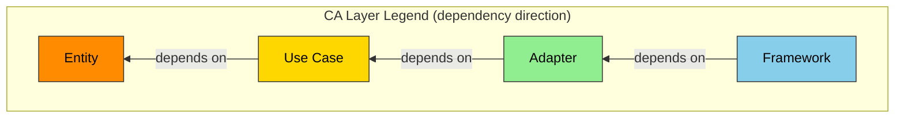

# Design

**Grammar**: spec.sgra
**UID**: DOC-DESIGN
**Version**: 0.1

## Chapter 5. Design (設計)

### 5.1 Architecture Concept (アーキテクチャ方式)

**Type**: SECTION

**層の凡例:**



[採用するアーキテクチャを記入する。Clean Architecture 以外を採る場合は凡例をここで差し替える]

### 5.2 Components (コンポーネント)

**Type**: SECTION

[部品と責務の分割をコンポーネント図で記入する。各コンポーネントが Chapter 2.2 のどの機器に載るかを書く]

### 5.3 File Structure (ファイル構成)

**Type**: SECTION

[ディレクトリ構成と、コンポーネントとフォルダの対応を記入する。各コンポーネントの公開面を宣言する]

### 5.4 Domain Model (ドメインモデル)

**Type**: SECTION

[概念と関係を記入する。構造を持つ型が複数あるならクラス図、永続ストアを持つなら ER 図を描く]

### 5.5 Behavior (振る舞い)

**Type**: SECTION

[処理フローと相互作用を記入する。持続する状態を持つなら状態遷移図、複数コンポーネントの相互作用があるならシーケンス図を描く]

### 5.6 Decisions (設計判断)

**Type**: SECTION

**ADR-000 最小構成との比較:**

| 項目         | 内容                                 |
| ------------ | ------------------------------------ |
| Context      | [要求を満たす最小の構成を記入する]   |
| Decision     | [採用案が増やした要素を記入する]     |
| Status       | [Proposed / Accepted / Superseded]   |
| Consequences | [各々を増やした理由と代償を記入する] |

**ADR-001 [2 つ目の設計判断]:**

| 項目         | 内容                               |
| ------------ | ---------------------------------- |
| Context      | [背景]                             |
| Decision     | [決めたこと]                       |
| Status       | [Proposed / Accepted / Superseded] |
| Consequences | [結果と代償]                       |

**描かなかった図:** [図の種類と、描かなかった理由を 1 行で記入する。無ければ「該当なし」と記入する]

## Chapter 6. Software Specification (ソフトウェア仕様)

### 6.1 Software Specifications (ソフトウェア仕様)

#### [実装可能な言明を 1 つ、名前として記入する]

**Type**: SW_SPEC
**UID**: SWS-001

**STATEMENT**: [EARS 1 文で記入する。符号・状態遷移・境界値などの手段を書く]

**RATIONALE**: [親の要求を、どの経路・どの条件で具体化したものかを記入する]

**Relations**:

- **Type**: `Parent`
  **ID**: `FR-001`
  **Role**: `Satisfies`

#### [2 つ目のソフトウェア仕様]

**Type**: SW_SPEC
**UID**: SWS-002

**STATEMENT**: [EARS 1 文で書く]

**RATIONALE**: [具体化の理由]

**Relations**:

- **Type**: `Parent`
  **ID**: `FR-002`
  **Role**: `Satisfies`

### 6.2 Data Schema (データスキーマ)

**Type**: SECTION

**[スキーマの名前]:**

```json
{
  "$schema": "https://json-schema.org/draft/2020-12/schema",
  "title": "[名前]",
  "type": "object",
  "required": [],
  "properties": {},
  "additionalProperties": false
}
```

[永続ストアを持たない場合は「持たない」と記入し、Chapter 2.4 と揃える]

## Chapter 7. Test Strategy (テスト戦略)

**Type**: SECTION

| 系統                   | テストレベル            | 方針   | ツール/フレームワーク | 合格基準                 |
| ---------------------- | ----------------------- | ------ | --------------------- | ------------------------ |
| ユースケーステスト     | —（系統として持たない） | [方針] | [ツール]              | 全 `UC` PASS             |
| ソフトウェア仕様テスト | `Unit`                  | [方針] | [ツール]              | [合格率]                 |
| ソフトウェア仕様テスト | `Integration`           | [方針] | [ツール]              | [合格率]                 |
| 非機能テスト           | —（系統として持たない） | [方針] | [ツール]              | NFR 数値目標をすべて達成 |

[機器をまたぐ検証は、どの経路（Chapter 2.3）を実際に通すかを名前で記入する]

## Chapter 8. Design Principles Compliance (SW設計原則 準拠確認)

**Type**: SECTION

| カテゴリ | 識別名               | 確認観点                                           | 判定          | 根拠   |
| -------- | -------------------- | -------------------------------------------------- | ------------- | ------ |
| 命名     | Naming               | 意図が伝わる命名か。Chapter 1.8 の語彙と一致するか | [PASS / FAIL] | [根拠] |
| 依存関係 | Dependency Direction | 依存方向が Chapter 5.1 の層に従っているか          | [PASS / FAIL] | [根拠] |
| 簡潔性   | KISS                 | 動作する最も単純な解決を選んでいるか               | [PASS / FAIL] | [根拠] |
| 責務分離 | SRP                  | 各クラス・ユニットが単一の責務を持つか             | [PASS / FAIL] | [根拠] |
| SOLID    | DIP                  | 具象ではなく抽象に依存しているか                   | [PASS / FAIL] | [根拠] |
| 並行性   | Concurrency Safety   | デッドロック・競合状態・グリッチが発生しないか     | [PASS / FAIL] | [根拠] |

[確認する原則はプロジェクトの性質に応じて追加・削除する]
