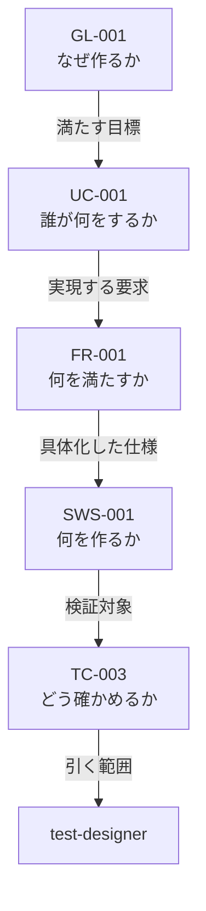

# 開発方式 対応表（2026-08-10）

開発方式を 1 つ決めれば、仕様書・フェーズ・エージェント・プロセス・成果物・レビューがすべて決まる。その対応表である。

**本表が正である。** `02-spec-writing-rules.md` および `framework-src/` の既存文書と食い違う場合は、本表に合わせて相手側を直す。ただし本表が既存規則を変える箇所は、備考にその旨を明記する（黙って上書きしない）。

適用先: プロセス規則 §3.1.1。

開発方式は `簡易` / `標準` / `厳格` の 3 つ。**方式の列はこの 3 つ ＋ `備考` である。識別列（`手順`・`作業`・`主担当`・`関連`・`出力` 等）は表ごとに異なってよい。**

| 記号 | 意味 |
|---|---|
| `必須` / `実施` / `●` | 必ず行う |
| `免除` / `—` | 行わない |
| `条件付き` | 備考の条件に該当する場合のみ行う |
| `該当なし` | その列に条件が無い（表 0 のみ） |
| `◎` | レビューを行い、報告ファイルを残す（表 E-1 のみ） |
| `○` | レビューは行うが、報告ファイルは残さない（表 E-1 のみ） |
| `-` | 不要（表 E-1 のみ） |
| **`新設`** | **手順記号が無い。新しく作る**（作業表のみ） |
| **`統合`** | **既存の複数手順を 1 つにまとめる**（作業表のみ） |
| **`分割`** | **既存の 1 手順を 2 つに割る**（作業表のみ） |

**可否を表すセルの値は上記だけである。`任意` を使ってはならない（MUST NOT）。** 表 0・A・A-2・E-2 は記述値を持つ表であり、この制限の対象外である。

> **表 B-1・B-2・C・D-1・D-2 は廃止した。** §4 と §5 の作業表に統合し、エージェントの起動可否・成果物・手順数は作業表から導出する。導出の規則は §10 の検査が持つ。

---

## 1. 表 0 —— 開発方式の判定

`Phase 1` の `1d` で判定し、`CLAUDE.md`「開発方式」節に記録する（§4.2）。**手順も「開発方式」節もまだ存在しない。**

| | 簡易 | 標準 | 厳格 | 備考 |
|---|---|---|---|---|
| 期間 | 1 日以内で完了 | 1 日超 | 1 週間超 | 見積もりでよい |
| モジュール | 少数 | 複数 | 複数チーム相当の並列実装 | |
| 外部依存 | 最小限 | あり | 外部システム連携あり | |
| Critical | 該当なし | 該当なし | 有効なら期間・規模によらず厳格 | failure が人身・金銭・個人情報のいずれかに直結する場合 |
| 例 | サイコロアプリ、電卓、簡易 CLI、ユーティリティライブラリ | API サービス、DB 連携デスクトップアプリ | 業務システム、マイクロサービス群、決済・医療機器連携・認証基盤 | |

**Critical は他の行を上書きする。** 1 日で作る決済処理も厳格である。

条件付き 13 フラグ（開発方式とは独立に、個別に有効化する）: 法的調査 / 特許調査 / 技術動向調査 / 機能安全(HARA・FMEA・FTA) / アクセシビリティ(WCAG 2.1) / HW連携 / AI/LLM連携 / フレームワーク要求定義 / HW生産工程管理 / 製品i18n・l10n / 認証取得 / 運用・保守 / 実機テスト。判断基準と判断時期はプロセス規則 §3.4 に従う。

フラグは方式と独立なので、簡易でも有効になりうる。 その場合、担当するエージェントは方式によらず起動する（作業表の `条件付き`）。

---

## 2. 表 A —— 仕様書

| | 簡易 | 標準 | 厳格 | 備考 |
|---|---|---|---|---|
| 仕様形式 | ANMS | ANPS-part | ANPS-chapter | 本表が仕様形式の唯一の対応表である。 `02-spec-writing-rules.md` は形式の定義のみを持ち、方式との対応を持たない |
| 枚数 | 1 | 4 | 14 | Critical で厳格になった小さなプロジェクトでは、14 枚それぞれが小さくなるだけで枚数は減らない |
| 分割の単位 | 分割しない | 部 | 章 | |
| StrictDoc | 使わない | 使う | 使う | ANMS でも記法は同じ。export と検出クエリを使わないだけである |
| 文法ファイル | `spec-anms.sgra` | `spec.sgra` | `spec.sgra` | `tools/spec-query/` から仕様書フォルダへ複製する（MUST の本文は `02` の「文法の配置」節） |
| テンプレートの行数（記入前） | **再計測** | **再計測** | **再計測** | Chapter 8 の削除後に測り直す。仕様書テンプレートに各ノード型 2 件ずつを置いた状態 |
| ファイル名 | `01-10-spec` | 4 枚 | 14 枚 | 一覧は `02` の「ファイル名と番号の規則」節が持つ |

---

## 3. 表 A-2 —— 誰が仕様書のどこを、何のために引くか

**セルは `対象` と `根拠` の 2 つを持つ。** `対象` は判断する当のもの、`根拠` はその判断が的を射るために要る上流である。**絞らない場合だけ `全文` と書く。**

> **なぜ `根拠` を分けて書くのか。** `07-agent-orchestration-rules.md` §1.5 が「**節約してよいのは成果物であって、前提ではない**」と定めている。同書は `main-agent` について書いているが、**機構はすべての体に効く。** 目的と上流を知らない体は、返ってきたものが筋に合っているかを判断できない。
>
> **サブエージェントは会話履歴・呼んだスキル・読んだファイルを見ない**（`06-agent-connection-report.md` §2.3）。**したがって本表の `読む目的` と範囲が、その体が知ることのほぼ全部になる。** 本表は読ませ方の規則であると同時に、**依頼文に載る文の材料である。**

**`Ch1 Foundation` は全体・全方式で必ず読む。** 用語集と表記規約がそこにあり、読まなければ用語がぶれる（`tools/kotodama-kun.mjs` が書き込みのたびに検査する）。**本表の範囲はそれ以外を指す。**

**章番号を本表に書いてはならない（MUST NOT）。** 観点と章の対応は `review-standards.md` が持つ。ここで番号を並べると正本が 2 つになる。

| 体（観点） | 読む目的 | 簡易 | 標準 | 厳格 | 備考 |
|---|---|---|---|---|---|
| architect | 要求を満たす構造を決める。 作らないものも決める。 | 全文 | 全文 | 全文 | 要求は互いに関係するため、部分では整合を判断できない。 **絞る根拠がまだ無い**（テンプレートの行数が再計測待ち）。 推測で絞らない。 |
| implementer | 仕様どおりに動くコードを書く。 仕様に無いものを足さない。 | 全文 | 全文 | 全文 | NFR は全 FR を横断する。 同上、絞る根拠がまだ無い。 |
| security-reviewer | 攻撃者に何ができるかを洗い出し、防ぐ設計を置く。 | 全文 | 全文 | 全文 | 脅威は要求を横断する。 1 つの入力経路が別の要求の資産に届く。 |
| review-agent（R1 要求） | 要求が検証可能で、漏れと矛盾が無いかを判断する。 | 全文 | 対象: 要求の部 根拠: 同じ部の概要と UC | 対象: 要求の章 根拠: 概要と UC の章 | 要求の良し悪しは「何のための要求か」に照らして決まる。 上流を外すと一般論の指摘になる。 |
| review-agent（R2・R4・R5・R7 設計） | 設計が要求を満たし、原則に反していないかを判断する。 | 全文 | 対象: 設計の部 根拠: 要求の部 | 対象: 設計の章 根拠: 要求の章 | 何を満たすための設計かを知らないと、正当な単純化を抽象化不足と誤る。 **厳格は 1 観点 1 体だが、4 体とも同じ根拠を読む。** |
| review-agent（R6 テスト） | テストが仕様を確かめる形になっているかを判断する。 | 全文 | 対象: テストの部 根拠: 対象ノードの祖先 | 対象: テストの章 根拠: 対象ノードの祖先 | テストの妥当性は「何を確かめたいか」で決まる。 祖先が無いと書式しか見られない。 |
| test-designer | 仕様が満たされたと言える条件を、実行できる形に落とす。 | 全文 | 対象: テストの部 根拠: 対象ノードの祖先 | 対象: テストの章 根拠: 対象ノードの祖先 | テストは対象ノード 1 つに紐づく。 **テスト戦略の章は設計の部にある。** |
| tester | 実行し、結果が期待どおりかを判断して記録する。 | 全文 | 対象: 自分が書く結果の節 根拠: 対応するケースとその祖先 | 同左 | 結果はケースに 1 対 1 で紐づく。 **食い違ったとき、テストと実装のどちらが誤りかは祖先を見ないと決まらない。** |
| user-manual-writer | 利用者が操作できる手順に翻訳する。 要求の整合は判断しない。 | 全文 | 対象: 概要と UC 根拠: SW仕様 | 対象: 概要と UC の章 根拠: SW仕様の章 | 操作手順・画面・メッセージは SW仕様にしかない。 要求は「〜すること」の宣言であり手順にならない。 **旧版は要求だけを引いており、書けなかった。** |
| runbook-writer | 動かし続け、壊れたときに戻せるようにする。 | 条件付き（全文） | 対象: 設計の部 根拠: NFR | 対象: 概要と設計の章 根拠: NFR | 運用・保守フラグが有効なとき。 監視閾値と復旧目標は NFR が決める。 |

「対象ノードの祖先」とは、対象ノードから親をたどった鎖である。

祖先は 4 ノードであって 4 章ではない。引く道具は未作成である（`tools/spec-query/` にあるのは `checks.jq` / `spec.sgra` / `spec-anms.sgra` の 3 つ）。段 6 で `ancestors.jq` を新設する。

---
## 4. 作業表 —— フェーズの流れ

**採番は振り直した。新旧の読み替え表は `03-work-order.md` §6.4 が持つ。本節に再掲しない。**

`新設` / `統合` / `分割` は**出自**であり、記号の代わりではない。**`commands/full-auto-dev.md` に本体がまだ無い行を表す**（§10 の検査 6）。

**手順数（下の作業表の `実施` を数えた実測値である）:**

| | 簡易 | 標準 | 厳格 |
|---|---:|---:|---:|
| 無条件で実施 | **48** | **66** | **70** |
| 条件付き | 27 | 20 | 18 |
| 免除 | 13 | 2 | 0 |
| **合計** | **88** | **88** | **88** |

**合計 88 は方式によらない。** 方式が変えるのは実施か免除かであって、手順の存在ではない。**厳格に免除が 1 つも無い。**

**`Phase 0` の 5 手順は 3 方式とも実施である。** インストールは方式を決める前に走るため、方式で分岐しない。

### 4.1 Phase 0 インストール

**この段だけ主担当が利用者である。** エージェントの名簿がまだ配置されていないため、外注先が無い。**最大階層は 0。`0` という番号がその差を表している**（`03-work-order.md` §6.2）。

| 手順 | 作業 | 主担当 | 関連 | 出力 | 簡易 | 標準 | 厳格 | 備考 |
|---|---|---|---|---|:-:|:-:|:-:|---|
| `0a` **新設** | gr-sw-maker を取得し、主言語を決める | **利用者** | `**利用者**` が直接行う（体はまだ存在しない） **最大 0 階層** | — | 実施 | 実施 | 実施 | 主言語は `setup.js` の引数になる。 翻訳言語は空でよい。 |
| `0b` **新設** | `node setup.js {lang}` を実行し、規則・体・命令・道具を配置する | **利用者** | `**利用者**` が直接行う（体はまだ存在しない） **最大 0 階層** | process-rules agents commands CLAUDE.md user-order | 実施 | 実施 | 実施 | **道具の配布経路はまだ無い**（`03-work-order.md` §9.1）。 現在の `setup.js` は `tools/` を配らない。 `framework-src/tools/` の新設と `DIR_TARGETS` の拡張が前提である。 |
| `0c` **新設** | `.claude/settings.json` を生成し、既存があれば併合する | **利用者** | `**利用者**` が直接行う（体はまだ存在しない） **最大 0 階層** | settings.json | 実施 | 実施 | 実施 | **丸ごと置き換えてはならない（MUST NOT）。** 利用者の権限設定と MCP 設定が消える。 配線するのはフック・statusLine・`CLAUDE_CODE_MAX_SUBAGENT_SPAWN_DEPTH: 1` である。 |
| `0d` **新設** | 配置物がそろっているか確かめる | **利用者** | `**利用者**` が直接行う（体はまだ存在しない） **最大 0 階層** | — | 実施 | 実施 | 実施 | **そろっていなくても以降は黙って進む。** フックも statusLine も、届いていなければ何も言わずに沈黙する。 **「0 件」と「動いていない」を区別できるのはここだけである。** |
| `0e` **新設** | `user-order.md` に 3 問を書く | **利用者** | `**利用者**` が直接行う（体はまだ存在しない） **最大 0 階層** | user-order | 実施 | 実施 | 実施 | `1a` の入力になる。 **`CLAUDE.md` の中身は `1c` で埋める。ここでは触らない。** |

> **§10 の検査に例外が要る。** `利用者` は `agent-list.md` §1 の名簿に無く、`settings.json` は §2 の file_type に無い。**検査 5・8・13 は Phase 0 の全行を対象外とする。**

### 4.2 Phase 1 初期設定

| 手順 | 作業 | 主担当 | 関連 | 出力 | 簡易 | 標準 | 厳格 | 備考 |
|---|---|---|---|---|:-:|:-:|:-:|---|
| `1a` | user-order.md を読み込む | **main-agent** | `**main-agent**` が直接読む（外注しない） **最大 0 階層** | — | 実施 | 実施 | 実施 | **前提を持たない体は「次を選ぶ」ができない**（`07` §1.5）。 user-order は 3 問形式で小さく、以降のすべての判断の入力になる。 **srs-writer も `2a` で読むが、それは解析のためであって代替にならない。** |
| `1b` | user-order.md をバリデーションする | srs-writer | `**main-agent**`:  --検証依頼--> `srs-writer` `srs-writer`:  --不足の一覧--> `**main-agent**` **最大 1 階層** | — | 実施 | 実施 | 実施 | 不足はインタビューで解消する。 user-order 自体は直さない。 |
| `1c` | CLAUDE.md を提案する | architect | `**main-agent**`:  --起草依頼--> `architect` `architect`:  --案の場所--> `**main-agent**` **最大 1 階層** | CLAUDE.md | 実施 | 実施 | 実施 | **project-manager から移した。** 設計上の決めごとを並べた文書であり、設計の体が起草する。 |
| `1d` **新設** | 開発方式（簡易 / 標準 / 厳格）を決める | **main-agent** | `**main-agent**` が表 0 を引く（外注しない） **最大 0 階層** | decision | 実施 | 実施 | 実施 | **表 0 を引くだけで軽く、以降の分岐の入力になる。** CLAUDE.md「開発方式」節へ記録する。 節も未新設である。 |
| `1e` **新設** | ステークホルダー登録簿を作る | srs-writer | `**main-agent**`:  --作成依頼--> `srs-writer` `srs-writer`:  --登録簿の場所--> `**main-agent**` **最大 1 階層** | stakeholder-register | 免除 | 条件付き | 実施 | **project-manager から移した。** 要求側の成果物である。 ステークホルダーが複数いるとき（標準）。 |
| `1f` **統合** | 条件付き 13 プロセスの要否を一括で評価する | technical-authority | `**main-agent**`:  --評価依頼--> `technical-authority` `technical-authority`:  --可否の一覧--> `**main-agent**` **最大 1 階層** | decision | 実施 | 実施 | 実施 | **project-manager から移した。判定が本務である。** 旧 `0c`〜`0n2` の 13 手順を 1 つにまとめる。 判断基準はプロセス規則 §3.4 が持つ。 |
| `1g` | 評価結果を報告し確認を求める | **main-agent** | `**main-agent**`:  --報告文の起草依頼--> `project-manager` `project-manager`:  --報告文--> `**main-agent**` `**main-agent**`:  --報告し確認--> 利用者 **最大 1 階層** | — | 実施 | 実施 | 実施 | **利用者と話せるのは `main-agent` だけである**（構造上の制約）。 文は下で起草させ、受け取って渡す。 |
| `1h` | pipeline-state を初期化する | project-manager | `**main-agent**`:  --初期化依頼--> `project-manager` `project-manager`:  --完了--> `**main-agent**` **最大 1 階層** | pipeline-state | 実施 | 実施 | 実施 | 記録が本務である。 |

**手順数が 18 → 8 になる。** 統合で 12 減り、新設で 2 増える。**現物は `commands/full-auto-dev.md` の `0a`〜`0p` で 18 手順である**（旧ドキュメントの「19」は誤りである）。

**project-manager が主担当の行は `1h` だけになる。** 報告文の起草は `1g` の `関連` に残る。**成果物づくりは全部よそへ出た。**

### 4.3 Phase 2 企画

| 手順 | 作業 | 主担当 | 関連 | 出力 | 簡易 | 標準 | 厳格 | 備考 |
|---|---|---|---|---|:-:|:-:|:-:|---|
| `2a` | user-order.md を解析する | srs-writer | `**main-agent**`:  --解析依頼--> `srs-writer` `srs-writer`:  --解析結果の要点--> `**main-agent**` **最大 1 階層** | — | 実施 | 実施 | 実施 | `1a` で `main-agent` が読むのは前提としてである。 ここは解析であり、目的が違う。 |
| `2b` | 構造化インタビューを実施する | srs-writer | `**main-agent**`:  --設問の起草依頼--> `srs-writer` `srs-writer`:  --設問--> `**main-agent**` `**main-agent**`:  --質問し回答を持ち帰る--> 利用者 **最大 1 階層** | — | 実施 | 実施 | 実施 | **srs-writer が利用者に直接聞くことはできない**（`07` §2.5 の規約 1）。 設問は下で起草させ、`main-agent` が聞いて回答を渡す。 |
| `2c` | インタビュー結果を記録し確認を求める | srs-writer | `**main-agent**`:  --記録依頼--> `srs-writer` `srs-writer`:  --記録の場所--> `**main-agent**` `**main-agent**`:  --確認--> 利用者 **最大 1 階層** | interview-record | 実施 | 実施 | 実施 | `2i` が未解決の質問数を見る。 確認を取るのは `main-agent` である。 |
| `2d` | モック / サンプル / PoC を作る | srs-writer | `**main-agent**`:  --作成依頼--> `srs-writer` `srs-writer`:  --成果物の場所--> `**main-agent**` **最大 1 階層** | — | 実施 | 実施 | 実施 | 要求を確かめるための試作である。 製品の実装ではない。 |
| `2e` | 仕様書の要求の章を作り、要求に ID を付ける | srs-writer | `**main-agent**`:  --作成依頼--> `srs-writer` `**main-agent**`:  --ID 体系の確認依頼--> `test-designer` `srs-writer`:  --仕様書の場所--> `**main-agent**` `test-designer`:  --ID 体系の可否--> `**main-agent**` **最大 1 階層** | spec-foundation **traceability** | 実施 | 実施 | 実施 | **トレーサビリティの起点である。** ID はテストの紐づけ先になるので test-designer が可否を見る。 **兄弟で並べて起動する。srs-writer が test-designer を呼んではならない**（`07` §2.5.1）。 |
| `2f` | 以降の章のスケルトンを置く | srs-writer | `**main-agent**`:  --作成依頼--> `srs-writer` `srs-writer`:  --完了--> `**main-agent**` **最大 1 階層** | spec-foundation | 実施 | 実施 | 実施 | 章の枠だけを置く。 中身は Phase 4 以降が埋める。 |
| `2g` | 仕様書の概要を報告し承認を求める | **main-agent** | `**main-agent**`:  --概要の起草依頼--> `srs-writer` `srs-writer`:  --概要--> `**main-agent**` `**main-agent**`:  --報告し承認--> 利用者 **最大 1 階層** | — | 実施 | 実施 | 実施 | **主担当を srs-writer から移した。** 作業の実体が利用者への報告であり、話せるのは `main-agent` だけである（`07` §2.5 の規約 1）。 `1g` と同じ形である。 |
| `2h` | 要求の品質レビュー（R1） | review-agent | `**main-agent**`:  --R1 でレビュー依頼--> `review-agent` `review-agent`:  --指摘の場所と件数--> `**main-agent**` **最大 1 階層** | review | 実施 | 実施 | 実施 | **R1 は 1 観点なので、厳格でも 1 体である**（割る先が無い）。 報告ファイルを残すかは表 E-1。 指摘への回答は分類を付けて 1 通で送る（`07` §2.3）。 |
| `2i` **分割** | GATE-INTERVIEW を判定する | technical-authority | `**main-agent**`:  --判定依頼--> `technical-authority` `technical-authority`:  --可否--> `**main-agent**` **最大 1 階層** | — | 実施 | 実施 | 実施 | 合格条件はプロセス規則 §9.4.1 が持つ。 **`2j` と同じ遷移に属するが、条件が別なので行を分ける。** |
| `2j` **分割** | GATE-PLANNING を判定する | technical-authority | `**main-agent**`:  --判定依頼--> `technical-authority` `technical-authority`:  --可否--> `**main-agent**` **最大 1 階層** | — | 実施 | 実施 | 実施 | 合格条件はプロセス規則 §9.4.1 が持つ。 **`2h` の R1 PASS を要するため `2i` の後に置く。** |

**手順数が 9 → 10 になる。** 旧 `1i` の 1 手順 2 ゲートを割った。**ゲートは方式によらず全 8 つ判定するので、割っても判定の数は変わらない。**

### 4.4 Phase 3 外部依存選定

**HW・AI・フレームワークのいずれかが有効なときだけ走る。** 全 7 手順が同じ条件に従う。

| 手順 | 作業 | 主担当 | 関連 | 出力 | 簡易 | 標準 | 厳格 | 備考 |
|---|---|---|---|---|:-:|:-:|:-:|---|
| `3a` | Phase 1 の評価結果を確認する | project-manager | `**main-agent**`:  --確認依頼--> `project-manager` `project-manager`:  --該当するフラグの一覧--> `**main-agent**` **最大 1 階層** | — | 条件付き | 条件付き | 条件付き | `1f` の評価結果を引く。 以下すべて同じ条件である。 |
| `3b` | 外部依存を評価・選定する | architect | `**main-agent**`:  --評価と選定の依頼--> `architect` `architect`:  --候補と比較結果--> `**main-agent**` **最大 1 階層** | — | 条件付き | 条件付き | 条件付き | **外部依存の選定は重要判断であり、利用者の確認が要る**（CLAUDE.md「重要判断の基準」）。 確認は `3f` で行う。 |
| `3c` | 各外部依存の requirement-spec を作る | architect | `**main-agent**`:  --作成依頼--> `architect` `architect`:  --requirement-spec の場所--> `**main-agent**` **最大 1 階層** | requirement-spec | 条件付き | 条件付き | 条件付き | 外部依存 1 つにつき 1 件である。 |
| `3d` | Adapter 層の I/F を設計する | architect | `**main-agent**`:  --設計依頼--> `architect` `architect`:  --I/F の場所--> `**main-agent**` **最大 1 階層** | — | 条件付き | 条件付き | 条件付き | 外部依存を差し替え可能にする境界である。 |
| `3e` | 選定結果を decision に記録する | project-manager | `**main-agent**`:  --記録依頼（`3b` の根拠を添えて）--> `project-manager` `project-manager`:  --decision の場所--> `**main-agent**` **最大 1 階層** | decision | 条件付き | 条件付き | 条件付き | 根拠は `3b` で architect が出したものを渡す。 記録が project-manager の本務である。 |
| `3f` | 選定結果を報告し承認を求める | **main-agent** | `**main-agent**`:  --報告文の起草依頼--> `project-manager` `project-manager`:  --報告文--> `**main-agent**` `**main-agent**`:  --報告し承認--> 利用者 **最大 1 階層** | — | 条件付き | 条件付き | 条件付き | **主担当を project-manager から移した。** 作業の実体が利用者への報告であり、話せるのは `main-agent` だけである（`07` §2.5 の規約 1）。 |
| `3g` | GATE-DEPENDENCY を判定する | technical-authority | `**main-agent**`:  --判定依頼--> `technical-authority` `technical-authority`:  --可否--> `**main-agent**` **最大 1 階層** | — | 条件付き | 条件付き | 条件付き | 合格条件はプロセス規則 §9.4.1 が持つ。 |

### 4.5 Phase 4 設計

| 手順 | 作業 | 主担当 | 関連 | 出力 | 簡易 | 標準 | 厳格 | 備考 |
|---|---|---|---|---|:-:|:-:|:-:|---|
| `4a` | 設計の章を詳細化し、レイヤー仕訳を行う | architect | `**main-agent**`:  --詳細化依頼--> `architect` `architect`:  --仕様書の場所と張った親--> `**main-agent**` **最大 1 階層** | spec **traceability** | 実施 | 実施 | 実施 | 設計ノードの親を張る。 **トレーサビリティがここで要求につながる。** |
| `4b` | アーキテクチャをユーザーが確認するか尋ねる | **main-agent** | `**main-agent**`:  --案の提示依頼--> `architect` `architect`:  --案の要点--> `**main-agent**` `**main-agent**`:  --確認するか尋ねる--> 利用者 **最大 1 階層** | decision | 実施 | 実施 | 実施 | **主担当を architect から移した。** 作業の実体が利用者への問いであり、話せるのは `main-agent` だけである（`07` §2.5 の規約 1）。 **尋ねずに進んではならない。** |
| `4c` | ソフトウェア仕様の章を詳細化する | architect | `**main-agent**`:  --詳細化依頼--> `architect` `architect`:  --仕様書の場所--> `**main-agent**` **最大 1 階層** | spec **traceability** | 実施 | 実施 | 実施 | SW仕様は設計ノードの子である。 **ユーザーマニュアルの根拠になる**（表 A-2）。 |
| `4d` | テスト戦略の章を定義する | architect | `**main-agent**`:  --定義依頼--> `architect` `**main-agent**`:  --実行可能かの確認依頼--> `test-designer` `architect`:  --戦略の場所--> `**main-agent**` `test-designer`:  --可否--> `**main-agent**` **最大 1 階層** | spec | 実施 | 実施 | 実施 | **兄弟で並べて起動する**（`07` §2.5.1）。 戦略を書くのは architect、確かめるのは test-designer である。 |
| `4e` | OpenAPI を生成する | architect | `**main-agent**`:  --生成依頼--> `architect` `architect`:  --openapi の場所--> `**main-agent**` **最大 1 階層** | openapi | 条件付き | 実施 | 実施 | API を持つ場合。 |
| `4f` **新設** | API バージョニング戦略・非推奨通知ポリシーを定める | architect | `**main-agent**`:  --策定依頼--> `architect` `architect`:  --ADR の場所--> `**main-agent**` **最大 1 階層** | ADR | 免除 | 条件付き | 条件付き | 第三者に公開する API を持つ場合。 **`4e` は生成するだけで、戦略を持たない。** |
| `4g` | 脅威モデリングとセキュリティ設計 | security-reviewer | `**main-agent**`:  --脅威モデリング依頼--> `security-reviewer` `security-reviewer`:  --脅威の一覧と設計の場所--> `**main-agent**` **最大 1 階層** | threat-model security-architecture | 条件付き | 実施 | 実施 | 外部からの入力経路がある場合。 **表 A-2 のとおり全文を読む。脅威は要求を横断する。** |
| `4h` | 可観測性設計を作る | architect | `**main-agent**`:  --設計依頼--> `architect` `architect`:  --設計の場所--> `**main-agent**` **最大 1 階層** | observability-design | 免除 | 実施 | 実施 | 常駐サービスかローカル実行かで中身が変わる（CLAUDE.md「可観測性要求」）。 |
| `4i` | デプロイ設計を作る | architect | `**main-agent**`:  --設計依頼--> `architect` `architect`:  --設計の場所--> `**main-agent**` **最大 1 階層** | deployment-design | 条件付き | 実施 | 実施 | 配布以外のデプロイ先がある場合。 **免除したときは、免除の記録をもって GATE-DELIVERY を充足とする**（プロセス規則 §9.4.1）。 |
| `4j` | WBS とガントチャートを作る | progress-monitor | `**main-agent**`:  --作成依頼--> `progress-monitor` `progress-monitor`:  --wbs の場所--> `**main-agent**` **最大 1 階層** | wbs | 免除 | 免除 | 実施 | 並列実装が要求する。 worktree の割当は `5a` が持つ。 |
| `4k` | リスク台帳を作る | risk-manager | `**main-agent**`:  --作成依頼--> `risk-manager` `risk-manager`:  --risk-register の場所とスコア--> `**main-agent**` **最大 1 階層** | risk-register | 免除 | 実施 | 実施 | **スコア 6 以上は利用者に通知する**（CLAUDE.md「重要判断の基準」）。 通知するのは `main-agent` である。 |
| `4l` | 安全分析（HARA / FMEA / FTA） | security-reviewer | `**main-agent**`:  --安全分析依頼--> `security-reviewer` `security-reviewer`:  --分析結果の場所--> `**main-agent**` **最大 1 階層** | safety | 条件付き | 条件付き | 条件付き | 機能安全フラグ。 Critical では必須である。 |
| `4m` | 設計の品質レビュー（R2 / R4 / R5 / R7） | review-agent | `**main-agent**`:  --全観点まとめて依頼--> `review-agent` `review-agent`:  --指摘の場所と件数--> `**main-agent**` **最大 1 階層** | review | 実施 | 実施 | — | **1 体が R2・R4・R5・R7 をまとめて見る。** 指摘への回答は分類を付けて 1 通で送る（`07` §2.3）。 |
| `4m` | 設計の品質レビュー（R2 / R4 / R5 / R7） | review-agent | `**main-agent**`:  --R2 で依頼--> `review-agent` `**main-agent**`:  --R4 で依頼--> `review-agent` `**main-agent**`:  --R5 で依頼--> `review-agent` `**main-agent**`:  --R7 で依頼--> `review-agent` `review-agent` × 4:  --各自の指摘の場所と件数--> `**main-agent**` **最大 1 階層** | review | — | — | 実施 | **1 観点 = 1 体。R をまたがない。** 独自の分野名を作らないので `review-standards.md` との対応表が要らない。 **再委託しない。統合は `4n` が行う**（`07` §2.5.2）。 4 体とも表 A-2 の同じ根拠を読む。 |
| `4n` | GATE-DESIGN を判定し、指摘を統合する | technical-authority | `**main-agent**`:  --統合とゲート判定を依頼--> `technical-authority` `technical-authority`:  --可否と統合済みの指摘--> `**main-agent**` **最大 1 階層** | — | 実施 | 実施 | 実施 | **厳格では観点別の重複をここで除く**（`07` §2.5.2）。 統合に新しい体も新しい階層も要らない。 |

**旧 `3d`（設計原則 準拠確認の章を設定する）は削除した。** Chapter 8 の削除に伴う。**読み替えは `03-work-order.md` §6.4 が持つ。**

**手順数は 14 のまま動かない。** 削除で 1 減り、`4f` の新設で 1 増える。

### 4.6 Phase 5 実装

| 手順 | 作業 | 主担当 | 関連 | 出力 | 簡易 | 標準 | 厳格 | 備考 |
|---|---|---|---|---|:-:|:-:|:-:|---|
| `5a` | コードを実装する | implementer | `**main-agent**`:  --実装依頼--> `implementer` `implementer`:  --実装の場所--> `**main-agent**` **最大 1 階層** | — | 実施 | 実施 | — | 単線で実装する。 |
| `5a` | コードを実装する | implementer | `**main-agent**`:  --worktree の割当依頼--> `project-manager` `project-manager`:  --割当表--> `**main-agent**` `**main-agent**`:  --ブランチごとに実装依頼--> `implementer` × N `implementer` × N:  --各自の実装の場所--> `**main-agent**` **最大 1 階層** | — | — | — | 実施 | **Git worktree で並列実装する。** **兄弟で並べて起動する。project-manager が implementer を呼んではならない**（`07` §1.7・§2.5.1）。 **worktree ごとにキャッシュが冷える**（`06` §1.3）。N 体ぶんの下限を毎回払う。 |
| `5b` | 構造化ログ・メトリクス・トレーシングを組み込む | implementer | `**main-agent**`:  --組み込み依頼--> `implementer` `implementer`:  --完了--> `**main-agent**` **最大 1 階層** | — | 免除 | 実施 | 実施 | 適用範囲は CLAUDE.md「可観測性要求」が持つ。 `4h` の設計に従う。 |
| `5c` | 単体テストを作成・実行する | implementer | `**main-agent**`:  --作成と実行の依頼--> `implementer` `**main-agent**`:  --確かめるべき観点の提供依頼--> `test-designer` `test-designer`:  --観点--> `**main-agent**` `implementer`:  --結果とカバレッジ--> `**main-agent**` **最大 1 階層** | — | 実施 | 実施 | 実施 | **作成と実行を同じ体が行う唯一のテストである。** **`6a`〜`6d` と揃えない理由:** 単体テストは実装と一体で書かれ、実装した体が走らせるのが自然だからである。 揃えると同じコードを 2 体が読むことになり、下限を二重に払う。 |
| `5d` | IaC コードを実装する | implementer | `**main-agent**`:  --実装依頼--> `implementer` `implementer`:  --実装の場所--> `**main-agent**` **最大 1 階層** | — | 条件付き | 実施 | 実施 | 配布以外のデプロイ先がある場合。 `4i` のデプロイ設計に従う。 |
| `5e` | 実装コードのレビュー（R2 / R3 / R4 / R5 / R7） | review-agent | `**main-agent**`:  --全観点まとめて依頼--> `review-agent` `review-agent`:  --指摘の場所と件数--> `**main-agent**` **最大 1 階層** | review | 実施 | 実施 | — | **1 体が R2・R3・R4・R5・R7 をまとめて見る。** **レビュアーは直さない**（`07` §2.7 の規約 3）。 |
| `5e` | 実装コードのレビュー（R2 / R3 / R4 / R5 / R7） | review-agent | `**main-agent**`:  --R2 で依頼--> `review-agent` `**main-agent**`:  --R3 で依頼--> `review-agent` `**main-agent**`:  --R4 で依頼--> `review-agent` `**main-agent**`:  --R5 で依頼--> `review-agent` `**main-agent**`:  --R7 で依頼--> `review-agent` `review-agent` × 5:  --各自の指摘の場所と件数--> `**main-agent**` **最大 1 階層** | review | — | — | 実施 | **1 観点 = 1 体。R をまたがない。** **再委託しない。統合は `5i` が行う**（`07` §2.5.2）。 同時実行の上限 20 に対して余裕がある。 |
| `5f` | SCA スキャンを走らせる | security-reviewer | `**main-agent**`:  --SCA の実行依頼--> `security-reviewer` `**main-agent**`:  --ライセンス面の確認依頼--> `license-checker` `security-reviewer`:  --報告の場所と件数--> `**main-agent**` `license-checker`:  --帰属表示の要否--> `**main-agent**` **最大 1 階層** | security-scan-report | 実施 | 実施 | 実施 | **本手順は SCA だけである。SAST は `5g` が持つ。** 依存が 0 件なら該当なしと記録する。 合格線は Critical 0 / High 0。 |
| `5g` **新設** | SAST を走らせる | security-reviewer | `**main-agent**`:  --SAST の実行依頼--> `security-reviewer` `security-reviewer`:  --報告の場所と件数--> `**main-agent**` **最大 1 階層** | security-scan-report | 条件付き | 実施 | 実施 | 簡易は外部入力を扱う場合のみ。 **旧 §3.2.8 を SCA と 2 件に割って生まれた**（`03-work-order.md` §13.2）。 走らせる時期も対象も SCA と違う。 |
| `5h` | ライセンスを確認する | license-checker | `**main-agent**`:  --確認依頼--> `license-checker` `license-checker`:  --license-report の場所--> `**main-agent**` **最大 1 階層** | license-report | 実施 | 実施 | 実施 | 依存ライブラリを追加したら必ず走らせる。 帰属表示もここが持つ。 |
| `5i` | GATE-IMPL を判定する | technical-authority | `**main-agent**`:  --統合とゲート判定を依頼--> `technical-authority` `technical-authority`:  --可否と統合済みの指摘--> `**main-agent**` **最大 1 階層** | — | 実施 | 実施 | 実施 | 合格条件はプロセス規則 §9.4.1 が持つ。 **厳格では 5 体の指摘をここで統合する**（`07` §2.5.2）。 |

**手順数が 8 → 9 になる。** `5g` の新設で 1 増える。

### 4.7 Phase 6 テスト

| 手順 | 作業 | 主担当 | 関連 | 出力 | 簡易 | 標準 | 厳格 | 備考 |
|---|---|---|---|---|:-:|:-:|:-:|---|
| `6a` **分割** | 結合テストの受入基準とテストコードを書く | test-designer | `**main-agent**`:  --受入基準とテストコードの作成依頼--> `test-designer` `**main-agent**`:  --設計意図の確認依頼--> `architect` `architect`:  --意図の要点--> `**main-agent**` `test-designer`:  --test-plan の場所--> `**main-agent**` **最大 1 階層** | test-plan **traceability** | 実施 | 実施 | 実施 | **旧 `5a` の前半である。** 表 A-2 のとおり対象ノードの祖先を根拠として読む。 |
| `6b` **分割** | 結合テストを実行し結果を記録する | tester | `**main-agent**`:  --実行依頼--> `tester` `tester`:  --結果の場所と件数--> `**main-agent**` **最大 1 階層** | — | 実施 | 実施 | 実施 | **旧 `5a` の後半である。** **書いた体と走らせる体を分ける。** 期待を書いた者が結果も書くと、食い違いを見落とす。 defect は発見した体が起票する（`Fg`）。 |
| `6c` **分割** | システムテストの受入基準とテストコードを書く | test-designer | `**main-agent**`:  --受入基準とテストコードの作成依頼--> `test-designer` `**main-agent**`:  --設計意図の確認依頼--> `architect` `architect`:  --意図の要点--> `**main-agent**` `test-designer`:  --test-plan の場所--> `**main-agent**` **最大 1 階層** | test-plan | 実施 | 実施 | 実施 | **旧 `5b` の前半である。** |
| `6d` **分割** | システムテストを実行し結果を記録する | tester | `**main-agent**`:  --実行依頼--> `tester` `tester`:  --結果の場所と件数--> `**main-agent**` **最大 1 階層** | — | 実施 | 実施 | 実施 | **旧 `5b` の後半である。** |
| `6e` | 性能テストを実行し結果を記録する | tester | `**main-agent**`:  --性能テストの実行依頼--> `tester` `tester`:  --結果と NFR 達成の可否--> `**main-agent**` **最大 1 階層** | performance-report | 条件付き | 実施 | 実施 | 数値目標を持つ NFR がある場合。 合格線は NFR の数値目標をすべて達成することである。 |
| `6f` | 実機テストを実施し、分類・原因分析を行う | field-test-engineer | `**main-agent**`:  --実機テストの依頼--> `field-test-engineer` `**main-agent**`:  --分類依頼--> `feedback-classifier` `**main-agent**`:  --原因分析と対策の依頼--> `field-issue-analyst` `field-test-engineer`:  --記録の場所--> `**main-agent**` `feedback-classifier`:  --defect / CR / 質問の別--> `**main-agent**` `field-issue-analyst`:  --原因と対策案--> `**main-agent**` **最大 1 階層** | field-issue | 条件付き | 条件付き | 条件付き | 実機テストフラグ。 **兄弟で並べて起動する。field-test-engineer が他の 2 体を呼んではならない**（`07` §2.5.1）。 **利用者と実機でやり取りする部分は `main-agent` を通す。** |
| `6g` | テスト消化曲線と defect curve を更新する | progress-monitor | `**main-agent**`:  --更新依頼--> `progress-monitor` `progress-monitor`:  --曲線の場所--> `**main-agent**` **最大 1 階層** | — | 免除 | 免除 | 実施 | 1 週間未満の走行では点が足りない。 |
| `6h` | テストコードのレビュー（R6） | review-agent | `**main-agent**`:  --R6 でレビュー依頼--> `review-agent` `review-agent`:  --指摘の場所と件数--> `**main-agent**` **最大 1 階層** | review | 実施 | 実施 | 実施 | **R6 は 1 観点なので、厳格でも 1 体である**（割る先が無い）。 表 A-2 のとおり対象ノードの祖先を根拠として読む。 |
| `6i` | GATE-TEST を判定する | technical-authority | `**main-agent**`:  --判定依頼--> `technical-authority` `technical-authority`:  --可否--> `**main-agent**` **最大 1 階層** | — | 実施 | 実施 | 実施 | 合格条件はプロセス規則 §9.4.1 が持つ。 |

**手順数が 7 → 9 になる。** 分割で 2 増える。

### 4.8 Phase 7 納品

| 手順 | 作業 | 主担当 | 関連 | 出力 | 簡易 | 標準 | 厳格 | 備考 |
|---|---|---|---|---|:-:|:-:|:-:|---|
| `7a` | 全成果物の最終レビュー（R1〜R7） | review-agent | `**main-agent**`:  --R1〜R7 まとめて依頼--> `review-agent` `review-agent`:  --指摘の場所と件数--> `**main-agent**` **最大 1 階層** | review | 実施 | 実施 | — | **1 体が R1〜R7 をまとめて見る。** **簡易はここで R1〜R7 を網羅する**（表 E-1）。 |
| `7a` | 全成果物の最終レビュー（R1〜R7） | review-agent | `**main-agent**`:  --R1 で依頼--> `review-agent` `**main-agent**`:  --R2 で依頼--> `review-agent` `**main-agent**`:  --R3 で依頼--> `review-agent` `**main-agent**`:  --R4 で依頼--> `review-agent` `**main-agent**`:  --R5 で依頼--> `review-agent` `**main-agent**`:  --R6 で依頼--> `review-agent` `**main-agent**`:  --R7 で依頼--> `review-agent` `review-agent` × 7:  --各自の指摘の場所と件数--> `**main-agent**` **最大 1 階層** | review | — | — | 実施 | **1 観点 = 1 体。R をまたがない。** **7 観点が 4 分野に収まらない問題が消える。** **再委託しない。統合は `7k` が行う**（`07` §2.5.2）。 体の下限は 27k〜35k なので、下限だけで 7 倍になる。**これが厳格の値段である。** |
| `7b` **新設** | リリース判定チェックリストを運用する | project-manager | `**main-agent**`:  --チェックリストの運用依頼--> `project-manager` `**main-agent**`:  --判定依頼--> `technical-authority` `project-manager`:  --release-checklist の場所--> `**main-agent**` `technical-authority`:  --可否--> `**main-agent**` **最大 1 階層** | release-checklist | 免除 | 条件付き | 実施 | 複数バージョンを並行保守するとき（標準）。 **兄弟で並べて起動する**（`07` §2.5.1）。 |
| `7c` | コンテナビルド | implementer | `**main-agent**`:  --ビルド依頼--> `implementer` `implementer`:  --成果物の場所--> `**main-agent**` **最大 1 階層** | — | 条件付き | 実施 | 実施 | 配布以外のデプロイ先がある場合。 `7c`〜`7f` は同じ条件に従う。 |
| `7d` | デプロイ | implementer | `**main-agent**`:  --デプロイ依頼--> `implementer` `implementer`:  --結果--> `**main-agent**` **最大 1 階層** | — | 条件付き | 実施 | 実施 | 同上。 |
| `7e` | 監視確認 | implementer | `**main-agent**`:  --監視の確認依頼--> `implementer` `implementer`:  --確認結果--> `**main-agent**` **最大 1 階層** | — | 条件付き | 実施 | 実施 | 同上。 `4h` の可観測性設計が届いているかを見る。 |
| `7f` | ロールバック手順を作る | implementer | `**main-agent**`:  --手順の作成依頼--> `implementer` `implementer`:  --手順の場所--> `**main-agent**` **最大 1 階層** | — | 条件付き | 実施 | 実施 | 同上。 |
| `7g` | 最終レポートを作る | project-manager | `**main-agent**`:  --作成依頼--> `project-manager` `project-manager`:  --final-report の場所--> `**main-agent**` **最大 1 階層** | final-report | 実施 | 実施 | 実施 | 統合が本務である。 waiver は条件 3 によりここへ転記する（プロセス規則 §9.1.1）。 |
| `7h` | ユーザーマニュアルを作る | user-manual-writer | `**main-agent**`:  --作成依頼--> `user-manual-writer` `user-manual-writer`:  --user-manual の場所--> `**main-agent**` **最大 1 階層** | user-manual | 実施 | 実施 | 実施 | **表 A-2 のとおり SW仕様を根拠として読む。** 要求だけでは操作手順を書けない。 |
| `7i` | 運用手順書と引継ぎ資料を作る | runbook-writer | `**main-agent**`:  --作成依頼--> `runbook-writer` `**main-agent**`:  --利用者向け記述の突き合わせ依頼--> `user-manual-writer` `runbook-writer`:  --runbook の場所--> `**main-agent**` `user-manual-writer`:  --重複と食い違いの一覧--> `**main-agent**` **最大 1 階層** | runbook | 条件付き | 条件付き | 条件付き | 運用・保守フラグ。 **トレーニング・知識移転もここに乗る。** **表 A-2 のとおり NFR を根拠として読む。** |
| `7j` | 受入テスト手順書を作る | test-designer | `**main-agent**`:  --作成依頼--> `test-designer` `test-designer`:  --手順書の場所--> `**main-agent**` **最大 1 階層** | — | 実施 | 実施 | 実施 | **受入基準を書く側なので test-designer である。** |
| `7k` | GATE-DELIVERY を判定する | technical-authority | `**main-agent**`:  --統合とゲート判定を依頼--> `technical-authority` `technical-authority`:  --可否と統合済みの指摘--> `**main-agent**` **最大 1 階層** | — | 実施 | 実施 | 実施 | 合格条件はプロセス規則 §9.4.1 が持つ。 **厳格では 7 体の指摘をここで統合する。** 免除した成果物は、免除の記録をもって充足とする。 |
| `7l` | 完了を報告する | **main-agent** | `**main-agent**`:  --報告文の起草依頼--> `project-manager` `project-manager`:  --報告文--> `**main-agent**` `**main-agent**`:  --完了報告--> 利用者 **最大 1 階層** | — | 実施 | 実施 | 実施 | **主担当を project-manager から移した。** 作業の実体が利用者への報告であり、話せるのは `main-agent` だけである（`07` §2.5 の規約 1）。 |

**手順数が 11 → 12 になる。** `7b` の新設で 1 増える。**旧 `6b`〜`6e` の 1 行 4 手順は 4 行に開いた。** 記号ごとに主担当と出力が要るためである（§10 の検査 6・13）。

### 4.9 Phase 8 運用・保守

**運用・保守フラグが有効なときだけ走る。** 全 6 手順が同じ条件に従う。

| 手順 | 作業 | 主担当 | 関連 | 出力 | 簡易 | 標準 | 厳格 | 備考 |
|---|---|---|---|---|:-:|:-:|:-:|---|
| `8a` | incident management 体制を確立する | incident-reporter | `**main-agent**`:  --体制の確立依頼--> `incident-reporter` `incident-reporter`:  --体制の記録の場所--> `**main-agent**` **最大 1 階層** | — | 条件付き | 条件付き | 条件付き | 運用・保守フラグ。 以下すべて同じ条件である。 |
| `8b` | パッチ適用とスキャンの定期実行を設定する | security-reviewer | `**main-agent**`:  --定期実行の設定依頼--> `security-reviewer` `security-reviewer`:  --設定の場所--> `**main-agent**` **最大 1 階層** | — | 条件付き | 条件付き | 条件付き | パッチ対応時間の目標は CLAUDE.md「品質目標」が持つ。 |
| `8c` | SLA 監視を確認する | progress-monitor | `**main-agent**`:  --SLA 監視の確認依頼--> `progress-monitor` `progress-monitor`:  --確認結果--> `**main-agent**` **最大 1 階層** | — | 条件付き | 条件付き | 条件付き | `4h` の可観測性設計が定めた閾値と突き合わせる。 |
| `8d` | 復旧手順の訓練を計画する | runbook-writer | `**main-agent**`:  --訓練計画の作成依頼--> `runbook-writer` `runbook-writer`:  --計画の場所--> `**main-agent**` **最大 1 階層** | — | 条件付き | 条件付き | 条件付き | `7i` の runbook を前提とする。 |
| `8e` | incident 報告書と根本原因分析を作る | incident-reporter | `**main-agent**`:  --報告書の作成依頼--> `incident-reporter` `**main-agent**`:  --根本原因分析の依頼--> `process-improver` `incident-reporter`:  --incident-report の場所--> `**main-agent**` `process-improver`:  --原因と改善案--> `**main-agent**` **最大 1 階層** | incident-report | 条件付き | 条件付き | 条件付き | **兄弟で並べて起動する**（`07` §2.5.1）。 改善案の適用は `Fe` が行う。 |
| `8f` | GATE-EOL を判定する | technical-authority | `**main-agent**`:  --判定依頼--> `technical-authority` `technical-authority`:  --可否--> `**main-agent**` **最大 1 階層** | — | 条件付き | 条件付き | 条件付き | 終了する場合。 合格条件はプロセス規則 §9.4.1 が持つ。 |

---

## 5. 作業表 —— 並行して回るもの

### 5.1 フェーズ完了時（共通手順）

**走行フェーズごとに 1 回。**

| 手順 | 作業 | 主担当 | 関連 | 出力 | 簡易 | 標準 | 厳格 | 備考 |
|---|---|---|---|---|:-:|:-:|:-:|---|
| `Fa` | トークン消費とコストを追記する | progress-monitor | `**main-agent**`:  --計測依頼--> `progress-monitor` `progress-monitor`:  --完了--> `**main-agent**` **最大 1 階層** | cost-log.json | 免除 | 実施 | 実施 | **計測が本務である。** 予算とアラート閾値は CLAUDE.md「品質目標」が持つ。 閾値に達したら `main-agent` が利用者へ通知する。 |
| `Fb` | 文脈の圧縮が起きていたら session-handoff を残す | project-manager | `**main-agent**`:  --起草依頼--> `project-manager` `project-manager`:  --引継ぎ文の場所--> `**main-agent**` **最大 1 階層** | session-handoff | 実施 | 実施 | 実施 | 発火を判断するのは `main-agent` である（自分の文脈の話であるため）。 文は下で起草させる。 **引継ぎ閾値と比べる値は現在生まれていない**（`06` §1.2）。 |
| `Fc` | pipeline-state と executive-dashboard を更新し、報告文を起草する | project-manager | `**main-agent**`:  --更新と起草を依頼--> `project-manager` `project-manager`:  --報告文--> `**main-agent**` `**main-agent**`:  --報告--> 利用者 **最大 1 階層** | pipeline-state executive-dashboard | 実施 | 実施 | 実施 | **統合が本務である。** 簡易は pipeline-state のみ。 **報告するのは `main-agent` である。** |
| `Fd` | ふりかえりと根本原因分析を行う | process-improver | `**main-agent**`:  --ふりかえり依頼--> `process-improver` `process-improver`:  --報告の場所と改善案--> `**main-agent**` **最大 1 階層** | retrospective-report | 免除 | 実施 | 実施 | 各フェーズ完了時に行う。 改善案の適用は `Fe` が受ける。 |
| `Fe` | 承認済み改善策をガバナンスファイルへ適用する | decree-writer | `**main-agent**`:  --適用依頼--> `decree-writer` `decree-writer`:  --before/after diff--> `**main-agent**` **最大 1 階層** | — | 免除 | 実施 | 実施 | `Fd` に従属する。 **承認するのは利用者である**（`main-agent` 経由）。 |

> **旧 `Fa`（当該フェーズの全 Out の用語・命名をチェックする）は削除した。体を起動しない。** `tools/kotodama-kun.mjs` が `Write` / `Edit` の前に走り、**書いた体にその場で差し戻る**（`07` §2.6）。`main-agent` には何も届かない。**読み替えは `03-work-order.md` §6.4 が持つ。**

### 5.2 随時（条件で発火する）

| 手順 | 作業 | 主担当 | 関連 | 出力 | 簡易 | 標準 | 厳格 | 備考 |
|---|---|---|---|---|:-:|:-:|:-:|---|
| `Ff` | 変更要求の影響分析と記録を行う | change-manager | `**main-agent**`:  --影響分析の依頼--> `change-manager` `change-manager`:  --影響度と change-request の場所--> `**main-agent**` `**main-agent**`:  --影響度 high の承認--> 利用者 **最大 1 階層** | change-request | 免除 | 条件付き | 条件付き | 仕様書承認後に利用者から出たとき。 **影響度 high は利用者の承認が要る**（CLAUDE.md「重要判断の基準」）。 |
| `Fg` **新設** | defect 票を起こし、状態を進める | tester | `**発見した体**`:  --その場で起票--> defect 票 `**main-agent**`:  --修正依頼--> `implementer` `**main-agent**`:  --CR への振り分け依頼--> `change-manager` `implementer`:  --修正の場所--> `**main-agent**` `change-manager`:  --振り分けの結果--> `**main-agent**` **最大 1 階層** | defect | 条件付き | 実施 | 実施 | 発見した体が起票する（即時起票ルール）。 簡易は同じ defect が再発したときのみ。 **状態を進めるのは tester である。** |
| `Fh` **新設** | 文書の版を上げ、廃止文書を `old/` へ移す | **各 file_type のオーナー** | `**main-agent**`:  --版上げ依頼--> `**各 file_type のオーナー**` `**main-agent**`:  --差分の確認依頼--> `review-agent` `**各 file_type のオーナー**`:  --新しい版の場所--> `**main-agent**` `review-agent`:  --差分の可否--> `**main-agent**` **最大 1 階層** | 全 file_type | 免除 | 実施 | 実施 | **単一の担当を置かない唯一の行である。** オーナーの対応は `agent-list.md` §2 が持つ。 |

---

## 6. 表 E-1 —— フェーズごとのレビューと報告

| 記号 | 意味 |
|:-:|---|
| ◎ | レビューを行い、`project-records/reviews/` に報告ファイルを残す |
| ○ | レビューは行うが、報告ファイルは残さない。結果は最終報告にまとめる |
| - | 不要 |

| フェーズ / 観点 | 簡易 | 標準 | 厳格 | 備考 |
|---|:-:|:-:|:-:|---|
| `2h` R1（要求品質） | ○ | ◎ | ◎ | 観点 1 件。 厳格でも 1 体（割る先が無い）。 |
| `4m` R2・R4・R5・R7（設計品質） | ○ | ◎ | ◎ | 観点 4 件。 厳格は 4 体。 |
| `5e` R2・R3・R4・R5・R7（実装品質） | ○ | ◎ | ◎ | 観点 5 件。 厳格は 5 体。 |
| `6h` R6（テスト品質） | ○ | ◎ | ◎ | 観点 1 件。 厳格でも 1 体（割る先が無い）。 |
| `7a` R1〜R7（最終） | ◎ | ◎ | ◎ | 観点 7 件。 厳格は 7 体。 簡易はここで R1〜R7 を網羅する。 |
| 再レビュー（修正後） | - | ◎ | ◎ | 標準は「修正済み」とした指摘のみ。 厳格は全指摘。 |
| 観点ごとに別走行 | - | - | ◎ | 厳格は R1〜R7 を混ぜない。 **1 観点 = 1 体。R をまたがない。** |

報告ファイルの本数: 簡易 1 本 / 標準 5 本 ＋ 再レビュー分 / 厳格 18 本 ＋ 再レビュー分（各フェーズの観点数 1+4+5+1+7 の総和。積ではない）。

**ゲートは全方式で 8 つとも判定する。省けるのは報告ファイルであってレビューではない。**

> どの観点がどの章を見るかは `review-standards.md` が持つ。 本表は方式ごとに報告を残すかだけを持つ。

---

## 7. 表 E-2 —— レビューの基準

重大度は 4 段（Critical / High / Medium / Low）で全方式共通。

| | 簡易 | 標準 | 厳格 | 備考 |
|---|---|---|---|---|
| 合格線（Critical） | 0 | 0 | 0 | `review-standards.md`「重大度別の対応ルール」に従う |
| 合格線（High） | 0 | 0 | 0 | 同上 |
| 合格線（Medium） | 対応記録があればよい | 対応記録があればよい | 0（修正済みのみ） | **厳格は既存規則を厳しくする。** 既存は据置き・受容を許容する |
| 合格線（Low） | 記録不要 | 対応記録があればよい | 対応記録があればよい | **簡易は既存規則を緩める。** 既存は全規模で対応記録を要求する |
| ゲート FAIL 時のエスカレーション | 3 回目 | 3 回目 | 2 回目 | **厳格の「2 回目」は本表で新設する。** プロセス規則 §9.1.1 の再試行ポリシー表は 1-2 回目 / 3 回目の 2 段しか持たない |
| waiver | 3 条件（ユーザー承認・tech-decision 記録・final-report 転記） | 同左 | 同左 | 3 条件は §9.1.1 に従う。再評価時期の記録は条件 2 に含まれ、全方式で必須である |

> 既存規則を変える 3 行（Medium の厳格・Low の簡易・エスカレーションの厳格）は、段 1 で `review-standards.md` と §9.1.1 の側にも同じ変更を入れる。**片方だけ変えてはならない（MUST NOT）。**

---

## 8. 簡易で何が動くか

**すべて §4・§5 の作業表から導出した値である。** 作業表を直したらここも直す。

| | 内容 |
|---|---|
| 仕様書 | ANMS 1 枚 |
| 手順 | **無条件 48**（うち `Phase 0` インストールが 5）。 条件付き 27。 免除 13。 **合計 88**（`03-work-order.md` §6.3 と一致する）。 |
| エージェント | **無条件 11 体** —— srs-writer architect technical-authority project-manager review-agent implementer security-reviewer license-checker test-designer tester user-manual-writer |
| 条件付きで増える体 | **8 体** —— runbook-writer field-test-engineer feedback-classifier field-issue-analyst incident-reporter progress-monitor process-improver change-manager **全部有効なら 19 体。** |
| 簡易では決して起動しない体 | **2 体** —— risk-manager（`4k` 免除） decree-writer（`Fe` 免除） **19 ＋ 2 = 21 で、名簿の 21 体と一致する**（`03-work-order.md` §16 の作業 5）。 |
| 成果物 | user-order CLAUDE.md decision pipeline-state interview-record spec-foundation traceability spec **test-plan** review security-scan-report license-report final-report user-manual session-handoff |
| レビュー報告 | 1 本（`7a` で R1〜R7 網羅）。 合格線 Critical 0 / High 0。 |
| ゲート | 全 8 ゲートを判定する。 |

> **`test-plan` が新たに簡易の成果物になった。** 旧 `5a` `5b` を「作成 / 実行」に割った結果、受入基準とテストコードが `6a` `6c` の `出力` として現れたためである。**統合しなければ出てこなかった。**

**ゲートは方式によらず免除しない。免除するのは作業であってゲートではない。**

> ゲートが要求する成果物を方式が免除する組み合わせがある（`GATE-DELIVERY` の runbook、`GATE-IMPL` の SAST、`GATE-DESIGN` の threat-model）。プロセス規則 §9.4.1 は deployment-design にしか「免除の記録をもって充足とする」を持たない。**全ゲートに同じ逃げ道を付けるまで、簡易は納品ゲートを通過できない。**

---

## 9. 標準と厳格の違い

**起動するエージェントは同じである。** 差は作業表の次の行に出る。

| 作業 | 標準 | 厳格 | 何が変わるか |
|---|:-:|:-:|---|
| `1e` ステークホルダー登録簿を作る | 条件付き | 実施 | 関与者が複数いる。 |
| `4j` WBS とガントチャートを作る | 免除 | 実施 | 並列する担い手がいて工程表が要る。 |
| `4m` 設計の品質レビュー | **1 体** | **4 体** | R2・R4・R5・R7 を 1 観点 1 体に割る。 |
| `5a` コードを実装する | 単線 | **Git worktree で並列** | 差は実装の仕方にある。 worktree ごとにキャッシュが冷える。 |
| `5e` 実装コードのレビュー | **1 体** | **5 体** | R2・R3・R4・R5・R7 を 1 観点 1 体に割る。 |
| `6g` テスト消化曲線と defect curve を更新する | 免除 | 実施 | 1 週間未満の走行では点が足りない。 |
| `7a` 全成果物の最終レビュー | **1 体** | **7 体** | R1〜R7 を 1 観点 1 体に割る。 **下限だけで 7 倍になる。** |
| `7b` リリース判定チェックリストを運用する | 条件付き | 実施 | 複数バージョンを並行保守する。 |
| 表 E-1 観点ごとに別走行 | - | ◎ | R1〜R7 を混ぜない。 |
| 表 E-1 報告ファイルの本数 | 5 ＋ 再レビュー分 | 18 ＋ 再レビュー分 | 上に従う。 |
| 表 E-1 再レビューの範囲 | 「修正済み」とした指摘のみ | 全指摘 | 据置き・受容も検証する。 セルの値は両方 ◎ で、差は範囲にある。 |
| 表 E-2 Medium の合格線 | 対応記録があればよい | 0（修正済みのみ） | 据置き・受容を認めない。 |
| 表 E-2 エスカレーション | FAIL 3 回目 | FAIL 2 回目 | 早く利用者へ上げる。 |

**差は 13 行。** 手順の数ではなく、成果物とレビューの厳しさに出る。

### 9.1 レビューを 1 観点 = 1 体に割る

**レビューの 3 行（`4m` `5e` `7a`）は、この決定で新たに標準と厳格の差になった。** いずれも値は `実施` だが、**経路が違うので作業表では行を分けている。**

| 手順 | 観点 | 簡易・標準 | 厳格 |
|---|---|:-:|:-:|
| `2h` 要求レビュー | R1 | 1 体 | **1 体**（割る先が無い） |
| `4m` 設計レビュー | R2 / R4 / R5 / R7 | 1 体 | **4 体** |
| `5e` 実装レビュー | R2 / R3 / R4 / R5 / R7 | 1 体 | **5 体** |
| `6h` テストレビュー | R6 | 1 体 | **1 体**（割る先が無い） |
| `7a` 最終レビュー | R1〜R7 | 1 体 | **7 体** |

| # | 採る理由 |
|:-:|---|
| 1 | **追跡性が切れない。** 独自の分野名を作ると `review-standards.md` との対応表が要り、二重管理になる |
| 2 | **依頼文が 1 行で済む**（「R2 だけ見よ」）。分野の定義を書き下ろさなくてよい |
| 3 | **最終レビューの 7 観点が 4 分野に収まらない問題が消える。** 同時実行の上限 20 に対して余裕がある |

**項目数の偏り（R2 が 20、R4 が 3）は許容する。** 割る目的は負荷分散ではなく**文脈の分離**であり、早く終わる体が出ても損ではない。

> **厳格の値段:** 体の文脈には下限（27k〜35k）がある。最終レビューを 7 体で回すと**下限だけで 7 倍**になる。簡易・標準の約 38k 相当に対し、**厳格は約 260k 相当である。**

> 仕様書の分割（表 A・A-2）にも差がある。 本節が挙げるのは作業表と表 E の差だけである。

---

## 10. 本表が満たすべき検査

`tools/check-mode-matrix.mjs` が確かめる。同ファイルは未作成である。

| # | 判定 |
|:-:|---|
| 1 | **方式の列が** `簡易` / `標準` / `厳格` / `備考` の 4 つである。**識別列は表ごとに異なってよい** |
| 2 | 可否を表すセルに `任意` が無い |
| 3 | `Micro` / `Small` / `Standard` / `Large` / `中規模以上` / `通常` / `厳密` が区分名として 0 件 |
| 4 | 表 E-1 のフェーズ / 観点の行の値が `◎` / `○` / `-` のいずれかである |
| 5 | **作業表の `主担当` と `関連` が `agent-list.md` §1 の名簿に実在する。** 名簿外の値として `**main-agent**` / `**利用者**` / `**各 file_type のオーナー**` / `**発見した体**` の 4 つだけを許す |
| 6 | **作業表の手順記号が `commands/full-auto-dev.md` に実在する。手順セルに `新設` / `統合` / `分割` を含む行は実在検査の対象外とし、件数を出力する**（現在 14 件。`Phase 0` の 5 手順を除く） |
| 7 | `条件付き` のセルには備考に条件が書かれている |
| 8 | **作業表の `出力` に現れる名前が `agent-list.md` §2 の file_type に実在する。** file_type でないものは除外リストで明示する（現在 `cost-log.json` / `settings.json` / `process-rules` / `agents` / `commands`） |
| 9 | 表 E-2 の重大度が `review-standards.md`「重大度別の対応ルール」の 4 段と一致する |
| 10 | §9 に挙げた行が、作業表と表 E で実際に標準と厳格の値が異なる行と一致する |
| 11 | 本表が「既存規則を変える」と明記した箇所が、`framework-src/` 側にも反映されている |
| 12 | `02-spec-writing-rules.md` の章・節の題名が `01-spec-template.md` の見出しと一致する |
| 13 | **全作業行に `主担当` が 1 つある。`各 file_type のオーナー` を唯一の例外として許す** |
| 14 | **`主担当` がその方式で 1 つも `実施` を持たない体は、その方式で起動しない**（旧 表 C の導出） |
| 15 | **`関連` に挙げた体は、その作業がその方式で `実施` なら起動する。`主担当` と同じ扱いとする** |
| 16 | 既知の欠陥（存在しないエージェント名を `主担当` に 1 件仕込む）で FAIL する |
| 17 | 既知の欠陥（存在しない手順記号を 1 件仕込む）で FAIL する |
| **18** | **表 A-2 の全行が `読む目的` を持つ。** 空欄を許さない |
| **19** | **表 A-2 の方式のセルが `全文` か、`対象:` と `根拠:` の両方を持つ形である。** 片方だけを許さない |
| **20** | **表 A-2 に章番号（`Ch` で始まる字面）が 0 件である。** 観点と章の対応は `review-standards.md` が持つ |
| **21** | **`関連` のセルが `**最大 N 階層**` で終わる。** N は現れる依頼の段数と一致する |
| **22** | **`関連` で体を宛先とする依頼は、起点がすべて `**main-agent**` である**（`07` §2.5 の規約 3・7）。体が体を起動する経路を許さない。宛先が体でない行（`Fg` の起票）は対象外とする |
| **23** | **`関連` で利用者を宛先とする行は、起点が `**main-agent**` である**（`07` §2.5 の規約 1）。体が利用者に直接話す経路を許さない |

### 10.1 統合の検算（1 度だけ走らせる）

**旧表を捨てる前に、作業表から導出した値が旧表と一致することを確かめる。** 一致しなければ統合で何かを落としている。

| # | 検算 | 状態 |
|:-:|---|---|
| 1 | 導出した起動エージェントが旧 表 C と一致する | **実施済み。簡易 12 体は一致。標準・厳格は旧表の宣言が `17` だったが実測 `16` で、旧表の側が誤っていた** |
| 2 | 導出した成果物が旧 表 D-2 と一致する | 未実施 |
| 3 | 導出した手順数が旧 表 B-1 と一致する | 未実施。**新設・統合・分割を除いた状態で比べる** |

> **検算 1 は旧表の誤りを見つけた。** 旧 表 C は「無条件で起動する体数 標準 17 / 厳格 17」と書いていたが、`●` を数えると 16 である。**統合しなければ気づかないままだった。**
