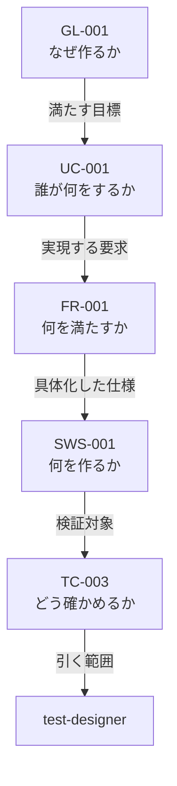

# 開発方式 対応表（2026-08-10）

開発方式を 1 つ決めれば、仕様書・フェーズ・エージェント・プロセス・成果物・レビューがすべて決まる。その対応表である。

**本表が正である。** `spec-writing-rules.md` および `framework-src/` の既存文書と食い違う場合は、本表に合わせて相手側を直す。ただし本表が既存規則を変える箇所は、備考にその旨を明記する（黙って上書きしない）。

適用先: プロセス規則 §3.1.1。

開発方式は `簡易` / `標準` / `厳格` の 3 つ。

## 軸を 2 つに割る

**順序の軸と方式の軸を 1 枚に載せない。**

| 表 | 何を持つか | 節 |
|---|---|---|
| **作業表** | **誰が誰に何を頼み、何を読み、何を書き、何を返すか。** 順序の軸 | §4・§5 |
| **表 M（方式表）** | **その手順を方式ごとに行うか行わないか。** 方式の軸 | §6 |

**混ぜると行が二重になる。** 旧版はレビューと並列実装の 4 手順を、方式ごとに 2 行ずつ書く羽目になっていた。

### 作業表の列

| 列 | 中身 |
|---|---|
| `フェーズ` | **手順記号とフェーズ名を 1 つのセルに持つ。** フェーズ名が**その作業の目的**である。**フェーズ番号は書かない** —— 手順記号の先頭文字がそれを表す。**`新設` / `統合` / `分割` を併記した行は、`commands/full-auto-dev.md` に本体がまだ無い** |
| `作業` | **目的を達成する手段を書く。動詞で終える（MUST）。** 状態（「〜されている」）で書いてはならない —— **前提条件に見え、指示にならない** |
| `依頼元` | 頼む側。`main-agent` か `利用者` |
| `担当者` | やる側。エージェント・`利用者`・道具のいずれか。**1 行 1 担当者。複数なら行を分ける** |
| `モデル` | **その担当者を動かすモデル。** 正本は `agents/*.md` の `model:` であり、**本列は写しである**（検査 18f が一致を強制する）。方式で落とす場合だけ `opus<br />簡易は sonnet` の形で併記する |
| `入力` | 読むもの。**仕様書を読む行は `対象:` と `根拠:` に割る**（§3.1） |
| `出力` | **書くファイル。** `agent-list.md` §2 の file_type で書く。**仕様書は部の単位で書き分ける —— 第 1 部 `spec-foundation`（Ch1-4）／第 2 部 `spec-architecture`（Ch5-7）／第 3 部 `spec-test`（Ch8-10）。ANMS（簡易）では 3 型とも単一の `spec` へ畳まれる**（名簿 §2・文書管理規則 §9.39）。**`spec` を作業表に書いてはならない（MUST NOT）** —— 畳んだ後の名前であり、どの部を書くのかが表から消える |
| `依頼元へ返す` | **依頼元に返す値。** 場所・合否・次の一手だけである（`agent-orchestration-rules.md` §3.6） |
| `備考` | 上のどれにも入らないこと。**1 文ごとに改行する** |

**`出力` と `依頼元へ返す` を混ぜてはならない（MUST NOT）。** 前者はファイル、後者は戻り値である。**成果物の全文を返させない**という規約（`agent-orchestration-rules.md` §4.7 の規約 1）は、両者を分けて初めて検査できる。

**1 行は 1 依頼である。往復の数は `agent-orchestration-rules.md` §4.2・§4.3 が決める。**

重い依頼（レビュー・仕様の詳細化・実機テスト）には受領通知が挟まり、指摘には回答と再判定が続く。**表は依頼の単位を持ち、往復の数は持たない。**

```text
依頼元 --作業_と_入力--> 担当者
担当者 --依頼元へ返す--> 依頼元
担当者 --書く--> 出力
```

### 値の凡例

| 記号 | 意味 | どの表 |
|---|---|---|
| `必須` / `実施` / `●` | 必ず行う | 表 M |
| `免除` / `—` | 行わない | 表 M |
| `条件付き` | 備考の条件に該当する場合のみ行う | 表 M |
| `該当なし` | その列に条件が無い | 表 0 |
| `◎` | レビューを行い、報告ファイルを残す | 表 E-1 |
| `○` | レビューは行うが、報告ファイルは残さない | 表 E-1 |
| `-` | 不要 | 表 E-1 |
| **`新設`** | **その手順の本体がまだ無い。新しく作る** | 作業表 |
| **`統合`** | **既存の複数手順を 1 つにまとめた** | 作業表 |
| **`分割`** | **既存の 1 手順を 2 つに割った** | 作業表 |
| **`[直列]`** | **前の行の完了を待つ**（同じ手順記号の 2 行目以降） | 作業表 |
| **`[同時]`** | **前の行と同時に起動してよい**（同上） | 作業表 |
| **`[簡易・標準]` / `[厳格]`** | **方式で経路が変わる行。互いに排他である** | 作業表 |

**モデルは `opus` / `sonnet` / `haiku` の 3 つだけを使う。`fable` を使ってはならない（MUST NOT）。** `agents/*.md` の `model:` にも書かない。

**モデルの正本は 2 か所にある。** `agents/*.md` の `model:`（Claude Code が実際に読む）と `agent-list.md` §1 の `model` 列である。**両者は現在 22 件すべて一致している**（実測）。本表の `モデル` 列はその写しであり、**3 つ目の正本にしてはならない。**

> **簡易でもモデルを下げない**（2026-08-11 決定）。114 行のうち opus が 69 行を占めるが、そのまま走らせる。
>
> | # | 理由 |
> |:-:|---|
> | 1 | **設計は方式によらず重要である。** 簡易だからといって設計の判断を安いモデルに委ねない |
> | 2 | **開発方式でモデルを変えると管理が煩雑になる。** モデルは担当者だけで決まり、方式の軸を持ち込まない |
>
> **したがって `モデル` 列に方式ごとの併記は現れない。** 現れたらそれは規則違反である（検査 18g）。

**可否を表すセルの値は上記だけである。`任意` を使ってはならない（MUST NOT）。** 表 0・A・E-2 は記述値を持つ表であり、この制限の対象外である。

> **表 B-1・B-2・C・D-1・D-2 は廃止した。** §4 と §5 の作業表に統合し、エージェントの起動可否・成果物・手順数は作業表と表 M から導出する。導出の規則は §11 の検査が持つ。
>
> **表 A-2 も廃止した。** エージェントごとに読む範囲を持っていたが、**同じエージェントでも手順ごとに読むものが変わる**（architect は `4a` で要求を読み、`4e` では設計だけを読む）。作業表の `入力` 列へ畳み、方式ごとの粒度だけを §3 の規則に残した。

---

## 1. 表 0 —— 開発方式の判定

`Phase 1` の `1e` で判定し、`CLAUDE.md`「開発方式」節に記録する（§4.2）。**手順も「開発方式」節もまだ存在しない。**

| | 簡易 | 標準 | 厳格 | 備考 |
|---|---|---|---|---|
| 期間 | 1 日以内で完了 | 1 日超 | 1 週間超 | 見積もりでよい |
| モジュール | 少数 | 複数 | 複数チーム相当の並列実装 | |
| 外部依存 | 最小限 | あり | 外部システム連携あり | |
| Critical | 該当なし | 該当なし | 有効なら期間・規模によらず厳格 | failure が人身・金銭・個人情報のいずれかに直結する場合 |
| 例 | サイコロアプリ、電卓、簡易 CLI、ユーティリティライブラリ | API サービス、DB 連携デスクトップアプリ | 業務システム、マイクロサービス群、決済・医療機器連携・認証基盤 | |

**Critical は他の行を上書きする。** 1 日で作る決済処理も厳格である。

条件付き 13 フラグ（開発方式とは独立に、個別に有効化する）: 法的調査 / 特許調査 / 技術動向調査 / 機能安全(HARA・FMEA・FTA) / アクセシビリティ(WCAG 2.1) / HW連携 / AI/LLM連携 / フレームワーク要求定義 / HW生産工程管理 / 製品i18n・l10n / 認証取得 / 運用・保守 / 実機テスト。判断基準と判断時期はプロセス規則 §3.4 に従う。

フラグは方式と独立なので、簡易でも有効になりうる。 その場合、担当するエージェントは方式によらず起動する（作業表の `条件付き`）。

---

## 2. 表 A —— 仕様書

| | 簡易 | 標準 | 厳格 | 備考 |
|---|---|---|---|---|
| 仕様形式 | ANMS | ANPS-part | ANPS-chapter | 本表が仕様形式の唯一の対応表である。 `spec-writing-rules.md` は形式の定義のみを持ち、方式との対応を持たない |
| 枚数 | 1 | 4 | 14 | Critical で厳格になった小さなプロジェクトでは、14 枚それぞれが小さくなるだけで枚数は減らない |
| 分割の単位 | 分割しない | 部 | 章 | |
| StrictDoc | 使わない | 使う | 使う | ANMS でも記法は同じ。export と検出クエリを使わないだけである |
| 文法ファイル | `spec-anms.sgra` | `spec.sgra` | `spec.sgra` | `tools/spec-query/` から仕様書フォルダへ複製する（MUST の本文は `spec-writing-rules.md` の「ファイル名と番号の規則」節。**`spec-writing-rules.md` に「文法の配置」という節は無い**） |
| テンプレートの行数（記入前） | **再計測** | **再計測** | **再計測** | Chapter 8 の削除後に測り直す。仕様書テンプレートに各ノード型 2 件ずつを置いた状態 |
| ファイル名 | `01-10-spec` | 4 枚 | 14 枚 | 一覧は `spec-writing-rules.md` の「ファイル名と番号の規則」節が持つ |

---

## 3. 仕様書の読ませ方

**何を読むかは §4・§5 の `入力` 列が持つ。本節は粒度だけを決める。**

### 3.1 粒度は方式で決まる

| 方式 | 粒度 | 枚数 |
|---|---|---|
| 簡易 | **全文** | ANMS は 1 枚しかない |
| 標準 | **部** | **3 部 ＋ 付録の 4 枚**のうち該当する部 |
| 厳格 | **章** | 14 枚のうち該当する章。**テスト 3 章はケースと結果で 2 枚に割れる**ので、そこだけ節の粒度になる |

**例外は 4 つだけである。**

| 担当者 | 粒度 | なぜそうするか |
|---|---|---|
| architect | **常に全文** | 要求は互いに関係するため、部分では整合を判断できない。<br />**絞る根拠がまだ無い**（テンプレートの行数が再計測待ち）。<br />推測で絞らない。 |
| implementer | **常に全文** | NFR は全 FR を横断する。<br />同上、絞る根拠がまだ無い。 |
| security-reviewer | **常に全文** | 脅威は要求を横断する。<br />1 つの入力経路が別の要求の資産に届く。 |
| tester | **常に節** | 結果はケースに 1 対 1 で紐づく。<br />自分が書く結果の節と、対応するケースだけでよい。 |

**`Ch1 Foundation` は全担当者・全方式で必ず読む。** 用語集と表記規約がそこにあり、読まなければ用語がぶれる（`tools/kotodama-kun.mjs` が書き込みのたびに検査する）。**粒度の対象外であり、`入力` 列にも書かない。**

**章番号を書いてはならない（MUST NOT）。** 観点と章の対応は `review-standards.md` が持つ。ここで番号を並べると正本が 2 つになる。

### 3.2 入力は `対象` と `根拠` に割る

**`対象` は判断する当のもの、`根拠` はその判断が的を射るために要る上流である。**

> **なぜ `根拠` を分けて書くのか。** `agent-orchestration-rules.md` §3.5 が「**節約してよいのは成果物であって、前提ではない**」と定めている。同書は `main-agent` について書いているが、**本表はこれをすべての担当者へ広げて適用する**（`agent-orchestration-rules.md` にこの一般化は無い。広げる判断は本表が負う）。 目的と上流を知らないエージェントは、返ってきたものが筋に合っているかを判断できない。
>
> **サブエージェントは会話履歴・呼んだスキル・読んだファイルを見ない**。**したがって `入力` 列に書いたものが、そのエージェントが知ることのほぼ全部になる。** 作業表は依頼文の材料である。

**上流を外すと何を誤るか。**

| 作業 | 上流を外すと何を取り違えるか |
|---|---|
| 設計レビュー | 何を満たすための設計かを知らず、**正当な単純化を抽象化不足と誤る** |
| テストレビュー | 何を確かめたいかを知らず、**書式しか見られない** |
| 結果の判定 | 期待と実際が食い違ったとき、**テストと実装のどちらに fault があるかを決められない** |
| ユーザーマニュアル | 操作手順・画面・メッセージが ソフトウェア仕様にしかないため、**要求だけでは書けない** |

「対象ノードの祖先」とは、対象ノードから親をたどった鎖である。



**祖先の長さは系統で変わる。** `UC` を通る鎖は `GL → UC → FR → SWS → TC → TR` で 4 ノード、`NFR` 直結の `TC` は 2 ノード、`NFR → SWS` を経るものは 3 ノードである（`spec-writing-rules.md` の鎖の図）。**「祖先は 4 ノード」と決め打ってはならない。**

引く道具は未作成である（`tools/spec-query/` にあるのは `checks.jq` / `spec.sgra` / `spec-anms.sgra` の 3 つ）。段 6 で `ancestors.jq` を新設する。**それまでは UID を手で手繰る。**

### 3.3 `入力` に使ってよい語

**`入力` 列に書けるのは下表の語だけである（MUST）。** 表に無い語を書いてはならない —— 依頼を受けたエージェントが、どのファイルを開けばよいか決められなくなる。

| 語 | 指すもの（`spec-writing-rules.md` の章名） | ノード型 | 注意 |
|---|---|---|---|
| `全文` | 仕様書のすべての章 | すべて | §3.1 の例外 4 者だけが使う |
| `目的` | Foundation の Goals | `GL` | **鎖の根である** |
| `概要` | System Overview | 持たない | 機器と経路。ID が無いので名前で参照する |
| `UC` | Use Cases | `UC` | アクターと主成功シナリオ |
| `要求` | Requirements | `FR` / `NFR` | |
| `NFR` | Requirements のうち非機能 | `NFR` | 数値目標を持つもの |
| `設計` | Design ＋ Software Specification | `ADR` のみ（鎖の外） | **設計レビューの対象範囲である。テスト戦略を含まない** |
| `ソフトウェア仕様` | Software Specification | `SWS` | 操作手順・画面・メッセージはここにしかない |
| `テスト戦略` | Test Strategy | 持たない | **第 2 部（設計側）にある。第 3 部ではない** |
| `テスト` | Use Case Tests ＋ Software Specification Tests ＋ Non-Functional Tests | `TC` / `TR` | 第 3 部。**`テスト戦略` と混同しない** |
| `対象ノードの祖先` | 対象から親をたどった鎖 | 可変 | 長さは 2〜4（上記） |
| `自分が書く結果の節` | 各テスト章の Test Results 節 | `TR` | 系統ごとに別の節である |

**語は 3 通りに書ける。それ以外の形を書いてはならない（MUST NOT）。**

| 形 | 例 | 意味 |
|---|---|---|
| 語そのもの | `対象: 設計` | 上表の語を 1 つ |
| **`と` で連ねる** | `対象: 概要と UC` | 上表の語を 2 つ以上。**新しい語を作るのではない** |
| **限定を付ける** | `根拠: 数値目標を持つ NFR` | 上表の語を条件で絞る |

**`根拠` にはこれに加えて、それ以前の手順の出力を書いてよい**（`根拠: `4a` の spec-architecture`）。**`対象` には書けない。** 対象は仕様書の範囲であり、他の手順の成果物ではない。

**章番号とファイル名は本表に書かない。** 語から章名が決まり、章名からファイルが決まる。**後半の対応は `spec-writing-rules.md` の「ファイル名と番号の規則」が持つ。**

> **仕様書の実ファイル名は `01-10-spec.md` である**（2026-08-11 決定）。§2 の表 A の `01-10-spec` に拡張子を付けたものであり、`spec-writing-rules.md` の席番号規則（ファイル番号は最初の章の番号、範囲を名前に含める）が 10 章構成から導く。**`spec-writing-rules.md` は Chapter 8 削除前の `01-11-spec.md` のままなので、追随させる**。

---
## 4. 作業表 —— フェーズの流れ

**本節に再掲しない。**

**方式ごとの実施・免除は §6 の表 M が持つ。本節に方式の列は無い。** 例外は、**方式によって経路そのものが変わる 4 手順**（`4m` `5a` `5e` `7a`）だけである。その 4 つは行を分け、備考の先頭に **[簡易・標準]** / **[厳格]** を置く。

### 目的はフェーズ名が担う

**`フェーズ` 列がフェーズ名を持ち、それが作業の目的を表す。** だから `作業` 列は**目的を達成する手段**を書く。

| 列 | 答えるもの | 例 |
|---|---|---|
| `フェーズ` | **なぜ**（目的） | `4a`<br />設計 |
| `作業` | **どうやって**（手段） | 要求を満たすアーキテクチャを検討し、設計の章に書く |
| `出力` ＋ `依頼元へ返す` | **どうなれば終わりか**（完了条件） | spec-architecture が書かれ、張った親の範囲が返っている |

**完了条件の列は要らない。** 出力と戻り値がそろえば終わりである。

### 依頼に必ず添える与件

**`入力` 列は手順ごとに変わるものだけを持つ。** 全依頼に共通するものは列に書かず、**依頼文の側で必ず添える（MUST）。**

| 与件 | どこから取るか | 無いと何が起きるか |
|---|---|---|
| **開発方式**（簡易 / 標準 / 厳格） | `1e` の decision | 読む粒度（§3.1）も、報告を残すか（表 E-1）も決まらない |
| **仕様形式**（ANMS / ANPS-part / ANPS-chapter） | §2 の表 A ＋ 開発方式 | 仕様書が 1 枚なのか 14 枚なのか決まらない |
| **仕様書の実ファイル一覧** | 仕様書のフォルダの現物 | §3.3 の語から開くファイルが決まらない |
| **現在のフェーズと直前のゲートの結果** | pipeline-state | 前提が満たされているか判断できない |
| **並列で起動された兄弟の有無と、自分に割り当てられた連番** | `main-agent` | 同時に書くと出力の採番が衝突する |

> **これは列の代わりではない。** サブエージェントは会話履歴を見ないので、**与件も `入力` と同じく依頼文に載らなければ届かない。** 列に書かないのは、97 手順すべてに同じ 5 行を書くのが冗長だからである。

> **フェーズ名を節見出しと重ねて書くのは冗長に見えるが、意図してそうしている。** **1 行がそのまま 1 つの依頼文になる。**行を抜き出したときに目的が失われてはならない。
>
> **したがってフェーズ名の質が全行の質を決める。** 現在の 9 つのうち `Phase 1 初期設定` だけが手段寄りの名前であり、目的を表しきれていない。**改名の要否は別途判断する。**

**手順数（表 M の `実施` を数えた実測値）:**

| | 簡易 | 標準 | 厳格 |
|---|---:|---:|---:|
| 無条件で実施 | **53** | **72** | **76** |
| 条件付き | 31 | 23 | 21 |
| 免除 | 13 | 2 | 0 |
| **合計** | **97** | **97** | **97** |

> **条件付きの手順が走らなかったとき、それを `入力` に挙げている後続の手順は、欠けたまま進む。**
>
> 簡易のサイコロアプリでは `5g`（SAST）と `6h`（性能テスト）が条件に当たらず走らない。**それでも `5i`（GATE-IMPL）と `6l`（GATE-TEST）は両者の結果を `入力` に挙げている。**
>
> **免除と同じ扱いとする —— 走らなかった記録をもって充足とする**（プロセス規則 §9.4.1）。**「入力が無いから止まる」ではない。** ゲートを判定するエージェントは、走らなかったことの記録を受け取って判定する。
>
> **したがってゲートの `入力` には、条件付きの手順の結果が「無い」場合があることを前提とする。**

**合計 97 は方式によらない。** 方式が変えるのは実施か免除かであって、手順の存在ではない。**厳格に免除が 1 つも無い。**

**88 → 96 になった**（2026-08-11、シミュレーションの結果を反映）。新設 8 手順の内訳は `1d` `2e` `6e` `6f` `6g` `Fi` `Fj` `Fk`。

**行数は手順数より多い。** 担当者が複数なら行を分けるためである。**同じ手順記号の行は、すべて依頼元が同じでなければならない。** これは作業表の規則であり、`agent-orchestration-rules.md` §4.5.1 の兄弟形を表に写したものである（`agent-orchestration-rules.md` にこの文は無い）。

### 4.1 Phase 0 インストール

**この段だけ依頼元が利用者である。** エージェントの名簿がまだ配置されていないため、外注先が無い。**担当者も利用者と道具だけである**。

| フェーズ | 作業 | 依頼元 | 担当者 | モデル | 入力 | 出力 | 依頼元へ返す | 備考 |
|---|---|---|---|---|---|---|---|---|
| `0a`<br />インストール<br />**新設** | gr-sw-maker を取得し、<br />主言語を選ぶ | **利用者** | **利用者** | — | — | — | — | 主言語は `setup.js` の引数になる。<br />翻訳言語は空でよい。 |
| `0b`<br />インストール<br />**新設** | `node setup.js {lang}` を実行し、<br />規則・エージェント・命令を配置する | **利用者** | `setup.js` | — | `framework-src/{lang}/` | process-rules<br />agents<br />commands<br />CLAUDE.md<br />user-order | 配置したファイルの一覧 | **道具の配布経路はまだ無い**。<br />現在の `setup.js` は `tools/` を配らない。 |
| `0c`<br />インストール<br />**新設** | `.claude/settings.json` を生成し、<br />既存の設定に併合する | **利用者** | `setup.js` | — | 既存の `.claude/settings.json` | settings.json | 併合の結果 | **丸ごと置き換えてはならない（MUST NOT）。**<br />利用者の権限設定と MCP 設定が消える。<br />配線するのはフック・statusLine・`CLAUDE_CODE_MAX_SUBAGENT_SPAWN_DEPTH: 1` である。 |
| `0d`<br />インストール<br />**新設** | 配置物を数え、<br />不足を洗い出す | **利用者** | **利用者** | — | `0b` の一覧<br />settings.json | — | 不足の一覧 | **そろっていなくても以降は黙って進む。**<br />フックも statusLine も、届いていなければ何も言わずに沈黙する。<br />**「0 件」と「動いていない」を区別できるのはここだけである。** |
| `0e`<br />インストール<br />**新設** | `user-order.md` の 3 問に答えを書く | **利用者** | **利用者** | — | user-order のひな形 | user-order | — | `1a` の入力になる。<br />**`CLAUDE.md` の中身は `1c` で埋める。ここでは触らない。** |

> **§11 の検査に例外が要る。** `利用者` と `setup.js` は `agent-list.md` §1 の名簿に無く、`settings.json` は §2 の file_type に無い。**Phase 0 の全行を検査 12 と検査 18 の対象外とする**（他の検査は Phase 0 でも効く）。

### 4.2 Phase 1 初期設定

| フェーズ | 作業 | 依頼元 | 担当者 | モデル | 入力 | 出力 | 依頼元へ返す | 備考 |
|---|---|---|---|---|---|---|---|---|
| `1a`<br />初期設定 | user-order を読み、<br />何を作るのかを前提として持つ | **main-agent** | **main-agent** | —<br />（セッションのモデル） | user-order | — | — | **前提を持たないエージェントは「次を選ぶ」ができない**<br />（`agent-orchestration-rules.md` §3.5）。<br />user-order は 3 問形式で小さく、以降のすべての判断の入力になる。<br />**srs-writer も `2a` で読むが、それは解析のためであって代替にならない。** |
| `1b`<br />初期設定 | user-order を仕様書テンプレートの必須項目に照らし、<br />不足を洗い出す | main-agent | srs-writer | opus | user-order | — | 不足の一覧 | 不足はインタビューで解消する。<br />user-order 自体は直さない。 |
| `1c`<br />初期設定 | user-order から決めごとを起こし、<br />CLAUDE.md の案を書く | main-agent | architect | opus | user-order<br />`1b` の不足の一覧 | CLAUDE.md | 案の場所<br />利用者が埋める箇所 | **project-manager から移した。**<br />設計上の決めごとを並べた文書であり、設計のエージェントが起草する。 |
| `1d`<br />初期設定<br />**新設** | CLAUDE.md の記入必須欄を利用者に示し、値を受け取る | **main-agent** | **利用者** | — | `1c` の CLAUDE.md<br />`1c` が返した「利用者が埋める箇所」 | CLAUDE.md | 埋めた値 | **[直列]** `1c` の後に走る。<br />**コスト予算・アラート閾値・引継ぎ閾値・カバレッジ目標が埋まらないと、`5c` の合格判定と `6l` の GATE-TEST が比較対象を持たない。**<br />CLAUDE.md は file_type ではないので検査 18 の除外リストにある。 |
| `1e`<br />初期設定<br />**新設** | 表 0 に照らして開発方式を選び、<br />CLAUDE.md へ記録する | main-agent | technical-authority | opus | 表 0<br />user-order | tech-decision | 決めた方式と理由 | **表 0 を引くだけで軽く、以降の分岐の入力になる。**<br />CLAUDE.md「開発方式」節へ記録する。<br />節も未新設である。 |
| `1f`<br />初期設定<br />**新設** | 関与者を洗い出し、<br />ステークホルダー登録簿に書く | main-agent | srs-writer | opus | user-order<br />`1b` の不足の一覧 | stakeholder-register | 登録簿の場所<br />関与者の数 | **project-manager から移した。**<br />要求側の成果物である。 |
| `1g`<br />初期設定<br />**統合** | 条件付き 13 プロセスをプロセス規則 §3.4 に照らし、<br />要否を一括で判定する | main-agent | technical-authority | opus | user-order<br />`1e` の decision<br />プロセス規則 §3.4 | tech-decision | 13 件の可否と理由 | **project-manager から移した。判定が本務である。**<br />旧 `0c`〜`0n2` の 13 手順を 1 つにまとめる。 |
| `1h`<br />初期設定 | 評価結果をまとめ、<br />利用者へ渡す報告文を書く | main-agent | project-manager | opus | `1e` の decision<br />`1g` の decision | — | 報告文 | **文は下で起草させる**<br />（`agent-orchestration-rules.md` §4.7 の規約 5）。 |
| `1h`<br />初期設定 | 報告文を利用者に示し、<br />確認を得る | **main-agent** | **利用者** | — | 報告文 | — | 確認 / 差し戻し | **[直列]** **利用者と話せるのは `main-agent` だけである**<br />（構造上の制約）。 |
| `1i`<br />初期設定 | 方式と評価結果を pipeline-state に書いて初期化する | main-agent | project-manager | opus | `1e` の decision<br />`1g` の decision | pipeline-state | 初期化の完了 | 記録が本務である。 |

**手順数が 18 → 9 になる。** 統合で 12 減り、新設で 2 増える。**現物は `commands/full-auto-dev.md` の `0a`〜`0p` で 18 手順である**（旧ドキュメントの「19」は正しくない）。

**project-manager が担当者の行は `1h` の起草と `1i` だけになる。** **成果物づくりは全部よそへ出た。**

### 4.3 Phase 2 企画

| フェーズ | 作業 | 依頼元 | 担当者 | モデル | 入力 | 出力 | 依頼元へ返す | 備考 |
|---|---|---|---|---|---|---|---|---|
| `2a`<br />企画 | user-order を読み解き、<br />要求と曖昧点を洗い出す | main-agent | srs-writer | opus | user-order | — | 曖昧点と不足の一覧 | `1a` で `main-agent` が読むのは前提としてである。<br />ここは解析であり、目的が違う。 |
| `2b`<br />企画 | 曖昧点を埋めるインタビューの設問を書く | main-agent | srs-writer | opus | user-order<br />`2a` の一覧 | — | 設問一覧 | **srs-writer が利用者に直接聞くことはできない**<br />（`agent-orchestration-rules.md` §4.5 の規約 1）。 |
| `2b`<br />企画 | 設問を利用者に問い、<br />回答を持ち帰る | **main-agent** | **利用者** | — | 設問一覧 | — | 回答 | **[直列]**  |
| `2c`<br />企画 | 回答を interview-record に記録し、<br />未解決の質問を数える | main-agent | srs-writer | opus | 回答 | interview-record | 記録の場所<br />未解決の質問数 | `2j` が未解決の質問数を見る。 |
| `2d`<br />企画 | 確かめたい要求を選び、<br />モック / サンプル / PoC を作る | main-agent | srs-writer | opus | interview-record | src | 試作の場所<br />確かめた要求 | 要求を確かめるための試作である。<br />製品の実装ではない。 |
| `2e`<br />企画<br />**新設** | 目的とシステム概要とユースケースを書き、<br />`GL` と `UC` に ID を付ける | main-agent | srs-writer | opus | user-order<br />interview-record<br />仕様書テンプレート | spec-foundation<br />**traceability** | 仕様書の場所<br />付けた `GL` と `UC` の UID 範囲 | **鎖の根はここで生まれる。**<br />`spec-writing-rules.md`「親をたどると必ず `GL` に着く（MUST）」。<br />**`spec-writing-rules.md`「Chapter 2 を書かずに Chapter 4 を書いてはならない（MUST NOT）」により、`2f` より前に置く。**<br />**`traceability` のオーナーは test-designer である。本行は srs-writer が書くので移管に当たる**（名簿 §2）。 |
| `2f`<br />企画 | 要求を仕様書の要求の章に書き、<br />ID を付ける | main-agent | srs-writer | opus | user-order<br />interview-record<br />仕様書テンプレート | spec-foundation<br />**traceability** | 仕様書の場所<br />付けた ID の範囲 | 鎖の根は `GL` であって要求ではない（`spec-writing-rules.md` §ID と採番）。<br />**したがって本手順の前に `2e` が要る。**<br />**`traceability` のオーナーは test-designer である**（名簿 §2）。**本行は srs-writer が書くので移管に当たる。**<br />複数の体が追記する性質なので、名簿側で共同所有を定義するまで暫定である。 |
| `2f`<br />企画 | 付けた ID をテストから引けるか確かめる | main-agent | test-designer | opus | `2f` の ID 範囲 | — | 可否と理由 | **[直列]** ID はテストの紐づけ先になる。<br />**兄弟で並べて起動する。srs-writer が test-designer を呼んではならない**<br />（`agent-orchestration-rules.md` §4.5.1）。 |
| `2g`<br />企画 | 以降の章の枠を仕様書テンプレートから写す | main-agent | srs-writer | opus | 仕様書テンプレート | spec-foundation | 完了 | 章の枠だけを置く。<br />中身は Phase 4 以降が埋める。 |
| `2h`<br />企画 | 仕様書の概要をまとめ、<br />利用者へ渡す報告文を書く | main-agent | srs-writer | opus | spec-foundation | — | 報告文 | **旧版は srs-writer をこの手順の主担当としていた。**<br />作業の実体が利用者への報告なので、`main-agent` の行へ移した。 |
| `2h`<br />企画 | 概要を利用者に示し、<br />承認を得る | **main-agent** | **利用者** | — | 報告文 | — | 承認 / 差し戻し | **[直列]** `1h` と同じ形である。 |
| `2i`<br />企画 | 要求を R1 の 6 項目に照らし、<br />指摘を挙げる | main-agent | review-agent | opus | 対象: 要求<br />根拠: 概要と UC | review | 指摘の場所と件数<br />Critical / High の有無 | **R1 は 1 観点なので、厳格でも 1 エージェントである**<br />（割る先が無い）。<br />報告ファイルを残すかは表 E-1。<br />指摘への回答は分類を付けて 1 通で送る<br />（`agent-orchestration-rules.md` §4.3）。 |
| `2j`<br />企画<br />**分割** | interview-record を合格条件に照らし、<br />GATE-INTERVIEW の可否を出す | main-agent | technical-authority | opus | interview-record | tech-decision | 可否と理由<br />統合済みの指摘 | 合格条件はプロセス規則 §9.4.1 が持つ。<br />**`2k` と同じ遷移に属するが、条件が別なので行を分ける。** |
| `2k`<br />企画<br />**分割** | R1 の結果と承認を合格条件に照らし、<br />GATE-PLANNING の可否を出す | main-agent | technical-authority | opus | `2i` の review<br />`2h` の承認 | tech-decision | 可否と理由<br />統合済みの指摘 | 合格条件はプロセス規則 §9.4.1 が持つ。<br />**`2i` の R1 PASS を要するため `2j` の後に置く。** |

**手順数が 9 → 11 になる。** 旧 `1i` の 1 手順 2 ゲートを割り、目的・概要・UC を書く `2e` を新設した。**ゲートは方式によらず全 8 つ判定するので、割っても判定の数は変わらない。**

### 4.4 Phase 3 外部依存選定

**HW・AI・フレームワークのいずれかが有効なときだけ走る。** 全 7 手順が同じ条件に従う（表 M）。

| フェーズ | 作業 | 依頼元 | 担当者 | モデル | 入力 | 出力 | 依頼元へ返す | 備考 |
|---|---|---|---|---|---|---|---|---|
| `3a`<br />外部依存選定 | `1g` の評価結果を読み、<br />立っているフラグを一覧にする | main-agent | project-manager | opus | `1g` の decision | — | 該当するフラグの一覧 |  |
| `3b`<br />外部依存選定 | 要求を満たす外部依存の候補を比較し、<br />採る案を選ぶ | main-agent | architect | opus | 対象: 全文<br />`3a` のフラグ一覧 | — | 候補と比較結果<br />推す案と理由 | **外部依存の選定は重要判断であり、利用者の確認が要る**<br />（CLAUDE.md「重要判断の基準」）。<br />確認は `3f` で行う。 |
| `3c`<br />外部依存選定 | 各外部依存に求めることを requirement-spec に書く | main-agent | architect | opus | `3b` の選定結果 | hw-requirement-spec<br />ai-requirement-spec<br />framework-requirement-spec | 各 spec の場所 | 外部依存 1 つにつき 1 件である。<br />**どの file_type になるかは依存の種類で決まる。** |
| `3d`<br />外部依存選定 | 外部依存を差し替えられる Adapter 層の I/F を設計する | main-agent | architect | opus | `3c` の requirement-spec | spec-architecture | I/F の場所 | 差し替えの境界をここで引く。 |
| `3e`<br />外部依存選定 | 選定の結果と理由を decision に記録する | main-agent | project-manager | opus | `3b` の比較結果と理由 | decision | decision の場所 | 根拠は `3b` で architect が出したものを渡す。<br />記録が project-manager の本務である。 |
| `3f`<br />外部依存選定 | 選定結果をまとめ、<br />利用者へ渡す報告文を書く | main-agent | project-manager | opus | `3e` の decision | — | 報告文 | **文は下で起草させる。** |
| `3f`<br />外部依存選定 | 選定結果を利用者に示し、<br />承認を得る | **main-agent** | **利用者** | — | 報告文 | — | 承認 / 差し戻し | **[直列]** 作業の実体が利用者への報告である。 |
| `3g`<br />外部依存選定 | 選定と承認を合格条件に照らし、<br />GATE-DEPENDENCY の可否を出す | main-agent | technical-authority | opus | `3e` の decision<br />`3f` の承認 | tech-decision | 可否と理由 | 合格条件はプロセス規則 §9.4.1 が持つ。 |

### 4.5 Phase 4 設計

| フェーズ | 作業 | 依頼元 | 担当者 | モデル | 入力 | 出力 | 依頼元へ返す | 備考 |
|---|---|---|---|---|---|---|---|---|
| `4a`<br />設計 | 要求を満たすアーキテクチャを検討し、<br />設計の章に書いてレイヤーを仕訳ける | main-agent | architect | opus | 対象: 全文 | spec-architecture | 仕様書の場所<br />書いたレイヤー仕訳 | **設計はトレースの鎖に載らない**（`spec-writing-rules.md`「5.1〜5.6 は持たない」）。<br />`5.6` の `ADR` だけが UID を持ち、それも鎖の外である。<br />**親を張ってはならない（MUST NOT）。** |
| `4b`<br />設計 | アーキテクチャ案の要点をまとめる | main-agent | architect | opus | `4a` の spec-architecture | — | 案の要点 | **文は下で起草させる。** |
| `4b`<br />設計 | 案を利用者に示し、<br />確認するかどうかを尋ねる | **main-agent** | **利用者** | — | 案の要点 | — | 確認する / しない | **[直列]** **旧版は architect をこの手順の主担当としていた。**<br />作業の実体が利用者への問いなので、`main-agent` の行へ移した。<br />**尋ねずに進んではならない。** |
| `4c`<br />設計 | 設計を実装できる粒度まで具体化し、<br />ソフトウェア仕様の章に書く | main-agent | architect | opus | 対象: 全文 | spec-architecture<br />**traceability** | 仕様書の場所 | **`SWS` の親は `FR` または `NFR` である**（`spec-writing-rules.md` の型ごとの欄、Role は `Satisfies`）。<br />設計の章を親にしてはならない（MUST NOT）。<br />**ユーザーマニュアルの根拠になる**（§3.3）。<br />**`traceability` のオーナーは test-designer である。本行は architect が書くので移管に当たる**（名簿 §2）。 |
| `4d`<br />設計 | 何をどの層で確かめるかを決め、<br />テスト戦略の章に書く | main-agent | architect | opus | 対象: 全文 | spec-architecture | 戦略の場所 |  |
| `4d`<br />設計 | テスト戦略が実行できるか確かめる | main-agent | test-designer | opus | 対象: テスト<br />根拠: `4d` の戦略 | — | 可否と理由 | **[直列]** **兄弟で並べて起動する**<br />（`agent-orchestration-rules.md` §4.5.1）。<br />戦略を書くのは architect、確かめるのは test-designer である。 |
| `4e`<br />設計 | ソフトウェア仕様から OpenAPI を生成する | main-agent | architect | opus | 対象: 全文 | openapi | openapi の場所 | API を持つ場合。 |
| `4f`<br />設計<br />**新設** | API のバージョニング戦略と非推奨通知ポリシーを決め、<br />ADR に書く | main-agent | architect | opus | `4e` の openapi | spec-architecture | `ADR` の UID | 第三者に公開する API を持つ場合。<br />**`4e` は生成するだけで、戦略を持たない。** |
| `4g`<br />設計 | 入力経路から脅威を洗い出し、<br />防ぐ設計を書く | main-agent | security-reviewer | opus | 対象: 全文<br />根拠: `4a` の spec-architecture | threat-model<br />security-architecture | 脅威の一覧<br />設計の場所 | 外部からの入力経路がある場合。<br />**§3 のとおり全文を読む。脅威は要求を横断する。** |
| `4h`<br />設計 | 何を観測すれば異常が分かるかを決め、<br />可観測性設計を書く | main-agent | architect | opus | 対象: 全文 | observability-design | 設計の場所 | 常駐サービスかローカル実行かで中身が変わる<br />（CLAUDE.md「可観測性要求」）。 |
| `4i`<br />設計 | どこへどう配るかを決め、<br />デプロイ設計を書く | main-agent | architect | opus | 対象: 全文 | deployment-design | 設計の場所 | 配布以外のデプロイ先がある場合。<br />**免除したときは、免除の記録をもって GATE-DELIVERY を充足とする**<br />（プロセス規則 §9.4.1）。 |
| `4j`<br />設計 | 実装を担当者に割り、<br />WBS とガントチャートを書く | main-agent | progress-monitor | sonnet | `4a` の spec-architecture<br />`1f` の stakeholder-register | wbs | wbs の場所 | 並列実装が要求する。<br />worktree の割当は `5a` が持つ。 |
| `4k`<br />設計 | リスクを洗い出してスコアを付け、<br />台帳に書く | main-agent | risk-manager | sonnet | 対象: 全文<br />`4a` の spec-architecture | risk<br />risk-register | 台帳の場所<br />スコア 6 以上の件数 | **スコア 6 以上は利用者に通知する**<br />（CLAUDE.md「重要判断の基準」）。<br />通知するのは `main-agent` である。 |
| `4l`<br />設計 | 危害を洗い出し、<br />安全分析（HARA / FMEA / FTA）を行う | main-agent | security-reviewer | opus | 対象: 全文<br />`4g` の threat-model | safety | 分析結果の場所 | 機能安全フラグ。<br />Critical では必須である。 |
| `4m`<br />設計 | 設計を R2・R4・R5・R7 に照らし、<br />指摘を挙げる | main-agent | review-agent | opus | 対象: 設計<br />根拠: 要求 | review | 指摘の場所と件数<br />Critical / High の有無 | **[簡易・標準]** 1 エージェントが 4 観点をまとめて見る。<br />指摘への回答は分類を付けて 1 通で送る<br />（`agent-orchestration-rules.md` §4.3）。 |
| `4m`<br />設計 | 設計を担当する 1 観点に照らし、<br />指摘を挙げる | main-agent | `review-agent` × 4<br />R2 / R4 / R5 / R7 を 1 エージェントずつ | opus | 対象: 設計<br />根拠: 要求 | review | 各自の指摘の場所と件数 | **[厳格]** 1 観点 = 1 エージェント。R をまたがない。<br />**再委託しない。統合は `4n` が行う**<br />（`agent-orchestration-rules.md` §4.5.2）。<br />4 エージェントとも同じ根拠を読む。 |
| `4n`<br />設計 | 指摘を統合し、<br />合格条件に照らして GATE-DESIGN の可否を出す | main-agent | technical-authority | opus | `4m` の review<br />`4b` の確認結果 | tech-decision | 可否と理由<br />統合済みの指摘 | **厳格では観点別の重複をここで除く**<br />（`agent-orchestration-rules.md` §4.5.2）。<br />統合に新しいエージェントも新しい階層も要らない。 |

**旧 `3d`（設計原則 準拠確認の章を設定する）は削除した。** Chapter 8 の削除に伴う。

**手順数は 14 のまま動かない。** 削除で 1 減り、`4f` の新設で 1 増える。

### 4.6 Phase 5 実装

| フェーズ | 作業 | 依頼元 | 担当者 | モデル | 入力 | 出力 | 依頼元へ返す | 備考 |
|---|---|---|---|---|---|---|---|---|
| `5a`<br />実装 | 仕様どおりに動くコードを書く | main-agent | implementer | opus | 対象: 全文<br />`4a` の spec-architecture | src | 実装の場所<br />未実装の残り<br />依存関係の一覧 | **[簡易・標準]** 単線で実装する。 |
| `5a`<br />実装 | worktree とブランチを担当者ごとに割り当てる | main-agent | project-manager | opus | `4j` の wbs | — | 割当表 | **[厳格]** 割当が本務である。<br />**project-manager が implementer を呼んではならない**<br />（`agent-orchestration-rules.md` §3.7・§4.5.1）。 |
| `5a`<br />実装 | 割り当てられたブランチで、<br />仕様どおりに動くコードを書く | main-agent | `implementer` × N<br />worktree 1 つにつき 1 エージェント | opus | 対象: 全文<br />割当表 | src | 各自の実装の場所 | **[厳格]** Git worktree で並列実装する。<br />**worktree ごとにキャッシュが冷える**（`agent-orchestration-rules.md` §4.4）。N エージェントぶんの下限を毎回払う。 |
| `5b`<br />実装 | 可観測性設計に従い、<br />構造化ログ・メトリクス・トレーシングを組み込む | main-agent | implementer | opus | `4h` の observability-design | src | 組み込みの完了 | 適用範囲は CLAUDE.md「可観測性要求」が持つ。 |
| `5c`<br />実装 | 全ビジネスロジックを覆う単体テストを書いて走らせる | main-agent | implementer | opus | 対象: 全文<br />`5a` の src | src<br />spec-test | 合格率<br />カバレッジ | **作成と実行を同じエージェントが行う唯一のテストである。**<br />**`6a`〜`6d` と揃えない理由:** 単体テストは実装と一体で書かれ、実装したエージェントが走らせるのが自然だからである。<br />揃えると同じコードを 2 エージェントが読むことになり、下限を二重に払う。<br />**単体テストを Ch9 のどの節に置くかは未決である。** `6a`〜`6d` も Ch9 を書くため、節の切れ目を決めるまで衝突しうる。**推測で割り当てない。**<br />**`spec-test` のオーナーは test-designer である。本行は implementer が書くので移管に当たる**（名簿 §2）。 |
| `5c`<br />実装 | 単体テストで確かめるべき観点を洗い出して渡す | main-agent | test-designer | opus | 対象: テスト | — | 観点の一覧 | **[直列]** **兄弟で並べて起動する**<br />（`agent-orchestration-rules.md` §4.5.1）。 |
| `5d`<br />実装 | デプロイ設計に従い、<br />IaC コードを書く | main-agent | implementer | opus | `4i` の deployment-design | src | 実装の場所 | 配布以外のデプロイ先がある場合。 |
| `5e`<br />実装 | 実装を R2・R3・R4・R5・R7 に照らし、<br />指摘を挙げる | main-agent | review-agent | opus | 対象: 全文<br />`5a` の src | review | 指摘の場所と件数<br />Critical / High の有無 | **[簡易・標準]** 1 エージェントが 5 観点をまとめて見る。<br />**レビュアーは直さない**<br />（`agent-orchestration-rules.md` §4.7 の規約 3）。 |
| `5e`<br />実装 | 実装を担当する 1 観点に照らし、<br />指摘を挙げる | main-agent | `review-agent` × 5<br />R2 / R3 / R4 / R5 / R7 を 1 エージェントずつ | opus | 対象: 全文<br />`5a` の src | review | 各自の指摘の場所と件数 | **[厳格]** 1 観点 = 1 エージェント。R をまたがない。<br />**再委託しない。統合は `5i` が行う**<br />（`agent-orchestration-rules.md` §4.5.2）。<br />同時実行の上限 20 に対して余裕がある。 |
| `5f`<br />実装 | 依存関係に SCA を走らせ、<br />脆弱性を洗い出す | main-agent | security-reviewer | opus | `5a` の依存関係の一覧 | security-scan-report | 報告の場所と件数 | **本手順は SCA だけである。SAST は `5g` が持つ。**<br />依存が 0 件なら該当なしと記録する。 |
| `5f`<br />実装 | 依存のライセンス面から帰属表示の要否を判定する | main-agent | license-checker | haiku | `5a` の依存関係の一覧 | — | 帰属表示の要否 | **[同時]** **兄弟で並べて起動する**<br />（`agent-orchestration-rules.md` §4.5.1）。 |
| `5g`<br />実装<br />**新設** | ソースに SAST を走らせ、<br />脆弱性を洗い出す | main-agent | security-reviewer | opus | `5a` の src | security-scan-report | 報告の場所と件数 | 簡易は外部入力を扱う場合のみ。<br />**旧 §3.2.8 を SCA と 2 件に割って生まれた**<br />。<br />走らせる時期も対象も SCA と違う。 |
| `5h`<br />実装 | 依存のライセンス互換性を確認し、<br />帰属表示をそろえる | main-agent | license-checker | haiku | 依存関係の一覧<br />`5f` の帰属表示の要否 | license-report | 報告の場所<br />非互換の件数 | 依存ライブラリを追加したら必ず走らせる。 |
| `5i`<br />実装 | 指摘とスキャン結果を統合し、<br />合格条件に照らして GATE-IMPL の可否を出す | main-agent | technical-authority | opus | `5e` の review<br />`5f` `5g` の security-scan-report<br />`5h` の license-report | tech-decision | 可否と理由<br />統合済みの指摘 | 合格条件はプロセス規則 §9.4.1 が持つ。<br />**厳格では 5 エージェントの指摘をここで統合する**<br />（`agent-orchestration-rules.md` §4.5.2）。 |

**手順数が 8 → 9 になる。** `5g` の新設で 1 増える。

### 4.7 Phase 6 テスト

| フェーズ | 作業 | 依頼元 | 担当者 | モデル | 入力 | 出力 | 依頼元へ返す | 備考 |
|---|---|---|---|---|---|---|---|---|
| `6a`<br />テスト<br />**分割** | 結合テストの受入基準を決め、<br />テストコードを書く | main-agent | test-designer | opus | 対象: テスト<br />根拠: 対象ノードの祖先 | spec-test<br />**traceability** | ケースの章の場所<br />付けた `TC` の UID 範囲 | **旧 `5a` の前半である。**<br />**`traceability` のオーナーは test-designer であり、本行の担当者と一致する**（名簿 §2）。 |
| `6a`<br />テスト<br />**分割** | 設計の意図を渡す | main-agent | architect | opus | `4a` の spec-architecture | — | 意図の要点 | **[直列]** **兄弟で並べて起動する**<br />（`agent-orchestration-rules.md` §4.5.1）。 |
| `6b`<br />テスト<br />**分割** | 結合テストを走らせ、<br />結果を記録する | main-agent | tester | sonnet | 対象: 自分が書く結果の節<br />根拠: 対象ノードの祖先 | spec-test | 合格率<br />失敗した `TC` の UID | **旧 `5a` の後半である。**<br />**書いたエージェントと走らせるエージェントを分ける。** 期待を書いた者が結果も書くと、食い違いを見落とす。<br />defect は発見したエージェントが起票する<br />（`Fg`）。<br />**`spec-test` のオーナーは test-designer であり、tester は結果節（8.2 / 9.2 / 10.2）の書き手である**（文書管理規則 §9.40・§11）。 |
| `6c`<br />テスト<br />**分割** | システムテストの受入基準を決め、<br />テストコードを書く | main-agent | test-designer | opus | 対象: テスト<br />根拠: 対象ノードの祖先 | spec-test | ケースの章の場所<br />付けた `TC` の UID 範囲 | **旧 `5b` の前半である。** |
| `6d`<br />テスト<br />**分割** | システムテストを走らせ、<br />結果を記録する | main-agent | tester | sonnet | 対象: 自分が書く結果の節<br />根拠: 対象ノードの祖先 | spec-test | 合格率<br />失敗した `TC` の UID | **旧 `5b` の後半である。**<br />**`spec-test` のオーナーは test-designer であり、tester は結果節の書き手である**（文書管理規則 §9.40・§11）。 |
| `6e`<br />テスト<br />**新設** | ユースケーステストの受入基準を決め、<br />テストコードを書く | main-agent | test-designer | opus | 対象: テスト<br />根拠: 対象ノードの祖先 | spec-test<br />**traceability** | ケースの章の場所<br />付けた `TC` の UID 範囲 | **仕様書のテストは 3 系統（`UC` / `SWS` / `NFR`）である。**<br />`UC` 系統のケースを作る行が無かった。 |
| `6f`<br />テスト<br />**新設** | ユースケーステストを走らせ、<br />結果を記録する | main-agent | tester | sonnet | 対象: 自分が書く結果の節<br />根拠: 対象ノードの祖先 | spec-test | 合格率<br />失敗した `TC` の UID | **[直列]** `6e` の後に走る。<br />`UC` 系統の実行者が居なかった。<br />**`spec-test` のオーナーは test-designer であり、tester は結果節の書き手である**（文書管理規則 §9.40・§11）。 |
| `6g`<br />テスト<br />**新設** | 非機能テストの受入基準を決め、<br />テストコードを書く | main-agent | test-designer | opus | 対象: テスト<br />根拠: 数値目標を持つ NFR | spec-test<br />**traceability** | ケースの章の場所<br />付けた `TC` の UID 範囲 | **`6h` は実行だけで、ケースを作る行が無かった。**<br />数値目標を持つ NFR がある場合。 |
| `6h`<br />テスト | 性能テストを走らせ、<br />NFR の数値目標との差を出す | main-agent | tester | sonnet | 対象: 自分が書く結果の節<br />根拠: 数値目標を持つ NFR | performance-report<br />spec-test | 達成 / 未達の別<br />未達の項目 | 数値目標を持つ NFR がある場合。<br />**`performance-report` のオーナーは tester であり、本行の担当者と一致する**（名簿 §2）。 |
| `6i`<br />テスト | 実機でテストを行い、<br />フィードバックを記録する | main-agent | field-test-engineer | sonnet | `6b` `6d` の結果<br />利用者の操作 | field-issue | 記録の場所<br />挙がった件数 | 実機テストフラグ。<br />**利用者と実機でやり取りする部分は `main-agent` を通す。** |
| `6i`<br />テスト | フィードバックを仕様書に照らし、<br />defect / CR / 質問に分類する | main-agent | feedback-classifier | sonnet | 対象: 全文<br />`6i` の field-issue | field-issue | 分類の内訳 | **[直列]** **兄弟で並べて起動する。field-test-engineer が呼んではならない**<br />（`agent-orchestration-rules.md` §4.5.1）。 |
| `6i`<br />テスト | 原因を分析し、<br />対策を立てる | main-agent | field-issue-analyst | opus | `6i` の field-issue と分類 | field-issue | 原因と対策案<br />影響範囲 | **[直列]** 同上。 |
| `6j`<br />テスト | テスト消化曲線と defect curve を更新する | main-agent | progress-monitor | sonnet | `6b` `6d` の結果<br />defect の一覧 | progress | 曲線の場所<br />収束の傾向 | 1 週間未満の走行では点が足りない。 |
| `6k`<br />テスト | テストコードを R6 に照らし、<br />指摘を挙げる | main-agent | review-agent | opus | 対象: テスト<br />根拠: 対象ノードの祖先 | review | 指摘の場所と件数<br />Critical / High の有無 | **R6 は 1 観点なので、厳格でも 1 エージェントである**<br />（割る先が無い）。 |
| `6l`<br />テスト | テスト結果と指摘を合格条件に照らし、<br />GATE-TEST の可否を出す | main-agent | technical-authority | opus | `6k` の review<br />`6b` `6d` `6f` `6h` の結果 | tech-decision | 可否と理由<br />統合済みの指摘 | 合格条件はプロセス規則 §9.4.1 が持つ。 |

**手順数が 7 → 12 になる。** 分割で 2、UC テストのケースと実行および非機能テストのケースの新設で 3 増える。

### 4.8 Phase 7 納品

| フェーズ | 作業 | 依頼元 | 担当者 | モデル | 入力 | 出力 | 依頼元へ返す | 備考 |
|---|---|---|---|---|---|---|---|---|
| `7a`<br />納品 | 全成果物を R1〜R7 に照らし、<br />指摘を挙げる | main-agent | review-agent | opus | 対象: 全文<br />全成果物 | review | 指摘の場所と件数<br />Critical / High の有無 | **[簡易・標準]** 1 エージェントが 7 観点をまとめて見る。<br />**簡易はここで R1〜R7 を網羅する**<br />（表 E-1）。 |
| `7a`<br />納品 | 全成果物を担当する 1 観点に照らし、<br />指摘を挙げる | main-agent | `review-agent` × 7<br />R1〜R7 を 1 エージェントずつ | opus | 対象: 全文<br />全成果物 | review | 各自の指摘の場所と件数 | **[厳格]** 1 観点 = 1 エージェント。R をまたがない。<br />**7 観点が 4 分野に収まらない問題が消える。**<br />**再委託しない。統合は `7l` が行う**<br />（`agent-orchestration-rules.md` §4.5.2）。<br />エージェントの下限は 27k〜35k なので、下限だけで 7 倍になる。**これが厳格の値段である。** |
| `7b`<br />納品<br />**新設** | 全ゲートの結果を集め、<br />リリース判定チェックリストを埋める | main-agent | project-manager | opus | 全ゲートの判定結果<br />`7a` の review | release-checklist | チェックリストの場所<br />未充足の項目 | 複数バージョンを並行保守するとき<br />（標準）。 |
| `7b`<br />納品<br />**新設** | チェックリストに照らし、<br />リリースの可否を出す | main-agent | technical-authority | opus | release-checklist | tech-decision | 可否と理由 | **[直列]** **兄弟で並べて起動する**<br />（`agent-orchestration-rules.md` §4.5.1）。 |
| `7c`<br />納品 | デプロイ設計に従い、<br />コンテナをビルドする | main-agent | implementer | opus | `4i` の deployment-design<br />`5a` の src | container-image | 成果物の場所<br />タグ | 配布以外のデプロイ先がある場合。<br />`7c`〜`7f` は同じ条件に従う。 |
| `7d`<br />納品 | ビルドしたコンテナをデプロイする | main-agent | implementer | opus | `7c` の container-image | — | デプロイ先<br />結果 | 同上。 |
| `7e`<br />納品 | 監視が動いているか確かめ、<br />欠けている計装を洗い出す | main-agent | implementer | opus | `4h` の observability-design | — | 確認結果<br />欠けている計装 | 同上。 |
| `7f`<br />納品 | ロールバック手順を書き、<br />試す | main-agent | implementer | opus | `4i` の deployment-design | runbook | 手順の場所<br />試行の結果 | 同上。<br />**`runbook` のオーナーは runbook-writer である**（名簿 §2）。<br />手順を書くのは runbook-writer、試すのは implementer に割るのが筋であり、1 行にまとめているのは暫定である。 |
| `7g`<br />納品 | 全ゲートの結果と waiver をまとめ、<br />最終レポートを書く | main-agent | project-manager | opus | 全ゲートの判定結果<br />waiver の記録 | final-report | レポートの場所 | 統合が本務である。<br />waiver は条件 3 によりここへ転記する<br />（プロセス規則 §9.1.1）。 |
| `7h`<br />納品 | 概要と UC を利用者の操作手順に翻訳し、<br />ユーザーマニュアルを書く | main-agent | user-manual-writer | sonnet | 対象: 概要と UC<br />根拠: ソフトウェア仕様 | user-manual | マニュアルの場所<br />未記載の機能 | **§3 のとおり ソフトウェア仕様を根拠として読む。**<br />要求だけでは操作手順を書けない。 |
| `7i`<br />納品 | 運用と復旧の手順を書き、<br />引継ぎ資料をそろえる | main-agent | runbook-writer | sonnet | 対象: 概要と設計<br />根拠: NFR | runbook | runbook の場所 | 運用・保守フラグ。<br />**トレーニング・知識移転もここに乗る。** |
| `7i`<br />納品 | マニュアルと運用手順書を突き合わせ、<br />重複と食い違いを洗い出す | main-agent | user-manual-writer | sonnet | `7h` の user-manual<br />`7i` の runbook | — | 重複と食い違いの一覧 | **[直列]** **兄弟で並べて起動する**<br />（`agent-orchestration-rules.md` §4.5.1）。 |
| `7j`<br />納品 | 受入基準を利用者が実行できる手順に落とす | main-agent | test-designer | opus | 対象: テスト<br />根拠: 概要と UC | test-plan | 手順書の場所 | **受入基準を書く側なので test-designer である。** |
| `7k`<br />納品<br />**新設** | 手順書に従って受入テストを実行し、<br />合否を返す | **main-agent** | **利用者** | — | `7j` の test-plan<br />`7h` の user-manual | — | 合否<br />合わなかった項目 | **受入テストの判定者は利用者である**<br />（プロセス規則 §9.4「受入テスト合格 = ユーザー承認」）。<br />確かめる観点はプロセス規則 §4.7.5 が持つ。 |
| `7k`<br />納品<br />**新設** | 受入テストの結果を final-report に追記する | main-agent | project-manager | opus | 利用者が返した合否<br />合わなかった項目 | final-report | 記録の場所<br />合否 | **[直列]** `7g` が書いた final-report に追記する。<br />合わなかった項目は `Fg` で defect に起票する。 |
| `7l`<br />納品 | 指摘を統合し、<br />合格条件に照らして GATE-DELIVERY の可否を出す | main-agent | technical-authority | opus | `7a` の review<br />`7g` の final-report<br />`7k` の受入テストの結果 | tech-decision | 可否と理由<br />統合済みの指摘 | 合格条件はプロセス規則 §9.4.1 が持つ。<br />**厳格では 7 エージェントの指摘をここで統合する。**<br />免除した成果物は、免除の記録をもって充足とする。 |
| `7m`<br />納品 | 最終レポートをまとめ、<br />完了報告の文を書く | main-agent | project-manager | opus | `7g` の final-report | — | 報告文 | **文は下で起草させる。** |
| `7m`<br />納品 | 完了を利用者に報告する | **main-agent** | **利用者** | — | 報告文 | — | 受領 | **[直列]** 作業の実体が利用者への報告である。 |

**手順数が 11 → 13 になる。** `7b` と `7k`（受入テストの実行）の新設で 2 増える。**旧 `6b`〜`6h` の 1 行 4 手順は 4 行に開いた。** 記号ごとに担当者と出力が要るためである。

### 4.9 Phase 8 運用・保守

**運用・保守フラグが有効なときだけ走る。** 全 6 手順が同じ条件に従う（表 M）。

| フェーズ | 作業 | 依頼元 | 担当者 | モデル | 入力 | 出力 | 依頼元へ返す | 備考 |
|---|---|---|---|---|---|---|---|---|
| `8a`<br />運用・保守 | incident の受け口と連絡経路を決め、<br />体制を立ち上げる | main-agent | incident-reporter | sonnet | `7i` の runbook | — | 連絡経路と受け口の一覧<br />連絡経路 | 運用・保守フラグ。 |
| `8b`<br />運用・保守 | パッチ適用とスキャンを定期実行するよう設定する | main-agent | security-reviewer | opus | `5f` `5g` の security-scan-report | — | 実行間隔と対象<br />実行間隔 | パッチ対応時間の目標は CLAUDE.md「品質目標」が持つ。 |
| `8c`<br />運用・保守 | SLA 監視が動いているか確かめ、<br />違反を数える | main-agent | progress-monitor | sonnet | `4h` の observability-design | progress | 確認結果<br />SLA 違反の件数 | `4h` の可観測性設計が定めた閾値と突き合わせる。 |
| `8d`<br />運用・保守 | 復旧手順の訓練を計画する | main-agent | runbook-writer | sonnet | `7i` の runbook<br />`7f` のロールバック手順 | disaster-recovery-plan | 計画の場所<br />実施時期 | <br />**`disaster-recovery-plan` のオーナーは名簿では architect である。**<br />運用の文書を設計の体が持つのは不自然であり、名簿側の見直しが要る（未決）。 |
| `8e`<br />運用・保守 | incident の経緯と影響を報告書に書く | main-agent | incident-reporter | sonnet | incident の記録 | incident-report | 報告書の場所<br />影響範囲 |  |
| `8e`<br />運用・保守 | 根本原因を分析し、<br />改善案を出す | main-agent | process-improver | sonnet | `8e` の incident-report | retrospective-report | 原因と改善案 | **[直列]** **兄弟で並べて起動する**<br />（`agent-orchestration-rules.md` §4.5.1）。<br />改善案の適用は `Fe` が行う。 |
| `8f`<br />運用・保守 | 終了の条件に照らし、<br />GATE-EOL の可否を出す | main-agent | technical-authority | opus | `8e` の incident-report<br />`7g` の final-report | tech-decision | 可否と理由 | 終了する場合。<br />合格条件はプロセス規則 §9.4.1 が持つ。 |

### 4.10 不足していた手順（2026-08-11 に解消）

**下表の 8 手順を作業表へ足し、採番を 88 → 96 へ 1 回で当てた。** 採番の読み替え表も同時に更新した。

| 手順 | 足した作業 | 出所 |
|---|---|---|
| `1d` | CLAUDE.md の記入必須欄を利用者に埋めさせる | シミュレーション |
| `2e` | 目的・システム概要・ユースケースを書き、`GL` と `UC` に ID を付ける | レビュー ＋ シミュレーション |
| `6e` `6f` | ユースケーステストのケースと実行 | レビュー |
| `6g` | 非機能テストのケース | レビュー |
| `Fi` | 指摘に分類を付けて 1 通で回答し、再判定を受ける | レビュー |
| `Fj` | リスク score≧6・コスト閾値・ゲート FAIL を即時に利用者へ上げる | レビュー |
| `Fk` | FAIL したゲートの戻り先を決め、該当フェーズへ差し戻す | シミュレーション |

**「依存関係の一覧」は手順を立てなかった。** `5a` の `依頼元へ返す` に加え、`5f` と `5h` がそこから引く。実装した体が何を足したかを知っているので、新しい体を起こす必要がない。

---

---

## 5. 作業表 —— 並行して回るもの

**フェーズに属さないので、`フェーズ` 列には目的の代わりに発火の契機を書く。**

### 5.1 フェーズ完了時（共通手順）

**走行フェーズごとに 1 回。**

| フェーズ | 作業 | 依頼元 | 担当者 | モデル | 入力 | 出力 | 依頼元へ返す | 備考 |
|---|---|---|---|---|---|---|---|---|
| `Fa`<br />フェーズ完了時 | トークン消費とコストを数え、<br />予算と突き合わせる | main-agent | progress-monitor | sonnet | `progress-log`（フックの記録）<br />Agent の返り値 | progress | 累計と予算比 | **計測が本務である。**<br />予算とアラート閾値は CLAUDE.md「品質目標」が持つ。<br />閾値に達したら `main-agent` が利用者へ通知する。<br />**トークンはフックでは取れないので、`main-agent` が Agent の返り値を渡す**<br />（`agent-orchestration-rules.md` §4.5.3）。 |
| `Fb`<br />フェーズ完了時 | 続きから再開できる引継ぎを書く | main-agent | project-manager | opus | pipeline-state<br />当該フェーズの成果物の場所 | handoff | 引継ぎ文の場所 | 文脈の圧縮が起きたときに書く。<br />発火を判断するのは `main-agent` である<br />（自分の文脈の話であるため）。<br />**引継ぎ閾値と比べる値は現在生まれていない**<br />。 |
| `Fc`<br />フェーズ完了時 | pipeline-state と executive-dashboard を更新し、<br />報告文を書く | main-agent | project-manager | opus | 当該フェーズのゲート判定結果<br />`progress-log`（フックの記録） | pipeline-state<br />executive-dashboard | 報告文<br />次のフェーズ | **統合が本務である。**<br />簡易は pipeline-state のみ。<br />**手順ごとに起動してはならない。フェーズ境界にまとめる**<br />（`agent-orchestration-rules.md` §4.5.3）。 |
| `Fc`<br />フェーズ完了時 | フェーズの完了を利用者に報告する | **main-agent** | **利用者** | — | 報告文 | — | 受領 / 差し戻し | **[直列]** **報告するのは `main-agent` である。** |
| `Fd`<br />フェーズ完了時 | defect とゲートの結果からふりかえり、<br />改善案を出す | main-agent | process-improver | sonnet | 当該フェーズの defect<br />ゲート判定結果 | retrospective-report | 報告の場所<br />改善案 | 各フェーズ完了時に行う。<br />改善案の適用は `Fe` が受ける。 |
| `Fe`<br />フェーズ完了時 | 承認済みの改善策をガバナンスファイルへ適用する | main-agent | decree-writer | sonnet | `Fd` の改善案<br />利用者の承認 | governance-change-log | before/after diff | `Fd` に従属する。<br />**承認するのは利用者である**<br />（`main-agent` 経由）。 |

> **旧 `Fa`（当該フェーズの全 Out の用語・命名をチェックする）は削除した。エージェントを起動しない。** `tools/kotodama-kun.mjs` が `Write` / `Edit` の前に走り、**書いたエージェントにその場で差し戻る**（`agent-orchestration-rules.md` §4.6）。`main-agent` には何も届かない。

> **開始・終了の記録にも手順を立てない。エージェントを起動しない。** `tools/progress-log.mjs` がフックとして走り、**手順記号・担当者・時刻を `progress-log` へ 1 行追記する**（`agent-orchestration-rules.md` §4.5.3）。`Fa` と `Fc` はその記録を読む。**手順ごとに progress-monitor や project-manager を起動してはならない（MUST NOT）** —— 起動には下限（27k〜35k）があり、小さい報告を頻繁に出すのが最も高くつく。**`progress-log.json` は file_type ではない生成物である**（`cost-log.json` と同じ扱い）。

### 5.2 随時（条件で発火する）

| フェーズ | 作業 | 依頼元 | 担当者 | モデル | 入力 | 出力 | 依頼元へ返す | 備考 |
|---|---|---|---|---|---|---|---|---|
| `Ff`<br />随時 | 変更要求の影響を分析し、<br />change-request に記録する | main-agent | change-manager | sonnet | 利用者の変更要求<br />対象: 全文 | change-request | 影響度<br />change-request の場所 | 仕様書承認後に利用者から出たとき。 |
| `Ff`<br />随時 | 影響度 high の変更を利用者に示し、<br />承認を得る | **main-agent** | **利用者** | — | change-request | — | 承認 / 却下 | **[直列]** **影響度 high は利用者の承認が要る**<br />（CLAUDE.md「重要判断の基準」）。 |
| `Fg`<br />随時<br />**新設** | defect 票を起こし、<br />状態を進める | main-agent | tester | sonnet | 発見したエージェントからの報告 | defect | 起票数<br />未解決の件数 | 発見したエージェントが発見のその場で起票する<br />（即時起票ルール）。<br />**状態を進めるのは tester である。** |
| `Fg`<br />随時<br />**新設** | defect を修正する | main-agent | implementer | opus | `Fg` の defect | src | 修正の場所 | **[直列]** **兄弟で並べて起動する**<br />（`agent-orchestration-rules.md` §4.5.1）。 |
| `Fg`<br />随時<br />**新設** | CR に当たる defect を change-request へ振り分ける | main-agent | change-manager | sonnet | `Fg` の defect | change-request | 振り分けの結果 | **[直列]** 同上。 |
| `Fh`<br />随時<br />**新設** | 文書の版を上げ、<br />廃止文書を `old/` へ移す | main-agent | **各 file_type のオーナー** | 各体の既定 | 当該 file_type の現物 | 全 file_type | 新しい版の場所 | **単一の担当者を置かない唯一の行である。**<br />オーナーの対応は `agent-list.md` §2 が持つ。 |
| `Fh`<br />随時<br />**新設** | 新旧の版の差分を確かめる | main-agent | review-agent | opus | 新旧の版 | — | 差分の可否 | **[直列]** **兄弟で並べて起動する**<br />（`agent-orchestration-rules.md` §4.5.1）。 |
| `Fi`<br />随時<br />**新設** | 指摘に分類を付けて 1 通で回答する | main-agent | **指摘を受けた成果物のオーナー** | 各体の既定 | レビューの review<br />対象: 全文 | review | 回答の場所<br />争う件の数 | `agent-orchestration-rules.md` §4.3 が定める往復。<br />**分類は争う / 直した / 保留。争う件を先頭に置く。**<br />**1 件ずつ送ってはならない（MUST NOT）。** |
| `Fi`<br />随時<br />**新設** | 回答を読み、指摘の可否を再判定する | main-agent | review-agent | opus | `Fi` の回答<br />対象: 全文 | review | 再判定の結果<br />決着しない争点 | **[直列]** `agent-orchestration-rules.md` §4.1 の再開で回す。<br />**表 E-1 の「再レビュー」がこの行である。** |
| `Fj`<br />随時<br />**新設** | 即時に上げる事象の報告文を書く | main-agent | project-manager | opus | risk-register<br />progress<br />ゲートの判定結果 | — | 報告文 | `agent-orchestration-rules.md` §4.5.3 が「即時。`main` が利用者へ上げる」と定める 3 事象。<br />**`main-agent` に起草させない**（`agent-orchestration-rules.md` §4.7 の規約 5）。 |
| `Fj`<br />随時<br />**新設** | 事象を利用者に示し、判断を得る | **main-agent** | **利用者** | — | 報告文 | — | 利用者の判断 | **[直列]** リスク score≧6 ／ コスト閾値の到達 ／ ゲート FAIL のエスカレーション。 |
| `Fk`<br />随時<br />**新設** | FAIL したゲートの戻り先を決め、<br />該当フェーズへ差し戻す | main-agent | technical-authority | opus | ゲートの判定結果<br />統合済みの指摘<br />これまでの再試行回数（`tech-decision`） | tech-decision | 戻り先の手順記号<br />**通算の再試行回数** | **これが無いと、Critical が 1 件出た時点で走行が終端する。**<br />再試行の上限は表 E-2（簡易・標準は 3 回目、厳格は 2 回目）。<br />上限に達したら `Fj` へ渡す。 |

---

## 6. 表 M —— 方式ごとの実施・免除

**作業表の全 97 手順について、方式ごとに行うか行わないかだけを持つ。** 作業の中身は §4・§5 が持つ。**本表に作業名を書かない**（正本が 2 つになる）。

**`条件付き` の条件は本表の `備考` が持つ。** 作業表の備考には書かない。

**Phase 0 インストール:**

| 手順 | 簡易 | 標準 | 厳格 | 備考 |
|---|:-:|:-:|:-:|---|
| `0a`〜`0e` | 実施 | 実施 | 実施 | **方式を決める前に走るため、分岐しない。** 方式は `1e` で決まる |

**Phase 1 初期設定:**

| 手順 | 簡易 | 標準 | 厳格 | 備考 |
|---|:-:|:-:|:-:|---|
| `1a` | 実施 | 実施 | 実施 | |
| `1b` | 実施 | 実施 | 実施 | |
| `1c` | 実施 | 実施 | 実施 | |
| `1d` | 実施 | 実施 | 実施 | |
| `1e` | 実施 | 実施 | 実施 | |
| `1f` | 免除 | 条件付き | 実施 | ステークホルダーが複数いるとき |
| `1g` | 実施 | 実施 | 実施 | |
| `1h` | 実施 | 実施 | 実施 | |
| `1i` | 実施 | 実施 | 実施 | |

**Phase 2 企画:**

| 手順 | 簡易 | 標準 | 厳格 | 備考 |
|---|:-:|:-:|:-:|---|
| `2a`〜`2k` | 実施 | 実施 | 実施 | **全 11 手順が無条件である。** 要求を立てない開発方式は無い |

**Phase 3 外部依存選定:**

| 手順 | 簡易 | 標準 | 厳格 | 備考 |
|---|:-:|:-:|:-:|---|
| `3a`〜`3g` | 条件付き | 条件付き | 条件付き | HW・AI・フレームワークのいずれかのフラグが有効なとき。**全 7 手順が同じ条件に従う** |

**Phase 4 設計:**

| 手順 | 簡易 | 標準 | 厳格 | 備考 |
|---|:-:|:-:|:-:|---|
| `4a` | 実施 | 実施 | 実施 | |
| `4b` | 実施 | 実施 | 実施 | |
| `4c` | 実施 | 実施 | 実施 | |
| `4d` | 実施 | 実施 | 実施 | |
| `4e` | 条件付き | 実施 | 実施 | API を持つ場合 |
| `4f` | 免除 | 条件付き | 条件付き | 第三者に公開する API を持つ場合 |
| `4g` | 条件付き | 実施 | 実施 | 外部からの入力経路がある場合 |
| `4h` | 免除 | 実施 | 実施 | |
| `4i` | 条件付き | 実施 | 実施 | 配布以外のデプロイ先がある場合 |
| `4j` | 免除 | 免除 | 実施 | |
| `4k` | 免除 | 実施 | 実施 | |
| `4l` | 条件付き | 条件付き | 条件付き | 機能安全フラグ。Critical では必須 |
| `4m` | 実施 | 実施 | 実施 | **経路が方式で変わる**（§4.5） |
| `4n` | 実施 | 実施 | 実施 | |

**Phase 5 実装:**

| 手順 | 簡易 | 標準 | 厳格 | 備考 |
|---|:-:|:-:|:-:|---|
| `5a` | 実施 | 実施 | 実施 | **経路が方式で変わる**（§4.6） |
| `5b` | 免除 | 実施 | 実施 | |
| `5c` | 実施 | 実施 | 実施 | |
| `5d` | 条件付き | 実施 | 実施 | 配布以外のデプロイ先がある場合 |
| `5e` | 実施 | 実施 | 実施 | **経路が方式で変わる**（§4.6） |
| `5f` | 実施 | 実施 | 実施 | |
| `5g` | 条件付き | 実施 | 実施 | 簡易は外部入力を扱う場合のみ |
| `5h` | 実施 | 実施 | 実施 | |
| `5i` | 実施 | 実施 | 実施 | |

**Phase 6 テスト:**

| 手順 | 簡易 | 標準 | 厳格 | 備考 |
|---|:-:|:-:|:-:|---|
| `6a` | 実施 | 実施 | 実施 | |
| `6b` | 実施 | 実施 | 実施 | |
| `6c` | 実施 | 実施 | 実施 | |
| `6d` | 実施 | 実施 | 実施 | |
| `6e` | 実施 | 実施 | 実施 | |
| `6f` | 実施 | 実施 | 実施 | |
| `6g` | 条件付き | 実施 | 実施 | 数値目標を持つ NFR がある場合 |
| `6h` | 条件付き | 実施 | 実施 | 数値目標を持つ NFR がある場合 |
| `6i` | 条件付き | 条件付き | 条件付き | 実機テストフラグ |
| `6j` | 免除 | 免除 | 実施 | |
| `6k` | 実施 | 実施 | 実施 | |
| `6l` | 実施 | 実施 | 実施 | |

**Phase 7 納品:**

| 手順 | 簡易 | 標準 | 厳格 | 備考 |
|---|:-:|:-:|:-:|---|
| `7a` | 実施 | 実施 | 実施 | **経路が方式で変わる**（§4.8） |
| `7b` | 免除 | 条件付き | 実施 | 複数バージョンを並行保守するとき |
| `7c` | 条件付き | 実施 | 実施 | 配布以外のデプロイ先がある場合 |
| `7d` | 条件付き | 実施 | 実施 | 同上 |
| `7e` | 条件付き | 実施 | 実施 | 同上 |
| `7f` | 条件付き | 実施 | 実施 | 同上 |
| `7g` | 実施 | 実施 | 実施 | |
| `7h` | 実施 | 実施 | 実施 | |
| `7i` | 条件付き | 条件付き | 条件付き | 運用・保守フラグ |
| `7j` | 実施 | 実施 | 実施 | |
| `7k` | 実施 | 実施 | 実施 | |
| `7l` | 実施 | 実施 | 実施 | |
| `7m` | 実施 | 実施 | 実施 | |

**Phase 8 運用・保守:**

| 手順 | 簡易 | 標準 | 厳格 | 備考 |
|---|:-:|:-:|:-:|---|
| `8a`〜`8f` | 条件付き | 条件付き | 条件付き | 運用・保守フラグ。**全 6 手順が同じ条件に従う。`8f` はさらに終了する場合のみ** |

**共通手順:**

| 手順 | 簡易 | 標準 | 厳格 | 備考 |
|---|:-:|:-:|:-:|---|
| `Fa` | 免除 | 実施 | 実施 | |
| `Fb` | 実施 | 実施 | 実施 | |
| `Fc` | 実施 | 実施 | 実施 | 簡易は pipeline-state のみ |
| `Fd` | 免除 | 実施 | 実施 | |
| `Fe` | 免除 | 実施 | 実施 | |
| `Ff` | 免除 | 条件付き | 条件付き | 仕様書承認後に利用者から変更要求が出たとき |
| `Fg` | 条件付き | 実施 | 実施 | defect を発見したとき。**簡易も初回から発火する** —— 発火しないとテストの失敗が修正へ向かう経路を持たない |
| `Fh` | 免除 | 実施 | 実施 | |
| `Fi` | 条件付き | 条件付き | 条件付き | レビューで指摘が 1 件でも出たとき |
| `Fj` | 条件付き | 条件付き | 条件付き | リスク score≧6 ／ コスト閾値の到達 ／ ゲート FAIL のいずれか |
| `Fk` | 条件付き | 条件付き | 条件付き | ゲートが FAIL したとき |

---

## 7. 表 E-1 —— フェーズごとのレビューと報告

| 記号 | 意味 |
|:-:|---|
| ◎ | レビューを行い、`project-records/reviews/` に報告ファイルを残す |
| ○ | レビューは行うが、報告ファイルは残さない。結果は最終報告にまとめる |
| - | 不要 |

| フェーズ / 観点 | 簡易 | 標準 | 厳格 | 備考 |
|---|:-:|:-:|:-:|---|
| `2i` R1（要求品質） | ◎ | ◎ | ◎ | 観点 1 件。<br />厳格でも 1 エージェント（割る先が無い）。 |
| `4m` R2・R4・R5・R7（設計品質） | ◎ | ◎ | ◎ | 観点 4 件。<br />厳格は 4 エージェント。 |
| `5e` R2・R3・R4・R5・R7（実装品質） | ◎ | ◎ | ◎ | 観点 5 件。<br />厳格は 5 エージェント。 |
| `6k` R6（テスト品質） | ◎ | ◎ | ◎ | 観点 1 件。<br />厳格でも 1 エージェント（割る先が無い）。 |
| `7a` R1〜R7（最終） | ◎ | ◎ | ◎ | 観点 7 件。<br />厳格は 7 エージェント。<br />簡易はここで R1〜R7 を網羅する。 |
| 再レビュー（修正後） | ◎ | ◎ | ◎ | 標準は「修正済み」とした指摘のみ。<br />厳格は全指摘。 |
| 観点ごとに別走行 | - | - | ◎ | 厳格は R1〜R7 を混ぜない。<br />**1 観点 = 1 エージェント。R をまたがない。** |

報告ファイルの本数: 簡易 5 本 ＋ 再レビュー分（**2026-08-11 に 1 本から改めた。ゲートが `入力` に「◯◯ の review」を挙げており、ファイルを残さないと引く先が無い**）／旧記述 1 本 / 標準 5 本 ＋ 再レビュー分 / 厳格 18 本 ＋ 再レビュー分（各フェーズの観点数 1+4+5+1+7 の総和。積ではない）。

**ゲートは全方式で 8 つとも判定する。省けるのは報告ファイルであってレビューではない。**

> どの観点がどの章を見るかは `review-standards.md` が持つ。 本表は方式ごとに報告を残すかだけを持つ。

---

## 8. 表 E-2 —— レビューの基準

重大度は 4 段（Critical / High / Medium / Low）で全方式共通。

| | 簡易 | 標準 | 厳格 | 備考 |
|---|---|---|---|---|
| 合格線（Critical） | 0 | 0 | 0 | `review-standards.md`「重大度別の対応ルール」に従う |
| 合格線（High） | 0 | 0 | 0 | 同上 |
| 合格線（Medium） | 対応記録があればよい | 対応記録があればよい | 0（修正済みのみ） | **厳格は既存規則を厳しくする。** 既存は据置き・受容を許容する |
| 合格線（Low） | 記録不要 | 対応記録があればよい | 対応記録があればよい | **簡易は既存規則を緩める。** 既存は全規模で対応記録を要求する |
| ゲート FAIL 時のエスカレーション | 3 回目 | 3 回目 | 2 回目 | **厳格の「2 回目」は本表で新設する。** プロセス規則 §9.1.1 の再試行ポリシー表は 1-2 回目 / 3 回目の 2 段しか持たない |
| waiver | 3 条件（ユーザー承認・tech-decision 記録・final-report 転記） | 同左 | 同左 | 3 条件は §9.1.1 に従う。再評価時期の記録は条件 2 に含まれ、全方式で必須である |

> 既存規則を変える 3 行（Medium の厳格・Low の簡易・エスカレーションの厳格）は、段 1 で `review-standards.md` と §9.1.1 の側にも同じ変更を入れる。**片方だけ変えてはならない（MUST NOT）。**

---

## 9. 簡易で何が動くか

**すべて §4・§5 の作業表から導出した値である。** 作業表を直したらここも直す。

| | 内容 |
|---|---|
| 仕様書 | ANMS 1 枚 |
| 手順 | **無条件 53**（うち `Phase 0` インストールが 5）。<br />条件付き 31。<br />免除 13。<br />**合計 97**。 |
| エージェント | **無条件 11 エージェント** —— srs-writer<br />architect<br />technical-authority<br />project-manager<br />review-agent<br />implementer<br />security-reviewer<br />license-checker<br />test-designer<br />tester<br />user-manual-writer |
| 条件付きで増えるエージェント | **8 エージェント** —— runbook-writer<br />field-test-engineer<br />feedback-classifier<br />field-issue-analyst<br />incident-reporter<br />progress-monitor<br />process-improver<br />change-manager<br />**全部有効なら 19 エージェント。** |
| 簡易では決して起動しないエージェント | **2 エージェント** —— risk-manager（`4k` 免除）<br />decree-writer（`Fe` 免除）<br />**19 ＋ 2 = 21。名簿は現在 24 件あり、一致しない。**<br />差は `test-engineer`（作業表で 1 度も使わない）と ``（どの行にも現れない）、および `test-designer` / `tester`（簡易では条件付き・免除の行にしか現れない）である。 |
| 成果物 | user-order<br />CLAUDE.md<br />**tech-decision**<br />pipeline-state<br />interview-record<br />src<br />spec-foundation<br />spec-architecture<br />spec-test<br />traceability<br />test-plan<br />review<br />security-scan-report<br />license-report<br />final-report<br />user-manual<br />handoff<br />**17 件（表 M の `実施` から機械で導出した）。**<br />**ANMS なので 3 型は単一の `spec` へ畳まれ、現物のファイルは 1 枚である。** |
| レビュー報告 | 1 本（`7a` で R1〜R7 網羅）。<br />合格線 Critical 0 / High 0。 |
| ゲート | 全 8 ゲートを判定する。 |

> **`test-plan` が新たに簡易の成果物になった。** 旧 `5a` `5b` を「作成 / 実行」に割った結果、受入基準とテストコードが `6a` `6c` の `出力` として現れたためである。**統合しなければ出てこなかった。**

**ゲートは方式によらず免除しない。免除するのは作業であってゲートではない。**

> ゲートが要求する成果物を方式が免除する組み合わせがある（`GATE-DELIVERY` の runbook、`GATE-IMPL` の SAST、`GATE-DESIGN` の threat-model）。**逃げ道は既にある。** プロセス規則 §3.1.1 が「免除した成果物は、免除の記録をもって当該ゲートを充足したものとみなす」を全ゲートに与え、§9.4.1 のゲート条件表が `GATE-IMPL` の SAST・`GATE-TEST` の性能テスト・`GATE-DELIVERY` の runbook に同じ但し書きを個別に持つ。**簡易は納品ゲートを通過できる。規約違反になるのは記録なき免除だけである。**

---

## 10. 標準と厳格の違い

**起動するエージェントは同じである。** 差は作業表の次の行に出る。

| 作業 | 標準 | 厳格 | 何が変わるか |
|---|:-:|:-:|---|
| `1f` ステークホルダー登録簿を作る | 条件付き | 実施 | 関与者が複数いる。 |
| `4j` WBS とガントチャートを作る | 免除 | 実施 | 並列する担当者がいて工程表が要る。 |
| `4m` 設計の品質レビュー | **1 エージェント** | **4 エージェント** | R2・R4・R5・R7 を 1 観点 1 エージェントに割る。 |
| `5a` コードを実装する | 単線 | **Git worktree で並列** | 差は実装の仕方にある。<br />worktree ごとにキャッシュが冷える。 |
| `5e` 実装コードのレビュー | **1 エージェント** | **5 エージェント** | R2・R3・R4・R5・R7 を 1 観点 1 エージェントに割る。 |
| `6j` テスト消化曲線と defect curve を更新する | 免除 | 実施 | 1 週間未満の走行では点が足りない。 |
| `7a` 全成果物の最終レビュー | **1 エージェント** | **7 エージェント** | R1〜R7 を 1 観点 1 エージェントに割る。<br />**下限だけで 7 倍になる。** |
| `7b` リリース判定チェックリストを運用する | 条件付き | 実施 | 複数バージョンを並行保守する。 |
| 表 E-1 観点ごとに別走行 | - | ◎ | R1〜R7 を混ぜない。 |
| 表 E-1 報告ファイルの本数 | 5 ＋ 再レビュー分 | 18 ＋ 再レビュー分 | 上に従う。 |
| 表 E-1 再レビューの範囲 | 「修正済み」とした指摘のみ | 全指摘 | 据置き・受容も検証する。<br />セルの値は両方 ◎ で、差は範囲にある。 |
| 表 E-2 Medium の合格線 | 対応記録があればよい | 0（修正済みのみ） | 据置き・受容を認めない。 |
| 表 E-2 エスカレーション | FAIL 3 回目 | FAIL 2 回目 | 早く利用者へ上げる。 |

**差は 13 行。** 手順の数ではなく、成果物とレビューの厳しさに出る。

### 10.1 レビューを 1 観点 = 1 エージェントに割る

**レビューの 3 行（`4m` `5e` `7a`）は、この決定で新たに標準と厳格の差になった。** いずれも値は `実施` だが、**経路が違うので作業表では行を分けている。**

| 手順 | 観点 | 簡易・標準 | 厳格 |
|---|---|:-:|:-:|
| `2i` 要求レビュー | R1 | 1 エージェント | **1 エージェント**（割る先が無い） |
| `4m` 設計レビュー | R2 / R4 / R5 / R7 | 1 エージェント | **4 エージェント** |
| `5e` 実装レビュー | R2 / R3 / R4 / R5 / R7 | 1 エージェント | **5 エージェント** |
| `6k` テストレビュー | R6 | 1 エージェント | **1 エージェント**（割る先が無い） |
| `7a` 最終レビュー | R1〜R7 | 1 エージェント | **7 エージェント** |

| # | 採る理由 |
|:-:|---|
| 1 | **追跡性が切れない。** 独自の分野名を作ると `review-standards.md` との対応表が要り、二重管理になる |
| 2 | **依頼文が 1 行で済む**（「R2 だけ見よ」）。分野の定義を書き下ろさなくてよい |
| 3 | **最終レビューの 7 観点が 4 分野に収まらない問題が消える。** 同時実行の上限 20 に対して余裕がある |

**項目数の偏り（R2 が 20、R4 が 3）は許容する。** 割る目的は負荷分散ではなく**文脈の分離**であり、早く終わるエージェントが出ても損ではない。

> **厳格の値段:** 最終レビュー 1 エージェントの実測は約 38k 相当である（下限は 27k〜35k で、それより上に積まれる）。**7 エージェントで回すと約 260k 相当になる。**
>
> **下限と実測を混同しない。** 7 倍になるのは実測のほうであり、下限だけを 7 倍しても 189k〜245k にしかならない。

> 仕様書の分割（表 A・A-2）にも差がある。 本節が挙げるのは作業表と表 E の差だけである。

---

## 11. 本表が満たすべき検査

`tools/check-mode-matrix.mjs` が確かめる。同ファイルは未作成である。

**軸を 2 つに割ったので、検査も 2 群に割れる。**

### 11.1 表の形

| # | 判定 |
|:-:|---|
| 1 | **表 M の方式の列が** `簡易` / `標準` / `厳格` / `備考` の 3 ＋ 1 である。**作業表に方式の列が無い** |
| 2 | 可否を表すセルに `任意` が無い |
| 3 | `Micro` / `Small` / `Standard` / `Large` / `中規模以上` / `通常` / `厳密` が区分名として 0 件 |
| 4 | 表 E-1 のフェーズ / 観点の行の値が `◎` / `○` / `-` のいずれかである |
| 5 | 表 E-2 の重大度が `review-standards.md`「重大度別の対応ルール」の 4 段と一致する |
| 6 | `spec-writing-rules.md` の章・節の題名が `spec-template.md` の見出しと一致する |

### 11.2 作業表と表 M の噛み合わせ

| # | 判定 |
|:-:|---|
| 7 | **作業表に現れる手順記号の集合が、表 M に現れる集合と完全に一致する。** 片方にしか無い記号を許さない |
| 8 | **作業表の手順記号が `commands/full-auto-dev.md` に実在する。手順セルに `新設` / `統合` / `分割` を含む行は実在検査の対象外とし、件数を出力する**（現在 14 件。`Phase 0` の 5 手順を除く） |
| 9 | 表 M の `条件付き` のセルには、同じ行の `備考` に条件が書かれている |
| 10 | **作業表の備考に `[簡易・標準]` / `[厳格]` を持つ手順は、表 M で「経路が方式で変わる」と注記されている**（現在 `4m` `5a` `5e` `7a` の 4 つ） |
| 11 | §10 に挙げた行が、作業表と表 M と表 E で実際に標準と厳格の差が出る行と一致する |

### 11.3 担当者と入出力

| # | 判定 |
|:-:|---|
| 12 | **`依頼元` と `担当者` が `agent-list.md` §1 の名簿に実在する。** 名簿外の値として `**main-agent**` / `**利用者**` / `**各 file_type のオーナー**` / `setup.js` の 4 つだけを許す |
| 13 | **全行に `担当者` が 1 つある。** 複数を書いてはならない。**`× N` の形と `**各 file_type のオーナー**` を 1 つとみなす** |
| 14 | **同じ手順記号の行が複数あれば、`依頼元` はすべて同じである**（兄弟の規則。`agent-orchestration-rules.md` §4.5.1） |
| 15 | **`担当者` が `**利用者**` の行は、`依頼元` が `**main-agent**` である**（`agent-orchestration-rules.md` §4.5 の規約 1）。エージェントが利用者に直接話す経路を許さない |
| 16 | **`依頼元` は `**main-agent**` か `**利用者**` だけである**（`agent-orchestration-rules.md` §4.5 の規約 3・7）。エージェントがエージェントを起動する経路を許さない |
| 17 | **`担当者` がその方式で 1 つも `実施` を持たないエージェントは、その方式で起動しない**（旧 表 C の導出。表 M を引く） |
| 18 | **`出力` に現れる名前が `agent-list.md` §2 の file_type に実在する。** file_type でない生成物は除外リストで明示する —— `src` / `openapi` / `container-image` / `settings.json` / `agents` / `commands` / `CLAUDE.md`。**前 3 者は名簿 §2 が「file_type ではない生成物」として明示的に列挙している。新設候補ではない** |
| **18b** | **`出力` の file_type のオーナーが `担当者` と一致する。** 異なる行は `備考` に移管の宣言を持つ（`agent-orchestration-rules.md` §4.7 の規約 4） |
| **18c** | **`担当者` が `review-agent` の行の `出力` は `review` だけである**（`agent-orchestration-rules.md` §4.7 の規約 3。レビュアーに直させない） |
| **18d** | **`担当者` が `**main-agent**` の行は `出力` が `—` である**（`agent-orchestration-rules.md` §4.5 の規約 1。`main-agent` に記録させない） |
| **18f** | **`モデル` 列が `agents/*.md` の `model:` および `agent-list.md` §1 の `model` 列と一致する。** 名簿未登録の暫定値は `**暫定**` を併記する。**`fable` が現れたら FAIL** |
| **18g** | **`モデル` 列に方式ごとの併記が無い。** モデルは担当者だけで決まる（2026-08-11 決定） |
| **18e** | **`依頼元へ返す` の各値が「場所」「可否」「件数」「次の一手」のいずれかに分類できる。** 分類できない値があれば FAIL（`agent-orchestration-rules.md` §3.6・§4.3 の規約 4・§4.7 の規約 1） |
| 19 | **全行に `依頼元へ返す` がある。** 空欄を許さない。**`—` を許すのは `依頼元` と `担当者` が同じ行だけである**（自分でやる行に戻り値は無い） |
| 20 | **`出力` と `依頼元へ返す` に同じ値が現れない。** 現れたら成果物を返させている（`agent-orchestration-rules.md` §4.7 の規約 1 違反） |
| 21 | **`作業` が手段として書かれ、動詞で終わる。** 状態表現（「〜ている」「〜である」）を許さない —— **前提条件に見え、指示にならない** |
| **21b** | **全行の `フェーズ` がフェーズ名と手順記号の両方を持つ。** フェーズ名が欠けた行は目的を持たない |
| **21c** | **`入力` に現れる語がすべて §3.3 の一覧に実在する。** 一覧に無い語を書いてはならない —— 依頼を受けた側が開くファイルを決められない |
| **21d** | **同じ手順記号に複数行あるとき、2 行目以降の `備考` が `[直列]` / `[同時]` / `[簡易・標準]` / `[厳格]` のいずれかで始まる。** 「兄弟で並べて起動する」は階層の話であって順序の話ではない |
| 22 | **仕様書を読む行の `入力` は `対象:` と `根拠:` の両方を持つ。** 片方だけを許さない。§3.1 の例外 4 エージェントは `全文` / `節` のみでよい |
| 23 | **`入力` に章番号（`Ch` で始まる字面）が 0 件である。** 観点と章の対応は `review-standards.md` が持つ |

> **現状 FAIL する検査が 3 つある。段 1・段 6 で解消する。**
>
> **検査 12 は解消した**（2026-08-11）。`test-designer` と `tester` を `agent-list.md` §1 に登録し、`framework-src/{ja,en}/agents/` に定義を新設した。**名簿は 24 件、定義は 48 件（2 言語）で `check-roster` は PASS である。** PoC のための一時的な除外は不要になった。
>
> **検査 18**（`出力` が file_type に実在する）—— 次の 4 件が名簿に無い。**名簿を直すか出力を寄せるかは名簿側の判断であり、本表では決めない。**
>
> | 出力 | 使う手順 | 名簿の状況 |
> |---|---|---|
> | `spec` | — | **解消した**（2026-08-12）。`4c` `4d` を `spec-architecture`、`5c` `6a`〜`6h` を `spec-test` へ振り替え、部の境界（Ch1-4 / Ch5-7 / Ch8-10）に揃えた。**ANMS で 3 型が `spec` 1 枚へ畳まれる規則は §「作業表の列」が持つ** |
> | `safety` | `4l` | 無い |
> | `release-checklist` | `7b` | 無い |
> | `stakeholder-register` ほか | — | 実在する。問題ではない |
>
> **`openapi` / `src` / `container-image` は新設しない。** 名簿 §2 が「**file_type ではない生成物**: openapi.yaml, src/, tests/, infra/, cost-log.json, …」と明示的に列挙している。**除外リストへ入れるのが正しい。**
>
> **検査 18b**（オーナーの一致）—— `7f` `8d` および `traceability` を書く行が不一致であり、**いずれも `備考` に宣言を入れた**（`00` 冒頭の「黙って上書きしない」に従う）。名簿側の是正は別途。

### 11.4 既知の fault で落ちること

| # | 判定 |
|:-:|---|
| 24 | 存在しないエージェント名を `担当者` に 1 件仕込むと FAIL する |
| 25 | 存在しない手順記号を作業表に 1 件仕込むと FAIL する（検査 7・8 の両方が落ちる） |
| 26 | `依頼元` にエージェントの名前を 1 件仕込むと FAIL する（検査 16） |
| 27 | `出力` の値を `依頼元へ返す` にも書くと FAIL する（検査 20） |

### 11.5 統合の検算（1 度だけ走らせる）

**旧表を捨てる前に、作業表から導出した値が旧表と一致することを確かめる。** 一致しなければ統合で何かを落としている。

| # | 検算 | 状態 |
|:-:|---|---|
| 1 | 導出した起動エージェントが旧 表 C と一致する | **実施済み。** 簡易は旧表の 12 エージェントと一致した。**その後 kotodama-kun を道具化したため、現在の導出は 11 エージェントである**（§9）。標準・厳格は旧表の宣言が `17` だったが実測 `16` で、旧表の側が誤っていた |
| 2 | 導出した成果物が旧 表 D-2 と一致する | 未実施 |
| 3 | 導出した手順数が旧 表 B-1 と一致する | 未実施。**新設・統合・分割を除いた状態で比べる** |

> **検算 1 は旧表の fault を見つけた。** 旧 表 C は「無条件で起動するエージェント数 標準 17 / 厳格 17」と書いていたが、`●` を数えると 16 である。**統合しなければ気づかないままだった。**
