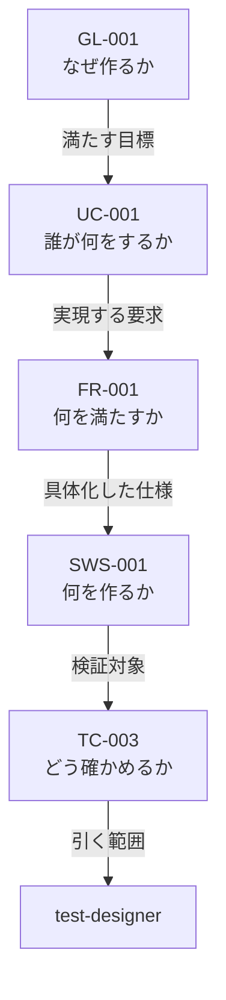

# 開発方式 対応表（2026-08-10）

開発方式を 1 つ決めれば、仕様書・フェーズ・エージェント・プロセス・成果物・レビューがすべて決まる。その対応表である。

**本表が正である。** `02-spec-writing-rules.md` および `framework-src/` の既存文書と食い違う場合は、本表に合わせて相手側を直す。ただし本表が既存規則を変える箇所は、備考にその旨を明記する（黙って上書きしない）。

適用先: プロセス規則 §3.1.1。

開発方式は `簡易` / `標準` / `厳格` の 3 つ。全表の列はこの 3 つ ＋ `備考` である。

| 記号 | 意味 |
|---|---|
| `必須` / `実施` / `●` | 必ず行う |
| `免除` / `—` | 行わない |
| `条件付き` | 備考の条件に該当する場合のみ行う |
| `該当なし` | その列に条件が無い（表 0 のみ） |
| `◎` | レビューを行い、報告ファイルを残す（表 E-1 のみ） |
| `○` | レビューは行うが、報告ファイルは残さない（表 E-1 のみ） |
| `-` | 不要（表 E-1 のみ） |

**可否を表すセルの値は上記だけである。`任意` を使ってはならない（MUST NOT）。** 表 0・A・A-2・B-1・E-2 は記述値や数値を持つ表であり、この制限の対象外である。

---

## 1. 表 0 —— 開発方式の判定

setup フェーズの手順 `0b3` で判定し、`CLAUDE.md`「開発方式」節に記録する。`0b3` と「開発方式」節はいずれも未新設であり、段 1 で作る。

| | 簡易 | 標準 | 厳格 | 備考 |
|---|---|---|---|---|
| 期間 | 1 日以内で完了 | 1 日超 | 1 週間超 | 見積もりでよい |
| モジュール | 少数 | 複数 | 複数チーム相当の並列実装 | |
| 外部依存 | 最小限 | あり | 外部システム連携あり | |
| Critical | 該当なし | 該当なし | 有効なら期間・規模によらず厳格 | failure が人身・金銭・個人情報のいずれかに直結する場合 |
| 例 | サイコロアプリ、電卓、簡易 CLI、ユーティリティライブラリ | API サービス、DB 連携デスクトップアプリ | 業務システム、マイクロサービス群、決済・医療機器連携・認証基盤 | |

**Critical は他の行を上書きする。** 1 日で作る決済処理も厳格である。

条件付き 13 フラグ（開発方式とは独立に、個別に有効化する）: 法的調査 / 特許調査 / 技術動向調査 / 機能安全(HARA・FMEA・FTA) / アクセシビリティ(WCAG 2.1) / HW連携 / AI/LLM連携 / フレームワーク要求定義 / HW生産工程管理 / 製品i18n・l10n / 認証取得 / 運用・保守 / 実機テスト。判断基準と判断時期はプロセス規則 §3.4 に従う。

フラグは方式と独立なので、簡易でも有効になりうる。 その場合、担当するエージェントは方式によらず起動する（表 C の `条件付き`）。

---

## 2. 表 A —— 仕様書

| | 簡易 | 標準 | 厳格 | 備考 |
|---|---|---|---|---|
| 仕様形式 | ANMS | ANPS-part | ANPS-chapter | 本表が仕様形式の唯一の対応表である。 `02-spec-writing-rules.md` は形式の定義のみを持ち、方式との対応を持たない |
| 枚数 | 1 | 4 | 15 | Critical で厳格になった小さなプロジェクトでは、15 枚それぞれが小さくなるだけで枚数は減らない |
| 分割の単位 | 分割しない | 部 | 章 | |
| StrictDoc | 使わない | 使う | 使う | ANMS でも記法は同じ。export と検出クエリを使わないだけである |
| 文法ファイル | `spec-anms.sgra` | `spec.sgra` | `spec.sgra` | `tools/spec-query/` から仕様書フォルダへ複製する（MUST の本文は `02` の「文法の配置」節） |
| テンプレートの行数（記入前） | 664 行 | 697 行 | 758 行 | 骨格に各ノード型 2 件ずつを置いた状態。実プロジェクトの仕様書はこれより大きい |
| ファイル名 | `01-11-spec` | 4 枚 | 15 枚 | 一覧は `02` の「ファイル名」節が持つ |

---

## 3. 表 A-2 —— 誰が仕様書のどこを引くか

| 体（観点） | 簡易 | 標準 | 厳格 | 備考 |
|---|---|---|---|---|
| architect | 全文 | 全文 | 全文 | **要求は互いに関係するため、部分だけでは整合を判断できない** |
| implementer | 全文 | 全文 | 全文 | 同上。NFR は全 FR を横断する |
| security-reviewer | 全文 | 全文 | 全文 | 脅威は要求横断 |
| review-agent（R1 要求） | 全文 | 要求の部 | 要求の章 | 対象章の対応は `review-standards.md` が持つ |
| review-agent（R2・R4・R5・R7 設計） | 全文 | 設計の部 | 設計の章 | 同上 |
| review-agent（R6 テスト） | 全文 | テストの部 | テストの章 | 同上 |
| test-designer | 全文 | テストの部 ＋ 対象ノードの祖先 | テストの章 ＋ 対象ノードの祖先 | テストは対象ノード 1 つに紐づく |
| tester | 全文 | 自分が書く結果の節 ＋ 対応するケース | 同左 | 結果はケースに 1 対 1 で紐づく |
| user-manual-writer | 全文 | 要求の部 | 概要と UC の章 | 完成物の説明。要求の整合を判断しない |
| runbook-writer | 条件付き（全文） | 設計の部 | 概要と設計の章 | 運用・保守フラグが有効なとき |

「対象ノードの祖先」とは、対象ノードから親をたどった鎖である。

祖先は 4 ノードであって 4 章ではない。引く道具は未作成である（`tools/spec-query/` にあるのは `checks.jq` / `spec.sgra` / `spec-anms.sgra` の 3 つ）。段 6 で `ancestors.jq` を新設する。

---

## 4. 表 B-1 —— フェーズ別の手順数

条件付き 13 フラグがすべて無効・API 無し・配布のみ・NFR の数値目標なし、という前提の数である。フラグが有効になれば手順は増える。

| | 簡易 | 標準 | 厳格 | 備考（全手順数） |
|---|---:|---:|---:|---|
| Phase 0 セットアップ | 19 | 19 | 19 | 19。方式によらず減らせない |
| Phase 1 企画 | 9 | 9 | 9 | 9 |
| Phase 2 外部依存選定 | 0 | 0 | 0 | 7。HW・AI・フレームワークのいずれかが有効なとき実施 |
| Phase 3 設計 | 7 | 12 | 13 | 14 |
| Phase 4 実装 | 6 | 8 | 8 | 8 |
| Phase 5 テスト | 4 | 5 | 6 | 7 |
| Phase 6 納品 | 6 | 10 | 10 | 11 |
| Phase 7 運用・保守 | 0 | 0 | 0 | 6。運用・保守フラグが有効なとき実施 |
| フェーズ完了時の共通手順（1 フェーズあたり） | 3 | 7 | 7 | 7。簡易で残るのは Fa・Fc・Fd |
| 合計 | 69 | 105 | 107 | 同一前提での上限は 110（Phase 2・7 とその共通手順が落ちるため）。全 137 はフラグ全有効時の数 |

合計 = Σ(フェーズ手順) ＋ 共通手順 × 走行フェーズ数（本前提では 6）。

**ゲートは方式によらず免除しない。免除するのは手順であってゲートではない。**

> ゲートが要求する成果物を方式が免除する組み合わせがある（`GATE-DELIVERY` の runbook、`GATE-IMPL` の SAST、`GATE-DESIGN` の threat-model）。プロセス規則 §9.4.1 は deployment-design にしか「免除の記録をもって充足とする」を持たない。段 1 で全ゲートに同じ逃げ道を付ける。 それまで簡易は納品ゲートを通過できない。

---

## 5. 表 B-2 —— 手順別の実施可否

方式で差が出る手順と、条件で落ちうる手順を挙げる。ここに無い手順は全方式で実施する。手順の定義本体は `.claude/commands/full-auto-dev.md` にある。

| 手順 | 簡易 | 標準 | 厳格 | 備考 |
|---|:-:|:-:|:-:|---|
| 1d モック / PoC | 実施 | 実施 | 実施 | |
| 3e OpenAPI 生成 | 条件付き | 実施 | 実施 | API を持つ場合 |
| 3f 脅威モデリング | 条件付き | 実施 | 実施 | 外部からの入力経路がある場合（表 D-2 の 30） |
| 3g 可観測性設計 | 免除 | 実施 | 実施 | 表 D-2 の 27 |
| 3g2 deployment-design | 条件付き | 実施 | 実施 | 配布以外のデプロイ先がある場合（表 D-2 の 28） |
| 3h WBS 作成 | 免除 | 免除 | 実施 | 表 D-2 の 19 |
| 3i リスク台帳作成 | 免除 | 実施 | 実施 | 表 D-1 の 9 |
| 3j 安全分析（HARA / FMEA / FTA） | 条件付き | 条件付き | 条件付き | 機能安全フラグ（表 D-2 の 29）。Critical では必須 |
| 4b 可観測性の計装 | 免除 | 実施 | 実施 | 表 D-2 の 27 |
| 4c2 IaC 実装 | 条件付き | 実施 | 実施 | 配布以外のデプロイ先がある場合（表 D-2 の 28） |
| 4e SCA スキャン | 実施 | 実施 | 実施 | 依存が 0 件なら該当なしと記録する |
| 5c 性能テスト | 条件付き | 実施 | 実施 | 数値目標を持つ NFR がある場合（表 D-2 の 26） |
| 5c2 実機テスト | 条件付き | 条件付き | 条件付き | 実機テストフラグ |
| 5d 進捗曲線の更新 | 免除 | 免除 | 実施 | 表 D-2 の 21 |
| 6b〜6e デプロイ・監視・ロールバック | 条件付き | 実施 | 実施 | 配布以外のデプロイ先がある場合（表 D-2 の 28） |
| 6f2 ユーザーマニュアル | 実施 | 実施 | 実施 | 表 D-1 の 5 |
| 6f3 runbook | 条件付き | 条件付き | 条件付き | 運用・保守フラグ |
| Fb コストログ追記 | 免除 | 実施 | 実施 | 表 D-2 の 22 |
| Fd pipeline-state と executive-dashboard の更新 | 実施 | 実施 | 実施 | 簡易は pipeline-state のみ更新する。 executive-dashboard は表 D-2 の 23 に従い免除 |
| Fe ふりかえり | 免除 | 実施 | 実施 | 表 D-1 の 11 |
| Ff decree 適用 | 免除 | 実施 | 実施 | Fe に従属 |
| Fg 変更要求の処理 | 免除 | 条件付き | 条件付き | 仕様書承認後にユーザーから変更要求が出たとき（表 D-1 の 8） |

---

## 6. 表 C —— 起動するエージェント

`test-engineer` を `test-designer`（受入基準とテストコードを書く）と `tester`（実行して結果を記録する）に分ける。 役目が違うためである。名簿は 22 体から 23 体になる。

| # | エージェント | 簡易 | 標準 | 厳格 | 備考 |
|:-:|---|:-:|:-:|:-:|---|
| 1 | project-manager | ● | ● | ● | pipeline-state と decision を持つ |
| 2 | srs-writer | ● | ● | ● | |
| 3 | architect | ● | ● | ● | |
| 4 | implementer | ● | ● | ● | |
| 5 | test-designer | ● | ● | ● | test-plan と traceability を持つ。Ch9.1 / 10.1 / 11.1 のオーナー |
| 6 | tester | ● | ● | ● | defect と performance-report を持つ。Ch9.2 / 10.2 / 11.2 のオーナー |
| 7 | review-agent | ● | ● | ● | 回数と基準は表 E-1・E-2 |
| 8 | technical-authority | ● | ● | ● | ゲート判定 |
| 9 | license-checker | ● | ● | ● | 表 D-1 の 3 |
| 10 | kotodama-kun | ● | ● | ● | |
| 11 | security-reviewer | ● | ● | ● | 表 D-1 の 4・7 |
| 12 | user-manual-writer | ● | ● | ● | 表 D-1 の 5 |
| 13 | risk-manager | — | ● | ● | 表 D-1 の 9 |
| 14 | change-manager | — | 条件付き | 条件付き | 表 D-1 の 8。変更要求が出たとき |
| 15 | process-improver | — | ● | ● | 表 D-1 の 11 |
| 16 | decree-writer | — | ● | ● | process-improver に従属 |
| 17 | progress-monitor | — | ● | ● | 表 D-2 の 20 |
| 18 | runbook-writer | 条件付き | 条件付き | 条件付き | 運用・保守フラグ。フラグは方式と独立なので簡易でも起動しうる |
| 19 | incident-reporter | 条件付き | 条件付き | 条件付き | 同上 |
| 20 | field-test-engineer | 条件付き | 条件付き | 条件付き | 実機テストフラグ。同上 |
| 21 | feedback-classifier | 条件付き | 条件付き | 条件付き | 同上 |
| 22 | field-issue-analyst | 条件付き | 条件付き | 条件付き | 同上 |
| 23 | framework-translation-verifier | — | — | — | パイプラインでは起動しない。フレームワーク文書の保守用 |
| | 無条件で起動する体数 | 12 | 17 | 17 | |
| | 条件付きを含む上限 | 17 | 22 | 22 | |

標準と厳格で起動する体は同じである。差は §12 を見る。

> 名簿の正本は `agent-list.md` §1 である。 本表は方式ごとの起動可否だけを持つ。`test-designer` / `tester` の追加は `agent-list.md` の新規エージェント追加手順（6 段）を通す（段 1）。`glossary.md:63-64` は両者を定義済みだが、名簿には未登録である。

---

## 7. 表 D-1 —— プロセス

簡易が行うものを上に置いた。

| # | プロセス | 簡易 | 標準 | 厳格 | 備考 |
|:-:|---|:-:|:-:|:-:|---|
| 1 | トレーサビリティ管理 | 必須 | 必須 | 必須 | 仕様書の親子関係そのもの |
| 2 | 監査記録管理（decision） | 必須 | 必須 | 必須 | 簡易は記録形式を簡略化してよい |
| 3 | ライセンス管理 | 必須 | 必須 | 必須 | 依存を足すときに動く |
| 4 | SCA（依存ライブラリの既知脆弱性調査） | 必須 | 必須 | 必須 | `npm audit` 等 |
| 5 | ユーザードキュメント・マニュアル作成 | 必須 | 必須 | 必須 | 表 C-12 の根拠 |
| 6 | 問題管理（defect / CR） | 条件付き | 必須 | 必須 | 簡易は同じ defect が再発したときのみ票を起こす |
| 7 | SAST（自コードの静的脆弱性解析） | 条件付き | 必須 | 必須 | CodeQL 等。簡易は外部入力を扱う場合のみ |
| 8 | 変更管理 | 免除 | 必須 | 必須 | 簡易は仕様書を直接直す |
| 9 | リスク管理 | 免除 | 必須 | 必須 | |
| 10 | コスト管理 | 免除 | 必須 | 必須 | 記録先は表 D-2 の 22 |
| 11 | プロセス改善・再発防止（CAR / OPF） | 免除 | 必須 | 必須 | 表 C-15・C-16 の根拠 |
| 12 | ドキュメント版管理 | 免除 | 必須 | 必須 | |
| 13 | リリース管理 | 免除 | 条件付き | 必須 | 複数バージョンを並行保守するとき（標準） |
| 14 | ステークホルダー管理 | 免除 | 条件付き | 必須 | ステークホルダーが複数いるとき（標準） |
| 15 | API バージョニング・後方互換性 | 免除 | 条件付き | 条件付き | 第三者に公開する API を持つ場合 |
| 16 | トレーニング・知識移転 | 条件付き | 条件付き | 条件付き | 運用・保守フラグが有効で、運用チームへ引き継ぐとき |
| 17 | 並列実装（Git worktree） | 免除 | 免除 | 必須 | 1 つのリポジトリに作業ディレクトリを複数作り、各エージェントが専用ブランチで同時に書く |

> 本表は現行のプロセス規則 §3.2・§3.3（16 件）と一致しない。 `コミュニケーション管理`（§3.3.2）を削り、`SAST / SCA` を 2 件に割り、`並列実装` を新設して 17 件にした。段 1 で §3.2・§3.3 の側も同じ 17 件へ改める。 どちらか一方だけを変えてはならない（MUST NOT）。

---

## 8. 表 D-2 —— 成果物

レビュー報告は本表に含まない。表 E-1 が持つ。

| # | 成果物 | 簡易 | 標準 | 厳格 | 備考 |
|:-:|---|:-:|:-:|:-:|---|
| 18 | pipeline-state | 必須 | 必須 | 必須 | **方式によらず必須。中断からの再開に必要な唯一の状態記録である** |
| 19 | WBS / ガントチャート | 免除 | 免除 | 必須 | 表 D-1 の 17 に従う |
| 20 | 進捗レポート（progress/） | 免除 | 必須 | 必須 | フェーズごとの品質メトリクス。ゲート判定が参照する |
| 21 | 進捗曲線（テスト消化曲線・defect curve） | 免除 | 免除 | 必須 | 経時の傾きを見る道具 |
| 22 | cost-log.json | 免除 | 必須 | 必須 | 表 D-1 の 10 と対 |
| 23 | executive-dashboard.md | 免除 | 必須 | 必須 | |
| 24 | 日次レポート（daily-report.md） | 免除 | 免除 | 必須 | |
| 25 | stakeholder-register.md | 免除 | 条件付き | 必須 | ステークホルダーが複数いる場合（標準） |
| 26 | 性能テスト（k6 等） | 条件付き | 必須 | 必須 | 数値目標を持つ NFR がある場合（簡易） |
| 27 | 可観測性設計 | 免除 | 必須 | 必須 | |
| 28 | deployment-design | 条件付き | 必須 | 必須 | 配布以外のデプロイ先がある場合（簡易） |
| 29 | 機能安全分析（HARA / FMEA / FTA） | 条件付き | 条件付き | 条件付き | 機能安全フラグ。Critical では必須 |
| 30 | 脅威モデリング（STRIDE） | 条件付き | 必須 | 必須 | 外部からの入力経路がある場合（簡易） |
| 31 | risk-register | 免除 | 必須 | 必須 | 表 D-1 の 9 と対。表 C-13 の根拠 |
| 32 | change-request | 免除 | 条件付き | 条件付き | 表 D-1 の 8 と対。表 C-14 の根拠 |
| 33 | retrospective-report | 免除 | 必須 | 必須 | 表 D-1 の 11 と対。表 C-15 の根拠 |
| 34 | runbook | 条件付き | 条件付き | 条件付き | 運用・保守フラグ。表 C-18 の根拠 |
| 35 | incident-report | 条件付き | 条件付き | 条件付き | 運用・保守フラグ。表 C-19 の根拠 |
| 36 | field-issue | 条件付き | 条件付き | 条件付き | 実機テストフラグ。表 C-20〜22 の根拠 |

---

## 9. 表 E-1 —— フェーズごとのレビューと報告

| 記号 | 意味 |
|:-:|---|
| ◎ | レビューを行い、`project-records/reviews/` に報告ファイルを残す |
| ○ | レビューは行うが、報告ファイルは残さない。結果は最終報告にまとめる |
| - | 不要 |

| フェーズ / 観点 | 簡易 | 標準 | 厳格 | 備考 |
|---|:-:|:-:|:-:|---|
| Phase 1 R1（要求品質） | ○ | ◎ | ◎ | 観点 1 件 |
| Phase 3 R2・R4・R5・R7（設計品質） | ○ | ◎ | ◎ | 観点 4 件 |
| Phase 4 R2・R3・R4・R5・R7（実装品質） | ○ | ◎ | ◎ | 観点 5 件 |
| Phase 5 R6（テスト品質） | ○ | ◎ | ◎ | 観点 1 件 |
| Phase 6 R1〜R7（最終） | ◎ | ◎ | ◎ | 観点 7 件。簡易はここで R1〜R7 を網羅する |
| 再レビュー（修正後） | - | ◎ | ◎ | 標準は「修正済み」とした指摘のみ。厳格は全指摘 |
| 観点ごとに別走行 | - | - | ◎ | 厳格は R1〜R7 を混ぜない |

報告ファイルの本数: 簡易 1 本 / 標準 5 本 ＋ 再レビュー分 / 厳格 18 本 ＋ 再レビュー分（各フェーズの観点数 1+4+5+1+7 の総和。積ではない）。

**ゲートは全方式で 8 つとも判定する。省けるのは報告ファイルであってレビューではない。**

> どの観点がどの章を見るかは `review-standards.md` が持つ。 本表は方式ごとに報告を残すかだけを持つ。

---

## 10. 表 E-2 —— レビューの基準

重大度は 4 段（Critical / High / Medium / Low）で全方式共通。

| | 簡易 | 標準 | 厳格 | 備考 |
|---|---|---|---|---|
| 合格線（Critical） | 0 | 0 | 0 | `review-standards.md`「重大度別の対応ルール」に従う |
| 合格線（High） | 0 | 0 | 0 | 同上 |
| 合格線（Medium） | 対応記録があればよい | 対応記録があればよい | 0（修正済みのみ） | **厳格は既存規則を厳しくする。** 既存は据置き・受容を許容する |
| 合格線（Low） | 記録不要 | 対応記録があればよい | 対応記録があればよい | **簡易は既存規則を緩める。** 既存は全規模で対応記録を要求する |
| ゲート FAIL 時のエスカレーション | 3 回目 | 3 回目 | 2 回目 | **厳格の「2 回目」は本表で新設する。** プロセス規則 §9.1.1 の再試行ポリシー表は 1-2 回目 / 3 回目の 2 段しか持たない |
| waiver | 3 条件（ユーザー承認・tech-decision 記録・final-report 転記） | 同左 | 同左 | 3 条件は §9.1.1 に従う。再評価時期の記録は条件 2 に含まれ、全方式で必須である |

> 既存規則を変える 3 行（Medium の厳格・Low の簡易・エスカレーションの厳格）は、段 1 で `review-standards.md` と §9.1.1 の側にも同じ変更を入れる。**片方だけ変えてはならない（MUST NOT）。**

---

## 11. 簡易で何が動くか

| | 内容 |
|---|---|
| 仕様書 | ANMS 1 枚 |
| 手順 | 69（同一前提での上限 110 のうち） |
| エージェント | 無条件 12 体 —— project-manager / srs-writer / architect / implementer / test-designer / tester / review-agent / technical-authority / license-checker / kotodama-kun / security-reviewer / user-manual-writer。条件付きフラグが有効なら最大 17 体 |
| 必須プロセス | 5 件 —— トレーサビリティ管理 / 監査記録管理 / ライセンス管理 / SCA / ユーザードキュメント作成 |
| 条件付きプロセス | 3 件 —— 問題管理 / SAST / トレーニング・知識移転 |
| 必須の成果物 | 1 件 —— pipeline-state |
| レビュー報告 | 1 本（Phase 6 で R1〜R7 網羅）。合格線 Critical 0 / High 0 |
| ゲート | 全 8 ゲートを判定する |

---

## 12. 標準と厳格の違い

起動するエージェントは同じ 22 体（条件付き含む）である。差は次の 15 行に出る。

### 12.1 並列で作るかどうか

| 行 | 標準 | 厳格 | 何が変わるか |
|---|:-:|:-:|---|
| 表 D-1 の 17 並列実装（Git worktree） | 免除 | 必須 | 標準は単線で進める |
| 表 D-2 の 19 WBS / ガントチャート | 免除 | 必須 | 並列する担い手がいて工程表が要る |
| 表 B-2 の 3h WBS 作成 | 免除 | 実施 | 上に従う |

### 12.2 経時で追うかどうか

| 行 | 標準 | 厳格 | 何が変わるか |
|---|:-:|:-:|---|
| 表 D-2 の 21 進捗曲線 | 免除 | 必須 | 1 週間未満の走行では点が足りない |
| 表 D-2 の 24 日次レポート | 免除 | 必須 | 日をまたぐ走行で意味を持つ |
| 表 B-2 の 5d 進捗曲線の更新 | 免除 | 実施 | 上に従う |

### 12.3 関係者が増えるかどうか

| 行 | 標準 | 厳格 | 何が変わるか |
|---|:-:|:-:|---|
| 表 D-1 の 13 リリース管理 | 条件付き | 必須 | 複数バージョンの並行保守 |
| 表 D-1 の 14 ステークホルダー管理 | 条件付き | 必須 | 関与者が複数 |
| 表 D-2 の 25 stakeholder-register.md | 条件付き | 必須 | 上に従う |

### 12.4 どれだけ厳しく見るか

| 行 | 標準 | 厳格 | 何が変わるか |
|---|---|---|---|
| 表 E-1 観点ごとに別走行 | - | ◎ | R1〜R7 を混ぜない |
| 表 E-1 報告ファイルの本数 | 5 ＋ 再レビュー分 | 18 ＋ 再レビュー分 | 上に従う |
| 表 E-1 再レビューの範囲 | 「修正済み」とした指摘のみ | 全指摘 | 据置き・受容も検証する。セルの値は両方 ◎ で、差は範囲にある |
| 表 E-2 Medium の合格線 | 対応記録があればよい | 0（修正済みのみ） | 据置き・受容を認めない |
| 表 E-2 エスカレーション | FAIL 3 回目 | FAIL 2 回目 | 早くユーザーへ上げる |

手順数の差は 2 手順（105 → 107）にすぎない。差の本体は成果物とレビューの厳しさである。

> 仕様書の分割（表 A・A-2）と手順数（表 B-1）にも差がある。 本節が挙げるのは表 D・E の差だけである。

---

## 13. 本表が満たすべき検査

`tools/check-mode-matrix.mjs` が確かめる。同ファイルは未作成であり、段 1 で新設する。

| # | 判定 |
|:-:|---|
| 1 | 全表の列が `簡易` / `標準` / `厳格` / `備考` である |
| 2 | 可否を表すセル（表 B-2・C・D-1・D-2）に `任意` が無い |
| 3 | `Micro` / `Small` / `Standard` / `Large` / `中規模以上` / `通常` / `厳密` が区分名として 0 件 |
| 4 | 表 E-1 のフェーズ / 観点の行の値が `◎` / `○` / `-` のいずれかである |
| 5 | 表 C のエージェント名が `agent-list.md` §1 と過不足なく一致する（`test-designer` / `tester` 追加後の 23 体） |
| 6 | 表 D-1 のプロセス名がプロセス規則 §3.2・§3.3 と過不足なく一致する（両者を 17 件へ揃えた後） |
| 7 | 表 B-2 の手順記号が `.claude/commands/full-auto-dev.md` に実在する（`0b3` 新設後は表 0 の参照も含む） |
| 8 | `条件付き` のセルには備考に条件が書かれている |
| 9 | 表 D-2 に現れる成果物について、表 C で `—` の体が所有するものが同じ方式で `免除` になっている |
| 10 | 表 B-1 の合計が、表 B-2 の免除を差し引いた数と一致する（共通手順は走行フェーズ数を掛ける） |
| 11 | 表 E-2 の重大度が `review-standards.md`「重大度別の対応ルール」の 4 段と一致する |
| 12 | §12 に挙げた行が、表 D・E で実際に標準と厳格の値が異なる行と一致する |
| 13 | 本表が「既存規則を変える」と明記した箇所が、`framework-src/` 側にも反映されている |
| 14 | 既知の欠陥（表 C に存在しないエージェント名を 1 件仕込む）で FAIL する |
