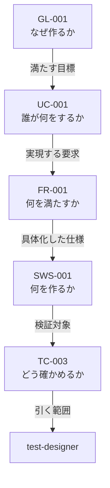

# 開発方式 対応表（2026-08-10）

開発方式を 1 つ決めれば、仕様書・フェーズ・エージェント・プロセス・成果物・レビューがすべて決まる。その対応表である。

**本表が正である。** `02-spec-writing-rules.md` および `framework-src/` の既存文書と食い違う場合は、本表に合わせて相手側を直す。ただし本表が既存規則を変える箇所は、備考にその旨を明記する（黙って上書きしない）。

適用先: プロセス規則 §3.1.1。

開発方式は `簡易` / `標準` / `厳格` の 3 つ。**方式の列はこの 3 つ ＋ `備考` である。識別列（`手順`・`作業`・`主担当`・`関連`・`出力` 等）は表ごとに異なってよい。**

| 記号 | 意味 |
|---|---|
| `必須` / `実施` / `●` | 必ず行う |
| `免除` / `—` | 行わない |
| `条件付き` | 備考の条件に該当する場合のみ行う |
| `該当なし` | その列に条件が無い（表 0 のみ） |
| `◎` | レビューを行い、報告ファイルを残す（表 E-1 のみ） |
| `○` | レビューは行うが、報告ファイルは残さない（表 E-1 のみ） |
| `-` | 不要（表 E-1 のみ） |
| **`新設`** | **手順記号が無い。新しく作る**（作業表のみ） |
| **`統合`** | **既存の複数手順を 1 つにまとめる**（作業表のみ） |
| **`分割`** | **既存の 1 手順を 2 つに割る**（作業表のみ） |

**可否を表すセルの値は上記だけである。`任意` を使ってはならない（MUST NOT）。** 表 0・A・A-2・E-2 は記述値を持つ表であり、この制限の対象外である。

> **表 B-1・B-2・C・D-1・D-2 は廃止した。** §4 と §5 の作業表に統合し、エージェントの起動可否・成果物・手順数は作業表から導出する。導出の規則は §10 の検査が持つ。

---

## 1. 表 0 —— 開発方式の判定

setup フェーズで判定し、`CLAUDE.md`「開発方式」節に記録する（§4.1 の `新設` 行）。**手順も「開発方式」節もまだ存在しない。**

| | 簡易 | 標準 | 厳格 | 備考 |
|---|---|---|---|---|
| 期間 | 1 日以内で完了 | 1 日超 | 1 週間超 | 見積もりでよい |
| モジュール | 少数 | 複数 | 複数チーム相当の並列実装 | |
| 外部依存 | 最小限 | あり | 外部システム連携あり | |
| Critical | 該当なし | 該当なし | 有効なら期間・規模によらず厳格 | failure が人身・金銭・個人情報のいずれかに直結する場合 |
| 例 | サイコロアプリ、電卓、簡易 CLI、ユーティリティライブラリ | API サービス、DB 連携デスクトップアプリ | 業務システム、マイクロサービス群、決済・医療機器連携・認証基盤 | |

**Critical は他の行を上書きする。** 1 日で作る決済処理も厳格である。

条件付き 13 フラグ（開発方式とは独立に、個別に有効化する）: 法的調査 / 特許調査 / 技術動向調査 / 機能安全(HARA・FMEA・FTA) / アクセシビリティ(WCAG 2.1) / HW連携 / AI/LLM連携 / フレームワーク要求定義 / HW生産工程管理 / 製品i18n・l10n / 認証取得 / 運用・保守 / 実機テスト。判断基準と判断時期はプロセス規則 §3.4 に従う。

フラグは方式と独立なので、簡易でも有効になりうる。 その場合、担当するエージェントは方式によらず起動する（作業表の `条件付き`）。

---

## 2. 表 A —— 仕様書

| | 簡易 | 標準 | 厳格 | 備考 |
|---|---|---|---|---|
| 仕様形式 | ANMS | ANPS-part | ANPS-chapter | 本表が仕様形式の唯一の対応表である。 `02-spec-writing-rules.md` は形式の定義のみを持ち、方式との対応を持たない |
| 枚数 | 1 | 4 | 14 | Critical で厳格になった小さなプロジェクトでは、14 枚それぞれが小さくなるだけで枚数は減らない |
| 分割の単位 | 分割しない | 部 | 章 | |
| StrictDoc | 使わない | 使う | 使う | ANMS でも記法は同じ。export と検出クエリを使わないだけである |
| 文法ファイル | `spec-anms.sgra` | `spec.sgra` | `spec.sgra` | `tools/spec-query/` から仕様書フォルダへ複製する（MUST の本文は `02` の「文法の配置」節） |
| テンプレートの行数（記入前） | **再計測** | **再計測** | **再計測** | Chapter 8 の削除後に測り直す。仕様書テンプレートに各ノード型 2 件ずつを置いた状態 |
| ファイル名 | `01-10-spec` | 4 枚 | 14 枚 | 一覧は `02` の「ファイル名と番号の規則」節が持つ |

---

## 3. 表 A-2 —— 誰が仕様書のどこを引くか

| 体（観点） | 簡易 | 標準 | 厳格 | 備考 |
|---|---|---|---|---|
| architect | 全文 | 全文 | 全文 | **要求は互いに関係するため、部分だけでは整合を判断できない** |
| implementer | 全文 | 全文 | 全文 | 同上。NFR は全 FR を横断する |
| security-reviewer | 全文 | 全文 | 全文 | 脅威は要求横断 |
| review-agent（R1 要求） | 全文 | 要求の部 | 要求の章 | 対象章の対応は `review-standards.md` が持つ |
| review-agent（R2・R4・R5・R7 設計） | 全文 | 設計の部 | 設計の章 | 同上 |
| review-agent（R6 テスト） | 全文 | テストの部 | テストの章 | 同上 |
| test-designer | 全文 | テストの部 ＋ 対象ノードの祖先 | テストの章 ＋ 対象ノードの祖先 | テストは対象ノード 1 つに紐づく |
| tester | 全文 | 自分が書く結果の節 ＋ 対応するケース | 同左 | 結果はケースに 1 対 1 で紐づく |
| user-manual-writer | 全文 | 要求の部 | 概要と UC の章 | 完成物の説明。要求の整合を判断しない |
| runbook-writer | 条件付き（全文） | 設計の部 | 概要と設計の章 | 運用・保守フラグが有効なとき |

「対象ノードの祖先」とは、対象ノードから親をたどった鎖である。

祖先は 4 ノードであって 4 章ではない。引く道具は未作成である（`tools/spec-query/` にあるのは `checks.jq` / `spec.sgra` / `spec-anms.sgra` の 3 つ）。段 6 で `ancestors.jq` を新設する。

---
## 4. 作業表 —— フェーズの流れ

### 4.1 Phase 0 セットアップ

| 手順 | 作業 | 主担当 | 関連 | 出力 | 簡易 | 標準 | 厳格 | 備考 |
|---|---|---|---|---|:-:|:-:|:-:|---|
| `0a` | user-order.md を読み込む | project-manager | — | — | 実施 | 実施 | 実施 | |
| `0b` | user-order.md をバリデーションする | srs-writer | project-manager | — | 実施 | 実施 | 実施 | 不足はインタビューで解消する。user-order 自体は直さない |
| `0b2` | CLAUDE.md を提案する | project-manager | — | CLAUDE.md | 実施 | 実施 | 実施 | |
| **新設** | **開発方式（簡易 / 標準 / 厳格）を決める** | project-manager | — | decision | 実施 | 実施 | 実施 | **表 0 で判定し CLAUDE.md「開発方式」節へ記録する。節も未新設** |
| **新設** | **ステークホルダー登録簿を作る** | project-manager | — | stakeholder-register | 免除 | 条件付き | 実施 | ステークホルダーが複数いるとき（標準） |
| **統合** | **条件付き 13 プロセスの要否を一括で評価する** | project-manager | — | decision | 実施 | 実施 | 実施 | **旧 `0c`〜`0n2` の 13 手順を 1 つにまとめる。** 判断基準はプロセス規則 §3.4 が持つ。**13 手順が決めるのは「どのプロセスと成果物を回すか」であり、判断の単位は 1 つでよい** |
| `0o` | 評価結果を報告し確認を求める | project-manager | — | — | 実施 | 実施 | 実施 | |
| `0p` | pipeline-state を初期化する | project-manager | — | pipeline-state | 実施 | 実施 | 実施 | |

**Phase 0 の手順数が 19 → 8 になる。** 統合で 12 減り、新設で 1 増える（ステークホルダーは簡易で免除）。

### 4.2 Phase 1 企画

| 手順 | 作業 | 主担当 | 関連 | 出力 | 簡易 | 標準 | 厳格 | 備考 |
|---|---|---|---|---|:-:|:-:|:-:|---|
| `1a` | user-order.md を解析する | srs-writer | — | — | 実施 | 実施 | 実施 | |
| `1b` | 構造化インタビューを実施する | srs-writer | — | — | 実施 | 実施 | 実施 | |
| `1c` | インタビュー結果を記録し確認を求める | srs-writer | — | interview-record | 実施 | 実施 | 実施 | |
| `1d` | モック / サンプル / PoC を作る | srs-writer | — | — | 実施 | 実施 | 実施 | |
| `1e` | 仕様書の要求の章を作り、要求に ID を付ける | srs-writer | test-designer | spec-foundation ／ **traceability** | 実施 | 実施 | 実施 | **トレーサビリティの起点** |
| `1f` | 以降の章のスケルトンを置く | srs-writer | — | spec-foundation | 実施 | 実施 | 実施 | |
| `1g` | 仕様書の概要を報告し承認を求める | srs-writer | project-manager | — | 実施 | 実施 | 実施 | |
| `1h` | 要求の品質レビュー（R1） | review-agent | srs-writer | review | 実施 | 実施 | 実施 | 報告を残すかは表 E-1 |
| `1i` | GATE-INTERVIEW と GATE-PLANNING を判定する | technical-authority | project-manager | — | 実施 | 実施 | 実施 | **1 手順で 2 ゲート。割るかは未決** |

### 4.3 Phase 2 外部依存選定

**HW・AI・フレームワークのいずれかが有効なときだけ走る。** 全 7 手順が同じ条件に従う。

| 手順 | 作業 | 主担当 | 関連 | 出力 | 簡易 | 標準 | 厳格 | 備考 |
|---|---|---|---|---|:-:|:-:|:-:|---|
| `2a` | Phase 0 の評価結果を確認する | project-manager | — | — | 条件付き | 条件付き | 条件付き | 以下すべて同じ条件 |
| `2b` | 外部依存を評価・選定する | architect | — | — | 条件付き | 条件付き | 条件付き | |
| `2c` | 各外部依存の requirement-spec を作る | architect | — | requirement-spec | 条件付き | 条件付き | 条件付き | |
| `2d` | Adapter 層の I/F を設計する | architect | — | — | 条件付き | 条件付き | 条件付き | |
| `2e` | 選定結果を decision に記録する | project-manager | architect | decision | 条件付き | 条件付き | 条件付き | |
| `2f` | 選定結果を報告し承認を求める | project-manager | — | — | 条件付き | 条件付き | 条件付き | |
| `2g` | GATE-DEPENDENCY を判定する | technical-authority | project-manager | — | 条件付き | 条件付き | 条件付き | |

### 4.4 Phase 3 設計

| 手順 | 作業 | 主担当 | 関連 | 出力 | 簡易 | 標準 | 厳格 | 備考 |
|---|---|---|---|---|:-:|:-:|:-:|---|
| `3a` | 設計の章を詳細化し、レイヤー仕訳を行う | architect | — | spec ／ **traceability** | 実施 | 実施 | 実施 | 設計ノードの親を張る |
| `3a2` | アーキテクチャをユーザーが確認するか尋ねる | architect | project-manager | decision | 実施 | 実施 | 実施 | 尋ねずに進んではならない |
| `3b` | ソフトウェア仕様の章を詳細化する | architect | — | spec ／ **traceability** | 実施 | 実施 | 実施 | |
| `3c` | テスト戦略の章を定義する | architect | test-designer | spec | 実施 | 実施 | 実施 | |
| ~~`3d`~~ | ~~設計原則 準拠確認の章を設定する~~ | — | — | — | — | — | — | **削除。Chapter 8 の削除に伴う** |
| `3e` | OpenAPI を生成する | architect | — | openapi | 条件付き | 実施 | 実施 | API を持つ場合 |
| **新設** | **API バージョニング戦略・非推奨通知ポリシーを定める** | architect | — | ADR | 免除 | 条件付き | 条件付き | 第三者に公開する API を持つ場合 |
| `3f` | 脅威モデリングとセキュリティ設計 | security-reviewer | architect | threat-model ／ security-architecture | 条件付き | 実施 | 実施 | 外部からの入力経路がある場合 |
| `3g` | 可観測性設計を作る | architect | — | observability-design | 免除 | 実施 | 実施 | |
| `3g2` | デプロイ設計を作る | architect | — | deployment-design | 条件付き | 実施 | 実施 | 配布以外のデプロイ先がある場合 |
| `3h` | WBS とガントチャートを作る | progress-monitor | project-manager | wbs | 免除 | 免除 | 実施 | 並列実装が要求する |
| `3i` | リスク台帳を作る | risk-manager | — | risk-register | 免除 | 実施 | 実施 | |
| `3j` | 安全分析（HARA / FMEA / FTA） | security-reviewer | architect | safety | 条件付き | 条件付き | 条件付き | 機能安全フラグ。Critical では必須 |
| `3k` | 設計の品質レビュー（R2 / R4 / R5 / R7） | review-agent | architect | review | 実施 | 実施 | 実施 | |
| `3l` | GATE-DESIGN を判定する | technical-authority | project-manager | — | 実施 | 実施 | 実施 | |

### 4.5 Phase 4 実装

| 手順 | 作業 | 主担当 | 関連 | 出力 | 簡易 | 標準 | 厳格 | 備考 |
|---|---|---|---|---|:-:|:-:|:-:|---|
| `4a` | コードを実装する | implementer | project-manager | — | 実施 | 実施 | 実施 | **厳格は Git worktree で並列実装する。** worktree の割当は project-manager |
| `4b` | 構造化ログ・メトリクス・トレーシングを組み込む | implementer | — | — | 免除 | 実施 | 実施 | |
| `4c` | 単体テストを作成・実行する | implementer | test-designer | — | 実施 | 実施 | 実施 | **作成と実行を同じ体が行う唯一のテスト。** `5a` `5b` と揃えるかは未決（§4.4） |
| `4c2` | IaC コードを実装する | implementer | — | — | 条件付き | 実施 | 実施 | 配布以外のデプロイ先がある場合 |
| `4d` | 実装コードのレビュー（R2 / R3 / R4 / R5 / R7） | review-agent | implementer | review | 実施 | 実施 | 実施 | |
| `4e` | SCA スキャンを走らせる | security-reviewer | license-checker | security-scan-report | 実施 | 実施 | 実施 | 依存が 0 件なら該当なしと記録する |
| **新設** | **SAST を走らせる** | security-reviewer | — | security-scan-report | 条件付き | 実施 | 実施 | **`4e` は SCA のみ。** 簡易は外部入力を扱う場合のみ |
| `4f` | ライセンスを確認する | license-checker | — | license-report | 実施 | 実施 | 実施 | |
| `4g` | GATE-IMPL を判定する | technical-authority | project-manager | — | 実施 | 実施 | 実施 | |

### 4.6 Phase 5 テスト

| 手順 | 作業 | 主担当 | 関連 | 出力 | 簡易 | 標準 | 厳格 | 備考 |
|---|---|---|---|---|:-:|:-:|:-:|---|
| **分割** | **結合テストの受入基準とテストコードを書く** | test-designer | architect | test-plan ／ **traceability** | 実施 | 実施 | 実施 | **旧 `5a` の前半** |
| **分割** | **結合テストを実行し結果を記録する** | tester | test-designer | — | 実施 | 実施 | 実施 | **旧 `5a` の後半** |
| **分割** | **システムテストの受入基準とテストコードを書く** | test-designer | architect | test-plan | 実施 | 実施 | 実施 | **旧 `5b` の前半** |
| **分割** | **システムテストを実行し結果を記録する** | tester | test-designer | — | 実施 | 実施 | 実施 | **旧 `5b` の後半** |
| `5c` | 性能テストを実行し結果を記録する | tester | test-designer | performance-report | 条件付き | 実施 | 実施 | 数値目標を持つ NFR がある場合 |
| `5c2` | 実機テストを実施し、分類・原因分析を行う | field-test-engineer | feedback-classifier ／ field-issue-analyst | field-issue | 条件付き | 条件付き | 条件付き | 実機テストフラグ |
| `5d` | テスト消化曲線と defect curve を更新する | progress-monitor | tester | — | 免除 | 免除 | 実施 | |
| `5e` | テストコードのレビュー（R6） | review-agent | test-designer | review | 実施 | 実施 | 実施 | |
| `5f` | GATE-TEST を判定する | technical-authority | project-manager | — | 実施 | 実施 | 実施 | |

**Phase 5 の手順数が 7 → 9 になる。** 分割で 2 増える。

### 4.7 Phase 6 納品

| 手順 | 作業 | 主担当 | 関連 | 出力 | 簡易 | 標準 | 厳格 | 備考 |
|---|---|---|---|---|:-:|:-:|:-:|---|
| `6a` | 全成果物の最終レビュー（R1〜R7） | review-agent | 全オーナー | review | 実施 | 実施 | 実施 | |
| **新設** | **リリース判定チェックリストを運用する** | project-manager | technical-authority | release-checklist | 免除 | 条件付き | 実施 | 複数バージョンを並行保守するとき（標準） |
| `6b`〜`6e` | コンテナビルド・デプロイ・監視確認・ロールバック手順 | implementer | — | — | 条件付き | 実施 | 実施 | 4 手順。配布以外のデプロイ先がある場合 |
| `6f` | 最終レポートを作る | project-manager | — | final-report | 実施 | 実施 | 実施 | |
| `6f2` | ユーザーマニュアルを作る | user-manual-writer | — | user-manual | 実施 | 実施 | 実施 | |
| `6f3` | 運用手順書と引継ぎ資料を作る | runbook-writer | user-manual-writer | runbook | 条件付き | 条件付き | 条件付き | 運用・保守フラグ。**トレーニング・知識移転もここに乗る** |
| `6g` | 受入テスト手順書を作る | test-designer | — | — | 実施 | 実施 | 実施 | **受入基準を書く側なので test-designer** |
| `6g2` | GATE-DELIVERY を判定する | technical-authority | project-manager | — | 実施 | 実施 | 実施 | |
| `6h` | 完了を報告する | project-manager | — | — | 実施 | 実施 | 実施 | |

### 4.8 Phase 7 運用・保守

**運用・保守フラグが有効なときだけ走る。** 全 6 手順が同じ条件に従う。

| 手順 | 作業 | 主担当 | 関連 | 出力 | 簡易 | 標準 | 厳格 | 備考 |
|---|---|---|---|---|:-:|:-:|:-:|---|
| `7a` | incident management 体制を確立する | incident-reporter | project-manager | — | 条件付き | 条件付き | 条件付き | 以下すべて同じ条件 |
| `7b` | パッチ適用とスキャンの定期実行を設定する | security-reviewer | — | — | 条件付き | 条件付き | 条件付き | |
| `7c` | SLA 監視を確認する | progress-monitor | — | — | 条件付き | 条件付き | 条件付き | |
| `7d` | 復旧手順の訓練を計画する | runbook-writer | — | — | 条件付き | 条件付き | 条件付き | |
| `7e` | incident 報告書と根本原因分析を作る | incident-reporter | process-improver | incident-report | 条件付き | 条件付き | 条件付き | |
| `7f` | GATE-EOL を判定する | technical-authority | project-manager | — | 条件付き | 条件付き | 条件付き | 終了する場合 |

---

## 5. 作業表 —— 並行して回るもの

### 5.1 フェーズ完了時（共通手順）

**走行フェーズごとに 1 回。**

| 手順 | 作業 | 主担当 | 関連 | 出力 | 簡易 | 標準 | 厳格 | 備考 |
|---|---|---|---|---|:-:|:-:|:-:|---|
| `Fa` | 当該フェーズの全 Out の用語・命名をチェックする | kotodama-kun | 全オーナー | — | 実施 | 実施 | 実施 | |
| `Fb` | トークン消費とコストを追記する | progress-monitor | — | cost-log.json | 免除 | 実施 | 実施 | |
| `Fc` | 文脈の圧縮が起きていたら session-handoff を残す | project-manager | — | session-handoff | 実施 | 実施 | 実施 | |
| `Fd` | pipeline-state と executive-dashboard を更新し報告する | project-manager | — | pipeline-state ／ executive-dashboard | 実施 | 実施 | 実施 | 簡易は pipeline-state のみ |
| `Fe` | ふりかえりと根本原因分析を行う | process-improver | project-manager | retrospective-report | 免除 | 実施 | 実施 | |
| `Ff` | 承認済み改善策をガバナンスファイルへ適用する | decree-writer | process-improver | — | 免除 | 実施 | 実施 | `Fe` に従属 |

### 5.2 随時（条件で発火する）

| 手順 | 作業 | 主担当 | 関連 | 出力 | 簡易 | 標準 | 厳格 | 備考 |
|---|---|---|---|---|:-:|:-:|:-:|---|
| `Fg` | 変更要求の影響分析と記録を行う | change-manager | project-manager | change-request | 免除 | 条件付き | 条件付き | 仕様書承認後にユーザーから出たとき |
| **新設** | **defect 票を起こし、状態を進める** | tester | **全エージェント**（起票）／ implementer（修正）／ change-manager（CR 振り分け） | defect | 条件付き | 実施 | 実施 | 発見した体が起票する（即時起票ルール）。簡易は同じ defect が再発したときのみ |
| **新設** | **文書の版を上げ、廃止文書を `old/` へ移す** | **各 file_type のオーナー** | review-agent | 全 file_type | 免除 | 実施 | 実施 | 単一の担当を置かない唯一の行 |

---

## 6. 表 E-1 —— フェーズごとのレビューと報告

| 記号 | 意味 |
|:-:|---|
| ◎ | レビューを行い、`project-records/reviews/` に報告ファイルを残す |
| ○ | レビューは行うが、報告ファイルは残さない。結果は最終報告にまとめる |
| - | 不要 |

| フェーズ / 観点 | 簡易 | 標準 | 厳格 | 備考 |
|---|:-:|:-:|:-:|---|
| Phase 1 R1（要求品質） | ○ | ◎ | ◎ | 観点 1 件 |
| Phase 3 R2・R4・R5・R7（設計品質） | ○ | ◎ | ◎ | 観点 4 件 |
| Phase 4 R2・R3・R4・R5・R7（実装品質） | ○ | ◎ | ◎ | 観点 5 件 |
| Phase 5 R6（テスト品質） | ○ | ◎ | ◎ | 観点 1 件 |
| Phase 6 R1〜R7（最終） | ◎ | ◎ | ◎ | 観点 7 件。簡易はここで R1〜R7 を網羅する |
| 再レビュー（修正後） | - | ◎ | ◎ | 標準は「修正済み」とした指摘のみ。厳格は全指摘 |
| 観点ごとに別走行 | - | - | ◎ | 厳格は R1〜R7 を混ぜない |

報告ファイルの本数: 簡易 1 本 / 標準 5 本 ＋ 再レビュー分 / 厳格 18 本 ＋ 再レビュー分（各フェーズの観点数 1+4+5+1+7 の総和。積ではない）。

**ゲートは全方式で 8 つとも判定する。省けるのは報告ファイルであってレビューではない。**

> どの観点がどの章を見るかは `review-standards.md` が持つ。 本表は方式ごとに報告を残すかだけを持つ。

---

## 7. 表 E-2 —— レビューの基準

重大度は 4 段（Critical / High / Medium / Low）で全方式共通。

| | 簡易 | 標準 | 厳格 | 備考 |
|---|---|---|---|---|
| 合格線（Critical） | 0 | 0 | 0 | `review-standards.md`「重大度別の対応ルール」に従う |
| 合格線（High） | 0 | 0 | 0 | 同上 |
| 合格線（Medium） | 対応記録があればよい | 対応記録があればよい | 0（修正済みのみ） | **厳格は既存規則を厳しくする。** 既存は据置き・受容を許容する |
| 合格線（Low） | 記録不要 | 対応記録があればよい | 対応記録があればよい | **簡易は既存規則を緩める。** 既存は全規模で対応記録を要求する |
| ゲート FAIL 時のエスカレーション | 3 回目 | 3 回目 | 2 回目 | **厳格の「2 回目」は本表で新設する。** プロセス規則 §9.1.1 の再試行ポリシー表は 1-2 回目 / 3 回目の 2 段しか持たない |
| waiver | 3 条件（ユーザー承認・tech-decision 記録・final-report 転記） | 同左 | 同左 | 3 条件は §9.1.1 に従う。再評価時期の記録は条件 2 に含まれ、全方式で必須である |

> 既存規則を変える 3 行（Medium の厳格・Low の簡易・エスカレーションの厳格）は、段 1 で `review-standards.md` と §9.1.1 の側にも同じ変更を入れる。**片方だけ変えてはならない（MUST NOT）。**

---

## 8. 簡易で何が動くか

**すべて §4・§5 の作業表から導出した値である。** 作業表を直したらここも直す。

| | 内容 |
|---|---|
| 仕様書 | ANMS 1 枚 |
| 手順 | **再計測**（作業表の `実施` を数える。統合・分割・新設で旧 69 から動く） |
| エージェント | 無条件 **12 体** —— project-manager / srs-writer / architect / implementer / test-designer / tester / review-agent / technical-authority / license-checker / kotodama-kun / security-reviewer / user-manual-writer。条件付きフラグが有効なら最大 17 体 |
| 成果物 | pipeline-state / CLAUDE.md / decision / interview-record / spec-foundation / traceability / spec / review / security-scan-report / license-report / final-report / user-manual / session-handoff |
| レビュー報告 | 1 本（Phase 6 で R1〜R7 網羅）。合格線 Critical 0 / High 0 |
| ゲート | 全 8 ゲートを判定する |

**ゲートは方式によらず免除しない。免除するのは作業であってゲートではない。**

> ゲートが要求する成果物を方式が免除する組み合わせがある（`GATE-DELIVERY` の runbook、`GATE-IMPL` の SAST、`GATE-DESIGN` の threat-model）。プロセス規則 §9.4.1 は deployment-design にしか「免除の記録をもって充足とする」を持たない。**全ゲートに同じ逃げ道を付けるまで、簡易は納品ゲートを通過できない。**

---

## 9. 標準と厳格の違い

**起動するエージェントは同じである。** 差は作業表の次の行に出る。

| 作業 | 標準 | 厳格 | 何が変わるか |
|---|:-:|:-:|---|
| `3h` WBS とガントチャートを作る | 免除 | 実施 | 並列する担い手がいて工程表が要る |
| `4a` コードを実装する | 単線 | **Git worktree で並列** | 値は両方 `実施`。差は実装の仕方にある |
| `5d` テスト消化曲線と defect curve を更新する | 免除 | 実施 | 1 週間未満の走行では点が足りない |
| **新設** ステークホルダー登録簿を作る | 条件付き | 実施 | 関与者が複数 |
| **新設** リリース判定チェックリストを運用する | 条件付き | 実施 | 複数バージョンの並行保守 |
| 表 E-1 観点ごとに別走行 | - | ◎ | R1〜R7 を混ぜない |
| 表 E-1 報告ファイルの本数 | 5 ＋ 再レビュー分 | 18 ＋ 再レビュー分 | 上に従う |
| 表 E-1 再レビューの範囲 | 「修正済み」とした指摘のみ | 全指摘 | 据置き・受容も検証する。セルの値は両方 ◎ で、差は範囲にある |
| 表 E-2 Medium の合格線 | 対応記録があればよい | 0（修正済みのみ） | 据置き・受容を認めない |
| 表 E-2 エスカレーション | FAIL 3 回目 | FAIL 2 回目 | 早くユーザーへ上げる |

**差は 10 行。** 手順の数ではなく、成果物とレビューの厳しさに出る。

> 仕様書の分割（表 A・A-2）にも差がある。 本節が挙げるのは作業表と表 E の差だけである。

---

## 10. 本表が満たすべき検査

`tools/check-mode-matrix.mjs` が確かめる。同ファイルは未作成である。

| # | 判定 |
|:-:|---|
| 1 | **方式の列が** `簡易` / `標準` / `厳格` / `備考` の 4 つである。**識別列は表ごとに異なってよい** |
| 2 | 可否を表すセルに `任意` が無い |
| 3 | `Micro` / `Small` / `Standard` / `Large` / `中規模以上` / `通常` / `厳密` が区分名として 0 件 |
| 4 | 表 E-1 のフェーズ / 観点の行の値が `◎` / `○` / `-` のいずれかである |
| 5 | **作業表の `主担当` と `関連` が `agent-list.md` §1 の 23 体に実在する** |
| 6 | **作業表の手順記号が `commands/full-auto-dev.md` に実在する。`新設` / `統合` / `分割` は実在の対象外とし、件数を出力する**（現在 10 件） |
| 7 | `条件付き` のセルには備考に条件が書かれている |
| 8 | **作業表の `出力` に現れる名前が `agent-list.md` §2 の file_type に実在する**（`cost-log.json` 等の file_type でないものは除外リストで明示する） |
| 9 | 表 E-2 の重大度が `review-standards.md`「重大度別の対応ルール」の 4 段と一致する |
| 10 | §9 に挙げた行が、作業表と表 E で実際に標準と厳格の値が異なる行と一致する |
| 11 | 本表が「既存規則を変える」と明記した箇所が、`framework-src/` 側にも反映されている |
| 12 | `02-spec-writing-rules.md` の章・節の題名が `01-spec-template.md` の見出しと一致する |
| 13 | **全作業行に `主担当` が 1 つある。`各 file_type のオーナー` を唯一の例外として許す** |
| 14 | **`主担当` がその方式で 1 つも `実施` を持たない体は、その方式で起動しない**（旧 表 C の導出） |
| 15 | **`関連` に挙げた体は、その作業がその方式で `実施` なら起動する。`主担当` と同じ扱いとする** |
| 16 | 既知の欠陥（存在しないエージェント名を `主担当` に 1 件仕込む）で FAIL する |
| 17 | 既知の欠陥（存在しない手順記号を 1 件仕込む）で FAIL する |

### 10.1 統合の検算（1 度だけ走らせる）

**旧表を捨てる前に、作業表から導出した値が旧表と一致することを確かめる。** 一致しなければ統合で何かを落としている。

| # | 検算 | 状態 |
|:-:|---|---|
| 1 | 導出した起動エージェントが旧 表 C と一致する | **実施済み。簡易 12 体は一致。標準・厳格は旧表の宣言が `17` だったが実測 `16` で、旧表の側が誤っていた** |
| 2 | 導出した成果物が旧 表 D-2 と一致する | 未実施 |
| 3 | 導出した手順数が旧 表 B-1 と一致する | 未実施。**新設・統合・分割を除いた状態で比べる** |

> **検算 1 は旧表の誤りを見つけた。** 旧 表 C は「無条件で起動する体数 標準 17 / 厳格 17」と書いていたが、`●` を数えると 16 である。**統合しなければ気づかないままだった。**
