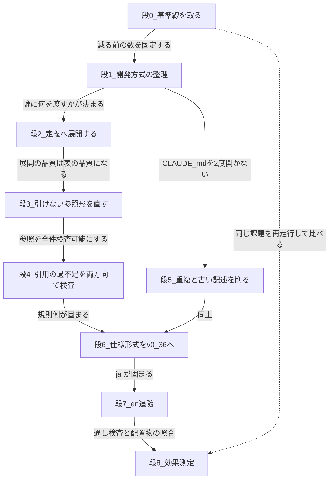

# 改善計画 —— 人間向けは網羅、AI 向けは展開（2026-08-10）

**本書は計画である。実装はまだ行っていない。**

**根拠となる数はすべて `00-current-state.md` にある。本書は数を再掲するが、出典はそちらである。**

**改訂 1:** 初版は「実行時に節を引く道具」を中心に据えていた。**ユーザーとの合意により「配布時にエージェント定義へ展開する」方式へ差し替えた**（§1.2）。

**改訂 2:** **展開の前に「開発方式の整理」を置いた**（新しい段 1）。**方式が決まらないと、誰に何を展開するかが決まらないためである。** 内容は `02-development-modes.md` にある。以降の段番号が 1 つずつ繰り下がった。

---

## 1. 何を変えるのか

### 1.1 読み手を 2 つに分ける

| 読み手 | どう書くか | なぜ |
|---|---|---|
| **人間** | **網羅的に `.md` に書く** | 前後関係・設計根拠・図がある方が早く分かる。**削らない** |
| **AI（各エージェント）** | **その体が要る節だけを、定義に展開して渡す** | 1 起動あたりのコンテキストを最小化する |

**分けるのは読み手だけであり、出どころは 1 つである。**

> **二重管理は大罪である。** 人間向けに網羅的に書き、AI 向けに別途手で書けば、同じ規則が 2 か所に載る。**それは今回計測した最大の欠陥そのものである** —— `プロセス規則 §6.1` は `CLAUDE.md` の 200 行の写しであり、5 点で古くなっていた（`00-current-state.md` §4.1）。名簿は 5 か所に、接頭辞表は 2 か所にある。`14` §6.4-6 は既に「同じ知識を 2 か所に置かない」と書いている。
>
> **したがって AI 向けの本文は手で書かない。人間向けの `.md` から機械が抜き出す。**

### 1.2 抜き出す指示書は既に在る

**22 体の `### 読むべき規則の節` の 118 行が、そのまま「この体にこの節を渡せ」という指示書である。** 新しく書く必要は無い。

**配る経路も既に在る。** `setup.js` が `framework-src/{lang}/agents/` → `.claude/agents/` を配置しており、**配置先は既に `.gitignore` 対象である。** 足すのは「配りながら、表の行を本文に展開する」の 1 手順だけである。

**効果:**

| | 1 起動あたり | 22 体合計 |
|---|---:|---:|
| 現在（引用先を全文ロード） | 平均 4,420 行 | **97,238 行** |
| 展開後（定義 + 引用節） | **平均 387 行** | **8,504 行** |

**規則文書の本文を 1 行も書き換えずに得られる。**

### 1.3 なぜ「実行時に引く」ではなく「配布時に展開する」なのか

**初版は `tools/rule-section.mjs` で実行時に引く案だった。** その最大の弱点は**行動の保証が無いこと**である。「規則全文をロードしてはならない（MUST NOT）」と書いても、エージェントが道具を使わずに Read すれば元の木阿弥になる。

**配布時に展開すれば、実行時の遵守が要らない。** 節は最初からそこに在る。

**ただし引き換えに 1 つ失う** —— **表に無い節を取りに行けなくなる。** 今は「全文を読む」という逃げ道がある。**対策として `rule-section.mjs` を非常口として残す**（§3 段 2-5）。

---

## 2. 段の順序

**段の依存関係:**



**段 1 が「何を見て決めるか」を定め、段 2 が最も効き最も安く、段 6 が最も重い。段 0 を飛ばすと段 8 が成立しない。**

| 段 | 何をするか | 効果 | 危険度 | `14` との対応 |
|:-:|---|---|:-:|---|
| **0** | 基準線を取る | 測定の分母 | 低 | — |
| **1** | **開発方式の整理（簡易 / 標準 / 厳格 × 条件付き 13 フラグ）** | **手順 137 → 69（簡易）/ 105（標準）** | 中 | `14` に無い |
| **2** | **引用節をエージェント定義へ展開し、索引を生成する** | **−94.2%** | 低 | 手順 7 の一部 |
| **3** | 引けない参照形 22 件を引ける形に直す | 展開の網羅性 | 低 | 手順 6・7 の一部 |
| **4** | **引用の過不足を両方向で検査する** | 展開の正確性 | 低 | 手順 9 の一部 |
| **5** | §6.1 の写し・`ANGS`・用語の揺れ・CLAUDE.md の 2 節を削る | 矛盾除去 + 全起動から 36 行 | 中 | 手順 4・5・8 の一部 |
| **6** | 仕様形式を v0.36 へ（骨格・規則・658 件） | 仕様を引ける単位に | **高** | 手順 2・4・5・6・8・9 |
| **7** | en 追随 | 配布可能に | 中 | 手順 10 |
| **8** | 効果測定 + 配置物の照合 | 検証 | 低 | 手順 11 |

> **段 3 と段 4 の重要度が初版より上がっている。** 実行時に引く方式では表の誤りは「節が見つからない」で済んだが、**展開方式では表の誤りがそのまま成果物の誤りになる。表の品質＝エージェントの品質である。**

> **削減の効き方が 2 種類あることに注意する。** 段 1 は**手順の数**を減らし（簡易で 110 → 69、−37%）、段 2 は**1 手順あたりのコンテキスト**を減らす（−94.2%）。**掛け算で効くが、どちらか一方では足りない。** 段 1 の削減率が段 2 より低いのは、Phase 0 の 19 手順が減らせず、ゲートも免除できないためである（`02-development-modes.md` §4.3）。

---

## 3. 各段の詳細

### 段 0 —— 基準線を取る

**減る前の数を先に取る。取らないと「減った」を主張できない。**

| # | やること |
|:-:|---|
| 1 | **`tools/context-census.mjs` を新設する。** 22 体の `読むべき規則の節` を解析し、「全文ロード行数」「引用節のみの行数」「定義＋引用節」「削減率」を出す |
| 2 | 出力を `maintenance/2026-08-10/census-before.txt` として保存する |

**完了条件（機械判定）:**

| # | 判定 |
|:-:|---|
| 1 | `node tools/context-census.mjs` の合計が **97,238 / 5,653 / 8,504 / 94.2%** を出す（`00-current-state.md` §2 と一致） |
| 2 | `census-before.txt` が存在する |

**切り戻し:** 新規ファイルの削除のみ。既存ファイルを触らない。**判断を 1 つも要さず、今すぐ着手できる唯一の段である。**

> **実測トークンの基準線は取らないと決めた**（`02-development-modes.md` §0 判断 9）。**したがって効果の主張は行数指標だけに乗り、段 8 の指標 5（実測トークン）と指標 6（非常口の使用回数）は測れない。** 推測で埋めてはならない（MUST NOT）。

---

### 段 1 —— 開発方式の整理

**移す対象は `03-mode-matrix.md` の 10 表（表 0・A・A-2・B-1・B-2・C・D-1・D-2・E-1・E-2）。判断の根拠は `02-development-modes.md`。** 本書では位置づけと完了条件のみを記す。

| # | やること | 出どころ |
|:-:|---|---|
| 1 | **開発方式を `簡易` / `標準` / `厳格` の 3 つにする。** 仕様書もフェーズもエージェントもプロセスもレビューも、すべてこの 1 つで決まる。**Critical は期間・規模によらず厳格** | 表 0 |
| 2 | **`Micro` / `Small` / `Standard` / `Large` / `Critical` を区分名として使うのをやめる。** 隣り合う区分の差を数えた結果、5 区分は実質 3 区分だった | §4.1b |
| 3 | **「任意」を全廃する。** 5 件をすべて免除に倒す。セルの値は 必須 / 免除 / 条件付き の 3 つだけ | §0-5 |
| 4 | **表 0・A・A-2・B-1・B-2・C・D-1・D-2・E-1・E-2 を `プロセス規則 §3.1.1` に置く**（10 表） | `03-mode-matrix.md` |
| 5 | **`commands/full-auto-dev.md` Phase 0 に `0b3. 開発方式を決める` を足す**（現在、開発方式による分岐が 0 件） | §5 |
| 6 | **`CLAUDE.md` に「スケールダウン設定」節を新設する**（§3.1.1 が記録先として要求しているが、**節が存在しない**） | §5 |
| 7 | **`agents/project-manager.md` の citation 表に `プロセス規則 §3.1.1` を足す**（現在は Procedure の地の文に `§3.1` と誤記） | §2.2 |
| 8 | **`中規模以上` / `Micro` / `Small` / `Standard` / `Large` を区分名として廃し、用語集に非採用語として登録する。`簡易` / `標準` / `厳格` を採用語として登録する** | 表 0 |
| 9 | **プロセス規則 §3.2 と §3.3 を 1 つのプロセス一覧（17 件）に統合する。** `コミュニケーション管理`（§3.3.2）は削る —— 3 行の中身がすべて Fd と CLAUDE.md「重要判断の基準」と重複していた | 表 D-1 |
| 10 | **SAST と SCA を別プロセスに分ける。** SCA は全方式必須、SAST は簡易で条件付き | 表 D-1 |
| 11 | **簡易の必須プロセスを 8 → 5 に絞る**（トレーサビリティ管理・監査記録管理・ライセンス管理・SCA・ユーザードキュメント作成）。**§3.1.1 のルール行「defect/CR 記録・リスク管理・トレーサビリティ・変更管理は全規模で必須」を改める** | 表 D-1 |
| 12 | **`tools/spec-query/ancestors.jq` を新設する**（段 6 で実施）。`TC` の UID から祖先の鎖を返す。**test-engineer が引く道具である。設計・実装は仕様書を全文引く** | 表 A-2 |
| 13 | **表 E-1（フェーズごとのレビューと報告）と表 E-2（基準）を新設する。** レビュー（行為）と報告（ファイル）を分ける。**ゲートは全方式で 8 つとも判定するので、省けるのは報告だけである** | 表 E-1・E-2 |
| 14 | **並列実装（Git worktree）を表の行にし、標準では免除する。** WBS・進捗曲線・日次レポートも標準で免除に下げる —— **単線で 1 週間未満の走行には要らない** | 表 D-1 の 17・表 D-2 の 19・21・22 |

**完了条件は `02-development-modes.md` §7 と `03-mode-matrix.md` §13。** 主なものを再掲する。

| # | 判定 |
|:-:|---|
| 1 | `commands/full-auto-dev.md` に開発方式による分岐が **1 件以上**（現在 0 件） |
| 2 | `CLAUDE.md` に「スケールダウン設定」節が在る |
| 3 | **免除マトリクスに `任意` が 0 件**（現在 5 件） |
| 4 | `中規模以上` / `Micro` / `Small` / `Standard` / `Large` が区分名として `framework-src/ja` に 0 件、**用語集に非採用語として登録**。`簡易` / `標準` / `厳格` を採用語として登録 |
| 5 | **`tools/check-mode-matrix.mjs`（新設）が PASS** —— 全表の列が `簡易` / `標準` / `厳格` / `備考`。エージェント名とプロセス名が `agent-list.md` §1・プロセス規則の正と一致する。**`任意` を値として持つセルを落とす** |
| 6 | 既知の欠陥（表 C に存在しないエージェント名を 1 件仕込む）で FAIL する |
| 7 | 6 検査が PASS |

**切り戻し:** `git restore framework-src/ja/process-rules/ framework-src/ja/CLAUDE.md framework-src/ja/commands/ framework-src/ja/agents/project-manager.md`

> **段 1 は `CLAUDE.md` を触る。段 5 も触る。** `14` §6.4 の「同じファイルを 2 度開かない」に反するが、**段 1 は節の追加、段 5 は節の削除であり、依存が逆向きである。** 図のとおり段 1 → 段 5 の順を守れば衝突しない。**逆順にしてはならない（MUST NOT）。**

> **判断はすべて決着した**（`02-development-modes.md` §0・§8）。**表の実体は `03-mode-matrix.md` にあり、段 1 はそれをプロセス規則 §3.1.1 へ移す作業である。**

---

### 段 2 —— 引用節をエージェント定義へ展開し、索引を生成する（**コンテキスト削減の中心**）

#### 2-1. `tools/build-agents.mjs` を新設する

**入力:** `framework-src/{lang}/agents/*.md`（citation 表を持つ正本）+ `framework-src/{lang}/process-rules/*.md` + `framework-src/{lang}/CLAUDE.md`

**出力:** `.claude/agents/*.md`（引用節を本文に展開したもの）

**展開の形（案）:**

```markdown
### 読むべき規則の節

| 判断内容 | 参照先 |
|---------|--------|
| 出力の記法 | 文書管理規則 §9.13（spec-foundation） |

<!-- expanded: 文書管理規則 §9.13 (framework-src/ja/process-rules/full-auto-dev-document-rules.md:1246-1263) -->

#### 文書管理規則 §9.13 spec-foundation（名前空間: spec-foundation:）

（節の本文をそのまま展開）

<!-- /expanded -->
```

**表は残す。** 表がどこから来たかの手掛かりであり、**非常口（2-5）を使うときの案内でもある。** 展開の境界は HTML コメントで機械可読にし、**出どころのファイルと行範囲を必ず書く**（人間が正本へ戻れるようにするため）。

#### 2-2. `setup.js` を `build-agents.mjs` 経由にする

**現在 `setup.js` は `.md` をそのまま複製している。** `agents` の配置だけを `build-agents.mjs` に委ねる。**`commands` / `process-rules` / `CLAUDE.md` / `user-order.md` の配置は変えない。**

#### 2-3. 束ねる文書 `.claude/agents/README.md` を生成する

**手で書いてはならない。** 手で書けば 6 つ目の名簿になる（`00-current-state.md` §4.4）。

**なぜ配置先に置くのか —— 相対パスの罠がある:**

| | `agent-list.md` の位置 | エージェント定義の位置 | 必要な相対パス |
|---|---|---|---|
| 正本 | `framework-src/ja/process-rules/` | `framework-src/ja/agents/` | `../agents/architect.md` |
| **配置先** | `process-rules/` | **`.claude/agents/`** | **`../.claude/agents/architect.md`** |

**パスが違う。`check-links.mjs` は正本しか見ないので、配置先で切れたリンクは誰も検出しない。**

**実際この制約は既に守られていた** —— `framework-src/ja` の相対リンク 42 本は 1 本残らず同一ディレクトリ内であり、`../` は 0 本である。`agent-list.md` がエージェント定義を `` `agents/technical-authority.md` `` とコードスパンで書きリンクにしていないのは、これを避けるためと読める。

**`.claude/agents/README.md` なら定義と同一ディレクトリなので、リンクは `architect.md` の 1 語で済み、正本でも配置先でも壊れない。**

**中身:** 22 行の表 —— 名前（定義へのリンク）/ model / 主要フェーズ / **展開された規則節の一覧と行数** / 定義＋展開の合計行数。

> **最右の列が効く。** 「どの体が何を渡されたか」を 22 ファイル開かずに確かめられるので、**展開の誤りがレビューできる。** 段 4 で見つける引用漏れも、この表があれば目で拾える。

> **`check-roster.mjs` は `framework-src/{lang}/agents` を数えるので、配置先に README を置いても影響しない**（確認済み）。

#### 2-4. `agent-list.md` の役割を人間向けに寄せる

**手書きのまま残す。** 名簿・オーナーシップマトリクス・データフロー図・アクティベーションマップは**人間が読む文書**であり、網羅的でよい。**§1.1 の方針どおり削らない。**

#### 2-5. `tools/rule-section.mjs` を非常口として新設する

**`node tools/rule-section.mjs プロセス規則 9.1` で節の本文を出す。** 展開に無い節が必要になったときの逃げ道である。

> **使われたら、それは「表が間違っている」という信号である。** エージェントの完了報告に「展開外の節を引いた」と書かせ、段 4 の検査で表を直す。

#### 2-6. `prompt-structure.md` §3 の定義を更新する

`### 読むべき規則の節` の説明を「全文をロードさせない」から「**配布時に展開される**。表は展開の指示書であり、本文は生成物に入る」に改める。

**完了条件（機械判定）:**

| # | 判定 |
|:-:|---|
| 1 | `node setup.js ja` の後、`.claude/agents/*.md` が **22 枚 + README.md** |
| 2 | **展開後の各定義の行数が `context-census.mjs` の「定義＋引用節」列と一致する**（合計 8,504） |
| 3 | **`.claude/agents/*.md` に `<!-- expanded: -->` が 118 対**（表の行数と一致） |
| 4 | `.claude/agents/README.md` の 22 行が `agent-list.md` §1 の 22 体と一致する |
| 5 | **既知の欠陥で落ちる。** 存在しない節（例 `プロセス規則 §99.9`）を 1 体に入れると `build-agents.mjs` が**失敗して停止する**（黙って空欄を出さない） |
| 6 | 6 検査が引き続き PASS（正本を触っていないため） |

**切り戻し:** 新規 2 ファイルの削除 + `git restore setup.js framework-src/ja/process-rules/prompt-structure.md`。**`.claude/agents/` は `.gitignore` 対象なので `node setup.js ja` でいつでも作り直せる。**

> **`rule-section.mjs` と `build-agents.mjs` は節の切り出しロジックを共有する。** `tools/lib/framework.mjs` に 1 つ置き、両方から呼ぶ。**二重に持たない。**

---

### 段 3 —— 引けない参照形 22 件を引ける形に直す

**展開方式では、引けない参照は展開されない。** 現在 `check-links` が見ていない参照が 18 件、緩くしか見ていない参照が 4 件ある。

| 参照の形 | 件数 | 対処 |
|---|---:|---|
| `CLAUDE.md「見出し」`（見出し名） | **7** | **見出し名で解決できるようにする。** 引かれている見出しは 5 つ・71 行だけ（`00-current-state.md` §1.1） |
| `レビュー観点規約 R2` 等（R 形） | 7 | **`rule-section.mjs` に R-ID 解決器を足し、`CITATION_LABELS` に `レビュー観点規約` を登録する** |
| `仕様テンプレート Ch3-6`（Ch 形） | 2 | **段 6 で章構成が変わる。** 段 6 と同時に直す。`Ch1-2` → `Ch1-4`、`Ch3-6` → `Ch5-8` |
| `レビュー観点規約「総合レビューチェックリスト」`（節題） | 2 | 見出し名で解決できるようにする |
| **`defect 分類` のラベルが未登録** | 4 | **`不具合分類` → `defect 分類` に直す。** 現行ラベルはエージェント定義に 0 件の死語。**現在は「どれかの規則文書に同じ番号が在ればよい」という緩い検査に落ちている** |

**完了条件（機械判定）:**

| # | 判定 |
|:-:|---|
| 1 | `check-links` の節参照件数が **269 → 増える**（未検査だった 18 件が対象に入る） |
| 2 | `check-links` が「未登録ラベル」を 1 件も報告しない |
| 3 | **`不具合分類` が `tools/` に 0 件** |
| 4 | **118 行すべてが `rule-section.mjs` で本文を返す**（`build-agents.mjs` が 1 件も欠かさず展開する） |
| 5 | 既知の欠陥（存在しない R-ID）を仕込むと FAIL する |

**切り戻し:** `git restore tools/ framework-src/ja/agents/`

---

### 段 4 —— 引用の過不足を両方向で検査する

**展開方式では表の誤りが成果物の誤りになる。したがって表を両方向から検査する。**

#### 4-1. 不足の検査 —— オーナーが自分の Form Block を引いていない 8 件

| 追加する体 | 追加する引用 |
|---|---|
| architect | 文書管理規則 §9.19 / §9.20 / §9.21（条件付き requirement-spec）, §9.36（deployment-design） |
| srs-writer | 文書管理規則 §9.24（user-order） |
| project-manager | 文書管理規則 §9.31（stakeholder-register）, §9.38（session-handoff）+ **プロセス規則 §4.0（セッション管理と再開）** |
| technical-authority | 文書管理規則 §9.34（tech-decision） |
| decree-writer | 文書管理規則 §9.35（governance-change-log） |
| risk-manager | 文書管理規則 §9.37（risk-register） |
| progress-monitor | **プロセス規則 付録B（進捗管理データのスキーマ）** |

**`tools/check-ownership-citations.mjs` を新設する。** `agent-list.md` §2 のオーナーシップ表と各体の citation 表を突き合わせ、**owner が自分の file_type の §9.x を引いていない件を落とす。**

#### 4-2. 過剰の検査 —— どの体からも引かれない節を一覧に出す

**`tools/check-orphan-sections.mjs`（または `context-census.mjs` の 1 モード）を新設する。** 全規則文書の節のうち、**どの citation 表からも参照されていない節を一覧に出す。**

**これは FAIL させない。一覧を出すだけである。** 判断材料として使う:

| 一覧に出た節 | 意味 | 対処 |
|---|---|---|
| 第1・5・10・13・14 章（464 行） | **人間向けで正しい** | 残す |
| 付録B（73 行） | **引用漏れだった** | 3-1 で足す |
| §3.3 推奨プロセス（102 行）等 | どちらか未判定 | 1 件ずつ判断して記録する |

> **一覧を FAIL にしてはならない。** 人間向けの節が存在するのは §1.1 の方針そのものであり、それを欠陥として落とす検査は方針と矛盾する。**出して読ませることが目的である。**

**完了条件（機械判定）:**

| # | 判定 |
|:-:|---|
| 1 | `node tools/check-ownership-citations.mjs` が PASS |
| 2 | 既知の欠陥（1 体から引用を 1 件抜く）で FAIL する |
| 3 | `check-orphan-sections` の出力が生成され、**各節に「人間向け」「引用漏れ」「未判定」のいずれかが付いている**（未判定が残ってもよいが、件数を記録する） |
| 4 | 3-1 の追加後、`context-census.mjs` の合計が更新され、**どの体も展開後 1,000 行を越えない** |

**切り戻し:** `git restore framework-src/ja/agents/` + 新規 2 ファイル削除。

---

### 段 5 —— 重複と古い記述を削る

**削る対象と、削ってよい根拠を 1 件ずつ示す。**

| # | 削る対象 | 行数 | **削ってよい根拠** | 置き換え |
|:-:|---|---:|---|---|
| 1 | **プロセス規則 §6.1（CLAUDE.md テンプレート）** | 200 | **重複かつ古い。** CLAUDE.md との一致率 72%、残る 28% は `ANGS` 残存・ESLint/JWT/OWASP の押し付け・品質目標 3 行の食い違い・`法規調査` の揺れ。**§6.1 自身が「正本は CLAUDE.md」と書いている** | `CLAUDE.md` を正本とする 3 行の案内。**decree-writer の引用を `CLAUDE.md` へ向け直す**（展開量が 721 → 約 520 行に減る） |
| 2 | プロセス規則 第7章（エージェント定義） | 12 | **重複。** `agent-list.md` と `agents/*.md` が持つ | `agent-list.md` への 2 行の案内 |
| 3 | プロセス規則 付録C「カスタムエージェント一覧」 | 28 | **重複。** 名簿の 3 つ目の写し | 削除 |
| 4 | プロセス規則 §9.2「レビュー観点（R1〜R7）」 | 14 | **重複。** `review-standards.md` の要約 | `review-standards.md` への 1 行 |
| 5 | **CLAUDE.md「Agent Teams 設定」** | **26** | **重複。** 名簿の 6 つ目の写し。`agent-list.md` が正本 | `agent-list.md` への 1 行 |
| 6 | **CLAUDE.md「ドキュメントの外殻規約」** | **10** | **サブエージェントは受け取れない。** 「要求時のみ適用」であり、**サブエージェントはユーザーと双方向にやりとりできない**（`agent-list.md` §0）ので、その要求が届かない | `main-agent` 向けの記述として `commands/` 側へ移す |
| 7 | **`ANGS` の記述 18 行** | — | **廃止決定済み**（引継書 §6-3） | ANMS / ANPS-part / ANPS-chapter の 3 形式に統一 |
| 8 | **`法規調査`（7 行）** | — | **同じ条件付きプロセスに 2 つの名前がある。** プロセス規則は 1 枚の中で両方を使っている | **`法的調査` に統一**（CLAUDE.md が使っている側） |

> **5 と 6 の効き方は他と違う。** `CLAUDE.md` は全起動に載るため、**36 行 × 22 体 = 792 行が全走行から消える。** 引用節の展開とは別の削減である。

**削らないもの（理由つきで記録する）:**

| 対象 | 行数 | 削らない理由 |
|---|---:|---|
| プロセス規則 第1章・第5章・第10章・第13章・第14章 | 464 | **人間の読み手向けである。§1.1 の方針どおり網羅的に残す。** 展開方式ではエージェントに載らないので費用が発生しない |
| プロセス規則 付録A（コミュニケーション図） | 124 | 人間の導線。第1章から参照されている |
| プロセス規則 付録B | 73 | **引用漏れである。** 段 4-1 で progress-monitor の引用に足す |
| `porting-guide.md` / `framework-development.md` | 446 | **フレームワーク保守者向け。** エージェントが引かないのが正しい |
| `agent-list.md` | 469 | **人間向けの正本。** 段 4 の `check-ownership-citations` が機械の読み手として使う |
| 第3章 3.1 / 3.1.1 / 3.3 | 153 | スケールダウン基準は仕様形式の選択（段 6）で使う。**先に消してはならない** |
| `CLAUDE.md`「ドキュメントの記法規約」 | 52 | 文書を書く体には要る。**全起動に載る 52 行は、展開方式でも残る最大の固定費である**（段 8 で再検討） |

**完了条件（機械判定）:**

| # | 判定 |
|:-:|---|
| 1 | **`ANGS` が `check-terms.mjs` の `ALLOWED` 外に 0 件**（現在 18 行中 15 行が ALLOWED 外。`glossary.md` 2 行と `council-review.md` 1 行が ALLOWED 内） |
| 2 | **`法規調査` が `ALLOWED` 外に 0 件**（現在 7 行すべてが ALLOWED 外） |
| 3 | `node tools/check-terms.mjs` が PASS |
| 4 | プロセス規則の行数が **2,902 → 約 2,650**（削る 254 行: §6.1 200 / 第7章 12 / 付録C の一覧 28 / §9.2 14） |
| 5 | **`CLAUDE.md` の行数が 264 → 約 228** |
| 6 | 6 検査が PASS |

> **「全ファイル 0」を条件にしてはならない。** `check-terms.mjs` は `glossary.md` / `defect-taxonomy.md` / `agents/kotodama-kun.md` / `commands/council-review.md` の 4 枚を除外している —— **非採用語を宣言するには、その語を書けなければならないからである。**
>
> **ただし `commands/council-review.md` の `ANGS` 1 件は検査の除外に守られて残る。** 諮問団の質問文が廃止済みの形式を前提にしている箇所であり、**機械では落ちないので目視で直す。**

**切り戻し:** `git restore framework-src/ja/process-rules/ framework-src/ja/CLAUDE.md framework-src/ja/commands/`

---

### 段 6 —— 仕様形式を v0.36 へ

**最も重い段である。`14-framework-update-plan.md` の手順 2・4・5・6・8・9 を 1 つにまとめたもの。**

| # | やること | 出どころ |
|:-:|---|---|
| 1 | `process-rules/spec-template.md` を骨格で置換 | `maintenance/2026-08-09/03-spec-template-skeleton.md`（664 行） |
| 2 | `process-rules/spec-writing-rules.md` を新設 | `maintenance/2026-08-09/04-spec-writing-rules.md`（1,506 行） |
| 3 | **章番号 658 件を置換する。** 順序は「範囲表記 → 節番号 → 章番号（降順）」 | `maintenance/2026-08-09/01-chapter-number-census.md` §6 |
| 4 | **仕様形式を決める段をパイプラインに足す**（下記 5.1） | 新規 |
| 5 | **各エージェントの「引く単位」を仕様書の枚と章まで落とす**（下記 5.2） | 新規 |
| 6 | 文書管理規則の ANPS 分割単位を ANPS-part / ANPS-chapter に統一 | `14` 手順 4-8 |
| 7 | 品質ゲートの判定対象章を 11 章構成に合わせる（84 箇所） | `14` 手順 5-2 |
| 8 | R1 の対象章を 11 章構成に合わせる（19 箇所） | `14` 手順 6-1 |

#### 5.1 仕様形式をどの段でどう選ばせるか

**現在、形式を決める段は手順のどこにも無い**（`00-current-state.md` §5.3）。**`commands/full-auto-dev.md` の Phase 0 に 1 段足す。**

| 足す段 | 内容 |
|---|---|
| **0b3. 仕様形式を決める** | user-order.md と 0c〜0n2 の評価から**ユースケースの概数**を見積もり、下表で形式を選ぶ。**ユーザーに提示して承認を得る。決定は `project-records/decisions/` に記録する** |

| 形式 | 枚数 | 選ぶ条件 | 実測（骨格を割った場合） |
|---|:-:|---|---|
| **ANMS** | 1 | ユースケースが概ね 5 件以下 | 664 行 |
| **ANPS-part** | 4 | 要求 / 設計 / テストを別々の体が同時に触る | 697 行（4 枚） |
| **ANPS-chapter** | 15 | **implementer / test-engineer が仕様書全体を読まずに済ませたい**。または章ごとに承認を分けたい | 758 行（15 枚） |

> **「収まる / 収まらない」を判断基準の言葉にしない。** 収まるかどうかは実プロジェクトの記入量で決まり、setup 時点では測れない。**測れる量（ユースケース数）と、欲しい性質（誰が何を読まずに済ませたいか）で決める。**

> **形式が決まったら、対応する文法を仕様書フォルダへ複製する手順が要る**（`14` 手順 3 の注記）。ANMS は `spec-anms.sgra`、ANPS は `spec.sgra`。**`**Grammar**` と同じフォルダに無いと解決しない。**

#### 5.2 各エージェントが引く単位

**「仕様書を読む」ではなく「どのファイルの、どの章を読む」まで落とし、`### In` に書く。** ANPS-chapter の場合:

| 体 | 書く枚 | 読む枚 | 読む行数 | ANMS 1 枚（664 行）に対する率 |
|---|---|---|---:|---:|
| srs-writer | 01〜04 | — | — | — |
| architect | 05〜08 | 01〜04 | 283 | 43% |
| security-reviewer | — | 04・05 | 163 | 25% |
| **implementer** | — | **05・06** | **137** | **21%** |
| test-engineer | 09〜11（6 枚） | 03・04・07 | 168 | 25% |
| review-agent（R1） | — | 01〜04 | 283 | 43% |
| review-agent（R2/R7） | — | 05・06 | 137 | 21% |
| review-agent（R6） | — | 09〜11（6 枚） | 272 | 41% |
| user-manual-writer | — | 02・03 | 116 | 17% |
| runbook-writer | — | 02 | 50 | 8% |
| feedback-classifier | — | 01〜08 | 458 | 69% |

> **仕様書は展開しない。** 規則と違い、仕様書は**プロジェクトごとに中身が変わる生きた成果物**である。展開すれば書き換えのたびに再生成が要り、しかも古い写しを持ったエージェントが走る危険がある。**仕様書はファイル単位で読ませる。** 分割はそのためにある。

**完了条件（機械判定）:**

| # | 判定 |
|:-:|---|
| 1 | `spec-template.md` の 1 行目が `ANMS v0.36`、章が 11 章 |
| 2 | **11 章構成の仕様書一式が `strictdoc export` を通る**（`--no-parallelization` 必須。出力先を入力フォルダ内に置かない） |
| 3 | **検出クエリ 8 本が、仕込んだ欠陥を拾う**（`plant-faults.py`） |
| 4 | **機械で当てられない 39 件を 1 件ずつ照合した記録が在る** |
| 5 | `check-links` / `check-tagnames` / `check-terms` / `check-ownership-citations` が PASS |
| 6 | `14` 手順 2 の受入基準 14 件が全件 PASS |
| 7 | **`build-agents.mjs` が引き続き 118 行すべてを展開する**（`仕様テンプレート Ch1-2` → `Ch1-4` の解決を含む） |

**切り戻し:** **段 6 だけは独立したブランチで行う。** `14` §6.4-1 のとおり一括置換をしてはならず、途中で止めた状態から戻すのが難しい。段 5 完了時点にコミットを置く（**タグ付けはユーザーが行う**）。

> **`spec-writing-rules.md` の新設で `check-parity` が落ちる。** 対処は §4 に書く。

---

### 段 7 —— en 追随

**ja が段 2〜6 で固まってから、まとめて追う**（引継書 §5.1 の緩和）。

| # | やること |
|:-:|---|
| 1 | 段 2〜6 の全変更を `framework-src/en/` に反映する |
| 2 | 章題は `01-chapter-number-census.md` §5.1 の英語をそのまま使う |
| 3 | **`check-links.mjs` の `CITATION_LABELS` の en 側に、段 3 で足したラベルを追加する** |
| 4 | **`check-parity` の PENDING 登録を空にする**（§4） |

**完了条件:** `node tools/check-parity.mjs` が **42 対**で PASS。**`node setup.js en` で 22 枚 + README が生成され、展開が en の規則文書から行われる。**

---

### 段 8 —— 効果測定と配置物の照合

| # | 指標 | 取り方 | 目標 |
|:-:|---|---|---|
| 1 | **規則ロード行数**（一次指標） | `node tools/context-census.mjs` | **97,238 → 8,504 行**（−91.3%。展開後の定義込み） |
| 2 | **全起動に載る固定費** | `CLAUDE.md` の行数 | 264 → 約 228（−36 行 × 22 体） |
| 3 | **手順数** | `commands/full-auto-dev.md` の分岐を数える | 簡易 **69** / 標準 **105** / 厳格 **107**（全 137 手順のうち） |
| 4 | **仕様書ロード行数**（test-engineer・review-agent・文書作成の 3 者のみ） | 表 A-2 | **設計・実装は全文を引くので対象外。要求は互いに関係する** |
| 5 | **実測トークン** | — | **測らない**（`02-development-modes.md` §0 判断 9） |
| 6 | **非常口の使用回数** | — | **測らない**（走行を行わないため） |

> **指標 5・6 を落としたので、効果の主張は行数と手順数だけに乗る。** **「実際にコストが下がった」は本計画では証明されない。** 証明が必要になった時点で、段 0 と同じ課題を 2 回走らせる必要がある。**その事実を隠して「削減した」と書いてはならない（MUST NOT）。**

**さらに、配置物が正本の展開と一致するかを検査する。**

| # | やること |
|:-:|---|
| 1 | **`tools/check-deployed.mjs` を新設する。** `.claude/agents/` `process-rules/` `CLAUDE.md` が、正本から `setup.js` / `build-agents.mjs` を走らせた結果と一致するか |
| 2 | 一致しない場合は、**どのファイルがいつからずれているかを出す** |

> **現在この検査が無いため、配置物は 15 日ずれたまま誰も気づいていない**（`00-current-state.md` §0）。**展開方式では配置物が成果物そのものになるので、ずれの代償が上がる。**

---

## 4. `check-parity` と ja 先行の扱い（引継書 §5.2 への答え）

**`spec-writing-rules.md` を ja だけに置いた時点で `check-parity` は落ちる。** 実測で確認した —— `check-parity.mjs` の 60 行目が `en: missing ...` を報告する。**フックを止めても落ちる。** フックの片側検査は「対応ファイルが既に存在する場合」しか見ず、その後に `check-parity` 自身を走らせるためである。

| 案 | 内容 | 判定 |
|:-:|---|---|
| A | CI から `check-parity` の step を外す | **採らない。** 1 枚のために 41 対全部の検査が消える |
| B | `git commit --no-verify` で個別に逃がす | **不十分。** ローカルは通るが CI の push で落ちる |
| **C** | **ja 先行を宣言できる仕組みを足す** | **採る** |

**案 C の実体:**

| # | やること |
|:-:|---|
| 1 | **`framework-src/PENDING-EN.txt` を新設する。** 1 行 1 パス |
| 2 | **`check-parity.mjs` を直す。** 60 行目の「missing」判定で、パスが PENDING に載っていれば**問題ではなく警告として報告し、件数を出す** |
| 3 | **PENDING が空でないうちは、最終行に「en 未追随 N 件」を必ず出す。黙って通してはならない** |
| 4 | **段 7 の完了条件は「PENDING が空」である** |

> **なぜ宣言を要求するのか。** 「en が無いファイル」を無条件に許すと、**追随漏れと ja 先行の区別が付かなくなる。** 宣言があれば、忘れたものは落ち続ける。

**残り 5 検査（roster / links / tagnames / terms / setup）は止めない。** 片言語でも成立する。

---

## 5. `14-framework-update-plan.md` との関係（引継書 §4.2-5 への答え）

> **組み替えを提案する。** `14` をそのまま踏襲しない。

**理由:** `14` は「v0.36 を適用しきる」ための計画であり、**順序は「章構成が確定しないと他が決まらない」という依存で組まれている。** それは正しいが、**コンテキスト消費の削減はその依存の外にある。** 引用節の展開は章番号に依存しない。**`14` の順序に従うと、最も効く変更（手順 7 の一部）が 8 番目に来る。**

| `14` の手順 | 状態 | 本計画での扱い |
|---|---|---|
| 手順 0（章番号の再計測） | **完了** | そのまま使う |
| 手順 1（用語集） | **完了** | 段 5 で `ANGS` / `法規調査` を非採用語として追記 |
| 手順 2（spec-template） | 現物あり・未適用 | **段 6** |
| 手順 3（文法と検出クエリ） | **完了** | そのまま使う |
| 手順 4（文書管理規則） | 未 | **段 6** |
| 手順 5（プロセス規則） | 未 | **段 5**（§6.1 削除・用語統一）+ **段 6**（章番号 84 箇所） |
| 手順 6（レビュー観点規約） | 未 | **段 3**（R-ID の解決）+ **段 6**（19 箇所） |
| **手順 7（ツール）** | 未 | **分解して前倒しする。** `check-links` 強化は段 3、`ADR` 参照切れ・`.meta.yaml` 検査・ゲート集計は段 6。**`14` に無い 8 本を新設する**（下表） |
| 手順 8（CLAUDE.md） | 未 | **段 5**（`ANGS` 削除・2 節削除）+ **段 6**（11 章構成） |
| 手順 9（名簿と定義） | 未 | **段 2・3・4 で citation 表を触る。** `test-engineer` の分割（手順 9-2）は**段 8 の後に判断** |
| 手順 10（en） | 未 | **段 7** |
| 手順 11（通し検査） | 未 | **各段の完了条件に分散**。段 8 で再度通す |

**`14` に無く、本計画が新設する道具:**

| 道具 | 段 | 役割 |
|---|:-:|---|
| `tools/context-census.mjs` | 0 | 効果測定の分母 |
| **`tools/check-mode-matrix.mjs`** | **1** | **表 A〜D の規模名・エージェント名・プロセス名が正と一致するか** |
| **`tools/build-agents.mjs`** | **2** | **引用節をエージェント定義へ展開し、索引を生成する。コンテキスト削減の中心** |
| `tools/rule-section.mjs` | 2 | 非常口。展開外の節を引く。**使用は表の誤りの信号** |
| `tools/check-ownership-citations.mjs` | 4 | 引用の**不足**を落とす |
| `tools/check-orphan-sections.mjs` | 4 | 引用の**過剰**を一覧に出す（FAIL させない） |
| **`tools/spec-query/ancestors.jq`** | **6** | **`SWS` の UID から祖先の鎖（`FR` → `UC` → `GL`）を返す。** implementer が章ではなくノードを引くための道具 |
| `tools/check-deployed.mjs` | 8 | 配置物が正本の展開と一致するか |
| **`tools/spec-query/ancestors.jq`** | **6** | **`SWS` の UID から祖先の鎖（`FR` → `UC` → `GL`）を返す。** implementer が章ではなくノードを引くための道具 |

**`14` 手順 9-2（`test-engineer` の分割）は先送りする。**

> **理由:** 引継書 §6-7 は「22 体全体の見直し」を決めているが、**本計画の目的はコンテキスト削減である。体を 1 つ増やすと名簿 5 か所・データフロー図 3 枚・アクティベーションマップが動き、`check-roster` の 44 対が 46 対になる。** 削減とは独立した変更であり、**段 6 まで終えて数が出てから判断すべきである。** 先送りは「やらない」ではない。

---

## 6. 危険と、その扱い

| # | 危険 | 扱い |
|:-:|---|---|
| 1 | **表に無い節が必要になり、エージェントが手詰まりになる** | **非常口 `rule-section.mjs` を残す。** 使用を完了報告に書かせ、段 4 の検査で表を直す。**段 8 の指標 5 で件数を追う** |
| 2 | **展開が古いまま走る**（規則を直したのに配布し直していない） | **`check-deployed.mjs`（段 8）。** 現に配置物は 15 日ずれている |
| 3 | **人間向けの網羅的な .md が肥大し、誰も引かない節が増える** | **`check-orphan-sections`（段 4-2）が一覧に出す。** 削除の判断材料にする。**ただし FAIL させない** —— 人間向けの節が在るのは方針そのものである |
| 4 | **段 6 の一括置換で章番号が壊れる** | 順序を守る（範囲 → 節 → 章の降順）。**39 件は機械で当てない。** 独立ブランチで行う |
| 5 | **`check-parity` を緩めたまま en が永久に追随しない** | PENDING を空にすることを段 7 の完了条件にし、**空でない限り毎回件数を出す** |
| 6 | **`Ch4.1` が `Ch9.1` / `Ch10.1` / `Ch11.1` に分裂する（4 件）** | 文脈でしか決まらない。**1 件ずつ目で決める** |
| 7 | **利用者が VS Code で開いているファイルを書き換えると保存で消える** | 着手前に対象を確認する。**現在 `maintenance/2026-08-09/anms-sample/spec/01-11-spec.md` が未コミットの変更を持つ。触らない** |
| 8 | **展開でエージェント定義が肥大する** | **段 4 の完了条件 4 で「展開後 1,000 行を越えない」を課す。** 現在の最大は decree-writer 848 行で、段 5 の §6.1 削除で約 520 行に下がる |

---

## 7. 決着した判断

| # | 判断 | **決定** | 根拠 |
|:-:|---|---|---|
| 1 | 人間向けと AI 向けを分けるか | **分ける。読み手だけを分け、出どころは 1 つ** | 二重管理は §6.1 の欠陥を再生産する |
| 2 | AI 向けの本文をどう作るか | **配布時に機械が展開する。手で書かない** | 同上 |
| 3 | 展開先の器 | **エージェント定義（`.claude/agents/*.md`）。`.claude/skills/` は新設しない** | 既存の配置経路・`prompt-structure.md` の S0-S6・`check-roster` がそのまま効く。器を 3 種類に増やさない |
| 4 | 束ねる文書 | **`.claude/agents/README.md` を生成する。手書きしない** | 手書きは 6 つ目の名簿になる。配置先に置けば相対パスが両レイアウトで壊れない |
| 5 | `agent-list.md` の扱い | **手書きのまま人間向けとして残す** | 名簿・オーナーシップ・データフローは網羅的でよい |
| 6 | プロセス規則 §6.1 | **削る** | 「正本は CLAUDE.md」と自称する写しを残す理由が無い |
| 7 | 引かれない 464 行 | **残す** | 人間向けであり、展開方式では費用が発生しない |
| 8 | `check-parity` の ja 先行 | **案 C（PENDING 宣言）** | CI の step を外すと 41 対の検査が消える |
| 9 | 実行時に引く道具 | **非常口として残す。主役にしない** | 行動の保証が無いため主役にできないが、逃げ道は要る |
| 10 | **展開と開発方式の順序** | **方式の整理を先に置く（段 1 → 段 2）** | 方式が決まらないと、誰に何を展開するかが決まらない。**先に展開すると 22 体全部に最大構成を渡すことになる** |

> **§7 は本計画についての決着である。開発方式そのものについては `02-development-modes.md` §8 に未決 7 件が残っている。段 1 はそれらの決定なしに始められない。**

---

## 8. まだ決めていないこと

| # | 内容 |
|:-:|---|
| 1 | **`rule-section.mjs` が `CLAUDE.md` の見出しをどう解決するか。** `CLAUDE.md` は `§` 番号を持たない。見出し名で引くか、番号を振るか |
| 2 | **`review-standards.md` の R-ID を見出しに含めるか。** 現在 `Naming（命名）— 名は体を表す` という見出しで、`R2.1` は本文中にしか無い |
| 3 | **展開の粒度。** 節が大きい場合（`プロンプト構造規約 §3` は 287 行）に、さらに小さく引くか、そのまま入れるか |
| 4 | **`CLAUDE.md`「記法規約」52 行を全起動に載せ続けるか。** 全起動に残る最大の固定費である。文書を書かない体（technical-authority・progress-monitor 等）には要らない可能性がある |
| 5 | **段 0 の基準線をどの課題で取るか。** 小さすぎると差が出ず、大きすぎると 2 回走らせられない |
| 6 | **実プロジェクトの仕様書がどれだけ大きくなるか。** 段 6 の行数はすべて骨格を割った値である |
