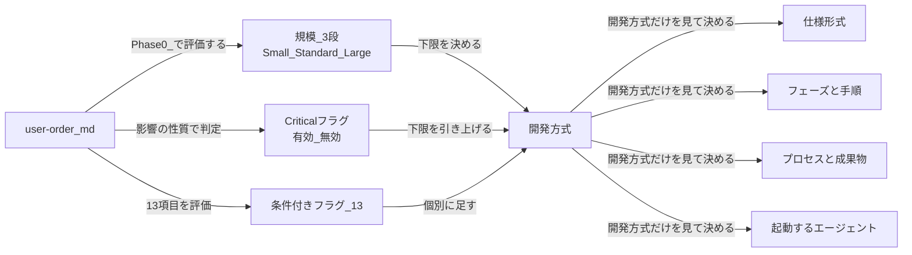

# 開発方式の整理 —— 仕様書・プロセス・エージェントを 1 か所で決める（2026-08-10）

**本書は §1〜§3 が計測、§4 以降が提案である。** 提案には**ユーザーの判断が要る箇所を明示する**。

**読み取りのみで作った。`framework-src/` は 1 文字も変えていない。**

**前提:** `00-current-state.md`（現状把握）と `01-improvement-plan.md`（改善計画）。**本書は計画の段 1 の前に入る。**

---

## 0. 決着した判断

**上位方針:** **見るものを 1 つにする（SSOT の徹底）。** 以下の 3 件はこの方針から導かれ、個別の判断を要しない。

| # | 判断 | 決定 | SSOT がそう定める理由 |
|:-:|---|---|---|
| 1 | Critical の扱い | **規模ではなくフラグ**（規模は 3 段） | §3.1.1 は表で 5 つ並べながら、直後の注記で「Critical は規模区分ではなく性質区分」と書いている。**1 つの文書が 2 つの答えを出している。** 正は注記の側 |
| 2 | 「中規模以上」の語 | **捨てて `Standard 以上` に統一** | 規模の語彙が 2 つある（§3.1「1 ヶ月超」/ §3.1.1「1 日超」）こと自体が SSOT 違反 |
| 3 | 表 A〜D の置き場 | **プロセス規則 §3.1.1 を拡張** | 新しい文書を作れば 2 か所目になる |

**個別に判断したもの:**

| # | 判断 | 決定 | 根拠 |
|:-:|---|---|---|
| 4 | **区分の数と名前** | **3 つ: `簡易` / `標準` / `厳格`。** 現行 5 区分から 3 つへ | §4.1b・§8-1 |
| 5 | **「任意」の扱い** | **全廃。** 5 件をすべて **免除** に倒す | 全自動開発で「任意」は走行ごとに答えが変わる。**決めていないという意味しか持たない** |
| 6 | R3 / R6 レビュー報告（簡易） | **最終レビューに統合** | §3.1.1 のルール行が「レビューは統合してよいがスキップは禁止」と既に認めている |
| 7 | 標準の仕様形式 | **ANPS-part（4 枚）** | 15 枚の管理費が標準に見合うかが未検証。厳格で先に運用して測る |
| 8 | 表 D の厳格列 | **残す。** 標準との差は 6 行ある（並列実装・WBS・コミュニケーション管理・トレーニング・リリース管理・ステークホルダー管理） | §8-8 |
| 9 | 実測トークンの基準線 | **取らない** | 効果の主張は行数指標だけに乗る。**段 8 の指標 3・5 は測れない**（`01-improvement-plan.md` 段 8） |

**未決は 0 件**（§8）。**表の実体は `03-mode-matrix.md` にある。**

---

## 1. 問題 —— 決まるものが 5 つ、そのために見るものが 5 つ、対応表が 0

**「開発方式が決まれば、仕様書とプロセスとエージェントが決まる」という構造になっていない。**

**下表の左列が「決まるもの」、右から 2 列目が「それを決めるために何を見るか」である。**

| 決まるもの | 定義場所 | 行数 | **決めるために見るもの** | 値 |
|---|---|---:|---|---|
| **仕様形式** | プロセス規則 §4.1 / CLAUDE.md | 13 / 13 | **1 コンテキストウィンドウに収まるか** | ANMS / ANPS / ANGS |
| **プロセス（免除）** | プロセス規則 §3.1.1 | 43 | **規模区分** | Micro / Small / Standard / Large / Critical |
| **プロセス（推奨）** | プロセス規則 §3.1 / §3.3 | 8 / 102 | **「中規模以上」** | 推奨 8 プロセス |
| **プロセス（条件付き）** | プロセス規則 §3.4 | 62 | **13 のフラグ** | 有効 / 無効 |
| **エージェント** | agent-list §4 | 16 | **フェーズ** | 8 フェーズ × 1〜11 体 |

**見るものが 5 つあり、どの 2 つの間にも対応表が無い。** 結果として、次の問いに答えられる文書が 1 枚も無い。

| 答えられない問い | なぜ |
|---|---|
| **Micro のとき、仕様形式は何か** | 規模区分と仕様形式を結ぶ表が存在しない |
| **「中規模以上」は Standard か Large か** | §3.1 は「開発期間 1 ヶ月超、または独立モジュール 3 つ以上」。§3.1.1 は Standard「1 日超」/ Large「1 週間超」。**同じ章の中で 2 つの規模語彙が衝突している** |
| **Micro のとき、どのエージェントが起動するか** | アクティベーションマップは**フェーズしか見ていない**。規模の列が無い |
| **Micro のとき、どの手順が要らないか** | 免除マトリクスは**成果物**を免除する。**手順は 1 つも免除しない** |

---

## 2. 規模区分は在る。しかし誰も実行していない

### 2.1 実在するのは 1 節 43 行だけ

| 事実 | 数 |
|---|---|
| `Micro` が `framework-src/ja` に現れる行 | **5 行**（すべて §3.1.1 の中） |
| §3.1.1「スケールダウン基準」の大きさ | 352〜394 行の **43 行** |
| **§3.1.1 を citation 表で引くエージェント** | **0 体** |
| **`commands/full-auto-dev.md` の規模による分岐** | **0 件**（`Critical` の 1 件は脆弱性の重大度であり規模ではない） |

### 2.2 唯一の参照は、表に無く、番号も違う

**`agents/project-manager.md:81`** に次の一文がある —— WBS 免除でないプロジェクト（プロセス規則 §3.1 スケールダウン基準）の場合……

| # | 問題 |
|:-:|---|
| 1 | **`### 読むべき規則の節` の表に無い。** Procedure の地の文にあるだけなので、**展開方式では本文が渡らない** |
| 2 | **番号が違う。** スケールダウン基準は **§3.1.1**（43 行）であり、**§3.1 は 8 行の「プロセス区分の概要」**である |
| 3 | `check-links` は agent 定義の `§N` を検査するが、**この行は `§3.1` として実在するため通ってしまう。** 「実在するが意図と違う節」は検出できない |

> **規模を評価する責任は project-manager にあると §3.1.1 が書いている。** その project-manager が、評価基準の在処を間違えて参照し、しかもその参照は展開の対象外である。**規模区分が動いていない直接の原因はここにある。**

### 2.3 だからサイコロアプリでも全手順が走る

**`commands/full-auto-dev.md` の手順数（実測）:**

| フェーズ | 手順数 | 条件付きか |
|---|---:|---|
| Phase 0 セットアップ | 19 | 必須 |
| Phase 1 企画 | 9 | 必須 |
| Phase 2 外部依存選定 | 7 | 条件付き |
| Phase 3 設計 | 14 | 必須 |
| Phase 4 実装 | 8 | 必須 |
| Phase 5 テスト | 7 | 必須 |
| Phase 6 納品 | 11 | 必須 |
| Phase 7 運用・保守 | 6 | 条件付き |
| **小計** | **81** | |
| 各フェーズ完了時の共通手順（7 手順 × 8 フェーズ） | **56** | |
| **合計** | **137** | |

**免除マトリクスが免除するのは 13 の成果物だけであり、手順は 1 つも免除されない。** 手順の中で成果物が免除されていても、**その手順に到達し、判断し、報告する費用は発生する。**

> **引継書 §2 の「2 回目トライアルが $247.23 でコード 0 行」は、この構造の帰結として説明がつく。** 規模区分は表として存在したが、**それを読む経路も、分岐する場所も無かった。**

---

## 3. 免除マトリクスが覆っていない範囲

**プロセスは §3.2 に 8 件、§3.3 に 8 件、合計 16 件ある。免除マトリクスの 13 行のうち、プロセスに対応するのは 2 行だけである。**

| プロセス区分 | 件数 | マトリクスに行があるもの | 宙に浮いているもの |
|---|:-:|---|---|
| **§3.2 必須** | 8 | コスト管理（コストログ） | ライセンス管理 / 監査記録管理 / SAST・SCA の 3 件は**規模の扱いが書かれていない**（変更管理・リスク管理・トレーサビリティ・問題管理の 4 件は §3.1.1 のルール行が「全規模で必須」と定めている） |
| **§3.3 推奨** | 8 | ステークホルダー管理（stakeholder-register） | **7 件が「中規模以上」という未定義語だけで宙に浮いている** —— リリース管理 / コミュニケーション管理 / プロセス改善・再発防止 / ドキュメント版管理 / ユーザードキュメント作成 / トレーニング・知識移転 / API バージョニング |

**残る 11 行は成果物であってプロセスではない。**

> **「中規模以上」は §3.1 にしか定義が無く、その定義（1 ヶ月超 / 3 モジュール以上）は §3.1.1 の Standard（1 日超）とも Large（1 週間超）とも一致しない。** どちらを採るかで、**推奨 8 プロセスの適用範囲が丸ごと動く。**

---

## 4. 提案 —— 見るものを 1 つにする

> **本節は最初の提案であり、記録として残す。決着した表は `03-mode-matrix.md` にある。**
>
> **§4 以降と `03` で食い違う場合は `03` が正しい。** 主な違いは 3 点 —— (1) 区分名を `簡易` / `標準` / `厳格` にした（`Small` 等は使わない）、(2) 設計・実装は仕様書を全文引くことにした、(3) レビューの回数と基準を方式で変える表 E を足した。**経緯は §8 にある。**

### 4.1 開発方式 = 規模 3 段 × Critical フラグ × 条件付き 13 フラグ

**「開発方式」という 1 つの決定を先に置き、仕様形式・フェーズ・プロセス・エージェントは**すべてそれだけを見て決める**。§1 の表で 5 つに分かれていた「見るもの」が 1 つになる。**

**Critical を規模の 1 段にしない。** §3.1.1 自身が次のように書いている —— Critical は規模区分ではなく性質区分である、Micro 相当の規模でも failure が人身・金銭・個人情報に直結するなら Critical として扱う、と。**5 つを 1 列に並べた表が、その注記と矛盾している。**

### 4.1b なぜ 3 段なのか —— 隣り合う区分の差を数えた

**現行 5 区分の免除マトリクス 13 行について、隣り合う列がどれだけ違うかを数えた。**

| 境目 | 異なる行 | 中身 |
|---|:-:|---|
| Micro ↔ Small | 7 | **うち 5 行は「免除 → 任意」** |
| Small ↔ Standard | **10** | 実質的な断層はここにある |
| **Standard ↔ Large** | **1** | stakeholder-register の「複数ステークホルダー時」の有無だけ |
| Large ↔ Critical | 1 | 機能安全分析が 条件付き → 必須 |

**「任意」は Small 列にしか現れない。5 件すべてである**（コストログ / executive-dashboard / 性能テスト / 可観測性設計 / deployment-design）。

> **Micro と Small の「決まった」差は R3 / R6 の 2 行だけである。** 残る 5 行は「任意」であり、**まだ決めていないという意味しか持たない。**

**「任意」を全廃し 5 件を免除に倒すと、Small 列は旧 Micro 列と完全に一致する。** したがって 2 区分を持つ理由が消える。**統合して Small と呼ぶ**（定義は Small の「1 日以内で完了」を採る）。

> **なぜ免除に倒すのか。** 1 日以内で終わる仕事に、コストログ・ダッシュボード・性能テスト・可観測性設計・デプロイ設計を作らせる意味は薄い。**必須に倒す選択もあったが、それは Small を Standard 側に寄せることであり、小規模プロジェクトの費用を上げる。**

> **Large は表 D では Standard と 1 行しか違わない。** それでも別区分として残すのは、**差が表 A（ANPS-chapter）と Git worktree による並列実装に出るから**である。**表 D における Large の存在理由は薄い。表 D の Large 列にはその旨を明記する**（§0 判断 8）。

**構造:**

**Critical は規模を上書きするのではなく、下限を引き上げる。** 1 日で作る決済処理は「Small かつ Critical」であり、**規模由来の免除は効くが、Critical が必須と定める項目は免除されない。**

### 4.2 表 A —— 仕様形式（**決着済み**）

| 規模 | 仕様形式 | 枚数 | 骨格を割った実測 |
|---|---|:-:|---:|
| **Small** | ANMS | 1 | 664 行 |
| **Standard** | ANPS-part | 4 | 697 行 |
| **Large** | ANPS-chapter | 15 | 758 行 |

**3 段と 3 形式が 1 対 1 に対応する。** 規模を決めれば仕様形式が決まり、対応表を引く必要すら無くなる。

**判断の入力を「1 コンテキストウィンドウに収まるか」から規模へ移す。**

> **理由:** 収まるかどうかは実プロジェクトの記入量で決まり、**setup 時点では測れない。** 規模は測れる（期間・モジュール数・外部依存の有無）。`00-current-state.md` §5.3 に書いた問題への答えでもある。

> **`ANGS` は表から消える。** 引継書 §6-3 で廃止決定済み。§4.1 の「研究段階であり、現バージョンでは選択できない」という行ごと削る。

> **Standard を ANPS-chapter にしない理由**（§0 判断 7）。ANPS-chapter の利点（implementer が 137 行しか読まない）は Standard でも欲しいが、**15 枚の管理費が Standard に見合うかは未検証である。** Large で先に運用して測り、見合うと分かってから Standard に広げる。

### 4.3 表 B —— フェーズと手順（**未決 1 件: §8-1**）

**ゲートは免除しない**（§3.1.1 のルール行が MUST として定めている）。**免除するのは手順であってゲートではない。**

| フェーズ | 全手順 | **Small** | 免除の根拠 |
|---|---:|---:|---|
| Phase 0 セットアップ | 19 | **19** | **1 つも減らせない。** ここが規模と 13 フラグを決める段であり、評価する前に評価を省くことはできない |
| Phase 1 企画 | 9 | 8〜9 | 1d（モック / PoC）の要否が**未決**（§8-1） |
| Phase 2 外部依存選定 | 7 | 0 | 条件付き（外部依存なし） |
| Phase 3 設計 | 14 | **8** | 3e OpenAPI（API なし）/ 3g 可観測性設計 / 3g2 deployment-design / 3h WBS / 3j 安全分析 が免除。3f 脅威モデリングは条件付き |
| Phase 4 実装 | 8 | **6** | 4b 可観測性計装 / 4c2 IaC が免除 |
| Phase 5 テスト | 7 | **4** | 5c 性能テスト / 5c2 実機テスト / 5d 進捗レポート が免除 |
| Phase 6 納品 | 11 | **5** | 6b〜6e デプロイ関連（配布のみ）/ 6f2 ユーザーマニュアル / 6f3 runbook が免除 |
| Phase 7 運用・保守 | 6 | 0 | 条件付き |
| 共通手順（7 × フェーズ数） | 56 | **18** | Fb コストログ / Fe ふりかえり / Ff decree / Fg 変更要求 が免除。**Fd は executive-dashboard を落とし pipeline-state のみ残す**（pipeline-state は全規模必須） |
| **合計** | **137** | **68〜69** | |

**現状の Small 相当の走行は 110 手順である**（Phase 2・7 とその共通手順が条件で落ちるため）。**提案どおりなら 68〜69 手順、−37%。**

> **正直に書く。手順の削減率は −37% であり、コンテキスト削減の −94.2%（`00-current-state.md` §2）ほど劇的ではない。** **Phase 0 の 19 手順が減らせず、ゲートも減らせないからである。** 両方が要る —— **方式で手順を減らし、展開でコンテキストを減らす。** どちらか一方では足りない。

**未決（§8-1）:** Phase 1 の 1d（モック / PoC でユーザーとイテレーション）を Small で行うか。**サイコロアプリに HTML モックのイテレーションは過剰に見えるが、「イメージ通り」の確認を省くと作り直しの危険がある。**

### 4.4 表 C —— 起動するエージェント（**未決あり: §8-2**）

| エージェント | Small | Standard | Large | Critical が強制 |
|---|:-:|:-:|:-:|:-:|
| project-manager | ● | ● | ● | |
| srs-writer | ● | ● | ● | |
| architect | ● | ● | ● | |
| implementer | ● | ● | ● | |
| test-engineer | ● | ● | ● | |
| review-agent | ● | ● | ● | |
| technical-authority | ● | ● | ● | |
| license-checker | ● | ● | ● | §3.2 必須 |
| risk-manager | ● | ● | ● | §3.1.1 ルール行が全規模必須 |
| **kotodama-kun** | **要決定** | ● | ● | |
| **security-reviewer** | **要決定** | ● | ● | **●** |
| progress-monitor | — | ● | ● | WBS・進捗が Standard 以上で必須 |
| **process-improver** | **要決定** | ● | ● | §3.3 推奨 |
| **decree-writer** | **要決定** | ● | ● | process-improver に従属 |
| user-manual-writer | — | ● | ● | §3.3 推奨 |
| runbook-writer | — | ● | ● | 運用・保守フラグ |
| change-manager | 条 | 条 | 条 | 変更要求が出たとき |
| incident-reporter | — | 条 | 条 | 運用・保守フラグ |
| field-test-engineer / feedback-classifier / field-issue-analyst | — | 条 | 条 | 実機テストフラグ |
| framework-translation-verifier | — | — | — | パイプライン外 |
| **起動しうる体数** | **9〜13** | **21** | **21** | |

> **Small で 9〜13 体、Standard 以上で 21 体。** 現在は規模によらず 13 体が無条件で起動する（`00-current-state.md` §7.1）。**確定しているのは 9 体で、4 体（kotodama-kun・security-reviewer・process-improver・decree-writer）が未決である。**

> **`user-manual-writer` と `runbook-writer` を Small で外す根拠は §3.3（Standard 以上）である。** `progress-monitor` は WBS と進捗レポートが Small で免除されるため、所有する file_type が 1 つも無くなる。**「起動しても書くものが無い」ので外す。**

### 4.5 表 D —— プロセスと成果物

**既存の免除マトリクス 13 行を、宙に浮いている 10 プロセスを足して 23 行にする。**

| 追加する行 | 出どころ | 現状 |
|---|---|---|
| ライセンス管理 / 監査記録管理 / SAST・SCA | §3.2 | **規模の扱いが未記載** |
| リリース管理 / コミュニケーション管理 / プロセス改善・再発防止 / ドキュメント版管理 / ユーザードキュメント作成 / トレーニング・知識移転 / API バージョニング | §3.3 | **「中規模以上」のみ** |

**同時に 3 つを行う:**

| # | 変更 | 効果 |
|:-:|---|---|
| 1 | **列を 5 → 3 + フラグにする**（Small / Standard / Large、Critical はフラグ列） | Micro 列を Small に統合 |
| 2 | **「任意」を全廃する。** セルの値は **必須 / 免除 / 条件付き** の 3 つだけ | 走行ごとに答えが変わる指示を無くす |
| 3 | **「中規模以上」を廃し `Standard 以上` に置き換える** | 規模語彙を 1 つにする |

**統合後の Small 列は、旧 Micro 列と完全に一致する**（§4.1b）。**新しい値を発明していない。**

> **表 D の Large 列は Standard 列と 1 行しか違わない**（stakeholder-register）。**列は残すが、その旨を表の直下に明記する** —— Large が別区分である理由は表 D ではなく表 A（ANPS-chapter）と並列実装にある、と。**書かないと「Large を足したのに何も変わらない」が欠陥に見える。**

> **§3.1 の「開発期間 1 ヶ月超、または独立モジュール 3 つ以上」という定義は捨てる。** §3.1.1 の規模区分と両立しない語彙を 2 つ持つのが問題の源である。**捨てた事実は用語集に非採用語として記録する**（`check-terms` が再発を止める）。

---

## 5. 置き場 —— どこに書くか

| 内容 | 置き場 | 読み手 | 理由 |
|---|---|---|---|
| **規模区分の定義と 4 つの表（A〜D）** | **プロセス規則 §3.1.1 を拡張** | **人間** | 既に規模区分が在る節である。**新しい文書を作れば 2 か所目になる** |
| **方式を決める手順** | `commands/full-auto-dev.md` **Phase 0 に 0b3 として追加** | main-agent | 現在ここに分岐が 0 件である |
| **決定の記録** | `CLAUDE.md`「スケールダウン設定」セクション（**新設**） | 全エージェント | §3.1.1 が「CLAUDE.md に記録する」と既に定めているが、**CLAUDE.md にその節が無い**（実測: 19 節のどれでもない） |
| **エージェントごとの起動可否** | **表 C から生成** | 機械 | `agent-list.md` §4 のアクティベーションマップに規模列を足す |

> **`CLAUDE.md` に「スケールダウン設定」節を新設する必要がある。** §3.1.1 は「免除対象を CLAUDE.md のスケールダウン設定セクションに記録する」「記録なき免除は規則違反とする」と書いているが、**その節が CLAUDE.md に存在しない。** 規則が要求する記録先が無い状態である。

---

## 6. 計画への差し込み

**`01-improvement-plan.md` の段を 1 つずらす。**

| 新 | 旧 | 内容 |
|:-:|:-:|---|
| 段 0 | 段 0 | 基準線を取る |
| **段 1** | — | **開発方式の整理（本書の §4〜§5 を適用する）** |
| 段 2 | 段 1 | 引用節をエージェント定義へ展開する |
| 段 3 | 段 2 | 引けない参照形を直す |
| 段 4 | 段 3 | 引用の過不足を両方向で検査する |
| 段 5 | 段 4 | 重複と古い記述を削る |
| 段 6 | 段 5 | 仕様形式を v0.36 へ |
| 段 7 | 段 6 | en 追随 |
| 段 8 | 段 7 | 効果測定 |

**なぜ展開より前か:**

| # | 理由 |
|:-:|---|
| 1 | **展開する内容が方式で変わる。** Small で progress-monitor が起動しないなら、その体に何を展開するかは Small の走行に影響しない。**先に方式を決めないと、22 体全部に最大構成を展開することになる** |
| 2 | **表 C が `build-agents.mjs` の入力になる。** 起動可否が規模で決まるなら、生成する README（段 2 の 1-3）に規模列が要る |
| 3 | **`CLAUDE.md`「スケールダウン設定」の新設は段 5（CLAUDE.md から 2 節を削る段）と同じファイルを触る。** 順序を決めておかないと 2 度開くことになる（`14` 手順 4 の「同じファイルを 2 度開かない」） |

---

## 7. 本書の完了条件（機械判定）

| # | 判定 |
|:-:|---|
| 1 | **§3.1.1 の対応表が `03-mode-matrix.md` と一致する**（表 A 3 行 / 表 B 9 行 / 表 C 22 行 / 表 D 29 行、いずれも Small / Standard / Large の 3 列） |
| 2 | **マトリクスに `任意` が 0 件**（現在 5 件。値は 必須 / 免除 / 条件付き の 3 つだけ） |
| 3 | **`Micro` が `framework-src/ja` に 0 件**（現在 5 行）、用語集に非採用語として登録 |
| 4 | **`中規模以上` が `framework-src/ja` に 0 件**、用語集に非採用語として登録 |
| 5 | **`ANGS` が §4.1 と CLAUDE.md から消える** |
| 6 | **`CLAUDE.md` に「スケールダウン設定」節が在る** |
| 7 | **`commands/full-auto-dev.md` に 0b3（方式の決定）が在り、規模による分岐が 1 件以上ある**（現在 0 件） |
| 8 | **`agent-list.md` §4 のアクティベーションマップに規模列が在る** |
| 9 | **`agents/project-manager.md` の citation 表に `プロセス規則 §3.1.1` が在る**（現在は Procedure の地の文に `§3.1` と誤記） |
| 10 | **`tools/check-mode-matrix.mjs`（新設）が PASS** —— 表 A〜D に現れる規模名・エージェント名・プロセス名が、それぞれ §3.1.1・`agent-list.md` §1・§3.2/§3.3 の正と一致すること。**`任意` を値として持つセルを落とすこと** |
| 11 | **既知の欠陥で落ちる。** 表 C に存在しないエージェント名を 1 件仕込むと `check-mode-matrix` が FAIL する |
| 12 | 6 検査が PASS |

> **判定 3（`Micro` を 0 件にする）は用語集への登録を伴う。** 登録しないと `check-terms` が再発を止められず、**統合したはずの区分名が半年後に戻ってくる。**

**切り戻し:** `git restore framework-src/ja/process-rules/ framework-src/ja/CLAUDE.md framework-src/ja/commands/ framework-src/ja/agents/project-manager.md`

---

## 8. 決着した追加判断

**§0 の 9 件に加え、`03-mode-matrix.md` を書く過程で次を決めた。**

| # | 決定 | 効果 |
|:-:|---|---|
| 1 | **区分名を `簡易` / `標準` / `厳格` にする** | `Small` / `Standard` / `Large` は**プロジェクトの大きさ**を指す語であり、**手続きの厳しさ**とは別物だった。決めているのは後者である |
| 2 | **Critical は期間・規模によらず `厳格`**（＋ 機能安全分析を必須にする） | 「Standard 列を読み替える」という回りくどい規則が消える。**1 日で作る決済処理も厳格である** |
| 3 | **設計・実装は仕様書を全文引く** | **要求は互いに関係する。** 部分だけでは整合を判断できない。**「implementer は 137 行で済む」という主張は撤回した** |
| 4 | **テストは絞れる** | `TC` は対象ノード 1 つに紐づく。テスト章 ＋ 祖先ノードで足りる。`ancestors.jq` の用途は implementer から test-engineer へ移る |
| 5 | **レビュー（行為）と報告（ファイル）を分ける**（表 E-1・E-2 を新設） | **ゲートは全方式で 8 つとも判定する。省けるのは報告だけ。** 簡易は報告 1 本、標準 5 本、厳格は観点ごとに別走行 |
| 6 | **並列実装（Git worktree）を表の行にする** | **Large の定義そのものなのに、どの表にも行が無かった** |
| 7 | **WBS を標準で条件付きに下げる** | 単線で 1 週間未満の仕事に工程表は要らない。並列実装がある場合のみ |
| 8 | **標準と厳格の差を 1 行から 14 行にする**（§12 に一覧） | 並列で作るか（並列実装・WBS）/ 経時で追うか（進捗曲線・日次レポート）/ 関係者が増えるか（リリース管理・ステークホルダー管理）/ どれだけ厳しく見るか（レビュー 5 行） |
| 9 | **プロセス規則 §3.2 と §3.3 を統合する**（プロセス 17 件の 1 表） | 章分けの理由は表の値がすでに表している。**`コミュニケーション管理` は削る** —— 3 行の中身が Fd と CLAUDE.md「重要判断の基準」に重複しており、固有なのは日次レポートだけだった |
| 10 | **SAST と SCA を分ける** | 別物。SCA はコマンド 1 つ（全方式必須）、SAST は CI 設定が要る（簡易は条件付き） |
| 11 | **簡易の必須プロセスを 8 → 4 に絞る** | トレーサビリティ管理・監査記録管理・ライセンス管理・SCA。**§3.1.1 のルール行を改める** |

**未決は 0 件。表の実体は `03-mode-matrix.md` にある。**

---

## 9. まだ測っていないこと

| # | 内容 |
|:-:|---|
| 1 | **手順数と実費用の関係を測っていない。** §4.3 の 137 → 69 は手順の数であり、**手順ごとの費用は等しくない。** Phase 1 のインタビューと Phase 6 の報告では桁が違う可能性がある |
| 2 | **Small の走行を 1 本も測っていない。** 提案する免除が実際に成立するか（成果物なしで次の手順が動くか）は未検証である |
| 3 | **ANPS-part を Standard で運用した実績が無い。** 表 A の割当は骨格の実測に基づく推定である |
| 4 | **`Critical` フラグが実際に何を強制するかを表にしていない。** §3.1.1 の Critical 列は機能安全「必須」・脅威モデリング「必須」等を持つが、**規模 3 段との掛け合わせは未整理である** |
