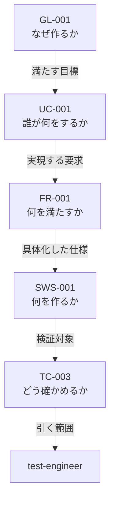

# 開発方式 対応表（2026-08-10）

**開発方式を 1 つ決めれば、仕様書・フェーズ・エージェント・プロセス・成果物・レビューがすべて決まる。その対応表である。**

**根拠・計測・経緯は `02-development-modes.md` にある。本書は表だけを持つ。**

**適用先:** プロセス規則 §3.1.1（段 1 で本書の内容を移す）。**移した時点で本書は履歴になる。**

**開発方式は `簡易` / `標準` / `厳格` の 3 つ。全表の列はこの 3 つ ＋ `備考` である。**

| 記号 | 意味 |
|---|---|
| `必須` / `実施` / `●` | 必ず行う |
| `免除` / `—` | 行わない |
| `条件付き` | 備考の条件に該当する場合のみ行う |

> **値は 3 つだけである。`任意` を使ってはならない（MUST NOT）。** 走行ごとに答えが変わり、決めていないことと区別が付かない。

---

## 1. 表 0 —— 開発方式の判定

**setup フェーズの手順 0b3 で判定し、`CLAUDE.md`「スケールダウン設定」に記録する。**

| | **簡易** | **標準** | **厳格** | 備考 |
|---|---|---|---|---|
| **期間** | 1 日以内で完了 | 1 日超 | 1 週間超 | 見積もりでよい |
| **モジュール** | 少数 | 複数 | 複数チーム相当の並列実装 | |
| **外部依存** | 最小限 | あり | 外部システム連携あり | |
| **Critical** | — | — | **有効なら期間・規模によらず厳格** | failure が人身・金銭・個人情報のいずれかに直結する場合 |
| **例** | サイコロアプリ、電卓、簡易 CLI、ユーティリティライブラリ | API サービス、DB 連携デスクトップアプリ | 業務システム、マイクロサービス群、**決済・医療機器連携・認証基盤** | |

**Critical は他の行を上書きする。** 1 日で作る決済処理も **厳格** である。

**条件付き 13 フラグ**（開発方式とは独立に、個別に有効化する）: 法的調査 / 特許調査 / 技術動向調査 / 機能安全(HARA・FMEA・FTA) / アクセシビリティ(WCAG 2.1) / HW連携 / AI/LLM連携 / フレームワーク要求定義 / HW生産工程管理 / 製品i18n・l10n / 認証取得 / 運用・保守 / 実機テスト。**判断基準と判断時期はプロセス規則 §3.4 に従う。**

---

## 2. 表 A —— 仕様書

| | **簡易** | **標準** | **厳格** | 備考 |
|---|---|---|---|---|
| **仕様形式** | ANMS | ANPS-part | ANPS-chapter | |
| **枚数** | 1 | 4 | 15 | **Critical で厳格になった小さなプロジェクトでは、15 枚それぞれが小さくなるだけで枚数は減らない** |
| **分割の単位** | 分割しない | 部 | 章 | |
| **文法ファイル** | `spec-anms.sgra` | `spec.sgra` | `spec.sgra` | `tools/spec-query/` から仕様書フォルダへ複製する |
| **テンプレートの行数（記入前）** | 664 行 | 697 行 | 758 行 | **骨格に各ノード型 2 件ずつを置いた状態。** 実プロジェクトの仕様書はこれより大きい |
| **ファイル名** | `01-11-spec` | `01-04-requirements` `05-08-design` `09-11-test` `A-appendix` | `01-foundation` `02-overview` `03-use-cases` `04-requirements` `05-design` `06-software-specification` `07-test-strategy` `08-design-principles-check` `09-uc-test-cases` `09-uc-test-results` `10-sws-test-cases` `10-sws-test-results` `11-nfr-test-cases` `11-nfr-test-results` `A-appendix` | 付録は全形式で独立させる |

> **分割の価値は「読む量が減ること」ではない。** srs-writer と architect が別ファイルを同時に書けること、章ごとに承認を分けられること、差分が小さくなることである。**読む量については表 A-2 を見る。**

---

## 3. 表 A-2 —— 誰が仕様書のどこを引くか

| 体（観点） | **簡易** | **標準** | **厳格** | 備考 |
|---|---|---|---|---|
| **architect** | 全文 | **全文** | **全文** | **要求は互いに関係する。** `FR-001` の設計が `FR-005` と衝突しないかは、部分だけでは判断できない |
| **implementer** | 全文 | **全文** | **全文** | 同上。**NFR は全 FR を横断する** |
| **security-reviewer** | 全文 | **全文** | **全文** | 脅威は要求横断 |
| **review-agent（R1 要求）** | 全文 | `01-04-requirements` | `01`〜`04` | 観点が対象章に閉じる |
| **review-agent（R2・R7 設計）** | 全文 | `05-08-design` | `05`・`06` | 同上 |
| **review-agent（R6 テスト）** | 全文 | `09-11-test` | `09`〜`11` | 同上 |
| **test-engineer** | 全文 | `09-11-test` ＋ 対象ノードの祖先 | `07` `09`〜`11` ＋ 対象ノードの祖先 | **テストは対象ノード 1 つに紐づく。絞れる** |
| **user-manual-writer** | 全文 | `01-04-requirements` | `02`・`03` | 完成物の説明。要求の整合を判断しない |
| **runbook-writer** | 全文 | `05-08-design` | `02` | 同上 |

**「対象ノードの祖先」とは:**

`TC-003` が何を検証しているかは、親をたどれば分かる。**祖先は 4 ノードであって 4 章ではない。**

> **引く道具が無い。** `--filter-nodes` は HTML にしか効かず JSON には効かない（実測）。**`tools/spec-query/ancestors.jq` を新設する**（段 6）。経路は `strictdoc export --formats=json` → `jq`。

> **設計と実装が全文を引く以上、仕様書側のコンテキスト削減は test-engineer・review-agent・文書作成の 3 者に限られる。** 規則側の削減（−94.2%）とは独立であり、そちらは影響を受けない。

---

## 4. 表 B-1 —— フェーズ別の手順数

| | **簡易** | **標準** | **厳格** | 備考（全手順数） |
|---|---:|---:|---:|---|
| **Phase 0 セットアップ** | **19** | 19 | 19 | 19。**方式によらず減らせない。ここが開発方式と 13 フラグを決める段である** |
| **Phase 1 企画** | **9** | 9 | 9 | 9。モック / PoC は全方式で実施 |
| **Phase 2 外部依存選定** | 条件付き | 条件付き | 条件付き | 7。HW・AI・フレームワークのいずれかが有効なとき |
| **Phase 3 設計** | **7** | 13〜14 | 14 | 14。差は 3h（WBS） |
| **Phase 4 実装** | **6** | 8 | 8 | 8 |
| **Phase 5 テスト** | **4** | 7 | 7 | 7 |
| **Phase 6 納品** | **5** | 11 | 11 | 11 |
| **Phase 7 運用・保守** | 条件付き | 条件付き | 条件付き | 6。運用・保守フラグが有効なとき |
| **フェーズ完了時の共通手順**（1 フェーズあたり） | **3** | 7 | 7 | 7。簡易で残るのは Fa・Fc・Fd |
| **合計**（Phase 2・7 が無効の場合） | **68** | **109〜110** | **110** | 8 フェーズすべて有効なら 137 |

**ゲートは方式によらず免除しない。免除するのは手順であってゲートではない。**

---

## 5. 表 B-2 —— 手順別の実施可否

**表 B-1 で差が出る手順だけを挙げる。ここに無い手順は全方式で実施する。**

| 手順 | **簡易** | **標準** | **厳格** | 備考 |
|---|:-:|:-:|:-:|---|
| **1d** モック / PoC | 実施 | 実施 | 実施 | **全方式で実施。** UI が変わることと、最初にイメージを合わせることは別問題である |
| **3e** OpenAPI 生成 | 免除 | 実施 | 実施 | 簡易でも API を持つなら実施 |
| **3f** 脅威モデリング | 条件付き | 実施 | 実施 | 外部からの入力経路がある場合（表 D-2 の 31） |
| **3g** 可観測性設計 | 免除 | 実施 | 実施 | 表 D-2 の 26 |
| **3g2** deployment-design | 条件付き | 実施 | 実施 | 配布以外のデプロイ先がある場合（表 D-2 の 27） |
| **3h** WBS 作成 | 免除 | **条件付き** | **実施** | 並列実装がある場合（表 D-2 の 20）。**単線で 1 週間未満の仕事に工程表は要らない** |
| **3i** リスク台帳作成 | 免除 | 実施 | 実施 | 表 D-1 の 8 |
| **3j** 安全分析（HARA / FMEA / FTA） | 免除 | 条件付き | 条件付き | 機能安全フラグ（表 D-2 の 30）。**Critical では必須** |
| **4a** Git worktree による並列実装 | 免除 | **条件付き** | **実施** | 表 D-1 の 18 |
| **4b** 可観測性の計装 | 免除 | 実施 | 実施 | 表 D-2 の 26 |
| **4c2** IaC 実装 | 条件付き | 実施 | 実施 | 表 D-2 の 27 |
| **4e** SCA スキャン | 実施 | 実施 | 実施 | **全方式で実施**（表 D-1 の 4）。依存が 0 件なら該当なしと記録する |
| **5c** 性能テスト | 条件付き | 実施 | 実施 | 数値目標を持つ NFR がある場合（表 D-2 の 25） |
| **5c2** 実機テスト | 条件付き | 条件付き | 条件付き | 実機テストフラグ |
| **5d** 進捗曲線の更新 | 免除 | 実施 | 実施 | 表 D-2 の 21 |
| **6b〜6e** デプロイ・監視・ロールバック | 条件付き | 実施 | 実施 | 表 D-2 の 27 |
| **6f2** ユーザーマニュアル | 免除 | 実施 | 実施 | 表 D-1 の 12 |
| **6f3** runbook | 条件付き | 条件付き | 条件付き | 運用・保守フラグ |
| **Fb** コストログ追記 | 免除 | 実施 | 実施 | 表 D-2 の 22 |
| **Fd** executive-dashboard 更新 | 免除 | 実施 | 実施 | 表 D-2 の 23。**pipeline-state の更新は全方式で実施** |
| **Fe** ふりかえり | 免除 | 実施 | 実施 | 表 D-1 の 10 |
| **Ff** decree 適用 | 免除 | 実施 | 実施 | Fe に従属 |
| **Fg** 変更要求の処理 | 免除 | 条件付き | 条件付き | 表 D-1 の 7。簡易では仕様書を直接直す |

---

## 6. 表 C —— 起動するエージェント

| # | エージェント | **簡易** | **標準** | **厳格** | 備考 |
|:-:|---|:-:|:-:|:-:|---|
| 1 | project-manager | ● | ● | ● | pipeline-state と decision を持つ |
| 2 | srs-writer | ● | ● | ● | |
| 3 | architect | ● | ● | ● | |
| 4 | implementer | ● | ● | ● | |
| 5 | test-engineer | ● | ● | ● | トレーサビリティを持つ |
| 6 | review-agent | ● | ● | ● | **回数と基準は表 E** |
| 7 | technical-authority | ● | ● | ● | ゲート判定は全方式で行う |
| 8 | license-checker | ● | ● | ● | ライセンス管理（表 D-1 の 3） |
| 9 | kotodama-kun | ● | ● | ● | **簡易でも仕様書は書く** |
| 10 | security-reviewer | ● | ● | ● | SCA が全方式必須。**結果の判定には判定する体が要る** |
| 11 | risk-manager | — | ● | ● | リスク管理が簡易で免除（表 D-1 の 8） |
| 12 | change-manager | — | 条件付き | 条件付き | 変更管理が簡易で免除（表 D-1 の 7） |
| 13 | process-improver | — | ● | ● | プロセス改善が簡易で免除（表 D-1 の 10） |
| 14 | decree-writer | — | ● | ● | process-improver に従属 |
| 15 | progress-monitor | — | ● | ● | 簡易では所有する file_type が 1 つも無くなる |
| 16 | user-manual-writer | — | ● | ● | ユーザードキュメント作成が簡易で免除（表 D-1 の 12） |
| 17 | runbook-writer | — | 条件付き | 条件付き | 運用・保守フラグ |
| 18 | incident-reporter | — | 条件付き | 条件付き | 運用・保守フラグ |
| 19 | field-test-engineer | — | 条件付き | 条件付き | 実機テストフラグ |
| 20 | feedback-classifier | — | 条件付き | 条件付き | 実機テストフラグ |
| 21 | field-issue-analyst | — | 条件付き | 条件付き | 実機テストフラグ |
| 22 | framework-translation-verifier | — | — | — | **パイプラインでは起動しない。** フレームワーク文書の保守用 |
| | **起動しうる体数** | **10** | **21** | **21** | |

> **標準と厳格で起動する体は同じである。** 差は「誰が動くか」ではなく、**どれだけ作るか（表 D）と、どれだけ厳しく見るか（表 E）**に出る。

---

## 7. 表 D-1 —— プロセス

**プロセス規則 §3.2（必須）と §3.3（推奨）を 1 つにまとめた。** 章が分かれていた理由は「全プロジェクト共通か中規模以上か」だけであり、**その区別は本表の値がすでに表している。**

**簡易が行うものを上に置いた。**

| # | プロセス | **簡易** | **標準** | **厳格** | 備考 |
|:-:|---|:-:|:-:|:-:|---|
| 1 | トレーサビリティ管理 | **必須** | 必須 | 必須 | §3.2。**仕様書の親子関係そのもの。追加作業ゼロ** |
| 2 | 監査記録管理（decision） | **必須** | 必須 | 必須 | §3.2。**これが無いと後から何も検証できない。** 簡易は記録形式を簡略化してよい |
| 3 | ライセンス管理 | **必須** | 必須 | 必須 | §3.2。依存を足すときだけ動く |
| 4 | SCA（依存ライブラリの既知脆弱性調査） | **必須** | 必須 | 必須 | §3.2。`npm audit` 等。**コマンド 1 つ。やらない理由が無い** |
| 5 | 問題管理（defect / CR） | **条件付き** | 必須 | 必須 | §3.2。簡易は**同じ defect が再発したとき**のみ票を起こす |
| 6 | SAST（自コードの静的脆弱性解析） | **条件付き** | 必須 | 必須 | §3.2。CodeQL 等。**CI の設定が要る。** 簡易は外部入力を扱う場合のみ |
| 7 | 変更管理 | 免除 | 必須 | 必須 | §3.2。**簡易は仕様書を直接直す** |
| 8 | リスク管理 | 免除 | 必須 | 必須 | §3.2 |
| 9 | コスト管理 | 免除 | 必須 | 必須 | §3.2。記録先（表 D-2 の 22）が簡易で免除 |
| 10 | プロセス改善・再発防止（CAR / OPF） | 免除 | 必須 | 必須 | §3.3。表 C-13・C-14 の根拠 |
| 11 | ドキュメント版管理 | 免除 | 必須 | 必須 | §3.3 |
| 12 | ユーザードキュメント・マニュアル作成 | 免除 | 必須 | 必須 | §3.3。表 C-16 の根拠 |
| 13 | リリース管理 | 免除 | 条件付き | **必須** | §3.3。複数バージョンを並行保守するとき（標準） |
| 14 | ステークホルダー管理 | 免除 | 条件付き | **必須** | §3.3。ステークホルダーが複数いるとき（標準） |
| 15 | API バージョニング・後方互換性 | 免除 | 条件付き | 条件付き | §3.3。第三者に公開する API を持つ場合 |
| 16 | **コミュニケーション管理** | 免除 | **免除** | **必須** | §3.3。**並列する担い手がいて初めて要る** |
| 17 | **トレーニング・知識移転** | 免除 | **免除** | **必須** | §3.3。**引き継ぐ相手がいて初めて要る** |
| 18 | **並列実装（Git worktree）** | 免除 | **条件付き** | **必須** | **現行のどの表にも行が無かった** |

> **7・8・9 は現行 §3.1.1 のルール行を改める。** そこには「defect/CR 記録、リスク管理、トレーサビリティ、変更管理は全規模で必須」とある。**変更管理・リスク管理を簡易で免除し、問題管理を条件付きに下げる。トレーサビリティは全方式必須のまま残す。**

> **§3.2 / §3.3 という章分けは、本表が入れば不要になる。** プロセスを 1 つの一覧にして、いつ適用するかは表が言う。

---

## 8. 表 D-2 —— 成果物

| # | 成果物 | **簡易** | **標準** | **厳格** | 備考 |
|:-:|---|:-:|:-:|:-:|---|
| 19 | pipeline-state | **必須** | 必須 | 必須 | **方式によらず必須。** 中断からの再開に必要な唯一の状態記録 |
| 20 | WBS / ガントチャート | 免除 | **条件付き** | **必須** | 並列実装がある場合（標準）。**単線で 1 週間未満の仕事に工程表は要らない** |
| 21 | 進捗レポート（progress/） | 免除 | 必須 | 必須 | 表 C-15 の根拠 |
| 22 | cost-log.json | 免除 | 必須 | 必須 | 表 D-1 の 9 と対 |
| 23 | executive-dashboard.md | 免除 | 必須 | 必須 | |
| 24 | stakeholder-register.md | 免除 | 条件付き | **必須** | ステークホルダーが複数いる場合（標準） |
| 25 | 性能テスト（k6 等） | 条件付き | 必須 | 必須 | 数値目標を持つ NFR がある場合（簡易） |
| 26 | 可観測性設計 | 免除 | 必須 | 必須 | |
| 27 | deployment-design | 条件付き | 必須 | 必須 | 配布以外のデプロイ先がある場合（簡易） |
| 28 | R3 コードレビューの**個別報告** | 免除 | 必須 | 必須 | 表 E を見る |
| 29 | R6 テストレビューの**個別報告** | 免除 | 必須 | 必須 | 表 E を見る |
| 30 | 機能安全分析（HARA / FMEA / FTA） | 免除 | 条件付き | 条件付き | 機能安全フラグ。**Critical では必須** |
| 31 | 脅威モデリング（STRIDE） | 条件付き | 必須 | 必須 | 外部からの入力経路がある場合（簡易） |

---

## 9. 表 E —— レビューの回数と基準

**重大度は 4 段（Critical / High / Medium / Low）で全方式共通。差は「何回見るか」と「どこを合格線にするか」に出る。**

| | **簡易** | **標準** | **厳格** | 備考 |
|---|---|---|---|---|
| **レビュー報告の回数** | **1 回**（最終レビューで R1〜R7 を網羅） | **5 回**（Phase 1・3・4・5・6） | **5 回** | 簡易でも**ゲートは 8 つとも判定する**。統合してよいのは報告であって判定ではない |
| **観点の見方** | 1 走行で全観点 | 1 走行でそのフェーズの全観点 | **観点ごとに別走行** | 厳格は R1〜R7 を混ぜない。**混ぜると見落としが観点間で隠れる** |
| **合格線（Critical）** | 0 | 0 | 0 | 全方式共通 |
| **合格線（High）** | 0 | 0 | 0 | 全方式共通 |
| **合格線（Medium）** | 対応記録があればよい | 対応記録があればよい | **0（修正済みのみ）** | 厳格は据置き・受容を認めない |
| **合格線（Low）** | 記録不要 | 対応記録があればよい | 対応記録があればよい | |
| **再レビュー** | 最終レビューの 1 回のみ | 「修正済み」とした指摘について実施 | **全指摘について実施**（修正・据置き・受容を問わず検証） | |
| **ゲート FAIL 時のエスカレーション** | 3 回目 | 3 回目 | **2 回目** | プロセス規則 §9.1.1 の再試行ポリシーを厳格で 1 段早める |
| **waiver** | 3 条件（ユーザー承認・tech-decision 記録・final-report 転記） | 同左 | 同左 ＋ **再評価時期を日付で明示** | いずれかを欠く waiver は無効 |
| **R3 / R6 の個別報告** | 免除 | 必須 | 必須 | 表 D-2 の 28・29 |

> **簡易でレビューを 1 回に統合しても、ゲートは 8 つとも判定する。** §3.1.1 のルール行が「レビューは統合してよいがスキップは禁止」と定めている。**免除するのは報告というファイルであって、判定ではない。**

---

## 10. 簡易で実際に何が動くか

| | 内容 |
|---|---|
| **仕様書** | ANMS 1 枚 |
| **手順** | 68（全 137 のうち） |
| **エージェント** | **10 体** —— project-manager / srs-writer / architect / implementer / test-engineer / review-agent / technical-authority / license-checker / kotodama-kun / security-reviewer |
| **必須プロセス** | **4 件** —— トレーサビリティ管理 / 監査記録管理 / ライセンス管理 / SCA |
| **条件付きプロセス** | 2 件 —— 問題管理 / SAST |
| **必須の成果物** | **1 件** —— pipeline-state |
| **レビュー** | 報告 1 回（R1〜R7 網羅）。合格線 Critical 0 / High 0 |
| **ゲート** | **全 8 ゲートを判定する。免除しない** |

---

## 11. 本表が満たすべき検査

`tools/check-mode-matrix.mjs`（段 1 で新設）が確かめる。

| # | 判定 |
|:-:|---|
| 1 | **全表の列が `簡易` / `標準` / `厳格` / `備考` である** |
| 2 | **どのセルにも `任意` が無い** |
| 3 | **`Micro` / `Small` / `Standard` / `Large` / `中規模以上` が 0 件** |
| 4 | 表 C のエージェント名が `agent-list.md` §1 の 22 体と過不足なく一致する |
| 5 | 表 D-1 のプロセス名がプロセス規則のプロセス一覧と過不足なく一致する（18 件） |
| 6 | 表 B-2 の手順記号が `commands/full-auto-dev.md` に実在する |
| 7 | `条件付き` のセルには備考に条件が書かれている |
| 8 | **表 C で `—` の体が所有する file_type が、表 D-2 で同じ方式の `免除` と一致する**（起動しない体の成果物が必須になっていない） |
| 9 | 表 B-1 の合計が、表 B-2 の免除を差し引いた数と一致する |
| 10 | 表 E の重大度が `review-standards.md`「重大度別の対応ルール」の 4 段と一致する |
| 11 | 既知の欠陥（表 C に存在しないエージェント名を 1 件仕込む）で FAIL する |
