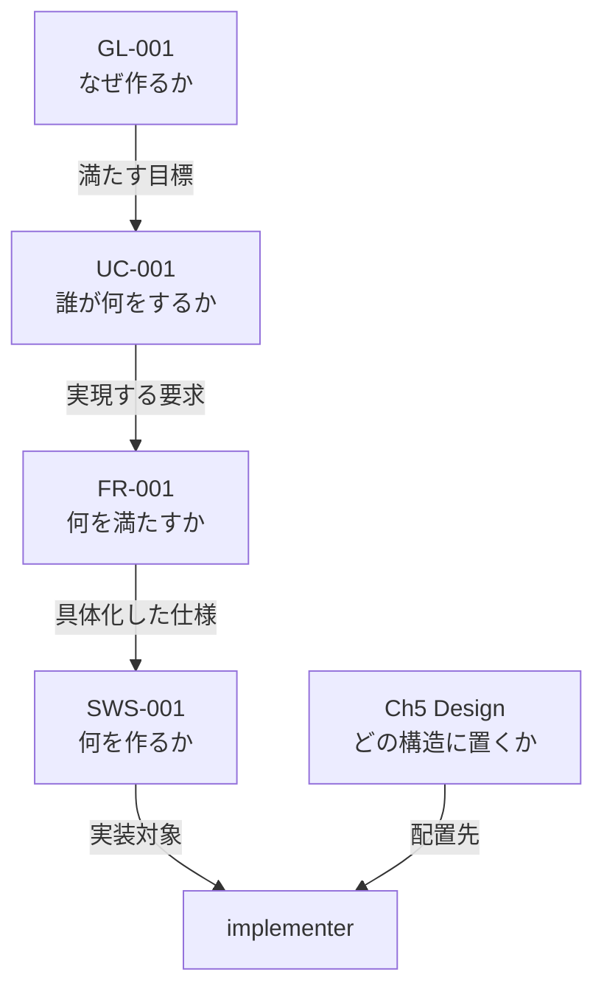

# 開発方式 対応表（2026-08-10）

**開発方式を 1 つ決めれば、仕様書・フェーズ・エージェント・成果物がすべて決まる。その対応表である。**

**根拠・計測・経緯は `02-development-modes.md` にある。本書は表だけを持つ。**

**適用先:** プロセス規則 §3.1.1（段 1 で本書の内容を移す）。**移した時点で本書は履歴になる。**

**全表の列は `Small / Standard / Large / 備考` である。**

| 記号 | 意味 |
|---|---|
| `必須` / `実施` / `●` | 必ず行う |
| `免除` / `—` | 行わない |
| `条件付き` | 備考の条件に該当する場合のみ行う |

> **値は 3 つだけである。`任意` を使ってはならない（MUST NOT）。** 走行ごとに答えが変わり、決めていないことと区別が付かない。

---

## 1. 表 0 —— 規模の判定

| | **Small** | **Standard** | **Large** | 備考 |
|---|---|---|---|---|
| **期間** | 1 日以内で完了 | 1 日超 | 1 週間超 | 見積もりでよい |
| **モジュール** | 少数 | 複数 | 複数チーム相当の並列実装 | |
| **外部依存** | 最小限 | あり | 外部システム連携あり | |
| **例** | サイコロアプリ、電卓、簡易 CLI、ユーティリティライブラリ | API サービス、DB 連携デスクトップアプリ | 業務システム、マイクロサービス群 | |

**開発方式 = 規模（上表から 1 つ）× Critical フラグ × 条件付き 13 フラグ。** setup フェーズの手順 0b3 で決め、`CLAUDE.md`「スケールダウン設定」に記録する。

**Critical フラグ:** failure が人身・金銭・個人情報のいずれかに直結する場合に有効。**規模は判定に使わない。有効時は、規模によらず全表の `Standard` 列を適用し、加えて機能安全分析を `必須` にする。**

**条件付き 13 フラグ:** 法的調査 / 特許調査 / 技術動向調査 / 機能安全(HARA・FMEA・FTA) / アクセシビリティ(WCAG 2.1) / HW連携 / AI/LLM連携 / フレームワーク要求定義 / HW生産工程管理 / 製品i18n・l10n / 認証取得 / 運用・保守 / 実機テスト。**判断基準と判断時期はプロセス規則 §3.4 に従う。規模との掛け合わせは持たない。**

---

## 2. 表 A —— 仕様書

| | **Small** | **Standard** | **Large** | 備考 |
|---|---|---|---|---|
| **仕様形式** | ANMS | ANPS-part | ANPS-chapter | 規模と 1 対 1 |
| **枚数** | 1 | 4 | 15 | |
| **分割の単位** | 分割しない | 部 | 章 | |
| **文法ファイル** | `spec-anms.sgra` | `spec.sgra` | `spec.sgra` | `tools/spec-query/` から仕様書フォルダへ複製する |
| **テンプレートの行数（記入前）** | 664 行 | 697 行 | 758 行 | **骨格に各ノード型 2 件ずつを置いた状態の行数。** 実プロジェクトの仕様書はこれより大きい |
| **implementer が読む単位** | 全文（1 枚） | `05-08-design` ＋ 実装対象 `SWS` の**祖先ノード** | `05-design` `06-software-specification` ＋ 実装対象 `SWS` の**祖先ノード** | 下記 |
| **ファイル名** | `01-11-spec` | `01-04-requirements` `05-08-design` `09-11-test` `A-appendix` | `01-foundation` `02-overview` `03-use-cases` `04-requirements` `05-design` `06-software-specification` `07-test-strategy` `08-design-principles-check` `09-uc-test-cases` `09-uc-test-results` `10-sws-test-cases` `10-sws-test-results` `11-nfr-test-cases` `11-nfr-test-results` `A-appendix` | 付録は全形式で独立させる |

**「祖先ノード」とは何か。** `SWS-001` を実装するには、それが何のためかを知る必要がある。**だが要るのは章の全文ではなく、その `SWS` から親をたどった鎖だけである。**

**祖先の鎖:**

`SWS-001` の祖先は 3 ノード（`FR-001` / `UC-001` / `GL-001`）であって、`01-foundation` `03-use-cases` `04-requirements` の全章ではない。**これが StrictDoc を使う理由そのものである。**

> **引く道具が無い。** `--filter-nodes` は HTML にしか効かず JSON には効かない（実測）。**`tools/spec-query/ancestors.jq` を新設し、UID を渡すと祖先の鎖を返すようにする**（段 6 で新設）。経路は `strictdoc export --formats=json` → `jq`。

> **実プロジェクトで祖先が何行になるかは測っていない。** 骨格には各型 2 件しか無いため測れない。**最初の実プロジェクトで測る。**

---

## 3. 表 B-1 —— フェーズ別の手順数

| | **Small** | **Standard** | **Large** | 備考（全手順数） |
|---|---:|---:|---:|---|
| **Phase 0 セットアップ** | **19** | 19 | 19 | 19。**規模によらず減らせない。ここが規模と 13 フラグを決める段である** |
| **Phase 1 企画** | **9** | 9 | 9 | 9。**モック / PoC は Small でも実施する** |
| **Phase 2 外部依存選定** | 条件付き | 条件付き | 条件付き | 7。HW・AI・フレームワークのいずれかが有効なとき |
| **Phase 3 設計** | **7** | 14 | 14 | 14 |
| **Phase 4 実装** | **6** | 8 | 8 | 8 |
| **Phase 5 テスト** | **4** | 7 | 7 | 7 |
| **Phase 6 納品** | **5** | 11 | 11 | 11 |
| **Phase 7 運用・保守** | 条件付き | 条件付き | 条件付き | 6。運用・保守フラグが有効なとき |
| **フェーズ完了時の共通手順**（1 フェーズあたり） | **3** | 7 | 7 | 7。Small で残るのは Fa・Fc・Fd |
| **合計**（Phase 2・7 が無効の場合） | **68** | **110** | **110** | 8 フェーズすべて有効なら 137 |

**ゲートは規模によらず免除しない。免除するのは手順であってゲートではない。**

---

## 4. 表 B-2 —— 手順別の実施可否

**表 B-1 で差が出る手順だけを挙げる。ここに無い手順は全規模で実施する。**

| 手順 | **Small** | **Standard** | **Large** | 備考 |
|---|:-:|:-:|:-:|---|
| **1d** モック / PoC | 実施 | 実施 | 実施 | **全規模で実施。** UI が変わることと、最初にイメージを合わせることは別問題である |
| **3e** OpenAPI 生成 | 免除 | 実施 | 実施 | Small でも API を持つなら実施 |
| **3f** 脅威モデリング | 条件付き | 実施 | 実施 | 外部からの入力経路がある場合（表 D-30） |
| **3g** 可観測性設計 | 免除 | 実施 | 実施 | 表 D-25 |
| **3g2** deployment-design | 条件付き | 実施 | 実施 | 配布以外のデプロイ先がある場合（表 D-26） |
| **3h** WBS 作成 | 免除 | 実施 | 実施 | 表 D-19 |
| **3i** リスク台帳作成 | 免除 | 実施 | 実施 | 表 D-8 |
| **3j** 安全分析（HARA / FMEA / FTA） | 免除 | 条件付き | 条件付き | 機能安全フラグ（表 D-29）。**Critical では必須** |
| **4b** 可観測性の計装 | 免除 | 実施 | 実施 | 表 D-25 |
| **4c2** IaC 実装 | 条件付き | 実施 | 実施 | 表 D-26 |
| **4e** SCA スキャン | 実施 | 実施 | 実施 | **全規模で実施**（表 D-4）。依存が 0 件なら該当なしと記録する |
| **5c** 性能テスト | 条件付き | 実施 | 実施 | 数値目標を持つ NFR がある場合（表 D-24） |
| **5c2** 実機テスト | 条件付き | 条件付き | 条件付き | 実機テストフラグ |
| **5d** 進捗曲線の更新 | 免除 | 実施 | 実施 | 表 D-20 |
| **6b〜6e** デプロイ・監視・ロールバック | 条件付き | 実施 | 実施 | 表 D-26 |
| **6f2** ユーザーマニュアル | 免除 | 実施 | 実施 | 表 D-14 |
| **6f3** runbook | 条件付き | 条件付き | 条件付き | 運用・保守フラグ |
| **Fb** コストログ追記 | 免除 | 実施 | 実施 | 表 D-21 |
| **Fd** executive-dashboard 更新 | 免除 | 実施 | 実施 | 表 D-22。**pipeline-state の更新は全規模で実施** |
| **Fe** ふりかえり | 免除 | 実施 | 実施 | 表 D-12 |
| **Ff** decree 適用 | 免除 | 実施 | 実施 | Fe に従属 |
| **Fg** 変更要求の処理 | 免除 | 条件付き | 条件付き | 表 D-7。Small では仕様書を直接直す |

---

## 5. 表 C —— 起動するエージェント

| # | エージェント | **Small** | **Standard** | **Large** | 備考 |
|:-:|---|:-:|:-:|:-:|---|
| 1 | project-manager | ● | ● | ● | pipeline-state（表 D-18）と decision（表 D-2）を持つ |
| 2 | srs-writer | ● | ● | ● | |
| 3 | architect | ● | ● | ● | |
| 4 | implementer | ● | ● | ● | |
| 5 | test-engineer | ● | ● | ● | トレーサビリティ（表 D-1）を持つ |
| 6 | review-agent | ● | ● | ● | |
| 7 | technical-authority | ● | ● | ● | ゲート判定は全規模で行う |
| 8 | license-checker | ● | ● | ● | ライセンス管理（表 D-3） |
| 9 | kotodama-kun | ● | ● | ● | **Small でも仕様書は書く** |
| 10 | security-reviewer | ● | ● | ● | SCA（表 D-4）が全規模必須。**結果の判定には判定する体が要る** |
| 11 | risk-manager | — | ● | ● | リスク管理が Small で免除（表 D-8） |
| 12 | change-manager | — | 条件付き | 条件付き | 変更管理が Small で免除（表 D-7）。Standard 以上は変更要求が出たとき |
| 13 | process-improver | — | ● | ● | プロセス改善が Small で免除（表 D-12） |
| 14 | decree-writer | — | ● | ● | process-improver に従属 |
| 15 | progress-monitor | — | ● | ● | Small では WBS も進捗レポートも免除で、**所有する file_type が 1 つも無くなる** |
| 16 | user-manual-writer | — | ● | ● | ユーザードキュメント作成が Small で免除（表 D-14） |
| 17 | runbook-writer | — | 条件付き | 条件付き | 運用・保守フラグ |
| 18 | incident-reporter | — | 条件付き | 条件付き | 運用・保守フラグ |
| 19 | field-test-engineer | — | 条件付き | 条件付き | 実機テストフラグ |
| 20 | feedback-classifier | — | 条件付き | 条件付き | 実機テストフラグ |
| 21 | field-issue-analyst | — | 条件付き | 条件付き | 実機テストフラグ |
| 22 | framework-translation-verifier | — | — | — | **パイプラインでは起動しない。** フレームワーク文書の保守用 |
| | **起動しうる体数** | **10** | **21** | **21** | |

**Standard と Large は同一である。** Large の差は表 A（ANPS-chapter）と Git worktree による並列実装に出る。

---

## 6. 表 D-1 —— プロセス

**プロセス規則 §3.2（必須）と §3.3（推奨）を 1 つにまとめた。** 章が分かれていた理由は「全プロジェクト共通か、中規模以上か」だけであり、**その区別は本表の値がすでに表している。**

**Small が行うものを上に置いた。**

| # | プロセス | **Small** | **Standard** | **Large** | 備考 |
|:-:|---|:-:|:-:|:-:|---|
| 1 | トレーサビリティ管理 | **必須** | 必須 | 必須 | §3.2。**仕様書の親子関係そのもの。追加作業ゼロ** |
| 2 | 監査記録管理（decision） | **必須** | 必須 | 必須 | §3.2。**これが無いと後から何も検証できない。** Small は記録形式を簡略化してよい |
| 3 | ライセンス管理 | **必須** | 必須 | 必須 | §3.2。依存を足すときだけ動く |
| 4 | SCA（依存ライブラリの既知脆弱性調査） | **必須** | 必須 | 必須 | §3.2。`npm audit` 等。**コマンド 1 つ。やらない理由が無い** |
| 5 | 問題管理（defect / CR） | **条件付き** | 必須 | 必須 | §3.2。Small は**同じ defect が再発したとき**のみ票を起こす。初回はテストを直して終わる |
| 6 | SAST（自コードの静的脆弱性解析） | **条件付き** | 必須 | 必須 | §3.2。CodeQL 等。**CI の設定が要る。** Small は外部入力を扱う場合のみ |
| 7 | 変更管理 | 免除 | 必須 | 必須 | §3.2。**Small は仕様書を直接直す。** 変更要求という別の器を持たない |
| 8 | リスク管理 | 免除 | 必須 | 必須 | §3.2。1 日先のリスクを台帳で管理する意味が薄い |
| 9 | コスト管理 | 免除 | 必須 | 必須 | §3.2。記録先（表 D-21）が Small で免除。**書く場所が無いのに必須とは言えない** |
| 10 | リリース管理 | 免除 | 必須 | 必須 | §3.3 |
| 11 | コミュニケーション管理 | 免除 | 必須 | 必須 | §3.3 |
| 12 | プロセス改善・再発防止（CAR / OPF） | 免除 | 必須 | 必須 | §3.3。表 C-13・C-14 の根拠 |
| 13 | ドキュメント版管理 | 免除 | 必須 | 必須 | §3.3 |
| 14 | ユーザードキュメント・マニュアル作成 | 免除 | 必須 | 必須 | §3.3。表 C-16 の根拠 |
| 15 | トレーニング・知識移転 | 免除 | 必須 | 必須 | §3.3 |
| 16 | ステークホルダー管理 | 免除 | 必須 | 必須 | §3.3 |
| 17 | API バージョニング・後方互換性 | 免除 | 条件付き | 条件付き | §3.3。第三者に公開する API を持つ場合 |

> **7・8・9 は現行 §3.1.1 のルール行を改める。** そこには「defect/CR 記録、リスク管理、トレーサビリティ、変更管理は全規模で必須」とある。**変更管理・リスク管理を Small で免除し、問題管理を条件付きに下げる。トレーサビリティは全規模必須のまま残す。**

> **§3.2 / §3.3 という章分けは、本表が入れば不要になる。** プロセスを 1 つの一覧にして、いつ適用するかは表が言う。**プロセス規則側の章構成を動かすので、段 1 の作業に含める。**

---

## 7. 表 D-2 —— 成果物

| # | 成果物 | **Small** | **Standard** | **Large** | 備考 |
|:-:|---|:-:|:-:|:-:|---|
| 18 | pipeline-state | **必須** | 必須 | 必須 | **規模によらず必須。** 中断からの再開に必要な唯一の状態記録であり、免除すると再開手段が失われる |
| 19 | WBS / ガントチャート | 免除 | 必須 | 必須 | 表 C-15 の根拠 |
| 20 | 進捗レポート（progress/） | 免除 | 必須 | 必須 | 表 C-15 の根拠 |
| 21 | cost-log.json | 免除 | 必須 | 必須 | 表 D-9 と対 |
| 22 | executive-dashboard.md | 免除 | 必須 | 必須 | |
| 23 | stakeholder-register.md | 免除 | 条件付き | 必須 | ステークホルダーが複数いる場合（Standard） |
| 24 | 性能テスト（k6 等） | 条件付き | 必須 | 必須 | 数値目標を持つ NFR がある場合（Small） |
| 25 | 可観測性設計 | 免除 | 必須 | 必須 | |
| 26 | deployment-design | 条件付き | 必須 | 必須 | 配布以外のデプロイ先がある場合（Small） |
| 27 | R3 コードレビューの**個別報告** | 免除 | 必須 | 必須 | **レビュー自体は行う。** 観点は最終レビュー（6a）で網羅する |
| 28 | R6 テストレビューの**個別報告** | 免除 | 必須 | 必須 | 同上 |
| 29 | 機能安全分析（HARA / FMEA / FTA） | 免除 | 条件付き | 条件付き | 機能安全フラグ。**Critical では必須** |
| 30 | 脅威モデリング（STRIDE） | 条件付き | 必須 | 必須 | 外部からの入力経路がある場合（Small） |

---

## 8. Small で実際に何が動くか（まとめ）

| | 内容 |
|---|---|
| **仕様書** | ANMS 1 枚 |
| **手順** | 68（全 137 のうち） |
| **エージェント** | **10 体** —— project-manager / srs-writer / architect / implementer / test-engineer / review-agent / technical-authority / license-checker / kotodama-kun / security-reviewer |
| **必須プロセス** | **4 件** —— トレーサビリティ管理 / 監査記録管理 / ライセンス管理 / SCA |
| **条件付きプロセス** | 2 件 —— 問題管理 / SAST |
| **必須の成果物** | **1 件** —— pipeline-state |
| **ゲート** | **全 8 ゲートを免除しない** |

---

## 9. 本表が満たすべき検査

`tools/check-mode-matrix.mjs`（段 1 で新設）が確かめる。

| # | 判定 |
|:-:|---|
| 1 | 全表の列が `Small` / `Standard` / `Large` / `備考` である |
| 2 | **どのセルにも `任意` が無い** |
| 3 | 表 C のエージェント名が `agent-list.md` §1 の 22 体と過不足なく一致する |
| 4 | 表 D-1 のプロセス名がプロセス規則のプロセス一覧と過不足なく一致する（17 件） |
| 5 | 表 B-2 の手順記号が `commands/full-auto-dev.md` に実在する |
| 6 | `条件付き` のセルには備考に条件が書かれている |
| 7 | **表 C で `—` の体が所有する file_type が、表 D-2 で同じ規模の `免除` と一致する**（起動しない体の成果物が必須になっていない） |
| 8 | 表 B-1 の合計が、表 B-2 の免除を差し引いた数と一致する |
| 9 | 既知の欠陥（表 C に存在しないエージェント名を 1 件仕込む）で FAIL する |
