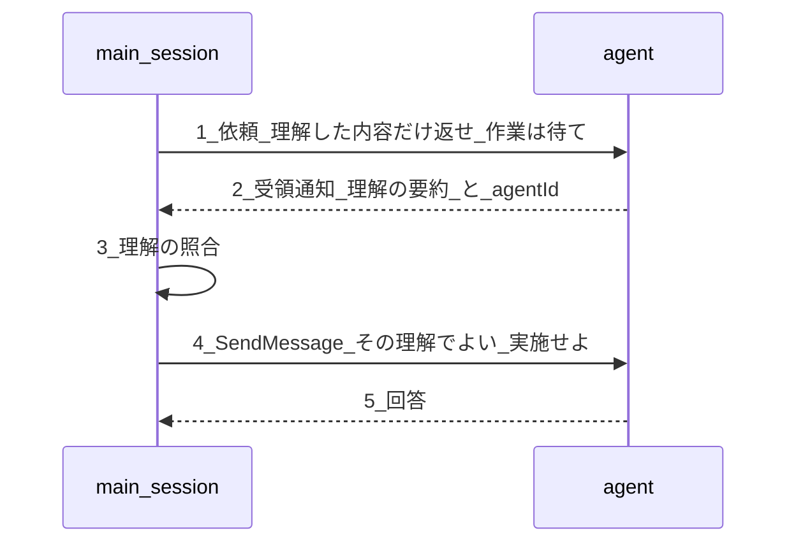
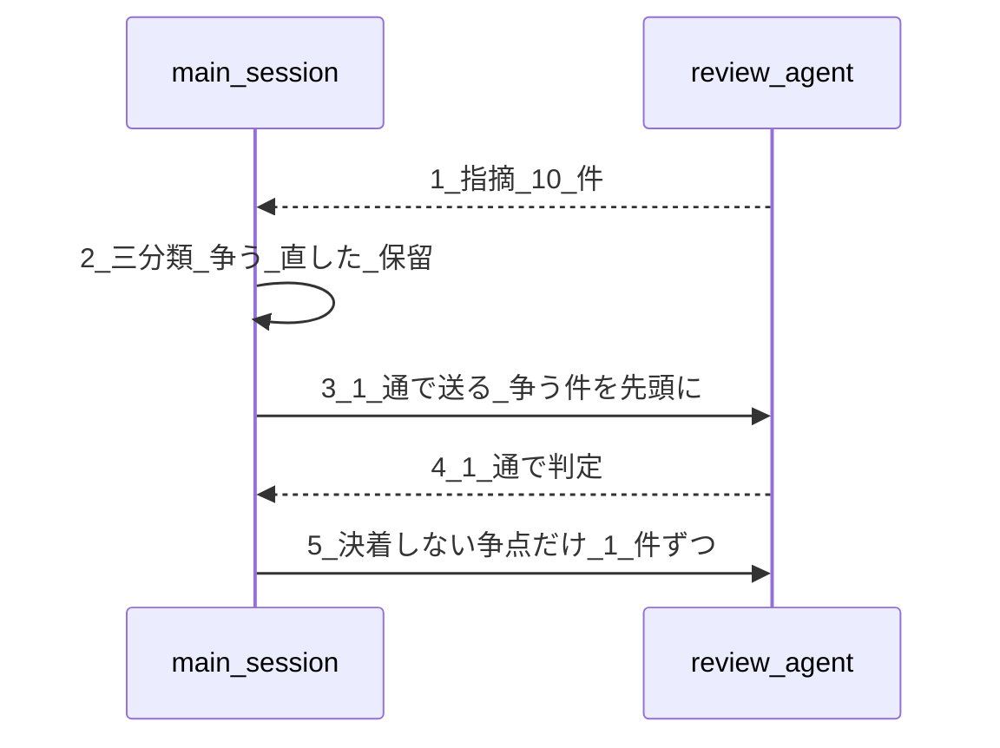

# 適用作業書（2026-08-10）

**この後の作業に必要な情報だけを持つ。** 何を・どこへ・どの順で入れるかの一覧である。

**決めた理由は書かない。** 経緯は `History/2026-08-10/03-decision-record.md` にある。開発方式の対応そのものは `00-mode-matrix.md` が持つ。仕様書の中身は `01-spec-template.md` と `02-spec-writing-rules.md` が持つ。**本書はそれらを再掲しない。**

**適用先はすべて `framework-src/{lang}/` である。** リポジトリ直下の `process-rules/` `.claude/` `CLAUDE.md` は `setup.js` の配置物であり、正本ではない。正本を直したら `node setup.js ja` で配置物を作り直す。

---

## 1. 決定（結論のみ）

| # | 件 | 決定 |
|:-:|---|---|
| 1 | 仕様書テンプレートの Chapter 8「SW設計原則 準拠確認」 | **削除する。** 判定は `review-standards.md` の総合レビューチェックリストが持つ |
| 2 | 章の数 | **10 章構成。** 旧 Ch9〜11 を 1 つずつ繰り上げる。欠番を作らない |
| 3 | 原則カタログ 27 行 | **`review-standards.md` へ索引として移す**（§5） |
| 4 | 手順記号 | **枝番を廃し連続した英字にする。** 欠番も作らない（§6） |
| 5 | 用語 | 採用語は **`仕様書テンプレート`（Specification Template）**（§4） |
| 6 | `02` の重複 7 箇所 | 各組の正本を決めた（§3） |
| 7 | 日英の比較 | **指示があるまで止める**（§11.1） |
| 8 | プロセス規則 §3.2 / §3.3 | **1 節に統合し、17 件にする**（§12） |
| 9 | 表 B-1・B-2・C・D-1・D-2 | **廃止し、`00-mode-matrix.md` §4・§5 の作業表へ統合した。** エージェント起動・成果物・手順数は作業表から導出する |

---

## 2. 残作業の全体

| 段 | 内容 | 本書の節 | 状態 |
|:-:|---|---|---|
| 0 | 基準線を取る（`tools/context-census.mjs`） | §9 | 未着手 |
| 1 | 開発方式の整理を `framework-src/` へ適用 | §6・§8・§9 | 対応表のみ完成。適用は未着手 |
| 2 | 引用節をエージェント定義へ展開（`build-agents.mjs` / `rule-section.mjs`） | §9 | 未着手 |
| 3 | 引けない参照形 22 件を直す | — | 未着手 |
| 4 | 引用の過不足を両方向で検査 | §9 | 未着手 |
| 5 | プロセス規則 §6.1 の写し 200 行を削る | §8 | 未着手 |
| 6 | 仕様形式を v0.36 へ（テンプレート・規則・章番号 658 件） | §3・§5・§7・§8 | 未着手 |
| 7 | en 追随 | 各節に併記 | 未着手 |
| 8 | 効果測定 ＋ 配置物の照合（`check-deployed.mjs`） | §9 | 未着手 |

**済んでいるのは用語集の手順 1a だけである。** `framework-src/{ja,en}/process-rules/glossary.md`（各 206 行）に新語 19・紛らわしい対 7・章番号 2 件が入っている。**それ以外、今回の決定は `framework-src/` に 1 件も入っていない。**

---

## 3. 仕様書テンプレートと解説書を直す

### 3.1 Chapter 8 の削除と 10 章化

| # | 対象 | 作業 |
|:-:|---|---|
| 1 | `01-spec-template.md` / `01-spec-template-en.md` | Chapter 8 の節（`:410-424`）を削除し、Chapter 9〜11 を 8〜10 へ繰り上げる。節番号 `9.1`〜`11.2` も `8.1`〜`10.2` へ |
| 2 | `02-spec-writing-rules.md` | 章の一覧（`:144`）から 8 の行を削除。「第 2 部 Design（Chapter 5〜8）」→「（Chapter 5〜7）」、「第 3 部 Test（Chapter 9〜11）」→「（Chapter 8〜10）」。節の一覧（`:159`）から 8 の行を削除 |
| 3 | `02-spec-writing-rules.md` | Chapter 8 の解説節（`:1038-1074`）を削除する。カタログは §5 の先へ移す |
| 4 | `02:26` STFB 節、`02:144` 安定度 列 | 「可変（レビュー時に更新）」の章が無くなる |
| 5 | `02:1489-1491` 設計根拠 3 行 | 「Ch8 に独立」「原則をカタログ」「SDP を追加」を、**削除した理由**へ書き換える。記録を残さないと次に読む者が同じ章を再発明する |

**Chapter 8 は 6 章構成でも 11 章構成でも作られている。2 度目である。**

### 3.2 ファイル名と枚数

| 形式 | 旧 | 新 |
|---|---|---|
| ANMS | `01-11-spec.md` | **`01-10-spec.md`** |
| ANPS-part | `01-04-requirements.md` / `05-08-design.md` / `09-11-test.md` / `A-appendix.md` | **`01-04-requirements.md` / `05-07-design.md` / `08-10-test.md` / `A-appendix.md`** |
| ANPS-chapter | 15 枚 | **14 枚**（`08-design-principles-check.md` が消え、09/10/11 系 6 枚が 08/09/10 系へ） |

`02` の「ファイル名と番号の規則」節（`:70-88`）を上表に合わせる。**`02:104` の `DOC` UID の記入例も `01-11-spec.md` を使っているので同時に直す。**

### 3.3 `00-mode-matrix.md` の更新

**表 A の枚数・ファイル名・ポインタは適用済み。** 残るのは再計測待ちの 1 件だけである。

| # | 場所 | 状態 |
|:-:|---|---|
| 1 | 表 A 枚数 `14` / ファイル名 `01-10-spec` / 節名のポインタ | **適用済み** |
| 2 | 表 A テンプレートの行数 | **再計測待ち**（`05-open-questions.md` B1） |
| 3 | 作業表の章参照 | 章番号の繰り上げに追随する（§7） |

### 3.4 `02` の重複 7 箇所

| # | 知識 | 正本 | 非正本側の措置 |
|:-:|---|---|---|
| 1 | `TC`/`TR` の通し連番 | `02:191` | `02:1101` を削除し「採番は §ID と採番 に従う」の参照 1 行へ |
| 2 | `_assets/` の `**Grammar**` 禁止 | `02:366` | `02:102` のセルを「大きな図。規則は §1.9 の図の規則」へ短縮 |
| 3 | 大きな図は別ファイルへ | `02:347` | `02:364` の規則表 1 行目を削除し 3 行へ詰める |
| 4 | `ADR` は鎖に載らない | `02:187` | `02:889` を削除。`02:158` / `02:178` / `02:816` は残す |
| 5 | `TEST_LEVEL` の所属 | `02:236` | `02:1032` を削除。`02:1185` は**「だけが」を削って**「本系統は `TEST_LEVEL` を持つ」にする |
| 6 | 子 → 親 → `Role` | `02:225-238` | `02:690` の表を削除し「対応は §型ごとの欄 が持つ」の参照 1 行へ |
| 7 | CA レイヤー凡例の Mermaid | `01:278-292` | `02:852-866` の Mermaid 15 行を削除し「凡例の現物は仕様書テンプレートの 5.1 にある」の参照 1 行へ。`02:868-873` の色表は残す |

**`02:1453-1462` の設計根拠と、`02:690` 直前の `NFR` 分岐の説明は重複ではない。残す。**

---

## 4. 用語 —— `仕様書テンプレート`

採用語は `仕様書テンプレート`（Specification Template）。**用語集そのものへの作業は `04-glossary-state.md` が持つ。本節は用語集以外への波及だけを持つ。**

| # | 対象 | 変更 |
|:-:|---|---|
| 1 | `02` の `骨格` 22 か所 | `仕様書テンプレート` へ書き換える |
| 2 | `agents/architect.md:106`、`agents/srs-writer.md:95` | `仕様テンプレート` → `仕様書テンプレート`（2 行 × 2 言語） |
| 3 | `01` / `01-en` の冒頭 | 自己定義を 1 行足す。ja / en で構造行数を揃える |

---

## 5. 設計原則の索引を `review-standards.md` へ

### 5.1 置き場

「総合レビューチェックリスト（R1〜R7・必須）」（ja `:452` / en `:452`）の**直前**に新設する。チェックリストが略号で書かれているため、索引はその手前が読む順である。

### 5.2 入れる現物

**設計原則の索引（`review-standards.md` へ新設する節）:**

```markdown
## 設計原則の索引

本規約は設計原則を略号で参照する。略号の正式名称と、それを判定する項目の対応は次のとおりである。**判定の本体は下の総合レビューチェックリストにあり、本表は索引である。**

| カテゴリ | 識別名 | 正式名称 | 判定する項目 |
|---|---|---|---|
| 命名 | Naming | — | R2.1 |
| 依存関係 | Dependency Direction | — | R2.16 |
| 依存関係 | SDP | Stable Dependencies Principle | R2.16 |
| 簡潔性 | KISS | Keep It Simple, Stupid | R2.8 |
| 簡潔性 | YAGNI | You Aren't Gonna Need It | R2.9 |
| 簡潔性 | Minimal Comparison | — | R2.18 |
| 簡潔性 | DRY | Don't Repeat Yourself | R2.7 |
| 責務分離 | SoC | Separation of Concerns | R2.10 |
| 責務分離 | SRP | Single Responsibility Principle | R2.2 |
| 責務分離 | SLAP | Single Level of Abstraction Principle | R2.11 |
| SOLID | OCP | Open-Closed Principle | R2.3 |
| SOLID | LSP | Liskov Substitution Principle | R2.4 |
| SOLID | ISP | Interface Segregation Principle | R2.5 |
| SOLID | DIP | Dependency Inversion Principle | R2.6 |
| 結合 | LoD | Law of Demeter | R2.12 |
| 結合 | CQS | Command-Query Separation | R2.13 |
| 可読性 | POLA | Principle of Least Astonishment | R2.14 |
| 可読性 | PIE | Program Intently and Expressively | R2.15 |
| テスト | Testability | — | R2.21 |
| 純粋性 | Pure / Semi-pure-a / Semi-pure-b / Non-pure | — | R7.1 / R7.2 / R7.6 |
| 構造 | Collect-Process Separation | 収集後処理 | R7.4 |
| 状態遷移 | State Transition | — | R4.3 |
| 並行性 | Concurrency Safety | — | R4.1 / R4.2 |
| エラー | Error Propagation | — | R3.1 / R3.2 |
| 資源管理 | Resource Lifecycle | — | R3.5 |
| 不変性 | Immutability | — | R7.5 |
| 資源効率 | Resource Efficiency | — | R5.1 / R5.3 |
```

`確認観点` の列は持たせない。同じ内容が総合レビューチェックリストの `内容` 列にあり、そこが判定の本体である。

### 5.3 `R2.21` を新設する

**総合レビューチェックリストへ追加する行:**

```markdown
| R2.21 | 設計 | SHOULD | Testability: 単体テストから検証できる形になっている。外部依存が抽象を介して差し替えられ、テストのために本番の経路を変えなくてよい。**R7.2 が要求する分離の結果を、テスト側から見て確かめる項目である。** 分離そのものの違反は R7.2 として起票し、本項目と二重に起票しない | — | — |
```

### 5.4 併せて直す

| # | 対象 | 変更 |
|:-:|---|---|
| 1 | `review-standards.md:490`（R3.5） | 「Ch6 の Resource Lifecycle は本規約で検査する」→「**資源の生存期間は本規約で検査する**」 |
| 2 | `framework-src/en/process-rules/review-standards.md` | 同じ索引と R2.21 を同時に入れる |
| 3 | `02:1046-1074` | カタログを削除する（移した先が正本になる） |

---

## 6. 手順記号を繰り上げる

### 6.1 方針

**枝番を廃し、全フェーズを連続した英字にする。** 新設予定だった `0b3` も枝番なので作らない。

> **作業表への統合で手順の数が動いた。§6.2〜§6.4 の対応表は Phase 3 のものであり、他フェーズの対応表はまだ無い**（`05-open-questions.md` H1・H2）。

| フェーズ | 変更 | 新しい記号 |
|---|---|---|
| Phase 0 | **13 手順を 1 つに統合し、開発方式の判定とステークホルダー登録簿を新設する** | `0a`〜`0h`（8） |
| Phase 3 | `3d` を削除し、`3a2` `3g2` の枝番を解消する | `3a`〜`3m`（13） |
| Phase 4 | `4c2` の枝番を解消し、**SAST を新設する** | `4a`〜`4i`（9） |
| Phase 5 | `5c2` の枝番を解消し、**`5a` `5b` を「作成 / 実行」に割る** | `5a`〜`5i`（9） |
| Phase 6 | `6f2` `6f3` `6g2` の枝番を解消し、**リリース判定チェックリストを新設する** | `6a`〜`6l`（12） |
| Phase 1・2・7・共通 | 変更なし | 現状のまま |

### 6.2 Phase 3 の対応

| 旧 | 新 | 手順 |
|---|---|---|
| `3a` | `3a` | 設計の章を詳細化する |
| `3a2` | **`3b`** | アーキテクチャをユーザーが確認するか尋ねる |
| `3b` | **`3c`** | ソフトウェア仕様の章を詳細化する |
| `3c` | **`3d`** | テスト戦略の章を定義する |
| **`3d`** | **削除** | Design Principles Compliance を設定する |
| `3e` | `3e` | OpenAPI を生成する |
| `3f` | `3f` | 脅威モデリング |
| `3g` | `3g` | 可観測性設計 |
| `3g2` | **`3h`** | deployment-design |
| `3h` | **`3i`** | WBS 作成 |
| `3i` | **`3j`** | リスク台帳作成 |
| `3j` | **`3k`** | 安全分析 |
| `3k` | **`3l`** | 設計レビュー |
| `3l` | **`3m`** | GATE-DESIGN 判定 |

**`3d` の席には旧 `3c` が入る。同じ記号が別の手順を指すようになる。** `History/` と `prompt/` に旧記号の記録が 21 件あるが、履歴なので書き換えない。**本表が読み替え表になる。**

### 6.3 作業表で動く記号

| 旧 | 新 |
|---|---|
| `3g2` deployment-design | `3h` |
| `3h` WBS 作成 | `3i` |
| `3i` リスク台帳作成 | `3j` |
| `3j` 安全分析 | `3k` |
| `4c2` IaC 実装 | `4d` |
| `5c2` 実機テスト | `5d` |
| `5d` 進捗曲線の更新 | `5e` |
| `6f2` ユーザーマニュアル | `6g` |
| `6f3` runbook | `6h` |

`1d` `3e` `3f` `3g` `4b` `4e` `5c` `6b`〜`6e` `Fb` `Fd` `Fe` `Ff` `Fg` は変わらない。

### 6.4 一括置換をかけてはならない

**手順記号に見えて手順記号でないものが 2 種類ある。**

| 場所 | 字面 | 正体 |
|---|---|---|
| `02-spec-writing-rules.md:649` | `3a1.` `3a2.` | Cockburn のユースケース拡張の採番 |
| `framework-src/{lang}/agents/technical-authority.md:69-72` | `3a.`〜`3d.` | technical-authority 自身の内部サブステップ |

**改番の対象は `commands/full-auto-dev.md`（ja / en）と `00-mode-matrix.md` の 3 ファイルに閉じる。** 枝番 9 個は正本側では `commands/full-auto-dev.md` にしか存在しない。

---

## 7. 章番号 658 件を写す

### 7.1 章

| 旧（v0.34・6 章） | 旧の章題 | 新（10 章） |
|---|---|---|
| `Ch1` | Foundation | `Ch1` |
| `Ch2` | Requirements | `Ch4` |
| `Ch3` | Architecture | `Ch5`（Design） |
| `Ch4` | Specification | `Ch6`（Software Specification） |
| `Ch5` | Test Strategy | `Ch7` |
| `Ch6` | Design Principles Compliance | **削除**（§7.3） |
| （新設） | System Overview | `Ch2` |
| （新設） | Use Cases | `Ch3` |
| （新設） | Use Case Tests | `Ch8` |
| （新設） | Software Specification Tests | `Ch9` |
| （新設） | Non-Functional Tests | `Ch10` |

### 7.2 節と範囲

**節:**

| 旧 | 新 | 備考 |
|---|---|---|
| `Ch1.8` / `Ch1.9` | 変わらない | Glossary / Notation |
| `Ch3.1`〜`Ch3.6` | `Ch5.1`〜`Ch5.6` | 並びは保たれる |
| `Ch4.1` | `Ch8.1` / `Ch9.1` / `Ch10.1` | **1 対 3 に分裂。機械的に置換できない** |

**範囲:**

| 旧 | 件数 | 新 |
|---|---:|---|
| `Ch1-2` | 134 | `Ch1-4` |
| `Ch3-6` | 90 | `Ch5-7` |
| `Ch3-4` | 42 | `Ch5-6` |
| `Ch1-5` | 3 | **個別判断**（§7.3） |
| `Ch4-6` | 2 | `Ch6-7` |
| `Ch1-6` | 2 | `Ch1-10` |
| `Chapter 1-5` | 1 | **個別判断**（§7.3） |

### 7.3 旧 `Ch6` の行き先

字面としての旧 `Ch6` は **20 件** —— `Ch6`×18 と `Chapter 6`×2。**`Ch3-6` / `Ch4-6` / `Ch1-6` は文字列 `Ch6` を含まないので混ざらない。**

| 参照の種類 | 行き先 |
|---|---|
| 手順・チェックリスト（`agents/architect.md:33,84` / `commands/full-auto-dev.md:86` / `full-auto-dev-process-rules.md:1000`） | **削除**（章が無くなるので手順も消える） |
| `review-standards.md:490`（R3.5） | §5.4 の 1 に従い文言を直す |
| 章の一覧・設計根拠（`spec-template.md:40,209,279`） | テンプレートの差し替えで消える |
| その他の散文 | §5 の設計原則の索引へ差し替える |

**`Ch1-5` 3 件と `Chapter 1-5` 1 件は個別判断である。** どちらも「旧 `Ch6` から見た、定義・設計・検証の層」という意味で書かれており、見ている側の章が消えるため端点を写すだけでは意味が通らない。文ごと読み直す。

### 7.4 置換順序

| 段 | 対象 | 順序 |
|:-:|---|---|
| **0** | **旧 `Ch6` / `Chapter 6`（20 件）** | **削除・差し替えを先に済ませる** |
| 1 | 範囲表記 | `Ch1-2` → `Ch3-6` → `Ch3-4` → `Ch4-6` → `Ch1-5` → `Ch1-6` → `Chapter 1-5` |
| 2 | 節番号 | `Ch3.6` → `Ch3.5` → `Ch3.4` → `Ch3.3` → `Ch3.2` → `Ch3.1`、次に `Ch4.1`（分裂。個別判断） |
| 3 | 章番号（降順） | `Ch5`→`Ch7` → `Ch4`→`Ch6` → `Ch3`→`Ch5` → `Ch2`→`Ch4` |

**段 0 が先である理由:** 段 3 の `Ch4`→`Ch6` は新しい `Ch6`（Software Specification）を作る。旧 `Ch6` の参照が残っていると同じ字面になり、どちらを指しているか区別できなくなる。

**範囲が節より先、節が章より先である理由:** `Ch3-6` は `Ch3` を含み、`Ch3` は `Ch3.6` の先頭に一致する。順序を崩すと端点だけが動くか、`Ch5.6` ではなく `Ch5` + `.6` になる。

**章が降順である理由:** 昇順だと `Ch2`→`Ch4` の結果を後続の `Ch4`→`Ch6` が食う。

### 7.5 対象外

| # | 形 | 理由 |
|:-:|---|---|
| 1 | `第N章`（59 件） | 文書自身の章 |
| 2 | `#chapter-N` アンカー（14 件） | 同上 |
| 3 | 見出し `## Chapter N:` と目次 `- [Chapter N:` | 同上 |
| 4 | `full-auto-dev-process-rules.md` / `full-auto-dev-document-rules.md` / `CLAUDE.md` の散文中の `Chapter N`（en 40 件） | 目視で確認済み。すべて自文書の章を指す |

### 7.6 影響を受けない既適用分

**用語集に既に当てた章番号 2 件は、やり直しの影響を受けない。** どちらも `Ch5` 以下へ写るため `Ch8` の削除に影響されない。**現物は `04-glossary-state.md` §2.3。**

---

## 8. `framework-src/` の未修正 15 件

| # | 内容 | 段 |
|:-:|---|:-:|
| 1 | **章番号 658 件**が 6 章構成のまま。`review-standards.md` の「R1 = Ch1-2」「R2 = Ch3-4」、`process-rules` §9.2/§9.4、エージェント定義 13 ファイルを含む。**§7 の写像で当てる** | 6 |
| 2 | **Gherkin 前提の記述 12 か所。** 新テンプレートに Gherkin コードブロックは 0 件。特に `CLAUDE.md:105` の品質目標が「Ch4 Gherkin シナリオに対応」を合格基準にしている | 6 |
| 3 | **仕様形式の定義が 7 か所**にあり値も枚数も食い違う。**正は 4 枚 / 14 枚。** 用語集の分は `04-glossary-state.md` §5.1 の 5 | 1 |
| 4 | **`glossary.md:48` の SSOT ポインタの行き先が消える。** `04-glossary-state.md` §5.1 の 4 | 1 |
| 5 | プロセス規則 §3.2・§3.3 は 16 件。**§13 が 17 件へ揃える。** プロセスは作業表へ分解済み | 1 |
| 6 | `agent-list.md` §1 に `test-designer` / `tester` を追加する（新規エージェント追加手順 6 段を通す） | 1 |
| 7 | `agent-list.md:445` が delivery で framework-translation-verifier を起動対象に入れている。表 C と `commands/full-auto-dev.md:153` は「起動しない」 | 1 |
| 8 | §9.4.1 の各ゲートに「§3.1.1 で免除した成果物は免除の記録をもって充足とする」を統一的に付す。**現在 deployment-design にしか無く、簡易は納品ゲートを通れない** | 1 |
| 9 | `review-standards.md` と §9.1.1 の側に、表 E-2 が変えた 3 行（Medium の厳格・Low の簡易・エスカレーション 2 回目）を反映する | 1 |
| 10 | `CLAUDE.md` に「開発方式」節を新設する。§3.1.1 が記録先として要求しているが**節が存在しない** | 1 |
| 11 | `commands/full-auto-dev.md` に開発方式を決める手順を新設する（§6.1 に従い `0c` として挿入）。**現在、方式による分岐が 0 件** | 1 |
| 12 | `process-rules` 第 6 章の `CLAUDE.md` 全文複写（200 行）を削って参照 1 行にする。`ANGS` と Gherkin 行が残っている | 5 |
| 13 | `checks.jq` の `$ALLOWED` 9 行のうち評価されるのは 3 行だけ。**`TEST_RESULT → テスト 3 型` の制約は検査されていない** | 6 |
| 14 | `spec.sgra` と `spec-anms.sgra` は 193 行中 189 行同一。片方だけ直すと黙って分岐する | 6 |
| 15 | `document-rules:208-221` と `commands:61` の仕様書ファイル名規約が新形式と真逆 | 6 |

---

## 9. 新設する道具

| 道具 | 段 | 役割 |
|---|:-:|---|
| `tools/context-census.mjs` | 0 | 効果測定の分母。97,238 / 5,653 / 8,504 / 94.2% を出す |
| `tools/check-mode-matrix.mjs` | 1 | 対応表の検査（`00-mode-matrix.md` §13） |
| `tools/build-agents.mjs` | 2 | 引用節をエージェント定義へ展開し、`.claude/agents/README.md` を生成 |
| `tools/rule-section.mjs` | 2 | 非常口。展開外の節を引く。**使用は表の誤りの信号** |
| `tools/check-ownership-citations.mjs` | 4 | 引用の不足を落とす |
| `tools/check-orphan-sections.mjs` | 4 | 引用の過剰を一覧に出す（FAIL させない） |
| `tools/spec-query/ancestors.jq` | 6 | `TC` の UID から祖先の鎖を返す |
| `tools/check-deployed.mjs` | 8 | 配置物が正本の展開と一致するか |

---

## 10. 用語集

**`framework-src/{lang}/process-rules/glossary.md` への作業は `04-glossary-state.md` が持つ。** 何を当てたか（§2）、非採用欄に置けない語（§4）、武装する語と前提（§5）、これから足す定義（§5.1）。**本書に再掲しない。**

**用語集の作業には順序の制約がある。** 非採用欄は記録ではなく、`check-terms.mjs` が検査リストとして読む実行される規則である。**語を消し終えてから武装する。** 詳細は `04-glossary-state.md` §5。

---

## 11. 守ること

### 11.1 日英の比較を止めている（**期限つき**）

**利用者の指示により、日英の比較を止めた状態で作業する。指示があるまで再開しない。**

| 何 | 通常 | 停止中 |
|---|---|---|
| `tools/hooks/pre-commit` のペア判定 | 片言語だけのコミットを拒む | **無効化する**（削除せず、理由を添えてコメントアウト） |
| `tools/check-parity.mjs` の pre-commit 呼び出し | 構造の一致を確かめる | **無効化する**（同上） |
| `node tools/check-parity.mjs` の手動実行 | — | **止めない。** いつでも現状を測れる状態を保つ |

**再開の条件:** 利用者の指示。**それまでに ja 側で溜まった差分は、再開時に en へ一括で当てる。**

> **止めた状態を忘れないための備え。** 無効化した箇所には「いつ・なぜ止めたか・再開の条件」をコメントで残す。**`framework-development.md` §5.1 の MUST 本文は消さない。** 規則は生きており、いま運用を止めているだけである。

### 11.2 規律

| # | 規律 |
|:-:|---|
| 1 | **ja を先に直し、en は後でまとめて当てる**（§11.1 の停止中のみ）。停止を解いたら 1 に戻す —— ja と en を同時に直す |
| 2 | **`framework-src/ja` の相対リンクはすべて同一ディレクトリ内に保つ。** `../` を作ってはならない。正本と配置先でパスが変わる |
| 3 | **推測で数を書かない。** 数えてから書く |
| 4 | **検出クエリと検査は既知の欠陥を仕込んで確かめる。** 「0 件」は「検査が働いた」ではない |
| 5 | **`History/` は書き換えない** |
| 6 | **`git commit` / `push` / `tag` を実行しない。** 利用者が手で行う |
| 7 | **正本を直したら `node setup.js ja` で配置物を作り直す** |

---

## 12. 検査

**現在 6 検査すべて PASS である。** 適用のたびに走らせる。

| 検査 | 現在の規模 |
|---|---|
| `check-parity` | 41 ファイル対 |
| `check-roster` | 44 |
| `check-links` | 118 + 269 |
| `check-tagnames` | 74 |
| `check-terms` | 30 語 / 74 ファイル |
| `check-setup` | 2 言語 |

新設する検査は §9 の `check-mode-matrix.mjs`・`check-ownership-citations.mjs`・`check-orphan-sections.mjs`・`check-deployed.mjs`。判定の一覧は `00-mode-matrix.md` §13 が持つ。

**`check-mode-matrix.mjs` を作ったら、存在しない手順記号を 1 件仕込んで検査 7 が FAIL することを確かめてから本適用する。**

---

## 13. プロセス規則 §3.2 / §3.3 を 1 節に統合する

### 13.1 なぜ統合するか

`§3.2 必須プロセス（全プロジェクト共通）` / `§3.3 推奨プロセス（中規模以上のプロジェクト）` という 2 分割は、**方式ごとに可否が決まる作業表と噛み合わない。** 例えばリスク管理は簡易で免除・標準以上で実施だが、現在は §3.2（全プロジェクト共通の必須）にある。

**§3.3 の題名にある `中規模以上` は非採用にする語である**（`04-glossary-state.md` §5.1 の 3）。統合すると題名ごと消える。

### 13.2 16 件 → 17 件

| 現行 | 変更 | 理由 |
|---|---|---|
| §3.3.2 コミュニケーション管理 | **削る** | 中身が「progress-monitor が日次レポートを更新し、フェーズ完了時にユーザーへ報告する」であり、コスト管理・進捗レポート・ゲート報告と重なる |
| §3.2.8 SAST/SCA | **2 件に割る** | 走らせる時期も対象も違う。作業表は簡易で SCA を `実施`・SAST を `条件付き` にしており、1 件では表現できない |
| （無し） | **並列実装を新設** | 厳格のみ必須（作業表 `4a` の備考） |

**16 − 1 ＋ 1 ＋ 1 = 17。**

### 13.3 書き方

**16 件の本文は現行の §3.2.1〜§3.3.8 をそのまま使う。** 統合で変えるのは並び順と、下の制約に反する記述だけである。

| # | 制約 |
|:-:|---|
| 1 | **各小節に `担当エージェント:` の行を書いてはならない（MUST NOT）。** 担当は §3.1.1 の作業表の `主担当` 列が持つ。§3.2 の冒頭に「担当と方式ごとの可否は §3.1.1 の作業表が持つ」と 1 度だけ書く |
| 2 | **各小節に方式ごとの可否を書いてはならない（MUST NOT）。** 同上 |
| 3 | 現行 §3.3 の題名にある `中規模以上` は非採用にする語である。統合で題名ごと消える |
| 4 | 現行の担当宣言 4 件（§3.2.1 change-manager / §3.2.2 risk-manager / §3.2.5 license-checker / §3.2.8 security-reviewer）は制約 1 により**削る。** 作業表へ移した |

### 13.4 新しく本文を書くもの

| # | プロセス | 状況 |
|:-:|---|---|
| 17 | 並列実装（Git worktree） | **本文が存在しない。** 新規に書く。1 つのリポジトリに作業ディレクトリを複数作り、各エージェントが専用ブランチで同時に書く。worktree の割当・ブランチの発行・統合を project-manager が管理し、implementer が各ブランチで実装し、progress-monitor が WBS で工程を持つ |
| 4・7 | SCA / SAST | 現行 §3.2.8 を 2 つに割る。ツール表・実行タイミング・出力先は現行の本文から振り分ける |

### 13.5 補助エージェント

**`05-work-table.md` の `関連` 列が持つ。** 作業表への統合で、プロセス単位の補助表は作業単位の列になった。**本書に再掲しない。**

---

## 14. 手順を持たないプロセス 8 件

**表 D-1 の `回る手順` 列を埋めて出てきた。** `commands/full-auto-dev.md` を検索した実測である（`SAST` 0 件 / `traceability`・`トレーサビリティ` 0 件 / `stakeholder`・`ステークホルダー` 0 件 / `document_version`・`版管理` 0 件）。

**手順が 1 つも無い 5 件:**

| # | プロセス | 表 D-1 の値 |
|:-:|---|---|
| 1 | トレーサビリティ管理 | **全方式で必須** |
| 6 | 問題管理（defect / CR） | 標準・厳格で必須 |
| 7 | SAST | 標準・厳格で必須。`4e` は SCA のみ |
| 12 | ドキュメント版管理 | 標準・厳格で必須 |
| 14 | ステークホルダー管理 | 厳格で必須 |

**部分的にしか無い 3 件:**

| # | プロセス | 何が無いか |
|:-:|---|---|
| 2 | 監査記録管理 | `2e` が外部依存の選定結果を記録するだけ。他フェーズの decision を起こす手順が無い |
| 13 | リリース管理 | `6b`〜`6e` はデプロイの手順。`release-checklist` を作り判定する手順が無い |
| 15 | API バージョニング | `3e` は OpenAPI を生成するだけ。戦略・非推奨通知ポリシーを定める手順が無い |

**`05-work-table.md` への統合で決着した。** 新設が要るのは 7 件、`出力` 列に現れれば足りるのが 2 件（トレーサビリティ管理・監査記録管理）である。

---

## 15. 未決事項

**`05-open-questions.md` が持つ。** エージェント間の連携・呼び出し階層・仕様の書き方・計測の方針・作業表の粒度・再計測待ちの数値。**本書に再掲しない。**

---

## 16. エージェント連携 —— サブエージェント継続 ＋ `SendMessage` 再開

**決定: サブエージェント方式を続ける。エージェントチームは採らない。レビューの往復は `SendMessage` の再開で回す。**

チームを採らない理由: 実験的で既定無効、トークンが teammate の数だけ増える。公式が **「逐次のタスク、同一ファイルの編集、依存の多い作業には単一セッションかサブエージェントのほうが効果的」** としており、本パイプラインはまさにそれである。チームの強みは teammate 同士の議論だが、本パイプラインの往復は主セッションを介した逐次レビューである。

### 16.1 いま何が起きているか（実測）

| 何 | 実測 |
|---|---|
| `tools` に `Agent` を持つ体 | **0 / 22** —— エージェントは互いを呼べない |
| `tools` に `SendMessage` を持つ体 | **0 / 22** —— 兄弟名簿が出ない |
| `commands/full-auto-dev.md` の「◯◯ を起動し」 | **28 か所すべて主セッションが実行している** |
| 呼び出しの深さ | **1**（既定上限 3 に対して余裕がある） |

### 16.2 エージェント定義は変えなくてよい

**再開するのは呼び出し側である。** 主セッションが `SendMessage` の `to` に agent ID を入れて送る。**受け取る側の `tools` に `SendMessage` は要らない。**

| 誰が誰に | 送る側に `SendMessage` が要るか |
|---|---|
| **主セッション → エージェント（再開）** | **要らない。エージェント定義は無変更** |
| エージェント → 別のエージェント | 要る。相手が名前を持つことも要る |

**当面はエージェント間の直接メッセージを使わない。** 主セッションが仲介する。**したがって 22 体の `tools` は 1 行も変えない。**

> **「使わない」は設計判断であって、機構の制約ではない。** 実機で A → B の直接メッセージを試し、**合言葉が B に逐語で届くことを確認した。** 仲介を挟むのは、指摘 → 修正 → 再確認という本線を主セッションが 1 か所で握るためである。**細部の問い合わせに限って直接送る形は将来の選択肢として残す**（`05-open-questions.md` C 群）。**ただし送り手側に兄弟の名簿は出なかった。** 直接送るには宛先の agent ID を主セッションから渡す必要がある。

### 16.3 レビューの往復（新しい形）

**現在の形:**

```text
起動(1) review-agent → 指摘 → 体は終わる
修正
起動(2) review-agent → ゼロから全部読み直す → 指摘 → 体は終わる
```

**新しい形:**

```text
起動(1) review-agent → 指摘 ＋ agent ID を返す
主セッションが agent ID を記録する
被レビュー側が修正する
SendMessage(to: agent ID) → 同じ体が全履歴つきで再開 → 差分だけを見る
```

**再開した体は前回の指摘・根拠・判断を保っている。** 「Resumed subagents retain their full conversation history, including all previous tool calls, results, and reasoning.」

### 16.4 守る規約

| # | 規約 |
|:-:|---|
| 1 | **レビューに `Explore` / `Plan` を使ってはならない（MUST NOT）。** どちらも one-shot で agent ID を返さず、**再開できない** |
| 2 | **agent ID を記録する。** 完了時に呼び出し元へ渡るが、残さなければ再開できない。記録先は §16.5 |
| 3 | **再開の宛先は名前ではなく agent ID とする（SHOULD）。** `SendMessage` は名前が同じ体を指し続けているか検査し、別の体が名前を奪っていると拒否する |
| 4 | **利用者が止めた体は自動再開しない。** `SendMessage` は拒否を返す。**再起動ではなく利用者に知らせる** |
| 5 | **review-agent を read-only に保つ（MUST）。** 現在の `tools` は `Read` / `Write` / `Grep` / `Glob` / `Bash` で `Edit` を持たない。**指摘は返すが直さない。直すのは被レビュー側である** |
| 6 | **再開は同時実行の枠を新たに取り、上限の検査を通らない。** 上限 20 体を押し超えうる。**厳格の「観点ごとに別走行」は最大 7 体なので余裕はあるが、再レビューを重ねる場合は数える** |

### 16.5 未決 —— agent ID をどこに残すか

| 案 | 内容 |
|---|---|
| A | `pipeline-state.md` に持つ。中断からの再開に必要な状態記録であり、性質が合う |
| B | レビュー報告（`project-records/reviews/`）に書く。指摘と同じ場所にある |
| C | 両方。**二重管理になる** |
| D | **`subagentStatusLine` に書かせる。** `tasks[].id` を `session-state.json` へ落とせば手で記録しなくてよい。**ただし `tasks[].id` が `SendMessage` の宛先と同一かは未確認**（`05-open-questions.md` F6） |

**未決。`05-open-questions.md` C 群に置く。D 案が成立するなら規約 2「agent ID を記録する」は自動化できる。**

### 16.6 呼び出し階層は触らない

**現状の深さは 1 で、既定の上限 3 に対して余裕がある。`CLAUDE_CODE_MAX_SUBAGENT_SPAWN_DEPTH` は設定しない。**

ただし 2 点を記録する。

| # | 内容 |
|:-:|---|
| 1 | **上限に達しても例外にならない。** `Agent` ツールが取り上げられ、その体は自分で作業して 1 つの要約を返す。**黙って 1 段浅く動くので気づけない** |
| 2 | **既定は版ごとに動いている**（v2.1.172〜216 は 5、v2.1.217〜218 は 1、v2.1.219 から 3）。**入れ子を採る設計に変えるときは `settings.json` で明示する** |

### 16.7 キャッシュの寿命（TTL）—— サブエージェントは 5 分

**公式で確認した（2026-08-10）。この 4 点が再開の設計を縛る。**

| # | 事実 | 出典 |
|:-:|---|---|
| 1 | **主セッションの TTL はサブスクリプションで自動 1 時間** | `prompt-caching` |
| 2 | **サブエージェントの TTL は 5 分。サブスクリプションでも 1 時間にならない**（1 時間は主会話にだけ適用される） | 同上 |
| 3 | **読むたびに無料で寿命がリセットされる**（固定期限ではなくスライディング） | 同上 |
| 4 | **寿命は要求の開始時点から計る。応答の生成時間が寿命を食う。** 4 分かかる応答なら、次の要求は完了から約 1 分以内に始めなければならない | API 側 `prompt-caching` |

**したがって、再開が安いのは前の往復から 5 分以内のときだけである。** 5 分空いた体を再開すると、背景で起動していてもキャッシュは無く、全履歴を書き直す。

**実測（2026-08-10、既定設定・背景起動）:**

| 要求 | 時刻 | create | read |
|---|---|---:|---:|
| req4（初回の最後） | 14:17:57Z | 15,646 | 72,147 |
| **req5（8 分 6 秒後の再開）** | 14:26:03Z | **83,479** | **0** |

**8 分空けた再開でキャッシュは完全に消えていた。** 公式の記述がこの環境で実際に起きる。**§16.8 の背景起動は、この失効を防がない。**

> **正確な境界は測っていない。** 8 分で消えることを確認しただけで、4 分・6 分は試していない。**計画上は 5 分を使う。**

> **`ENABLE_PROMPT_CACHING_1H=1` でサブエージェントも 1 時間になるかは未検証。** 環境変数は起動時に読まれるため、**確認には再起動が要る。** 公式は「1 時間は主会話に適用される」としか書いていない。**環境変数で広がると仮定してはならない。** 手順は `05-open-questions.md` C6。

**もう 1 つ、本プロジェクトに効く事実がある。**

> **キャッシュの有効範囲は「マシン ＋ 作業ディレクトリ」である。** system prompt に作業ディレクトリが埋まるため、**別ディレクトリのセッションは互いのキャッシュを読まない。git worktree も別ディレクトリなので同様である。** `CLAUDE.md`「ブランチ戦略」の「Agent Teams の並列実装: git worktree を使用し」は、**並列の各体が必ず冷えた状態から始まることを意味する。**

### 16.8 起動は背景で行う

**実測。同じ作業を前景と背景で起動し、再開時のキャッシュを比べた。**

| 起動 | 初回 create | 初回 read | 再開 create | 再開 read |
|---|---:|---:|---:|---:|
| **背景** | 29,554 | 0 | **241** | **29,554** |
| 前景 | 30,985 | 0 | **30,162** | **0** |

**前景で起動した体を再開すると、初回の再開でキャッシュが外れた。** 診断は `cache_miss_reason: tools_changed`。**再開は背景実行になり、背景のサブエージェントはツールが絞られる。** ツール一覧は system prompt 層にあるため、変わると全体が無効になる。背景で起動していればこの遷移が起きない。

| # | 規約 |
|:-:|---|
| 1 | **再開する見込みのある体は最初から背景で起動する（SHOULD）。** レビューとゲート判定が該当する |
| 2 | **1 往復で終わる作業だけ前景にする。** 前景の体を再開すると初回で必ずキャッシュが外れる |
| 3 | **背景起動が守るのはツール一覧であって寿命ではない。** §16.7 の 5 分は背景でも同じである |

> **表の因果は 1 組の観測に基づく。** 背景サブエージェントのツール絞り込みは公式に記述があり機構としては説明がつくが、**毎回必ず外れるかは未検証である。**

### 16.9 依頼の 3 段手順 —— 受領通知を挟む

**採用する。ただし目的はキャッシュではない。**

**手順:**



手順 2 で B は作業しない。**何を求められたと理解したか、どのファイルを読むつもりかだけを返す。** 手順 3 で主セッションが照合し、ずれていれば手順 4 で正す。

| # | 規約 |
|:-:|---|
| 1 | **重い依頼（レビュー・仕様の詳細化・実機テスト）には受領通知を挟む（SHOULD）。** 1 往復で終わる軽い依頼には挟まない |
| 2 | **受領通知で作業を始めさせてはならない（MUST NOT）。** 始めてしまうと照合の前に費用が発生し、手順の意味が無くなる |
| 3 | **受領通知は「読むつもりのファイル」を含める。** 参照先の取り違えはここでしか捕まらない |

**なぜ挟むか —— 費用ではなく手戻りである。**

> **受領通知はキャッシュ費用を下げない。下げるどころか、往復が 1 つ増える分わずかに上がる。** 手順 1 で B の文脈が書き込まれ（write 1.25 倍）、手順 4 で読まれる（read 0.1 倍）。挟まなければ書き込み 1 回で済む。
>
> **得られるのは、10 分の誤った作業を数十トークンで止められることである。** レビュー 1 回のやり直しは体の全履歴を作り直すので、1 回防げば通知 10 回分以上の元が取れる。

**手順 2 と手順 4 の間は数秒なので、5 分の寿命の内側に必ず収まる。** §16.7 の制約に触れない。

### 16.10 保温するか、作り直すか

**寿命が効くのは受領通知の側ではない。指摘 → 修正 → 再確認の側である。**

```text
起動(背景) → 指摘        ← ここまでは数秒〜数分。寿命の内側
修正                      ← ここが数分〜数時間。5 分を超えたらキャッシュは消える
SendMessage で再確認      ← 冷えていれば全履歴を書き直す
```

**3 つの選択肢がある。**

| 案 | 内容 | 費用 |
|---|---|---|
| A | **保温する。** 修正中に 4 分ごとに軽い問い合わせを送り、寿命を更新し続ける | 1 回あたり体の文脈 × 0.1 倍 |
| B | **冷えるに任せて再開する。** 履歴は残るので「考え直さない」効果は得られる | 再開 1 回あたり体の文脈 × 1.25 倍 |
| C | **新しい体に前回の指摘を渡す。** 再開しない | 初回起動と同じ |

**分岐点は文脈量に依存しない。**

体の文脈を $C$ とすると、保温 1 回は $0.1C$、作り直し 1 回は $1.25C$ である。**両方が $C$ に比例するため、釣り合う回数は $C$ が消えて定数になる。**

$$
\frac{1.25C}{0.1C} = 12.5
$$

**約 12.5 往復で釣り合う。4 分間隔なら約 50 分。** 体が大きくても小さくても同じ回数である。

**実測で確かめた**（プローブの文脈 87,793、冷えた再開の書き直し 83,479）:

| | 計算 | 相当トークン |
|---|---|---:|
| 保温 1 回 | 87,793 × 0.1 | 8,779 |
| 作り直し 1 回 | 83,479 × 1.25 | 104,349 |
| **比** | 104,349 ÷ 8,779 | **11.9** |

| # | 規約 |
|:-:|---|
| 1 | **修正が約 50 分を超える見込みなら保温しない（SHOULD NOT）。** 案 B で作り直す |
| 2 | **保温は主セッションの文脈も食う。** 問い合わせと返事が主セッションに積まれる。**引継ぎ閾値と競合するため、既定では保温しない** |
| 3 | **案 C は「考え直さない」効果を捨てる。** 前回の指摘を本文で渡せば大半は補えるが、判断の経緯は失われる |

**既定は案 B とする。** 保温は、修正が短いと分かっている場合の任意手段に留める。

### 16.11 指摘 10 件にどう答えるか —— まとめて 1 通

**既定は「まとめて 1 通」である。1 件ずつ送ってはならない。**

**根拠は実測である。往復を 1 回増やすたびに、体はそれまでの文脈を丸ごと読み直す。**

| 要求 | create | read | 検算 |
|---|---:|---:|---|
| req1 | 34,927 | 0 | — |
| req2 | 25,788 | **34,927** | = req1 の create |
| req3 | 11,432 | **60,715** | = 34,927 ＋ 25,788 |
| req4 | 15,646 | **72,147** | = 60,715 ＋ 11,432 |

`read(n)` が `create(1..n-1)` の総和と厳密に一致する。**往復の回数がそのまま再読の回数である。**

**費用（体の文脈を 60k とした場合）:**

| | 1 件ずつ（10 往復） | まとめて 1 通 |
|---|---:|---:|
| 全往復が温かい | **60k 相当** | **6k 相当** |
| 全往復が冷えている | **750k 相当** | **75k 相当** |
| 主セッションの文脈増加 | 10 往復分 | 1 往復分 |
| 待ち時間 | 体の応答 × 10 | 体の応答 × 1 |

**「まとめて 1 通」の最悪（75k）が「1 件ずつ」の最良（60k）とほぼ等しい。**

- **1 件ずつの費用は返答ペースに支配される。** 1 件の修正が 5 分を超えるたびにその往復が冷え、12.5 倍に跳ねる。10 件すべてが 5 分以内に収まる保証は無い
- **まとめて 1 通は常に 1 回分。** 修正が何時間かかっても上限が動かない

**§16.7 の環境変数（C6）がどちらに転んでもこの向きは変わらない。** 1 時間 TTL が効けば「まとめて 1 通」は 6k になり差が 10 倍に開き、効かなくても上限は「1 件ずつ」の下限のままである。

**品質でも「まとめて」が勝つ場面がある。** 体が 10 件の回答を同時に見ると相互作用に気づける。「3 番の修正が 7 番の指摘を無効化した」という判断は、1 件ずつ渡すと構造的に見えない。1 件ずつには順序による偏り（先の件で譲歩した文脈が後の判断を歪める）もある。

**1 件ずつが本当に要るのは協議だけである。** 指摘に反論する場合、反論 → 再反論の往復は分割できない。ただしそれは通常 10 件のうち 1〜2 件である。

**手順:**



| # | 規約 |
|:-:|---|
| 1 | **既定はまとめて 1 通（SHOULD）** |
| 2 | **分類を付ける。** 争う / 直した / 保留。**争う件を先頭に置く**（体の判断が要るのはそこだけ） |
| 3 | **1 件ずつに落とすのは、1 通目で決着しなかった争点だけ** |
| 4 | **Critical / High は 1 件ずつでよい。** 品質ゲートを止める指摘は費用より正確さを採る |
| 5 | **切る単位は件数ではなく宛先。** 指摘が architect と implementer に分かれるなら宛先ごとに 1 通 |

規約 4 は「品質目標」の Critical: 0 / High: 0 と整合する。**ゲートを止める指摘は件数が少なく、費用の議論に乗らない。**
