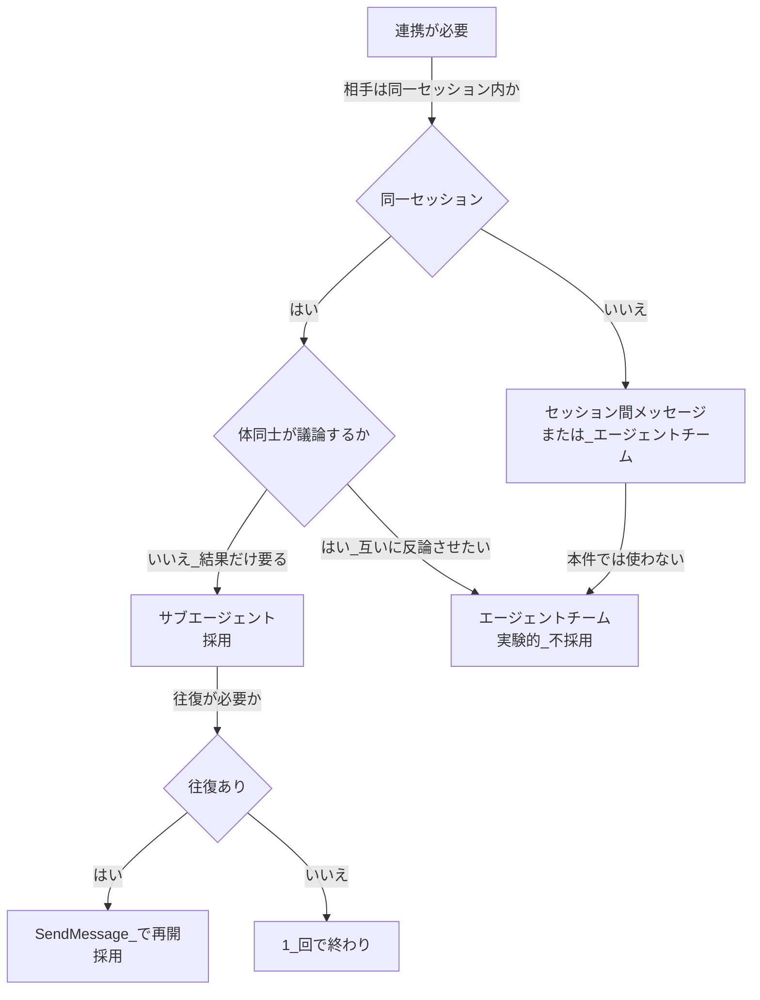
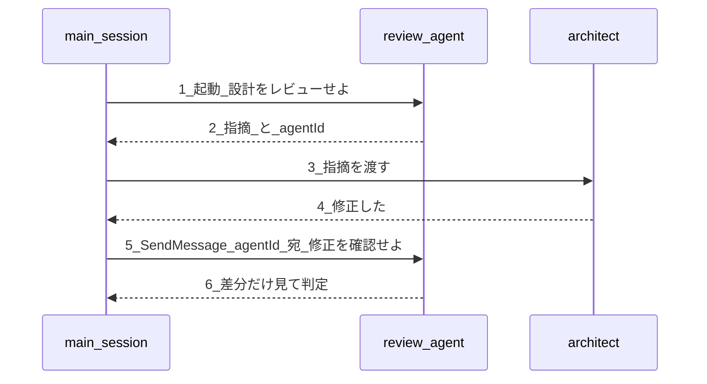
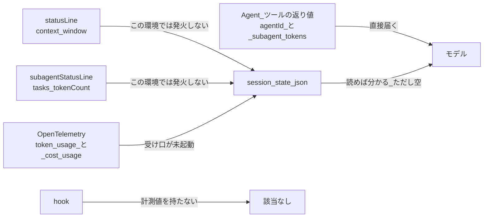

# エージェント連携と計測の調査報告（2026-08-10）

**参照用の要約であり、正本ではない。** 決定は `03-work-order.md` §16、未決は `05-open-questions.md` C・D・F 群が持つ。**食い違ったらそちらが正である。**

**調査した環境:** `entrypoint: claude-desktop` / Claude Code `2.1.222` / Windows。公式ドキュメントは 2026-08-10 に確認した。

---

## 1. エグゼクティブサマリー

### 1.1 結論

**gr-sw-maker は「主セッションが全エージェントを呼び、レビューの往復だけ再開で回す」形が最適である。** エージェントチームも入れ子も採らない。

| # | 方針 | 根拠 |
|:-:|---|---|
| 1 | **サブエージェント方式を使う。エージェントチームは使わない** | チームは実験的で既定無効。teammate ごとに別インスタンスでトークンが増える。公式が「逐次のタスク、同一ファイルの編集、依存の多い作業には単一セッションかサブエージェントのほうが効果的」と明記しており、本パイプラインは 8 フェーズの逐次進行で、仕様書という同一ファイルを多くの体が触る |
| 2 | **主セッションが全部を呼ぶ。エージェント同士は呼び合わない** | 実測で 22 体すべて `tools` に `Agent` を持たない。呼べないうえ、呼ぶ必要も無い。呼び出しの深さは 1 で、既定上限 3 に余裕がある |
| 3 | **レビューの往復は `SendMessage` の再開で回す** | 実機で検証済み。完了済みの体が前回の指示と実行内容を保ったまま再開した |
| 4 | **計測は Agent ツールの返り値を使う。statusLine と OpenTelemetry に頼らない** | statusLine はこの環境で 2 週間発火ゼロ。返り値には `agentId` と使用トークンが入る |
| 5 | **エージェント定義（22 体の `tools`）は 1 行も変えない** | 再開するのは呼び出し側であり、受け取る側に `SendMessage` は要らない |
| 6 | **再開する見込みの体は背景で起動する** | 前景で起動した体を再開すると初回で必ずキャッシュが外れる（`tools_changed`）。実測で再開時の書き直しが 30,162 → 241 になった |
| 7 | **重い依頼には受領通知を挟む。保温はしない** | 受領通知は費用を下げないが、誤解したまま始まる長い作業を止められる。**サブエージェントの寿命は 5 分**（実測で確認）なので、修正が長引く往復は保温よりも作り直しが安い |
| 8 | **指摘への回答は 1 件ずつ送らず、分類を付けて 1 通にまとめる** | 往復 1 回ごとに体が文脈を全再読する（実測）。**1 件ずつの最良が、まとめた場合の最悪とほぼ等しい。** 1 件ずつに落とすのは決着しない争点だけ |

### 1.2 いま壊れていること

> **`CLAUDE.md`「品質目標」の「コンテキスト使用率の引継ぎ閾値」は、比較する値が生まれない。**
>
> 設計は `session-state.json` の `context_used_pct` と閾値を比べるものだが、それを書くのは statusLine であり、**この環境では発火しない。** `.claude/settings.json` に 2026-07-26 から配線されているのに、`session-state.json` は一度も生まれていない。

**主セッション自身のコンテキスト残量を知る手段が無い。** 引継ぎの判断は現状、閾値ではなく別の根拠で行うしかない。

### 1.3 根拠の強さ

| 主張 | 根拠の種類 |
|---|---|
| 深さ上限 3・同時実行 20・チームの性質 | **公式ドキュメント** |
| **サブエージェントの TTL が 5 分・主会話が 1 時間・読むたびに寿命が戻る** | **公式ドキュメント ＋ 実機検証**（8 分空けた再開で `read=0`） |
| **1 往復ごとに文脈を全再読する** | **実測**（`read(n)` が `create(1..n-1)` の総和と厳密に一致） |
| **キャッシュの範囲がマシン ＋ 作業ディレクトリ（worktree は別扱い）** | **公式ドキュメント** |
| 22 体が `Agent` / `SendMessage` を持たない | **実測**（`framework-src/ja/agents/*.md` を全数検査） |
| 再開が全履歴を保つ | **実機検証**（本セッションで実行） |
| **エージェント間の直接メッセージが届く** | **実機検証**（合言葉が逐語で到達）。**送り手に兄弟の名簿は出なかった** |
| Agent の返り値に `agentId` と使用トークンが入る | **実機検証** |
| **背景起動なら再開でキャッシュが残る** | **実機検証 1 組**。機構は公式で説明がつくが**再現性は未検証** |
| **保温と作り直しの分岐点が約 12.5 往復** | **導出 ＋ 実測での検算**（実測比 11.9）。**文脈量に依存しない** |
| statusLine が発火しない | **状況証拠**（2 週間の配線に対し出力ゼロ）。**再起動を伴う確認は未実施** |
| `ENABLE_PROMPT_CACHING_1H=1` がサブエージェントに効くか | **未確認** |

---

## 2. エージェント連携の方法一覧

### 2.1 6 つの方法と使い分け

| # | 方法 | 誰が誰を | 通信の向き | 状態 | gr-sw-maker |
|:-:|---|---|---|---|---|
| 1 | **サブエージェント** | 主セッション → 体 | 体は**要約を返すだけ** | 既定で使える | **主軸として使う** |
| 2 | **`SendMessage` による再開** | 主セッション → 完了済みの体 | 呼び出し元 → 体（一方向） | 既定で使える | **レビュー往復に使う** |
| 3 | エージェント間 `SendMessage` | 体 → 別の体 | 双方向 | 送る側の `tools` に `SendMessage` が要る。**実機で到達を確認済み** | **当面使わない**（設計判断）|
| 4 | エージェントチーム | lead → teammate 群 | teammate 同士が直接 | **実験的・既定で無効** | **使わない** |
| 5 | 入れ子（体が体を呼ぶ） | 体 → 体 | 上位へ要約が返る | `tools` に `Agent` が要る。**3 層まで** | **使わない** |
| 6 | セッション間メッセージ | セッション → 別セッション | 双方向 | 有効化が要る | **使わない** |

### 2.2 選択の流れ

**連携方式の選択:**



gr-sw-maker のパイプラインは「結果だけ要る」経路をたどる。往復があるのはレビューとゲート判定だけなので、そこに再開を使う。

### 2.3 サブエージェントとチームの違い

| 観点 | サブエージェント | エージェントチーム |
|---|---|---|
| 文脈 | 独自。**会話履歴・呼んだスキル・読んだファイルを見ない** | 独自。完全に独立 |
| 通信 | **呼び出し元にしか報告しない** | teammate 同士が名前で直接やり取りする |
| 調整 | 主セッションが全部管理する | 共有タスクリストで自己調整（ファイルロックで競合を防ぐ） |
| 入れ子 | **3 層まで** | **不可。lead だけがチームを管理する** |
| トークン | 低い。要約だけ返る | **高い。teammate ごとに別インスタンス** |
| 有効化 | 不要 | `CLAUDE_CODE_EXPERIMENTAL_AGENT_TEAMS=1` |

### 2.4 使い方 —— レビューの往復

**現在の形と新しい形:**



手順 5 で新しく起動しない。同じ体が全履歴を保ったまま再開する。**前回の指摘・根拠・判断が残っているため、差分だけを見れば足りる。**

### 2.5 守る規約

| # | 規約 |
|:-:|---|
| 1 | **レビューに `Explore` / `Plan` を使ってはならない（MUST NOT）。** どちらも one-shot で `agentId` を返さず、**再開できない** |
| 2 | **`agentId` を記録する。** Agent ツールの返り値に入るが、残さなければ再開できない |
| 3 | **再開の宛先は名前ではなく `agentId` とする（SHOULD）。** 名前は別の体に奪われうる |
| 4 | **利用者が止めた体は自動再開しない。** 再起動せず利用者に知らせる |
| 5 | **review-agent を read-only に保つ（MUST）。** 現在の `tools` に `Edit` は無い。指摘は返すが直さない |
| 6 | **再開は同時実行の枠を新たに取り、上限の検査を通らない。** 既定 20 体を押し超えうる |

### 2.6 再開のコスト —— 「安い」には条件が 2 つある

**再開が安いのは「背景で起動していて」かつ「前の往復から 5 分以内」のときだけである。** どちらを外しても全履歴を書き直す。

#### 2.6.1 条件 1 —— 背景で起動する（実測）

同じ作業を前景と背景で起動し、再開時のキャッシュを比べた。

| 起動 | 初回 create | 初回 read | 再開 create | 再開 read |
|---|---:|---:|---:|---:|
| **背景** | 29,554 | 0 | **241** | **29,554** |
| 前景 | 30,985 | 0 | **30,162** | **0** |

前景の再開で診断は `cache_miss_reason: tools_changed` であった。**再開は背景実行になり、背景のサブエージェントはツールが絞られる。** ツール定義は system prompt 層にあり、変わると全体が無効になる。**背景で起動していればこの遷移が起きない。**

#### 2.6.2 条件 2 —— 寿命は 5 分（公式 ＋ 実測）

| # | 事実 |
|:-:|---|
| 1 | **主セッションの TTL はサブスクリプションで自動 1 時間** |
| 2 | **サブエージェントの TTL は 5 分。サブスクリプションでも 1 時間にならない** |
| 3 | **読むたびに無料で寿命がリセットされる**（スライディング）|
| 4 | **寿命は要求の開始時点から計る。応答の生成時間が寿命を食う** |

**実測（既定設定・背景起動）:**

| 要求 | 時刻 | create | read |
|---|---|---:|---:|
| req4（初回の最後） | 14:17:57Z | 15,646 | 72,147 |
| **req5（8 分 6 秒後の再開）** | 14:26:03Z | **83,479** | **0** |

**8 分空けた再開でキャッシュは完全に消えた。背景起動でも守られない。** 正確な境界は測っていない（計画上は 5 分を使う）。

**背景起動が守るのはツール一覧であって寿命ではない。**

#### 2.6.3 それでも再開する理由

| 何が節約されないか | 何が節約されるか |
|---|---|
| **入力コスト。** 寿命が切れていれば基礎（system prompt ＋ CLAUDE.md ＋ skills 一覧）と全履歴を再び送る | **作業のやり直し。** 仕様書を読み直し、指摘を導き直す一連の tool 呼び出しが不要になる |

**再開の価値は「読み直さないこと」ではなく「考え直さないこと」にある。** レビューのように結論までの読解と判断が重い作業ほど効く。1 回の tool 呼び出しで終わる軽い作業には効かない。

#### 2.6.4 依頼の 3 段手順は費用を下げない

**A --依頼--> B / A <--受領通知-- B / A <--回答-- B の形を採る。ただし目的は費用ではない。**

> **受領通知はキャッシュ費用を下げない。往復が 1 つ増える分わずかに上がる。** 得られるのは、**誤解したまま始まる長い作業を数十トークンで止められること**である。受領通知と回答の間は数秒なので、5 分の寿命には触れない。

**寿命が効くのは受領通知の側ではなく、指摘 → 修正 → 再確認の側である。** 修正が 5 分を超えると体のキャッシュは消える。**保温と作り直しの分岐点は約 12.5 往復（4 分間隔で約 50 分）で、体の文脈量に依存しない**（$1.25C \div 0.1C = 12.5$）。**既定は保温せず作り直す。** 詳細は `03-work-order.md` §16.10。

#### 2.6.5 指摘 10 件は 1 通にまとめる

**往復を 1 回増やすたびに体は文脈を丸ごと読み直す。** 実測で `read(n)` は `create(1..n-1)` の総和と厳密に一致した（34,927 → 60,715 → 72,147）。

| 体の文脈 60k | 1 件ずつ（10 往復） | まとめて 1 通 |
|---|---:|---:|
| 全往復が温かい | 60k 相当 | **6k 相当** |
| 全往復が冷えている | 750k 相当 | **75k 相当** |

**「まとめて 1 通」の最悪が「1 件ずつ」の最良とほぼ等しい。** 1 件ずつの費用は返答ペースに支配され、1 件の修正が 5 分を超えるたびにその往復が 12.5 倍に跳ねる。**分類（争う / 直した / 保留）を付けて 1 通で送り、決着しない争点だけ 1 件ずつに落とす。** 詳細は `03-work-order.md` §16.11。

> **背景と前景の差は 1 組の観測に基づく。** 機構としては公式の記述で説明がつくが、**毎回必ず外れるかは未検証である。** また **`ENABLE_PROMPT_CACHING_1H=1` がサブエージェントにも効くかは未確認である。**

---

## 3. トークンとコンテキスト量の取得方法

### 3.1 経路の一覧

| 欲しいもの | 経路 | この環境で動くか |
|---|---|---|
| **サブエージェントの使用トークン** | **Agent ツールの返り値** | **動く（実機検証）** |
| **サブエージェントの `agentId`** | **Agent ツールの返り値** | **動く（実機検証）** |
| 主セッションのコンテキスト残量 | `statusLine` の `context_window` | **動かない** |
| サブエージェントのコンテキスト使用率 | `subagentStatusLine` の `tasks` | **動かない** |
| トークンとコストの累計 | OpenTelemetry | 未検証（受け口が未起動） |
| エージェント別のトークン | OpenTelemetry の `agent.name` | 未検証。**`OTEL_LOG_TOOL_DETAILS=1` が要る** |
| どれか | hook | **持たない**（公式で確認） |

### 3.2 唯一その場で使える経路

**Agent ツールの返り値の実物:**

```text
agentId: aaa0777a8d6ba2eb2 (use SendMessage with to: 'aaa0777a8d6ba2eb2', ...)
<usage><subagent_tokens>34860</subagent_tokens><tool_uses>1</tool_uses><duration_ms>19652</duration_ms></usage>
```

**モデルが直接受け取る唯一の計測値である。** ファイルも環境変数も要らない。段 0 の基準線をトークンで取るなら、これを積み上げるのが最も確実である。

### 3.3 statusLine 系（この環境では動かない）

**statusLine が受け取る項目:**

```json
{
  "context_window": {
    "total_input_tokens": 15500,
    "total_output_tokens": 1200,
    "context_window_size": 200000,
    "used_percentage": 8,
    "remaining_percentage": 92,
    "current_usage": {
      "input_tokens": 8500,
      "output_tokens": 1200,
      "cache_creation_input_tokens": 5000,
      "cache_read_input_tokens": 2000
    }
  },
  "exceeds_200k_tokens": false
}
```

`used_percentage` は**入力トークンだけで計算する**（`input_tokens` ＋ `cache_creation_input_tokens` ＋ `cache_read_input_tokens`）。出力を含まない。statusLine はローカルで動き API トークンを消費しない。

**`subagentStatusLine` が受け取る項目:** 表示中の全サブエージェントの行を 1 つの JSON でまとめて受け取る。各要素が `id` / `name` / `type` / `status` / `description` / `label` / `startTime` / `model` / `effort` / `contextWindowSize` / `tokenCount` / `tokenSamples` / `cwd` を持つ。**`tokenCount` を `contextWindowSize` で割れば体ごとのコンテキスト使用率が出る**（公式が明記）。

> **どちらもこの環境では発火しない。** `statusLine` は `.claude/settings.json` に 2026-07-26 から配線されているが、`session-state.json` は一度も生まれていない。プローブを仕掛けた `subagentStatusLine` も出力ゼロであった。**ただしプローブは同一セッション中に設定したため、再起動を伴う確認は行っていない。**

### 3.4 計測経路の全体像

**取得経路とモデルの関係:**



**モデルまで確実に届いているのは Agent の返り値だけである。** 他の 3 経路はいずれもファイルを介し、いずれも現在は書かれていない。

### 3.5 リポジトリ側の道具の状態

| 道具 | 役割 | 状態 |
|---|---|---|
| `tools/session-meter.mjs` | statusLine の payload から**コンテキスト使用率**を `session-state.json` へ書く | **単体では動く**（モック入力で確認）。**statusLine が発火しないため実際には書かれていない** |
| `tools/otel-sink.mjs` | OpenTelemetry から**トークンとコスト**を同ファイルへ書く。`by_agent` と `by_query_source` の内訳を持つ | 未起動 |

`session-meter.mjs` の 2 行目は「record context usage where an agent can read it」であり、**設計意図は最初から「ファイル経由でエージェントに読ませる」である。** 機構は正しいが、入力が来ていない。

### 3.6 決めるべきこと

| # | 論点 |
|:-:|---|
| 1 | **statusLine がこの環境で本当に動かないかを、再起動を伴って確かめる**（プロセス規則は「CLI でしか動かない」と書いている） |
| 2 | 動かないなら、**引継ぎ閾値の運用を作り直す。** 比較する値が生まれない設計のままにしない |
| 3 | トークンの基準線を取るなら、**Agent の返り値を積む方式**を第一候補にする。OpenTelemetry は受け口の起動と `OTEL_LOG_TOOL_DETAILS=1` が前提になる |
| 4 | OpenTelemetry を使うなら `sink_heartbeat_at` の鮮度検査を入れる。**「0 件」と「受け口が死んでいた」を区別する** |

---

## 4. 出典

公式ドキュメントは 2026-08-10 に確認した。

| 内容 | 出典 |
|---|---|
| 入れ子の深さ・同時実行上限・文脈・再開・`tools` の制限 | https://code.claude.com/docs/en/sub-agents |
| **サブエージェントの TTL 5 分・主会話の 1 時間・キャッシュの範囲・無効化する操作・`ENABLE_PROMPT_CACHING_1H`** | https://code.claude.com/docs/en/prompt-caching |
| **寿命が要求の開始時点から計られること・write 1.25 倍 / read 0.1 倍** | https://platform.claude.com/docs/en/build-with-claude/prompt-caching |
| teammate 間の直接メッセージ・共有タスクリスト・権限の継承 | https://code.claude.com/docs/en/agent-teams |
| `context_window` の項目名・`subagentStatusLine` の `tasks` | https://code.claude.com/docs/en/statusline |
| hook が計測値を持たないこと | https://code.claude.com/docs/en/hooks |
| OpenTelemetry の metric と event・`agent.name` の伏せ字 | https://code.claude.com/docs/en/monitoring-usage |

実測と実機検証は本リポジトリおよび本セッションで行った。
