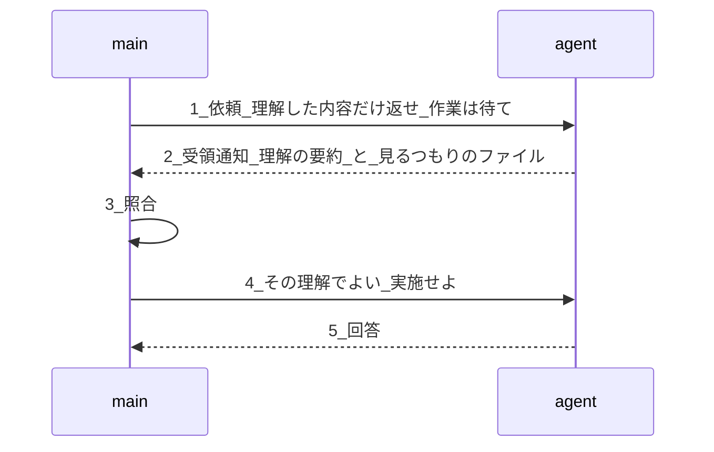
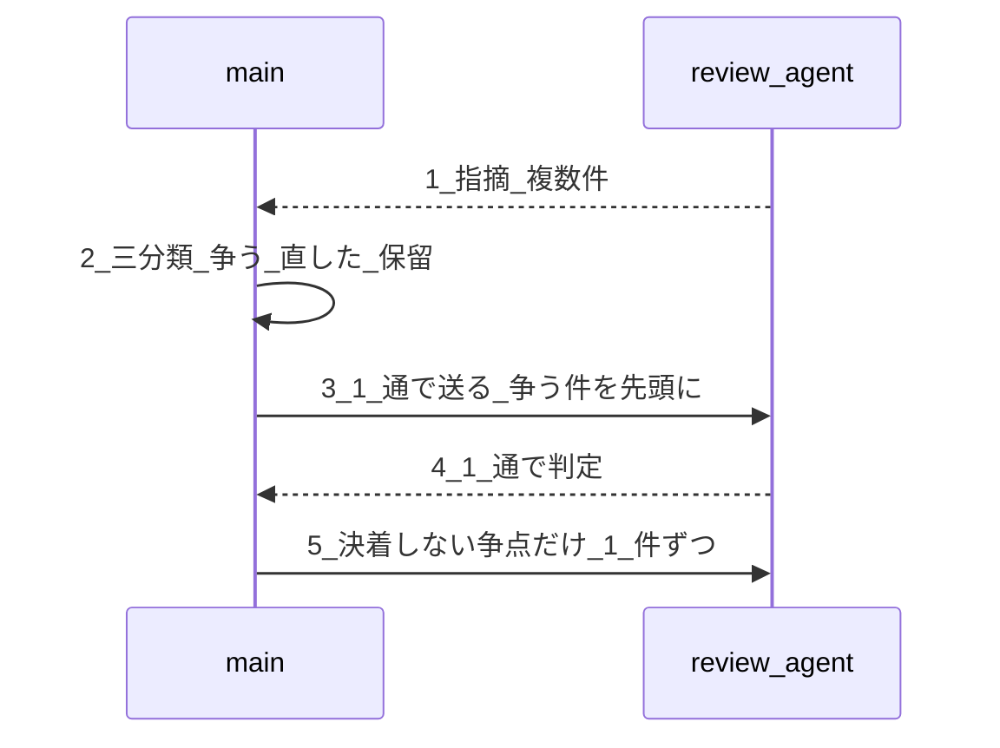

# エージェント連携規則

**本書は結論だけを持つ。** 測定の根拠と数値は `06-agent-connection-report.md` にある。**未決の論点は `05-open-questions.md` C 群にある。本書に「かもしれない」を書かない。**

**§1 は道具に依存しない考え方、§2 は Claude Code 固有の手段である。** 道具が変わったら §2 だけを差し替える。

---

## 1. 考え方

### 1.1 レビューはレビュアーが生きていたほうがいい

**再開で節約されるのは「読み直し」ではなく「考え直し」である。**

同じ体を再開すると、前回の指摘・根拠・判断が残っている。差分だけを見れば足りる。新しい体を立てると、仕様書を読み直し、同じ結論を導き直すところからになる。

**結論に至るまでの読解と判断が重い作業ほど効く。** 1 回の道具呼び出しで終わる軽い作業には効かない。

### 1.2 往復のたびに全部を送り直している

**言語モデルは要求と要求のあいだで何も覚えていない。** 「会話の続き」に見えるものは、毎回それまでの全文を送り直して作られている。

したがって **往復の回数は、そのまま文脈を送り直した回数である。** 10 回聞けば 10 回送り直す。**まとめて 1 回聞けば 1 回で済む。**

### 1.3 誤解は始まる前に止める

**誤解を止める費用はほぼゼロ、誤解したまま進んだ作業の費用は全額である。**

重い依頼では、受け手に「何を求められたと理解したか」「どこを見るつもりか」だけを先に言わせる。ずれていればそこで正す。**始まってから気づくと、やり直しは作業まるごとになる。**

### 1.4 効くのは「入れる量」

**渡す情報を絞るほうが、キャッシュの小細工より桁で効く。**

ただし **体には下限がある。** 指示文をどれだけ削っても、土台（役割の定義・使える道具の一覧・プロジェクトの決まりごと）は必ず載る。**下限に近い体をさらに絞っても、ほとんど何も変わらない。**

絞る価値は **「いまの文脈 ÷ 下限」** で決まる。大きく膨らんだ体を絞るのは効く。最初から小さい体を絞るのは徒労である。

### 1.5 長生きする体ほど、作業をさせない

**文脈は消えない。ある体に作業をさせると、その結果はその体に残り続ける。**

したがって **寿命の長い体ほど、作業から遠ざける。**

| 寿命 | 体 | させること |
|---|---|---|
| 最長 | **利用者と話す体** | **聞く・伝える・次を選ぶ。それだけ** |
| 長 | 統括する体 | 記録と判定。**成果物そのものは作らない** |
| 短 | 作る体・調べる体 | 実際の作業 |

**利用者と話す体は、その工程でいちばん希少な資源である。** ここが埋まると仕事全体が中断して引き継ぎになる。**下位の体のトークンは払えば済むが、上位の体の容量は買えない。希少な側を払って潤沢な側を節約してはならない。**

**ただしこれは「何も読むな」ではない。何を持つかの話である。**

| 種類 | 例 | 利用者と話す体は |
|---|---|---|
| **前提** | 何を作るのか、誰のためか、守るべき制約 | **必ず持つ。** 小さく、変わらず、**すべての判断の入力になる** |
| **状態** | いまどの段か、何が通ったか、何が残っているか | **要約で持つ** |
| **成果物の中身** | 仕様書・コード・レビュー報告・試験結果 | **持たない。場所だけ持つ**（§1.6） |

**前提を渡さずに「次を選べ」と言うことはできない。** 目的を知らない体は、返ってきたものが筋に合っているかを判断できず、利用者の問いにも答えられない。**節約してよいのは成果物であって、前提ではない。**

**管理する体に作業をさせると、この規則を二重に破る。** 長生きする体の文脈が埋まり、しかもそこが一本道の詰まりになる。

### 1.6 親には結論だけ返す

**深くするより、返す量を絞るほうが効く。**

成果物は文書に書かせる。親へ返すのは **「どこに書いたか」「合否」「次の一手」** の三つだけにする。**全文を返させない。**

これができていれば、階層は浅いままで上位の体は膨らまない。**階層を深くしたくなったときは、たいてい返す量が多すぎるのが原因である。**

### 1.7 管理する体は「間」ではなく「隣」に置く

**「管理する体に作業をさせない」は、「管理する体を置くな」ではない。置く場所の話である。**

| 置き方 | 形 | 何が起きるか |
|---|---|---|
| **間に置く**（禁止） | `利用者と話す体 → 管理する体 → 作る体` | 管理する体が全部の結果を抱える。**膨張を下へ移すだけで消えない。**階層も 1 つ食う |
| **隣に置く**（採る） | `利用者と話す体 → 管理する体`／`利用者と話す体 → 作る体` | 管理する体は**管理の成果物を作って返すだけ**。作る体を起動しない。階層は増えない |

**現実の開発と同じ形である。** 客の窓口に立つ担当と、計画・進捗を持つ担当は別人だが、**技術者は窓口の部下であって、管理担当の部下ではない。** 管理担当は計画表と報告書を作るのであって、技術者を内包しない。

**したがって管理する体も「作る体」の一種である。** ただし作るものが計画・記録・報告文であって、製品ではない。

### 1.8 機械で決まる検査に、体を使わない

**答えが一意に決まる検査は、道具で回す。**

用語の照合、書式の検査、参照の切れ、番号の欠番 —— これらは判断を要しない。**体を起動すると、起動のたびに土台の文脈を積み直す**（§1.4 の下限）。**同じ検査を道具で回せば、その費用はゼロである。**

体を使うのは、**判断が要るときだけ**にする。「この新語は妥当か」「この対は紛らわしいか」は判断であり、「非採用の語が出ていないか」は判断ではない。

---

## 2. 手段（Claude Code、2026-08-10 時点）

### 2.1 起動と再開

| # | 規約 |
|:-:|---|
| 1 | **再開する見込みのある体は、最初から背景で起動する（SHOULD）。** レビューとゲート判定が該当する |
| 2 | **完了時に返る識別子を記録する。** 残さなければ再開できない |
| 3 | **再開の宛先は名前ではなく識別子とする（SHOULD）。** 名前は後から起動した別の体に奪われうる |
| 4 | **1 回目の再開は高い。** 会話の層が作り直されるため、温かくても安くならない。**3 往復以上する見込みなら償却される。1 往復で終わる作業は再開を前提にしない** |
| 5 | **利用者が止めた体は自動で再開しない。** 再起動せず利用者に知らせる |
| 6 | **再開できない種類の体をレビューに使ってはならない（MUST NOT）。** 一度きりで識別子を返さないものがある |

### 2.2 依頼の作法 —— 受領通知を挟む

**重い依頼（レビュー・仕様の詳細化・実機テスト）に適用する。1 往復で終わる軽い依頼には挟まない。**



| # | 規約 |
|:-:|---|
| 1 | **受領通知で作業を始めさせてはならない（MUST NOT）。** 始まると照合の前に費用が出て、手順の意味が消える |
| 2 | **受領通知に「見るつもりのファイル」を含める。** 参照先の取り違えはここでしか捕まらない |
| 3 | **受領通知は費用を下げない。** わずかに上げる。**得られるのは手戻りの防止である**（§1.3） |

### 2.3 指摘への回答 —— まとめて 1 通

**指摘が複数返ってきたとき、1 件ずつ答えてはならない。**



| # | 規約 |
|:-:|---|
| 1 | **既定はまとめて 1 通（SHOULD）** |
| 2 | **分類を付ける。** 争う / 直した / 保留。**争う件を先頭に置く**（判断が要るのはそこだけ） |
| 3 | **1 件ずつに落とすのは、1 通目で決着しなかった争点だけ** |
| 4 | **Critical / High は 1 件ずつでよい。** 品質ゲートを止める指摘は費用より正確さを採る |
| 5 | **切る単位は件数ではなく宛先。** 指摘が複数の担当に分かれるなら担当ごとに 1 通 |

### 2.4 保温するか、作り直すか

**既定は保温しない。** 修正のあいだに体のキャッシュが切れても、そのまま作り直す。

| # | 規約 |
|:-:|---|
| 1 | **修正が短時間で終わると分かっている場合にかぎり、保温してよい。** 長引く見込みなら作り直す |
| 2 | **保温は利用者と話す体の文脈も食う。** 問い合わせと返事がそこに積まれる。**§1.5 に反するため既定にしない** |
| 3 | **保温の問い合わせは作業を明示的に禁じる（MUST）。** 緩い文面だと体が作業を始め、1 往復まるごと無駄になる |

**問い合わせの文面:**

```text
PENDING。作業を開始しないこと。ツールを使わないこと。
`WAIT` とだけ返せ。
```

### 2.5 階層と役割分担

**入れ子は「主会話の下に何層か」で数える。既定は 3 層である。**

| # | 規約 |
|:-:|---|
| 1 | **利用者と話す体（`main-agent`）に、記録・調査・判定・文書の起草をさせない（MUST NOT）。** させるのは「聞く・伝える・次を選ぶ・体を起動する」だけである（§1.5）。**利用者と話せるのは `main-agent` だけである。** 体は親にしか返せないため、これは構造上の制約であって設計判断ではない |
| 2 | **管理する体を `main-agent` と作る体の「間」に置いてはならない（MUST NOT）。隣に置く**（§1.7）。管理する体は管理の成果物を作って返すだけで、**他の体を起動しない** |
| 3 | **扇形に広げるときは、親に再委託させず `main-agent` が並べて起動する（MUST）**（§2.5.1） |
| 4 | **広げた結果の統合は、ゲートを判定する体に担わせる（SHOULD）**（§2.5.2） |
| 5 | **上限に達しても失敗しない。** 起動の権限が黙って取り上げられ、その体が自分で作業して 1 つの要約を返す。**気づけないので、構造で縛る** |
| 6 | **入れ子を使わない（MUST NOT）。層数を設定で 1 に固定する。** 既定は版によって 5 → 1 → 3 と動いており、依存すると壊れる |
| 7 | **どの体も起動の権限（`Agent`）を持たない（MUST NOT）。** 例外を作らない |

**設定:**

```json
{
  "env": {
    "CLAUDE_CODE_MAX_SUBAGENT_SPAWN_DEPTH": "1"
  }
}
```

**すべての体は深さ 1 の兄弟である。**

```text
main-agent(0) --依頼--> review-agent(1)
main-agent(0) --依頼--> implementer(1)
```

### 2.5.1 扇形は入れ子ではなく兄弟で作る

**同じ作業を複数の視点や対象へ広げるとき、親に再委託させない。`main-agent` が並べて起動する。**

| | 入れ子（採らない） | **兄弟（採る）** |
|---|---|---|
| 形 | `main-agent → 親 → 子 × N` | **`main-agent → 体 × N`** |
| 深さ | 2 | **1** |
| 起動の権限 | 親だけが持つ **← 例外になる** | **誰も持たない** |
| 統合 | 親が N 件を突き合わせる **← 大きな文脈で 1 往復増える** | **判定する体が担う**（§2.5.2） |
| 失敗の波及 | 子が 1 つ落ちると親ごと止まりうる | **1 体だけが落ちる** |
| `main-agent` が受け取る量 | 1 件 | N 件。**ただし §1.6 のとおり結論だけなので、N が数体なら無視できる** |

**入れ子の唯一の利点は「中間の出力が上位に届かない」ことだが、§1.6 を守っていれば届く量はもともと結論だけである。** 利点が消えるので、**単純な兄弟を採る。**

### 2.5.2 束ねるのは判定する体

**兄弟に広げると、同じ指摘が複数の体から重複して返る。** 突き合わせは `main-agent` にさせない（§1.5）。

**ゲートを判定する体が、統合と重複の除去を担う。** 判定はもともとその体の本務であり、**新しい役も新しい階層も要らない。**

```text
main-agent --分野ごとに依頼--> 分野別のレビュー体 × N
分野別のレビュー体 × N --各自の指摘の場所と件数--> main-agent
main-agent --統合とゲート判定を依頼--> 判定する体
判定する体 --可否と統合済みの指摘--> main-agent
```

### 2.6 用語の検査は道具で回す —— `kotodama-kun.mjs`

**用語の番人は体をやめ、道具にする。名前は残す。**

| # | 決定 |
|:-:|---|
| 1 | **`agents/kotodama-kun.md` を廃止する。** 体としては存在させない |
| 2 | **`tools/kotodama-kun.mjs` を新設する。** 成果物の用語・命名を検査する |
| 3 | **`Write` / `Edit` の前に走るフックとして配線する。** 書いた体にその場で差し戻り、**`main-agent` には何も届かない** |
| 4 | **`tools/check-terms.mjs` は残す。** そちらは**フレームワーク自身**を CI で守る検査であり、見る対象が違う。**照合の実装は共有し、二重に持たない** |

**何を道具に、何を体に割り当てるか。**

| 検査 | 判断が要るか | 回し方 |
|---|---|---|
| 非採用の語が混入していないか | 要らない（用語集の非採用欄と照合するだけ） | **道具** |
| 書式・参照切れ・欠番 | 要らない | **道具** |
| 用語集に無い語が出てきた | 検出は要らない | **道具が報告する**（違反にはしない） |
| その新語を採用すべきか、既存語へ寄せるべきか | **要る** | **用語集を更新するときにまとめて判断する。成果物ごとに起動しない** |

| # | 規約 |
|:-:|---|
| 1 | **機械的に判定できる検査を、体の起動で行ってはならない（MUST NOT）** |
| 2 | **フックの差し戻しは、書いた体が自分で直す。** 上位へ上げない |
| 3 | **新語の採否は成果物ごとに判断しない（MUST NOT）。** 用語集の育成として、まとめて行う |

### 2.7 やってはならないこと

| # | 規約 |
|:-:|---|
| 1 | **成果物の全文を親へ返させない（MUST NOT）。** 文書に書かせ、場所と合否と次の一手だけ返させる |
| 2 | **同じ指摘を 1 件ずつ往復させない（MUST NOT）**（§2.3） |
| 3 | **レビュアーに修正させない（MUST NOT）。** 指摘は返すが直さない。直すのは被レビュー側である |
| 4 | **管理する体に製品を作らせない（MUST NOT）。** 作らせるのは計画・記録・報告文である（§1.7） |
| 5 | **`main-agent` に文書を起草させない（MUST NOT）。** 報告文も下で起草させ、`main-agent` は受け取って渡す |

---

## 3. 注記

> **上の考え方に基づき、2026-08-10 時点の Claude Code ではこの運用としている。**
>
> 測定の根拠と数値は `06-agent-connection-report.md` にある。未決の論点は `05-open-questions.md` C 群にある。
>
> **別の AI・別のツールを使う場合、§2「手段」はそのまま使えない。** §1「考え方」を出発点に、その環境で最適な手段を検討し、**根拠を残したうえで §2 を差し替えること。**
>
> 差し替えるときは次を測る。**この 4 つが分かれば §2 は組み直せる。**
>
> | # | 測ること |
> |:-:|---|
> | 1 | **状態を持つか。** 往復のたびに全文を送り直すのか、サーバ側が覚えているのか |
> | 2 | **再開できるか。** できるなら、履歴はどこまで残るか |
> | 3 | **文脈の下限はいくつか**（§1.4 の分母） |
> | 4 | **入れ子にできるか。何層までか。上限に達したとき失敗するか、黙って浅くなるか** |
