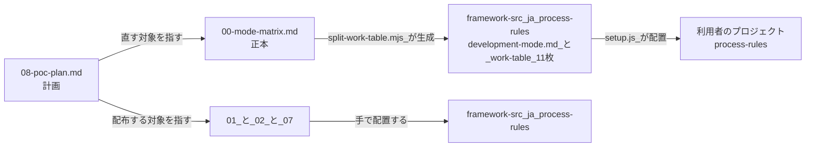

# 改善作業の現物

**`08-poc-plan.md` から読む。** 何をするかが書いてある。残る 4 つはその作業の材料である。

**生きているファイルは 5 つ。** `History/` は記録であり、**書き換えない。** `to-del/` は削除待ちである。

**同じことを 2 か所に書かない。** 下表の「何を持つか」が正本の境界である。

| ファイル | 何を持つか | 行数 | 行き先 |
|---|---|---:|---|
| `08-poc-plan.md` | **PoC の準備手順と作業計画。** 何を・どの順で直せば PoC が始まるか。`03-work-order.md` の後継 | 194 | —（PoC が終われば `History/` へ） |
| `00-mode-matrix.md` | **開発方式の対応表と作業表。** 方式を 1 つ決めれば、仕様書・作業・担当・経路・成果物・レビューがすべて決まる | 840 | **移動禁止。** `maintenance-tools/split-work-table.mjs` が定数で参照し、`framework-src/ja/process-rules/` の 11 ファイルを生成する |
| `01-spec-template.md` | 仕様書テンプレート。そのまま `strictdoc export` が通る 1 枚 | 664 | `framework-src/ja/process-rules/spec-template.md` を置換 |
| `02-spec-writing-rules.md` | 仕様書の解説書。章ごとの規則・EARS・Cockburn・記入例・検査 | 1510 | `framework-src/ja/process-rules/spec-writing-rules.md` を新設 |
| `07-agent-orchestration-rules.md` | **エージェント連携規則。結論だけ。** 道具が変わったら §4 だけを差し替える | 604 | `framework-src/ja/process-rules/agent-orchestration-rules.md` を新設 |

**`01` `02` `07` は配布が済んだ時点で `History/` へ送る。** 正本が配布先へ移るためである。

## 生成の向き

**手で編集してよいのは `00-mode-matrix.md` だけである。** 配布された 11 ファイルは生成物であり、直しても次の生成で消える。

## 前提

- **適用先はいずれも `framework-src/ja/` である。** リポジトリ直下の `process-rules/` `.claude/` `CLAUDE.md` `user-order.md` は `setup.js` の配置物で `.gitignore` の対象であり、正本ではない
- **`framework-src/en/` は削除する。** 変更量が多く既存分は再使用できない（`08-poc-plan.md` §7 決定 2）
- **道具の置き場は `tools/`（配る 7）と `maintenance-tools/`（配らない 12）に分割済みである**（2026-08-11。経緯は `History/2026-08-11/00-tools-placement-record.md`）
- 文法と検出クエリは `tools/spec-query/` にある。**仕様形式を決めた時点で仕様書のフォルダへ複製する**
- `01` は整形の不動点である。Prettier をかけても差分が出ない
- `History/` 配下の文書に書かれた `maintenance/2026-08-XX/...` というパスは移動前のものである
