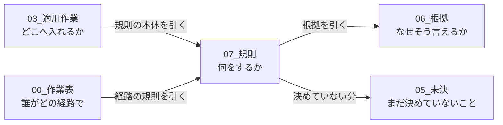
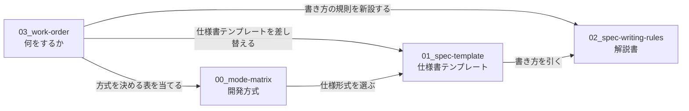

# 改善作業の現物

生きているファイルは 8 つ。`History/` は検討記録であり、**書き換えない。**

**同じことを 2 か所に書かない。** 下表の「何を持つか」が正本の境界である。

| ファイル | 何を持つか | 行数 | 適用先 |
|---|---|---:|---|
| `00-mode-matrix.md` | **開発方式の対応表と作業表。** 方式を 1 つ決めれば、仕様書・作業・担当・経路・成果物・レビューがすべて決まる | 365 | `framework-src/{lang}/process-rules/full-auto-dev-process-rules.md` §3.1.1 |
| `01-spec-template.md` | 仕様書テンプレート。そのまま `strictdoc export` が通る 1 枚 | 664 | `framework-src/ja/process-rules/spec-template.md` を置換 |
| `01-spec-template-en.md` | 同上の英語版。ja と構造が完全に一致する | 664 | `framework-src/en/process-rules/spec-template.md` を置換 |
| `02-spec-writing-rules.md` | 仕様書の解説書。章ごとの規則・EARS・Cockburn・記入例・検査 | 1510 | `framework-src/ja/process-rules/spec-writing-rules.md` を新設 |
| `03-work-order.md` | **適用作業書。何を・どこへ・どの順で入れるか。** 決めた理由は持たない | 585 | —（作業が終われば `History/` へ移す） |
| `04-glossary-state.md` | **用語集の適用状態。** 用語集に関することは本書が正である | 112 | `framework-src/{lang}/process-rules/glossary.md` |
| `05-open-questions.md` | **未決事項だけ。** 決まったら本書から消して決定先へ書く | 388 | —（決着すれば消える） |
| `06-agent-connection-report.md` | **エージェント連携の根拠。** 実測値と公式の引用。**規則は持たない**（各行がどの規則を支えるかは §1.3 の 3 列目） | 285 | —（読み物） |
| `07-agent-orchestration-rules.md` | **エージェント連携規則。結論だけ。** §1 背景 / §2 目的 / §3 対応方針（道具に依存しない考え方）/ §4 具体的運用（Claude Code 固有の手段。**全規約表が「なぜ」列を持つ**）/ §5 注記。**道具が変わったら §4 だけを差し替える** | 604 | `framework-src/{lang}/process-rules/agent-orchestration-rules.md` を新設 |

## 境界

**エージェント連携は 3 つに割れている。混ぜない。**

## 読む順

**`03-work-order.md` から読む。** 何をするかが書いてある。`00` `01` `02` はその作業の対象であり、材料である。**決まっていないことは `05-open-questions.md` にまとめてある。**

## 前提

- **適用先はいずれも `framework-src/{lang}/` である。** リポジトリ直下の `process-rules/` と `.claude/` は `setup.js` の配置物で `.gitignore` の対象であり、正本ではない
- **Chapter 8「SW設計原則 準拠確認」は削除が決まっている。章は 10 章構成になる。** `01` `01-en` `02` はまだ 11 章構成のままであり、`03-work-order.md` §3 がその差し替えを指示する
- **採番は振り直しが決まっている。** `Phase 0 インストール` を新設して 1 つずらし、手順記号の枝番を廃す（`03-work-order.md` §6）。**`00-mode-matrix.md` にはまだ当てていない**
- **道具の置き場も割り直しが決まっている。** `framework-src/tools/`（配る）と `maintenance-tools/`（配らない）（`03-work-order.md` §9）。**まだ動かしていない**
- 文法と検出クエリは `tools/spec-query/` にある（`spec.sgra` / `spec-anms.sgra` / `checks.jq`）。**仕様形式を決めた時点で仕様書のフォルダへ複製する**
- `01` は整形の不動点である。Prettier をかけても差分が出ない
- `History/` 配下の文書に書かれた `maintenance/2026-08-XX/...` というパスは移動前のものである
