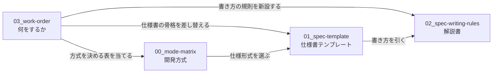

# 改善作業の現物

生きているファイルは 5 つ。`History/` は検討記録であり、**書き換えない。**

| ファイル | 何か | 行数 | 適用先 |
|---|---|---:|---|
| `00-mode-matrix.md` | 開発方式 対応表。`簡易` / `標準` / `厳格` の 1 つを決めれば、仕様書・フェーズ・エージェント・プロセス・成果物・レビューがすべて決まる。**方式については本書が正である** | 361 | `framework-src/{lang}/process-rules/full-auto-dev-process-rules.md` §3.1.1 |
| `01-spec-template.md` | 仕様書テンプレート。そのまま `strictdoc export` が通る 1 枚 | 664 | `framework-src/ja/process-rules/spec-template.md` を置換 |
| `01-spec-template-en.md` | 同上の英語版。ja と構造が完全に一致する | 664 | `framework-src/en/process-rules/spec-template.md` を置換 |
| `02-spec-writing-rules.md` | 仕様書の解説書。章ごとの規則・EARS・Cockburn・記入例・検査 | 1,510 | `framework-src/ja/process-rules/spec-writing-rules.md` を新設 |
| `03-work-order.md` | **適用作業書。何を・どこへ・どの順で入れるかの一覧。決定はここに集約してある** | 417 | —（作業が終われば `History/` へ移す） |

## 読む順

**`03-work-order.md` から読む。** 何をするかが書いてある。`00` `01` `02` はその作業の対象であり、材料である。

## 前提

- **適用先はいずれも `framework-src/{lang}/` である。** リポジトリ直下の `process-rules/` と `.claude/` は `setup.js` の配置物で `.gitignore` の対象であり、正本ではない
- **Chapter 8「SW設計原則 準拠確認」は削除が決まっている。章は 10 章構成になる。** `01` `01-en` `02` はまだ 11 章構成のままであり、`03-work-order.md` §3 がその差し替えを指示する
- 文法と検出クエリは `tools/spec-query/` にある（`spec.sgra` / `spec-anms.sgra` / `checks.jq`）。**仕様形式を決めた時点で仕様書のフォルダへ複製する**
- `01` は整形の不動点である。Prettier をかけても差分が出ない
- `History/` 配下の文書に書かれた `maintenance/2026-08-XX/...` というパスは移動前のものである
