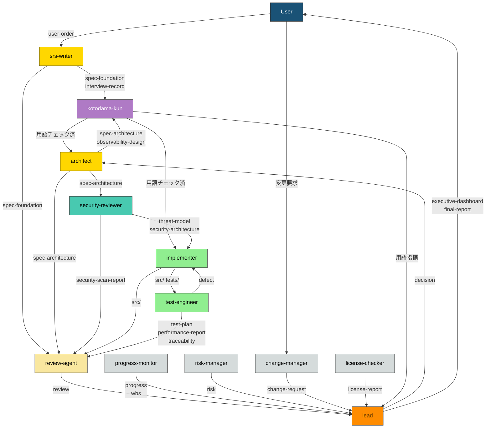

# エージェント一覧

> **本文書の位置づけ:** full-auto-dev フレームワークに登録された全エージェントの一覧（Single Source of Truth）。エージェントの追加・変更・削除時に本文書を更新する。
> **導出元:** [プロセス規則](full-auto-dev-process-rules-ja.md) §2-4, §7, §9 / [文書管理規則](full-auto-dev-document-rules-ja.md) §7, §7.1, §11
> **関連文書:** [プロンプト構造規約](prompt-structure-ja.md)、各エージェントプロンプト（`.claude/agents/*.md`）

---

## 1. エージェント一覧

| # | name | 役割 | model | 主要フェーズ |
|:-:|------|------|:-----:|------------|
| 1 | lead | プロジェクト全体のオーケストレーション、フェーズ遷移制御、意思決定記録 | opus | 全フェーズ |
| 2 | srs-writer | ユーザーコンセプトの構造化、インタビュー、仕様書 Ch1-2 作成 | opus | planning |
| 3 | architect | 仕様書 Ch3-6 詳細化、OpenAPI・可観測性・外部依存要求の設計 | opus | design |
| 4 | security-reviewer | 脅威モデリング、セキュリティ設計、脆弱性スキャン | opus | design, implementation |
| 5 | implementer | ソースコード実装、単体テスト作成 | opus | implementation |
| 6 | test-engineer | テスト計画・実行、カバレッジ計測、性能テスト | sonnet | testing |
| 7 | review-agent | R1-R6 観点での品質レビュー、品質ゲート判定 | opus | 全フェーズ（ゲート時） |
| 8 | progress-monitor | WBS管理、進捗追跡、品質メトリクス監視、異常検知 | sonnet | design 以降 |
| 9 | change-manager | ユーザー起点の変更要求の受付・影響分析・記録 | sonnet | planning 以降（仕様承認後） |
| 10 | risk-manager | リスク特定・評価・監視、リスク台帳管理 | sonnet | planning 以降 |
| 11 | license-checker | OSS ライセンス互換性確認、帰属表示管理 | haiku | implementation, delivery |
| 12 | kotodama-kun | 用語・命名の整合性チェック（フレームワーク用語集 + プロジェクト用語集） | haiku | 全フェーズ（Out 生成時） |

---

## 2. file_type オーナーシップマトリクス

文書管理規則 §11 から導出。**各 file_type には唯一の owner が存在する。**

### lead

| file_type | ディレクトリ | 単/連 | 主要フェーズ |
|-----------|------------|:-----:|------------|
| pipeline-state | project-management/ | 単 | 全フェーズ |
| executive-dashboard | ルート | 単 | setup 以降 |
| final-report | ルート | 単 | delivery |
| decision | project-records/decisions/ | 連 | 全フェーズ |
| handoff | project-management/handoff/ | 連 | 全フェーズ |
| user-manual | docs/ | 単 | delivery |
| runbook | docs/operations/ | 単 | delivery |
| incident-report | project-records/incidents/ | 連 | operation |
| stakeholder-register | project-management/ | 単 | setup |

### srs-writer

| file_type | ディレクトリ | 単/連 | 主要フェーズ |
|-----------|------------|:-----:|------------|
| user-order | ルート | 単 | planning（バリデーション） |
| interview-record | project-management/ | 単 | planning |
| spec-foundation | docs/spec/ | 単 | planning |

### architect

| file_type | ディレクトリ | 単/連 | 主要フェーズ |
|-----------|------------|:-----:|------------|
| spec-architecture | docs/spec/ | 単 | design |
| observability-design | docs/observability/ | 単 | design |
| hw-requirement-spec | docs/hardware/ | 単 | design（条件付き） |
| ai-requirement-spec | docs/ai/ | 単 | design（条件付き） |
| framework-requirement-spec | docs/framework/ | 単 | design（条件付き） |
| disaster-recovery-plan | docs/operations/ | 単 | design |

### security-reviewer

| file_type | ディレクトリ | 単/連 | 主要フェーズ |
|-----------|------------|:-----:|------------|
| threat-model | docs/security/ | 単 | design |
| security-architecture | docs/security/ | 単 | design |
| security-scan-report | project-records/security/ | 連 | implementation 以降 |

### implementer

| file_type | ディレクトリ | 単/連 | 主要フェーズ |
|-----------|------------|:-----:|------------|
| （ソースコード） | src/ | — | implementation |
| （単体テスト） | tests/ | — | implementation |

> implementer はコード（src/, tests/）を生成するが、これらは Common Block 管理対象外。トレーサビリティは traceability-matrix で管理する。

### test-engineer

| file_type | ディレクトリ | 単/連 | 主要フェーズ |
|-----------|------------|:-----:|------------|
| test-plan | project-management/ | 単 | design |
| defect | project-records/defects/ | 連 | testing |
| traceability | project-records/traceability/ | 単 | implementation 以降 |
| performance-report | project-records/performance/ | 連 | testing |

### review-agent

| file_type | ディレクトリ | 単/連 | 主要フェーズ |
|-----------|------------|:-----:|------------|
| review | project-records/reviews/ | 連 | 全フェーズ（ゲート時） |

### progress-monitor

| file_type | ディレクトリ | 単/連 | 主要フェーズ |
|-----------|------------|:-----:|------------|
| progress | project-management/progress/ | 連 | design 以降 |
| wbs | project-management/progress/ | 単 | design 以降 |

### change-manager

| file_type | ディレクトリ | 単/連 | 主要フェーズ |
|-----------|------------|:-----:|------------|
| change-request | project-records/change-requests/ | 連 | planning 以降（仕様承認後） |

### risk-manager

| file_type | ディレクトリ | 単/連 | 主要フェーズ |
|-----------|------------|:-----:|------------|
| risk | project-records/risks/ | 連 | planning 以降 |

### license-checker

| file_type | ディレクトリ | 単/連 | 主要フェーズ |
|-----------|------------|:-----:|------------|
| license-report | project-records/licenses/ | 単 | implementation, delivery |

### kotodama-kun

> kotodama-kun は file_type を所有しない。チェック報告は軽微な場合 lead への口頭報告、重大な場合 review として project-records/reviews/ に記録する（review-agent の file_type を借用）。

| 入力 | 提供元 | 用途 |
|------|--------|------|
| （チェック対象の成果物） | 各エージェント | 用語・命名チェック対象 |
| glossary-ja.md | framework | フレームワーク用語集との照合 |
| spec-foundation (Ch1.8 Glossary) | srs-writer | プロジェクト用語集との照合 |
| full-auto-dev-document-rules-ja.md §7 | framework | file_type 名・名前空間の正式定義 |

---

## 3. エージェント間データフロー

file_type の流れでエージェント間の依存関係を示す。

**エージェント間データフロー:**

上図はプロセス規約から導出したエージェント間のデータフローを示す。矢印のラベルは受け渡される file_type。色はフェーズの早さに対応: 橙（全フェーズ）→ ゴールド（planning/design）→ 緑（implementation/testing）→ 灰（プロセス管理）。

---

## 4. フェーズ別アクティベーションマップ

どのエージェントがどのフェーズで起動されるか。

| フェーズ | 起動されるエージェント | 品質ゲート |
|---------|---------------------|-----------|
| setup | lead | CLAUDE.md 承認 |
| planning | lead, srs-writer, kotodama-kun, review-agent | R1 PASS → 仕様書承認 |
| dependency-selection | lead, architect, kotodama-kun, license-checker | ユーザー選定承認 |
| design | lead, architect, security-reviewer, kotodama-kun, progress-monitor, risk-manager, review-agent | R2/R4/R5 PASS |
| implementation | lead, implementer, test-engineer(単体), security-reviewer(SCA), kotodama-kun, license-checker, review-agent, progress-monitor | R2/R3/R4/R5 PASS, SCA クリア |
| testing | lead, test-engineer, kotodama-kun, review-agent, progress-monitor | R6 PASS, 全テスト PASS |
| delivery | lead, kotodama-kun, review-agent, license-checker | R1-R6 全 PASS, ユーザー受入 |
| operation | lead, security-reviewer(パッチ), progress-monitor | SLA 達成 |

---

## 5. 新規エージェント追加手順

1. 本名簿の §1 にエージェントを追加する
2. 担当する file_type を §2 に追加する（既存エージェントとの重複がないことを確認）
3. §3 のデータフロー図を更新する
4. §4 のアクティベーションマップを更新する
5. [プロンプト構造規約](prompt-structure-ja.md) に従い `.claude/agents/{name}.md` を作成する
6. 文書管理規則 §7（file_type テーブル）、§7.1（ワークフロー参照テーブル）、§11（オーナーシップモデル）を更新する
